# 👋 Hi, I'm wb04307201

> Java / Spring 生态后端工程师，专注于中间件、分布式系统与 AI 应用开发。

  
  
  
  
  
  
  
  

<table>
  <tr>
    <td style="padding: 0 10px; border: none; text-align: center;">
      
    </td>
    <td style="padding: 0 10px; border: none; text-align: center;">
      
    </td>
  </tr>
</table>

## 🔧 开源项目

| #  | 项目 | 简介 | Gitee | GitHub |
|:--:|------|------|:-----:|:------:|
| 1  | **File View** 文件在线预览 | 轻量级文件在线预览 Starter，开箱即用支持 docx/xlsx/pptx/PDF/BPMN/图片/视频/代码/3D 模型/CAD 等 20+ 种格式 |  |  |
| 2  | **Spring AI LoomAgent** 灵梭 | 为 Spring AI 应用一键注入 RAG 知识库、MCP 工具调用与 Skill 技能库，附开箱即用聊天 UI |  |  |
| 3  | **Flexible Lock** 灵锁 | 分布式锁 Starter，支持 Redis/ZooKeeper 等多种实现，提供注解声明式与编程式两种使用方式 |  |  |
| 4  | **Smart Router** 巧路由 | 轻量级智能路由框架，支持动态路由规则、灰度发布与流量染色，实现请求灵活分发与负载均衡 |  |  |
| 5  | **SQL Forge** SQL 工坊 | 基于 Spring Boot 的数据库操作框架，集成 JSON CRUD、类型安全实体、SQL 模板、Calcite 跨库联邦查询、Amis 低代码可视化管理与 MCP AI 工具服务 |  |  |
| 6  | **Method Trace Log** 方法追踪日志 | Spring Boot Starter，提供方法调用链路追踪、性能监控、日志文件管理与 CFR 反编译，附独立 MCP 服务通过 stdio 开放给 AI Agent |  |  |
| 7  | **FlexSchedule** 灵动调度 | 基于 Spring Boot 的轻量化动态调度线程池，支持运行时动态添加、移除、替换定时任务 |  |  |
| 8  | **dynamo-spring** 动态加载 Spring 工具包 | 动态加载和管理 Java 类的工具库，支持动态编译、AOP 代理、Spring Bean 管理。会话模型 ClassLoader、ByteBuddy 代理、子类化 Spring MVC、自动配置 |  |  |
| 9  | **pretty-log** 美化日志 | 浏览器 console.log 美化工具，支持分级日志、彩色高亮与结构化输出，提升前端调试体验 |  |  |
| 10 | **CHMCache** 缓存 | 基于 ConcurrentHashMap 与 LRU 策略的轻量级缓存，支持自动过期、大小限制、LRU 淘汰与后台清理 |  |  |
| 11 | **CHMRLock** 锁 | 基于 ConcurrentHashMap + ReentrantLock 的细粒度单机锁库，每个 key 独立加锁，支持重入、租约与监控统计 |  |  |
| 12 | **dynamo-spring** 动态加载 Spring 工具包 | 动态加载和管理 Java 类的工具库，支持动态编译、AOP 代理、Spring Bean 管理。会话模型 ClassLoader、ByteBuddy 代理、子类化 Spring MVC、自动配置 |  |  |

## 📓 技术笔记

基于 Obsidian 持续维护的体系化技术知识库：14 主模块（Java / Spring / AI / 数据库 / 系统设计等）覆盖工程师从基础到架构的全成长曲线，累计 888 篇文章，frontmatter 100% 覆盖、3 层沉淀模式保证结构严谨与可演进。是个人沉淀、面试备战与团队共享的核心载体。→ [进入笔记](./note/README.md)

| 序号 | 分类 | 内容概要 |
|:----:|------|---------|
| 01 | **Java** | 集合、JVM、并发、反射、序列化、I/O 与零拷贝、版本新特性 (8→26)、Kotlin |
| 02 | **计算机基础** | 算法与复杂度、网络协议 (HTTP/TCP)、Linux、WCAG 无障碍 |
| 03 | **数据库** | MySQL、索引、SQL 优化、ACID、事务隔离、MVCC、Redis、缓存一致性、连接池 |
| 04 | **系统设计** | DDD、GoF 设计模式、微服务、API 设计、C4 架构模型、云设计模式；内含分布式 (CAP / Paxos / Raft / 分布式锁·事务·ID) 与高可用 (限流·熔断·弹性架构) 子专题 |
| 05 | **工具链** | Git、Docker、Nginx/Pingora、Monorepo、常用 Java 库 |
| 06 | **Spring** | IoC、AOP、事务、Spring Cloud、Batch、Retry、Cache、Reactor |
| 07 | **工作流** | BPMN 流程引擎 (Camunda / Flowable / Activiti) 与事件驱动编排 (EventMesh / Serverless Workflow) 的互补关系 |
| 08 | **业务应用系统** | 21 个常见业务系统速查 (MES / ERP / SCM / WMS / CRM / OA / BI 等) —— 业务·PM·需求人员认知地图 |
| 09 | **前端工程** | 从浏览器原理到框架选型、性能、安全、跨端，再到 AI 协同开发的知识地图 |
| 10 | **大数据** | 数仓架构、Hadoop 生态、实时计算、数据湖、OLAP、调度、数据治理、同步工具 8 大主题 |
| 11 | **AI** | 神经网络、LLM 技术栈、多模态、Prompt 工程、RAG、MCP、Agent 架构、16 节培训课程 |
| 12 | **阿明餐厅** | 以餐厅经营为叙事主线的技术系列，43 篇覆盖架构演进、流量治理、AI Agent 转型等 |
| 13 | **咬文嚼字** | 主模块的"刺刀版" —— 专治面试中"好像懂但说不清"的高频 / 高难度问题 |
| 14 | **项目管理与成本控制** | 报价拆解、外包避坑、技术选型、AI 研发效能、人力排期、组织拓扑 —— 给 PM / 技术总监的另一只手 |

## 📬 联系方式

| 平台 | 链接 |
|------|------|
| Gitee | [wb04307201](https://gitee.com/wb04307201) |
| GitHub | [wb04307201](https://github.com/wb04307201) |
