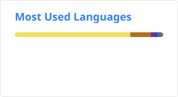

# 👋 Hi, I'm wb04307201

> Java / Spring 生态后端工程师，专注于中间件、分布式系统与 AI 应用开发。

  
  
  
  
  
  
  
  

  
  
  
  

<table>
  <tr>
    <td style="padding: 0 10px; border: none; text-align: center;">
      
    </td>
    <td style="padding: 0 10px; border: none; text-align: center;">
      
    </td>
  </tr>
</table>

## 🔧 开源项目

| #  | 项目                                        | 简介                                                                                                                                        |                                                                   Gitee                                                                   |                                                               GitHub                                                               |
|:--:|---------------------------------------------|---------------------------------------------------------------------------------------------------------------------------------------------|:-----------------------------------------------------------------------------------------------------------------------------------------:|:----------------------------------------------------------------------------------------------------------------------------------:|
| 1  | **File View** 文件在线预览               | 轻量级文件在线预览 Starter，开箱即用支持 docx/xlsx/pptx/PDF/BPMN/图片/视频/代码/3D 模型/CAD 等 20+ 种格式                                   |                        |                        |
| 2  | **Spring AI LoomAgent** 灵梭             | 为 Spring AI 应用一键注入 RAG 知识库、MCP 工具调用与 Skill 技能库，附开箱即用聊天 UI                                                        |  |  |
| 3  | **Flexible Lock** 灵锁                   | 分布式锁 Starter，支持 Redis/ZooKeeper 等多种实现，提供注解声明式与编程式两种使用方式                                                       |                |                |
| 4  | **Smart Router** 巧路由                  | 轻量级智能路由框架，支持动态路由规则、灰度发布与流量染色，实现请求灵活分发与负载均衡                                                        |                  |                  |
| 5  | **SQL Forge** SQL 工坊                   | 基于 Spring Boot 的数据库操作框架，集成 JSON CRUD、类型安全实体、SQL 模板、Calcite 跨库联邦查询、Amis 低代码可视化管理与 MCP AI 工具服务    |                        |                        |
| 6  | **Method Trace Log** 方法脉迹            | Spring Boot 非侵入式 AOP 方法追踪、调用链与告警。附带独立 MCP server（`methodTraceLog-mcp`），通过 stdio 向 AI agent 暴露同等能力           |              |              |
| 7  | **FlexSchedule** 灵动调度                | 基于 Spring Boot 的轻量化动态调度线程池，支持运行时动态添加、移除、替换定时任务                                                             |                |                |
| 8  | **dynamo-spring** 动态加载 Spring 工具包 | 动态加载和管理 Java 类的工具库，支持动态编译、AOP 代理、Spring Bean 管理。会话模型 ClassLoader、ByteBuddy 代理、子类化 Spring MVC、自动配置 |                |                |
| 9  | **pretty-log** 美化日志                  | 浏览器 console.log 美化工具，支持分级日志、彩色高亮与结构化输出，提升前端调试体验                                                           |                      |                      |
| 10 | **CHMCache** 缓存                        | 基于 ConcurrentHashMap 与 LRU 策略的轻量级缓存，支持自动过期、大小限制、LRU 淘汰与后台清理                                                  |                          |                          |
| 11 | **CHMRLock** 锁                          | 基于 ConcurrentHashMap + ReentrantLock 的细粒度单机锁库，每个 key 独立加锁，支持重入、租约与监控统计                                        |                          |                          |
| 12 | **dynamo-spring** 动态加载 Spring 工具包 | 动态加载和管理 Java 类的工具库，支持动态编译、AOP 代理、Spring Bean 管理。会话模型 ClassLoader、ByteBuddy 代理、子类化 Spring MVC、自动配置 |                |                |

## 📓 技术笔记

基于 Obsidian 维护的体系化技术笔记：**13 主模块** + `12.interview` 高频面试题（227 题）+ `13.story` 阿明餐厅叙事（50 篇），frontmatter 98.1% 覆盖、3 层沉淀模式保证可演进。→ [进入笔记](./note/README.md)

### 🔄 笔记库 CI 状态（实时）

> 4 个 workflow 每月 1 日串行跑（02:00/03:00/04:00/06:00），PR 触发即时反馈。

### 📊 笔记库健康度（2026-09-02）

| 维度 | 数量/状态 | 备注 |
|------|----------|------|
| **总 .md** | **1106** | 排除 `.health-tmp` / `.obsidian` |
| **frontmatter 覆盖** | **1085/1106 = 98.1%** | 21 个无 frontmatter 全为 SPEC/README 索引页 |
| **总 leaves（有 frontmatter）** | **925** | module 760 + question 227 + story 50 + 其他 48 |
| **结构断链** | **0** | Session 6 修复 230 处断链后闭环 |
| **orphan 目录** | **0** | 父 README 100% 回链 |
| **实质弱关联** | **0** | 235 处合规模板导航保留（G4 合规） |
| **5 维深度准确度（v18）** | **100%** | 80 篇偏差=0、偏差≤1 =100% |
| **18 轮迭代收敛** | v4 43% → **v18 100%** | 详见 [v18-sampling-report.md](./skills/note-health/references/v18-sampling-report.md) |

### 📊 主模块 depth 分布（v18 校准后，2026-09-02）

| 模块 | leaves | ⭐⭐⭐⭐⭐ | ⭐⭐⭐⭐ | ⭐⭐⭐ | ⭐⭐ | ⭐ | 均分 | 状态 |
|------|:---:|:---:|:---:|:---:|:---:|:---:|:---:|:---:|
| 01.java-and-jvm | 93 | 19 (20%) | 17 (18%) | 25 (27%) | 25 (27%) | 7 (8%) | 3.17 | ✅ |
| 02.cs-foundations | 43 | 19 (44%) | 9 (21%) | 4 (9%) | 9 (21%) | 2 (5%) | 3.79 | ✅ |
| 03.data-stack | 29 | 19 (66%) | 5 (17%) | 4 (14%) | 1 (3%) | 0 | 4.45 | ✅ |
| 04.spring-backend | 141 | 3 (2%) | 14 (10%) | 124 (88%) | 0 | 0 | 3.14 | ✅ |
| 05.frontend | 57 | 5 (9%) | 20 (35%) | 14 (25%) | 17 (30%) | 1 (2%) | 3.19 | ✅ |
| 06.distributed-systems | 161 | 27 (17%) | 53 (33%) | 54 (34%) | 19 (12%) | 8 (5%) | 3.45 | ✅ |
| 07.devops-and-tools | 47 | 11 (23%) | 6 (13%) | 18 (38%) | 7 (15%) | 5 (11%) | 3.23 | ✅ |
| 08.ai-foundations | 13 | 8 (62%) | 0 | 4 (31%) | 1 (8%) | 0 | 4.15 | ✅ |
| 09.ai-applications | 133 | 37 (28%) | 6 (5%) | 57 (43%) | 23 (17%) | 10 (8%) | 3.28 | ✅ |
| 10.business-systems | 38 | 23 (61%) | 5 (13%) | 1 (3%) | 9 (24%) | 0 | 4.11 | ✅ |
| 11.product-and-pm | 12 | 2 (17%) | 5 (42%) | 5 (42%) | 0 | 0 | 3.75 | ✅ |
| **合计** | **767** | **171 (22%)** | **140 (18%)** | **310 (40%)** | **111 (14%)** | **34 (4%)** | **3.50** | ✅ |

> **depth 含义**（主模块专用）：
> - ⭐ 入门：概念 + 简单示例
> - ⭐⭐ 进阶：原理 + 多语言示例
> - ⭐⭐⭐ 高级：源码级深度 + 版本演进
> - ⭐⭐⭐⭐ 引擎级：跨模块 + 性能优化
> - ⭐⭐⭐⭐⭐ 大师级：系统性深度 + 实战案例（≥7 跨模块 + 引擎源码）
>
> **5-dim 准确度 18 轮演进**：v4 (43%) → v5 (70%) → v12 (81.25% 自报) → v13 (33.75% 验证不成立) → v14 (36.2%) → **v16 突破 (100%)** → **v17 (98.8%)** → **v18 (100% 闭环)**
> 详见 [note-health skill 流程文档](./skills/note-health/references/main-module-depth.md) 与 [health-metrics-convergence.md](./skills/note-health/references/health-metrics-convergence.md)

### 📚 13 主模块导航

| # | 模块 | 主题 |
|:-:|------|------|
| 01 | [java-and-jvm](./note/01.java-and-jvm/) | Java 基础 + JVM + 并发 + 设计模式 |
| 02 | [cs-foundations](./note/02.cs-foundations/) | 算法 + OS + 网络 + 数学 |
| 03 | [data-stack](./note/03.data-stack/) | 数据库 + 缓存 + 大数据 |
| 04 | [spring-backend](./note/04.spring-backend/) | Spring + 后端框架 |
| 05 | [frontend](./note/05.frontend/) | 前端 |
| 06 | [distributed-systems](./note/06.distributed-systems/) | 分布式 + 微服务 + 云原生 |
| 07 | [devops-and-tools](./note/07.devops-and-tools/) | CI/CD + 监控 + 工具 |
| 08 | [ai-foundations](./note/08.ai-foundations/) | ML + DL + Transformer + LLM 基础 |
| 09 | [ai-applications](./note/09.ai-applications/) | RAG + Agent + Prompt + LLM 推理 |
| 10 | [business-systems](./note/10.business-systems/) | 电商 + 社交 + 金融 |
| 11 | [product-and-pm](./note/11.product-and-pm/) | 产品 + PM + 流程 |
| 12 | [interview](./note/12.interview/) | 高频面试题（**227 篇**，10 主题子目录） |
| 13 | [story](./note/13.story/) | 「阿明餐厅」技术系列（**50 篇**叙事层） |

## 🏆 主模块 L5 标杆文章 Top 30（每模块 ≥ 2）

> **depth: ⭐⭐⭐⭐⭐ 大师级** = 源码级 + 演进史 + ≥5 跨模块联动 + ≥5 层追问 + ≥3 真实生产案例
> 完整 171 篇 L5 分布见 [v18-sampling-report.md](./skills/note-health/references/v18-sampling-report.md)

| # | 模块 | 文章 | 5-dim 评分 | 行数 | 一句话心法 |
|---|------|------|-----------|------|-----------|
| 1 | 03.data-stack | [MySQL](note/03.data-stack/01-database/05-mysql/README.md) | 10/10 | 1000+ | InnoDB Buffer Pool + Redo Log + Binlog 三件套 |
| 2 | 03.data-stack | [Redis](note/03.data-stack/01-database/07-redis/README.md) | 10/10 | 1000+ | SDS + skiplist + quicklist + Cluster |
| 3 | 03.data-stack | [Elasticsearch](note/03.data-stack/01-database/08-nosql/elasticsearch/README.md) | 10/10 | 800+ | 倒排索引 + BM25 + kNN |
| 4 | 03.data-stack | [PostgreSQL](note/03.data-stack/01-database/13-postgresql/README.md) | 10/10 | 800+ | heap tuple MVCC + 扩展生态 |
| 5 | 06.distributed-systems | [CAP](note/06.distributed-systems/02-distributed/cap-and-base/cap/README.md) | 10/10 | 600+ | ZAB / Cassandra 源码 + PACELC |
| 6 | 06.distributed-systems | [Raft](note/06.distributed-systems/02-distributed/consensus-algorithms/raft/README.md) | 10/10 | 700+ | etcd-raft 调优 + PreVote + LeaderLease |
| 7 | 06.distributed-systems | [Paxos](note/06.distributed-systems/02-distributed/consensus-algorithms/paxos/README.md) | 10/10 | 700+ | Multi-Paxos / Raft 演进 |
| 8 | 06.distributed-systems | [Circuit-Breaker](note/06.distributed-systems/03-high-availability/circuit-break/README.md) | 10/10 | 800+ | Resilience4j Spring Boot 3 全配置 |
| 9 | 06.distributed-systems | [MQ](note/06.distributed-systems/04-high-performance/mq/README.md) | 10/10 | 900+ | Kafka 零拷贝 + RocketMQ 半消息 |
| 10 | 06.distributed-systems | [Cache-Patterns](note/06.distributed-systems/04-high-performance/cache-patterns/README.md) | 10/10 | 1000+ | 4 模式 + Spring 5 陷阱 + 多级缓存 |
| 11 | 09.ai-applications | [ab-testing-design](note/09.ai-applications/agent/agent-evaluation/02-ab-testing-design/README.md) | 10/10 | 800+ | 5 大组件 + 4 流量分配 + Bonferroni |
| 12 | 09.ai-applications | [vector-search-at-scale](note/09.ai-applications/rag/vector-search-at-scale/README.md) | 10/10 | 700+ | 10B/100B/1T 三级架构 |
| 13 | 09.ai-applications | [kv-cache](note/09.ai-applications/llm-inference/kv-cache/README.md) | 10/10 | 600+ | MQA / GQA / MLA 全家桶 |
| 14 | 09.ai-applications | [PEFT-LoRA](note/09.ai-applications/fine-tuning/06-peft-lora.md) | 10/10 | 772 | NF4 / DoRA / AdaLoRA / LongLoRA |
| 15 | 09.ai-applications | [prompt-engineering](note/09.ai-applications/prompts/prompt-engineering/README.md) | 10/10 | 1000 | CoT / ReAct / Self-Consistency |
| 16 | 09.ai-applications | [agent-spec-tools](note/09.ai-applications/agent/agent-spec-tools/README.md) | 10/10 | 760 | function calling / MCP / tool use |
| 17 | 09.ai-applications | [agent-architecture](note/09.ai-applications/agent/agent-architecture/README.md) | 10/10 | 1628 | 6 模式 + 4 协议 + 6 框架 |
| 18 | 09.ai-applications | [agent-execution-patterns](note/09.ai-applications/agent/agent-execution-patterns/README.md) | 10/10 | 698 | ReAct / Plan-Execute / Reflexion |
| 19 | 02.cs-foundations | [memory](note/02.cs-foundations/02-os/memory/README.md) | 10/10 | 800+ | 虚拟内存 + 缺页 + LRU |
| 20 | 02.cs-foundations | [processes](note/02.cs-foundations/02-os/processes/README.md) | 10/10 | 700+ | 进程调度 + 信号量 + IPC |
| 21 | 02.cs-foundations | [HTTPS-TLS](note/02.cs-foundations/03-network/04-https-tls/README.md) | 10/10 | 700+ | TLS 1.2/1.3 + 0-RTT + OCSP |
| 22 | 02.cs-foundations | [AC-Automaton](note/02.cs-foundations/01-algorithms/string-algorithms/03-ac-automaton.md) | 10/10 | 600+ | Aho-Corasick fail 指针 |
| 23 | 10.business-systems | [ERP](note/10.business-systems/05-operations/erp/README.md) | 10/10 | 800+ | 模块 + 集成 + 国产化 |
| 24 | 10.business-systems | [SCM](note/10.business-systems/03-supply-chain/scm/README.md) | 10/10 | 900+ | 宝洁 CPFR / 丰田 JIT |
| 25 | 10.business-systems | [BPM](note/10.business-systems/05-operations/bpm/README.md) | 10/10 | 800+ | Camunda 8 / Zeebe |
| 26 | 07.devops-and-tools | [Temporal](note/07.devops-and-tools/02-workflow/temporal/README.md) | 10/10 | 700+ | Saga + 工作流引擎 |
| 27 | 07.devops-and-tools | [Zeebe](note/07.devops-and-tools/02-workflow/process-engine/camunda/camunda-8/zeebe/README.md) | 10/10 | 800+ | Camunda 8 分布式引擎 |
| 28 | 07.devops-and-tools | [cicd-adoption](note/07.devops-and-tools/01-tools/devops/07-cicd-adoption/README.md) | 10/10 | 700+ | ROI 模型 + 康威定律 |
| 29 | 05.frontend | [Vue 大列表优化](note/05.frontend/03-frameworks/vue/large-list-perf/README.md) | 10/10 | 800+ | Vue 3 reactivity 源码 + 1万条 benchmark |
| 30 | 05.frontend | [HTML in Canvas](note/05.frontend/01-foundation/browser-rendering/html-in-canvas/README.md) | 9/10 | 500+ | WICG 提案 + paint 事件 Option A/B/C |

> **应用场景**：这些 L5 文章是各主题的"大师级"标杆，适合：
> 1. **深度学习入口**：从 L5 反向链接逆推到所有相关主模块 leaf
> 2. **面试准备**：与 12.interview ⭐⭐⭐⭐⭐ 高频题一一对应（见 [mapping 文档](skills/note-health/references/interview-main-mapping.md)）
> 3. **晋升答辩**：源码级深度 + 跨模块联动 + 实战案例的完整范本

## 📬 联系方式

| 平台 | 链接 |
|------|------|
| Gitee | [wb04307201](https://gitee.com/wb04307201) |
| GitHub | [wb04307201](https://github.com/wb04307201) |

## 反向链

- [CONTRIBUTING](note/SPEC.md)
