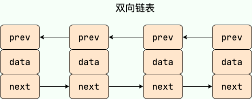
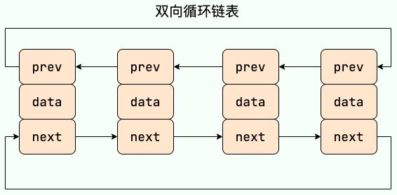
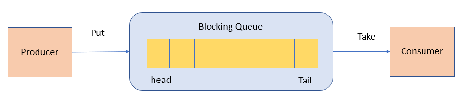

# 集合

## 集合框架底层数据结构
### List
> - **ArrayList**：`Object[]`数组。
> - **Vector**：`Object[]`数组。
> - **LinkedList**：双向链表(JDK1.6 之前为循环链表，JDK1.7 取消了循环)。
### Set
> - **HashSet(无序，唯一)**：基于`HashMap`实现的，底层采用`HashMap`来保存元素。
> - **LinkedHashSet**：`LinkedHashSet`是`HashSet`的子类，并且其内部是通过`LinkedHashMap`来实现的。
> - **TreeSet(有序，唯一)**：红黑树(自平衡的排序二叉树)。
### Queue
> - **PriorityQueue**：`Object[]`数组来实现小顶堆。
> - **DelayQueue**：`PriorityQueue`。
> - **ArrayDeque**：可扩容动态双向数组。
### Map
> - **HashMap**：JDK1.8 之前`HashMap`由数组+链表组成的，数组是 HashMap 的主体，链表则是主要为了解决哈希冲突而存在的（“拉链法”解决冲突）。JDK1.8 以后在解决哈希冲突时有了较大的变化，当链表长度大于阈值（默认为 8）（将链表转换成红黑树前会判断，如果当前数组的长度小于 64，那么会选择先进行数组扩容，而不是转换为红黑树）时，将链表转化为红黑树，以减少搜索时间。
> - **LinkedHashMap**：`LinkedHashMap`继承自`HashMap`，所以它的底层仍然是基于拉链式散列结构即由数组和链表或红黑树组成。另外，`LinkedHashMap`在上面结构的基础上，增加了一条双向链表，使得上面的结构可以保持键值对的插入顺序。同时通过对链表进行相应的操作，实现了访问顺序相关逻辑。
> - **Hashtable**：数组+链表组成的，数组是`Hashtable`的主体，链表则是主要为了解决哈希冲突而存在的。
> - **TreeMap**：红黑树（自平衡的排序二叉树）。
## List, Set, Queue, Map 四者的区别
> - **List(对付顺序的好帮手)**：存储的元素是有序的、可重复的。
> - **Set(注重独一无二的性质)**：存储的元素不可重复的。
> - **Queue(实现排队功能的叫号机)**：按特定的排队规则来确定先后顺序，存储的元素是有序的、可重复的。
> - **Map(用 key 来搜索的专家)**：使用键值对（key-value）存储，类似于数学上的函数 y=f(x)，"x" 代表 key，"y" 代表 value，key 是无序的、不可重复的，value 是无序的、可重复的，每个键最多映射到一个值。
## 集合的使用场景
> - 需要根据键值获取到元素值时选择`Map`接口下的集合
> - 需要排序时选择`TreeMap`
> - 不需要排序时选择`HashMap`
> - 需要保证线程安全选择`ConcurrentHashMap`
> - 只需要存放元素值时选择实现`Collection`接口的集合
> - 需要保证元素唯一时选择实现`Set`接口的集合比如`TreeSet`或`HashSet`
> - 不需要就选择实现`List`接口的比如`ArrayList`或`LinkedList`，然后再根据实现这些接口的集合的特点来选用

## List
### ArrayList 和 Array（数组）的区别
> `ArrayList`内部基于动态数组实现，比`Array`（静态数组）使用起来更加灵活：
>   - `ArrayList`会根据实际存储的元素动态地扩容或缩容，而`Array`被创建之后就不能改变它的长度了。
>   - `ArrayList`允许你使用泛型来确保类型安全，`Array`则不可以。
>   - `ArrayList`中只能存储对象。对于基本类型数据，需要使用其对应的包装类（如`Integer`、`Double`等）。`Array`可以直接存储基本类型数据，也可以存储对象。
>   - `ArrayList`支持插入、删除、遍历等常见操作，并且提供了丰富的 API 操作方法，比如`add()`、`remove(`)等。`Array`只是一个固定长度的数组，只能按照下标访问其中的元素，不具备动态添加、删除元素的能力。
>   - `ArrayList`创建时不需要指定大小，而`Array`创建时必须指定大小。  
> 
> 使用的对比：
> - `Array`
> ```java
> // 初始化一个 String 类型的数组
> String[] stringArr = new String[]{"hello", "world", "!"};
> // 修改数组元素的值
> stringArr[0] = "goodbye";
> System.out.println(Arrays.toString(stringArr));// [goodbye, world, !]
> // 删除数组中的元素，需要手动移动后面的元素
> for (int i = 0; i < stringArr.length - 1; i++) {
> stringArr[i] = stringArr[i + 1];
> }
> stringArr[stringArr.length - 1] = null;
> System.out.println(Arrays.toString(stringArr));// [world, !, null]
> ```
> - `ArrayList`
> ```java
> // 初始化一个 String 类型的 ArrayList
> ArrayList<String> stringList = new ArrayList<>(Arrays.asList("hello", "world", "!"));
> // 添加元素到 ArrayList 中
> stringList.add("goodbye");
> System.out.println(stringList);// [hello, world, !, goodbye]
> // 修改 ArrayList 中的元素
> stringList.set(0, "hi");
> System.out.println(stringList);// [hi, world, !, goodbye]
> // 删除 ArrayList 中的元素
> stringList.remove(0);
> System.out.println(stringList); // [world, !, goodbye]
> ```
### `ArrayList`插入和删除元素的时间复杂度
#### 插入
> - **头部插入**：由于需要将所有元素都依次向后移动一个位置，因此时间复杂度是`O(n)`。
> - **尾部插入**：当 ArrayList 的容量未达到极限时，往列表末尾插入元素的时间复杂度是`O(1)`，因为它只需要在数组末尾添加一个元素即可；当容量已达到极限并且需要扩容时，则需要执行一次`O(n)`的操作将原数组复制到新的更大的数组中，然后再执行`O(1)`的操作添加元素。
> - **指定位置插入**：需要将目标位置之后的所有元素都向后移动一个位置，然后再把新元素放入指定位置。这个过程需要移动平均 n/2 个元素，因此时间复杂度为`O(n)`。
#### 删除
> - **头部删除**：由于需要将所有元素依次向前移动一个位置，因此时间复杂度是`O(n)`。
> - **尾部删除**：当删除的元素位于列表末尾时，时间复杂度为`O(1)`。
> - **指定位置删除**：需要将目标元素之后的所有元素向前移动一个位置以填补被删除的空白位置，因此需要移动平均 n/2 个元素，时间复杂度为`O(n)`。
### `LinkedList`插入和删除元素的时间复杂度
> - **头部插入/删除**：只需要修改头结点的指针即可完成插入/删除操作，因此时间复杂度为`O(1)`。
> - **尾部插入/删除**：只需要修改尾结点的指针即可完成插入/删除操作，因此时间复杂度为`O(1)`。
> - **指定位置插入/删除**：需要先移动到指定位置，再修改指定节点的指针完成插入/删除，因此需要遍历平均 n/2 个元素，时间复杂度为`O(n)`。
### `LinkedList`的`RandomAccess`接口
> `RandomAccess`是一个标记接口，用来表明实现该接口的类支持随机访问（即可以通过索引快速访问元素）。  
> 由于`LinkedList`底层数据结构是链表，内存地址不连续，只能通过指针来定位，不支持随机快速访问，所以不能实现 RandomAccess 接口。
### `ArrayList`与`LinkedList`的区别
> - **是否保证线程安全**：`ArrayList`和`LinkedList`都是不同步的，也就是不保证线程安全
> - **底层数据结构**：`ArrayList`底层使用的是`Object`数组，`LinkedList`底层使用的是 双向链表 数据结构（JDK1.6 之前为循环链表，JDK1.7 取消了循环。注意双向链表和双向循环链表的区别，下面有介绍到！）
> - **插入和删除是否受元素位置的影响**：
>   - `ArrayList`采用数组存储，所以插入和删除元素的时间复杂度受元素位置的影响。 比如：执行`add(E e)`方法的时候，`ArrayList`会默认在将指定的元素追加到此列表的末尾，这种情况时间复杂度就是`O(1)`。但是如果要在指定位置 i 插入和删除元素的话（`add(int index, E element)`），时间复杂度就为`O(n)`。因为在进行上述操作的时候集合中第 i 和第 i 个元素之后的(n-i)个元素都要执行向后位/向前移一位的操作。
>   - `LinkedList`采用链表存储，所以在头尾插入或者删除元素不受元素位置的影响（`add(E e)`、`addFirst(E e)`、`addLast(E e)`、`removeFirst()`、 `removeLast()`），时间复杂度为`O(1)`，如果是要在指定位置 i 插入和删除元素的话（`add(int index, E element)`，`remove(Object o)`,`remove(int index)`）， 时间复杂度为`O(n)`，因为需要先移动到指定位置再插入和删除。
> - **是否支持快速随机访问**：`LinkedList`不支持高效的随机元素访问，而`ArrayList`（实现了`RandomAccess`接口） 支持。快速随机访问就是通过元素的序号快速获取元素对象(对应于`get(int index)`方法)。
> - **内存空间占用**：`ArrayList`的空间浪费主要体现在在`list`列表的结尾会预留一定的容量空间，而`LinkedList`的空间花费则体现在它的每一个元素都需要消耗比`ArrayList`更多的空间（因为要存放直接后继和直接前驱以及数据）。
#### 双向链表和双向循环链表
> - **双向链表**：包含两个指针，一个`prev`指向前一个节点，一个`next`指向后一个节点。
> 
> - **双向循环链表**：最后一个节点的`next`指向`head`，而`head`的`prev`指向最后一个节点，构成一个环。
> 


## Set
### Comparable 和 Comparator 的区别
> - `Comparable`接口来自`java.lang`包，它有一个`compareTo(Object obj)`方法用来排序
> - `Comparator`接口来自`java.util`包，它有一个`compare(Object obj1, Object obj2)`方法用来排序
#### Comparator 定制排序
```java
ArrayList<Integer> arrayList = new ArrayList<Integer>();
arrayList.add(-1);
arrayList.add(3);
arrayList.add(3);
arrayList.add(-5);
arrayList.add(7);
arrayList.add(4);
arrayList.add(-9);
arrayList.add(-7);
System.out.println("原始数组:");
System.out.println(arrayList);
// void reverse(List list)：反转
Collections.reverse(arrayList);
System.out.println("Collections.reverse(arrayList):");
System.out.println(arrayList);

// void sort(List list),按自然排序的升序排序
Collections.sort(arrayList);
System.out.println("Collections.sort(arrayList):");
System.out.println(arrayList);
// 定制排序的用法
Collections.sort(arrayList, new Comparator<Integer>() {
    @Override
    public int compare(Integer o1, Integer o2) {
        return o2.compareTo(o1);
    }
});
System.out.println("定制排序后：");
System.out.println(arrayList);
```
#### 重写 compareTo 方法实现按年龄来排序
```java
// person对象没有实现Comparable接口，所以必须实现，这样才不会出错，才可以使treemap中的数据按顺序排列
// 前面一个例子的String类已经默认实现了Comparable接口，详细可以查看String类的API文档，另外其他
// 像Integer类等都已经实现了Comparable接口，所以不需要另外实现了
public  class Person implements Comparable<Person> {
    private String name;
    private int age;

    public Person(String name, int age) {
        super();
        this.name = name;
        this.age = age;
    }

    public String getName() {
        return name;
    }

    public void setName(String name) {
        this.name = name;
    }

    public int getAge() {
        return age;
    }

    public void setAge(int age) {
        this.age = age;
    }

    /**
     * T重写compareTo方法实现按年龄来排序
     */
    @Override
    public int compareTo(Person o) {
        if (this.age > o.getAge()) {
            return 1;
        }
        if (this.age < o.getAge()) {
            return -1;
        }
        return 0;
    }
}
```
### 无序性和不可重复性的含义
> - 无序性不等于随机性 ，无序性是指存储的数据在底层数组中并非按照数组索引的顺序添加 ，而是根据数据的哈希值决定的。
> - 不可重复性是指添加的元素按照`equals()`判断时 ，返回`false`，需要同时重写`equals()`方法和`hashCode()`方法。
### `HashSet`、`LinkedHashSet`和`TreeSet`三者的异同
> - `HashSet`、`LinkedHashSet`和`TreeSet`都是`Set`接口的实现类，都能保证元素唯一，并且都不是线程安全的。
> - `HashSet`、`LinkedHashSet`和`TreeSet`的主要区别在于底层数据结构不同。HashSet 的底层数据结构是哈希表（基于`HashMap`实现）。`LinkedHashSet`的底层数据结构是链表和哈希表，元素的插入和取出顺序满足 FIFO。`TreeSet`底层数据结构是红黑树，元素是有序的，排序的方式有自然排序和定制排序。
> - 底层数据结构不同又导致这三者的应用场景不同。`HashSet`用于不需要保证元素插入和取出顺序的场景，`LinkedHashSet`用于保证元素的插入和取出顺序满足 FIFO 的场景，`TreeSet`用于支持对元素自定义排序规则的场景。

## Queue
### Queue 与 Deque 的区别
#### Queue 是单端队列，只能从一端插入元素，另一端删除元素，实现上一般遵循<font color="red">先进先出（FIFO）</font>规则。
> `Queue`扩展了`Collection`的接口，根据<font color="red">因为容量问题而导致操作失败后处理方式的不同</font>可以分为两类方法: 一种在操作失败后会抛出异常，另一种则会返回特殊值。

| `Queue`接口 | 抛出异常      | 返回特殊值      |
|-----------|-----------|------------|
| 插入队尾      | add(E e)  | offer(E e) |
| 删除队首      | remove()  | poll()     |
| 查询队首元素    | element() | peek()     |
#### Deque 是双端队列，在队列的两端均可以插入或删除元素。
> `Deque`扩展了`Queue`的接口, 增加了在队首和队尾进行插入和删除的方法，同样根据失败后处理方式的不同分为两类：

| `Deque`接口 | 抛出异常           | 返回特殊值           |
|-----------|----------------|-----------------|
| 插入队首	     | addFirst(E e)	 | offerFirst(E e) |
| 插入队尾	     | addLast(E e)	  | offerLast(E e)  |
| 删除队首	     | removeFirst()	 | pollFirst()     |
| 删除队尾	     | removeLast()	  | pollLast()      |
| 查询队首元素	   | getFirst()	    | peekFirst()     |
| 查询队尾元素	   | getLast()	     | peekLast()      |
> Deque 还提供有 push() 和 pop() 等其他方法，可用于模拟栈。
### `ArrayDeque`与`LinkedList`的区别
> `ArrayDeque`和`LinkedList`都实现了`Deque`接口，两者都具有队列的功能，两者的区别：
> - `ArrayDeque`是基于可变长的数组和双指针来实现，而`LinkedList`则通过链表来实现。
> - `ArrayDeque`不支持存储`NULL`数据，但`LinkedList`支持。
> - `ArrayDeque`是在 JDK1.6 才被引入的，而`LinkedList`早在 JDK1.2 时就已经存在。
> - ArrayDeque`插入时可能存在扩容过程, 不过均摊后的插入操作依然为`O(1)`。虽然`LinkedList`不需要扩容，但是每次插入数据时均需要申请新的堆空间，均摊性能相比更慢。  
> `ArrayDeque`实现队列比`LinkedList`性能更好，`ArrayDeque`也可以用于实现栈。
### PriorityQueue
> `PriorityQueue`是在 JDK1.5 中被引入的, 其与 Queue 的区别在于元素出队顺序是与优先级相关的，即总是优先级最高的元素先出队。
> - 利用了二叉堆的数据结构来实现的，底层使用可变长的数组来存储数据
> - 通过堆元素的上浮和下沉，实现了在`O(logn)`的时间复杂度内插入元素和删除堆顶元素。
> - 是非线程安全的，且不支持存储`NULL`和`non-comparable`的对象。
> - 默认是小顶堆，但可以接收一个`Comparator`作为构造参数，从而来自定义元素优先级的先后。
### BlockingQueue
> `BlockingQueue`（阻塞队列）是一个接口，继承自`Queue`。  
> `BlockingQueue`阻塞的原因是其支持当队列没有元素时一直阻塞，直到有元素；还支持如果队列已满，一直等到队列可以放入新元素时再放入。
#### 使用场景
> 常用于生产者-消费者模型中，生产者线程会向队列中添加数据，而消费者线程会从队列中取出数据进行处理。
> 
#### BlockingQueue 的实现类

> - **ArrayBlockingQueue**：使用数组实现的有界阻塞队列。在创建时需要指定容量大小，并支持公平和非公平两种方式的锁访问机制。
> - **LinkedBlockingQueue**：使用单向链表实现的可选有界阻塞队列。在创建时可以指定容量大小，如果不指定则默认为Integer.MAX_VALUE。和ArrayBlockingQueue不同的是， 它仅支持非公平的锁访问机制。
> - **PriorityBlockingQueue**：支持优先级排序的无界阻塞队列。元素必须实现Comparable接口或者在构造函数中传入Comparator对象，并且不能插入 null 元素。
> - **SynchronousQueue**：同步队列，是一种不存储元素的阻塞队列。每个插入操作都必须等待对应的删除操作，反之删除操作也必须等待插入操作。因此，SynchronousQueue通常用于线程之间的直接传递数据。
> - **DelayQueue**：延迟队列，其中的元素只有到了其指定的延迟时间，才能够从队列中出队。
> - **……**
#### ArrayBlockingQueue 和 LinkedBlockingQueue 的异同
##### 相同点
> 都是线程安全的
##### 不同点
> - **底层实现**：`ArrayBlockingQueue`基于数组实现，而`LinkedBlockingQueue`基于链表实现。
> - **是否有界**：`ArrayBlockingQueue`是有界队列，必须在创建时指定容量大小。`LinkedBlockingQueue`创建时可以不指定容量大小，默认是`Integer.MAX_VALUE`，也就是无界的。但也可以指定队列大小，从而成为有界的。
> - **锁是否分离**：`ArrayBlockingQueue`中的锁是没有分离的，即生产和消费用的是同一个锁；`LinkedBlockingQueue`中的锁是分离的，即生产用的是`putLock`，消费是`takeLock`，这样可以防止生产者和消费者线程之间的锁争夺。
> - **内存占用**：`ArrayBlockingQueue`需要提前分配数组内存，而`LinkedBlockingQueue`则是动态分配链表节点内存。这意味着，`ArrayBlockingQueue`在创建时就会占用一定的内存空间，且往往申请的内存比实际所用的内存更大，而`LinkedBlockingQueue`则是根据元素的增加而逐渐占用内存空间。


