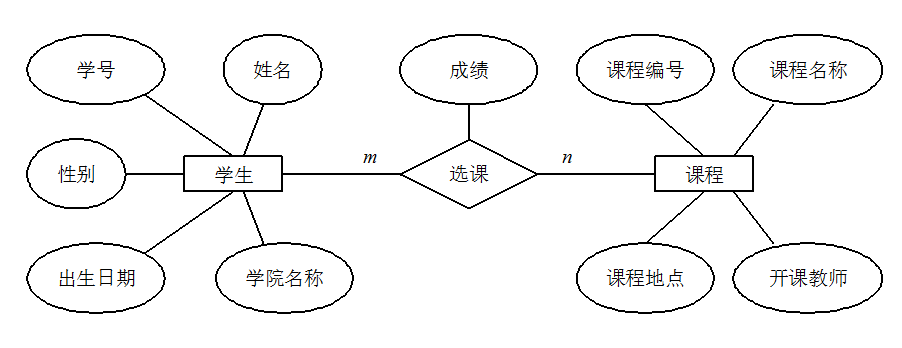

# 基础

## 数据库基础知识
### 数据库,数据库管理系统,数据库系统,数据库管理员的定义
> - **数据库**：数据库(DataBase 简称 DB)就是信息的集合或者说数据库是由数据库管理系统管理的数据的集合。
> - **数据库管理系统**：数据库管理系统(Database Management System 简称 DBMS)是一种操纵和管理数据库的大型软件，通常用于建立、使用和维护数据库。
> - **数据库系统**：数据库系统(Data Base System，简称 DBS)通常由软件、数据库和数据管理员(DBA)组成。
> - **数据库管理员**：数据库管理员(Database Administrator, 简称 DBA)负责全面管理和控制数据库系统。
### 元组,码,候选码,主码,外码,主属性,非主属性的定义
> - **元组**：元组（tuple）是关系数据库中的基本概念，关系是一张表，表中的每行（即数据库中的每条记录）就是一个元组，每列就是一个属性。 在二维表里，元组也称为行。
> - **码**：码就是能唯一标识实体的属性，对应表中的列。
> - **候选码**：若关系中的某一属性或属性组的值能唯一的标识一个元组，而其任何、子集都不能再标识，则称该属性组为候选码。例如：在学生实体中，“学号”是能唯一的区分学生实体的，同时又假设“姓名”、“班级”的属性组合足以区分学生实体，那么{学号}和{姓名，班级}都是候选码。
> - **主码**：主码也叫主键。主码是从候选码中选出来的。 一个实体集中只能有一个主码，但可以有多个候选码。
> - **外码**：外码也叫外键。如果一个关系中的一个属性是另外一个关系中的主码则这个属性为外码。
> - **主属性**：候选码中出现过的属性称为主属性。比如关系 工人（工号，身份证号，姓名，性别，部门）. 显然工号和身份证号都能够唯一标示这个关系，所以都是候选码。工号、身份证号这两个属性就是主属性。如果主码是一个属性组，那么属性组中的属性都是主属性。
> - **非主属性**：不包含在任何一个候选码中的属性称为非主属性。比如在关系——学生（学号，姓名，年龄，性别，班级）中，主码是“学号”，那么其他的“姓名”、“年龄”、“性别”、“班级”就都可以称为非主属性。
### ER 图的定义
> ER 图 全称是 Entity Relationship Diagram（实体联系图），提供了表示实体类型、属性和联系的方法。
> ER 图由下面 3 个要素组成：
>   - **实体**：通常是现实世界的业务对象，当然使用一些逻辑对象也可以。比如对于一个校园管理系统，会涉及学生、教师、课程、班级等等实体。在 ER 图中，实体使用矩形框表示。
>   - **属性**：即某个实体拥有的属性，属性用来描述组成实体的要素，对于产品设计来说可以理解为字段。在 ER 图中，属性使用椭圆形表示。
>   - **联系**：即实体与实体之间的关系，在 ER 图中用菱形表示，这个关系不仅有业务关联关系，还能通过数字表示实体之间的数量对照关系。例如，一个班级会有多个学生就是一种实体间的联系。
> 
> 学生选课的 ER 图，每个学生可以选若干门课程，同一门课程也可以被若干人选择，所以它们之间的关系是多对多（M: N）。另外，还有其他两种实体之间的关系是：1 对 1（1:1）、1 对多（1: N）。  
> 