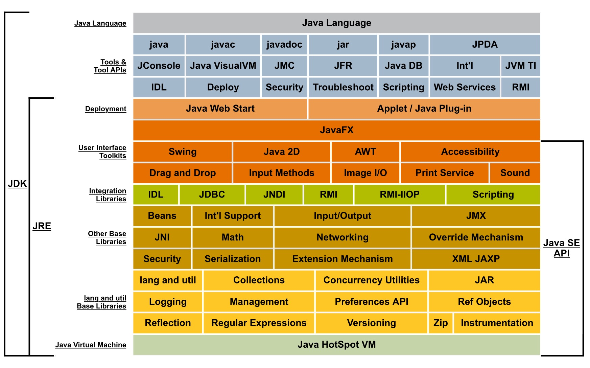
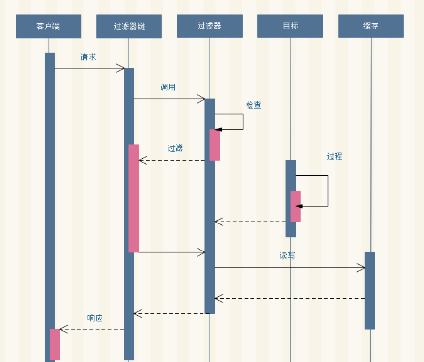
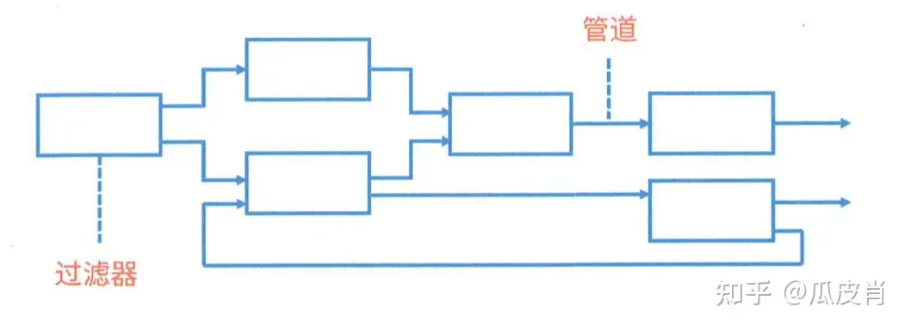
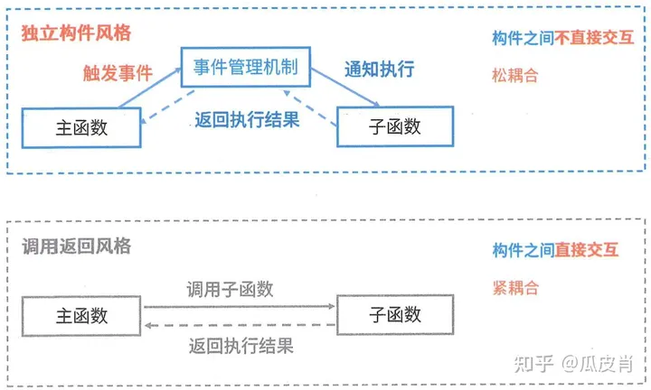
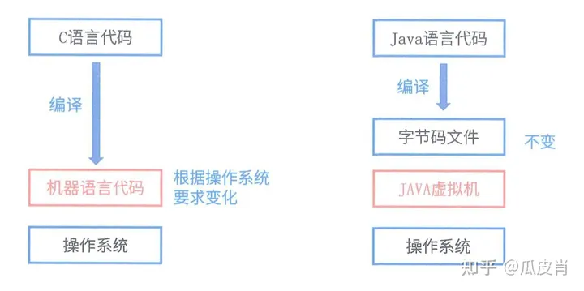

# 软件架构设计

## 软件架构的概念
### 定义
> 软件架构为软件系统提供了一个结构、行为和属性的高级抽象；  
> 软件架构风格是特定应用领域的惯用模式，架构定义一个词汇表和一组约束。
### 目的
> 软件架构是项目干系人进行交流的手段；  
> 软件架构是可传递和可复用的模型，通过研究软件架构可预测软件的质量；  
> 软件架构使推理和控制的更改更加简单，有助于循序渐进的原型设计，可以作为培训的基础。
### 架构的“4+1”视图

> - **场景视图（也叫用例视图）**：黑盒视图。从外部视角，描述系统的参与者（用户）与系统功能用例的关系。反映的是系统的最终用户需求和交互设计。  
> *在UML中通常用用例图表示*：  
>   

> - **逻辑视图（也叫结构视图）**：白盒视图。从结构化视角，描述该系统对用户提供的所需功能服务所具备的组件结构和数据结构，以及一些边界约束条件，清晰的描述给用户提供的功能需求服务是如何构建的。描述该系统内部所具备了那些组织结构，以达到实现对外功能。
> 

> - **开发视图（也叫实现视图）**：白盒视图。从结构化视角和行为视角，去描述实现系统功能的各个组件和模块是如何实现的。
> 

> - **处理视图（也叫过程视图、行为视图）**：白盒视图。从行为视角，描述系统各个组件和模块是如何进行通信的。
> 

> - **物理视图（也叫部署视图）**：黑盒视图。从交互视角，描述系统可以部署到哪些物理环境（如服务器、PC端、移动端等）上和软件环境（如虚拟机、容器、进程等）上。  
> *在UML中通常由部署图表示*：  
> 
### 优势和不足
#### 优势
> - **多视角的全面性**：4+1视图模型通过逻辑视图、开发视图、物理视图、过程视图和场景视图五个不同的维度，全面描述了一个软件系统的各个方面。这种多视角的方法使得系统设计更为清晰、完整，便于开发团队全面理解和把握系统设计。
> - **易于理解和沟通**：每个视图关注系统的不同方面，通过特定的抽象层次和表示工具（如UML图）来表示，使得复杂系统的设计变得更为直观和易于理解。这有助于开发团队之间的沟通和协作，提高开发效率。
> - **实际问题的解决能力**：4+1视图模型不仅仅是理论上的创新，更是基于实际软件开发过程中的经验和需求。这使得该模型在解决实际问题时表现出色，尤其是在大型和复杂系统的设计中。
> - **教育和指导价值**：除了模型本身，Philippe Kruchten还致力于通过讲座、研讨会和出版物等方式，将自己的知识和经验传授给下一代软件工程师。这使得4+1视图模型在软件工程教育和培训中具有重要的价值。
#### 不足
> - **更新和同步的挑战**：由于4+1视图模型涉及多个视图，当系统需求或设计发生变化时，需要确保所有视图都进行相应的更新和同步。这可能会带来一定的复杂性和挑战，需要开发团队具备高度的协同能力。
> - **视图之间的依赖性**：不同视图之间存在一定的依赖性，如逻辑视图和开发视图之间的关联。当其中一个视图发生变化时，可能会影响到其他视图。因此，在设计和维护过程中需要仔细考虑视图之间的依赖关系，确保系统的一致性和正确性。
> - **工具和方法的支持**：尽管4+1视图模型在理论上具有优势，但在实际应用中，可能缺乏足够的工具和方法支持。这可能会增加实现的难度和复杂性，需要开发团队具备较高的技能和经验。

## 软件架构的风格
### 数据流风格
#### 分类
> - **批处理序列**：大量整体数据、无用户交互。  
> 
> 
> - **管道/过滤器**：流式数据、弱用户交互。  
> 
#### 优缺点和典型场景
##### 优点
> - 良好的隐蔽性、可维护性。
> - 支持并行提升性能。
> - 松耦合。
> - 良好的可扩展性、可重用性。
##### 缺点
> - 灵活性较差，处理流程确定后不易改变。
> - 性能较差，每个过滤器构件都需要解析和合成数据。
> - 交互性较差，全局变量的共享很困难。
> - 复杂性较高，引入并行处理机制增加了系统复杂度。
##### 典型实例
> - 传统编译器网络报文处理
### 调用/返回风格
> 在系统中采用了调用与返回机制
#### 分类
> - **主程序/子程序**：传统的函数调用机制。  
> 
> 
> - **面向对象-对象的方法调用**  
> 
> 
> - **层次架构-层与层之间的调用**  
>   
> [更多层次架构的风格介绍](#层次架构的风格)
#### 优缺点和特点
##### 优点
> - 良好的重用性，只要接口不变可用在其他处
> - 可维护性好
> - 可扩展性好，支持递增设计
##### 缺点
> - 并不是每个系统都方便分层
> - 很难找到一个合适的、正确的层次抽象方法
> - 不同层次之间耦合度高的系统很难实现
##### 特点
> - 各个层次的组件形成不同功能级别的虚拟机
> - 多层相互协同工作，而且实现透明
### 独立构件风格
> 独立构件风格主要强调系统中的每个构件都是相对独立的个体，它们之间不直接通信，以降低耦合度，提升灵活性。
#### 分类
> - **进程通信**：不同进程之间的通信。
> - **事件系统**：隐式调用、广播机制等。  
> 
#### 优缺点和特点
##### 优点
> - 松耦合
> - 良好的重用性、可修改性、可扩展性
##### 缺点
> - 构件放弃了对系统计算的控制，一个构件触发一个构件时，不能确定其他构件是否会响应它，而且即使它知道事件注册了哪些构件过程，它也不能保证这些过程被调用的顺序；
> - 数据交换的问题；
> - 既然过程的语义必须依赖于被触发事件的上下文约束，关于正确性的推理就存在问题
##### 特点
> - 系统由若干子系统构成且成为一个整体，系统有统一的目标，子系统有主从之分，每一子系统有自己的事件收集和处理机制
### 虚拟机风格
#### 分类
> - **解释器**：如Java虚拟机。  
> 
> 
> - **基于规则的系统**：如专家系统。
#### 优缺点、特点和场景
<table>
<thead>
<tr><th>子分类</th><th>优点</th><th>缺点</th><th>特点</th><th>场景</th></tr>
</thead>
<tbody>
<tr><td>解释器</td><td rowspan="2">可以灵活应对自定义场景</td><td rowspan="2">复杂度较高</td><td></td><td>适用于需要“自定义规则”的场合</td></tr>
<tr><td>规则为中心</td><td>在解释器的基础上增加经验规则</td><td>适用于专家系统</td></tr>
</tbody>
</table>

### 仓库风格
> 以数据为中心的软件架构风格
#### 分类
> - **数据库系统**  
> 
> 
> - **超文本系统**：超文本系统是基于超文本和超媒体的信息管理和展示系统，它允许文档之间通过链接相互关联，支持文本、图片、视频等多种媒体格式。
> 
> - **黑板系统**：在以数据为中心的基础上，使用中心数据触发业务逻辑部件，常用于人工智能、信号处理等领域。  
> 
#### 优缺点
##### 优点
> - 解决问题的多方法性
> - 具有可更改性和可维护性
> - 有可重用的知识源
> - 支持容错性和健壮性
##### 缺点
> - 测试困难。由于黑板模式的系统有中央系统构件来描述系统的体现系统的状态，所以系统的执行没有确定的顺序，其结果的再现性差，难于测试
> - 不能保证有好的解决方案
> - 效率低
> - 开发成本高
> - 缺少对并行机的支持
### 闭环控制架构（过程控制）
> 适用于嵌入式系统，用于解决简单闭环控制问题。  
>   
> 场景：空调温控，定速巡航
### C2风格（客户/协同者风格）
> 适用于嵌入式系统，用于解决简单闭环控制问题。  
>   

## 层次架构的风格

## 面向服务的架构（SOA）