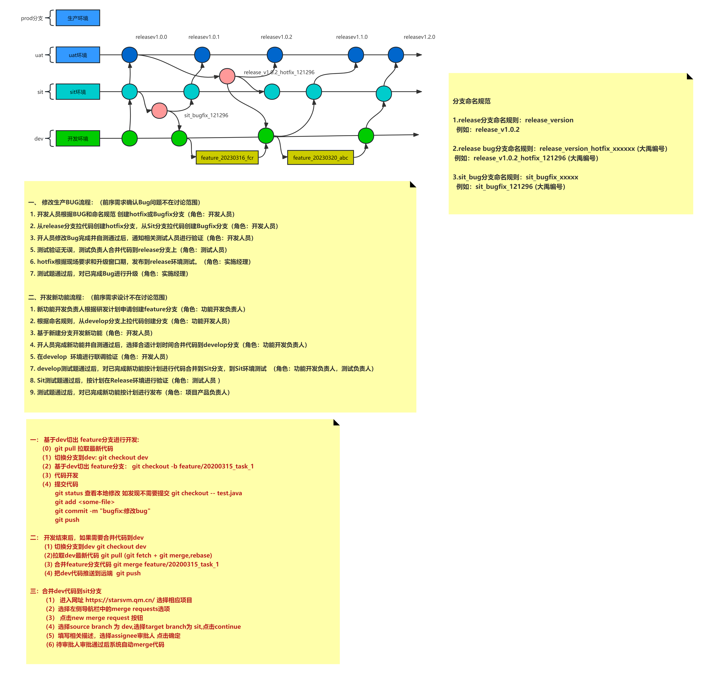

# 分支版本管理 V0.5

## 分支规约
1. **dev分支**：开发分支，该分支为变更分支或者特性分支，用于承载具体的功能开发。
2. **sit分支**：日常分支，该分支用于存放日常开发代码和缺陷修复。
3. **uat分支**：预发布分支，该分支主要用于区分版本和缺陷修复。
4. **prod分支**：生产分支，用于存放正式发布的代码。

## 分支命名规约
### `dev_${feature}`功能特性开发分支
> `${feature}`大禹编号
### `sit_bug_${bug}`缺陷修复分支
> `${bug}`大禹编号
### `uat_${version}`预发布分支
> `${version}`版本编号  
> 常用的版本号为三位数版本号，其构成如下：
`主版本号.次版本号.小版本号`
1. 主版本号（首位版本号）
> 主版本号，也叫首位版本号、顶位版本号。主版本号一般代表项目的期数与产品方向。除非项目合同改变、大规模api不兼容、产品方向改变、底层架构升级等情况外不轻易更新。  
> 另外，项目未正式发布、未正式孵化、未正式上线，则首位版本号为0，一期发布，则为1，二期发布则为2。
2. 次版本号（迭代号）
> 次版本号，也叫迭代号，一般代表某个迭代发布的功能集合（一个迭代发布会包含若干个功能更新）。  
> 如：
> - 1.1.0：第一期项目第一迭代发布版本
> - 1.2.0：第一期第二迭代发布版本
> - 1.18.0：第一期第十八个迭代发布版本。
3. 小版本号
> 小版本号，是为了某些小功能的临时上线，热修复的临时上线设置的小迭代，通常不包含大的功能性更新，常常是围绕某个功能点进行升级或者某个bug的修复进行上线。
### `uat_bug_${version}_${bug}`缺陷修复分支
> `${version}`版本编号  
> `${bug}`大禹编号

## 新功能特性开发流程
> 1. 根据新功能特性工时、人员、上线时间安排研发计划，并从`dev`支基础上创建`dev_${feature}`分支（角色：研发组长、敏捷教练）
> 2. 基于新建分支开发新功能（角色：开发人员）
> 3. 开人员完成新功能并自测通过后，提交代码合并请求（角色：开发人员）
> 4. 根据代码合并请求和研发计划，在代码检查后合并代码到`dev`分支（角色：研发组长）
> 5. 据研发计划从`dev`分支合并代码到`sit`分支，并发布日常环境进入测试流程（角色：研发组长、测试组长）
> 6. 日常环境测试题通过后，从`uat`上一分支拉取新的分支并按照命名规约创建新`uat_${version}`分支，并将`sit`代码合并到`uat`最新分支，按计划在预发布环境进行测试（角色：研发组长、测试组长）
> 7. 测试题通过后，将代码合并到`prod`分支，并据研发计划发布生产环境（角色：研发组长、实施组长）

## 缺陷修复流程
> 1. 生产环境缺陷修复需要根据现场要求、升级窗口期、`Bug`的严重性等安排计划以及预发布版本`uat_${version}`（角色：研发组长、实施组长）
> 2. 开发人员根据`Bug`和命名规范创建`sit_bug_${bug}`/`uat_bug_${version}_${bug}`分支（角色：开发人员）
> 3. 修复预发布环境和生产环境的`Bug`，预先规划新的`uat_${version}`分支和研发计划（角色：研发组长）
> 4. 开人员修改`Bug`完成并自测通过后，提交代码合并请求（角色：开发人员）
>   1. 如果是日常环境`Bug`，除`sit`分支合并请求外，还需要dev分支合并请求
>   2. 如果是预发布/生产环境`Bug`，除`uat_${version}`分支合并请求外，还需要sit分支合并请求、dev分支合并请求
>   3. 合并请求标题使用缺陷修复分支名称
> 5. 根据代码合并请求和研发计划，在代码检查后合并代码到`sit`/`uat_${version}`分支（角色：研发组长）
> 6. 发布到日常环境/预发布环境通知相关测试人员进行验证（角色：研发组长、测试组长）
> 7. 测试通过后，根据现场要求和升级窗口期，发布到生产环境环境测试。（角色：研发组长、实施组长）

## 第二套版本管理方案

### 第三套版本管理方案
