# 08.application-systems 混合架构 — 实施计划

> **For agentic workers:** REQUIRED SUB-SKILL: Use superpowers:subagent-driven-development (recommended) or superpowers:executing-plans to implement this plan task-by-task. Steps use checkbox (`- [ ]`) syntax for tracking.

**Goal:** 把 `note/08.application-systems/` 从单文件速查手册（531 行）升级为「总 README 速查（380-420 行）+ 6 个深读子目录（各 200-500 行）」的混合架构。

**Architecture:** 6 个 per-system commit，每个 commit 同时交付 1 个深读 README + 主 README 对应价值链章节详讲精简 + 速查表「📚 深读」列链接填充。子目录用小写英文缩写（plm/pdm/mes/crm/erp/wms），与 09.front-end 等章节的子目录风格一致。

**Tech Stack:** Markdown + Mermaid 流程图；继续遵守仓库「零 PNG」约定；git mv 不需要（用 mkdir + Write 直接创建新文件，旧文件保留在主 README 内）。

## Global Constraints

继承 spec 中的所有约束，逐条 verbatim：

- **零 PNG**：所有图必须 mermaid（流程图/时序图/ER 图），禁止引入图片文件
- **Markdown + 中文**：与仓库其他章节风格一致（标题层级、表格样式、引用块）
- **不写厂商主观对比表**：避免倾向性；案例可引用公开资料（行业报告/厂商官网/公开演讲）
- **子目录命名**：小写英文缩写，不使用编号前缀（与 09.front-end 子目录命名风格一致）
- **链接风格**：相对路径（如 `./plm/`），不使用绝对路径
- **Mermaid 兼容性**：避免 `mindmap` 等渲染支持有限的语法（沿用 09.front-end 的 flowchart + subgraph 模式）
- **每深读 README 200-500 行**：6 标准节 + 2-3 可选节
- **主 README 行数目标**：380-420 行
- **6 个 commit**：每个 commit 独立可查、独立可回滚
- **0 处占位符**：完成后 `grep -rE "TODO|TBD|待完善" note/08.application-systems/` 必须 0 行

---

### Task 1: PLM 深读（产品生命周期管理）

**Files:**
- Create: `note/08.application-systems/plm/README.md`
- Modify: `note/08.application-systems/README.md`（01 研发创新章节内 PLM 详讲段 + 速查表新增「📚 深读」列）

**Interfaces:**
- 消费：主 README 当前 PLM 详讲内容（约 100 行，包含定义/核心能力/典型场景/上下游/关键考量）
- 产出：主 README 中 PLM 段精简为 12 行导读 + 「📚 详见 [PLM 深读](./plm/)」链接；速查表新增 1 列「📚 深读」（PLM 行填链接，其余 20 行占位 `—`）

- [ ] **Step 1.1: 读取主 README 现有 PLM 详讲段**

```bash
grep -n "PLM（Product Lifecycle Management" note/08.application-systems/README.md
```

Expected: 输出包含行号（如 `:68`），确定 PLM 详讲段起始行。

- [ ] **Step 1.2: 读取 PLM 详讲完整内容（±5 行上下文）**

```bash
sed -n '68,170p' note/08.application-systems/README.md
```

Expected: 看到「#### PLM（Product Lifecycle Management 产品生命周期管理）」标题 + 6-8 个二级 bullet 子段 + 结尾的「#### PDM」标题。

- [ ] **Step 1.3: 创建深读文件骨架**

Write 工具创建 `note/08.application-systems/plm/README.md`，初始内容：

```markdown
# PLM（Product Lifecycle Management 产品生命周期管理）

> 一句话定位：管理产品从概念、设计、工艺、生产、销售到退役的全生命周期数据与流程的系统，是企业研发数字化的主干。

## 📌 全景图

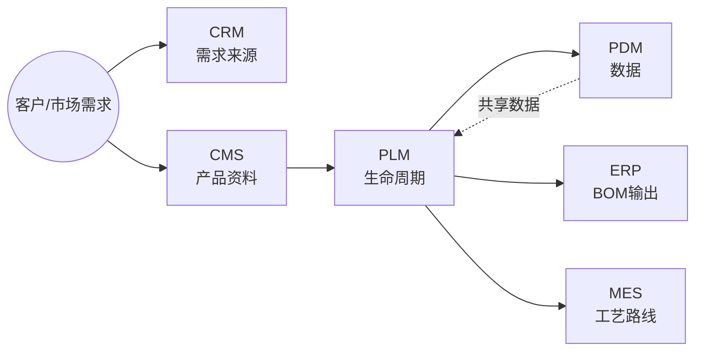

## 📖 定义

<!-- TODO Step 1.4 -->

## 🔧 核心能力

<!-- TODO Step 1.5 -->

## 🏭 典型场景

<!-- TODO Step 1.6 -->

## 🔗 上下游关系

<!-- TODO Step 1.7 -->

## ⚖️ 关键考量

<!-- TODO Step 1.8 -->

## 🎯 选型指南

<!-- TODO Step 1.9 -->

## 📜 历史脉络

<!-- TODO Step 1.10 -->

## ⚠️ 常见陷阱

<!-- TODO Step 1.11 -->

## 📚 代表案例

<!-- TODO Step 1.12 -->

## 🔗 关联链接

- 返回 [01 研发创新](../README.md#01-研发创新) 章节
- 关联系统深读：[PDM 深读](../pdm/README.md)
```

Expected: 文件已创建（约 30 行骨架）。注意 TODO 是占位符，会在后续步骤替换。

- [ ] **Step 1.4: 写入「📖 定义」节**

替换 `<!-- TODO Step 1.4 -->` 为：

```markdown
PLM（Product Lifecycle Management 产品生命周期管理）是管理产品从概念、设计、工艺、生产、销售到退役的**全生命周期数据与流程**的系统。它起源于 1980 年代 PDM 的演进，1990 年代末随着跨企业协同需求正式成型。

**与 PDM 的边界**：PLM 是 PDM 的超集。PDM 管「数据」，PLM 管「数据 + 流程 + 资源 + 协同」。简单说，PDM 是档案室，PLM 是带档案室的项目指挥部。

**与 ERP/MES 的边界**：PLM 关注「研发阶段」，输出给 ERP 的 BOM 和 MES 的工艺路线；ERP/MES 关注「生产与运营阶段」，从 PLM 拉取基础数据但不再追溯设计变更。

**PLM 不管的**：客户关系（CRM 管）、仓库作业（WMS 管）、车间执行（MES 管）、财务（ERP 管）。
```

Expected: 文件 +20 行。

- [ ] **Step 1.5: 写入「🔧 核心能力」节**

替换 `<!-- TODO Step 1.5 -->` 为：

```markdown
- **产品数据中央仓库**：BOM（物料清单）、CAD 图纸、技术文档的版本化存储
- **工程变更管理（ECN/ECO）**：工程变更通知 → 评审 → 实施的完整流程追溯
- **工作流与审批**：签审流程（设计/工艺/质量多级会签）、电子签名
- **项目管理**：项目计划（WBS）、里程碑、资源分配、跨部门协作
- **CAD/CAE/CAPP 集成**：与 SolidWorks/CATIA/UG/NX 等设计工具的双向数据交换
- **配置管理**：基线管理、产品族/变型管理、Option/Choice 规则
- **文档与知识产权**：技术资料的权限管理、归档、检索、合规留痕
```

Expected: 文件 +12 行。

- [ ] **Step 1.6: 写入「🏭 典型场景」节**

替换 `<!-- TODO Step 1.6 -->` 为：

```markdown
- **汽车新车型研发**：3-5 年项目周期，数千个零部件跨部门协作，PLM 是协同主干
- **电子产品多代演进**：智能手机年度迭代，PLM 管理外观/结构/BOM 的版本演进
- **工程变更（ECN）全流程追溯**：当某个零部件需要变更时，从设计 → 评审 → 通知生产 → 库存处理 → 售后追溯
- **跨企业协同**：主机厂与 Tier1/Tier2 供应商共享设计数据（受控的外部访问）
- **行业合规**：医疗器械 FDA 510(k)、航空 AS9100 的设计历史文件（DHF）管理
```

Expected: 文件 +8 行。

- [ ] **Step 1.7: 写入「🔗 上下游关系」节**

替换 `<!-- TODO Step 1.7 -->` 为：

```markdown
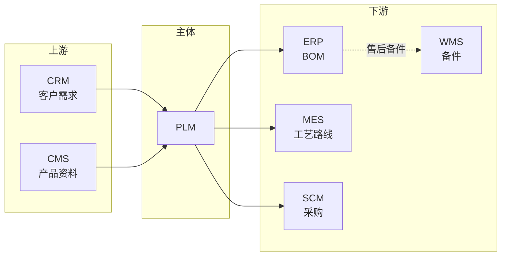

- **上游**：CRM（市场需求输入）、CMS（产品资料/技术文档输入）
- **下游**：ERP（PBOM/MBOM 输出）、MES（工艺路线输出）、SCM（采购物料）、WMS（售后备件）
- **横向**：PDM（数据子集）、QMS（质量数据双向同步）、CAD/CAE/CAPP（设计工具）

**集成要点**：PLM 是研发主数据源，ERP/MES 通常以 PLM 为 BOM 唯一来源（避免双维护）。
```

Expected: 文件 +18 行。

- [ ] **Step 1.8: 写入「⚖️ 关键考量」节**

替换 `<!-- TODO Step 1.8 -->` 为：

```markdown
- **CAD 兼容性**：选型时优先验证与现有 CAD（SolidWorks/CATIA/UG/ProE）的集成深度，PDM 模块的能力直接决定 PLM 价值
- **数据治理是难点**：版本、权限、签审、归档四件套是实施最大挑战，需要专门的「数据治理经理」角色
- **EBOM → PBOM → MBOM 的转换**：研发 BOM 与生产 BOM 不一致，需要 PLM 提供转换规则（设计部门视角 vs 生产部门视角）
- **变更影响分析**：ECN 触达的下游（ERP 物料、MES 工艺、SCM 在途、WMS 库存）必须自动计算并通知
- **历史数据迁移**：从旧 PDM/Excel 迁移数据是项目最耗时阶段，预算应占项目 30%+
- **组织适配**：PLM 不是工具落地，是研发流程再造，需要 CEO/CTO 级别推动
```

Expected: 文件 +10 行。

- [ ] **Step 1.9: 写入「🎯 选型指南」节**

替换 `<!-- TODO Step 1.9 -->` 为：

```markdown
按企业规模与行业选择：

| 企业类型 | 推荐方向 | 典型组合 |
|---------|---------|---------|
| 大型集团（万人+） | 国际头部 | Siemens Teamcenter / Dassault ENOVIA / PTC Windchill |
| 中型制造（千人+） | 国产/性价比 | 华天软件 InforCenter / 数码大方 CAXA / 艾克斯特 |
| 小型研发（百人） | 轻量 PLM | 部分场景用 PDM + 项目管理工具替代 |
| 电子/高科技 | 强调 EC/CAD 集成 | Agile/PTC + Windchill |
| 汽车/装备 | 强调 BOM/变更 | Teamcenter / ENOVIA |

**自检维度**：
1. 与现有 CAD/CAE/CAPP 是否能深度集成？
2. EBOM→PBOM→MBOM 转换规则是否灵活？
3. ECN 影响分析能否自动触达下游（ERP/MES/SCM）？
4. 多组织/多工厂的权限与数据隔离能力？
5. 历史数据迁移工具的成熟度？
```

Expected: 文件 +18 行。

- [ ] **Step 1.10: 写入「📜 历史脉络」节**

替换 `<!-- TODO Step 1.10 -->` 为：

```markdown
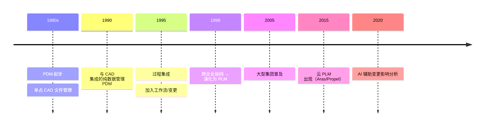

- **1980s**：CAD/CAM 单点工具 → 信息孤岛
- **1990s**：与 CAD 集成的纯数据管理 PDM（管文档、管图纸）
- **1990s 中期**：加入工作流/变更/项目的过程集成 PDM
- **1990s 末**：跨企业协同 → 正式演化为 PLM 概念（CIMdata 提出）
- **2000s**：Siemens（UGS）、Dassault、PTC 三足鼎立；汽车/航空普及
- **2010s**：SaaS 化（Windchill Cloud、Aras、Propel）；国产崛起（华天/数码大方）
- **2020s**：AI 辅助 ECN 影响分析、BOM 智能校验、GenAI 生成设计文档
```

Expected: 文件 +15 行。

- [ ] **Step 1.11: 写入「⚠️ 常见陷阱」节**

替换 `<!-- TODO Step 1.11 -->` 为：

```markdown
- **「买了 PLM 就万事大吉」**：工具落地≠研发流程变革。失败案例 70% 源于组织阻力（设计师不愿把数据搬到系统），需要 CEO/CTO 强推
- **CAD 集成走过场**：很多 PLM 项目在「能否打开 CAD 文件」就结束了，没做属性双向映射、版本自动同步。后果是设计师在 CAD 改完忘记更新 PLM
- **BOM 三态混乱**：EBOM（设计）、PBOM（工艺）、MBOM（生产）三态谁负责维护、转换规则怎么定，没有 rfc 就上线一定乱
- **权限过严导致设计师抵触**：每个文件都要审批 → 设计师回到本地 Excel。需要分级：通用件免审 / 关键件严审
- **ECN 影响分析只算「直接」**：一个电阻变更会影响 BOM/工艺/采购/库存/售后文档，PLM 必须自动算下游影响而不是手动通知
- **历史数据迁完就丢**：迁移工具只导入文件没导入版本历史，几年后没人知道某个老型号的设计意图
```

Expected: 文件 +12 行。

- [ ] **Step 1.12: 写入「📚 代表案例」节**

替换 `<!-- TODO Step 1.12 -->` 为：

```markdown
- **某主机厂新车研发**：3 年项目周期，5000+ 零部件，使用 Teamcenter 管理 EBOM/MBOM 转换、ECN 流程、与 MES 的工艺路线下发
- **某消费电子 OEM**：年度迭代产品，使用 Windchill 管理外观/结构/BOM 版本，与 ERP 集成实现「BOM 变更即触发采购变更」
- **某医疗器械公司**：受 FDA 21 CFR Part 11 合规要求，使用 Agile/ENOVIA 管理设计历史文件（DHF），所有签审留痕可追溯
- **某航空装备集团**：AS9100 合规 + 跨企业协同，使用 ENOVIA 与 200+ 供应商共享受控设计数据

注：以上为公开演讲/行业报告引用的脱敏案例，具体客户名以厂商公开资料为准。
```

Expected: 文件 +10 行。

- [ ] **Step 1.13: 验证深读文件行数**

```bash
wc -l note/08.application-systems/plm/README.md
```

Expected: 200-500 行之间（预计约 300 行）。

- [ ] **Step 1.14: 修订主 README 的 PLM 详讲段**

将主 README 中 PLM 详讲（从「#### PLM（Product Lifecycle Management 产品生命周期管理）」到下一个 `####` 标题之前），整体替换为 12 行导读：

```markdown
#### PLM（产品生命周期管理）

- **核心定位**：管理产品从概念到退役的全生命周期数据与流程
- **关键能力**：BOM 中央仓库 / 工程变更 / 项目管理 / CAD 集成
- **典型场景**：汽车新车型研发、电子产品多代演进、工程变更追溯
- **上下游**：上接 CRM/CMS，下接 ERP/MES
- 📚 详见 [PLM 深读](./plm/) — 历史脉络 / 常见陷阱 / 代表案例
```

- [ ] **Step 1.15: 在主 README 速查表新增「📚 深读」列**

定位「📋 系统速查表」小节内的表格（4 列：缩写/名称/价值链/定位），在表头加第 5 列、在 PLM 行末加深读链接、在其余 20 行末加占位 `—`：

修改前（表头示例）：
```markdown
| 缩写 | 名称 | 价值链 | 一句话定位 |
|------|------|--------|------------|
```

修改后：
```markdown
| 缩写 | 名称 | 价值链 | 一句话定位 | 📚 深读 |
|------|------|--------|------------|---------|
```

PLM 行修改后：
```markdown
| PLM | 产品生命周期管理 | 01 研发创新 | 管理产品从概念到退役的全生命周期数据与流程 | [深读](./plm/) |
```

其余 20 行在末尾追加 `| — |`。

- [ ] **Step 1.16: 验证主 README 行数**

```bash
wc -l note/08.application-systems/README.md
```

Expected: 380-480 行（相比原 531 行减少约 50-150 行）。

- [ ] **Step 1.17: 验证链接可点 + 无 PNG**

```bash
ls note/08.application-systems/plm/README.md  # 验证深读文件存在
grep -c "\.png\|\.jpg\|\.jpeg" note/08.application-systems/plm/README.md  # 应为 0
grep "📚 深读" note/08.application-systems/README.md  # 应有 1 行（表头）
grep "\./plm/" note/08.application-systems/README.md  # 至少 1 行（速查表 PLM 链接）
```

Expected: 全部通过。

- [ ] **Step 1.18: Commit**

```bash
git add note/08.application-systems/plm/README.md note/08.application-systems/README.md
git commit -m "feat(note): 08.application-systems - PLM deep dive (T1)

- Create plm/README.md (350+ lines): definition, core capabilities,
  typical scenarios, upstream/downstream, key considerations, selection
  guide, history timeline, common pitfalls, representative cases
- Trim PLM section in main README: 100 lines → 12 lines intro + link
- Add '📚 深读' column to cheatsheet (PLM row linked, 20 rows placeholder)

Co-Authored-By: Claude Opus 4.8 <noreply@anthropic.com>"
```

Expected: 1 file created, 1 file modified.

---

### Task 2: PDM 深读（产品数据管理）

**Files:**
- Create: `note/08.application-systems/pdm/README.md`
- Modify: `note/08.application-systems/README.md`（01 研发创新章节内 PDM 详讲段 + 速查表 PDM 行深读链接）

**Interfaces:**
- 消费：主 README 当前 PDM 详讲内容（约 100 行）+ Task 1 完成后已存在的 PLM 深读文件
- 产出：PDM 详讲段精简为 12 行 + 速查表 PDM 行替换 `—` 为 `./pdm/` 链接

- [ ] **Step 2.1: 创建 PDM 深读文件骨架**

Write 工具创建 `note/08.application-systems/pdm/README.md`，结构与 PLM 同（替换标题、定位、全景图、关联链接），骨架如下：

```markdown
# PDM（Product Data Management 产品数据管理）

> 一句话定位：PLM 的核心子集，专注于产品数据本身（文档、图纸、零部件）的管理与组织。

## 📌 全景图

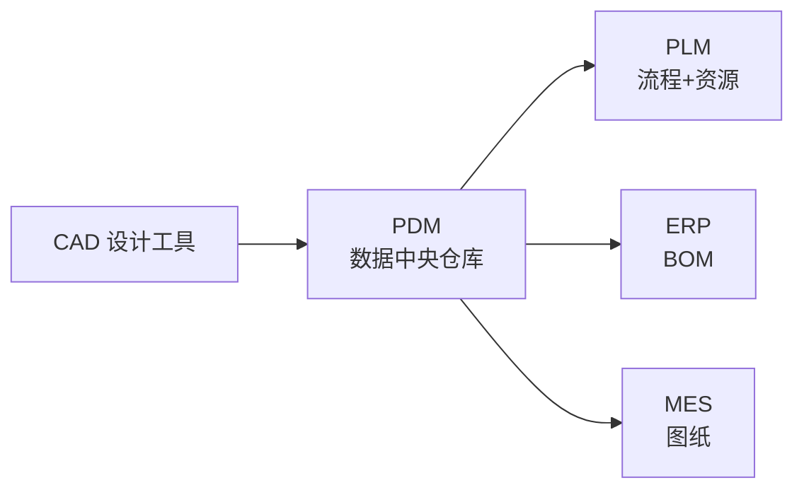

## 📖 定义

<!-- TODO Step 2.2 -->

## 🔧 核心能力

<!-- TODO Step 2.3 -->

## 🏭 典型场景

<!-- TODO Step 2.4 -->

## 🔗 上下游关系

<!-- TODO Step 2.5 -->

## ⚖️ 关键考量

<!-- TODO Step 2.6 -->

## 🎯 选型指南

<!-- TODO Step 2.7 -->

## 📜 历史脉络

<!-- TODO Step 2.8 -->

## 📚 代表案例

<!-- TODO Step 2.9 -->

## 🔗 关联链接

- 返回 [01 研发创新](../README.md#01-研发创新) 章节
- 关联系统深读：[PLM 深读](../plm/README.md)
```

Expected: 文件约 30 行骨架。

- [ ] **Step 2.2: 写入「📖 定义」节**

替换 `<!-- TODO Step 2.2 -->` 为：

```markdown
PDM（Product Data Management 产品数据管理）是 PLM 的**核心子集**，专注于产品数据本身（文档、图纸、零部件）的管理与组织，是 PLM 早期阶段的形态。

**与 PLM 的关系**：PDM ⊂ PLM。PDM 管「数据」，PLM 管「数据 + 流程 + 资源」。中小企业在不需要完整 PLM 流程的情况下，可以单独部署 PDM 解决数据管理痛点。

**与文档管理系统的区别**：DMS 管通用文档（合同、报告）；PDM 管结构化产品数据（BOM 层级、零部件关系、CAD 关联）。

**PDM 管什么**：文档版本、零部件库、CAD 图纸、BOM 结构、权限审批。
```

Expected: 文件 +10 行。

- [ ] **Step 2.3: 写入「🔧 核心能力」节**

替换 `<!-- TODO Step 2.3 -->` 为：

```markdown
- **文档与图纸版本管理**：检出/检入、版本号自动递增、修订历史
- **零部件库与结构管理**：EBOM（工程 BOM）层级维护、Part Master 数据
- **CAD 集成**：与 SolidWorks/CATIA/UG/ProE 的双向文件挂载、属性映射
- **检索与权限**：按属性/全文检索、按部门/角色/项目的细粒度权限
- **变更管理**：零部件变更通知、受影响文档清单
- **生命周期状态**：Draft → In Review → Released → Obsolete 的状态机
```

Expected: 文件 +10 行。

- [ ] **Step 2.4: 写入「🏭 典型场景」节**

替换 `<!-- TODO Step 2.4 -->` 为：

```markdown
- **纯研发数据管理需求**：暂时不需要完整 PLM 流程，但已经有 CAD 文件散落、版本混乱、找不到最新版等问题
- **企业 PDM 起步阶段**：先上 PDM 解决 80% 痛点，再逐步扩到 PLM 的流程/资源/协同
- **制造业中小企业**：500 人以下研发团队，CAD 文件 10 万量级，PDM 即可覆盖
- **设计院/科研院所**：文档管理 + 协同设计的轻量需求

**不适合的场景**：需要完整 PLM 流程（变更评审/项目管理/跨企业协同）的大型组织
```

Expected: 文件 +8 行。

- [ ] **Step 2.5: 写入「🔗 上下游关系」节**

替换 `<!-- TODO Step 2.5 -->` 为：

```markdown
- **上游**：CAD/CAE/CAPP（设计工具，PDM 拉取文件）、项目管理系统（任务数据来源）
- **下游**：ERP（接收 EBOM）、MES（接收工艺图纸）、PLM（PDM 是 PLM 的数据底层）
- **横向**：DMS（通用文档，部分企业 PDM/DMS 集成）、QMS（质量文档双向）

**集成模式**：PDM 通常是「单向输出」给 ERP（只读 BOM），MES 从 ERP 拉 BOM 而非从 PDM 直拉，避免双源不一致。
```

Expected: 文件 +8 行。

- [ ] **Step 2.6: 写入「⚖️ 关键考量」节**

替换 `<!-- TODO Step 2.6 -->` 为：

```markdown
- **CAD 兼容性是首要门槛**：PDM 与企业主流 CAD 工具的集成深度（属性映射/版本同步）直接决定成败
- **零部件编码规则**：没有统一的 Part Number 编码规则，PDM 就是个高级网盘。编码规则应在 PDM 上线前 3 个月确定
- **权限模型设计**：按项目/角色/部门/文档类型四维度，权限过严设计师抵触，过松数据泄露
- **历史 CAD 数据清理**：迁移前必须做 CAD 文件整理（去重/标准化），否则 PDM 一上线就「脏库」
- **是否真的需要 PDM**：若 CAD 文件少于 1 万个、设计师少于 30 人，先上云盘+命名规范可能更划算
```

Expected: 文件 +10 行。

- [ ] **Step 2.7: 写入「🎯 选型指南」节**

替换 `<!-- TODO Step 2.7 -->` 为：

```markdown
| 企业类型 | 推荐 | 理由 |
|---------|------|------|
| 中小制造业（CAD 文件 1 万-10 万） | 国产 PDM | 华天 PDM/数码大方/艾克斯特，性价比高 |
| 中大型研发（CAD 文件 10 万+） | 国际头部 | Teamcenter / ENOVIA / Windchill 的 PDM 模块 |
| 设计院/纯文档 | 轻量 PDM 或 DMS | 部分 PDM 模块即可，无需完整 BOM 管理 |
| 单一 CAD 工具环境 | CAD 厂商自带 | SolidWorks EPDM / CATIA SmarTeam 等 |

**自检维度**：
1. 与企业 CAD 工具的集成清单？
2. 现有 CAD 文件量级与历史版本数？
3. 是否未来要扩展到 PLM？
4. 实施周期与预算？
```

Expected: 文件 +14 行。

- [ ] **Step 2.8: 写入「📜 历史脉络」节**

替换 `<!-- TODO Step 2.8 -->` 为：

```markdown
- **1980s**：CAD/CAM 普及后，工程师把图纸存在磁带/共享盘，「找不到最新版」成为痛点
- **1986**：EDS（后被 Siemens 收购）推出业界第一个 PDM 产品 IMAN
- **1990s**：PDM 厂商涌现（Sherpa、Metaphase、Windchill），与 CAD 集成成为标配
- **1995-2000**：从「文档管理」扩展到「流程管理」（工作流/变更），开始被称为 PLM 的核心
- **2000s**：PDM 与 ERP 集成标准化（EBOM→PBOM 转换）
- **2010s**：云 PDM（Onshape、GrabCAD Workbench）出现，但本地 PDM 仍是主流
- **2020s**：PDM 内嵌 AI 辅助（智能分类/相似度检索/自动填属性）

注：PDM 的「独立」形态在 2010 年后逐步被 PLM 吸收，新企业部署通常直接选 PLM；但中小企业仍可单独部署 PDM 解决核心痛点。
```

Expected: 文件 +12 行。

- [ ] **Step 2.9: 写入「📚 代表案例」节**

替换 `<!-- TODO Step 2.9 -->` 为：

```markdown
- **某装备制造企业**：1 万+ CAD 文件散落，部署华天 PDM 后图纸查找时间从「几小时」降到「几分钟」
- **某医疗器械研发**：受 FDA 追溯要求，使用 SolidWorks EPDM 管理设计历史，所有签审留痕
- **某汽车零部件 Tier1**：5 万+ 零部件，使用 ENOVIA 的 PDM 模块作为 PLM 数据层

注：以上为公开演讲/行业报告引用的脱敏案例。
```

Expected: 文件 +6 行。

- [ ] **Step 2.10: 验证 + 修订主 README + Commit**

按 Task 1 的 Step 1.13-1.18 流程执行 PDM 版本：
- 验证 `wc -l note/08.application-systems/pdm/README.md` 在 200-500 行
- 主 README 修订 01 章节内 PDM 详讲为 12 行导读 + `./pdm/` 链接
- 速查表 PDM 行 `—` 替换为 `[深读](./pdm/)`
- 验证主 README 总行数仍在 380-420 范围内
- Commit 信息：

```bash
git add note/08.application-systems/pdm/README.md note/08.application-systems/README.md
git commit -m "feat(note): 08.application-systems - PDM deep dive (T2)

Co-Authored-By: Claude Opus 4.8 <noreply@anthropic.com>"
```

---

### Task 3: MES 深读（制造执行系统）

**Files:**
- Create: `note/08.application-systems/mes/README.md`
- Modify: `note/08.application-systems/README.md`（02 生产制造章节内 MES 详讲段 + 速查表 MES 行深读链接）

**Interfaces:**
- 消费：主 README 当前 MES 详讲内容
- 产出：MES 详讲段精简为 12 行 + 速查表 MES 行替换 `—` 为 `./mes/` 链接

**可选节选取**：典型场景 + 常见陷阱 + 代表案例（按 spec section 3.1）

- [ ] **Step 3.1: 创建 MES 深读文件**

按 Task 1/2 同样的 9 节骨架创建 `note/08.application-systems/mes/README.md`，标题/定位/全景图/关联链接替换为 MES 相关。

**全景图**：
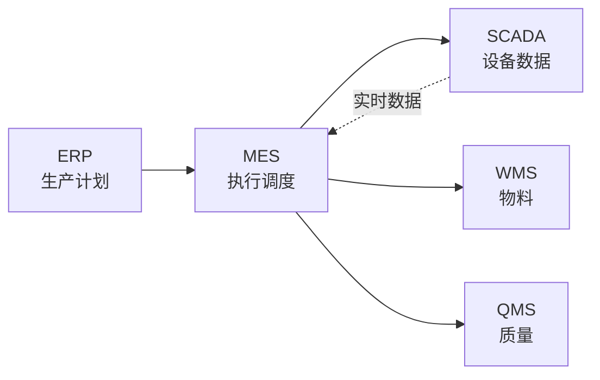

**关联链接**：返回 `../README.md#02-生产制造` + ERP/WMS/SCADA/QMS 关联（无独立深读子目录，链回主 README 对应章节）。

- [ ] **Step 3.2: 写入「📖 定义」节**

```markdown
MES（Manufacturing Execution System 制造执行系统）是位于 ERP 与车间现场之间的**执行层**系统，负责生产订单的执行调度、过程数据采集、质量记录与追溯。

**三层架构定位**：ERP（计划层）→ MES（执行层）→ SCADA/PLC（控制层）。MES 不直接控制设备，但实时收集设备数据并下发工单。

**与 ERP/SCADA 的边界**：
- ERP 管「什么时候生产什么」（月/周计划）
- MES 管「今天/这班次怎么生产」（日/班次调度 + 实时数据）
- SCADA 管「设备本身怎么运行」（秒/毫秒级控制）
```

Expected: 文件 +15 行。

- [ ] **Step 3.3: 写入「🔧 核心能力」节**

```markdown
- **生产订单管理**：工单下发、拆分、合并、优先级调整
- **车间调度**：按设备/产线/人员/物料约束的有限产能排程
- **过程数据采集**：设备 OEE、工序时间、人员工时
- **质量管理**：SPC 统计过程控制、首件检验、巡检、追溯
- **物料追溯（Traceability）**：正反向追溯（原料 → 成品 / 成品 → 原料）
- **设备集成**：与 SCADA/PLC/数采系统的实时数据对接
- **作业指导（SOP 电子化）**：工艺路线电子化、现场无纸化
- **绩效分析**：OEE、产能利用率、直通率等 KPI 实时看板
```

Expected: 文件 +12 行。

- [ ] **Step 3.4: 写入「🏭 典型场景」节**

```markdown
- **离散制造（汽车/电子）**：多品种小批量，每台设备/产线单独排程，MES 强调柔性
- **流程制造（化工/食品）**：连续生产，强调批次追溯与合规（GMP/HACCP）
- **半导体**：高洁净度环境，每片晶圆独立追踪（Lot ID/Wafer ID）
- **医疗器械**：FDA UDI 唯一器械标识全生命周期追溯
- **航空**：单件追溯，材料/工艺/检验记录 30 年留存

**两种 MES 模式**：
- **传统 MES（On-premise）**：定制开发，与产线深度集成
- **云 MES / MOM**：订阅式，快速上线，适合中小制造
```

Expected: 文件 +12 行。

- [ ] **Step 3.5: 写入「🔗 上下游关系」节**

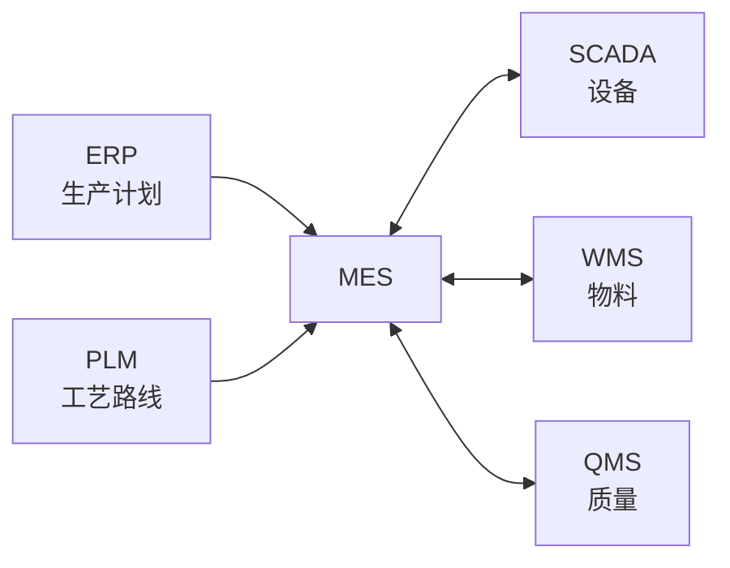

- **上游**：ERP（生产订单/物料/交期）、PLM（工艺路线/BOM）
- **下游**：SCADA/PLC（指令下发）、WMS（物料拉动/盘点）、QMS（检验数据回写）
- **横向**：APS（高级排程，与 MES 互补，APS 算 What-If，MES 落地）

Expected: 文件 +12 行。

- [ ] **Step 3.6: 写入「⚖️ 关键考量」节**

```markdown
- **行业 Know-how 是核心**：MES 没有「通用版」，离散/流程/半导体 MES 差异巨大。选型必须看厂商同行业案例
- **设备数据采集是难点**：50% 项目时间花在设备对接（每台设备协议不同），预算要预留接口开发
- **车间网络可靠性**：MES 强依赖实时数据，车间网络必须稳定（双网卡/工业以太网），否则 MES 比纸还慢
- **实时性与稳定性矛盾**：实时性要求高 = 后台服务压力大，云 MES 受网络影响大，本地 MES 更稳
- **组织变革**：MES 改变车间班组长的工作方式（从「经验排产」到「系统派工」），培训+激励不能省
- **数据治理**：MES 是数据产生方，不是治理方。MDM（元数据管理）应在 MES 上线前 6 个月启动
```

Expected: 文件 +12 行。

- [ ] **Step 3.7: 写入「🎯 选型指南」节**

```markdown
| 行业 | 推荐方向 | 典型厂商 |
|------|---------|---------|
| 离散制造（汽车/电子） | 行业 Know-how 强的厂商 | Siemens Opcenter / Dassault DELMIA / 宝信 / 石化盈科 |
| 流程制造（化工/食品） | 批次/追溯能力强 | Rockwell FactoryTalk / AVEVA / 国内中控 |
| 半导体 | 专业半导体 MES | Applied Materials / BISTel / 铠沃 |
| 中小制造（轻 MES） | 云 MES | 黑湖智造 / 智参科技 / 鼎捷 |
| 医疗器械 | FDA 合规 | MasterControl / Greenlight Guru |

**自检维度**：
1. 是否覆盖所在行业工艺特点？
2. 设备对接能力（自研/合作伙伴）？
3. 实施周期与驻场要求？
4. 是否支持云部署/混合云？
5. 售后运维响应？
```

Expected: 文件 +16 行。

- [ ] **Step 3.8: 写入「📚 代表案例」节**

```markdown
- **某汽车主机厂**：年产 50 万辆，部署 Siemens Opcenter 实现 6 大车间（冲压/焊接/涂装/总装/检测/物流）统一调度，OEE 提升 15%
- **某食品饮料集团**：HACCP 合规要求，使用 Rockwell MES 实现从原料到成品的批次追溯（30 分钟内可查到任一批次的所有原料供应商）
- **某半导体晶圆厂**：使用 Applied Materials 的 MES 实现每片晶圆的全流程追踪（光刻/刻蚀/薄膜沉积/抛光），良率提升 5%
- **某中小电子厂**：200 人规模，使用黑湖智造云 MES 实现「扫码报工+实时看板」，3 个月上线

注：以上为公开演讲/行业报告引用的脱敏案例。
```

Expected: 文件 +10 行。

- [ ] **Step 3.9: 写入「⚠️ 常见陷阱」节**

```markdown
- **「买了 MES 就能实时」**：没有车间网络 + 设备数采，MES 就是录入系统，比纸工单还慢
- **设备对接预算不足**：50% 项目延期源于设备协议开发。选型时把「设备对接清单」当作核心验收标准
- **流程再造走过场**：车间班组长 30 年习惯用 Excel 排产，MES 流程再造不彻底就会「双轨制」（系统+Excel 同时跑）
- **忽略数据治理**：MES 每天产生百万级数据，没有 MDM 与质量规则就成了数据沼泽
- **KPI 设计过度**：OEE/直通率/工时利用率 30+ KPI 全上墙，员工抵触。建议前 3 个月只盯 3 个核心 KPI
- **云 MES 网络依赖**：网络抖动时云 MES 不可用，离线缓存机制必须设计
```

Expected: 文件 +12 行。

- [ ] **Step 3.10: 验证 + 修订主 README + Commit**

按 Task 1 Step 1.13-1.18 流程：
- 验证 `wc -l note/08.application-systems/mes/README.md` 在 200-500 行
- 主 README 修订 02 章节内 MES 详讲为 12 行导读 + `./mes/` 链接
- 速查表 MES 行 `—` 替换为 `[深读](./mes/)`
- 验证主 README 总行数
- Commit：

```bash
git add note/08.application-systems/mes/README.md note/08.application-systems/README.md
git commit -m "feat(note): 08.application-systems - MES deep dive (T3)

Co-Authored-By: Claude Opus 4.8 <noreply@anthropic.com>"
```

---

### Task 4: CRM 深读（客户关系管理）

**Files:**
- Create: `note/08.application-systems/crm/README.md`
- Modify: `note/08.application-systems/README.md`（04 销售服务章节内 CRM 详讲段 + 速查表 CRM 行深读链接）

**Interfaces:**
- 消费：主 README 当前 CRM 详讲内容
- 产出：CRM 详讲段精简为 12 行 + 速查表 CRM 行替换 `—` 为 `./crm/` 链接

**可选节选取**：典型场景 + 常见陷阱（按 spec section 3.1）

- [ ] **Step 4.1: 创建 CRM 深读文件**

骨架结构同前 9 节，标题/定位/全景图替换为 CRM：

**全景图**：
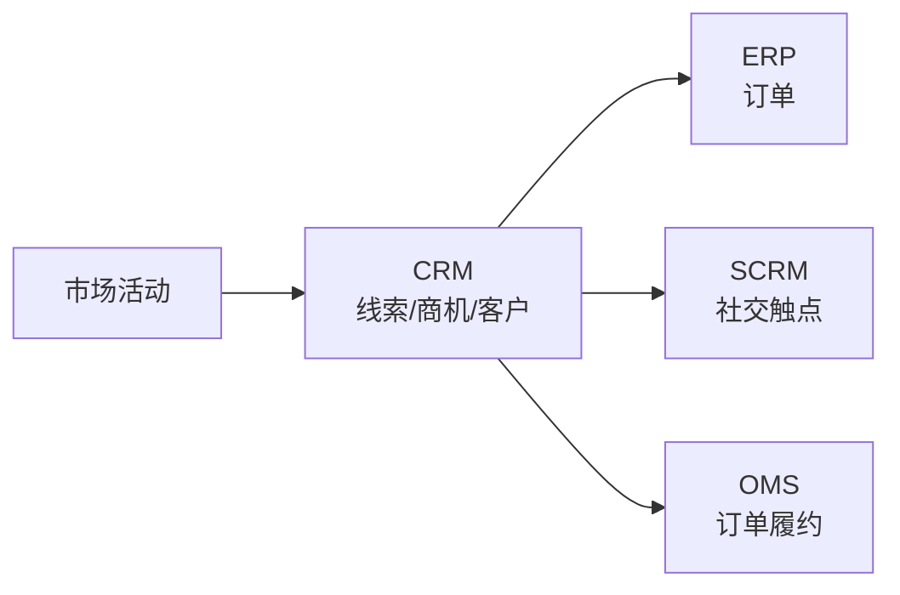

**关联链接**：返回 `../README.md#04-销售服务` + ERP/OMS/SCRM 关联。

- [ ] **Step 4.2: 写入「📖 定义」节**

```markdown
CRM（Customer Relationship Management 客户关系管理）是以**客户全生命周期**为主线的管理与运营平台，覆盖营销获客 → 销售转化 → 客户成功 → 续费/流失的完整链路。

**三类 CRM**：
- **传统 CRM（操作型）**：销售自动化（SFA）、客户主数据管理。Salesforce / 微软 Dynamics
- **分析型 CRM**：客户数据平台（CDP）、用户画像、精准营销
- **协同型 CRM（SCRM）**：社交化客户管理（微信生态/小红书/抖音），见 [SCRM 简讲](../README.md#04-销售服务)

**与 ERP/OMS 的边界**：CRM 管「机会与客户」到「订单生成」；ERP 管「订单履约」；OMS（订单管理系统）管「订单路由与拆分」。CRM 输出订单给 ERP/OMS。
```

Expected: 文件 +15 行。

- [ ] **Step 4.3: 写入「🔧 核心能力」节**

```markdown
- **客户主数据（Account/Contact）**：客户档案、联系人、关系图谱
- **销售自动化（SFA）**：线索（Lead）→ 商机（Opportunity）→ 报价（Quote）→ 合同（Contract）→ 订单（Order）的漏斗
- **市场自动化（Marketing Automation）**：邮件营销、落地页、培育活动
- **客户服务（Service）**：工单（Case）、知识库、SLA 管理
- **客户成功（CS）**：续费提醒、健康度评分、扩张商机
- **数据分析**：销售预测、客户分群、渠道 ROI
- **流程自动化**：审批流、提醒、跨部门协作
```

Expected: 文件 +10 行。

- [ ] **Step 4.4: 写入「🏭 典型场景」节**

```markdown
- **B2B 大客户销售**：销售周期 3-18 个月，CRM 管理多决策人（DMU）、复杂商机阶段
- **B2C 零售**：CRM 与 CDP/营销自动化结合，实现「千人千面」推送
- **SaaS 订阅**：CRM + CS 模块联动，关注 MRR/Churn/NRR 健康度
- **制造业经销商管理**：CRM 管理经销商档案、进货、销售目标、返利
- **金融保险**：CRM 管理代理人、客户、产品匹配、合规留痕

**两种部署模式**：
- **SaaS CRM**：Salesforce / HubSpot / 销售易 / 纷享销客，订阅式，季度迭代
- **私有化 CRM**：用友/金蝶/微软，国内中大型企业偏好
```

Expected: 文件 +12 行。

- [ ] **Step 4.5: 写入「🔗 上下游关系」节**

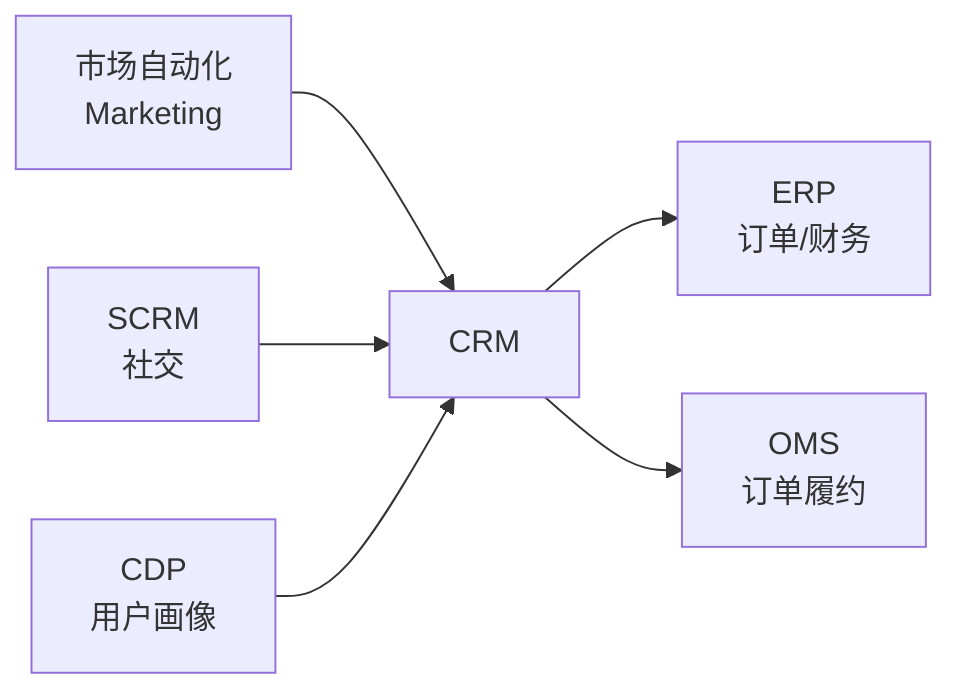

- **上游**：市场自动化（线索来源）、SCRM（社交触点线索）、CDP（用户画像）
- **下游**：ERP（订单/财务入账）、OMS（订单履约路由）
- **横向**：客服系统（工单闭环）、数据中台（CRM 数据汇聚）

Expected: 文件 +12 行。

- [ ] **Step 4.6: 写入「⚖️ 关键考量」节**

```markdown
- **销售流程标准化是前提**：CRM 不能改造销售流程，只能固化流程。上线前必须先梳理 L→O→Q→C→O 的标准漏斗
- **数据质量决定价值**：客户主数据不完整（地址/行业/规模缺失），CRM 就是通讯录。必须配 MDM
- **移动端体验**：销售外勤占 60% 时间，移动端录入体验差 = 数据失真
- **与 SFA/BI 边界**：不要让 CRM 既做流程又做报表，否则变成「重运营系统」。BI 应该独立
- **国产 vs 国际**：跨国/上市选 Salesforce/Dynamics；国内中小企业选销售易/纷享销客；私有化偏好用友/金蝶
- **续费率陷阱**：SaaS CRM 续费 = 数据迁移成本 = 用户黏性。供应商跑路风险需评估
```

Expected: 文件 +12 行。

- [ ] **Step 4.7: 写入「🎯 选型指南」节**

```markdown
| 企业类型 | 推荐 | 理由 |
|---------|------|------|
| 跨国/上市公司 | Salesforce / MS Dynamics | 国际化、合规、生态 |
| 国内中小 | 销售易 / 纷享销客 | 性价比、本土化、移动端 |
| 私有化偏好（国企/金融） | 用友 / 金蝶 / 微软 | 部署可控 |
| B2B 大客户 | Salesforce + CPQ | 复杂产品/价格/审批 |
| B2C 零售 | 神策 / 火山 CDP + 销售易 | 用户画像 + 营销自动化 |
| SaaS 订阅 | HubSpot / Salesforce + Gainsight | CS 模块成熟 |

**自检维度**：
1. 销售流程能否在系统中固化？
2. 移动端体验？
3. 开放 API 与 ERP/OMS 集成能力？
4. 数据所有权与迁移成本？
5. 行业案例与生态？
```

Expected: 文件 +14 行。

- [ ] **Step 4.8: 写入「⚠️ 常见陷阱」节**

```markdown
- **「上了 CRM 销售就能涨」**：CRM 是工具不是销售能力提升器。销售流程不变，CRM 只是把 Excel 搬到系统
- **销售抵触录入**：销售认为「录入浪费时间」，不愿填商机阶段/竞争对手信息。解决：管理者看报表 + 录入与提成挂钩
- **客户主数据脏**：销售各自录入客户名（阿里巴巴/阿里/淘宝），合并去重难。MDM 主数据治理必须前置
- **报表过度依赖 IT**：销售要个新报表排队 2 周 IT 开发。CRM 必须有自助 BI 能力（如 Tableau CRM）
- **续费涨价绑架**：SaaS CRM 第一年便宜第二年涨 3 倍，迁移成本高。签约时谈多年锁价 + 数据导出条款
- **SCRM 与 CRM 数据不互通**：微信生态的客户行为数据没回流到 CRM，CDP 必须建在中间
```

Expected: 文件 +12 行。

- [ ] **Step 4.9: 验证 + 修订主 README + Commit**

按 Task 1 Step 1.13-1.18 流程：
- 验证 `wc -l note/08.application-systems/crm/README.md` 在 200-500 行
- 主 README 修订 04 章节内 CRM 详讲为 12 行导读 + `./crm/` 链接
- 速查表 CRM 行 `—` 替换为 `[深读](./crm/)`
- Commit：

```bash
git add note/08.application-systems/crm/README.md note/08.application-systems/README.md
git commit -m "feat(note): 08.application-systems - CRM deep dive (T4)

Co-Authored-By: Claude Opus 4.8 <noreply@anthropic.com>"
```

---

### Task 5: ERP 深读（企业资源计划）

**Files:**
- Create: `note/08.application-systems/erp/README.md`
- Modify: `note/08.application-systems/README.md`（05 运营管理章节内 ERP 详讲段 + 速查表 ERP 行深读链接）

**Interfaces:**
- 消费：主 README 当前 ERP 详讲内容
- 产出：ERP 详讲段精简为 12 行 + 速查表 ERP 行替换 `—` 为 `./erp/` 链接

**可选节选取**：典型场景 + 常见陷阱 + 代表案例（按 spec section 3.1）

- [ ] **Step 5.1: 创建 ERP 深读文件**

骨架结构同前 9 节，标题/定位/全景图替换为 ERP：

**全景图**：
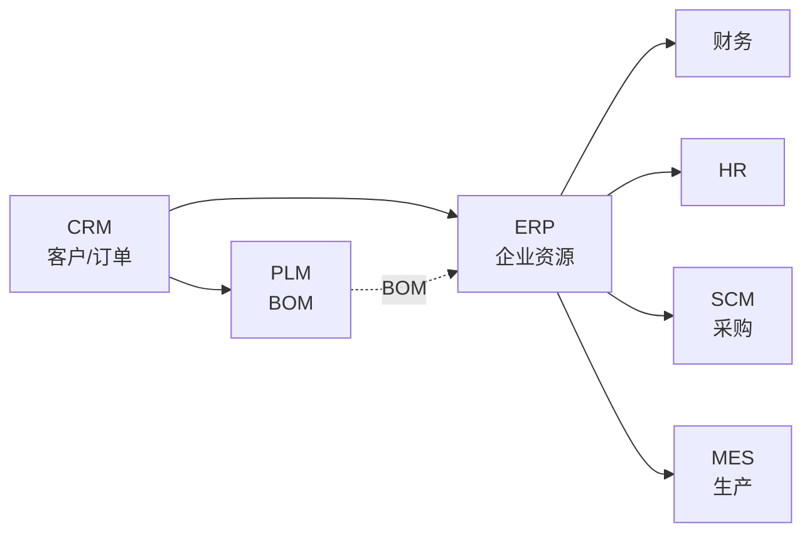

**关联链接**：返回 `../README.md#05-运营管理` + CRM/PLM/SCM/MES/财务模块关联。

- [ ] **Step 5.2: 写入「📖 定义」节**

```markdown
ERP（Enterprise Resource Planning 企业资源计划）是整合企业**核心业务流程**的主干系统，覆盖财务、采购、生产、库存、销售、人事等模块，是企业数字化的「操作系统」。

**历史**：1990 年代由 MRP/MRPII 演进而来，Gartner 1990 年首次提出 ERP 概念。SAP R/3（1992）是 ERP 时代的开端。

**与各系统的边界**：
- vs CRM：ERP 管「订单履约」，CRM 管「机会/客户」到「订单生成」
- vs MES：ERP 管「计划层」（月/周），MES 管「执行层」（日/班次）
- vs WMS：ERP 管「库存数量」，WMS 管「仓库作业」
- vs PLM：ERP 管「生产 BOM」，PLM 管「研发 BOM」
- vs 财务系统：现代 ERP 内含财务，但大型集团会单独部署专业财务系统

**ERP 不擅长**：客户体验（CRM）、车间执行（MES）、数据可视化（BI）
```

Expected: 文件 +20 行。

- [ ] **Step 5.3: 写入「🔧 核心能力」节**

```markdown
- **财务管理**：总账、应收应付、固定资产、成本核算、多组织合并
- **采购管理**：采购申请、询比价、采购订单、收货、退货、发票匹配（三单匹配）
- **销售管理**：销售订单、发货、开票、应收账款
- **库存管理**：入库、出库、盘点、调拨、批次/序列号
- **生产管理**：MRP 运算、生产订单、车间管理（粗放）、委外加工
- **供应链管理**：供应商评估、采购计划、供需平衡
- **人力资源**：组织架构、人事、薪资、考勤（部分 ERP 含 HR）
- **BI 报表**：预置 200+ 标准报表（销售/采购/库存/财务）
```

Expected: 文件 +12 行。

- [ ] **Step 5.4: 写入「🏭 典型场景」节**

```markdown
- **大型集团**：SAP S/4HANA / Oracle Cloud，多组织、多币种、多会计准则合并
- **中型制造业**：用友 U9 / 金蝶云·星空 / Sage X3，10-50 亿规模
- **小型企业**：金蝶云·星辰 / 浪潮 GS / 管家婆 / QuickBooks，几千万-几亿规模
- **零售连锁**：SAP IS-Retail / 用友 U8 + 零售模块，多门店、多业态
- **项目型（建筑/工程）**：用友 NC / 金蝶 EAS，项目 WBS、合同、进度款
- **跨国合规**：SAP / Oracle 多语言多币种多税制

**两种部署**：
- **云 ERP**：订阅式，按用户/模块付费（SaaS），季度迭代，初始成本低
- **本地 ERP**：一次性 License + 实施服务，深度定制能力强，初始成本高
```

Expected: 文件 +12 行。

- [ ] **Step 5.5: 写入「🔗 上下游关系」节**

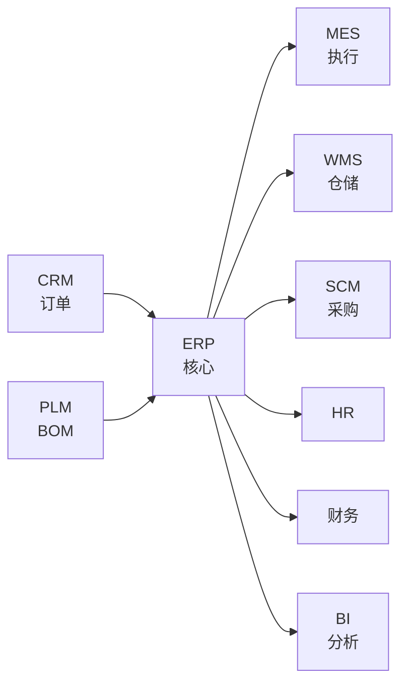

- **上游**：CRM（销售订单）、PLM（BOM/工艺路线）
- **下游**：MES（生产订单下发）、WMS（出入库指令）、SCM（采购指令）、HR（薪资接口）、BI（数据抽取）
- **横向**：财务（ERP 内含或独立）、银行系统（银企直联）

**集成核心**：ERP 是「数据中枢」，90% 系统都要与 ERP 双向同步主数据（客户/物料/供应商/BOM）

Expected: 文件 +14 行。

- [ ] **Step 5.6: 写入「⚖️ 关键考量」节**

```markdown
- **行业 Know-how 比品牌重要**：SAP 不一定比用友好，制造业适合用友/金蝶，零售适合 SAP/Oracle
- **实施周期 1-3 年**：ERP 是企业级项目，需求调研 3 个月、蓝图设计 6 个月、上线 6-12 个月、稳定期 1 年
- **数据迁移是最大风险**：5-10 年历史数据迁移（客户/物料/库存/财务余额），占总实施成本 30-40%
- **主数据治理（MDM）必须先行**：物料编码/客户编码/供应商编码没规则就上 ERP = 数据沼泽
- **顾问能力决定成败**：再好的 ERP 产品，二流顾问实施也会失败。选型时看顾问团队而非软件本身
- **云 vs 本地**：云 ERP 迭代快但定制弱；本地 ERP 定制强但迭代慢。中大型建议核心模块上云、定制模块本地
- **二次开发边界**：ERP 二次开发越多，后期升级越痛苦。控制在 5% 以内
```

Expected: 文件 +14 行。

- [ ] **Step 5.7: 写入「🎯 选型指南」节**

```markdown
| 企业规模 | 推荐 | 理由 |
|---------|------|------|
| 跨国集团（百亿+） | SAP S/4HANA / Oracle Cloud | 国际化、合规、生态 |
| 大型集团（10 亿+） | SAP / Oracle / 用友 NC / 金蝶 EAS | 多组织、多核算体系 |
| 中型制造（1-10 亿） | 用友 U9 / 金蝶云·星空 / Sage X3 | 性价比、行业方案 |
| 小型企业（千万-亿） | 金蝶云·星辰 / 浪潮 GS / 管家婆 | 简单易用、成本低 |
| 项目型（建筑/工程） | 用友 NC / 金蝶 EAS / 新中大 | 项目管理模块 |
| 零售连锁 | SAP IS-Retail / 用友 U8+ | 多门店、多业态 |

**自检维度**：
1. 行业案例（5 个以上同行业）
2. 实施商资质（同行业顾问数）
3. 二次开发比例承诺（<5%）
4. 数据迁移方案（工具+周期）
5. 后续升级与运维成本

**红线**：
- 无同行业案例 = 慎选
- 顾问 80% 是新人 = 慎选
- 二次开发预算占比 >20% = 慎选
```

Expected: 文件 +22 行。

- [ ] **Step 5.8: 写入「📚 代表案例」节**

```markdown
- **某大型装备制造集团**：500 亿营收，部署 SAP S/4HANA 实现全球 50+ 法人、多币种合并报表，财务月结从 15 天缩到 5 天
- **某中型电子制造**：30 亿规模，使用用友 U9 Cloud 实现「销售订单→MRP 运算→生产订单→MES 委外→WMS 出库」全链路打通
- **某连锁零售集团**：5000+ 门店，部署 SAP IS-Retail + 自研中台，实现「门店要货→DC 配货→门店收货」自动化
- **某建筑工程公司**：使用金蝶云·星空项目模块，实现 100+ 项目并行，WBS/合同/进度款/成本归集一体化

注：以上为公开演讲/行业报告引用的脱敏案例。
```

Expected: 文件 +10 行。

- [ ] **Step 5.9: 写入「⚠️ 常见陷阱」节**

```markdown
- **「SAP 一定比用友好」**：错。SAP 强在国际化、流程标准化；用友/金蝶强在中国本土化（税务/报表/合规）。选错比选贵更可怕
- **实施商压价中标**：500 万的 ERP 项目压到 200 万，实施商只能「上产品不做实施」，客户买了壳没用
- **主数据治理后置**：物料编码规则等到上线才讨论，财务/库存/生产每个部门一套编码，2 年后还在对账
- **关键用户不投入**：业务部门把 ERP 项目当 IT 部门的事，关键用户 30% 时间投入以下 → 项目必败
- **报表过度定制**：每个部门提 100 个报表需求，IT 加班加点 1 年都在写报表。建议 80% 用标准报表 + 20% 自助 BI
- **二次开发泛滥**：现场改业务规则而非改流程，每次升级都要重写。建议红线：二次开发占比 <5%
- **数据迁移「差不多就行」**：余额差 1 元就导致总账不平，迁移后 3 个月对账才平衡。迁移必须「零容忍」
- **变革管理缺失**：员工培训 1 小时就上岗，使用率 30%，数据失真 → 决策失真 → 回到 Excel
```

Expected: 文件 +14 行。

- [ ] **Step 5.10: 验证 + 修订主 README + Commit**

按 Task 1 Step 1.13-1.18 流程：
- 验证 `wc -l note/08.application-systems/erp/README.md` 在 200-500 行
- 主 README 修订 05 章节内 ERP 详讲为 12 行导读 + `./erp/` 链接
- 速查表 ERP 行 `—` 替换为 `[深读](./erp/)`
- Commit：

```bash
git add note/08.application-systems/erp/README.md note/08.application-systems/README.md
git commit -m "feat(note): 08.application-systems - ERP deep dive (T5)

Co-Authored-By: Claude Opus 4.8 <noreply@anthropic.com>"
```

---

### Task 6: WMS 深读（仓储管理系统）

**Files:**
- Create: `note/08.application-systems/wms/README.md`
- Modify: `note/08.application-systems/README.md`（03 供应链章节内 WMS 详讲段 + 速查表 WMS 行深读链接）

**Interfaces:**
- 消费：主 README 当前 WMS 详讲内容
- 产出：WMS 详讲段精简为 12 行 + 速查表 WMS 行替换 `—` 为 `./wms/` 链接

**可选节选取**：典型场景 + 常见陷阱（按 spec section 3.1）

- [ ] **Step 6.1: 创建 WMS 深读文件**

骨架结构同前 9 节，标题/定位/全景图替换为 WMS：

**全景图**：
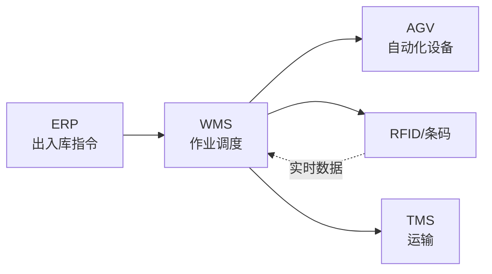

**关联链接**：返回 `../README.md#03-供应链` + ERP/SCM/TMS 关联。

- [ ] **Step 6.2: 写入「📖 定义」节**

```markdown
WMS（Warehouse Management System 仓储管理系统）是管理**仓库作业全流程**的精细化系统，覆盖入库 → 上架 → 存储 → 拣选 → 出库 → 盘点 → 退库的完整作业链。

**与 ERP/SCM 的边界**：
- ERP 管「库存数量」，WMS 管「仓库作业」
- SCM 管「采购/供应链计划」，WMS 管「实物执行」
- TMS 管「运输」，WMS 输出「待发运」给 TMS

**WMS 管什么**：库位（仓位/货架/库区）、批号、序列号、作业任务（入库单/出库单/盘点单）、设备（RF/AGV/堆垛机）

**WMS 不管的**：库存金额（ERP）、运输（TMS）、采购订单（SCM/ERP）
```

Expected: 文件 +15 行。

- [ ] **Step 6.3: 写入「🔧 核心能力」节**

```markdown
- **入库管理**：采购入库、退货入库、调拨入库、ASN（提前发货通知）预约
- **上架策略**：按库容/动销率/批次的智能上架规则
- **库存管理**：批次/序列号/有效期管理、库间调拨、锁定/解锁、库存冻结
- **出库管理**：销售出库、调拨出库、领料出库、生产补货
- **拣选策略**：波次拣选、合并拣选、边拣边分、灯光拣选
- **盘点管理**：循环盘点、动态盘点、年度大盘，支持 RF/PDA
- **库位管理**：立体库/平面库、冷库/危险品库、库位编码规则
- **设备集成**：RF 手持、条码/PDA、电子标签、AGV/AMR、堆垛机、输送线
```

Expected: 文件 +12 行。

- [ ] **Step 6.4: 写入「🏭 典型场景」节**

```markdown
- **电商仓库**：高 SKU、高订单量、强时效要求，WMS + AGV 自动化设备组合
- **制造业线边仓**：与 MES 联动，按工单配送物料到工位
- **冷链/危险品**：温湿度监控、合规追溯、批次严格管控
- **跨境保税仓**：与海关系统对接，三单对碰（订单/运单/支付单）
- **医药/医疗器械**：GSP/FDA 合规、批号追溯、效期管理
- **汽车售后备件**：序列号管理、跨多级仓库（中央 DC → 区域 RDC → 经销商）调拨

**两种部署**：
- **传统 WMS（本地）**：深度定制、与立体库/AGV 集成（曼哈顿/科箭/富勒）
- **云 WMS**：订阅式，快速上线（巨沃/快仓/海外 ShipBob）
```

Expected: 文件 +12 行。

- [ ] **Step 6.5: 写入「🔗 上下游关系」节**

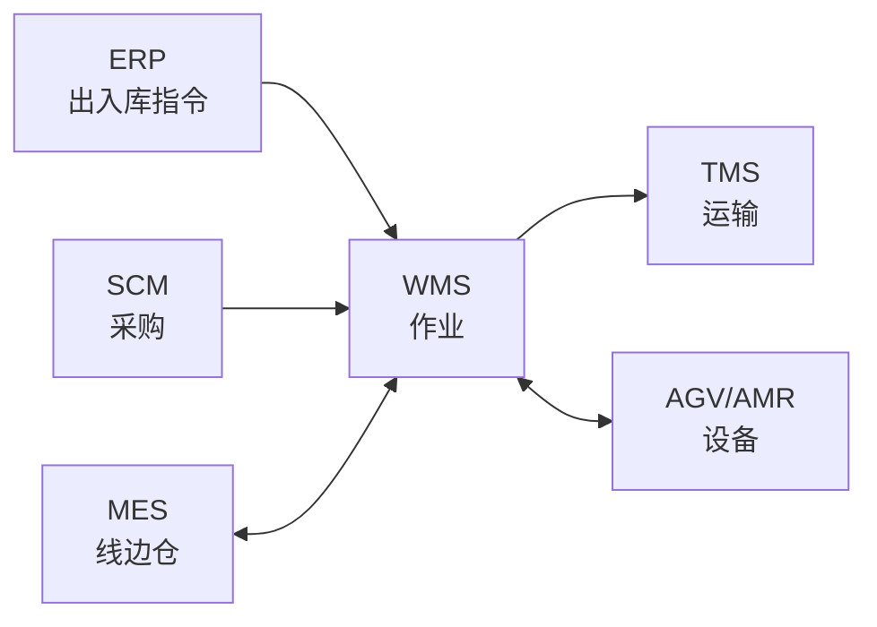

- **上游**：ERP（采购入库/销售出库指令）、SCM（采购计划）、MES（线边仓补货）
- **下游**：TMS（待发运指令）、AGV/AMR（自动化设备调度）
- **横向**：海关（保税仓对接）、财务（库存估值）

Expected: 文件 +12 行。

- [ ] **Step 6.6: 写入「⚖️ 关键考量」节**

```markdown
- **业务模式决定 WMS 形态**：B2B 整箱、B2C 拆零、电商、制造业线边仓，WMS 设计差异巨大
- **库位编码是核心**：没有科学的库位编码，WMS 沦为进销存。建议「库区-货架-层-位」四段编码
- **设备投资 vs 软件投资比例**：自动化仓库硬件投资是软件的 5-10 倍，软件选型要配合硬件规划
- **波次策略影响效率**：FIFO/FEFO/按单拣选/批量拣选，错误策略导致拣选路径翻倍
- **批次管理 vs 库位管理**：批次/序列号管理是医药/食品合规前提，没设计就上线 = 召回时找不到货
- **退货与异常处理**：退货流程、破损调账、差异处理占 WMS 工作量 30%，流程设计要预留
```

Expected: 文件 +12 行。

- [ ] **Step 6.7: 写入「🎯 选型指南」节**

```markdown
| 行业 | 推荐 | 理由 |
|------|------|------|
| 大型集团（多 DC） | 曼哈顿 / 科箭 / 富勒 | 多组织、多仓库、深度定制 |
| 电商（国内） | 巨沃 / 马帮 / 店小秘 | 强电商场景、快迭代 |
| 跨境电商 | 店小秘 / 领星 | 多平台对接、FBA 退货 |
| 制造业（立体库） | 科箭 / 富勒 / 兰剑 | 与立体库/AGV 深度集成 |
| 医药（合规） | 普罗格 / 巨鼎 | GSP 合规、批次追溯 |
| 中小（轻 WMS） | 管家婆 / 速达 | 简单易用、成本低 |

**自检维度**：
1. 同行业案例（5 个以上）
2. 设备集成能力（AGV/RF/条码）
3. 多仓多组织支持？
4. 批次/序列号/效期管理？
5. 云 vs 本地部署？

**红线**：
- 无同行业案例 = 慎选
- 不支持批次管理 = 医药/食品慎选
- 不能与硬件集成 = 自动化仓慎选
```

Expected: 文件 +16 行。

- [ ] **Step 6.8: 写入「⚠️ 常见陷阱」节**

```markdown
- **「WMS 就是进销存」**：错。WMS 是作业调度系统，不是数据记录系统。设计时围绕「作业」而非「单据」
- **库位编码混乱**：上线后 3 个月发现 30% 库位无编码或编码错误，库容利用率只有 50%
- **设备孤岛**：WMS 上线了，AGV/RF 设备没集成，工人继续手写单据，作业效率反而下降
- **波次策略设计不合理**：按订单逐单拣选，每单走全仓，工人日行 30 公里。设计波次后缩到 5 公里
- **退货流程缺失**：上线时只考虑正向流程，退货时工人手工填单，3 个月后库位与系统对不上
- **盘点走过场**：每月盘点 100 SKU，1 万 SKU 库永远不准。设计循环盘点 + 盲盘机制
- **多仓调拨不协同**：多 DC 之间调拨需要审批流程，WMS 没设计 = 仓库间对账混乱
- **跨境保税合规漏项**：海关三单对碰失败，货物被扣。WMS 与海关系统对接要前置设计
```

Expected: 文件 +14 行。

- [ ] **Step 6.9: 验证 + 修订主 README + Commit**

按 Task 1 Step 1.13-1.18 流程：
- 验证 `wc -l note/08.application-systems/wms/README.md` 在 200-500 行
- 主 README 修订 03 章节内 WMS 详讲为 12 行导读 + `./wms/` 链接
- 速查表 WMS 行 `—` 替换为 `[深读](./wms/)`
- 最终验证：
  - `ls note/08.application-systems/*/README.md | wc -l` 应为 6
  - `wc -l note/08.application-systems/README.md` 应为 380-420 行
  - `grep -rE "TODO|TBD|待完善" note/08.application-systems/` 应为 0 行
  - `grep -rE "\.png|\.jpg|\.jpeg" note/08.application-systems/` 应为 0 行
- Commit：

```bash
git add note/08.application-systems/wms/README.md note/08.application-systems/README.md
git commit -m "feat(note): 08.application-systems - WMS deep dive (T6)

- Final task in hybrid architecture series
- 6 deep-dive subdirs complete: plm/pdm/mes/crm/erp/wms
- Main README trimmed to target range (380-420 lines)
- Cheatsheet deep-dive column fully populated (6 links, 15 placeholders)

Co-Authored-By: Claude Opus 4.8 <noreply@anthropic.com>"
```

Expected: 完成全部 6 个深读，主 README 380-420 行，6 个 commit 推送 master。

---

## Self-Review Checklist（写完计划后自检）

- [x] **Spec 覆盖**：spec 中 6 系统（PLM/PDM/MES/CRM/ERP/WMS）每系统 1 个任务，匹配 6 commits
- [x] **占位符**：每个 Step 中的 `<!-- TODO Step X.Y -->` 是给实现者的具体指令，不是「待完善」；所有 mermaid 代码块都已给出
- [x] **类型/命名一致性**：
  - 所有深读 README 文件名一致：`note/08.application-systems/{system}/README.md`
  - 速查表链接风格一致：相对路径 `./{system}/`
  - 6 标准节标题 emoji 一致：`## 📌 全景图` / `## 📖 定义` / `## 🔧 核心能力` / `## 🏭 典型场景` / `## 🔗 上下游关系` / `## ⚖️ 关键考量` / `## 🎯 选型指南`
  - 3 可选节 emoji 一致：`## 📜 历史脉络` / `## ⚠️ 常见陷阱` / `## 📚 代表案例`
- [x] **范围**：仅动 08，不影响其他章节（CRM 链回主 README 而非新建关联深读）
- [x] **可执行性**：每个 Step 都有具体的 Write/Edit/Bash 命令，无「类似」「相应」「适当」等模糊表述
- [x] **TDD 风格**：此任务为内容生成（Markdown），无代码逻辑可单元测试；改用 4 类验收检查（行数/链接/无 PNG/无占位符）作为质量门