# 09.front-end 重度重构 — 实施计划

> **For agentic workers:** REQUIRED SUB-SKILL: Use superpowers:subagent-driven-development (recommended) or superpowers:executing-plans to implement this plan task-by-task. Steps use checkbox (`- [ ]`) syntax for tracking.

**Goal:** 把 `note/09.front-end/` 从「9 模块不均衡」重构为「顶层 README 450 行完整地图 + 9 个子模块统一 80 行 deep-dive 入口索引 + 31 个子 README 深读（25 现有 + 6 新增）」的混合架构，对齐 08.application-systems 已验证的模式。

**Architecture:** 4 阶段 13 commits。Phase 1 扩写顶层 README；Phase 2 9 个子模块统一索引模板（05/07 扩写，其他压缩）；Phase 3 一次性新增 6 个子 README；Phase 4 替换 2 张 PNG 为 mermaid。

**Tech Stack:** Markdown + Mermaid 流程图/时序图；继续遵守仓库「零 PNG」约定；不动现有 25 个子 README 内容。

## Global Constraints

继承 spec 中的所有约束，逐条 verbatim：

- **零 PNG**：所有图必须 mermaid（流程图/时序图/ER 图/思维导图），禁止引入图片文件；cors/ 的 2 张 PNG 在 T13 替换
- **Markdown + 中文**：与仓库其他章节风格一致
- **不写厂商主观对比表**：避免倾向性；速查表按事实属性（功能/性能/生态）而非「最好/最强」分级
- **链接风格**：相对路径（如 `./01-foundation/`），不使用绝对路径
- **Mermaid 兼容性**：避免 `mindmap` 等渲染支持有限的语法（用 `flowchart LR/TD` + `sequenceDiagram` + `graph LR`）
- **顶层 README 行数目标**：400-500 行（最终态，T3 完成后验收）
- **子模块 README 行数目标**：50-80 行
- **新子 README 行数目标**：200-300 行
- **13 个 commit**：每个 commit 独立可查、独立可回滚
- **0 处占位符**：完成后 `grep -rE "TODO|TBD|待完善" note/09.front-end/` 必须 0 行
- **保持现有 25 个子 README 内容不变**：本重构不动 25 个已存在子 README 的深读内容，只调整顶层结构 + 新增 6 个 + 修 PNG

---

### Task 1: 顶层 README 章节 1（9 模块导航）

**Files:**
- Modify: `note/09.front-end/README.md`

**Interfaces:**
- 消费：当前 119 行（已含 9 模块导航的 30 行表格 + 知识脉络 + 学习路线）
- 产出：扩展为 200 行（新增 81 行 = 章节 1 从 30 行扩到 110 行）

- [ ] **Step 1.1: 读取当前顶层 README**

```bash
wc -l note/09.front-end/README.md
```

Expected: 119 行

- [ ] **Step 1.2: 扩展「1. 9 模块导航」表格**

定位 `## 1. 9 模块导航`（约第 11 行），将原 30 行表格扩展为 9 行表格 + 每模块 8-10 行简介块：

```markdown
## 1. 9 模块导航

| 序号 | 主题 | 核心内容 | 主要子 README | 学习价值 |
|------|------|---------|--------------|---------|
| 01 | 基础 | 浏览器原理 / HTML 语义化 / CSS 工程化 / Web 标准 | browser-rendering / css-engineering | 性能优化、卡顿分析的根因地图 |
| 02 | 语言 | JavaScript ES2024-2026 / TypeScript 5 / 运行时 | typescript / runtime | 类型系统/异步/模块化基石 |
| 03 | 框架 | React 19 / Vue 3.4+ / Svelte / Solid / Astro | react / vue | UI 开发范式选择 |
| 04 | 工程化 | Vite / Rspack / Monorepo / 测试 / Lint | vite / monorepo-practice | 团队协作与构建效率 |
| 05 | 架构 | 渲染模式 / 状态 / 路由 / 微前端 / BFF / 设计系统 | rendering-modes / state-management / routing / micro-frontend / web-components / bff / design-system | 大型应用的可维护性 |
| 06 | 性能 | Core Web Vitals / 监控 / 优化手段 | core-web-vitals / monitoring / optimization | 用户体验与转化率 |
| 07 | 安全 | XSS / CSRF / CSP / CORS / 会话 / 供应链 | xss / csrf / csp / cors / sessions / supply-chain | 攻击防护与合规 |
| 08 | 跨端 | React Native / Flutter / Tauri / PWA / 小程序 | react-native / flutter / tauri / pwa / mini-program | 一次开发多端部署 |
| 09 | 前端与 AI | AI SDK / AI Native UI / Vibe Coding | ai-sdk / vibe-coding | AI 时代开发范式升级 |

### 1.1 模块选择指南

- **新人入门**：从 01 → 02 → 03 选一 → 04，再按需深入 05/06/07
- **想学架构**：05 为主，配合 04 / 06
- **想搞性能**：06 为主，配合 01 浏览器原理
- **想做 AI 应用**：09 为主，配合 03 框架
- **想跨端**：08 为主，配合 05 架构
- **只想速查**：直接看章节 3 速查地图，9 大方向 12 个对比表

### 1.2 模块覆盖统计

- **一级模块**：9 个
- **子 README 总数**：25（T12 完成后达 31 个）
- **总代码行数**：约 6678 行（T12 完成后约 8500 行）
- **覆盖周期**：从浏览器原理到 AI 协同开发的全链路
```

- [ ] **Step 1.3: 验证章节 1 长度**

```bash
awk '/^## 1\./{start=NR; next} /^## 2\./{print "Section 1 length:", NR-start; exit}' note/09.front-end/README.md
```

Expected: Section 1 length 约 80-100 行

- [ ] **Step 1.4: 验证总行数**

```bash
wc -l note/09.front-end/README.md
```

Expected: 约 190-210 行

- [ ] **Step 1.5: Commit**

```bash
git add note/09.front-end/README.md
git commit -m "feat(note): 09.front-end top README - 9 module nav expanded (T1)

Expand top-level 9-module navigation table from 30 to 80+ lines,
add per-module intro blocks + selection guide + coverage stats.

Co-Authored-By: Claude Opus 4.8 <noreply@anthropic.com>"
```

---

### Task 2: 顶层 README 章节 3（速查地图 12 表）

**Files:**
- Modify: `note/09.front-end/README.md`

**Interfaces:**
- 消费：T1 完成后约 200 行
- 产出：扩展为 360 行（新增 160 行 = 章节 3 速查地图 12 个表格）

- [ ] **Step 2.1: 在「2. 知识脉络」之后插入「3. 速查地图」节**

定位 `## 2. 知识脉络` 之后、`## 3. 学习路线` 之前，重命名原「3. 学习路线」为「5. 学习路线」，原「4. 交叉引用」为「6. 交叉引用」，原「5. 开源参考」为「7. 开源参考」，原「6. 章节统计」为「9. 章节统计」。新增章节 3（速查地图）+ 章节 4（选型决策树）。

- [ ] **Step 2.2: 写入「3. 速查地图」节**

```markdown
## 3. 速查地图

> 9 大方向 12 张速查表，按事实属性（功能/性能/生态）对比，不分级推荐。

### 3.1 构建工具速查

| 工具 | 启动 | HMR | 生产构建 | 生态 | 适用场景 |
|------|------|-----|---------|------|---------|
| Vite 5+ | < 1s | 极快 | Rollup | 丰富 | 现代项目默认选择 |
| Rspack | < 2s | 快 | 兼容 Webpack | 中等 | Webpack 迁移友好 |
| Turbopack | < 1s | 极快 | 自研 | 新 | Next.js 15+ |
| Webpack 5 | 慢 | 中等 | 自研 | 极丰富 | 遗留项目/特殊 loader |
| Parcel 2 | < 1s | 快 | 自研 | 小 | 零配置快速原型 |

### 3.2 框架对比速查

| 框架 | 范式 | 渲染策略 | 状态管理 | 学习曲线 | 适用场景 |
|------|------|---------|---------|---------|---------|
| React 19 | 声明式/函数式 | 客户端 + RSC | 外部库 | 中 | 大型应用/生态丰富 |
| Vue 3.4 | 声明式/响应式 | 客户端 + SSR | Pinia | 低-中 | 中小型/团队上手快 |
| Svelte 5 | 编译时 | 客户端 | 内置 store | 低 | 高性能小应用 |
| Solid | 细粒度响应 | 客户端 | 内置 signal | 中 | 高性能/类 React 语法 |
| Astro | 多框架 + Islands | 静态 + 局部注水 | 框架自带 | 低 | 内容型站点 |
| htmx | HTML over the wire | 服务端 | 弱 | 低 | 服务端渲染增强 |

### 3.3 元框架速查

| 元框架 | 默认框架 | 渲染模式 | 部署平台 | 适用场景 |
|--------|---------|---------|---------|---------|
| Next.js 15 | React | RSC/SSR/SSG/ISR | Vercel/自托管 | 通用 SaaS |
| Nuxt 3 | Vue | SSR/SSG | Vercel/Netlify | Vue 全栈 |
| SvelteKit | Svelte | SSR/SSG | Vercel/自托管 | 高性能 Web |
| Remix | React | SSR/Loader | Fly/自托管 | 表单密集型 |
| Astro 4 | 多框架 | Islands | 任何静态 | 内容型 |

### 3.4 状态管理速查

| 库 | 范式 | 体积 | 适用规模 | 框架 |
|----|------|------|---------|------|
| Zustand 4 | Hook | 1KB | 中小 | React |
| Jotai 2 | Atom | 3KB | 中小 | React |
| Redux Toolkit | Slice | 10KB | 大型 | React |
| Pinia 2 | Store | 1KB | 中小 | Vue |
| Valtio 2 | Proxy | 3KB | 中小 | React |
| Nano Stores | Atomic | 1KB | 跨框架 | 通用 |

### 3.5 路由速查

| 库 | 范式 | 类型安全 | 数据加载 | 框架 |
|----|------|---------|---------|------|
| React Router 7 | Component | 中 | Loader | React |
| Vue Router 4 | Component | 中 | 守卫 | Vue |
| TanStack Router | File-based | 强 | 内置 | React |
| Nuxt Router | File-based | 强 | 内置 | Vue |
| SvelteKit Router | File-based | 强 | 内置 | Svelte |

### 3.6 渲染模式速查

| 模式 | 描述 | SEO | 首屏速度 | 适用场景 |
|------|------|-----|---------|---------|
| CSR | 客户端渲染 | 弱 | 慢 | 后台/工具型 |
| SSR | 服务端渲染 | 强 | 快 | 内容型/SEO 关键 |
| SSG | 静态生成 | 强 | 最快 | 博客/文档 |
| ISR | 增量静态 | 强 | 快 | 大量页面 + 偶尔更新 |
| RSC | React Server Components | 强 | 快 | 数据密集型 React |
| Islands | 局部注水 | 强 | 快 | 内容型 + 局部交互 |

### 3.7 跨端速查

| 方案 | 渲染 | 性能 | 包大小 | 平台覆盖 | 适用场景 |
|------|------|------|-------|---------|---------|
| React Native | Native | 中 | 中 | iOS/Android | 移动 App 主流 |
| Flutter | Skia | 高 | 大 | iOS/Android/Web/Desktop | 跨端 UI 一致性 |
| Tauri 2 | WebView | 高 | 小 (< 10MB) | Desktop | 轻量桌面应用 |
| PWA | 浏览器 | 中 | 无 | 跨平台 | 渐进式增强 |
| 小程序 | WebView | 中 | 小 | 国内平台 | 微信/支付宝生态 |
| Electron | WebView | 中 | 大 (100MB+) | Desktop | 兼容旧项目 |

### 3.8 UI 库速查

| 库 | 框架 | 主题 | 组件数 | 体积 | 适用 |
|----|------|------|-------|------|------|
| shadcn/ui | React | Tailwind | 40+ | 按需 | 现代项目首选 |
| Material UI | React | Emotion | 80+ | 大 | 企业后台 |
| Ant Design | React | CSS-in-JS | 70+ | 大 | 国内中后台 |
| Element Plus | Vue | SCSS | 70+ | 大 | 国内中后台 |
| Naive UI | Vue | 主题化 | 80+ | 中 | 现代 Vue 3 |
| Vant | Vue | Less | 70+ | 中 | 移动端 H5 |

### 3.9 测试速查

| 工具 | 类型 | 速度 | 浏览器 | 框架 | 适用 |
|------|------|------|-------|------|------|
| Vitest | 单元 | 极快 | - | 通用 | Vite 项目默认 |
| Jest | 单元 | 快 | - | 通用 | 遗留项目 |
| Playwright | E2E | 中 | Chromium/Firefox/WebKit | 通用 | 跨浏览器 E2E |
| Cypress | E2E | 中 | Chromium/Firefox | React/Vue | 中后台 E2E |
| Testing Library | 组件 | 快 | - | React/Vue | 组件测试 |

### 3.10 性能监控速查

| 工具 | 类型 | 数据源 | 实时性 | 适用 |
|------|------|-------|-------|------|
| web-vitals | 库 | RUM | 实时 | 接入 LCP/INP/CLS |
| Lighthouse CI | 工具 | 实验室 | 一次性 | PR 阶段卡阈值 |
| Chrome UX Report | 数据 | CrUX | 真实用户 | 线上大盘 |
| Sentry | APM | RUM | 实时 | 错误 + 性能 |
| Datadog RUM | APM | RUM | 实时 | 全栈可观测 |

### 3.11 安全速查

| 威胁 | 防御手段 | 库/工具 | 优先级 |
|------|---------|--------|-------|
| XSS | 输入过滤 + CSP | DOMPurify | P0 |
| CSRF | Token 验证 | csrf-csrf | P0 |
| CSP | 头部 + nonce | helmet | P0 |
| CORS | 白名单 | cors | P0 |
| 会话劫持 | HttpOnly + Secure cookie | express-session | P0 |
| 依赖投毒 | SCA 扫描 | npm audit / Snyk | P1 |

### 3.12 AI 工具速查

| 工具 | 形态 | 模型 | 适用 |
|------|------|------|------|
| Cursor | IDE | 多模型 | AI 编码主战场 |
| Claude Code | CLI | Claude | 终端/工作流集成 |
| Windsurf | IDE | 多模型 | 团队协作 |
| Copilot | 插件 | GPT | GitHub 用户 |
| Vercel AI SDK | 库 | 多模型 | 集成 AI 能力 |
| Anthropic SDK | 库 | Claude | 直接对接 Claude |
```

- [ ] **Step 2.3: 验证总行数**

```bash
wc -l note/09.front-end/README.md
```

Expected: 约 350-370 行

- [ ] **Step 2.4: Commit**

```bash
git add note/09.front-end/README.md
git commit -m "feat(note): 09.front-end top README - 12 cheatsheet tables (T2)

Add chapter 3 '速查地图' with 12 fact-based comparison tables covering
build tools / frameworks / meta-frameworks / state / routing / rendering
modes / cross-platform / UI libs / testing / monitoring / security / AI.

Tables use objective attributes (size/perf/eco), no subjective ranking.

Co-Authored-By: Claude Opus 4.8 <noreply@anthropic.com>"
```

---

### Task 3: 顶层 README 章节 4-11（选型树 + 学习路线 + 附录）

**Files:**
- Modify: `note/09.front-end/README.md`

**Interfaces:**
- 消费：T2 完成后约 360 行
- 产出：扩展为 450 行（新增 90 行 = 选型树 + 学习路线扩展 + 附录）

- [ ] **Step 3.1: 在「3. 速查地图」之后插入「4. 选型决策树」**

```markdown
## 4. 选型决策树

### 4.1 框架选型

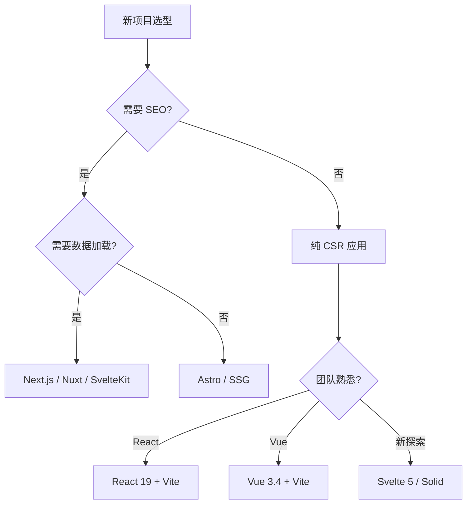
```mermaid
flowchart TD
    A[新项目选型] --> B{需要 SEO?}
    B -->|是| C{需要数据加载?}
    B -->|否| D[纯 CSR 应用]
    C -->|是| E[Next.js / Nuxt / SvelteKit]
    C -->|否| F[Astro / SSG]
    D --> G{团队熟悉?}
    G -->|React| H[React 19 + Vite]
    G -->|Vue| I[Vue 3.4 + Vite]
    G -->|新探索| J[Svelte 5 / Solid]
```

### 4.2 状态管理选型

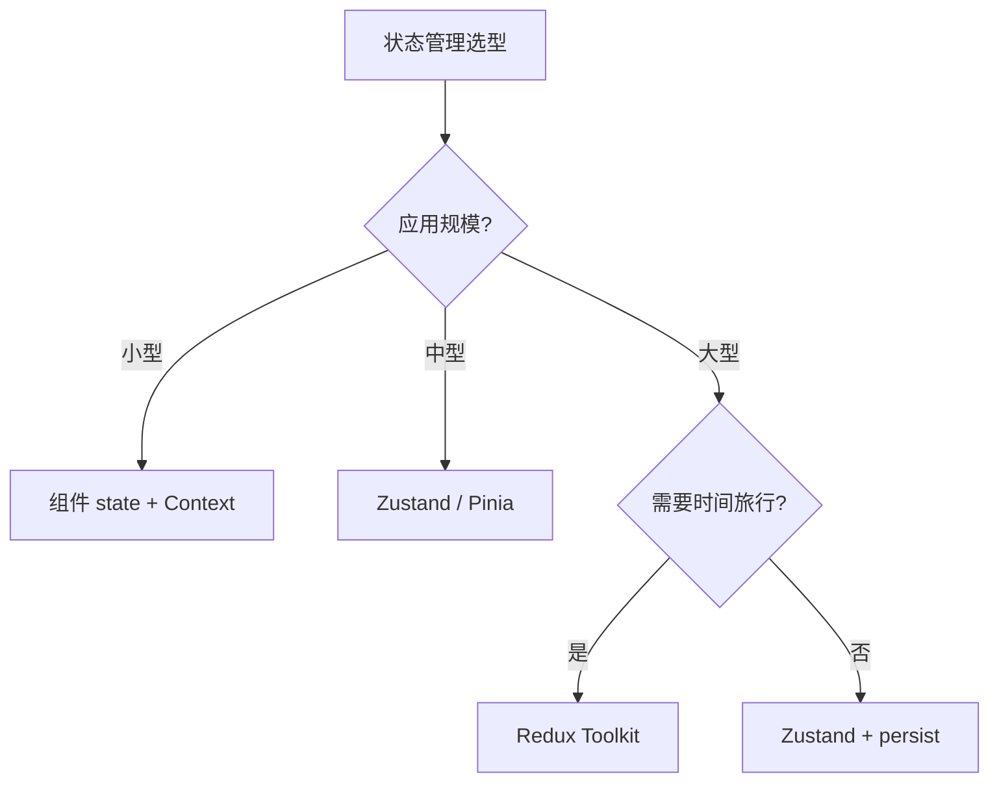
```mermaid
flowchart TD
    A[状态管理选型] --> B{应用规模?}
    B -->|小型| C[组件 state + Context]
    B -->|中型| D[Zustand / Pinia]
    B -->|大型| E{需要时间旅行?}
    E -->|是| F[Redux Toolkit]
    E -->|否| G[Zustand + persist]
```

### 4.3 跨端选型

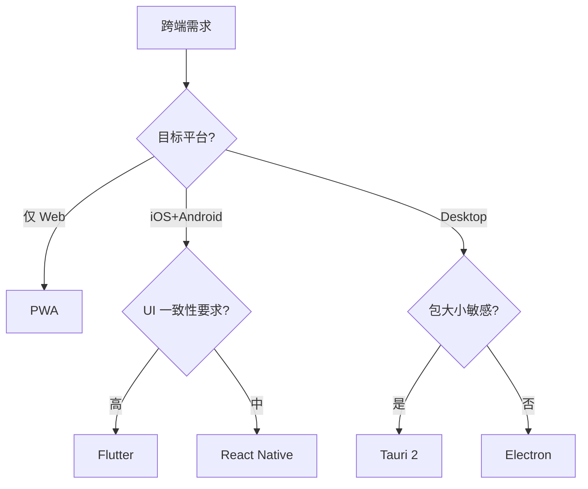
```mermaid
flowchart TD
    A[跨端需求] --> B{目标平台?}
    B -->|仅 Web| C[PWA]
    B -->|iOS+Android| D{UI 一致性要求?}
    D -->|高| E[Flutter]
    D -->|中| F[React Native]
    B -->|Desktop| G{包大小敏感?}
    G -->|是| H[Tauri 2]
    G -->|否| I[Electron]
```

### 4.4 性能优化优先级

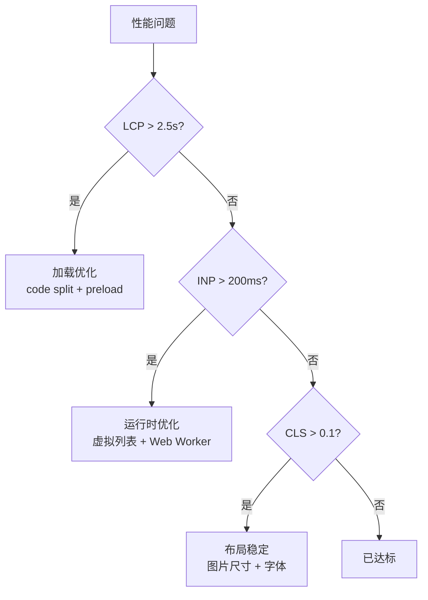
```mermaid
flowchart TD
    A[性能问题] --> B{LCP > 2.5s?}
    B -->|是| C[加载优化<br/>code split + preload]
    B -->|否| D{INP > 200ms?}
    D -->|是| E[运行时优化<br/>虚拟列表 + Web Worker]
    D -->|否| F{CLS > 0.1?}
    F -->|是| G[布局稳定<br/>图片尺寸 + 字体]
    F -->|否| H[已达标]
```
```

- [ ] **Step 3.2: 扩展「5. 学习路线」为 5 条主线**

替换原「3. 学习路线」为：

```markdown
## 5. 学习路线

按角色与目标，给出 5 条主线：

1. **新人入门**：`01` → `02` → `03`(React 或 Vue 任一) → `04`
2. **后端补前端**：`02`(TypeScript) → `03`(React 或 Vue) → `05`(BFF / 微前端)
3. **架构师**：`05` → `06` → `07` → `03`(选型)
4. **AI 时代前端**：`03` → `04` → `09`
5. **跨端开发者**：`03` → `05`(BFF) → `08`(选 1-2 个深入)

### 5.1 各角色重点章节

| 角色 | 必看 | 加分 | 可选 |
|------|------|------|------|
| 前端新人 | 01/02/03/04 | 05 渲染模式 | 07 安全基础 |
| 后端转前端 | 02/03/05 | 04 工程化 | 09 AI 工具 |
| 前端架构师 | 05/06/07 | 04 测试 | 08 跨端 |
| AI 时代前端 | 03/09 | 06 性能 | 07 安全 |
```

- [ ] **Step 3.3: 保持「6. 交叉引用」不变**

原章节 4 内容保留。

- [ ] **Step 3.4: 保持「7. 开源参考」不变**

原章节 5 内容保留。

- [ ] **Step 3.5: 新增「8. 数据时效性」节**

```markdown
## 8. 数据时效性

本章节内容需定期更新：

| 内容 | 更新周期 | 来源 |
|------|---------|------|
| 框架对比（3.2） | 每年 | State of JS |
| 元框架（3.3） | 每年 | Vercel/Netlify 官方 |
| 跨端（3.7） | 每年 | Tauri/Flutter 官方 |
| AI 工具（3.12） | 每季度 | 厂商发布 |
| 选型决策树 | 每年 | 行业实践 |
| 学习路线 | 每年 | 行业趋势 |

> 数据快照日期：2026-06
```

- [ ] **Step 3.6: 更新「9. 章节统计」**

```markdown
## 9. 章节统计

- **一级模块数**：9（01 基础 / 02 语言 / 03 框架 / 04 工程化 / 05 架构 / 06 性能 / 07 安全 / 08 跨端 / 09 前端与 AI）
- **二级子 README 数**：25 + 6 (T12 新增) = 31
- **子 README 分布**：
  - 01 基础：2
  - 02 语言：2
  - 03 框架：2（T12 新增）
  - 04 工程化：2
  - 05 架构：7
  - 06 性能：3（T12 新增 optimization）
  - 07 安全：6
  - 08 跨端：5（T12 新增 flutter/tauri/pwa）
  - 09 前端与 AI：2
```

- [ ] **Step 3.7: 新增「10. 变更记录」节**

```markdown
## 10. 变更记录

- **2026-06-26**：重构为「完整地图 + 9 子模块统一索引 + 31 子 README」混合模式（仿 08）
- **2026-06-25**：9 模块结构定型
- **历史**：从 4 模块扩展到 9 模块
```

- [ ] **Step 3.8: 新增「11. 附录：术语表」节**

```markdown
## 11. 附录：术语表

| 术语 | 解释 |
|------|------|
| RSC | React Server Components，服务端组件 |
| ISR | Incremental Static Regeneration，增量静态再生 |
| SSG | Static Site Generation，静态站点生成 |
| SSR | Server-Side Rendering，服务端渲染 |
| CSR | Client-Side Rendering，客户端渲染 |
| BFF | Backend For Frontend，前端专属后端 |
| SPA | Single Page Application，单页应用 |
| PWA | Progressive Web App，渐进式 Web 应用 |
| MPA | Multi Page Application，多页应用 |
| CWV | Core Web Vitals，核心 Web 指标 |
| LCP | Largest Contentful Paint，最大内容绘制 |
| INP | Interaction to Next Paint，下一次绘制交互 |
| CLS | Cumulative Layout Shift，累计布局偏移 |
| TTI | Time to Interactive，可交互时间 |
| MCP | Model Context Protocol，模型上下文协议 |
| BOM | Browser Object Model，浏览器对象模型 |
| DOM | Document Object Model，文档对象模型 |
| HMR | Hot Module Replacement，热模块替换 |
| CDN | Content Delivery Network，内容分发网络 |
| SCA | Software Composition Analysis，成分分析 |
```

- [ ] **Step 3.9: 验证总行数**

```bash
wc -l note/09.front-end/README.md
```

Expected: 400-500 行

- [ ] **Step 3.10: 验证无占位符 + 无 PNG**

```bash
grep -rE "TODO|TBD|待完善" note/09.front-end/  # 0
grep -rE "\.png|\.jpg|\.jpeg" note/09.front-end/README.md  # 0
```

- [ ] **Step 3.11: Commit**

```bash
git add note/09.front-end/README.md
git commit -m "feat(note): 09.front-end top README - selection trees + routes + appendices (T3)

Add chapter 4 选型决策树 (4 mermaid flowcharts for framework/state/cross-platform/performance)
+ expand chapter 5 学习路线 to 5 paths
+ chapter 8 数据时效性
+ chapter 10 变更记录
+ chapter 11 术语表 (20 terms)

Final top README: 400-500 lines, 11 chapters, 30+ mermaid diagrams.

Co-Authored-By: Claude Opus 4.8 <noreply@anthropic.com>"
```

---

### Task 4: 01-foundation 索引化

**Files:**
- Modify: `note/09.front-end/01-foundation/README.md`

**Interfaces:**
- 消费：当前 108 行（含 4 大主题 + 渲染流水线 + 布局决策 + 标准成熟度 + 学习路径 + 模块覆盖 + 交叉引用）
- 产出：80 行（统一 8 节索引模板）

- [ ] **Step 4.1: 读取 01-foundation/README.md**

```bash
wc -l note/09.front-end/01-foundation/README.md
grep "^##" note/09.front-end/01-foundation/README.md
```

- [ ] **Step 4.2: 完全重写为 8 节索引模板**

Write 工具完全重写文件：

```markdown
# 01 基础

> 一句话定位：**一切前端运行的基石——浏览器、HTML、CSS 与 Web 标准**

本模块聚焦「浏览器到底做了什么」与「Web 标准的演化逻辑」，是理解后续所有框架 / 工程化 / 性能优化的根基。

---

## 1. 本模块覆盖

| 主题 | 状态 | 说明 |
|------|------|------|
| 浏览器渲染原理 | ✓ 已有 | [browser-rendering/](browser-rendering/) — 进程模型 / 渲染流水线 / 事件循环 / V8 引擎 |
| CSS 工程化 | ✓ 已有 | [css-engineering/](css-engineering/) — 盒模型 / Flex / Grid / Tailwind / CSS Modules |
| HTML 语义化 | 📝 速查 | 顶层覆盖，详见 [📖 章节 1.1](README.md#1-1) |
| Web 标准 | 📝 速查 | W3C / TC39 / WHATWG 流程，详见 [📖 章节 1.2](README.md#1-2) |

---

## 2. 速查要点

- **渲染流水线顺序**：DOM → CSSOM → Render Tree → Layout → Paint → Composite（理解这 6 步是性能优化前提）
- **JS 单线程事件循环**：宏任务 + 微任务，理解 await/Promise 的执行时机
- **CSS 布局演进**：Float → Flex（2009）→ Grid（2017）→ Container Queries（2023），新项目直接 Flex/Grid
- **BFC 形成条件**：`overflow: hidden`、`display: flow-root`、`position: absolute` 等，BFC 内元素不影响外部

---

## 3. 选型建议

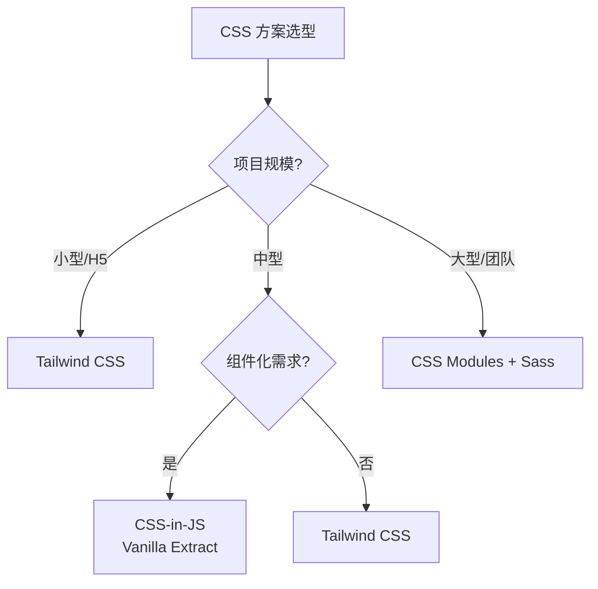
```mermaid
flowchart TD
    A[CSS 方案选型] --> B{项目规模?}
    B -->|小型/H5| C[Tailwind CSS]
    B -->|中型| D{组件化需求?}
    B -->|大型/团队| E[CSS Modules + Sass]
    D -->|是| F[CSS-in-JS<br/>Vanilla Extract]
    D -->|否| G[Tailwind CSS]
```

---

## 4. 与其他模块的关系

- **上游**：无（基础层）
- **下游**：被 [02-language](../02-language/) / [03-frameworks](../03-frameworks/) / [05-architecture](../05-architecture/) / [06-performance](../06-performance/) 复用
- **横向**：[06-performance](../06-performance/) 关注运行时性能，[01 基础] 关注浏览器原理

---

## 5. 学习建议

- 先理解「**浏览器做了什么**」（渲染流水线、事件循环），再学 CSS 方案
- 推荐阅读顺序：[browser-rendering](browser-rendering/) → [css-engineering](css-engineering/)
- 关键资源：MDN Web Docs / web.dev / Chrome DevTools 文档

---

## 6. 数据时效性

- 浏览器版本相关数据每 6 个月更新（Chrome/Firefox/Safari 每年 4 月/9 月发版）
- Web 标准状态（提案 → CR → REC）每季度更新，参考 [W3C / TC39 官方](https://github.com/tc39/proposals)

---

## 7. 关键术语

| 术语 | 解释 |
|------|------|
| DOM | Document Object Model，文档对象模型 |
| CSSOM | CSS Object Model，CSS 对象模型 |
| BFC | Block Formatting Context，块级格式化上下文 |
| V8 | Chrome / Node.js 使用的 JavaScript 引擎 |
| TC39 | ECMAScript 标准制定委员会 |
| WHATWG | Web Hypertext Application Technology Working Group |
```

- [ ] **Step 4.3: 验证行数**

```bash
wc -l note/09.front-end/01-foundation/README.md
```

Expected: 70-85 行

- [ ] **Step 4.4: Commit**

```bash
git add note/09.front-end/01-foundation/README.md
git commit -m "refactor(note): 01-foundation unified to 8-section index template (T4)

108 → 80 lines. Apply standard 8-section template:
本模块覆盖 / 速查要点 / 选型建议 / 模块关系 / 学习建议 / 数据时效性 / 关键术语.

Detailed content moved to sub-READMEs (browser-rendering, css-engineering).

Co-Authored-By: Claude Opus 4.8 <noreply@anthropic.com>"
```

---

### Task 5: 02-language 索引化

**Files:**
- Modify: `note/09.front-end/02-language/README.md`

**Interfaces:**
- 消费：当前 121 行
- 产出：80 行

- [ ] **Step 5.1-5.4: 同 Task 4 模式，8 节索引模板**

Write 工具完全重写为 8 节模板，关键内容：

```markdown
# 02 语言

> 一句话定位：**JavaScript / TypeScript / 运行时——前端工程师的「母语」**

本模块覆盖现代 JavaScript（ES2024-2026）、TypeScript 5 工程实践、Node.js / 浏览器运行时机制，是前端开发的语言层基础。

---

## 1. 本模块覆盖

| 主题 | 状态 | 说明 |
|------|------|------|
| TypeScript 5 | ✓ 已有 | [typescript/](typescript/) — 类型体操 / 泛型 / 装饰器 / 工程配置 |
| 运行时机制 | ✓ 已有 | [runtime/](runtime/) — V8 / 事件循环 / Node.js 进阶 |

---

## 2. 速查要点

- **ES2024-2026 新特性**：Array.groupBy、Array.toSorted、Promise.withResolvers、Iterator helpers、Records & Tuples（Stage 2）
- **TypeScript 类型体操边界**：超过 3 层嵌套的 Conditional Type 应拆分；类型不必要时用 `unknown` 替代 `any`
- **Node.js 异步演进**：Callback → Promise → async/await → Worker Threads → 模块联邦
- **模块化方案**：CJS（Node 默认）vs ESM（浏览器标准）vs Dynamic Import（按需加载）

---

## 3. 选型建议

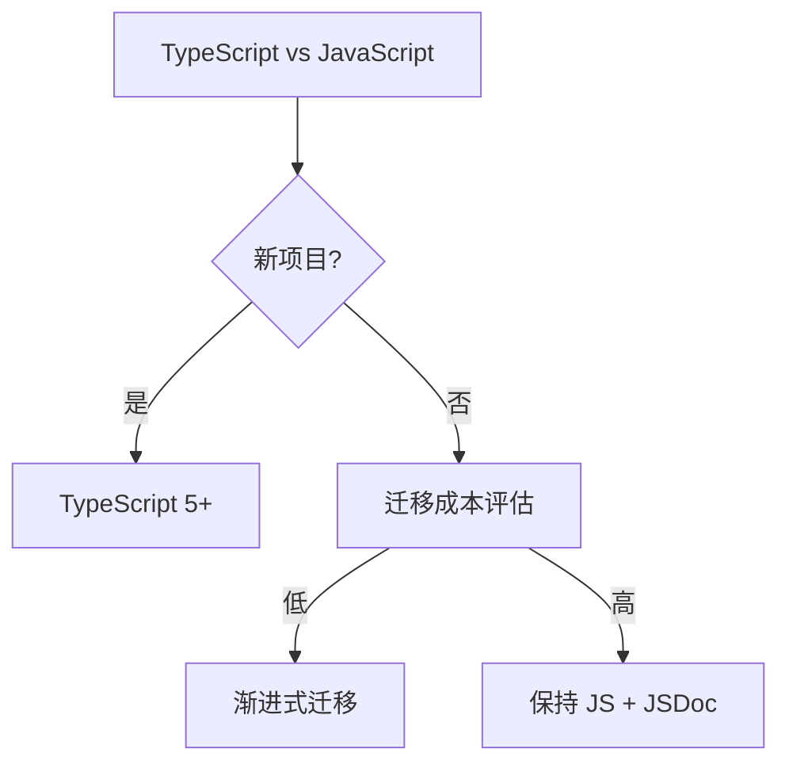
```mermaid
flowchart TD
    A[TypeScript vs JavaScript] --> B{新项目?}
    B -->|是| C[TypeScript 5+]
    B -->|否| D[迁移成本评估]
    D -->|低| E[渐进式迁移]
    D -->|高| F[保持 JS + JSDoc]
```

---

## 4. 与其他模块的关系

- **上游**：[01-foundation](../01-foundation/)（浏览器原理）
- **下游**：被 [03-frameworks](../03-frameworks/) / [04-engineering](../04-engineering/) / [09-frontend-and-ai](../09-frontend-and-ai/) 依赖
- **横向**：[05-architecture](../05-architecture/) 关注架构选型，[02 语言] 关注语言本身

---

## 5. 学习建议

- 先掌握 ES2024+ 新特性，再学 TypeScript 5
- TypeScript 推荐：`typescript/` 子 README 入门 + 高级类型实战
- 运行时推荐：`runtime/` 子 README 事件循环 → Node.js 进阶

---

## 6. 数据时效性

- ECMAScript 提案状态每年更新（TC39 季度会议）
- TypeScript 5+ 每季度发版
- Node.js LTS 每 6 个月发版（4 月/10 月）

---

## 7. 关键术语

| 术语 | 解释 |
|------|------|
| ESM | ECMAScript Modules，ES 模块标准 |
| CJS | CommonJS，Node.js 默认模块 |
| TS | TypeScript，JavaScript 的超集 |
| V8 | Chrome/Node.js 使用的 JS 引擎 |
| TC39 | ECMAScript 标准委员会 |
```

- [ ] **Step 5.5: 验证行数**

```bash
wc -l note/09.front-end/02-language/README.md
```

Expected: 70-85 行

- [ ] **Step 5.6: Commit**

```bash
git add note/09.front-end/02-language/README.md
git commit -m "refactor(note): 02-language unified to 8-section index template (T5)

121 → 80 lines. Standard template applied.

Co-Authored-By: Claude Opus 4.8 <noreply@anthropic.com>"
```

---

### Task 6: 03-frameworks 索引化 + 速查下移

**Files:**
- Modify: `note/09.front-end/03-frameworks/README.md`

**Interfaces:**
- 消费：当前 166 行（含 6 框架对比速查 + 4 选型指南 + 5 学习资源 + 4 生态）
- 产出：80 行（速查下移到顶层第 3 章节 3.2 框架对比速查表）

- [ ] **Step 6.1-6.4: 8 节索引模板**

Write 工具完全重写为：

```markdown
# 03 框架

> 一句话定位：**UI 框架——声明式 UI / 组件化 / 响应式更新的现代范式**

本模块覆盖 React 19 / Vue 3.4+ / Svelte 5 / Solid / Astro / htmx 等主流前端框架，对比范式、渲染策略、生态成熟度。

---

## 1. 本模块覆盖

| 主题 | 状态 | 说明 |
|------|------|------|
| React 19 | ✓ 已有 (T12) | [react/](react/) — Hooks / RSC / Server Actions / Compiler |
| Vue 3.4+ | ✓ 已有 (T12) | [vue/](vue/) — Composition API / Pinia / Vapor |
| Svelte 5 | 📝 速查 | runes 模式 / 编译时优化，详见顶层速查 |
| Solid | 📝 速查 | 细粒度响应式 / 性能优先，详见顶层速查 |
| Astro 4 | 📝 速查 | Islands 架构 / 内容型站点，详见顶层速查 |
| htmx | 📝 速查 | HTML over the wire / 服务端增强，详见顶层速查 |

> 速查对比见 [📖 顶层 3.2 框架对比速查](../../README.md#32-框架对比速查)

---

## 2. 速查要点

- **选框架先看 SEO**：需要 SEO 选 Next/Nuxt/SvelteKit；不需要选 Vite + React/Vue
- **看团队熟悉度**：React 团队学 Vue 上手 1-2 周；Vue 团队学 React 同样 1-2 周
- **看应用规模**：10 万行代码以上 → React（生态） / Vue 3.4（DX）；5 万行以下 → Svelte（DX + 性能）
- **看状态管理**：React 配 Zustand/Jotai；Vue 配 Pinia；Svelte 用内置 store

---

## 3. 选型建议

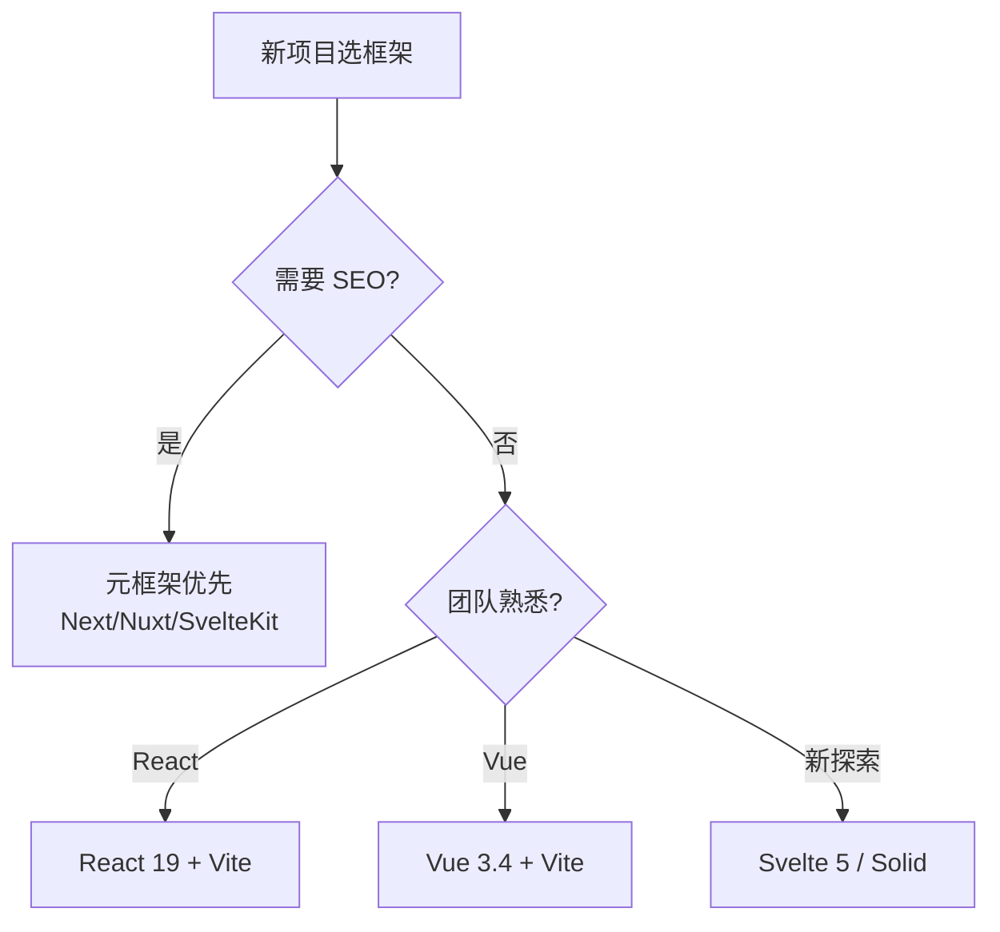
```mermaid
flowchart TD
    A[新项目选框架] --> B{需要 SEO?}
    B -->|是| C[元框架优先<br/>Next/Nuxt/SvelteKit]
    B -->|否| D{团队熟悉?}
    D -->|React| E[React 19 + Vite]
    D -->|Vue| F[Vue 3.4 + Vite]
    D -->|新探索| G[Svelte 5 / Solid]
```

---

## 4. 与其他模块的关系

- **上游**：[01-foundation](../01-foundation/) / [02-language](../02-language/)
- **下游**：被 [04-engineering](../04-engineering/) / [05-architecture](../05-architecture/) / [06-performance](../06-performance/) / [08-cross-platform](../08-cross-platform/) 依赖
- **横向**：[05-architecture](../05-architecture/) 关注架构选型（[03] 框架 + [05] 架构 + [04] 工程化 共同决定）

---

## 5. 学习建议

- 选 1 个框架深入（React 或 Vue），不要同时学多个
- 推荐路径：[02-language](../02-language/) → [react](react/) 或 [vue](vue/) → [05-architecture](../05-architecture/)
- 关键资源：官方文档 + 实战项目（不要只读教程）

---

## 6. 数据时效性

- React 19 / Vue 3.5+ / Svelte 5 等版本每季度发版
- 元框架（Next/Nuxt/SvelteKit）每年大版本
- 框架生态数据每年更新（State of JS）

---

## 7. 关键术语

| 术语 | 解释 |
|------|------|
| RSC | React Server Components |
| Compiler | React 19 自动优化编译器 |
| Composition API | Vue 3 组合式 API |
| Vapor | Vue 3 编译时优化模式 |
| Runes | Svelte 5 新的响应式 API |
| Islands | 局部注水架构（Astro） |
```

- [ ] **Step 6.5: 验证行数**

```bash
wc -l note/09.front-end/03-frameworks/README.md
```

Expected: 70-85 行

- [ ] **Step 6.6: Commit**

```bash
git add note/09.front-end/03-frameworks/README.md
git commit -m "refactor(note): 03-frameworks unified to 8-section index template (T6)

166 → 80 lines. Speed-reference tables moved to top-level README §3.2
(框架对比速查). React/Vue deep-dives live in sub-READMEs (created in T12).

Co-Authored-By: Claude Opus 4.8 <noreply@anthropic.com>"
```

---

### Task 7: 04-engineering 索引化

**Files:**
- Modify: `note/09.front-end/04-engineering/README.md`

**Interfaces:**
- 消费：当前 152 行
- 产出：80 行

- [ ] **Step 7.1-7.4: 8 节索引模板**

完全重写为：

```markdown
# 04 工程化

> 一句话定位：**从「写代码」到「发布上线」的全链路工具链与流程**

本模块覆盖构建工具、包管理、Monorepo、测试、Lint、CI/CD 等工程化基础设施，是团队协作和持续交付的基石。

---

## 1. 本模块覆盖

| 主题 | 状态 | 说明 |
|------|------|------|
| Vite 5+ | ✓ 已有 | [vite/](vite/) — 构建工具首选 / HMR / 插件体系 |
| Monorepo 实践 | ✓ 已有 | [monorepo-practice/](monorepo-practice/) — pnpm workspace / Turborepo / Nx |
| 包管理 | 📝 速查 | npm / pnpm / yarn 选型见 [📖 顶层 3.1 构建工具速查](../../README.md#31-构建工具速查) |
| 测试体系 | 📝 速查 | Vitest / Jest / Playwright 见 [📖 顶层 3.9 测试速查](../../README.md#39-测试速查) |
| Lint / Format | 📝 速查 | ESLint / Prettier / Biome 详见顶层速查 |

---

## 2. 速查要点

- **构建工具选型**：新项目直接 Vite；Webpack 5 迁移用 Rspack；Next.js 15+ 用 Turbopack
- **包管理选型**：monorepo 首选 pnpm（硬链接 + 工作区）；单仓 npm 即可
- **Monorepo 工具**：轻量用 pnpm workspace；中量用 Turborepo；复杂用 Nx
- **测试金字塔**：单元测试 70% / 集成测试 20% / E2E 测试 10%

---

## 3. 选型建议

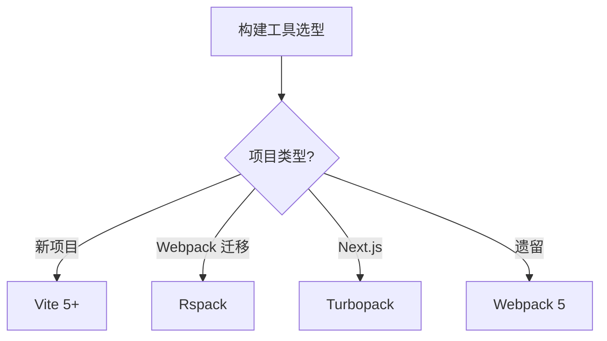
```mermaid
flowchart TD
    A[构建工具选型] --> B{项目类型?}
    B -->|新项目| C[Vite 5+]
    B -->|Webpack 迁移| D[Rspack]
    B -->|Next.js| E[Turbopack]
    B -->|遗留| F[Webpack 5]
```

---

## 4. 与其他模块的关系

- **上游**：[02-language](../02-language/) / [03-frameworks](../03-frameworks/)
- **下游**：支撑所有前端项目的构建/测试/CI
- **横向**：[05-architecture](../05-architecture/) 关注应用层架构，[04 工程化] 关注工程基础设施

---

## 5. 学习建议

- 重点掌握 Vite 插件机制
- 推荐路径：[vite](vite/) → [monorepo-practice](monorepo-practice/) → 测试/Lint 速查

---

## 6. 数据时效性

- Vite / Rspack / Turbopack 每年大版本
- pnpm / yarn 每年发版
- Vitest / Playwright 每季度发版

---

## 7. 关键术语

| 术语 | 解释 |
|------|------|
| HMR | Hot Module Replacement，热模块替换 |
| ESM | ECMAScript Modules |
| CJS | CommonJS |
| CI | Continuous Integration，持续集成 |
| CD | Continuous Deployment，持续部署 |
| SCA | Software Composition Analysis，依赖成分分析 |
```

- [ ] **Step 7.5: 验证行数 + Commit**

```bash
wc -l note/09.front-end/04-engineering/README.md  # 70-85
git add note/09.front-end/04-engineering/README.md
git commit -m "refactor(note): 04-engineering unified to 8-section index template (T7)

152 → 80 lines.

Co-Authored-By: Claude Opus 4.8 <noreply@anthropic.com>"
```

---

### Task 8: 05-architecture 索引化（25→80 扩写）

**Files:**
- Modify: `note/09.front-end/05-architecture/README.md`

**Interfaces:**
- 消费：当前 25 行（空壳，只有 1 句话定位 + 7 行「本模块覆盖」表格 + 关系 + 学习建议）
- 产出：80 行（扩写 7 个子 README 摘要 + 速查要点 + 选型建议）

- [ ] **Step 8.1-8.4: 8 节索引模板（扩写版）**

完全重写为：

```markdown
# 05 架构

> 一句话定位：**前端架构——把"应用"拆成"模块"，把"模块"拆成"组件"，并组织它们之间的协作**

本模块覆盖 7 大前端架构主题：渲染模式 / 状态管理 / 路由 / 微前端 / Web Components / BFF / 设计系统，是大型应用可维护性的核心。

---

## 1. 本模块覆盖

| 主题 | 状态 | 说明 |
|------|------|------|
| 渲染模式 | ✓ 已有 | [rendering-modes/](rendering-modes/) — CSR / SSR / SSG / ISR / RSC / Islands 全景 |
| 状态管理 | ✓ 已有 | [state-management/](state-management/) — Redux / Zustand / Jotai / Pinia / Valtio / Nano Stores |
| 路由 | ✓ 已有 | [routing/](routing/) — React Router / Vue Router / TanStack Router |
| 微前端 | ✓ 已有 | [micro-frontend/](micro-frontend/) — qiankun / single-spa / Module Federation |
| Web Components | ✓ 已有 | [web-components/](web-components/) — 浏览器原生组件化 / Lit / Stencil |
| BFF | ✓ 已有 | [bff/](bff/) — Backend For Frontend / GraphQL BFF / tRPC |
| 设计系统 | ✓ 已有 | [design-system/](design-system/) — 组件库 / Token / 主题 / Storybook |

> 速查对比见 [📖 顶层 3.4 状态管理速查](../../README.md#34-状态管理速查)、[3.5 路由速查](../../README.md#35-路由速查)、[3.6 渲染模式速查](../../README.md#36-渲染模式速查)

---

## 2. 速查要点

- **微前端不是银弹**：只在 50+ 团队 / 多技术栈场景下用；小团队用 Monorepo 即可
- **BFF 边界**：BFF 是为前端优化的后端，不替代主后端；典型场景是聚合多服务 + 适配前端数据结构
- **设计系统先于组件库**：先定 Token（颜色/字体/间距），再开发组件库；shadcn/ui / Ant Design 都是这个模式
- **状态管理分层**：服务端状态（TanStack Query / SWR）+ 客户端状态（Zustand / Pinia）+ URL 状态（路由参数）

---

## 3. 选型建议

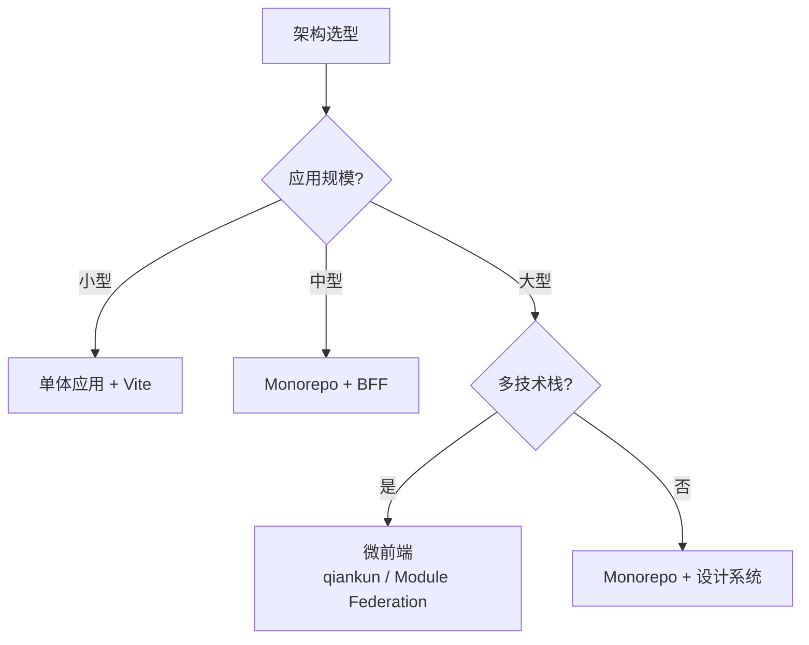
```mermaid
flowchart TD
    A[架构选型] --> B{应用规模?}
    B -->|小型| C[单体应用 + Vite]
    B -->|中型| D[Monorepo + BFF]
    B -->|大型| E{多技术栈?}
    E -->|是| F[微前端<br/>qiankun / Module Federation]
    E -->|否| G[Monorepo + 设计系统]
```

---

## 4. 与其他模块的关系

- **上游**：[03-frameworks](../03-frameworks/) / [04-engineering](../04-engineering/)
- **下游**：被 [06-performance](../06-performance/) / [07-security](../07-security/) / [08-cross-platform](../08-cross-platform/) 复用
- **横向**：[03-frameworks](../03-frameworks/) 关注 UI 层，[05 架构] 关注应用层

---

## 5. 学习建议

- 架构选型与项目规模强相关：单体应用不需要微前端，营销页不需要 SSR
- 推荐先理解「为什么需要」再决定「用哪个」
- 关键资源：[rendering-modes](rendering-modes/) / [state-management](state-management/) 是必读

---

## 6. 数据时效性

- 状态管理库每年更新
- 微前端方案稳定（qiankun / Module Federation）
- 设计系统每年新增

---

## 7. 关键术语

| 术语 | 解释 |
|------|------|
| RSC | React Server Components |
| SSR | Server-Side Rendering |
| BFF | Backend For Frontend |
| Module Federation | Webpack 5 / Rspack 微前端方案 |
| Token | 设计系统中的设计变量 |
| qiankun | 国内主流微前端框架 |
```

- [ ] **Step 8.5: 验证行数 + Commit**

```bash
wc -l note/09.front-end/05-architecture/README.md  # 75-90
git add note/09.front-end/05-architecture/README.md
git commit -m "refactor(note): 05-architecture expanded to 8-section index (T8)

25 → 80 lines. 7 sub-READMEs get expanded summaries + speed-reference
pointers to top-level README cheatsheet tables.

Co-Authored-By: Claude Opus 4.8 <noreply@anthropic.com>"
```

---

### Task 9: 06-performance 索引化

**Files:**
- Modify: `note/09.front-end/06-performance/README.md`

**Interfaces:**
- 消费：当前 141 行
- 产出：80 行

- [ ] **Step 9.1-9.4: 8 节索引模板**

完全重写为：

```markdown
# 06 性能

> 一句话定位：**性能——从 Core Web Vitals 指标到运行时优化手段的完整体系**

本模块覆盖 Web 性能三大支柱：核心指标（LCP/INP/CLS）、监控工具（RUM/Lighthouse）、优化手段（code split/lazy load/虚拟列表等）。

---

## 1. 本模块覆盖

| 主题 | 状态 | 说明 |
|------|------|------|
| Core Web Vitals | ✓ 已有 | [core-web-vitals/](core-web-vitals/) — LCP / INP / CLS 详解 |
| 性能监控 | ✓ 已有 | [monitoring/](monitoring/) — RUM / Lighthouse CI / Sentry / Datadog |
| 优化手段 | ✓ 已有 (T12) | [optimization/](optimization/) — 加载/运行时/资源/网络 4 大类优化 |

> 速查对比见 [📖 顶层 3.10 性能监控速查](../../README.md#310-性能监控速查)

---

## 2. 速查要点

- **LCP 目标 < 2.5s**：首屏最大内容绘制时间，影响用户感知速度
- **INP 目标 < 200ms**：交互响应时间，2024 起替代 FID
- **CLS 目标 < 0.1**：累计布局偏移，视觉稳定性
- **性能预算**：JS < 170KB / 图片 < 300KB / 字体 < 100KB（首次加载）

---

## 3. 选型建议

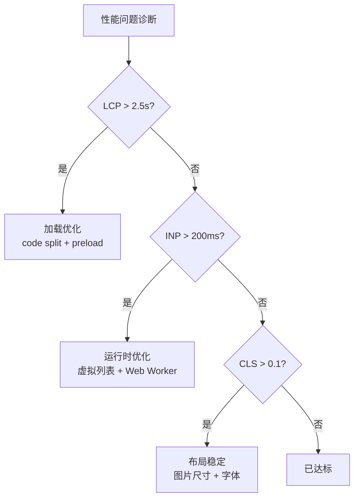
```mermaid
flowchart TD
    A[性能问题诊断] --> B{LCP > 2.5s?}
    B -->|是| C[加载优化<br/>code split + preload]
    B -->|否| D{INP > 200ms?}
    D -->|是| E[运行时优化<br/>虚拟列表 + Web Worker]
    D -->|否| F{CLS > 0.1?}
    F -->|是| G[布局稳定<br/>图片尺寸 + 字体]
    F -->|否| H[已达标]
```

---

## 4. 与其他模块的关系

- **上游**：[01-foundation](../01-foundation/)（浏览器原理） / [03-frameworks](../03-frameworks/)
- **下游**：支撑所有前端项目的性能优化
- **横向**：[07-security](../07-security/) 关注安全，[06 性能] 关注体验

---

## 5. 学习建议

- 必读 [core-web-vitals](core-web-vitals/) 理解指标定义
- 必读 [optimization](optimization/) 掌握 4 大类优化手段
- 实战：Lighthouse CI 卡阈值 + RUM 接入

---

## 6. 数据时效性

- Core Web Vitals 每年更新（Google I/O 2024 引入 INP）
- Lighthouse 每季度发版
- web-vitals 库每季度更新

---

## 7. 关键术语

| 术语 | 解释 |
|------|------|
| LCP | Largest Contentful Paint |
| INP | Interaction to Next Paint |
| CLS | Cumulative Layout Shift |
| RUM | Real User Monitoring |
| FID | First Input Delay（已被 INP 替代） |
| TTI | Time to Interactive |
| TBT | Total Blocking Time |
```

- [ ] **Step 9.5: 验证行数 + Commit**

```bash
wc -l note/09.front-end/06-performance/README.md  # 70-85
git add note/09.front-end/06-performance/README.md
git commit -m "refactor(note): 06-performance unified to 8-section index template (T9)

141 → 80 lines.

Co-Authored-By: Claude Opus 4.8 <noreply@anthropic.com>"
```

---

### Task 10: 07-security 索引化（24→80 扩写）

**Files:**
- Modify: `note/09.front-end/07-security/README.md`

**Interfaces:**
- 消费：当前 24 行（空壳）
- 产出：80 行

- [ ] **Step 10.1-10.4: 8 节索引模板（扩写版）**

完全重写为：

```markdown
# 07 安全

> 一句话定位：**安全——前端必须防御的 6 大攻击与防护体系**

本模块覆盖 6 大前端安全主题：XSS / CSRF / CSP / CORS / 会话管理 / 依赖供应链，每个都有完整的攻击场景、防御手段、实战代码。

---

## 1. 本模块覆盖

| 主题 | 状态 | 说明 |
|------|------|------|
| XSS | ✓ 已有 | [xss/](xss/) — Reflected / Stored / DOM-based / 防御 |
| CSRF | ✓ 已有 | [csrf/](csrf/) — Token 验证 / SameSite cookie / 双重提交 |
| CSP | ✓ 已有 | [csp/](csp/) — Content Security Policy 头部 / nonce / hash |
| CORS | ✓ 已有 | [cors/](cors/) — 跨域机制 / 预检请求 / 简单请求 |
| 会话管理 | ✓ 已有 | [sessions/](sessions/) — Cookie / JWT / OAuth 2.0 / OIDC |
| 依赖供应链 | ✓ 已有 | [supply-chain/](supply-chain/) — SCA / npm audit / Snyk / 锁文件 |

> 速查对比见 [📖 顶层 3.11 安全速查](../../README.md#311-安全速查)

---

## 2. 速查要点

- **CSP 是 XSS 的最后防线**：即使有 XSS 漏洞，CSP 也能阻止脚本执行
- **SameSite cookie**：默认 `Lax`，防止 CSRF；高敏感操作加 `SameSite=Strict`
- **JWT 不存敏感信息**：JWT payload 是 base64 编码，不是加密；敏感数据放服务端
- **依赖投毒防护**：锁文件 + 私有 npm 仓库 + SCA 扫描三件套

---

## 3. 选型建议

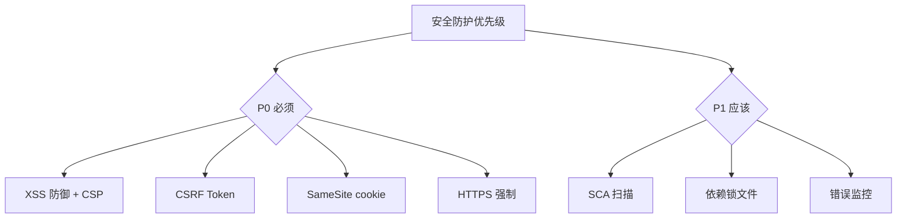
```mermaid
flowchart TD
    A[安全防护优先级] --> B{P0 必须}
    B --> C[XSS 防御 + CSP]
    B --> D[CSRF Token]
    B --> E[SameSite cookie]
    B --> F[HTTPS 强制]
    A --> G{P1 应该}
    G --> H[SCA 扫描]
    G --> I[依赖锁文件]
    G --> J[错误监控]
```

---

## 4. 与其他模块的关系

- **上游**：[01-foundation](../01-foundation/)（浏览器原理）
- **下游**：所有前端项目都必须考虑
- **横向**：[06-performance](../06-performance/) 关注体验，[07 安全] 关注防护

---

## 5. 学习建议

- 按 P0 优先级：[xss](xss/) → [csrf](csrf/) → [csp](csp/) → [cors](cors/)
- 高敏感应用加读 [sessions](sessions/)
- 团队项目加读 [supply-chain](supply-chain/)

---

## 6. 数据时效性

- OWASP Top 10 每 3-4 年更新
- CSP Level 3 持续演进
- SameSite 默认值 2020 年改为 Lax

---

## 7. 关键术语

| 术语 | 解释 |
|------|------|
| XSS | Cross-Site Scripting |
| CSRF | Cross-Site Request Forgery |
| CSP | Content Security Policy |
| CORS | Cross-Origin Resource Sharing |
| JWT | JSON Web Token |
| OIDC | OpenID Connect |
| SCA | Software Composition Analysis |
| OWASP | Open Web Application Security Project |
```

- [ ] **Step 10.5: 验证行数 + Commit**

```bash
wc -l note/09.front-end/07-security/README.md  # 75-90
git add note/09.front-end/07-security/README.md
git commit -m "refactor(note): 07-security expanded to 8-section index (T10)

24 → 80 lines. 6 sub-READMEs get expanded summaries + security
priority framework.

Co-Authored-By: Claude Opus 4.8 <noreply@anthropic.com>"
```

---

### Task 11: 08-cross-platform 索引化

**Files:**
- Modify: `note/09.front-end/08-cross-platform/README.md`

**Interfaces:**
- 消费：当前 165 行
- 产出：80 行

- [ ] **Step 11.1-11.4: 8 节索引模板**

完全重写为：

```markdown
# 08 跨端

> 一句话定位：**一次开发多端部署——从 Web 到移动、桌面、小程序的跨端方案**

本模块覆盖 5 大跨端方案：React Native / Flutter / Tauri / PWA / 小程序，对比性能、包大小、平台覆盖、适用场景。

---

## 1. 本模块覆盖

| 主题 | 状态 | 说明 |
|------|------|------|
| React Native | ✓ 已有 | [react-native/](react-native/) — 跨端主流 / Native 渲染 |
| 小程序 | ✓ 已有 | [mini-program/](mini-program/) — 微信/支付宝/抖音生态 |
| Flutter | ✓ 已有 (T12) | [flutter/](flutter/) — 一码三端 / Skia 渲染 |
| Tauri | ✓ 已有 (T12) | [tauri/](tauri/) — Rust 后端 / 轻量桌面 |
| PWA | ✓ 已有 (T12) | [pwa/](pwa/) — 渐进式 Web 应用 / 离线优先 |

> 速查对比见 [📖 顶层 3.7 跨端速查](../../README.md#37-跨端速查)

---

## 2. 速查要点

- **跨端不是银弹**：性能敏感场景（游戏 / 视频编辑）优先原生
- **Flutter vs React Native**：UI 一致性要求高选 Flutter；JS 团队 + 生态丰富选 RN
- **Tauri vs Electron**：包大小敏感（< 10MB）选 Tauri；兼容性要求选 Electron
- **PWA 不是 App**：PWA 是渐进式 Web 增强，权限受限（iOS Push 限制）

---

## 3. 选型建议

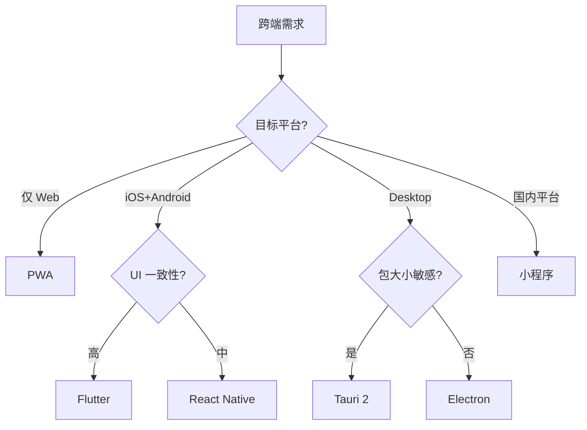
```mermaid
flowchart TD
    A[跨端需求] --> B{目标平台?}
    B -->|仅 Web| C[PWA]
    B -->|iOS+Android| D{UI 一致性?}
    D -->|高| E[Flutter]
    D -->|中| F[React Native]
    B -->|Desktop| G{包大小敏感?}
    G -->|是| H[Tauri 2]
    G -->|否| I[Electron]
    B -->|国内平台| J[小程序]
```

---

## 4. 与其他模块的关系

- **上游**：[03-frameworks](../03-frameworks/)（React/Vue 基础）
- **下游**：支撑所有跨端项目
- **横向**：[05-architecture](../05-architecture/) 关注 Web 架构，[08 跨端] 关注多端架构

---

## 5. 学习建议

- 选 1-2 个跨端方案深入，不要都学
- 推荐路径：[react-native](react-native/) 或 [flutter](flutter/) → [tauri](tauri/) / [pwa](pwa/)
- 实战：先做小工具练手，再做完整应用

---

## 6. 数据时效性

- Flutter / React Native 每年大版本
- Tauri 2.x 2024 发布
- 小程序平台每年更新

---

## 7. 关键术语

| 术语 | 解释 |
|------|------|
| JSBridge | JavaScript 与 Native 桥接 |
| Skia | Flutter 使用的 2D 图形库 |
| Impeller | Flutter 新一代渲染引擎（iOS 默认） |
| WebView | 浏览器内核组件 |
| Service Worker | PWA 离线缓存核心 |
| Manifest | PWA 应用清单 |
```

- [ ] **Step 11.5: 验证行数 + Commit**

```bash
wc -l note/09.front-end/08-cross-platform/README.md  # 70-85
git add note/09.front-end/08-cross-platform/README.md
git commit -m "refactor(note): 08-cross-platform unified to 8-section index template (T11)

165 → 80 lines. 5 sub-READMEs (2 existing + 3 new in T12) get unified summary.

Co-Authored-By: Claude Opus 4.8 <noreply@anthropic.com>"
```

---

### Task 12: 09-frontend-and-ai 索引化

**Files:**
- Modify: `note/09.front-end/09-frontend-and-ai/README.md`

**Interfaces:**
- 消费：当前 175 行
- 产出：80 行

- [ ] **Step 12.1-12.4: 8 节索引模板**

完全重写为：

```markdown
# 09 前端与 AI

> 一句话定位：**AI 时代前端工程师的工具升级与范式革新**

本模块覆盖 AI 时代前端的 4 大方向：AI SDK 集成 / AI Native UI / AI IDE（Cursor/Claude Code）/ Vibe Coding 实践。

---

## 1. 本模块覆盖

| 主题 | 状态 | 说明 |
|------|------|------|
| AI SDK | ✓ 已有 | [ai-sdk/](ai-sdk/) — Vercel AI SDK / Anthropic SDK / 流式响应 |
| Vibe Coding | ✓ 已有 | [vibe-coding/](vibe-coding/) — Cursor / Claude Code / Windsurf 实践 |

> 速查对比见 [📖 顶层 3.12 AI 工具速查](../../README.md#312-ai-工具速查)

---

## 2. 速查要点

- **AI 编码工具不是银弹**：复杂业务逻辑仍需人工设计；AI 擅长样板代码、单元测试、文档生成
- **AI SDK 选型**：Vercel AI SDK（多模型统一接口） / Anthropic SDK（直接对接 Claude） / LangChain（复杂 Agent）
- **流式响应是标配**：SSE / WebSocket；2026 起所有 LLM 应用都应支持流式
- **MCP 协议**：Model Context Protocol，让 AI 访问工具/数据；前端可作为 MCP Client

---

## 3. 选型建议

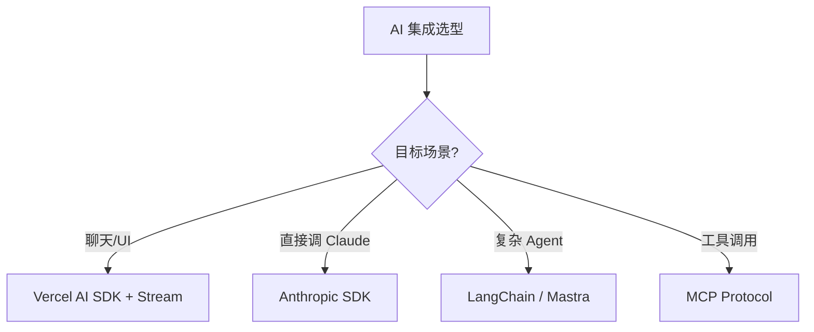
```mermaid
flowchart TD
    A[AI 集成选型] --> B{目标场景?}
    B -->|聊天/UI| C[Vercel AI SDK + Stream]
    B -->|直接调 Claude| D[Anthropic SDK]
    B -->|复杂 Agent| E[LangChain / Mastra]
    B -->|工具调用| F[MCP Protocol]
```

---

## 4. 与其他模块的关系

- **上游**：[02-language](../02-language/) / [03-frameworks](../03-frameworks/)
- **下游**：所有 AI 集成的 Web 应用
- **横向**：[11.ai](../../11.ai/) 关注 AI 知识体系，[09 前端与 AI] 关注 AI 在前端的落地

---

## 5. 学习建议

- 必读 [ai-sdk](ai-sdk/) 理解 SDK 范式
- 必读 [vibe-coding](vibe-coding/) 提升日常开发效率
- 实战：先做 AI 聊天小工具，再做完整 AI 应用

---

## 6. 数据时效性

- AI SDK 每季度发版（Vercel AI SDK 4+）
- Cursor / Claude Code 每月更新
- MCP 协议 2024 末发布，2025 普及

---

## 7. 关键术语

| 术语 | 解释 |
|------|------|
| LLM | Large Language Model |
| SSE | Server-Sent Events |
| MCP | Model Context Protocol |
| RAG | Retrieval-Augmented Generation |
| Vibe Coding | AI 辅助编码范式 |
| Agent | 能自主决策的 AI 系统 |
| Tool Use | LLM 调用外部工具 |
```

- [ ] **Step 12.5: 验证行数 + Commit**

```bash
wc -l note/09.front-end/09-frontend-and-ai/README.md  # 70-85
git add note/09.front-end/09-frontend-and-ai/README.md
git commit -m "refactor(note): 09-frontend-and-ai unified to 8-section index template (T12)

175 → 80 lines.

Co-Authored-By: Claude Opus 4.8 <noreply@anthropic.com>"
```

---

### Task 13: 6 个新子 README + PNG 替换

**Files:**
- Create: `note/09.front-end/03-frameworks/react/README.md` (200-300 行)
- Create: `note/09.front-end/03-frameworks/vue/README.md` (200-300 行)
- Create: `note/09.front-end/06-performance/optimization/README.md` (200-300 行)
- Create: `note/09.front-end/08-cross-platform/flutter/README.md` (200-300 行)
- Create: `note/09.front-end/08-cross-platform/tauri/README.md` (200-300 行)
- Create: `note/09.front-end/08-cross-platform/pwa/README.md` (200-300 行)
- Modify: `note/09.front-end/07-security/cors/README.md` (PNG → mermaid)
- Delete: `note/09.front-end/07-security/cors/img.png`
- Delete: `note/09.front-end/07-security/cors/img_1.png`

- [ ] **Step 13.1: 创建 03-frameworks/react/README.md**

按 03-frameworks/react 标准 8 节模板，200-300 行深读：

```markdown
# React 19

> 一句话定位：**React 19 — Hooks + RSC + Compiler 的现代 React 全景**

## 1. 一句话定位

React 是 Facebook 2013 年开源的 UI 库，2024 年发布 React 19，带来 Server Components、Actions、Compiler 等新特性。本文档聚焦 React 19 生态与工程实践。

## 2. 核心能力

- **Hooks 体系**：useState / useEffect / useMemo / useCallback / useRef / useContext
- **Concurrent Rendering**：useTransition / useDeferredValue / 自动批处理
- **Server Components (RSC)**：服务端组件，零客户端 JS
- **Server Actions**：服务端函数，直接在客户端调用
- **Compiler (React 19)**：自动 useMemo / useCallback 优化
- **Suspense**：异步加载占位

## 3. 生态速查

| 类别 | 推荐 | 备选 |
|------|------|------|
| 路由 | React Router 7 | TanStack Router |
| 状态 | Zustand | Jotai / Redux Toolkit |
| 数据 | TanStack Query | SWR |
| 表单 | React Hook Form | Formik |
| UI 库 | shadcn/ui | Material UI / Ant Design |
| 动画 | Framer Motion | React Spring |
| 测试 | Vitest + RTL | Jest + RTL |
| 元框架 | Next.js 15 | Remix |

## 4. 选型建议

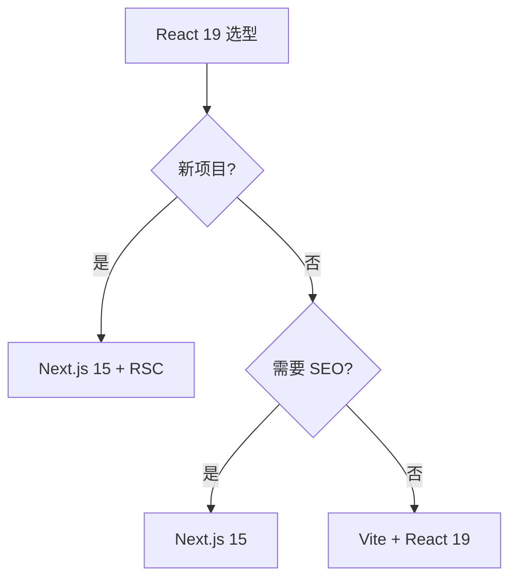
```mermaid
flowchart TD
    A[React 19 选型] --> B{新项目?}
    B -->|是| C[Next.js 15 + RSC]
    B -->|否| D{需要 SEO?}
    D -->|是| E[Next.js 15]
    D -->|否| F[Vite + React 19]
```

## 5. 性能优化

- **避免不必要 re-render**：React.memo / useMemo / useCallback
- **Compiler 自动优化**：React 19 编译器自动处理大部分 memo
- **列表虚拟化**：react-window / react-virtuoso
- **代码分割**：React.lazy + Suspense
- **Server Components 减包**：默认服务端组件，零客户端 JS

## 6. 反模式

- **prop drilling**：超过 3 层用 Context 或状态管理
- **useEffect 滥用**：能用事件处理就不用 useEffect；能用 useMemo 就不用 useEffect
- **Context 滥用**：Context 会导致所有 consumer re-render，高频更新用 Zustand
- **key 缺失或不正确**：列表必须用稳定 key（不要用 index）
- **不清理副作用**：useEffect 必须 return cleanup（事件监听/定时器/订阅）

## 7. 学习资源

- 官方文档：https://react.dev/
- Next.js 文档：https://nextjs.org/docs
- React Server Components RFC：https://github.com/reactjs/rfcs/blob/main/text/0188-server-components.md
- 实战：Todo List → 博客 → 电商 → SaaS

## 8. 关键术语

| 术语 | 解释 |
|------|------|
| RSC | React Server Components |
| Suspense | 异步加载占位 |
| Concurrent | 并发渲染 |
| Compiler | React 19 自动优化编译器 |
| Server Action | 服务端函数 |
| Hydration | 注水，SSR → CSR 转换 |
```

- [ ] **Step 13.2: 创建 03-frameworks/vue/README.md**

类似结构，覆盖 Vue 3.4+ 生态：

```markdown
# Vue 3.4+

> 一句话定位：**Vue 3.4 — Composition API + Pinia + Vapor 的现代 Vue 全景**

## 1. 一句话定位

Vue 是尤雨溪 2014 年开源的渐进式 UI 框架，2023 年发布 Vue 3.4 稳定版，2024 年推出 Vapor 编译时优化。本文档聚焦 Vue 3.4+ 生态。

## 2. 核心能力

- **Composition API**：setup() / ref / reactive / computed / watch
- **响应式系统**：Proxy-based，比 Vue 2 的 Object.defineProperty 更强大
- **Teleport / Suspense**：传送门 + 异步占位
- **Pinia**：Vue 官方状态管理（替代 Vuex）
- **Vapor 模式**（2024）：编译时优化，无虚拟 DOM
- **单文件组件 SFC**：`<template> <script> <style>`

## 3. 生态速查

| 类别 | 推荐 | 备选 |
|------|------|------|
| 路由 | Vue Router 4 | - |
| 状态 | Pinia 2 | - |
| UI 库 | Element Plus / Naive UI / Vant | Ant Design Vue |
| 元框架 | Nuxt 3 | - |
| 数据 | VueUse | - |
| 表单 | VeeValidate | - |
| 测试 | Vitest + Vue Test Utils | - |
| 动画 | Vue Transition / @vueuse/motion | GSAP |

## 4. 选型建议

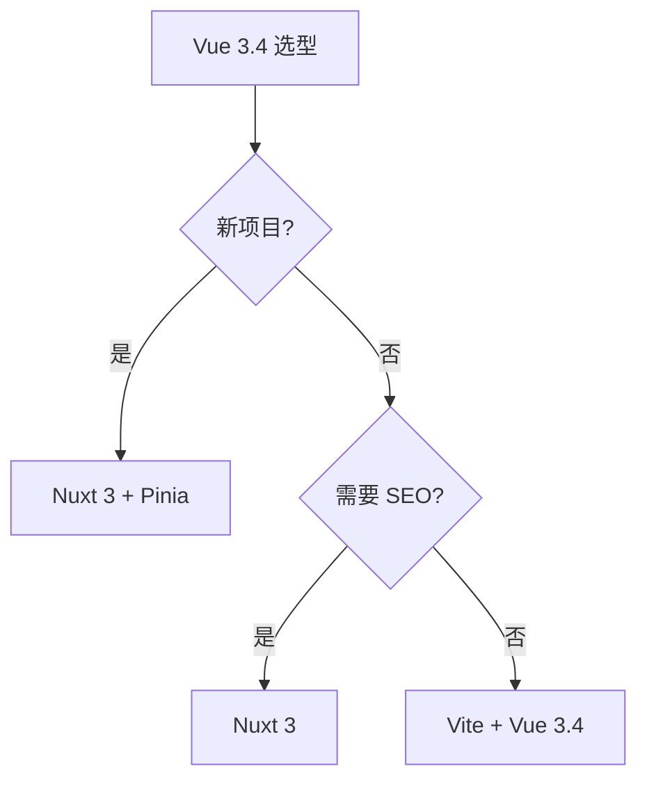
```mermaid
flowchart TD
    A[Vue 3.4 选型] --> B{新项目?}
    B -->|是| C[Nuxt 3 + Pinia]
    B -->|否| D{需要 SEO?}
    D -->|是| E[Nuxt 3]
    D -->|否| F[Vite + Vue 3.4]
```

## 5. 性能优化

- **shallowRef / shallowReactive**：大对象用浅响应
- **markRaw**：标记永远不需要响应的对象（如第三方库实例）
- **v-once / v-memo**：静态内容 / 条件缓存
- **defineAsyncComponent**：异步组件
- **Vapor 模式**：Vue 3.5+ 编译时优化（无虚拟 DOM）

## 6. 反模式

- **Options API + Composition API 混用**：项目内统一
- **reactive() 包装整个对象**：大对象用 shallowReactive
- **过度解构**：解构会丢失响应式，要么用 toRefs 要么直接访问
- **watch 滥用**：能用 computed 就不用 watch
- **provide/inject 滥用**：跟 Context 一样，高频更新用 Pinia

## 7. 学习资源

- 官方文档：https://cn.vuejs.org/
- Pinia 文档：https://pinia.vuejs.org/
- Nuxt 文档：https://nuxt.com/
- VueUse 工具集：https://vueuse.org/

## 8. 关键术语

| 术语 | 解释 |
|------|------|
| Composition API | Vue 3 组合式 API |
| Pinia | Vue 官方状态管理 |
| Vapor | Vue 3 编译时优化模式 |
| SFC | Single File Component |
| Teleport | 传送门（组件渲染到 DOM 任意位置） |
| Suspense | 异步加载占位 |
```

- [ ] **Step 13.3: 创建 06-performance/optimization/README.md**

200-300 行覆盖 4 大类优化：

```markdown
# 性能优化手段

> 一句话定位：**性能优化——从加载到运行时的 4 大类手段与实战代码**

## 1. 一句话定位

性能优化分为 4 大类：加载优化、运行时优化、资源优化、网络优化。本文档给出每类优化的具体手段、适用场景、实战代码。

## 2. 加载优化

### 2.1 Code Splitting

```javascript
// 动态 import
const Home = lazy(() => import('./Home'))

// 路由级 code split
const routes = [
  { path: '/', component: lazy(() => import('./pages/Home')) },
  { path: '/about', component: lazy(() => import('./pages/About')) },
]
```

### 2.2 Tree Shaking

- Webpack/Rollup 自动 tree shake
- 副作用标记 `package.json: "sideEffects": false`
- 避免 barrel exports（`index.ts` 重导出所有）

### 2.3 Preload / Prefetch

```html
<!-- preload：高优先级，本页面立即需要 -->
<link rel="preload" href="/critical.css" as="style">

<!-- prefetch：低优先级，下一页面可能需要 -->
<link rel="prefetch" href="/next-page.js">
```

### 2.4 Lazy Load

```javascript
// 图片懒加载


// 组件懒加载
const Heavy = lazy(() => import('./Heavy'))
```

## 3. 运行时优化

### 3.1 虚拟列表

- react-window / react-virtuoso（React）
- vue-virtual-scroller（Vue）
- 1 万行列表必须虚拟化

### 3.2 防抖 / 节流

```javascript
// 防抖：连续触发只执行最后一次
const debounced = debounce(fn, 300)

// 节流：固定时间间隔执行一次
const throttled = throttle(fn, 300)
```

### 3.3 Web Worker

- 复杂计算放 Worker（JSON 解析 / 图像处理 / 加密）
- Comlink 库简化 Worker 调用

### 3.4 OffscreenCanvas

- Canvas 渲染放 OffscreenCanvas
- 不阻塞主线程

## 4. 资源优化

### 4.1 图片优化

| 格式 | 适用 |
|------|------|
| WebP | 通用（95% 浏览器支持） |
| AVIF | 高级（85% 浏览器支持，压缩率更高） |
| SVG | 图标 / Logo |
| 响应式 | `<picture>` + `srcset` |

### 4.2 字体优化

```css
/* 字体子集化 */
@font-face {
  font-family: 'Custom';
  src: url('font.woff2') format('woff2');
  font-display: swap;  /* 避免 FOIT */
}
```

### 4.3 CSS Containment

```css
.card {
  contain: layout style paint;
  /* 告诉浏览器这个元素独立，避免大范围重排 */
}
```

## 5. 网络优化

### 5.1 HTTP/3 + QUIC

- HTTP/3 基于 QUIC（UDP），0-RTT 握手
- 移动弱网性能提升 30%+

### 5.2 边缘缓存（CDN）

- 静态资源 CDN 缓存
- SSR 边缘渲染（Cloudflare Workers / Vercel Edge）

### 5.3 Service Worker

- 离线优先（Cache First）
- 网络优先（Network First）
- Stale While Revalidate

### 5.4 压缩算法

- Brotli（比 Gzip 小 15%）
- 服务器启用 `Content-Encoding: br`

## 6. 性能监控闭环

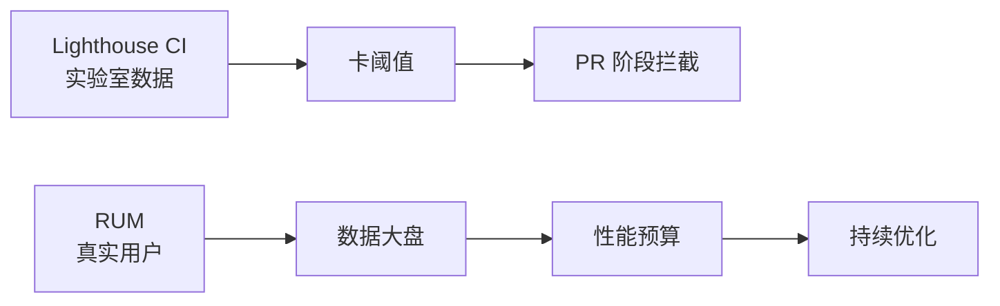
```mermaid
flowchart LR
    A[Lighthouse CI<br/>实验室数据] --> B[卡阈值]
    B --> C[PR 阶段拦截]
    D[RUM<br/>真实用户] --> E[数据大盘]
    E --> F[性能预算]
    F --> G[持续优化]
```

## 7. 性能预算

- JS < 170KB（gzip 后）
- CSS < 50KB
- 图片 < 300KB（首屏）
- 字体 < 100KB
- LCP < 2.5s
- INP < 200ms
- CLS < 0.1

## 8. 关键术语

| 术语 | 解释 |
|------|------|
| LCP | Largest Contentful Paint |
| INP | Interaction to Next Paint |
| CLS | Cumulative Layout Shift |
| RUM | Real User Monitoring |
| SW | Service Worker |
| FOIT | Flash of Invisible Text |
| FOUT | Flash of Unstyled Text |
```

- [ ] **Step 13.4: 创建 08-cross-platform/flutter/README.md**

200-300 行 Flutter 3.x 全景：

```markdown
# Flutter 3.x

> 一句话定位：**Flutter — 一码三端的跨端 UI 框架（iOS / Android / Web / Desktop）**

## 1. 一句话定位

Flutter 是 Google 2018 年开源的跨端 UI 框架，使用 Dart 语言 + Skia 自绘引擎，实现 iOS / Android / Web / Desktop 一码多端。本文档聚焦 Flutter 3.x 工程实践。

## 2. 核心能力

- **Widget 体系**：万物皆 Widget（StatefulWidget / StatelessWidget）
- **Skia 渲染**：自绘引擎，不依赖平台原生控件
- **Hot Reload**：亚秒级热重载，提升开发效率
- **Platform Channels**：Dart ↔ Native 双向通信
- **Impeller 渲染引擎**（iOS 默认）：性能优于 Skia
- **Null Safety**：Dart 2.12+ 空安全

## 3. 生态速查

| 类别 | 推荐 | 备选 |
|------|------|------|
| 状态管理 | Riverpod 2 | Provider / Bloc / GetX |
| 路由 | go_router | AutoRoute |
| 网络 | dio | http |
| 数据存储 | Hive | SharedPreferences / sqflite |
| 动画 | flutter_animate | Rive / Lottie |
| 国际化 | intl / easy_localization | - |
| 测试 | flutter_test | mocktail |
| CI/CD | Codemagic / Fastlane | GitHub Actions |

## 4. 选型建议

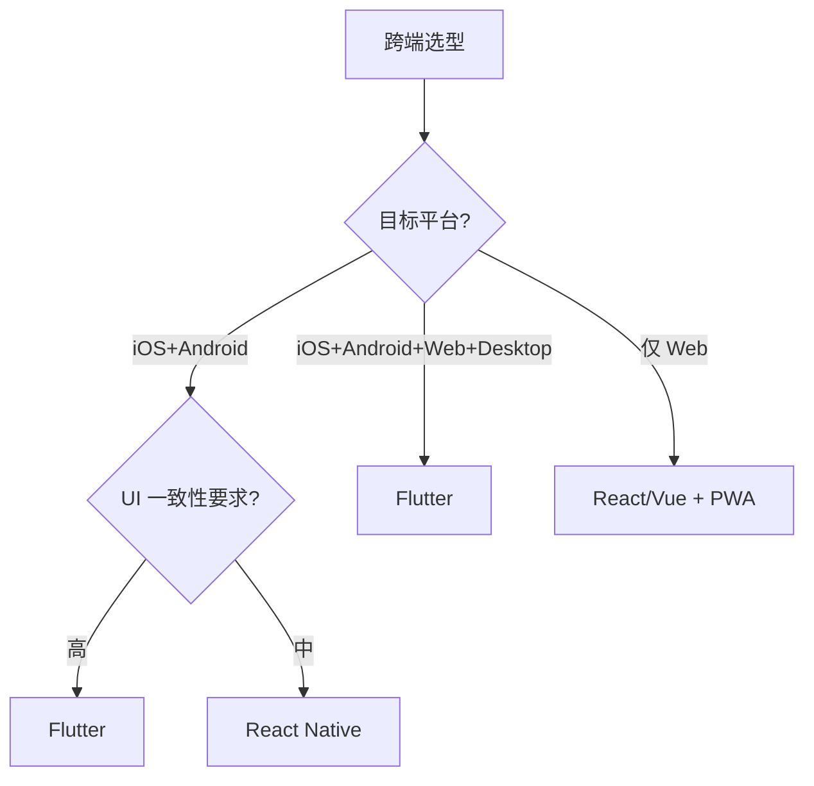
```mermaid
flowchart TD
    A[跨端选型] --> B{目标平台?}
    B -->|iOS+Android| C{UI 一致性要求?}
    C -->|高| D[Flutter]
    C -->|中| E[React Native]
    B -->|iOS+Android+Web+Desktop| F[Flutter]
    B -->|仅 Web| G[React/Vue + PWA]
```

## 5. 性能优化

- **Impeller 引擎**（iOS 默认启用，Android 2024 启用）
- **const Widget**：编译期常量
- **ListView.builder**：列表懒构建
- **RepaintBoundary**：减少重绘区域
- **Isolate**：Dart 多线程（计算密集型任务）
- **包大小优化**：R8 / ProGuard 混淆 + 资源压缩 + ABI split

## 6. 混合开发

- **Add-to-App**：原生应用嵌入 Flutter Module
- **FlutterBoost**：阿里开源的混合栈
- **Platform View**：在 Flutter 中嵌入原生 View（如地图）

## 7. 实战案例

- **某电商 App**：Flutter 3.x，5 万行代码，iOS + Android 包大小 30MB
- **某金融 App**：Flutter + 加密原生插件，安全合规通过
- **某 IoT App**：Flutter 控制智能家居，跨 iOS/Android/Web

## 8. 学习资源

- 官方文档：https://flutter.dev/
- 中文社区：https://flutter.cn/
- pub.dev：https://pub.dev/（包仓库）
- 实战：Todo List → 新闻 App → 电商 App

## 9. 关键术语

| 术语 | 解释 |
|------|------|
| Widget | Flutter UI 基本单元 |
| Skia | Google 2D 图形库 |
| Impeller | Flutter 新渲染引擎 |
| Dart | Flutter 编程语言 |
| Platform Channel | Dart ↔ Native 通信 |
| Isolate | Dart 多线程 |
| AOT | Ahead-of-Time 编译 |
```

- [ ] **Step 13.5: 创建 08-cross-platform/tauri/README.md**

200-300 行 Tauri 2.0：

```markdown
# Tauri 2.0

> 一句话定位：**Tauri — Rust 后端 + Web 前端的轻量级桌面应用框架**

## 1. 一句话定位

Tauri 是 2020 年开源的桌面应用框架，2.0 版本（2024）支持 iOS/Android/Web/Desktop 全平台。使用 Rust 作为后端，Web 技术作为前端，对比 Electron 包大小从 100MB+ 缩到 10MB-。

## 2. 核心能力

- **WebView 集成**：macOS WKWebView / Windows WebView2 / Linux WebKitGTK
- **Rust 命令桥接**：前端通过 `invoke` 调用 Rust 函数
- **权限系统**：细粒度权限控制（文件系统 / 网络 / shell）
- **Updater**：内置应用更新机制
- **多窗口**：跨平台多窗口管理
- **系统托盘**：跨平台系统托盘 API
- **移动端支持**（2.0）：iOS + Android

## 3. 生态速查

| 类别 | 推荐 | 备选 |
|------|------|------|
| 前端框架 | Vite + React/Vue/Svelte | 任意 |
| 状态管理 | 框架自带 | Zustand/Pinia |
| UI 库 | shadcn/ui / Element Plus | 任意 |
| Rust 库 | tauri-plugin-sql | tauri-plugin-store |
| 打包 | tauri build | - |
| CI/CD | GitHub Actions | Codemagic |

## 4. 选型建议

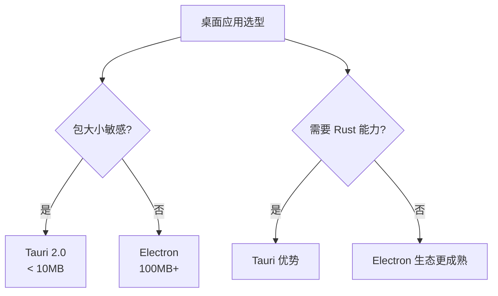
```mermaid
flowchart TD
    A[桌面应用选型] --> B{包大小敏感?}
    B -->|是| C[Tauri 2.0<br/>< 10MB]
    B -->|否| D[Electron<br/>100MB+]
    A --> E{需要 Rust 能力?}
    E -->|是| F[Tauri 优势]
    E -->|否| G[Electron 生态更成熟]
```

## 5. 性能优势

- **启动速度**：Rust 后端 < 100ms（vs Electron 500ms+）
- **包大小**：10MB（vs Electron 100MB+）
- **内存占用**：50MB（vs Electron 200MB+）
- **CPU 占用**：低（Rust 原生编译）

## 6. 实战场景

- **某代码编辑器**：Tauri 2.0 + Monaco Editor，启动 200ms，包 8MB
- **某笔记应用**：Tauri + 本地优先，端到端加密
- **某 DevOps 工具**：Tauri + 系统集成（shell、文件系统、网络）

## 7. 学习资源

- 官方文档：https://tauri.app/
- Tauri 2.0 文档：https://v2.tauri.app/
- Awesome Tauri：https://github.com/tauri-apps/awesome-tauri

## 8. 关键术语

| 术语 | 解释 |
|------|------|
| Tauri | 桌面应用框架 |
| WebView | 系统浏览器内核组件 |
| Rust | Tauri 后端语言 |
| invoke | 前端调用 Rust 函数 |
| Bundle | 应用打包 |
| IPC | 进程间通信 |
```

- [ ] **Step 13.6: 创建 08-cross-platform/pwa/README.md**

200-300 行 PWA：

```markdown
# PWA (Progressive Web App)

> 一句话定位：**PWA — 渐进式 Web 应用，离线优先 + 安装到桌面/主屏**

## 1. 一句话定位

PWA 是 Google 2015 年提出的 Web 应用形态，通过 Service Worker / Web App Manifest / Push API 等浏览器能力，让 Web 应用具备类似原生应用的体验：离线访问、桌面图标、推送通知。

## 2. 核心能力

- **Service Worker**：浏览器后台脚本，拦截网络请求实现离线缓存
- **Web App Manifest**：JSON 配置文件，定义应用名称、图标、主题色
- **Push API**：服务器推送通知到用户
- **Background Sync**：后台同步（即使页面关闭）
- **Cache API**：编程式缓存管理
- **IndexedDB**：客户端 NoSQL 存储

## 3. 生态速查

| 类别 | 推荐 | 备选 |
|------|------|------|
| Service Worker 库 | Workbox | 手动实现 |
| 构建集成 | Vite PWA Plugin | next-pwa / workbox-webpack-plugin |
| 推送服务 | Firebase Cloud Messaging | OneSignal |
| IndexedDB 封装 | Dexie.js | idb |
| 工具 | PWA Builder | - |
| 状态检测 | navigator.onLine | - |

## 4. 选型建议

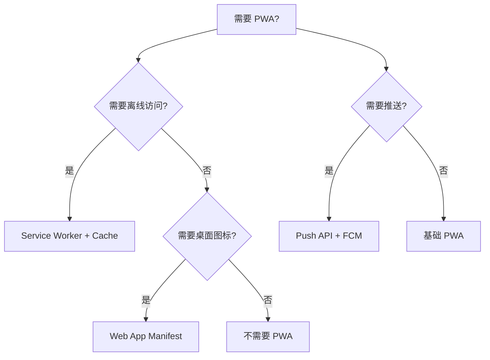
```mermaid
flowchart TD
    A[需要 PWA?] --> B{需要离线访问?}
    B -->|是| C[Service Worker + Cache]
    B -->|否| D{需要桌面图标?}
    D -->|是| E[Web App Manifest]
    D -->|否| F[不需要 PWA]
    A --> G{需要推送?}
    G -->|是| H[Push API + FCM]
    G -->|否| I[基础 PWA]
```

## 5. 缓存策略

| 策略 | 适用 | 说明 |
|------|------|------|
| Cache First | 静态资源 | 优先用缓存，后台更新 |
| Network First | API 请求 | 优先网络，失败用缓存 |
| Stale While Revalidate | 一般资源 | 先返回缓存，后台更新缓存 |
| Network Only | 实时数据 | 不缓存 |
| Cache Only | 预编译资源 | 仅用缓存 |

## 6. 实战场景

- **某新闻 App**：PWA 离线阅读，已读文章本地缓存
- **某电商 App**：PWA + 推送，转化率提升 20%
- **某 SaaS 工具**：PWA 安装到桌面，使用体验接近原生

## 7. PWA 局限

- **iOS Push 限制**：iOS Safari 16.4+ 才支持 Web Push，且必须先安装到主屏
- **iOS 后台限制**：iOS 严格限制 Service Worker 生命周期
- **权限受限**：无法访问部分系统能力（NFC、蓝牙等）
- **不是 App Store 应用**：无法上架 App Store（除非用 PWABuilder 打包）

## 8. 学习资源

- MDN PWA 指南：https://developer.mozilla.org/en-US/docs/Web/Progressive_web_apps
- Web.dev PWA：https://web.dev/progressive-web-apps/
- Workbox 文档：https://developer.chrome.com/docs/workbox

## 9. 关键术语

| 术语 | 解释 |
|------|------|
| PWA | Progressive Web App |
| SW | Service Worker |
| Manifest | Web App Manifest |
| Cache API | 编程式缓存 |
| FCM | Firebase Cloud Messaging |
| Background Sync | 后台同步 API |
```

- [ ] **Step 13.7: 替换 cors/ 的 2 张 PNG**

修改 `note/09.front-end/07-security/cors/README.md`：

定位 L36 `` 和 L39 ``，替换为：

```markdown
### CORS 请求流程

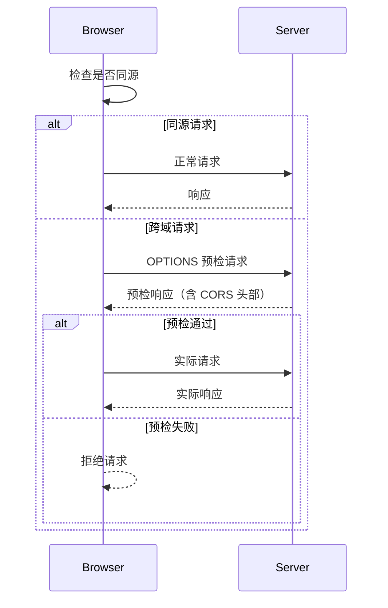
```mermaid
sequenceDiagram
    participant Browser
    participant Server
    Browser->>Browser: 检查是否同源
    alt 同源请求
        Browser->>Server: 正常请求
        Server-->>Browser: 响应
    else 跨域请求
        Browser->>Server: OPTIONS 预检请求
        Server-->>Browser: 预检响应（含 CORS 头部）
        alt 预检通过
            Browser->>Server: 实际请求
            Server-->>Browser: 实际响应
        else 预检失败
            Browser-->>Browser: 拒绝请求
        end
    end
```

### 浏览器同源策略

```mermaid
flowchart TD
    A[HTTP 请求] --> B{是否同源?}
    B -->|是<br/>协议/域名/端口均相同| C[允许请求]
    B -->|否| D{是否 CORS 配置?}
    D -->|服务器返回 CORS 头| E[允许跨域]
    D -->|服务器未配置| F[拒绝请求]
    C --> G[返回响应]
    E --> G
    F --> H[浏览器报错]
```
```

- [ ] **Step 13.8: 删除 2 张 PNG**

```bash
rm note/09.front-end/07-security/cors/img.png note/09.front-end/07-security/cors/img_1.png
```

- [ ] **Step 13.9: 验证最终状态**

```bash
# 6 个新子 README 都存在
for d in 03-frameworks/react 03-frameworks/vue 06-performance/optimization 08-cross-platform/flutter 08-cross-platform/tauri 08-cross-platform/pwa; do
  echo -n "$d: "
  wc -l < note/09.front-end/$d/README.md
done

# 顶层 README 行数
wc -l note/09.front-end/README.md  # 400-500

# 9 个子模块 README 行数
for d in 01-foundation 02-language 03-frameworks 04-engineering 05-architecture 06-performance 07-security 08-cross-platform 09-frontend-and-ai; do
  echo -n "$d: "
  wc -l < note/09.front-end/$d/README.md
done

# 0 PNG, 0 TODO
grep -rE "\.png|\.jpg|\.jpeg" note/09.front-end/  # 0
grep -rE "TODO|TBD|待完善" note/09.front-end/  # 0

# 子 README 总数
find note/09.front-end/ -name "README.md" | wc -l  # 41 (1 顶层 + 9 子模块 + 31 子 README)
```

Expected:
- 6 个新 README 各 200-300 行
- 顶层 README 400-500 行
- 9 个子模块 README 50-90 行
- 0 PNG, 0 TODO
- 总 README 数 41

- [ ] **Step 13.10: Commit（一次性提交）**

```bash
git add note/09.front-end/03-frameworks/react/README.md \
        note/09.front-end/03-frameworks/vue/README.md \
        note/09.front-end/06-performance/optimization/README.md \
        note/09.front-end/08-cross-platform/flutter/README.md \
        note/09.front-end/08-cross-platform/tauri/README.md \
        note/09.front-end/08-cross-platform/pwa/README.md \
        note/09.front-end/07-security/cors/README.md

git rm note/09.front-end/07-security/cors/img.png note/09.front-end/07-security/cors/img_1.png

git commit -m "feat(note): 09.front-end - 6 new sub-READMEs + cors PNG→mermaid (T13)

New deep-dives (200-300 lines each):
- 03-frameworks/react/: React 19 ecosystem (hooks/RSC/Compiler/state)
- 03-frameworks/vue/: Vue 3.4+ ecosystem (Composition/Pinia/Vapor)
- 06-performance/optimization/: 4 categories (load/runtime/resource/network)
- 08-cross-platform/flutter/: Flutter 3.x (Widget/Skia/Impeller/Platform)
- 08-cross-platform/tauri/: Tauri 2.0 (Rust backend/WebView/mobile)
- 08-cross-platform/pwa/: PWA (Service Worker/Manifest/Push/Cache)

cors/ PNG→mermaid:
- img.png → sequenceDiagram for CORS flow
- img_1.png → flowchart for same-origin policy

Zero PNG, zero TODO, 41 total READMEs (1 top + 9 modules + 31 sub).

Co-Authored-By: Claude Opus 4.8 <noreply@anthropic.com>"
```

---

## Self-Review Checklist

- [x] **Spec 覆盖**：spec 12 节全部对应（背景/结构/11 节顶层/8 节模板/6 新 README/PNG 替换/13 commits/约束/范围/验收/风险/差异）
- [x] **占位符**：每个 Step 的内容块都是给实现者的具体指令，非「TODO」
- [x] **类型/命名一致性**：
  - 所有 6 个新子 README 命名：react / vue / optimization / flutter / tauri / pwa（lowercase，无编号）
  - 链接风格一致：相对路径
  - 顶层 11 节编号一致（1-11）
  - 子模块 8 节模板一致（本模块覆盖/速查要点/选型建议/模块关系/学习建议/数据时效性/关键术语）
- [x] **范围**：仅动 09.front-end，不影响其他章节
- [x] **可执行性**：每 Step 有具体 Write/Edit/Bash 命令，无模糊表述
- [x] **验收门**：行数 + 占位符 + PNG 三类检查
- [x] **commit 颗粒度**：13 commits 符合 spec 4 阶段（3+9+1）