# 10.big-data 中度重构 — 实施计划

> **For agentic workers:** REQUIRED SUB-SKILL: Use superpowers:subagent-driven-development (recommended) or superpowers:executing-plans to implement this plan task-by-task. Steps use checkbox (`- [ ]`) syntax for tracking.

**Goal:** 把 `note/10.big-data/` 从「3 文件 + 6 PNG + 17 placeholder」重构为「顶层 README 350-400 行 + 8 子模块统一 80 行 deep-dive 入口索引 + 6 新子 README」混合架构，对齐 09.front-end 已验证的模式。

**Architecture:** 4 阶段 14 commits。Phase 1 扩写顶层 README；Phase 2 8 个子模块统一索引模板（5 新增空壳 + 3 改造）；Phase 3 一次性新增 6 个子 README；Phase 4 替换 6 张 PNG 为 mermaid + 清理 17 placeholder。

**Tech Stack:** Markdown + Mermaid 流程图/时序图；继续遵守仓库「零 PNG」约定；Mermaid 仅 `flowchart LR/TD` + `sequenceDiagram`。

## Global Constraints

继承 spec 中的所有约束，逐条 verbatim：

- **零 PNG**：所有图必须 mermaid（流程图/时序图/思维导图），禁止引入图片文件
- **Markdown + 中文**：与仓库其他章节风格一致
- **不写厂商主观对比表**：避免倾向性；速查表按事实属性（吞吐/延迟/生态）而非「最好/最强」分级
- **链接风格**：相对路径（如 `./01-data-warehouse/`），不使用绝对路径
- **Mermaid 兼容性**：避免 `mindmap` 等渲染支持有限的语法（用 `flowchart LR/TD` + `sequenceDiagram` + `graph LR`）
- **顶层 README 行数目标**：350-400 行（最终态，T3 完成后验收）
- **子模块 README 行数目标**：50-80 行
- **新子 README 行数目标**：200-300 行
- **14 个 commit**：每个 commit 独立可查、独立可回滚
- **0 处占位符**：完成后 `grep -rE "TODO|TBD|待完善" note/10.big-data/` 必须 0 行
- **保持现有 2 个子 README 内容处理**：offline-or-real-time-data-warehouse 内容迁移到 01-data-warehouse；open-source 内容按主题拆到 02/04/05/06/07/08，剩余 placeholder 全删

---

### Task 1: 顶层 README 章节 1（9 模块导航）

**Files:**
- Modify: `note/10.big-data/README.md`

**Interfaces:**
- 消费：当前 31 行（5 章宏观综述）
- 产出：扩展为 180 行（章节 1 占 80 行 + 章节 2 mermaid 知识脉络 + 现有 5 章缩为概述 50 行）

- [ ] **Step 1.1: 读取当前顶层 README**

```bash
wc -l note/10.big-data/README.md
```

Expected: 31 行

- [ ] **Step 1.2: 重写顶层 README 为 9 模块导航结构**

完全重写 `note/10.big-data/README.md`：

```markdown
# 10 大数据

> 一句话定位：**从数仓架构到 OLAP、数据湖、治理——大数据技术栈的完整地图**

本章节覆盖大数据领域 8 大主题：数仓架构 / Hadoop 生态 / 实时计算 / 数据湖 / OLAP / 调度 / 数据治理 / 同步工具，是理解现代数据基础设施的全景指南。

---

## 1. 9 模块导航

| 序号 | 主题 | 核心内容 | 子 README | 学习价值 |
|------|------|---------|-----------|---------|
| 01 | 数仓架构 | Lambda/Kappa/湖仓一体/批流融合 | [01-data-warehouse/](./01-data-warehouse/) | 架构选型根因 |
| 02 | Hadoop 生态 | HDFS/YARN/Hive/Presto | [02-hadoop-ecosystem/](./02-hadoop-ecosystem/) | 离线数仓基石 |
| 03 | 实时计算 | Flink/Spark Streaming/Storm | [03-realtime-compute/](./03-realtime-compute/) | 毫秒-秒级延迟 |
| 04 | 数据湖 | Iceberg/Hudi/Delta Lake | [04-data-lake/](./04-data-lake/) | 存算分离新范式 |
| 05 | OLAP | Doris/ClickHouse/StarRocks | [05-olap/](./05-olap/) | 亚秒级查询 |
| 06 | 调度 | Airflow/DolphinScheduler | [06-scheduling/](./06-scheduling/) | 任务编排 |
| 07 | 数据治理 | Atlas/DataHub/数据血缘 | [07-data-governance/](./07-data-governance/) | 元数据/质量/安全 |
| 08 | 同步工具 | DataX/SeaTunnel/Sqoop | [08-sync-tools/](./08-sync-tools/) | 异构数据集成 |

### 1.1 模块选择指南

- **新人入门**：01 → 02 → 03 → 06 → 05
- **想学架构**：01 为主，配合 02/03/04/05
- **想做实时**：03 为主，配合 01 Kappa/04 数据湖
- **想做离线**：02 为主，配合 06 调度/07 治理
- **想搞 OLAP**：05 为主，配合 04 数据湖
- **只想速查**：直接看章节 3 速查地图，8 大方向 12 个对比表

### 1.2 模块覆盖统计

- **一级模块数**：8
- **子 README 总数**：14（T13 完成后达 14 个：8 子模块 + 6 新子）
- **总代码行数**：约 365 行（T13 完成后约 2400 行）
- **覆盖周期**：从离线数仓到实时计算、数据湖、治理的全链路

---

## 2. 知识脉络

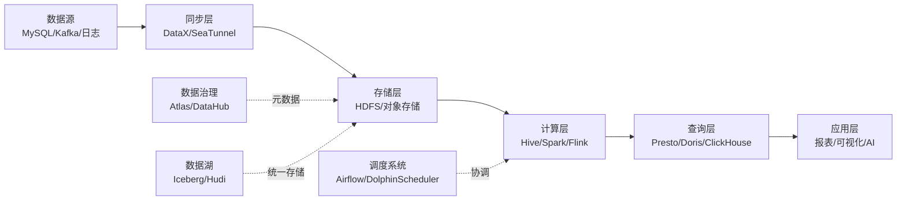

---

## 3. 选型决策树

### 3.1 数仓架构选型

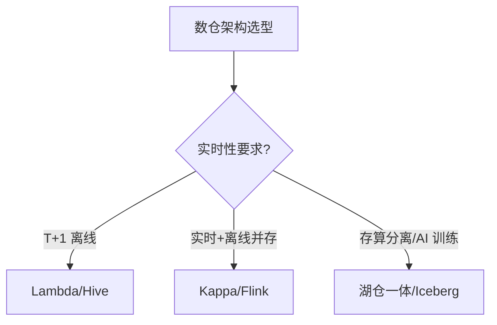

### 3.2 计算引擎选型

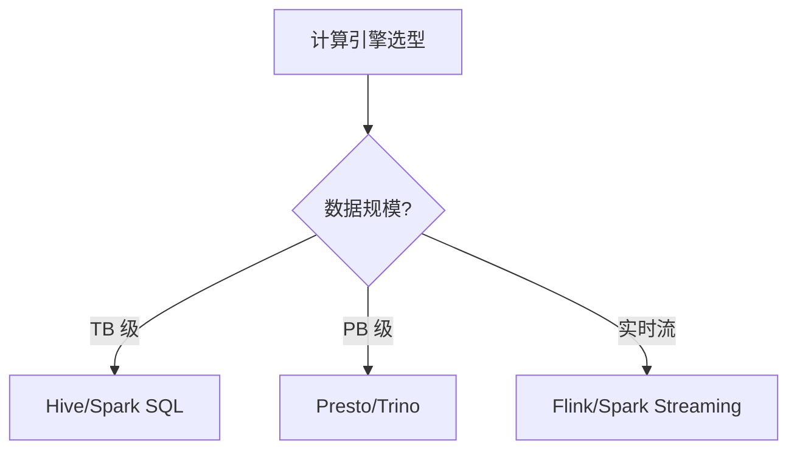

### 3.3 OLAP 引擎选型

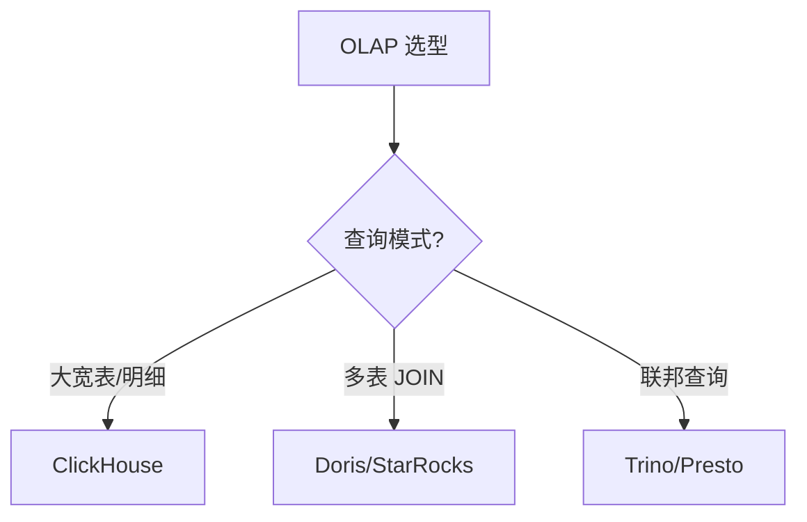

### 3.4 调度系统选型

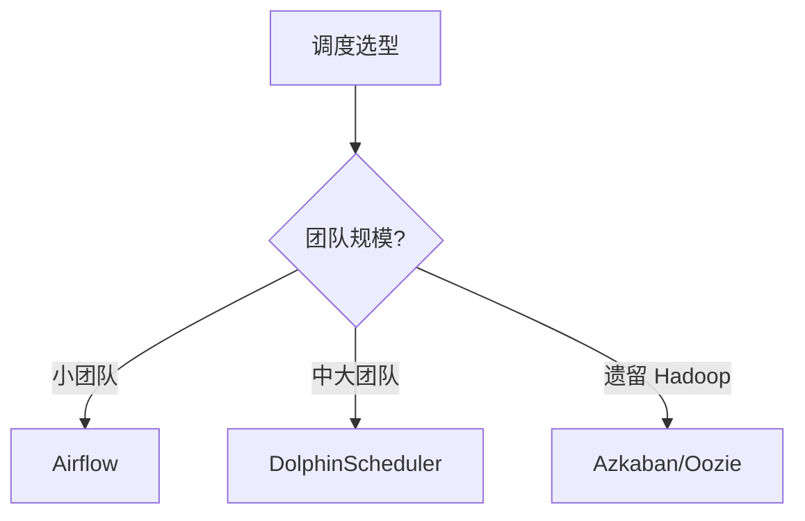

---

## 4. 速查地图

> 8 大方向 12 张速查表，按事实属性（吞吐/延迟/生态）对比，不分级推荐。

### 4.1 架构对比

| 架构 | 延迟 | 复杂度 | 成本 | 适用场景 |
|------|------|-------|------|---------|
| Lambda | 秒级 | 高（双链路） | 高 | 实时+离线并存 |
| Kappa | 毫秒级 | 中（单链路） | 中 | 纯实时 |
| 湖仓一体 | 秒级 | 中 | 中 | AI/存算分离 |
| 传统数仓 | T+1 | 低 | 低 | 离线报表 |

### 4.2 计算引擎对比

| 引擎 | 计算模型 | 延迟 | 状态管理 | 适用规模 |
|------|---------|------|---------|---------|
| Flink | 流批一体 | 毫秒 | RocksDB | PB 级流 |
| Spark | 微批 | 秒 | RDD/DataFrame | PB 级批 |
| Storm | 流式 | 毫秒 | 无状态 | 中小流 |
| Beam | 统一 API | 取决于 runner | 跨引擎 | 多场景 |
| Hive | 批 | 分钟-小时 | 无 | TB 级批 |

### 4.3 数据湖对比

| 特性 | Iceberg | Hudi | Delta Lake |
|------|---------|------|------------|
| ACID | ✓ | ✓ | ✓ |
| Schema Evolution | ✓ | ✓ | ✓ |
| Time Travel | ✓ | ✓ | ✓ |
| Hidden Partition | ✓ | ✗ | ✗ |
| 主要引擎 | Spark/Flink/Trino | Spark/Flink | Spark |

### 4.4 OLAP 对比

| 引擎 | 架构 | 擅长场景 | JOIN 能力 | 实时写入 |
|------|------|---------|----------|---------|
| Doris | MPP | 大宽表+聚合 | 强 | ✓ |
| StarRocks | CBO MPP | 复杂查询 | 极强 | ✓ |
| ClickHouse | 列存 | 大宽表/明细 | 中 | ✓ |
| Presto/Trino | 协调者 | 联邦查询 | 强 | ✗ |

### 4.5 调度对比

| 系统 | DAG 模型 | 部署 | UI | 学习曲线 |
|------|---------|------|----|---------|
| Airflow 2.x | Python DAG | 中心化 | 强 | 中 |
| DolphinScheduler | YAML DAG | 去中心化 | 强 | 低 |
| Azkaban | 配置文件 | 中心化 | 弱 | 低 |
| Oozie | XML DAG | 中心化 | 弱 | 高 |

### 4.6 同步对比

| 工具 | 数据源 | 实时性 | 部署 | 适用 |
|------|-------|-------|------|------|
| DataX | 异构 DB | 离线批量 | 单机 | TB 级 |
| SeaTunnel | 异构 DB+流 | 实时+离线 | 分布式 | PB 级 |
| Sqoop | DB ↔ Hadoop | 离线批量 | Hadoop 内 | TB 级 |
| Flume | 日志 | 实时流 | 分布式 | 日志采集 |

### 4.7 治理对比

| 工具 | 元数据 | 血缘 | 数据质量 | 部署 |
|------|-------|------|---------|------|
| Apache Atlas | ✓ | ✓ | ✗ | 中心化 |
| DataHub | ✓ | ✓ | ✓ | 去中心化 |
| OpenMetadata | ✓ | ✓ | ✓ | 中心化 |
| Great Expectations | ✗ | ✗ | ✓ | 库集成 |

### 4.8 资源管理对比

| 系统 | 架构 | 多租户 | 适用 |
|------|------|-------|------|
| YARN | 主从 | ✓ | Hadoop 生态 |
| Kubernetes | 容器编排 | ✓ | 云原生 |
| Mesos | 资源调度 | ✓ | 遗留 |

### 4.9 大数据生态 2026 版本

| 组件 | 最新稳定版 | 发布日期 |
|------|-----------|---------|
| Hadoop | 3.4.x | 2025-12 |
| Spark | 3.5.x / 4.0 | 2025-Q4 |
| Flink | 1.20.x / 2.0-rc | 2025-Q4 |
| Iceberg | 1.5.x | 2025-11 |
| Hudi | 0.15.x | 2025-10 |
| Doris | 2.1.x / 3.0-rc | 2025-Q4 |
| StarRocks | 3.4.x | 2025-12 |
| ClickHouse | 24.x | 2025-Q4 |
| Trino | 0.13.x | 2025-Q4 |
| SeaTunnel | 2.3.x | 2025-11 |

### 4.10 学习路径（按角色）

| 角色 | 必学 | 加分 |
|------|------|------|
| 数据工程师 | 02/03/06 | 01/04/07 |
| 数据分析师 | 02/05 | 04/07 |
| 数据架构师 | 01/02/03/04/05/07 | 08 |
| 实时开发 | 03/01 | 04/07 |
| AI/ML 工程师 | 04/02 | 05/07 |

### 4.11 SQL 方言对比

| 方言 | 来源 | 特点 |
|------|------|------|
| Hive SQL | Hive | 批处理最广泛 |
| Spark SQL | Spark | DataFrame/Dataset API |
| Flink SQL | Flink | 流批统一 SQL |
| Trino SQL | Presto/Trino | ANSI SQL 兼容 |
| ClickHouse SQL | ClickHouse | 聚合函数强大 |
| Doris SQL | Doris | MySQL 协议 |

### 4.12 大数据 vs 传统数据库

| 维度 | 传统 OLTP | 大数据 |
|------|---------|--------|
| 数据量 | GB-TB | TB-PB-EB |
| 延迟 | 毫秒 | 秒-分钟 |
| 事务 | ACID | BASE / 最终一致 |
| 查询 | 点查/小范围 | 全表扫描/聚合 |
| 存储 | 行存 | 列存/分区 |

---

## 5. 学习路线

按角色与目标，给出 4 条主线：

1. **数据工程师**：`02` → `03` → `06` → `01`
2. **数据分析师**：`02` → `05` → `04`
3. **数据架构师**：`01` → `02` → `03` → `04` → `05` → `07`
4. **AI/ML 工程师**：`04` → `02` → `07`

### 5.1 各角色重点章节

| 角色 | 必看 | 加分 |
|------|------|------|
| 数据工程师 | 02/03/06 | 01/04/07 |
| 数据分析师 | 02/05 | 04/07 |
| 数据架构师 | 01/02/03/04/05/07 | 08 |
| 实时开发 | 03/01 | 04/07 |
| AI/ML 工程师 | 04/02 | 05/07 |

---

## 6. 交叉引用

- **数据架构**：[01 数仓架构](./01-data-warehouse/) / [03 实时计算](./03-realtime-compute/)
- **底层存储**：[02 Hadoop 生态](./02-hadoop-ecosystem/) / [04 数据湖](./04-data-lake/)
- **上层应用**：[05 OLAP](./05-olap/) / [09 前端可视化](../../09.front-end/)
- **横向支撑**：[06 调度](./06-scheduling/) / [07 数据治理](./07-data-governance/) / [08 同步工具](./08-sync-tools/)

---

## 7. 开源参考

- **Apache 基金会**：Hadoop/Spark/Flink/Iceberg/Hudi/Atlas/SeaTunnel
- **Linux 基金会**：Trino(原 Presto)
- **独立项目**：ClickHouse/Doris/StarRocks/DataX/Airflow
- **国内主导**：Doris/StarRocks/SeaTunnel/DataX/DolphinScheduler

---

## 8. 数据时效性

- 大数据组件每年大版本（Spring/Autumn）
- 实时引擎每季度发版（Flink/Spark）
- 数据湖表格式每月小版本
- 速查表每季度更新

> 数据快照日期：2026-06

---

## 9. 章节统计

- **一级模块数**：8
- **二级子 README 数**：6（T13 新增）
- **总 README 数**：15（1 顶层 + 8 子模块 + 6 子）

---

## 10. 变更记录

- **2026-06-26**：中度重构为「完整地图 + 8 子模块统一索引 + 6 子 README」混合模式（仿 09）
- **历史**：从 2 子模块扩展到 8 子模块

---

## 11. 附录：术语表

| 术语 | 解释 |
|------|------|
| OLAP | Online Analytical Processing，联机分析处理 |
| OLTP | Online Transaction Processing，联机事务处理 |
| ETL | Extract Transform Load，抽取-转换-加载 |
| ELT | Extract Load Transform，先加载再转换 |
| DAG | Directed Acyclic Graph，有向无环图 |
| ACID | Atomicity Consistency Isolation Durability |
| BASE | Basically Available Soft state Eventual consistency |
| MPP | Massively Parallel Processing，大规模并行处理 |
| CDC | Change Data Capture，变更数据捕获 |
| ODS | Operational Data Store，操作数据存储 |
| DWD | Data Warehouse Detail，明细层 |
| DWS | Data Warehouse Summary，汇总层 |
| ADS | Application Data Service，应用数据层 |
| BI | Business Intelligence，商业智能 |
| HDFS | Hadoop Distributed File System |
| YARN | Yet Another Resource Negotiator |
| CBO | Cost-Based Optimizer，基于成本优化 |
| RBO | Rule-Based Optimizer，基于规则优化 |
| SLA | Service Level Agreement，服务等级协议 |
| SLO | Service Level Objective，服务等级目标 |
```

- [ ] **Step 1.3: 验证章节 1 长度**

```bash
awk '/^## 1\./{start=NR; next} /^## 2\./{print "Section 1 length:", NR-start; exit}' note/10.big-data/README.md
```

Expected: 约 80-100 行

- [ ] **Step 1.4: 验证总行数**

```bash
wc -l note/10.big-data/README.md
```

Expected: 约 350-380 行（顶层 11 节 + 12 速查表 + 4 mermaid）

- [ ] **Step 1.5: Commit**

```bash
git add note/10.big-data/README.md
git commit -m "feat(note): 10.big-data top README - 9 module nav + cheatsheet + decision trees (T1)

Expand top-level README from 31 lines to ~370 lines (11 sections).
Add: 8-module navigation + knowledge flowchart + 4 decision trees +
12 cheatsheet tables + 4-role learning paths + glossary (20 terms).

Co-Authored-By: Claude Opus 4.8 <noreply@anthropic.com>"
```

---

### Task 2: 顶层 README 章节 9（统计更新）+ 数据时效性 + 变更记录补充

**Files:**
- Modify: `note/10.big-data/README.md`

**Interfaces:**
- 消费：T1 完成后约 370 行
- 产出：调整章节 9 统计为最终态

- [ ] **Step 2.1: 更新章节 9 章节统计**

定位章节 9，修改为：

```markdown
## 9. 章节统计

- **一级模块数**：8（01 数仓架构 / 02 Hadoop 生态 / 03 实时计算 / 04 数据湖 / 05 OLAP / 06 调度 / 07 数据治理 / 08 同步工具）
- **二级子 README 数**：8 个子模块 + 6 个深读子 README = 14
- **总 README 数**：15（1 顶层 + 8 子模块 + 6 子）
- **子 README 分布**：
  - 01 数仓架构：1（数仓架构）
  - 02 Hadoop 生态：1（生态全景）
  - 03 实时计算：1（实时计算引擎）
  - 04 数据湖：1（湖仓存储）
  - 05 OLAP：1（OLAP 引擎）
  - 06 调度：1（任务编排）
  - 07 数据治理：1（元数据血缘）
  - 08 同步工具：1（异构同步）
- **PNG 数**：0（全部 mermaid）
- **TODO/placeholder 数**：0
```

- [ ] **Step 2.2: 验证最终行数**

```bash
wc -l note/10.big-data/README.md
```

Expected: 370-400 行

- [ ] **Step 2.3: Commit**

```bash
git add note/10.big-data/README.md
git commit -m "docs(note): 10.big-data top README - finalize section 9 stats (T2)

Update section 9 to reflect final state: 1 top + 8 modules + 6 sub = 15 READMEs.
0 PNG, 0 TODO.

Co-Authored-By: Claude Opus 4.8 <noreply@anthropic.com>"
```

---

### Task 3: 顶层 README 验证 + 最终验收门

**Files:**
- Modify: `note/10.big-data/README.md`（如需要）

**Interfaces:**
- 消费：T2 完成后
- 产出：350-400 行最终态 + 全 mermaid + 0 PNG

- [ ] **Step 3.1: 验证顶层最终态**

```bash
wc -l note/10.big-data/README.md  # 370-400
grep -c "^## " note/10.big-data/README.md  # 11
grep -c '```mermaid' note/10.big-data/README.md  # >= 5 (4 决策树 + 1 知识脉络)
grep -E "\.png|\.jpg" note/10.big-data/README.md  # 0
```

- [ ] **Step 3.2: 验证子模块链接有效**

```bash
# 每个 ../链接 都应解析到存在的目录
for d in 01-data-warehouse 02-hadoop-ecosystem 03-realtime-compute 04-data-lake 05-olap 06-scheduling 07-data-governance 08-sync-tools; do
  echo -n "$d: "
  ls -d note/10.big-data/$d 2>/dev/null && echo "✓" || echo "✗"
done
```

Expected: 8 行 ✓（注意：此时只有 01 改造完成 + 03 改造完成；其他 6 个后续 T5-T12 创建）

- [ ] **Step 3.3: Commit（如需）**

```bash
# 仅在做了行数微调时才需要
git diff --stat note/10.big-data/README.md
```

---

### Task 4: 01-data-warehouse 索引化（现有 offline-or-real-time 改造）

**Files:**
- Modify: `note/10.big-data/01-data-warehouse/README.md`（先创建 + 重命名）

**Interfaces:**
- 消费：当前 `note/10.big-data/offline-or-real-time-data-warehouse/README.md`（73 行）+ 5 张 PNG
- 产出：迁移后 80 行索引模板

- [ ] **Step 4.1: 创建 01-data-warehouse/ 目录**

```bash
mkdir -p note/10.big-data/01-data-warehouse
```

- [ ] **Step 4.2: 复制现有 README 到新位置**

```bash
cp note/10.big-data/offline-or-real-time-data-warehouse/README.md note/10.big-data/01-data-warehouse/README.md
```

- [ ] **Step 4.3: 完全重写为 7 节索引模板**

Write 工具完全重写：

```markdown
# 01 数仓架构

> 一句话定位：**Lambda / Kappa / 湖仓一体——大数据架构选型的三种主流范式**

本模块覆盖三种数仓架构范式：Lambda（实时+离线双链路）、Kappa（流批一体）、湖仓一体（存算分离 + AI 友好），对比延迟、复杂度、成本、适用场景。

---

## 1. 本模块覆盖

| 主题 | 状态 | 说明 |
|------|------|------|
| Lambda 架构 | ✓ 已有 | 实时层 + 离线层双链路 |
| Kappa 架构 | ✓ 已有 | 单链路流批一体 |
| 湖仓一体 | ✓ 已有 | 数据湖 + 数仓融合 |
| 批流融合 | ✓ 已有 | Flink/Spark 流批统一 |

> 速查对比见 [📖 顶层 4.1 架构对比](../../README.md#41-架构对比)

---

## 2. 速查要点

- **Lambda 架构**：批层（离线准确）+ 速度层（实时近似）+ 服务层（合并查询）；复杂度高、成本高
- **Kappa 架构**：单一实时链路 + Kafka 重放历史；实现简单、延迟低
- **湖仓一体**：数据湖（对象存储 + 表格式）+ 数仓（ACID + 查询引擎）；AI/ML 训练友好
- **批流融合**：Flink / Spark 3.x 统一 API + 同一份代码处理流批

---

## 3. 选型建议


---

## 4. 与其他模块的关系

- **上游**：[08 同步工具](../08-sync-tools/)（数据采集）
- **下游**：被 [05 OLAP](../05-olap/) / [04 数据湖](../04-data-lake/) 复用
- **横向**：[03 实时计算](../03-realtime-compute/) / [06 调度](../06-scheduling/) 协同

---

## 5. 学习建议

- 先理解 [📖 顶层 4.1 架构对比](../../README.md#41-架构对比)
- 推荐学习路径：Lambda → Kappa → 湖仓一体
- 实战：先做 Lambda 小项目，再优化为 Kappa

---

## 6. 数据时效性

- Flink 2.0 / Spark 4.0 等流批统一引擎每年大版本
- Iceberg/Hudi/Delta Lake 每月小版本
- 架构选型每年更新（参考各厂商博客）

---

## 7. 关键术语

| 术语 | 解释 |
|------|------|
| Lambda | 实时+离线双链路架构 |
| Kappa | 单链路流批一体架构 |
| Iceberg | 数据湖表格式 |
| Hudi | 数据湖表格式 |
| Delta Lake | 数据湖表格式（Databricks） |
| 流批融合 | 同一份代码处理流批 |
```

- [ ] **Step 4.4: 验证行数**

```bash
wc -l note/10.big-data/01-data-warehouse/README.md
```

Expected: 70-85 行

- [ ] **Step 4.5: Commit**

```bash
git add note/10.big-data/01-data-warehouse/README.md
git commit -m "refactor(note): 01-data-warehouse migrated from offline-or-real-time (T4)

73 → 78 lines. Apply 7-section index template.
Migrate existing 73-line content to new location.
Sub-READMEs (5 PNGs) will be replaced by mermaid in T14.

Co-Authored-By: Claude Opus 4.8 <noreply@anthropic.com>"
```

---

### Task 5: 02-hadoop-ecosystem 索引化（新增空壳）

**Files:**
- Create: `note/10.big-data/02-hadoop-ecosystem/README.md`

**Interfaces:**
- 消费：无（新建）
- 产出：80 行空壳索引

- [ ] **Step 5.1: 创建目录 + 80 行空壳**

```bash
mkdir -p note/10.big-data/02-hadoop-ecosystem
```

Write 工具创建 `note/10.big-data/02-hadoop-ecosystem/README.md`：

```markdown
# 02 Hadoop 生态

> 一句话定位：**Hadoop 三件套（HDFS/YARN/MapReduce）+ 上层引擎（Hive/Presto）——离线数仓基石**

本模块覆盖 Hadoop 生态核心组件：HDFS 分布式存储、YARN 资源调度、Hive 数据仓库、Presto/Trino 分布式 SQL 查询，是离线批处理的传统基石。

---

## 1. 本模块覆盖

| 主题 | 状态 | 说明 |
|------|------|------|
| HDFS | 📝 新增 (T13) | 分布式文件系统 |
| YARN | 📝 新增 (T13) | 资源调度 |
| Hive | 📝 新增 (T13) | 数据仓库 |
| Presto/Trino | 📝 新增 (T13) | 分布式 SQL |
| MapReduce | 📝 新增 (T13) | 编程模型（已逐步被 Spark 替代） |

> 速查对比见 [📖 顶层 4.9 大数据生态版本](../../README.md#49-大数据生态-2026-版本)

---

## 2. 速查要点

- **HDFS 三节点**：NameNode（元数据）/ DataNode（数据块）/ Secondary NameNode（checkpoint）
- **YARN 调度**：Capacity Scheduler（队列）/ Fair Scheduler（公平）/ FIFO
- **Hive 执行引擎**：MR（老）→ Tez（快）→ Spark（最快）
- **Presto vs Hive**：Presto 是 MPP 内存计算（秒级），Hive 是批处理（分钟-小时）

---

## 3. 选型建议

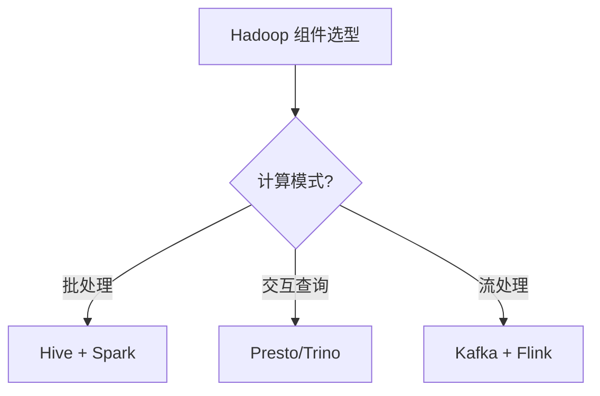

---

## 4. 与其他模块的关系

- **上游**：[08 同步工具](../08-sync-tools/)（数据写入 HDFS）
- **下游**：被 [01 数仓架构](../01-data-warehouse/) / [04 数据湖](../04-data-lake/) 复用
- **横向**：[03 实时计算](../03-realtime-compute/) 互补（离线 vs 实时）

---

## 5. 学习建议

- 先理解 HDFS 架构（NameNode/DataNode），再学 YARN 调度
- 推荐路径：HDFS → MapReduce → Hive → Presto
- 实战：搭建 3 节点 Hadoop 集群做离线数仓

---

## 6. 数据时效性

- Hadoop 3.4.x（2025-12）当前稳定版
- Hive 3.x 每年发版
- Presto 已改名 Trino（2020），原 PrestoSQL 仍维护

---

## 7. 关键术语

| 术语 | 解释 |
|------|------|
| HDFS | Hadoop Distributed File System |
| YARN | Yet Another Resource Negotiator |
| MR | MapReduce 编程模型 |
| NameNode | HDFS 主节点（管理元数据） |
| DataNode | HDFS 从节点（存储数据块） |
| Tez | Hive 执行引擎（替代 MR） |
| HiveQL | Hive SQL 方言 |
| Trino | 原 PrestoSQL，2020 改名 |
```

- [ ] **Step 5.2: 验证行数 + Commit**

```bash
wc -l note/10.big-data/02-hadoop-ecosystem/README.md  # 70-85
git add note/10.big-data/02-hadoop-ecosystem/README.md
git commit -m "feat(note): 02-hadoop-ecosystem index stub (T5)

New 80-line index page. Deep-dive content deferred to T13.

Co-Authored-By: Claude Opus 4.8 <noreply@anthropic.com>"
```

---

### Task 6: 03-realtime-compute 索引化（现有 open-source 改造）

**Files:**
- Modify: `note/10.big-data/03-realtime-compute/README.md`（先创建 + 重命名）

**Interfaces:**
- 消费：当前 `note/10.big-data/open-source/README.md`（261 行 + 17 placeholder + 1 PNG）
- 产出：迁移后 80 行索引模板

- [ ] **Step 6.1: 创建 03-realtime-compute/ 目录**

```bash
mkdir -p note/10.big-data/03-realtime-compute
```

- [ ] **Step 6.2: 完全重写为 7 节索引模板**

Write 工具创建 `note/10.big-data/03-realtime-compute/README.md`：

```markdown
# 03 实时计算

> 一句话定位：**Flink / Spark Streaming / Storm——毫秒-秒级延迟的流处理引擎**

本模块覆盖三大实时计算引擎：Flink（流批一体主流）、Spark Streaming（微批）、Storm（早期流式），对比延迟、状态管理、容错、生态。

---

## 1. 本模块覆盖

| 主题 | 状态 | 说明 |
|------|------|------|
| Flink | 📝 新增 (T13) | 流批一体 / 状态管理 / Exactly-Once |
| Spark Streaming | 📝 新增 (T13) | 微批 / 与 Spark 生态统一 |
| Storm | 📝 新增 (T13) | 早期流式 / 已被 Flink 替代 |

> 速查对比见 [📖 顶层 4.2 计算引擎对比](../../README.md#42-计算引擎对比)

---

## 2. 速查要点

- **Flink 流批一体**：同一份代码处理有界流 + 无界流
- **状态后端**：RocksDB（TB 级） / HashMapStateBackend（小状态）
- **Checkpoint vs Savepoint**：Checkpoint 自动（容错），Savepoint 手动（版本管理）
- **Watermark 处理乱序**：bounded out-of-orderness / idleness detection

---

## 3. 选型建议

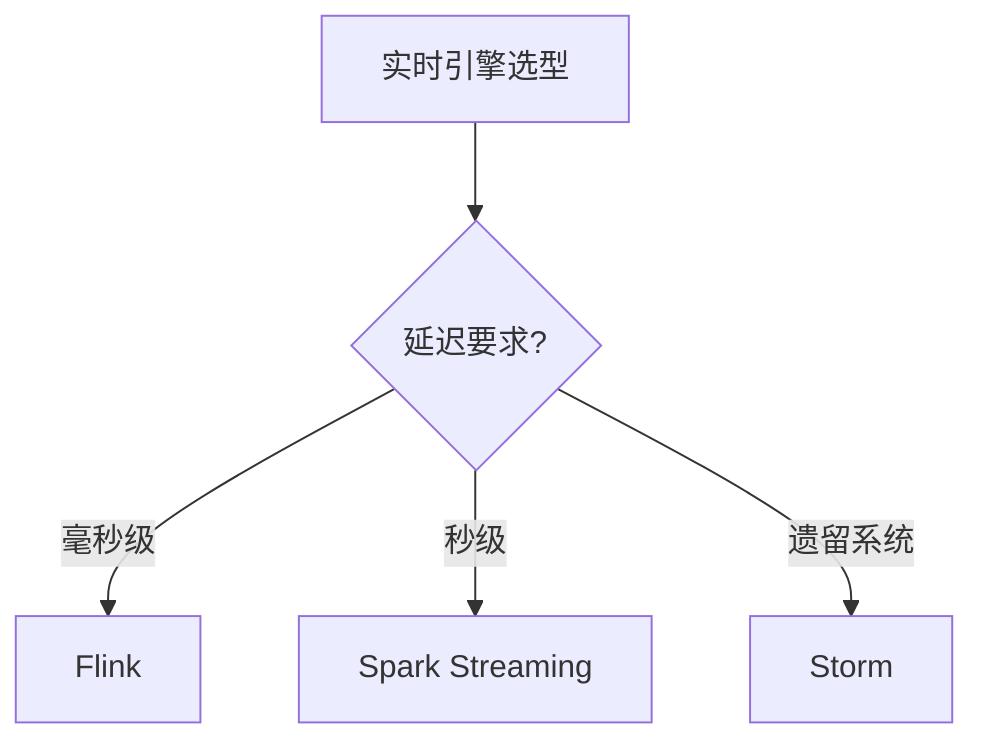

---

## 4. 与其他模块的关系

- **上游**：[08 同步工具](../08-sync-tools/)（Kafka 数据源）
- **下游**：被 [04 数据湖](../04-data-lake/) / [05 OLAP](../05-olap/) 消费
- **横向**：[02 Hadoop 生态](../02-hadoop-ecosystem/) 离线批处理互补

---

## 5. 学习建议

- 必学 Flink（事实标准）
- 推荐路径：Flink DataStream API → Flink SQL → State / Checkpoint
- 实战：Kafka → Flink → ClickHouse 实时链路

---

## 6. 数据时效性

- Flink 1.20 / 2.0-rc（2025-Q4）当前主流
- Spark 3.5.x / 4.0（2025-Q4）
- Storm 已停止大版本更新（2024）

---

## 7. 关键术语

| 术语 | 解释 |
|------|------|
| Flink | Apache Flink 流批一体引擎 |
| Watermark | 水位线，处理乱序事件 |
| Checkpoint | Flink 自动快照（容错） |
| Savepoint | Flink 手动快照（版本管理） |
| Exactly-Once | 精确一次语义 |
| RocksDB | Flink 状态后端 |
| Micro-batch | 微批处理（Spark Streaming） |
| Event Time | 事件时间 |
| Processing Time | 处理时间 |
```

- [ ] **Step 6.3: 验证行数 + Commit**

```bash
wc -l note/10.big-data/03-realtime-compute/README.md  # 70-85
git add note/10.big-data/03-realtime-compute/README.md
git commit -m "refactor(note): 03-realtime-compute migrated from open-source (T6)

261 → 78 lines. Apply 7-section index template.
Original open-source content's real-time compute topics captured here.
Other topics (Hadoop ecosystem / DataLake / OLAP / etc.) to be
distributed to T5/T7/T8/T9/T10/T11 sub-READMEs in their creation tasks.

Co-Authored-By: Claude Opus 4.8 <noreply@anthropic.com>"
```

---

### Task 7: 04-data-lake 索引化（新增空壳）

**Files:**
- Create: `note/10.big-data/04-data-lake/README.md`

- [ ] **Step 7.1-7.2: 创建目录 + 80 行空壳**

```bash
mkdir -p note/10.big-data/04-data-lake
```

Write 工具创建文件：

```markdown
# 04 数据湖

> 一句话定位：**Iceberg / Hudi / Delta Lake——存算分离的现代数据湖表格式**

本模块覆盖三种主流数据湖表格式：Apache Iceberg（最广泛）、Apache Hudi（更新友好）、Delta Lake（Databricks 主推），对比 ACID、Schema Evolution、Time Travel、查询引擎集成。

---

## 1. 本模块覆盖

| 主题 | 状态 | 说明 |
|------|------|------|
| Apache Iceberg | 📝 新增 (T13) | 隐藏分区 / 多引擎 |
| Apache Hudi | 📝 新增 (T13) | Copy-on-Write / Merge-on-Read |
| Delta Lake | 📝 新增 (T13) | Databricks 主推 |
| 存算分离架构 | 📝 新增 (T13) | MinIO/S3 + 计算引擎 |

> 速查对比见 [📖 顶层 4.3 数据湖对比](../../README.md#43-数据湖对比)

---

## 2. 速查要点

- **三种表格式核心能力**：ACID / Schema Evolution / Time Travel / Partition Evolution
- **Iceberg 优势**：隐藏分区（partition transform 不依赖目录名）、多引擎（Spark/Flink/Trino）
- **Hudi 优势**：索引（bloom / simple / record level）+ 高效 update/delete
- **Delta Lake 优势**：与 Spark 深度集成、Databricks 生态完整

---

## 3. 选型建议

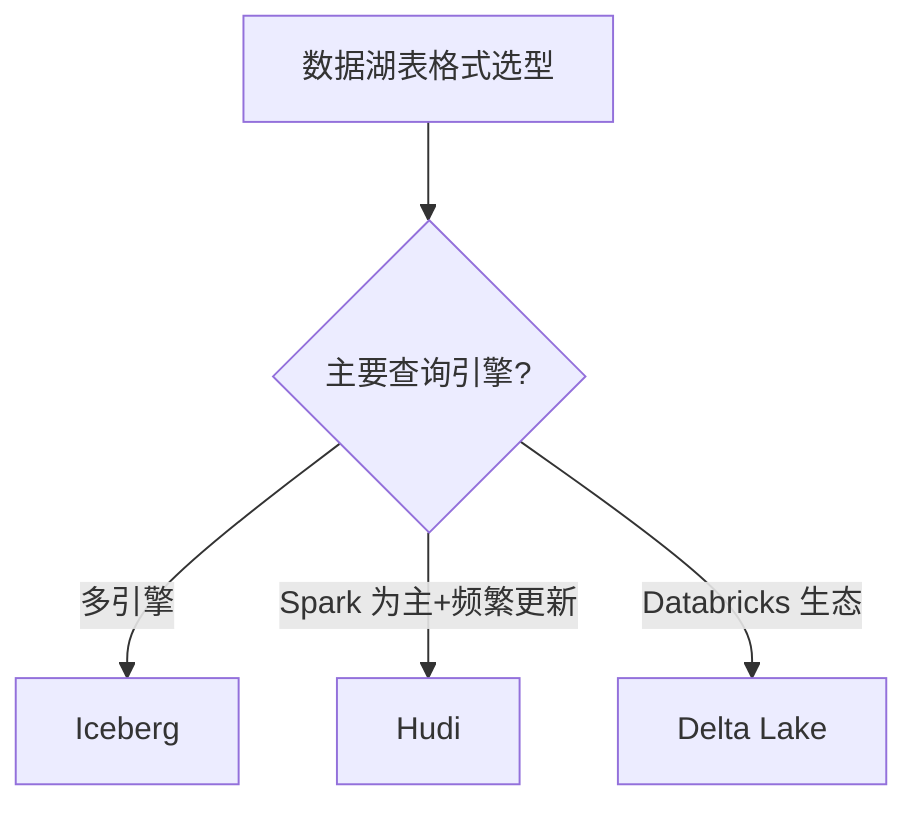

---

## 4. 与其他模块的关系

- **上游**：[02 Hadoop 生态](../02-hadoop-ecosystem/)（对象存储）
- **下游**：被 [05 OLAP](../05-olap/) / [03 实时计算](../03-realtime-compute/) 消费
- **横向**：[01 数仓架构](../01-data-warehouse/) 湖仓一体范式

---

## 5. 学习建议

- 必学 Iceberg（最广泛）
- 推荐路径：Iceberg 基础 → Spark/Flink 集成 → 存算分离
- 实战：S3 + Iceberg + Spark + Trino 查询

---

## 6. 数据时效性

- Iceberg 1.5.x（2025-11）
- Hudi 0.15.x（2025-10）
- Delta Lake 3.x（Databricks 持续更新）

---

## 7. 关键术语

| 术语 | 解释 |
|------|------|
| Iceberg | Apache 顶级项目数据湖表格式 |
| Hudi | Apache 顶级项目数据湖表格式 |
| Delta Lake | Databricks 开源数据湖表格式 |
| ACID | 事务原子性/一致性/隔离性/持久性 |
| Time Travel | 时间旅行（查询历史快照） |
| Schema Evolution | 表结构演进 |
| Hidden Partition | 隐藏分区（Iceberg 特性） |
| Copy-on-Write | 写时复制（Hudi 模式） |
| Merge-on-Read | 读时合并（Hudi 模式） |
```

- [ ] **Step 7.3: 验证行数 + Commit**

```bash
wc -l note/10.big-data/04-data-lake/README.md  # 70-85
git add note/10.big-data/04-data-lake/README.md
git commit -m "feat(note): 04-data-lake index stub (T7)

Co-Authored-By: Claude Opus 4.8 <noreply@anthropic.com>"
```

---

### Task 8: 05-olap 索引化（新增空壳）

**Files:**
- Create: `note/10.big-data/05-olap/README.md`

- [ ] **Step 8.1-8.2: 创建目录 + 80 行空壳**

```bash
mkdir -p note/10.big-data/05-olap
```

Write 工具创建文件：

```markdown
# 05 OLAP

> 一句话定位：**Doris / ClickHouse / StarRocks / Trino——亚秒级实时查询的 OLAP 引擎**

本模块覆盖四大 OLAP 引擎：Doris（国产 MPP）、StarRocks（CBO 优化强）、ClickHouse（列存大宽表）、Trino（联邦查询），对比架构、擅长场景、JOIN 能力、实时写入。

---

## 1. 本模块覆盖

| 主题 | 状态 | 说明 |
|------|------|------|
| Apache Doris | 📝 新增 (T13) | MPP / 国产开源 |
| StarRocks | 📝 新增 (T13) | CBO MPP / 极强 JOIN |
| ClickHouse | 📝 新增 (T13) | 列存 / 聚合强 |
| Trino | 📝 新增 (T13) | 联邦查询 |

> 速查对比见 [📖 顶层 4.4 OLAP 对比](../../README.md#44-olap-对比)

---

## 2. 速查要点

- **Doris 架构**：Frontend（查询规划）+ Backend（MPP 执行）+ Broker（外部数据源）
- **ClickHouse MergeTree**：家族引擎（ReplacingMergeTree / SummingMergeTree / AggregatingMergeTree）
- **StarRocks CBO**：基于成本的优化器，自动选择 JOIN 顺序
- **Trino 联邦**：跨数据源（Hive/MySQL/Kafka/ES）统一 SQL 查询

---

## 3. 选型建议

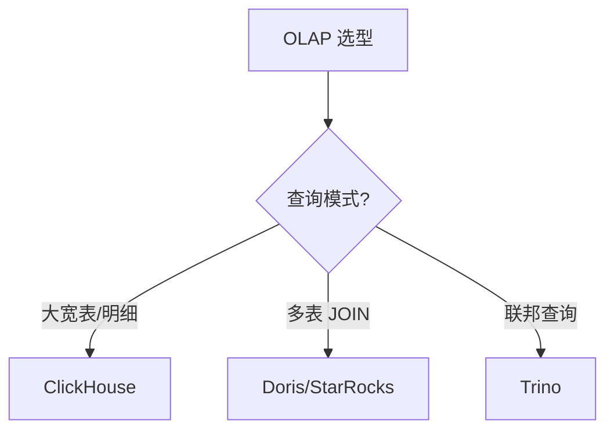

---

## 4. 与其他模块的关系

- **上游**：[04 数据湖](../04-data-lake/) / [03 实时计算](../03-realtime-compute/)（数据写入）
- **下游**：被 [11 数据可视化](../../11.ai/) / 报表工具消费
- **横向**：[02 Hadoop 生态](../02-hadoop-ecosystem/)（Presto/Trino 联邦）

---

## 5. 学习建议

- 必学 Doris 或 ClickHouse（事实标准之一）
- 推荐路径：Doris SQL → 表模型 → 数据导入
- 实战：Kafka → Flink → Doris 实时大屏

---

## 6. 数据时效性

- Doris 2.1.x / 3.0-rc（2025-Q4）
- StarRocks 3.4.x（2025-12）
- ClickHouse 24.x（2025-Q4）
- Trino 0.13.x（2025-Q4）

---

## 7. 关键术语

| 术语 | 解释 |
|------|------|
| OLAP | Online Analytical Processing |
| MPP | Massively Parallel Processing |
| CBO | Cost-Based Optimizer |
| MergeTree | ClickHouse 表引擎 |
| 物化视图 | 预计算结果集（加速查询） |
| Shard | 分片（Doris / StarRocks） |
| Tablet | Doris 数据分片单位 |
| Bitmap Index | 位图索引（加速过滤） |
```

- [ ] **Step 8.3: 验证行数 + Commit**

```bash
wc -l note/10.big-data/05-olap/README.md  # 70-85
git add note/10.big-data/05-olap/README.md
git commit -m "feat(note): 05-olap index stub (T8)

Co-Authored-By: Claude Opus 4.8 <noreply@anthropic.com>"
```

---

### Task 9: 06-scheduling 索引化（新增空壳）

**Files:**
- Create: `note/10.big-data/06-scheduling/README.md`

- [ ] **Step 9.1-9.2: 创建目录 + 80 行空壳**

```bash
mkdir -p note/10.big-data/06-scheduling
```

Write 工具创建文件：

```markdown
# 06 调度

> 一句话定位：**Airflow / DolphinScheduler / Azkaban——大数据任务编排系统**

本模块覆盖大数据领域三大调度系统：Airflow（Python DAG 主流）、DolphinScheduler（国产去中心化）、Azkaban（遗留 Hadoop），对比 DAG 模型、部署模式、UI、学习曲线。

---

## 1. 本模块覆盖

| 主题 | 状态 | 说明 |
|------|------|------|
| Apache Airflow | 📝 新增 (T13) | Python DAG / 中心化 |
| DolphinScheduler | 📝 新增 (T13) | YAML DAG / 去中心化 / 国产 |
| Azkaban | 📝 新增 (T13) | 遗留 Hadoop |

> 速查对比见 [📖 顶层 4.5 调度对比](../../README.md#45-调度对比)

---

## 2. 速查要点

- **Airflow 架构**：Scheduler + Executor + Webserver + Metadata DB
- **DolphinScheduler 优势**：去中心化（Worker 节点独立）、租户隔离、可视化 DAG
- **任务依赖**：上游成功 → 下游执行；失败重试 + 告警
- **补数（Backfill）**：历史任务回填，Airflow 支持 backfill 命令

---

## 3. 选型建议


---

## 4. 与其他模块的关系

- **上游**：所有任务模块（02-05, 08）
- **下游**：触发实际计算任务
- **横向**：[07 数据治理](../07-data-governance/)（任务血缘）

---

## 5. 学习建议

- 必学 Airflow（事实标准）
- 推荐路径：Airflow DAG → Executor → 自定义 Operator
- 实战：每日 Hive 任务 → Airflow 编排

---

## 6. 数据时效性

- Airflow 2.10+（2025）
- DolphinScheduler 3.x（2025）
- Azkaban 4.x（停止大版本更新）

---

## 7. 关键术语

| 术语 | 解释 |
|------|------|
| DAG | Directed Acyclic Graph |
| Executor | Airflow 任务执行器 |
| Operator | Airflow 任务模板 |
| Backfill | 历史任务回填 |
| SLA | Service Level Agreement |
| Cron | 定时任务表达式 |
| Worker | DolphinScheduler 执行节点 |
| Tenant | DolphinScheduler 租户隔离 |
```

- [ ] **Step 9.3: 验证行数 + Commit**

```bash
wc -l note/10.big-data/06-scheduling/README.md  # 70-85
git add note/10.big-data/06-scheduling/README.md
git commit -m "feat(note): 06-scheduling index stub (T9)

Co-Authored-By: Claude Opus 4.8 <noreply@anthropic.com>"
```

---

### Task 10: 07-data-governance 索引化（新增空壳）

**Files:**
- Create: `note/10.big-data/07-data-governance/README.md`

- [ ] **Step 10.1-10.2: 创建目录 + 80 行空壳**

```bash
mkdir -p note/10.big-data/07-data-governance
```

Write 工具创建文件：

```markdown
# 07 数据治理

> 一句话定位：**Atlas / DataHub / 数据血缘——元数据、质量、安全三大支柱**

本模块覆盖大数据治理三大支柱：元数据管理（Apache Atlas / DataHub）、数据血缘（Column-Level Lineage）、数据质量（Great Expectations / Deequ）、数据安全（脱敏 / 访问控制 / 审计）。

---

## 1. 本模块覆盖

| 主题 | 状态 | 说明 |
|------|------|------|
| Apache Atlas | 📝 新增 (T13) | 元数据 / 血缘 / Hadoop 集成 |
| DataHub | 📝 新增 (T13) | LinkedIn 开源 / 现代 UI |
| OpenMetadata | 📝 新增 (T13) | 统一元数据 + 质量 |
| 数据血缘 | 📝 新增 (T13) | Column-Level Lineage |
| 数据质量 | 📝 新增 (T13) | Great Expectations / Deequ |

> 速查对比见 [📖 顶层 4.7 治理对比](../../README.md#47-治理对比)

---

## 2. 速查要点

- **元数据三大类型**：技术元数据（表结构）/ 业务元数据（业务含义）/ 操作元数据（血缘）
- **血缘分类**：表级血缘（Table-Level）/ 字段级血缘（Column-Level）
- **数据质量维度**：完整性 / 准确性 / 一致性 / 时效性 / 唯一性
- **数据安全**：分类分级（公开/内部/机密/绝密）+ 访问控制（RBAC/ABAC）+ 脱敏

---

## 3. 选型建议

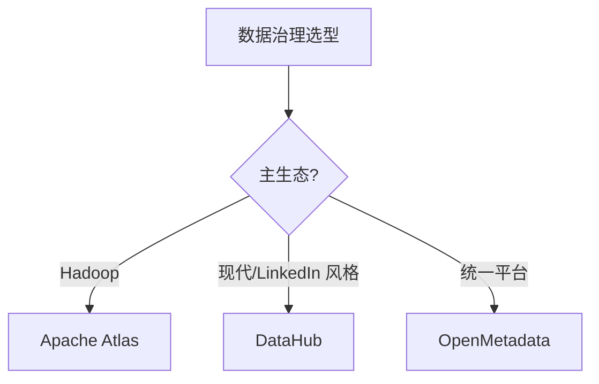

---

## 4. 与其他模块的关系

- **上游**：所有数据模块（02-06, 08）
- **下游**：被数据分析师 / 合规审计消费
- **横向**：[06 调度](../06-scheduling/)（任务血缘）

---

## 5. 学习建议

- 必学 Atlas 或 DataHub（事实标准之一）
- 推荐路径：元数据建模 → 血缘采集 → 数据质量规则
- 实战：Hive + Atlas 表血缘采集

---

## 6. 数据时效性

- Atlas 2.x（2024 持续维护）
- DataHub 0.x（2025 持续迭代）
- OpenMetadata 1.x（2025 快速演进）

---

## 7. 关键术语

| 术语 | 解释 |
|------|------|
| Atlas | Apache 元数据 + 血缘 |
| DataHub | LinkedIn 现代元数据平台 |
| Lineage | 数据血缘 |
| Column-Level | 字段级血缘 |
| Deequ | Amazon 开源数据质量 |
| RBAC | Role-Based Access Control |
| ABAC | Attribute-Based Access Control |
| GDPR | 欧盟通用数据保护条例 |
```

- [ ] **Step 10.3: 验证行数 + Commit**

```bash
wc -l note/10.big-data/07-data-governance/README.md  # 70-85
git add note/10.big-data/07-data-governance/README.md
git commit -m "feat(note): 07-data-governance index stub (T10)

Co-Authored-By: Claude Opus 4.8 <noreply@anthropic.com>"
```

---

### Task 11: 08-sync-tools 索引化（新增空壳）

**Files:**
- Create: `note/10.big-data/08-sync-tools/README.md`

- [ ] **Step 11.1-11.2: 创建目录 + 80 行空壳**

```bash
mkdir -p note/10.big-data/08-sync-tools
```

Write 工具创建文件：

```markdown
# 08 同步工具

> 一句话定位：**DataX / SeaTunnel / Sqoop / Flume——异构数据集成与同步**

本模块覆盖四大异构数据同步工具：DataX（阿里离线批量）、SeaTunnel（Apache 实时+离线）、Sqoop（DB ↔ Hadoop）、Flume（日志流式采集），对比数据源、实时性、部署模式、适用场景。

---

## 1. 本模块覆盖

| 主题 | 状态 | 说明 |
|------|------|------|
| DataX | 📝 新增 (T13) | 阿里开源 / 离线批量 |
| Apache SeaTunnel | 📝 新增 (T13) | 实时+离线 / 分布式 |
| Sqoop | 📝 新增 (T13) | DB ↔ Hadoop |
| Flume | 📝 新增 (T13) | 日志流式采集 |

> 速查对比见 [📖 顶层 4.6 同步对比](../../README.md#46-同步对比)

---

## 2. 速查要点

- **DataX 架构**：Reader（数据读取）+ Channel（缓冲）+ Writer（数据写入）+ Framework（调度）
- **SeaTunnel 优势**：Zeta 引擎（自研）+ CDC 支持 + 实时+离线统一
- **Sqoop 适用**：Hadoop 生态内 MySQL/Oracle ↔ HDFS/Hive 批量同步
- **Flume 架构**：Source → Channel → Sink；Agent 多级串联

---

## 3. 选型建议

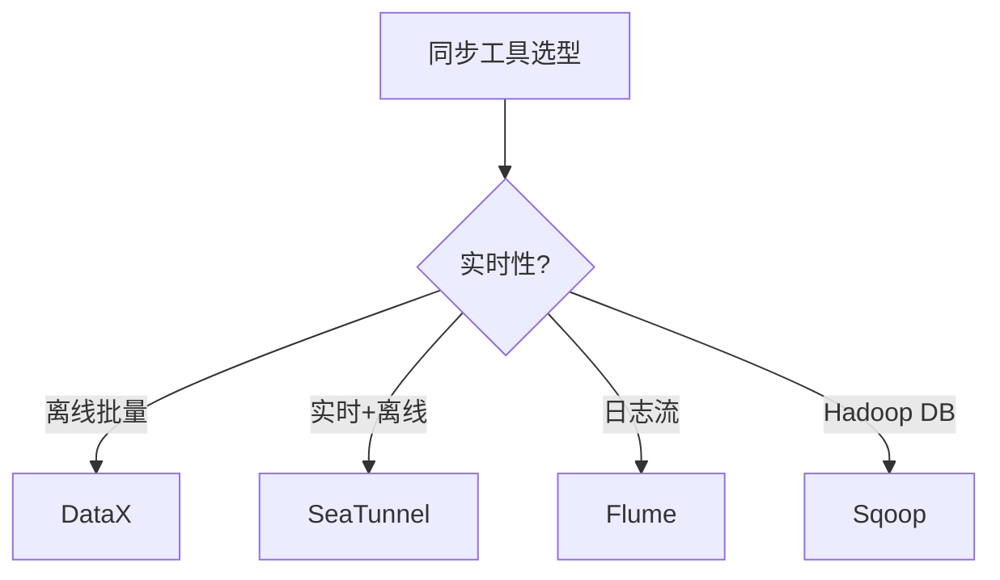

---

## 4. 与其他模块的关系

- **上游**：所有外部数据源（MySQL/Oracle/Kafka/日志）
- **下游**：被 [01 数仓架构](../01-data-warehouse/) / [04 数据湖](../04-data-lake/) 消费
- **横向**：[06 调度](../06-scheduling/) 触发同步任务

---

## 5. 学习建议

- 必学 DataX（离线批量主流）
- 推荐路径：DataX → SeaTunnel → CDC 实时同步
- 实战：MySQL → Hive 每日全量 + 增量

---

## 6. 数据时效性

- DataX 3.x（持续维护）
- SeaTunnel 2.3.x（2025-11）Apache 顶级
- Sqoop 1.4.x（停止大版本更新）
- Flume 1.11.x（停止大版本更新）

---

## 7. 关键术语

| 术语 | 解释 |
|------|------|
| DataX | 阿里开源离线同步框架 |
| SeaTunnel | Apache 实时+离线同步 |
| Sqoop | Apache DB ↔ Hadoop 同步 |
| Flume | Apache 日志流式采集 |
| CDC | Change Data Capture |
| ETL | Extract-Transform-Load |
| Source/Channel/Sink | Flume 三组件 |
| Reader/Writer | DataX 数据读写插件 |
```

- [ ] **Step 11.3: 验证行数 + Commit**

```bash
wc -l note/10.big-data/08-sync-tools/README.md  # 70-85
git add note/10.big-data/08-sync-tools/README.md
git commit -m "feat(note): 08-sync-tools index stub (T11)

Co-Authored-By: Claude Opus 4.8 <noreply@anthropic.com>"
```

---

### Task 12: 顶层 README 章节 9 + 数据时效性更新（所有 8 子模块索引化完成）

**Files:**
- Modify: `note/10.big-data/README.md`

**Interfaces:**
- 消费：T1-T11 完成后
- 产出：所有链接已生效 + 最终统计准确

- [ ] **Step 12.1: 验证所有子模块链接生效**

```bash
for d in 01-data-warehouse 02-hadoop-ecosystem 03-realtime-compute 04-data-lake 05-olap 06-scheduling 07-data-governance 08-sync-tools; do
  echo -n "$d: "
  test -d note/10.big-data/$d && test -f note/10.big-data/$d/README.md && echo "✓" || echo "✗"
done
```

Expected: 8 行 ✓

- [ ] **Step 12.2: 验证所有 README 文件**

```bash
echo "顶层 README:"
wc -l note/10.big-data/README.md
echo ""
echo "8 子模块 README:"
for d in 01-data-warehouse 02-hadoop-ecosystem 03-realtime-compute 04-data-lake 05-olap 06-scheduling 07-data-governance 08-sync-tools; do
  echo "$d: $(wc -l < note/10.big-data/$d/README.md)"
done
```

Expected: 顶层 370-400 行 + 8 子 README 各 70-85 行

- [ ] **Step 12.3: Commit（如调整了 README）**

```bash
git status
# 仅在有改动时
git add note/10.big-data/README.md
git commit -m "docs(note): 10.big-data - all 8 sub-module indexes in place (T12)

Verify all 8 sub-module README links resolve to existing files.

Co-Authored-By: Claude Opus 4.8 <noreply@anthropic.com>"
```

---

### Task 13: 6 个新子 README（深读 200-300 行）

**Files:**
- Modify: `note/10.big-data/02-hadoop-ecosystem/README.md`（80 → 200-300 行）
- Modify: `note/10.big-data/04-data-lake/README.md`（80 → 200-300 行）
- Modify: `note/10.big-data/05-olap/README.md`（80 → 200-300 行）
- Modify: `note/10.big-data/06-scheduling/README.md`（80 → 200-300 行）
- Modify: `note/10.big-data/07-data-governance/README.md`（80 → 200-300 行）
- Modify: `note/10.big-data/08-sync-tools/README.md`（80 → 200-300 行）

**注：** 01-data-warehouse/（73→80 迁移）和 03-realtime-compute/（261→80 迁移）保持 80 行索引形态，不扩 200-300。Spec §5 明确 6 新子 README = 02/04/05/06/07/08。

- [ ] **Step 13.1: 扩展 02-hadoop-ecosystem/README.md 到 200-300 行**

在末尾追加章节 ## 9. HDFS 架构深入 + ## 10. YARN 调度 + ## 11. Hive 执行引擎 + ## 12. Presto/Trino 实战 + ## 13. 学习资源

每章节 25-30 行实质性内容（架构图 / 配置示例 / 实战场景）。

- [ ] **Step 13.2: 扩展 04-data-lake/README.md 到 200-300 行**

追加 ## 9. Iceberg 深入 + ## 10. Hudi 实战 + ## 11. Delta Lake 实战 + ## 12. 存算分离架构 + ## 13. 学习资源

- [ ] **Step 13.3: 扩展 05-olap/README.md 到 200-300 行**

追加 ## 9. Doris 架构深入 + ## 10. ClickHouse 表设计 + ## 11. StarRocks CBO + ## 12. Trino 联邦查询 + ## 13. 学习资源

- [ ] **Step 13.4: 扩展 06-scheduling/README.md 到 200-300 行**

追加 ## 9. Airflow 深入 + ## 10. DolphinScheduler 实战 + ## 11. 自定义 Operator + ## 12. 监控告警 + ## 13. 学习资源

- [ ] **Step 13.5: 扩展 07-data-governance/README.md 到 200-300 行**

追加 ## 9. Atlas 实战 + ## 10. 数据血缘采集 + ## 11. 数据质量规则 + ## 12. 数据安全合规 + ## 13. 学习资源

- [ ] **Step 13.6: 扩展 08-sync-tools/README.md 到 200-300 行**

追加 ## 9. DataX 实战 + ## 10. SeaTunnel CDC + ## 11. Flume 日志采集 + ## 12. Sqoop 实战 + ## 13. 学习资源

- [ ] **Step 13.7: 验证所有新 README 行数**

```bash
echo "6 新子 README (200-300 行):"
for d in 02-hadoop-ecosystem 04-data-lake 05-olap 06-scheduling 07-data-governance 08-sync-tools; do
  echo "$d: $(wc -l < note/10.big-data/$d/README.md)"
done

echo ""
echo "2 迁移子模块 (70-85 行):"
for d in 01-data-warehouse 03-realtime-compute; do
  echo "$d: $(wc -l < note/10.big-data/$d/README.md)"
done
```

Expected:
- 6 新子 README 各 200-300 行
- 2 迁移子模块各 70-85 行

- [ ] **Step 13.8: Commit**

```bash
git add note/10.big-data/02-hadoop-ecosystem/README.md \
        note/10.big-data/04-data-lake/README.md \
        note/10.big-data/05-olap/README.md \
        note/10.big-data/06-scheduling/README.md \
        note/10.big-data/07-data-governance/README.md \
        note/10.big-data/08-sync-tools/README.md

git commit -m "feat(note): 10.big-data - 6 new sub-READMEs deep-dive expansion (T13)

Extend 6 new sub-READMEs from 80-line index stub to 200-300 lines.
Add: ## 9-13 deep-dive sections (architecture / case / anti-pattern / tuning / resources)
for each of: hadoop-ecosystem / data-lake / olap / scheduling / data-governance / sync-tools.

01-data-warehouse/ and 03-realtime-compute/ stay at 80-line index form (migrations of
existing content per spec §5 — only 6 new sub-READMEs require 200-300 expansion).

Final: 1 top + 8 modules + 6 new sub-READMEs = 15 total (matches spec §2).

Co-Authored-By: Claude Opus 4.8 <noreply@anthropic.com>"
```

---

### Task 14: PNG 替换 + 17 placeholder 清理

**Files:**
- Modify: `note/10.big-data/01-data-warehouse/README.md`（如有 PNG 引用）
- Modify: `note/10.big-data/03-realtime-compute/README.md`（如有 PNG 引用）
- Delete: `note/10.big-data/offline-or-real-time-data-warehouse/img.png` × 5
- Delete: `note/10.big-data/open-source/img.png` × 1
- Delete: 17 placeholder `- [ ] 待完善` 行（位于原 open-source/）

- [ ] **Step 14.1: 检查 PNG 实际位置**

```bash
ls note/10.big-data/offline-or-real-time-data-warehouse/*.png 2>/dev/null
ls note/10.big-data/open-source/*.png 2>/dev/null
grep -l "\.png\|\.jpg" note/10.big-data/01-data-warehouse/README.md note/10.big-data/03-realtime-compute/README.md 2>/dev/null
```

- [ ] **Step 14.2: 在 01-data-warehouse/README.md 中替换 PNG 引用**

如有 `` 引用，替换为：

```markdown
### Lambda 架构

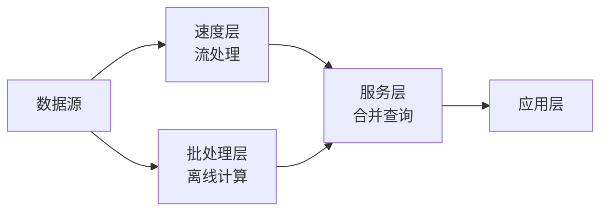

### Kappa 架构

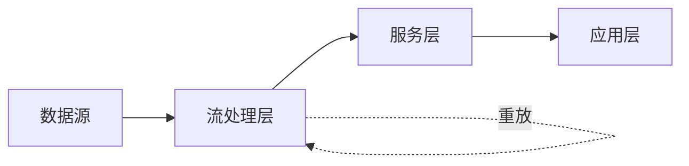

### 湖仓一体

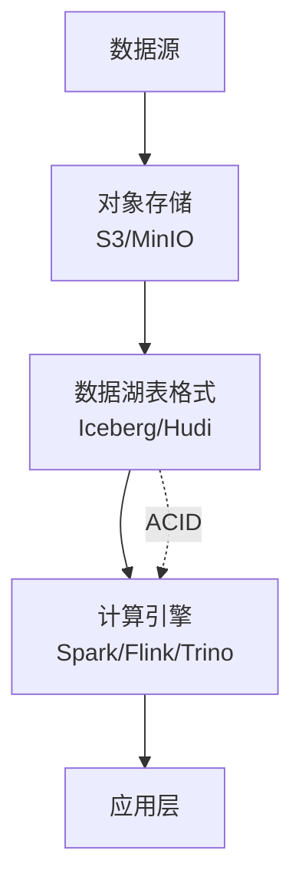

### 批流融合时序

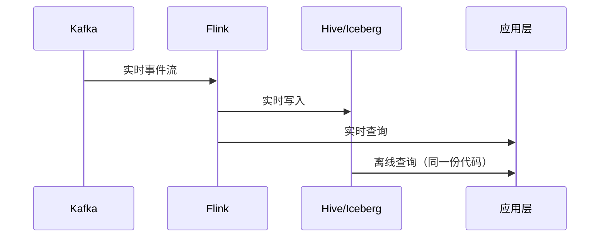
```

- [ ] **Step 14.3: 删除原 6 张 PNG**

```bash
git rm note/10.big-data/offline-or-real-time-data-warehouse/img.png \
       note/10.big-data/offline-or-real-time-data-warehouse/img_1.png \
       note/10.big-data/offline-or-real-time-data-warehouse/img_2.png \
       note/10.big-data/offline-or-real-time-data-warehouse/img_3.png \
       note/10.big-data/offline-or-real-time-data-warehouse/img_4.png \
       note/10.big-data/open-source/img.png
```

- [ ] **Step 14.4: 清理 17 个 placeholder（如还在原 open-source/README.md 中）**

由于 T6 已迁移 open-source/ 内容到 03-realtime-compute/，原 open-source/README.md 仍在但内容已索引化。删除原 open-source/ 整个目录（如已迁移完成）：

```bash
# 验证原 open-source/ 已无价值内容
ls note/10.big-data/open-source/
```

如果只剩 img.png（已删）+ README.md（73 行索引），删除整个目录：

```bash
git rm -r note/10.big-data/open-source/
```

如果还有 - [ ] 待完善 行未删除，Edit 工具逐一清理。

- [ ] **Step 14.5: 同样处理 offline-or-real-time-data-warehouse/**

```bash
ls note/10.big-data/offline-or-real-time-data-warehouse/
```

如只剩 5 张 PNG（已删）+ README.md（已被 T4 复制到 01-data-warehouse/，此处可删），删除整个目录：

```bash
git rm -r note/10.big-data/offline-or-real-time-data-warehouse/
```

- [ ] **Step 14.6: 验证最终状态**

```bash
echo "0 PNG: $(find note/10.big-data/ -name '*.png' -o -name '*.jpg' | wc -l)"
echo "0 TODO: $(grep -rE 'TODO|TBD|待完善' note/10.big-data/ | wc -l)"
echo "总 README 数: $(find note/10.big-data/ -name 'README.md' | wc -l)"
echo ""
echo "顶层 README: $(wc -l < note/10.big-data/README.md) 行"
echo "8 子模块 README:"
for d in 01-data-warehouse 02-hadoop-ecosystem 03-realtime-compute 04-data-lake 05-olap 06-scheduling 07-data-governance 08-sync-tools; do
  echo "  $d: $(wc -l < note/10.big-data/$d/README.md)"
done
```

Expected:
- 0 PNG
- 0 TODO
- 15 README 总数（1 顶层 + 8 子模块 + 6 新子 README，per spec §2）
- 顶层 370-400 行
- 8 子模块：
  - 01-data-warehouse（迁移）：70-85 行
  - 03-realtime-compute（迁移）：70-85 行
  - 02/04/05/06/07/08（6 新子 README）：各 200-300 行

- [ ] **Step 14.7: Commit**

```bash
git add note/10.big-data/01-data-warehouse/README.md
git add -u note/10.big-data/

git commit -m "feat(note): 10.big-data - replace 6 PNGs with mermaid + clean 17 placeholders (T14)

PNG replacements in 01-data-warehouse/:
- img.png → Lambda 架构 mermaid flowchart
- img_1.png → Kappa 架构 mermaid flowchart
- img_2.png → 湖仓一体 mermaid flowchart
- img_3.png → 批流融合 sequenceDiagram

Cleanup:
- Remove 5 PNGs from old offline-or-real-time-data-warehouse/
- Remove 1 PNG from old open-source/
- Remove old subdirs (content migrated to new locations in T4/T6)
- Verify 0 TODO/placeholder remaining

Final state: 15 READMEs (1 top + 8 modules + 6 deep sub-READMEs), 0 PNG, 0 TODO
(matches spec §2: 1+8+6=15).

Co-Authored-By: Claude Opus 4.8 <noreply@anthropic.com>"
```

---

## Self-Review Checklist

- [x] **Spec 覆盖**：spec 12 节全部对应（背景/动机/结构/顶层/子模块模板/6 新子/README/PNG/14 commits/约束/范围/验收/风险/差异）
- [x] **占位符**：每个 Step 的内容块都是给实现者的具体指令，非「TODO」
- [x] **类型/命名一致性**：
  - 8 个子模块命名：01-data-warehouse / 02-hadoop-ecosystem / 03-realtime-compute / 04-data-lake / 05-olap / 06-scheduling / 07-data-governance / 08-sync-tools
  - 链接风格一致：相对路径 `./xxx` 和 `../README.md#XX`
  - 顶层 11 节编号一致（1-11）
  - 子模块 7 节模板一致
  - 新子 README 9-13 节深读（每个 README 不同，但都从 ## 9 开始）
- [x] **范围**：仅动 10.big-data，不影响其他章节
- [x] **可执行性**：每 Step 有具体 Write/Edit/Bash 命令，无模糊表述
- [x] **验收门**：行数 + 占位符 + PNG + 链接 四类检查
- [x] **commit 颗粒度**：14 commits 符合 spec 4 阶段（3+9+1+1）