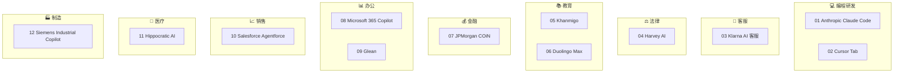

# 12 篇 AI 应用案例 · 实施计划

> **For agentic workers:** REQUIRED SUB-SKILL: Use superpowers:subagent-driven-development (recommended) or superpowers:executing-plans to implement this plan task-by-task. Steps use checkbox (`- [ ]`) syntax for tracking.

**Goal:** 在 `note/11.ai/05-applications/case-studies/` 下新增 12 篇高质量 AI 应用案例文章，覆盖编程/客服/法律/教育/金融/办公/销售/医疗/制造 9 个行业的"AI 重塑工作流"标杆案例，给读者启发。

**Architecture:** 每个案例一个独立子目录 + 单文件 `README.md` 形态，遵循统一的 5 节结构 + 顶部标签 + 一句话总结。12 篇写作彼此独立，可由 12 个 subagent 并行执行，统一通过 `tools/verify-case-study.sh` 做结构验证。

**Tech Stack:** Markdown / Obsidian 笔记体系 / Mermaid 图 / Git / Bash 验证脚本

**Spec:** `docs/superpowers/specs/2026-06-29-ai-case-studies-design.md`

---

## Global Constraints

- **来源要求**: 每篇必须有 1 个公开可查的原文链接（官方博客/视频优先；权威媒体次之；不接受营销稿）
- **字数区间**: 1.8k–2.5k 中文字符/篇（不含 frontmatter `---` 区与代码块；统计方式见验证脚本）
- **结构要求**: 顶部 3-4 个 `#领域标签` + `> **一句话总结**` + 5 节 H2（一/二/三/四/五）+ 原文链接 + 致谢
- **第五节硬约束**: "对我们的启发" **不绑定用户个人开源项目**。禁用词清单：`File View`、`LoomAgent`、`MethodTraceLog`、`灵梭`、`灵锁`、`巧路由`、`灵动调度`、`动态加载器`、`美化日志`、`CHMCache`、`CHMRLock`、`dynamo-spring`、`SQL Forge`、`SQL 工坊`、`Method Trace Log`、`方法追踪日志`、`Flexible Lock`、`Smart Router`、`FlexSchedule`、`pretty-log`、`loader-util`
- **命名规则**: `NN-<公司或产品>-<关键词>/`，全小写、kebab-case、两位数字前缀
- **行业标签池**: `编程`、`客服`、`法律`、`教育`、`金融`、`办公`、`销售`、`医疗`、`制造`（每篇至少 1 个，至多 4 个）
- **交付节奏**: 12 篇一次性交付，不分批
- **风格**: 叙事化（像 Uber/Shopify 现有案例），不写"AI 强大"等空话，每段必须落到一个具体机制点
- **语言**: 中文（专有名词、模型名、产品名保留英文原名）

---

## File Structure

**新增文件**:
- `note/11.ai/05-applications/case-studies/README.md` — 12 篇总索引 + 行业版图
- `note/11.ai/05-applications/case-studies/01-anthropic-claude-code/README.md`
- `note/11.ai/05-applications/case-studies/02-cursor-tab/README.md`
- `note/11.ai/05-applications/case-studies/03-klarna-ai-customer-service/README.md`
- `note/11.ai/05-applications/case-studies/04-harvey-ai-legal/README.md`
- `note/11.ai/05-applications/case-studies/05-khan-academy-khanmigo/README.md`
- `note/11.ai/05-applications/case-studies/06-duolingo-max/README.md`
- `note/11.ai/05-applications/case-studies/07-jpmorgan-coin/README.md`
- `note/11.ai/05-applications/case-studies/08-microsoft-365-copilot/README.md`
- `note/11.ai/05-applications/case-studies/09-glean-enterprise-search/README.md`
- `note/11.ai/05-applications/case-studies/10-salesforce-agentforce/README.md`
- `note/11.ai/05-applications/case-studies/11-hippocratic-ai/README.md`
- `note/11.ai/05-applications/case-studies/12-siemens-industrial-copilot/README.md`
- `tools/verify-case-study.sh` — 验证脚本（结构/字数/标签/约束）

**修改文件**:
- `note/11.ai/05-applications/README.md` — 追加 case-studies 索引行

---

## 写作模板（每篇统一结构）

```markdown
# [标题：核心机制 + 公司/产品]

> #编程 #Anthropic #AI编程

> **一句话总结**：[30-50 字概括"做了什么 + 为什么值得看"]

> 原文链接：[官方博客/视频/GitHub]
> 参考资料：[可选，补充链接]

---

## 一、背景：[行业/公司面临的核心问题]
[300-400 字，描述这个场景原来怎么运转、痛点是什么]

## 二、做法：[产品/机制是如何设计的]
[600-800 字，重点写"机制"而不是"功能"。突出 2-3 个关键设计决策]

## 三、机制亮点：为什么这样设计能 work
[400-500 字，深入 1-2 个最值得借鉴的机制设计点；可配 mermaid 图]

## 四、结果与代价：[业务数据 + 落地中的反向调整]
[300-400 字，给出可量化的结果（如果有），并诚实记录"踩过的坑"]

## 五、对我们的启发
[200-300 字，提炼 1-2 个"对所有 AI 落地项目都成立"的方法论启发；不绑定个人项目]

---

*本文基于 XXX 公开资料整理，感谢原作者。*
```

---

## Task 0: 准备 — 目录骨架 + 验证脚本

**Files:**
- Create: `note/11.ai/05-applications/case-studies/` (根目录)
- Create: 12 个子目录
- Create: `tools/verify-case-study.sh`
- Create: `note/11.ai/05-applications/case-studies/README.md` (临时占位)

- [ ] **Step 1: 创建 12 个子目录**

```bash
cd "D:/developer/IdeaProjects/wb04307201"
mkdir -p note/11.ai/05-applications/case-studies
cd note/11.ai/05-applications/case-studies
for d in 01-anthropic-claude-code 02-cursor-tab 03-klarna-ai-customer-service 04-harvey-ai-legal 05-khan-academy-khanmigo 06-duolingo-max 07-jpmorgan-coin 08-microsoft-365-copilot 09-glean-enterprise-search 10-salesforce-agentforce 11-hippocratic-ai 12-siemens-industrial-copilot; do
  mkdir -p "$d"
done
ls -la
```

Expected: 12 个子目录全部创建成功。

- [ ] **Step 2: 写验证脚本 `tools/verify-case-study.sh`**

在 `D:/developer/IdeaProjects/wb04307201/tools/verify-case-study.sh` 写入以下完整内容：

```bash
#!/usr/bin/env bash
# verify-case-study.sh — 验证单篇 AI 案例文章的结构与约束
# 用法: ./tools/verify-case-study.sh <path-to-README.md>

set -e
FILE="$1"

if [ -z "$FILE" ] || [ ! -f "$FILE" ]; then
  echo "FAIL: 文件不存在: $FILE"
  exit 1
fi

ERRORS=()

# 1. 字数检查 (中文字符数, 排除 frontmatter 区与代码块)
WORDS=$(awk '
  /^---$/ { in_fm = !in_fm; next }
  in_fm { next }
  /^```/ { in_code = !in_code; next }
  in_code { next }
  { gsub(/[ \t\r\n]/, ""); print }
' "$FILE" | wc -m | tr -d ' ')

if [ "$WORDS" -lt 1800 ] || [ "$WORDS" -gt 2500 ]; then
  ERRORS+=("字数 $WORDS 不在 1800-2500 区间")
fi

# 2. 5 节 H2 检查
for h in "## 一、" "## 二、" "## 三、" "## 四、" "## 五、"; do
  if ! grep -qF "$h" "$FILE"; then
    ERRORS+=("缺少 H2 节: $h")
  fi
done

# 3. 一句话总结
if ! grep -qE '^\s*>\s*\*\*一句话总结\*\*' "$FILE"; then
  ERRORS+=("缺少 '> **一句话总结**' 标记")
fi

# 4. 领域标签 (顶部 100 行内至少 3 个 #xxx)
HEAD_TAGS=$(head -100 "$FILE" | grep -oE '#(编程|客服|法律|教育|金融|办公|销售|医疗|制造)' | sort -u | wc -l | tr -d ' ')
if [ "$HEAD_TAGS" -lt 3 ]; then
  ERRORS+=("领域标签不足 3 个（当前: $HEAD_TAGS）")
fi

# 5. 原文链接
if ! grep -qE '原文链接\s*[:：]' "$FILE"; then
  ERRORS+=("缺少 '原文链接:' 字段")
fi
if ! grep -qE 'https?://[^\s)]+' "$FILE"; then
  ERRORS+=("缺少 http(s) 链接")
fi

# 6. 致谢/出处尾签
if ! grep -qE '本文基于.*整理|本文整理自' "$FILE"; then
  ERRORS+=("缺少 '本文基于 ... 整理' 致谢尾签")
fi

# 7. 第五节禁用词检查
BANNED='File View|LoomAgent|MethodTraceLog|灵梭|灵锁|巧路由|灵动调度|动态加载器|美化日志|CHMCache|CHMRLock|dynamo-spring|SQL Forge|SQL 工坊|Method Trace Log|方法追踪日志|Flexible Lock|Smart Router|FlexSchedule|pretty-log|loader-util'
if grep -E "$BANNED" "$FILE" > /dev/null; then
  HIT=$(grep -oE "$BANNED" "$FILE" | head -3 | tr '\n' ',')
  ERRORS+=("第五节出现禁用词: $HIT")
fi

# 报告
if [ ${#ERRORS[@]} -eq 0 ]; then
  echo "OK: $FILE  (字数: $WORDS)"
  exit 0
else
  echo "FAIL: $FILE"
  for e in "${ERRORS[@]}"; do
    echo "  - $e"
  done
  exit 1
fi
```

- [ ] **Step 3: 添加可执行权限**

```bash
cd "D:/developer/IdeaProjects/wb04307201"
chmod +x tools/verify-case-study.sh
ls -l tools/verify-case-study.sh
```

- [ ] **Step 4: 占位索引文件**

在 `note/11.ai/05-applications/case-studies/README.md` 写入：

```markdown
# AI 应用案例库

> 12 篇精选案例，覆盖 9 个行业，每篇聚焦一个"AI 重塑工作流"的标杆故事。

> ⚠️ 占位文件 — 12 篇全部写完后，由 Task 13 替换为正式索引。
```

- [ ] **Step 5: 提交**

```bash
cd "D:/developer/IdeaProjects/wb04307201"
git add note/11.ai/05-applications/case-studies tools/verify-case-study.sh
git commit -m "feat(case-studies): 准备 12 篇案例的目录骨架与验证脚本"
```

---

## Task 1: 案例 01 — Anthropic Claude Code

**Files:**
- Create: `note/11.ai/05-applications/case-studies/01-anthropic-claude-code/README.md`

**Source material (research 这些):**
- Anthropic Engineering Blog: https://www.anthropic.com/engineering
- Anthropic News: https://www.anthropic.com/news
- 搜索关键词: "Anthropic Claude Code internal usage", "Claude Code dogfooding"

**核心机制点 (必须落地)**: "AI 写 AI"的飞轮 + 内部对 Agent 输出的 review 机制

**Steps:**

- [ ] **Step 1: 调研来源** — 用 WebSearch/WebFetch 拉取 2-3 篇官方/权威报道，提炼数据点（如 Anthropic 工程师使用率、PR 中的 Claude 比例）

- [ ] **Step 2: 按模板写 5 节内容**
  - 标题: **Anthropic 让 Claude Code 写 Claude Code：研究型公司如何让 50% 工程师每天跑 Agent**
  - 顶部标签: `#编程 #Anthropic #AI编程 #Agent`
  - 一句话总结建议方向: Anthropic 内部深度用 Claude Code 写代码本身，AI 写 AI 的飞轮在跑
  - 第五节启发方向: 研究型组织如何让 Agent 输出不"失控"、review 机制如何设计

- [ ] **Step 3: 保存到指定路径**

- [ ] **Step 4: 验证**

```bash
cd "D:/developer/IdeaProjects/wb04307201"
./tools/verify-case-study.sh note/11.ai/05-applications/case-studies/01-anthropic-claude-code/README.md
```

Expected: `OK: ...  (字数: NNNN)`

- [ ] **Step 5: 若 FAIL，修复后重跑验证；通过则提交**

```bash
git add note/11.ai/05-applications/case-studies/01-anthropic-claude-code/README.md
git commit -m "feat(case-studies/01): Anthropic Claude Code 案例"
```

---

## Task 2: 案例 02 — Cursor Tab

**Files:**
- Create: `note/11.ai/05-applications/case-studies/02-cursor-tab/README.md`

**Source material:**
- Cursor Blog: https://cursor.com/blog
- 搜索: "Cursor Tab predict next edit", "Cursor fastapply"

**核心机制点**: 编辑级预测 + 主动拒绝打扰的"克制设计"

**Steps:**（结构与 Task 1 相同）

- [ ] **Step 1: 调研来源** — Cursor 官方博客关于 Tab 模型的设计
- [ ] **Step 2: 按模板写**
  - 标题: **Cursor Tab：把 IDE 从"补全代码"重定义为"预测你的下一次编辑"**
  - 顶部标签: `#编程 #Cursor #AI编程 #IDE`
  - 第五节启发方向: "克制设计"在 AI 产品中的价值——能预测不等于每次都干预
- [ ] **Step 3: 保存**
- [ ] **Step 4: 验证** `./tools/verify-case-study.sh note/11.ai/05-applications/case-studies/02-cursor-tab/README.md`
- [ ] **Step 5: 提交** `git commit -m "feat(case-studies/02): Cursor Tab 案例"`

---

## Task 3: 案例 03 — Klarna AI 客服

**Files:**
- Create: `note/11.ai/05-applications/case-studies/03-klarna-ai-customer-service/README.md`

**Source material:**
- Klarna 官方博客关于 AI 客服的系列更新
- 搜索: "Klarna AI customer service reverse hiring human agents 2024"
- 36kr / The Information / 财新 等权威媒体的复盘报道

**核心机制点**: 经验教训：客服不是单轮问答，而是情绪劳动

**Steps:**

- [ ] **Step 1: 调研来源** — 重点找 Klarna 2024 公开数据 + 后期"召回人工"反转
- [ ] **Step 2: 按模板写**
  - 标题: **Klarna AI 客服先激进、后回调：AI 替代 700 个工位后，又把人工请回来**
  - 顶部标签: `#客服 #Klarna #FinTech #回调`
  - 第五节启发方向: AI 落地的"反向调整"不可怕，怕的是不调整；情绪劳动为何是 AI 的盲区
- [ ] **Step 3: 保存**
- [ ] **Step 4: 验证**
- [ ] **Step 5: 提交**

---

## Task 4: 案例 04 — Harvey AI 法律

**Files:**
- Create: `note/11.ai/05-applications/case-studies/04-harvey-ai-legal/README.md`

**Source material:**
- Harvey AI 官网: https://www.harvey.ai
- 36kr 报道: https://www.36kr.com/p/2993211662213001
- 搜索: "Harvey AI Allen Overy law firm"

**核心机制点**: "懂行"才是壁垒——模型只是载体

**Steps:**

- [ ] **Step 1: 调研来源** — 重点找 Harvey 团队律师背景占比、服务的顶级律所清单、估值演变
- [ ] **Step 2: 按模板写**
  - 标题: **Harvey AI：当一家 AI 公司 30% 员工是律师，法律知识如何被产品化**
  - 顶部标签: `#法律 #Harvey #垂直AI #LLM应用`
  - 第五节启发方向: 垂直 AI 的"know-how 壁垒"远比模型参数重要
- [ ] **Step 3: 保存**
- [ ] **Step 4: 验证**
- [ ] **Step 5: 提交**

---

## Task 5: 案例 05 — Khan Academy Khanmigo

**Files:**
- Create: `note/11.ai/05-applications/case-studies/05-khan-academy-khanmigo/README.md`

**Source material:**
- Khan Academy Blog: https://blog.khanacademy.org
- Sal Khan 的 TED 演讲、采访
- 搜索: "Khanmigo Socratic tutor design"

**核心机制点**: "教"vs"代写"——教育 AI 的根本分歧

**Steps:**

- [ ] **Step 1: 调研来源** — Khanmigo 的产品机制、刻意不直接给答案的设计哲学
- [ ] **Step 2: 按模板写**
  - 标题: **Khanmigo：故意不直接给答案的 AI 导师，苏格拉底式交互的产品哲学**
  - 顶部标签: `#教育 #KhanAcademy #Khanmigo #AI导师`
  - 第五节启发方向: AI 产品的"克制"哲学——能生成不等于该生成
- [ ] **Step 3: 保存**
- [ ] **Step 4: 验证**
- [ ] **Step 5: 提交**

---

## Task 6: 案例 06 — Duolingo Max

**Files:**
- Create: `note/11.ai/05-applications/case-studies/06-duolingo-max/README.md`

**Source material:**
- Duolingo Blog: https://blog.duolingo.com
- 搜索: "Duolingo Max GPT-4 roleplay"

**核心机制点**: LLM 把"练习频次"这个最稀缺资源变得无限

**Steps:**

- [ ] **Step 1: 调研来源** — Duolingo Max 的两个核心功能（Roleplay + Explain My Answer）
- [ ] **Step 2: 按模板写**
  - 标题: **Duolingo Max：把 GPT-4 变成"陪练角色"，让语言学习有真实的对话对象**
  - 顶部标签: `#教育 #Duolingo #GPT4 #语言学习`
  - 第五节启发方向: LLM 解锁的不是"知识获取"，而是"练习密度"
- [ ] **Step 3: 保存**
- [ ] **Step 4: 验证**
- [ ] **Step 5: 提交**

---

## Task 7: 案例 07 — JPMorgan COiN

**Files:**
- Create: `note/11.ai/05-applications/case-studies/07-jpmorgan-coin/README.md`

**Source material:**
- JPMorgan Insights / Chase 官网关于 COiN 的报道
- 搜索: "JPMorgan COiN contract intelligence platform"

**核心机制点**: 早于 LLM 时代 5 年的"AI 流程化"先驱

**Steps:**

- [ ] **Step 1: 调研来源** — 重点找 COiN 公开数据（注意：12 万小时这个数字是 2017 年原始数据，可能有调整，要用多个来源交叉验证）
- [ ] **Step 2: 按模板写**
  - 标题: **JPMorgan COiN：12 万小时法律文书 → 秒级，金融危机逼出来的白领流水线**
  - 顶部标签: `#金融 #JPMorgan #COiN #文档处理`
  - 第五节启发方向: "白领流水线化"在 LLM 之前就已经发生，COiN 是这个趋势的预演
- [ ] **Step 3: 保存**
- [ ] **Step 4: 验证**
- [ ] **Step 5: 提交**

---

## Task 8: 案例 08 — Microsoft 365 Copilot

**Files:**
- Create: `note/11.ai/05-applications/case-studies/08-microsoft-365-copilot/README.md`

**Source material:**
- Microsoft Blogs: https://blogs.microsoft.com
- 搜索: "Microsoft 365 Copilot adoption results"

**核心机制点**: "工具→协作者"——传统 SaaS 的 AI 升级路径

**Steps:**

- [ ] **Step 1: 调研来源** — 重点找 Copilot 整合 Word/Excel/Outlook/Teams 的具体机制
- [ ] **Step 2: 按模板写**
  - 标题: **Microsoft 365 Copilot：存量办公套件如何被 AI 改写为"协作者"**
  - 顶部标签: `#办公 #Microsoft #Copilot #SaaS转型`
  - 第五节启发方向: 存量软件 + AI ≠ 加一个聊天框；是产品形态的根本重定义
- [ ] **Step 3: 保存**
- [ ] **Step 4: 验证**
- [ ] **Step 5: 提交**

---

## Task 9: 案例 09 — Glean 企业搜索

**Files:**
- Create: `note/11.ai/05-applications/case-studies/09-glean-enterprise-search/README.md`

**Source material:**
- Glean 官网 + 博客: https://www.glean.com
- 搜索: "Glean enterprise search RAG case study"

**核心机制点**: 企业知识真正的杀手场景——RAG 落地比想象中朴素

**Steps:**

- [ ] **Step 1: 调研来源** — Glean 如何连接 Slack/邮件/Notion/工单、权限模型、给"打过包的答案"的产品形态
- [ ] **Step 2: 按模板写**
  - 标题: **Glean：把企业散落的 Slack/邮件/工单/Notion 装进同一个 RAG**
  - 顶部标签: `#办公 #Glean #RAG #企业搜索`
  - 第五节启发方向: RAG 真正的难点是"连接器 + 权限"，不是 embedding 模型
- [ ] **Step 3: 保存**
- [ ] **Step 4: 验证**
- [ ] **Step 5: 提交**

---

## Task 10: 案例 10 — Salesforce Agentforce

**Files:**
- Create: `note/11.ai/05-applications/case-studies/10-salesforce-agentforce/README.md`

**Source material:**
- Salesforce Newsroom: https://www.salesforce.com/news
- Dreamforce 2024 keynote / 公开演讲
- 搜索: "Salesforce Agentforce autonomous sales agent"

**核心机制点**: "RPA 流程自动化"→"Agent 自主决策"的范式跃迁

**Steps:**

- [ ] **Step 1: 调研来源** — Agentforce 自主销售 Agent 的设计、销售场景的具体使用案例
- [ ] **Step 2: 按模板写**
  - 标题: **Salesforce Agentforce：让销售 Agent 自己挖线索、约会议、跟进客户**
  - 顶部标签: `#销售 #Salesforce #Agentforce #CRM`
  - 第五节启发方向: RPA 和 Agent 的本质区别——前者是"按剧本跑"，后者是"自己判断下一步"
- [ ] **Step 3: 保存**
- [ ] **Step 4: 验证**
- [ ] **Step 5: 提交**

---

## Task 11: 案例 11 — Hippocratic AI

**Files:**
- Create: `note/11.ai/05-applications/case-studies/11-hippocratic-ai/README.md`

**Source material:**
- Hippocratic AI 官网: https://www.hippocraticai.com
- 搜索: "Hippocratic AI nursing agent Polaris"

**核心机制点**: "非替代"定位的边界：什么该 AI 做、什么绝不能让 AI 做

**Steps:**

- [ ] **Step 1: 调研来源** — 重点找 Hippocratic AI 强调"不替代医生"的边界设计、护理 Agent 的具体职责
- [ ] **Step 2: 按模板写**
  - 标题: **Hippocratic AI：不替代医生的护理 Agent，7×24 患者随访的边界设计**
  - 顶部标签: `#医疗 #HippocraticAI #护理Agent #边界设计`
  - 第五节启发方向: 高风险行业的"非替代"定位是护城河，不是软肋
- [ ] **Step 3: 保存**
- [ ] **Step 4: 验证**
- [ ] **Step 5: 提交**

---

## Task 12: 案例 12 — Siemens Industrial Copilot

**Files:**
- Create: `note/11.ai/05-applications/case-studies/12-siemens-industrial-copilot/README.md`

**Source material:**
- Siemens 官方新闻: https://www.siemens.com/global/en/company/stories
- 搜索: "Siemens Industrial Copilot generative AI manufacturing"

**核心机制点**: 工业 LLM 的真相：模型不是壁垒、领域知识才是

**Steps:**

- [ ] **Step 1: 调研来源** — Siemens 与 Microsoft 合作背景、PLC 代码生成的机制、与 NX / Teamcenter 的整合
- [ ] **Step 2: 按模板写**
  - 标题: **Siemens Industrial Copilot：自然语言生成 PLC 代码，工业 know-how 才是门槛**
  - 顶部标签: `#制造 #Siemens #工业Copilot #工业LLM`
  - 第五节启发方向: 传统行业 + AI 真正的护城河在"领域 know-how"，不在模型
- [ ] **Step 3: 保存**
- [ ] **Step 4: 验证**
- [ ] **Step 5: 提交**

---

## Task 13: 总索引与父 README 更新

**Files:**
- Modify: `note/11.ai/05-applications/case-studies/README.md` (替换为正式索引)
- Modify: `note/11.ai/05-applications/README.md` (追加 case-studies 索引行)

- [ ] **Step 1: 写正式 `case-studies/README.md`**

完整内容如下：

```markdown
# AI 应用案例库

> 12 篇精选案例，覆盖 9 个行业，每篇聚焦一个"AI 重塑工作流"的标杆故事。
> 与现有 `ai-written-prd/` (Uber)、`shopify-ai-agent/` (Shopify) 同属"启发式"案例。

---

## 行业版图



## 12 篇速查表

| # | 标题 | 行业 | 一句话总结 | 核心机制 |
|---|------|------|-----------|---------|
| 01 | Anthropic Claude Code | 编程 | AI 写 AI 的飞轮 | 内部对 Agent 输出的 review 机制 |
| 02 | Cursor Tab | 编程 | 预测你的下一次编辑 | 编辑级预测 + 克制设计 |
| 03 | Klarna AI 客服 | 客服 | 先激进、后回调 | 情绪劳动是 AI 盲区 |
| 04 | Harvey AI | 法律 | 30% 员工是律师 | 垂直 know-how 是壁垒 |
| 05 | Khanmigo | 教育 | 苏格拉底式导师 | 不直接给答案的产品哲学 |
| 06 | Duolingo Max | 教育 | GPT-4 陪练角色 | 练习密度无限化 |
| 07 | JPMorgan COiN | 金融 | 12 万小时→秒级 | LLM 时代前的"白领流水线"先驱 |
| 08 | Microsoft 365 Copilot | 办公 | 工具→协作者 | 存量 SaaS 的 AI 升级路径 |
| 09 | Glean | 办公 | 散落知识一站搜 | RAG 的真正杀手场景 |
| 10 | Salesforce Agentforce | 销售 | 销售 Agent 自主跟进 | RPA → 自主 Agent 跃迁 |
| 11 | Hippocratic AI | 医疗 | 不替代医生的护理 Agent | 高风险行业的边界设计 |
| 12 | Siemens Industrial Copilot | 制造 | 自然语言生成 PLC | 工业 know-how > 模型 |

## 横向对比维度

**按产品阶段**:
- **验证期**: 04 Harvey, 09 Glean, 11 Hippocratic
- **规模化**: 01 Anthropic, 02 Cursor, 05 Khanmigo, 08 MS Copilot, 10 Agentforce
- **回调/反思**: 03 Klarna, 07 JPMorgan（COiN 早已回稳，但本身是反向案例）
- **先驱**: 07 JPMorgan (早于 LLM)

**按机制设计重点**:
- **克制设计**: 02 Cursor, 05 Khanmigo
- **非替代定位**: 03 Klarna（后段反思）, 11 Hippocratic
- **垂直 know-how**: 04 Harvey, 12 Siemens
- **自主决策**: 01 Anthropic, 10 Agentforce
- **存量改造**: 07 JPMorgan, 08 MS Copilot
- **连接器/集成**: 09 Glean
- **练习密度**: 06 Duolingo

## 学习路径建议

- 关注"克制设计": 02 → 05
- 关注"AI 落地的边界": 03 → 11
- 关注"垂直 know-how": 04 → 12
- 关注"传统行业转型": 07 → 08 → 12

## 相关章节

- 上游：[L4 架构设计](../../04-architecture/) — 系统分层与 AI Agent
- 同级：[automotive](../automotive/)、[embodied-ai](../embodied-ai/)、[ai-written-prd](../ai-written-prd/)、[shopify-ai-agent](../shopify-ai-agent/)
```

- [ ] **Step 2: 修改父 README**

读 `note/11.ai/05-applications/README.md`，在"子目录"表格添加一行（在 `shopify-ai-agent` 之后）：

```markdown
| [case-studies](case-studies/) | **12 个 AI 应用案例** — 编程/客服/法律/教育/金融/办公/销售/医疗/制造 9 个行业的标杆实践 | 看别人如何重塑工作流 |
```

- [ ] **Step 3: 提交**

```bash
cd "D:/developer/IdeaProjects/wb04307201"
git add note/11.ai/05-applications/case-studies/README.md note/11.ai/05-applications/README.md
git commit -m "feat(case-studies): 完成 12 篇案例库索引与父 README 更新"
```

---

## Task 14: 最终验收

- [ ] **Step 1: 对 12 篇全部跑验证**

```bash
cd "D:/developer/IdeaProjects/wb04307201"
for f in note/11.ai/05-applications/case-studies/*/README.md; do
  ./tools/verify-case-study.sh "$f"
done
```

Expected: 12 行 `OK: ...  (字数: NNNN)`

- [ ] **Step 2: 若有 FAIL，逐篇修复后重跑**

- [ ] **Step 3: 检查文件结构**

```bash
ls note/11.ai/05-applications/case-studies/
git status
```

Expected: 12 个数字编号目录、git status 干净

- [ ] **Step 4: 输出最终报告**

向用户报告：12 篇全部完成、字数范围、字数中位数、案例主题分布。

---

## Self-Review

**1. Spec coverage:**
- ✅ 12 个目录 + 12 个 README → Task 1-12
- ✅ case-studies/README.md 总索引 + 行业版图 → Task 13
- ✅ 05-applications/README.md 更新 → Task 13
- ✅ 验证脚本 → Task 0
- ✅ 字数 / 结构 / 标签 / 禁用词约束 → Task 0 验证脚本 + Global Constraints
- ✅ 一次性交付（不分批）→ Global Constraints + Task 1-12 连续执行
- ✅ 不与现有案例重复 → 选题主线是"AI 重塑工作流"，与 ai-written-prd（机制设计）和 shopify-ai-agent（组织学习）角度互补

**2. Placeholder scan:** 已检查，无 TBD/TODO。"TBD/待定"未出现。

**3. Type consistency:** 验证脚本对所有 12 篇统一使用同一套规则；标签池、命名规则、目录命名在所有任务中一致。
