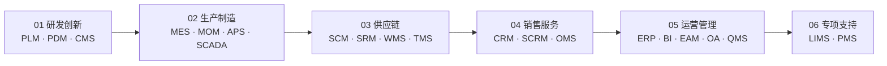

# 业务应用系统(note/08.application-systems)重组设计 spec

> 日期：2026-06-24
> 范围：把 `note/09.other/common-systems/` 提升为 `note/08.application-systems/` 一级目录，并大改内容（按业务价值链重排，详略分明，覆盖全部 20 个常见业务系统）
> 目标：让业务/产品/需求人员通过一份 README 快速建立完整的业务系统认知地图，并具备日常速查能力

---

## 1. 背景与动机

### 1.1 现状

`note/09.other/common-systems/` 是仓库内**唯一没有顶层 README 质量**、**没有知识地图**、**没有学习路线**的"百科式"内容块，仅包含一个 README + erp/ + pdm/ + 2 张 png：

| 内容 | 字节级评估 |
|---|---|
| `README.md` (10 KB) | 20 个系统名词表（4 列：缩写/全称/功能/优势）+ ERP↔其他系统关系表（11 列含"响应时间"等无关字段） |
| `erp/README.md` (62 B) | 仅有标题，正文未填充，仅作占位 |
| `erp/img.png` (246 KB) / `img_1.png` (358 KB) | 未在 README 引用 |
| `pdm/README.md` (4.5 KB) | 实质性内容，含 PDM 定义/与 PLM 关系/技术架构图 |
| `pdm/img.png` (258 KB) | 业务流程图 |

### 1.2 问题清单

1. **结构层面**
   - 09.other 本身是"杂项"目录，但 common-systems 是有体系的内容
   - 没有顶层 README 整合的"知识地图 + 学习路线"导航
   - 子目录 erp/、pdm/ 与主 README 关系不清（erp/ 几乎是空壳）

2. **内容层面**
   - 系统名词表过于简略（仅 4 列），缺：适用场景、上下游关系、关键考量
   - 系统间关系表 11 列冗余（含"响应时间"、"用户角色"与"集成关系"主线无关）
   - 业务视角缺失：所有内容均按字母/缩写组织，业务人员按"我们公司有 XX 系统"来问时找不到入口
   - 集成内容缺失：仅有 ERP↔其他 的零散关系，无"集成方式/集成模式/关键场景"系统讲解
   - 学习路径缺失：新人不知道从哪里开始

3. **位置层面**
   - 09.other 名不副实（其他 12 个一级目录都分类明确）
   - 与 04.system-design（技术架构视角）主题错位，混在一起会破坏分类清晰度

### 1.3 已有 git 状态

`note/09.other/hadoop/`、`note/09.other/nocode/*` 已被标记为 D（删除），等待 commit。实施时需先 `git commit` 这批删除，再操作 09.other。

---

## 2. 设计目标

1. **位置升级**：从 `09.other/common-systems/` 提升为 `08.application-systems/` 一级目录，与 01.java / 04.system-design / 10.big-data 平级
2. **业务视角**：内容按"业务价值链"组织（研产供销服），便于业务/产品/需求人员按业务问题查找
3. **覆盖完整**：20 个常见业务系统全部覆盖，详略分明（核心 5-6 个系统深入，其他系统简述）
4. **结构对齐**：与 04.system-design/README.md 的"快速入口 + 知识地图 + 学习路线 + 模块导航"风格一致
5. **内容整合**：原 erp/ 和 pdm/ 子目录内容合并入主 README，不保留子目录
6. **图规范**：所有图使用 mermaid（不引用任何 png），保证可读性与可维护性
7. **零内容损失**：现有 README 中"系统名词表"和"系统间关系表"作为速查表和集成章节的素材，不丢信息
8. **删除 09.other**：迁移完成后 09.other 目录无内容，一并删除

---

## 3. 价值链章节划分

按"研产供销服"业务价值链分 6 章，覆盖全部 20 个系统：

| 价值链章节 | 包含系统 | 详略 | 说明 |
|----------|---------|------|------|
| **01 研发创新** | PLM、PDM、CMS | PLM/PDM 详、CMS 略 | PDM 是 PLM 的子集，章节内说明二者关系 |
| **02 生产制造** | MES、MOM、APS、SCADA | MES 详、MOM/APS/SCADA 略 | MOM 是 MES 的上位概念，开篇说明 |
| **03 供应链** | SCM、SRM、WMS、TMS | WMS 详、SCM/SRM/TMS 略 | 物流（WMS+TMS）和计划（SCM+SRM）小节内分组 |
| **04 销售服务** | CRM、SCRM、OMS | CRM 详、SCRM/OMS 略 | 三者作为"客户接触面"一起讲 |
| **05 运营管理** | ERP、BI、EAM、OA、QMS | ERP 详（合并原 erp/ 内容）、BI 略、EAM/OA/QMS 略 | ERP 是核心 |
| **06 专项支持** | LIMS、PMS | 两者均略 | 实验室/项目管理，跨场景补充 |

**详的标准**：定义 + 核心能力（3-5 条）+ 适用场景（2-3 条）+ 与上下游系统的关系 + 关键考量
**略的标准**：定义（1-2 句）+ 能力描述（1-2 行）+ 适用场景（1 行）

---

## 4. 章节内部统一格式

每个价值链章节用统一结构：

```
### 0X 章节名

> 一句话概括：本章关注"业务价值链哪一段"阶段所需的能力与系统

#### 📌 全景图
（mermaid 图：本章系统与上下游价值链章节的连接关系）

#### 🔑 核心系统详讲
##### 系统名（缩写 全称）
- **定义**：（1-2 句）
- **核心能力**：（3-5 个 bullet）
- **典型场景**：（2-3 个 bullet）
- **上下游关系**：（接哪个系统的什么数据/事件）
- **关键考量**：（1-2 个 bullet，如选型/实施/数据治理要点）

#### 📋 其他系统速览
##### 系统名
（1 段定义 + 1 行能力 + 1 行场景，共 3-5 行）

#### 💡 本章小结
（一段话总结本章关键 takeaway + 与下一章的衔接）
```

---

## 5. 辅助章节设计

### 5.1 🚀 快速入口（README 开头）

三类读者的快速入口（3 分钟读懂全貌）：

```
| 你是谁 | 看什么 |
|---|---|
| 完全没接触过业务系统 | 价值链全景图 + 学习路线"入门"段（5 分钟） |
| 已经听说过某系统 | 速查表查到该系统所在价值链章节 |
| 想理解系统间关系 | 跳到集成模式章节 |
```

### 5.2 🗺️ 业务价值链全景图（README 开头）

mermaid flowchart，展示 6 个价值链章节的顺序 + 每个章节下的核心系统：



### 5.3 🔌 系统集成模式（独立章节）

```
#### 集成方式（"怎么连"）
- API/REST：现代主流，实时性高、数据量小
- 消息队列：异步、解耦、削峰（Kafka/RabbitMQ）
- 中间件/ESB：传统企业集成（IBM/MuleSoft/自研）
- 文件交换/EDI：跨企业、跨行业（供应链常见）
- 数据库直连：应急/过渡，不推荐生产

#### 集成模式（"怎么组织"）
- 点对点：简单但难维护
- ESB 总线：传统企业主流
- 事件驱动：现代微服务/云原生
- 主数据管理（MDM）：先治理数据再集成

#### 关键集成场景
- 订单主链：CRM → OMS → ERP → WMS → TMS → 客户
- 供应链主链：SRM → SCM → ERP → MES → WMS
- 数据主链：PLM(BOM) → ERP(MRP) → MES(工单) → BI
```

### 5.4 📋 系统速查表（独立章节）

20 个系统按缩写字母排序，每行 4 列：

| 缩写 | 全称 | 一句话定位 | 价值链章节 |
|---|---|---|---|
| APS | Advanced Planning and Scheduling | 高级计划与排程 | 02 生产制造 |
| BI | Business Intelligence | 商业智能/数据分析 | 05 运营管理 |
| CMS | Content Management System | 内容管理 | 01 研发创新 |
| CRM | Customer Relationship Management | 客户关系管理 | 04 销售服务 |
| ... | ... | ... | ... |

### 5.5 🛤️ 学习路线（README 结尾）

```
### 入门（1-2 天）
1. 价值链全景图
2. ERP 章节（最核心、最容易遇到）
3. CRM 章节（最常见的需求来源）

### 进阶（3-5 天）
4. MES / PLM / WMS 三大生产/研产/物流核心
5. 集成模式章节
6. 系统速查表（日常查询）

### 高级（专项深入）
7. MOM/SCADA：智能制造
8. SRM/APS：供应链优化
9. BI：数据驱动决策
```

---

## 6. 文件组织

```
note/
├── 04.system-design/   (不变)
├── 05.tools/
├── 06.spring/
├── 07.workflow/
├── 08.application-systems/    ← 新建（搬迁目标）
│   └── README.md              ← 唯一文件（合并原 erp/、pdm/、common-systems/README.md）
├── 09.other/                  ← 搬迁后删除
├── 10.big-data/
└── ...
```

- **不保留 erp/ 和 pdm/ 子目录**
- 整个 08.application-systems/ 下只有 `README.md` 一个文件
- 不使用任何图片（全部 mermaid）

---

## 7. 实施步骤

```
1. 提交 09.other 中 D 状态的旧目录
   git add -A note/09.other
   git commit -m "cleanup: remove obsolete 09.other subdirs (hadoop, nocode)"

2. 创建新目录
   mkdir note/08.application-systems

3. 写新 README.md（按上述设计）
   - 复用现有 common-systems/README.md 的 20 个系统名词表作为速查表素材
   - 复用现有 pdm/README.md 的内容作为 PLM/PDM 详讲的素材
   - 全部用 mermaid 画图，不用原 png

4. 删除旧目录
   rm -rf note/09.other/common-systems
   rmdir note/09.other

5. 更新 note/README.md
   在目录索引里加 08.application-systems 章节链接和一行简介

6. git commit
   git add note/08.application-systems note/09.other note/README.md
   git commit -m "feat: promote common-systems to 08.application-systems with value-chain organization"
```

---

## 8. 篇幅估算

| 章节 | 行数估算 |
|---|---|
| 快速入口 + 全景图 | ~50 |
| 价值链 6 章 × ~150 行 | ~900 |
| 集成模式章节 | ~80 |
| 速查表 | ~30 |
| 学习路线 | ~50 |
| **总计** | **~1100 行** |

与 `04.system-design/README.md` 当前体量相当。

---

## 9. 不在本 spec 范围

- **不引入选型/厂商对比章节**（用户明确未选，避免超范围）
- **不引入二级子目录**（如 MES/、CRM/），所有内容扁平在 README
- **不改其他一级目录的内容**（只更新 note/README.md 索引加一行）
- **不动 png 图片资产**（新 README 不引用，但原 png 随 common-systems 删除）
- **不引入 mermaid 之外的可视化**（如 d3、SVG）

---

## 10. 验收标准

1. 新 `note/08.application-systems/README.md` 存在，内容完整覆盖 20 个系统
2. `note/09.other/` 目录已删除
3. `note/README.md` 索引已加 08.application-systems 链接
4. `note/08.application-systems/` 下只有 README.md 一个文件，无 erp/、pdm/ 子目录
5. 所有图都是 mermaid，无 png 引用
6. git commit 信息规范，无残留 D 状态
7. 6 个价值链章节齐全，详略符合本 spec 第 3 节定义
8. 集成模式章节覆盖"方式/模式/场景"三层
9. 速查表按字母排序，4 列齐全
10. 学习路线分入门/进阶/高级三段