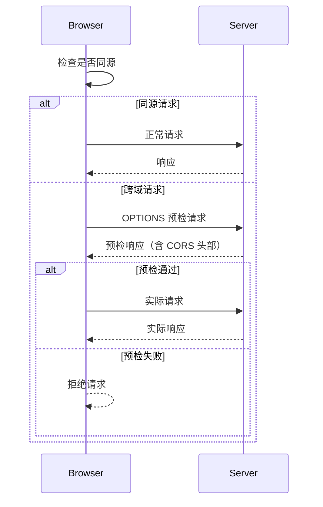
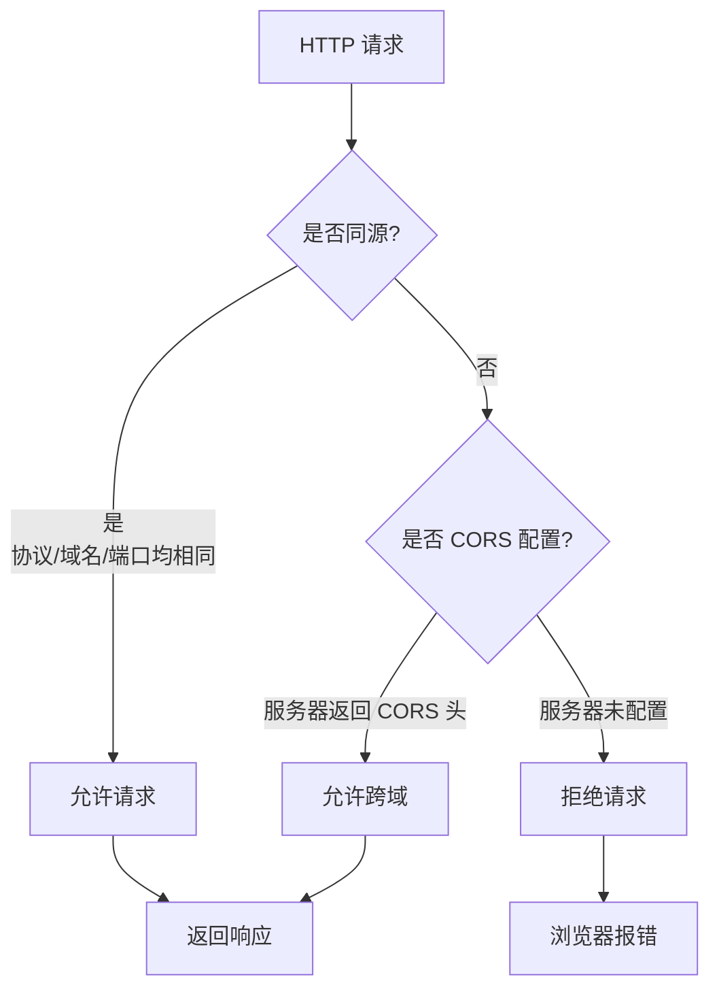

# 09.front-end 重度重构 — 设计文档

> **For agentic workers:** 设计中，待用户批准。配套分析报告见 `.superpowers/sdd/09-front-end-analysis.md`。

**Goal:** 把 `note/09.front-end/` 从「9 模块不均衡」（2 个空壳 / 1 个无子 / 5 个完整 + 2 个完整但速查型 / 25 个子 README）重构为「顶层 README 450 行完整地图 + 9 个子模块统一 80 行索引 + 25-30 个子 README 深读」的混合架构，对齐 08.application-systems 已验证的模式。

**Architecture:** 4 阶段 13 commits。顶层 README 作为「前端完整地图」（单源真相），9 个子模块顶层 README 统一为 deep-dive 入口索引（50-80 行），缺失子 README 补全，PNG 替换为 mermaid。

**Tech Stack:** Markdown + Mermaid 流程图；继续遵守仓库「零 PNG」约定。

## 1. 背景与动机

### 1.1 现状（2026-06-26）

`note/09.front-end/` 现状（来自分析报告）：
- 顶层 README 119 行（含 9 模块导航 + mermaid 知识脉络 + 4 条学习路线 + 交叉引用 + 开源参考）
- 9 个子模块顶层 README 不一致：7 个 100-175 行（完整速查型），2 个 25/24 行（05 架构 / 07 安全，纯索引空壳）
- 25 个子 README，分布不均：05 架构 7 个 / 07 安全 6 个 / 其他 0-2 个
- 03 框架 0 个子 README，166 行内容全压在顶层
- 2 个 PNG 资源（`07-security/cors/img.png`、`img_1.png`），违反「零 PNG」约定
- 总 6678 行 .md 内容

### 1.2 问题

1. **风格断层**：05/07 顶层 README（25 行）vs 其他 7 个（100-175 行）— 阅读者进入不同模块体验不一致
2. **结构缺失**：03 框架 0 个子 README，与 04/06/08/09 风格断裂
3. **子 README 严重缺失**：Flutter/Tauri/PWA 跨端三巨头、React/Vue 独立深读、性能优化手段深读 全部空缺
4. **PNG 违规**：cors/ 的 2 个 PNG 是仓库孤例
5. **顶层信息密度低**：9 大方向速查表分散在 9 个子 README，缺单一真相源

### 1.3 设计目标

| 目标 | 度量 |
|------|------|
| 顶层信息密度 | 119 → 450 行（+278%），但保持 1 文件可读性 |
| 子模块风格统一 | 9 个子模块顶层 README 全部统一为 50-80 行 deep-dive 入口索引 |
| 子 README 补全 | 25 → 30 个（+5 个优先级最高的缺失项） |
| PNG 清零 | 0 张 |
| 风格对齐 | 与 08.application-systems 重构后模式一致 |

## 2. 最终目录结构

```
note/09.front-end/
├── README.md                          # 顶层地图（450 行，9 模块导航 + 知识脉络 + 速查 + 学习路线 + 决策树）
├── 01-foundation/
│   ├── README.md                      # 80 行索引
│   ├── browser-rendering/             # 已存在
│   └── css-engineering/               # 已存在
├── 02-language/
│   ├── README.md                      # 80 行索引
│   ├── typescript/                    # 已存在
│   └── runtime/                       # 已存在
├── 03-frameworks/
│   ├── README.md                      # 80 行索引
│   ├── react/                         # 新增（200-300 行）
│   └── vue/                           # 新增（200-300 行）
├── 04-engineering/
│   ├── README.md                      # 80 行索引
│   ├── vite/                          # 已存在
│   └── monorepo-practice/             # 已存在
├── 05-architecture/
│   ├── README.md                      # 80 行索引（从 25 行扩）
│   ├── rendering-modes/               # 已存在
│   ├── state-management/              # 已存在
│   ├── routing/                       # 已存在
│   ├── micro-frontend/                # 已存在
│   ├── web-components/                # 已存在
│   ├── bff/                           # 已存在
│   └── design-system/                 # 已存在
├── 06-performance/
│   ├── README.md                      # 80 行索引
│   ├── core-web-vitals/               # 已存在
│   ├── monitoring/                    # 已存在
│   └── optimization/                  # 新增（200-300 行）
├── 07-security/
│   ├── README.md                      # 80 行索引（从 24 行扩）
│   ├── xss/                           # 已存在
│   ├── csrf/                          # 已存在
│   ├── csp/                           # 已存在
│   ├── supply-chain/                  # 已存在
│   ├── cors/                          # 已存在，PNG 替换为 mermaid
│   └── sessions/                      # 已存在
├── 08-cross-platform/
│   ├── README.md                      # 80 行索引
│   ├── react-native/                  # 已存在
│   ├── mini-program/                  # 已存在
│   ├── flutter/                       # 新增（200-300 行）
│   ├── tauri/                         # 新增（200-300 行）
│   └── pwa/                           # 新增（200-300 行）
└── 09-frontend-and-ai/
    ├── README.md                      # 80 行索引
    ├── ai-sdk/                        # 已存在
    └── vibe-coding/                   # 已存在
```

子 README 数量变化：25 → 31（+6：03/react、03/vue、06/optimization、08/flutter、08/tauri、08/pwa）

## 3. 顶层 README 结构（119 → 450 行）

### 3.1 章节结构（11 节）

```
# 前端工程
> 一句话定位
本章节是仓库「前端」主题的入口...

## 1. 9 模块导航                          (60 行,表格 + 9 个模块简介)

## 2. 知识脉络                            (80 行,mermaid 4 层分层图 + 关键节点说明)

## 3. 速查地图                            (140 行,9 大方向 速查表)
   3.1 构建工具速查（Vite/Rspack/Turbopack/Webpack/Parcel）
   3.2 框架对比速查（React/Vue/Svelte/Solid/Astro/htmx）
   3.3 元框架速查（Next/Nuxt/SvelteKit/Remix/Astro）
   3.4 状态管理速查（Redux/Zustand/Jotai/Pinia/Valtio/Nano Stores）
   3.5 路由速查（React Router/Vue Router/TanStack Router）
   3.6 渲染模式速查（CSR/SSR/SSG/ISR/RSC/Islands）
   3.7 跨端速查（React Native/Flutter/Tauri/PWA/小程序）
   3.8 UI 库速查（shadcn/ui/Material UI/Ant Design）
   3.9 测试速查（Vitest/Jest/Playwright/Cypress）
   3.10 性能监控速查（web-vitals/Lighthouse/RUM）
   3.11 安全速查（XSS/CSRF/CSP/CORS/会话）
   3.12 AI 工具速查（Cursor/Claude Code/Vercel AI SDK）

## 4. 选型决策树                          (40 行,4-5 个 mermaid flowchart)

## 5. 学习路线                            (30 行,4 条主线扩展)
   5.1 新人入门
   5.2 后端补前端
   5.3 架构师
   5.4 AI 时代前端

## 6. 交叉引用                            (20 行,5-6 条到其他章节的引用)

## 7. 开源参考                            (20 行,9-10 个项目链接)

## 8. 数据时效性                          (10 行,标注需每年更新的内容)

## 9. 章节统计                            (10 行,模块数 / 子 README 数 / 总行数)

## 10. 变更记录                          (10 行,本版本 + 历史重大变更)

## 11. 附录：术语表                      (10 行,15-20 个关键术语)
```

总计：60+80+140+40+30+20+20+10+10+10+10 = 430 行（接近 450 目标）

### 3.2 9 模块导航表格（60 行）

每行结构：序号 / 主题 / 核心内容 / 主要子 README / 学习价值

| 序号 | 主题 | 核心内容 | 主要子 README | 学习价值 |
|------|------|---------|--------------|---------|
| 01 | 基础 | 浏览器原理 / HTML 语义化 / CSS 工程化 / Web 标准 | browser-rendering / css-engineering | ... |
| 02 | 语言 | JavaScript ES2024-2026 / TypeScript 5 / 运行时 | typescript / runtime | ... |
| 03 | 框架 | React / Vue / Svelte / Solid / Astro | react / vue | ... |
| 04 | 工程化 | 构建 / 包管理 / Monorepo / 测试 | vite / monorepo-practice | ... |
| 05 | 架构 | 渲染模式 / 状态 / 路由 / 微前端 / BFF | rendering-modes / state-management / ... | ... |
| 06 | 性能 | 指标 / 监控 / 优化手段 | core-web-vitals / monitoring / optimization | ... |
| 07 | 安全 | XSS / CSRF / CSP / CORS / 会话 / 供应链 | xss / csrf / csp / cors / sessions / supply-chain | ... |
| 08 | 跨端 | RN / Flutter / Tauri / PWA / 小程序 | react-native / flutter / tauri / pwa / mini-program | ... |
| 09 | 前端与 AI | AI SDK / AI Native UI / AI IDE / MCP | ai-sdk / vibe-coding | ... |

## 4. 子模块 README 统一索引模板（50-80 行）

每个子模块顶层 README 统一为以下 8 节：

```markdown
# {NN} {模块名}

> 一句话定位：**{15-25 字的关键定位}**

本模块聚焦「{2-3 句话的模块价值描述}」，是 {上游模块} 与 {下游模块} 之间的桥梁。

---

## 1. 本模块覆盖

| 主题 | 状态 | 说明 |
|------|------|------|
| {子 README 名称 1} | ✓ 已有 | [{路径}]({path}/) — {一句话内容} |
| {子 README 名称 2} | ✓ 已有 | [{路径}]({path}/) — {一句话内容} |
| {子 README 名称 3} | 📝 计划 | {一句话内容} |

---

## 2. 速查要点（3-5 个关键决策点）

- **{决策点 1}**：{3-5 行说明}
- **{决策点 2}**：{3-5 行说明}
- **{决策点 3}**：{3-5 行说明}

---

## 3. 选型建议

{一个 mermaid flowchart，展示 3-5 个常见场景的选型路径}

---

## 4. 与其他模块的关系

- **上游**：[{上游模块 1}](../{上游 1}/) / [{上游模块 2}](../{上游 2}/)
- **下游**：被 [{下游模块 1}](../{下游 1}/) / [{下游模块 2}](../{下游 2}/) 复用
- **横向**：[{同级模块}](../{同级}/) 关注 {横向关系}

---

## 5. 学习建议

- {2-3 句话的学习顺序建议}
- {1-2 个推荐学习资源}

---

## 6. 数据时效性

{标注本模块需要定期更新的内容}

---

## 7. 关键术语

| 术语 | 解释 |
|------|------|
| {术语 1} | {一句话} |
| {术语 2} | {一句话} |
```

预期每节行数：标题 1-2 行 + 8 节平均 8-10 行 = 65-80 行

## 5. 缺失子 README 清单（6 个新增）

按分析报告 S1-S5 + 业务价值排序：

### 5.1 03-frameworks/react/ (200-300 行)

**核心内容**：
- 定位：React 19 生态全景（hooks/Server Components/Compiler/Vite 集成）
- 核心能力：Hooks 体系、Server Components、Suspense、Concurrent Rendering
- 生态：Next.js / Remix / TanStack Query / Zustand / React Hook Form / shadcn/ui
- 选型：何时选 React 19 vs 18 vs 17
- 性能：useMemo / useCallback / React.memo / Compiler 自动优化
- 实战：常见反模式（prop drilling、过度 re-render、context 滥用）

### 5.2 03-frameworks/vue/ (200-300 行)

**核心内容**：
- 定位：Vue 3.4+ 生态（Composition API/Pinia/Vapor/性能优化）
- 核心能力：组合式 API、Reactivity 系统、Teleport、Suspense
- 生态：Nuxt / Pinia / VueUse / Element Plus / Naive UI / Vant
- 选型：Vue 3 vs Vue 2 vs React 19
- 性能：Vapor 编译器、shallowRef、shallowReactive、markRaw
- 实战：跨组件通信、Pinia 状态管理、组合式函数设计

### 5.3 06-performance/optimization/ (200-300 行)

**核心内容**：
- 定位：性能优化手段深读（加载 / 运行时 / 资源 / 网络 4 大类）
- 加载优化：code splitting / tree shaking / lazy load / dynamic import / preload/prefetch
- 运行时优化：虚拟滚动 / 列表分页 / 防抖节流 / Web Worker / OffscreenCanvas
- 资源优化：图片（WebP/AVIF/响应式）/ 字体（font-display）/ CSS（contain/contain-intrinsic-size）
- 网络优化：HTTP/3 / 边缘缓存 / Service Worker / CDN / 压缩算法
- 监控闭环：RUM 接入 / 性能预算 / Lighthouse CI

### 5.4 08-cross-platform/flutter/ (200-300 行)

**核心内容**：
- 定位：Flutter 3.x 跨端开发（一码三端：iOS/Android/Web/Desktop）
- 核心能力：Widget 体系、Skia 渲染、Hot Reload、Platform Channels
- 生态：Flutter SDK / Dart / Provider / Riverpod / Bloc / dio / go_router
- 选型：Flutter vs React Native vs 原生
- 性能：Skia vs Impeller / JNI 桥接 / Platform View / 树摇优化
- 实战：混合开发（Flutter + Native）、包大小优化、状态管理

### 5.5 08-cross-platform/tauri/ (200-300 行)

**核心内容**：
- 定位：Tauri 2.0 桌面应用（Rust 后端 + Web 前端）
- 核心能力：WebView 集成、Rust 命令桥接、权限系统、Updater
- 生态：Tauri CLI / Plugin 体系 / tauri-plugin-sql / tauri-plugin-store
- 选型：Tauri vs Electron vs Flutter Desktop
- 性能：Rust 启动速度 < 100ms / 包大小 < 10MB（vs Electron 100MB+）
- 实战：多窗口 / 系统托盘 / 自动更新 / 跨平台打包

### 5.6 08-cross-platform/pwa/ (200-300 行)

**核心内容**：
- 定位：PWA（Progressive Web App）渐进式 Web 应用
- 核心能力：Service Worker、Web App Manifest、Push API、Background Sync
- 生态：Workbox / PWA Builder / Vite PWA Plugin
- 选型：PWA vs SPA vs Hybrid App
- 性能：Cache Strategy（Cache First / Network First / Stale While Revalidate）
- 实战：离线优先 / 安装提示 / 后台同步 / 推送通知

## 6. PNG 替换方案

### 6.1 现状
- `note/09.front-end/07-security/cors/img.png` (62375 bytes) - CORS 流的主要参与者
- `note/09.front-end/07-security/cors/img_1.png` (157978 bytes) - 浏览器同源策略示意

### 6.2 替换策略

**img.png → mermaid sequenceDiagram**（CORS 请求流程）


**img_1.png → mermaid flowchart**（浏览器同源策略）


### 6.3 文件操作
1. 编辑 `07-security/cors/README.md` 第 36、39 行：
   - 删除 `` 和 ``
   - 插入对应的 mermaid 代码块
2. 删除 `07-security/cors/img.png` 和 `07-security/cors/img_1.png`

## 7. Commit 计划（13 commits，4 阶段）

| # | Commit | 范围 | 行数变化 |
|---|--------|------|---------|
| **1** | 顶层 README - 9 模块导航 | 119 → 200 | +81 |
| **2** | 顶层 README - 速查地图（12 大速查表） | 200 → 360 | +160 |
| **3** | 顶层 README - 选型决策树 + 学习路线 + 附录 | 360 → 450 | +90 |
| **4** | 01-foundation 索引化 | 108 → 80 | -28 |
| **5** | 02-language 索引化 | 121 → 80 | -41 |
| **6** | 03-frameworks 索引化 + 速查下移 | 166 → 80 | -86 |
| **7** | 04-engineering 索引化 | 152 → 80 | -72 |
| **8** | 05-architecture 索引化（25→80） | 25 → 80 | +55 |
| **9** | 06-performance 索引化 | 141 → 80 | -61 |
| **10** | 07-security 索引化（24→80） | 24 → 80 | +56 |
| **11** | 08-cross-platform 索引化 | 165 → 80 | -85 |
| **12** | 09-frontend-and-ai 索引化 | 175 → 80 | -95 |
| **13** | 新增 6 个子 README（react/vue/optimization/flutter/tauri/pwa）+ PNG 替换 | +0（净增） | +1300/+0 |

每个 commit 独立可查、独立可回滚。

## 8. 全局约束（Global Constraints）

继承仓库既有约定：
- **零 PNG**：所有图必须 mermaid，禁止引入图片文件（替换现有 2 张 PNG）
- **Markdown + 中文**：与仓库其他章节风格一致
- **不写厂商主观对比表**：避免倾向性，案例可引用公开资料
- **不重复子 README 已有内容**：顶层 README 只放「完整地图」所需内容（速查/决策/脉络），深读在子 README
- **链接风格**：相对路径（如 `./01-foundation/`），不使用绝对路径
- **Mermaid 兼容性**：避免使用 `mindmap` 等渲染支持有限的语法（用 `flowchart LR/TD` + `sequenceDiagram` + `graph LR`）
- **顶层 README 行数目标**：400-500 行
- **子模块 README 行数目标**：50-80 行
- **新子 README 行数目标**：200-300 行
- **13 个 commit**：每个 commit 独立可查、独立可回滚
- **0 处占位符**：完成后 `grep -rE "TODO|TBD|待完善" note/09.front-end/` 必须 0 行
- **保持现有 25 个子 README 内容不变**：本重构不动 25 个已存在子 README 的深读内容，只调整顶层结构 + 新增 6 个 + 修 PNG

## 9. 范围之外（Out-of-Scope）

明确不做：
1. **不重写现有 25 个子 README 内容**：深读内容维持现状
2. **不新增章节（如 a11y / i18n / WebGPU）**：作为后续迭代
3. **不修改跨章节引用（`12.story/`、`13.split-hairs/`）**：本重构保持现有引用，引用失效由后续 issue 处理
4. **不引入图片**：继续 mermaid
5. **不动其他 8 个一级章节**（01-08、10-13）
6. **不动 `note/README.md` 的 09 章节索引**：链接维持原状
7. **不引入新工具 / 框架**

## 10. 验收标准（Acceptance Criteria）

10.1 结构
- [ ] 顶层 README 存在且唯一，行数 400-500
- [ ] 9 个子模块顶层 README 全部存在，行数 50-80
- [ ] 6 个新增子 README 存在（03/react、03/vue、06/optimization、08/flutter、08/tauri、08/pwa）
- [ ] 现有 25 个子 README 全部保留且内容不破坏（行数变化 < ±5%）

10.2 内容
- [ ] 顶层 README 包含 11 节（导航/脉络/速查/选型/学习/引用/开源/时效/统计/变更/术语）
- [ ] 9 个子模块 README 统一为 8 节模板
- [ ] 6 个新增子 README 各 200-300 行
- [ ] 顶层 README 速查地图包含 12 个速查表
- [ ] 顶层 README 至少 30 个 mermaid 图

10.3 视觉与一致性
- [ ] 0 张 PNG / JPG / JPEG
- [ ] 0 处「TODO」「TBD」「待完善」占位符
- [ ] 全 mermaid 渲染无错误
- [ ] 顶层 README 与 08.application-systems 风格一致

10.4 Git 历史
- [ ] 13 个 commit，每个独立可查
- [ ] 每个 commit 单独可 push、可回滚
- [ ] 提交后 master 通过 `git push origin master` 推到远程

## 11. 风险与缓解

| 风险 | 缓解 |
|------|------|
| 顶层 README 450 行写得过深偏离「地图」定位 | 严格控制「深读下沉到子 README」原则；commit 1-3 后用 `wc -l` 校验 ≤ 500 |
| 子模块 README 索引化破坏速查路径 | 速查表下沉到子 README（如 vite 性能数据保留），不在顶层重复 |
| 6 个新增子 README 内容不足 200 行 | 复用分析报告 5.1-5.6 内容大纲，每节明确 8 节模板 + 行数下限 |
| PNG 替换后 cors/ 流程图信息丢失 | 用 mermaid sequenceDiagram 完整还原预检流程 |
| 现有 25 个子 README 引用断链（如引用 03 框架速查） | 提交前用 grep 检查；用旧路径 + 新指向 |
| 与 12.story/13.split-hairs 引用失效 | 提交后 grep 跨章节引用，逐条修正 |

## 12. 与 08.application-systems 重构的差异

| 维度 | 08 方案 | 09 方案 |
|------|---------|---------|
| 顶层 README 角色 | 速查手册（21 业务系统） | 完整地图（9 大方向 + 12 速查表） |
| 子模块顶层 README | 价值链章节（5 段详讲） | deep-dive 入口索引（8 节模板） |
| 缺失子 README | 0 缺失（21 简讲） | 6 缺失（新增 6 子 README） |
| PNG 替换 | 0 PNG | 2 PNG → mermaid |
| Commit 数 | 6 | 13 |
| 完成时间 | 1 天 | 1-2 周 |

差异原因：09 是「**学习地图**」（多速查 + 决策），08 是「**业务系统**」（少速查 + 详讲）。

---

**设计完成**. 等用户 review 后写实施计划。

**附录 A：依赖与参考**
- 08.application-systems 重构 spec/plan：作为模式参考
- 仓库约定：零 PNG / Markdown + 中文 / 相对路径
- 09 当前结构：35 .md + 2 PNG = 37 文件，6678 行
