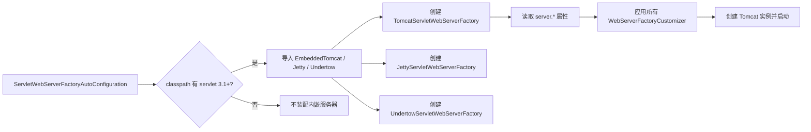

<!--
module:
  parent: spring
  slug: spring-boot/embedded-server
  type: article
  category: 主模块子文章
  summary: Spring Boot 内嵌 Servlet 服务器原理、Tomcat/Jetty/Undertow 切换、HTTPS 与生产连接调优。
-->

# Spring Boot 内嵌服务器切换（Tomcat / Jetty / Undertow）

> ⬅️ [返回 04 Spring Boot](README.md) | [启动流程](startup-flow.md) | [GraalVM Native](graalvm-native.md)

Spring Boot 的"开箱即用" Web 体验来自**内嵌 Servlet 容器**——无需部署 WAR，默认打包为可执行 jar 直接 `java -jar` 启动。

---

## 🎯 一句话定位

**内嵌服务器 = "JAR 里塞一个 Tomcat"**——`spring-boot-starter-web` 默认带 Tomcat，通过切换 starter 在 Tomcat / Jetty / Undertow 之间自由替换，通过 `WebServerFactoryCustomizer` 自定义端口 / SSL / 连接器。

---

## 一、默认 Tomcat 配置

引入 `spring-boot-starter-web` 后，自动获得 Tomcat 10+（Spring Boot 3.x 对应 Jakarta EE 9+）：

```xml
<dependency>
    <groupId>org.springframework.boot</groupId>
    <artifactId>spring-boot-starter-web</artifactId>
</dependency>
```

**默认行为**：
- 监听 `0.0.0.0:8080`
- 工作线程数：`server.tomcat.threads.max = 200`
- 接受队列长度：`server.tomcat.accept-count = 100`
- 自动部署到根路径 `/`

**常用配置**：

```yaml
server:
  port: 9090
  compression:
    enabled: true
    mime-types: application/json,text/html
  tomcat:
    threads:
      max: 400
      min-spare: 50
    connection-timeout: 30s
    max-http-form-post-size: 2MB
```

---

## 二、切换 Jetty / Undertow

### 1. 切到 Jetty

```xml
<!-- 排除默认 Tomcat -->
<dependency>
    <groupId>org.springframework.boot</groupId>
    <artifactId>spring-boot-starter-web</artifactId>
    <exclusions>
        <exclusion>
            <groupId>org.springframework.boot</groupId>
            <artifactId>spring-boot-starter-tomcat</artifactId>
        </exclusion>
    </exclusions>
</dependency>

<!-- 引入 Jetty starter -->
<dependency>
    <groupId>org.springframework.boot</groupId>
    <artifactId>spring-boot-starter-jetty</artifactId>
</dependency>
```

Jetty 适合**长连接 / WebSocket** 场景（Jetty 的 NIO 实现更轻量）。

### 2. 切到 Undertow

```xml
<dependency>
    <groupId>org.springframework.boot</groupId>
    <artifactId>spring-boot-starter-web</artifactId>
    <exclusions>
        <exclusion>
            <groupId>org.springframework.boot</groupId>
            <artifactId>spring-boot-starter-tomcat</artifactId>
        </exclusion>
    </exclusions>
</dependency>

<dependency>
    <groupId>org.springframework.boot</groupId>
    <artifactId>spring-boot-starter-undertow</artifactId>
</dependency>
```

Undertow 适合**高并发 / 低延迟**场景（Red Hat 出品，WildFly 默认容器）。

### 3. 🔧 A3 ❌/✅ 切换反例：只添加新 starter 不会替换 Tomcat

Spring Boot 的切换动作不是“把目标容器加进 classpath”这么简单，而是要**移除默认容器，再加入目标容器**。`spring-boot-starter-web` 会传递依赖 `spring-boot-starter-tomcat`；如果 Tomcat 仍在 classpath，Tomcat 自动配置可能先创建 `ServletWebServerFactory`，Jetty / Undertow 的自动配置随后因 `@ConditionalOnMissingBean(ServletWebServerFactory.class)` 退避。

#### 切换到 Jetty

```xml
<!-- ❌ 反例：Tomcat 仍由 starter-web 传递引入，只是额外添加 Jetty -->
<dependency>
    <groupId>org.springframework.boot</groupId>
    <artifactId>spring-boot-starter-web</artifactId>
</dependency>
<dependency>
    <groupId>org.springframework.boot</groupId>
    <artifactId>spring-boot-starter-jetty</artifactId>
</dependency>
```

```xml
<!-- ✅ 正例：先排除 spring-boot-starter-tomcat，再引入 Jetty -->
<dependency>
    <groupId>org.springframework.boot</groupId>
    <artifactId>spring-boot-starter-web</artifactId>
    <exclusions>
        <exclusion>
            <groupId>org.springframework.boot</groupId>
            <artifactId>spring-boot-starter-tomcat</artifactId>
        </exclusion>
    </exclusions>
</dependency>
<dependency>
    <groupId>org.springframework.boot</groupId>
    <artifactId>spring-boot-starter-jetty</artifactId>
</dependency>
```

#### 切换到 Undertow

```xml
<!-- ❌ 反例：只加 Undertow，Tomcat 仍在依赖树中 -->
<dependency>
    <groupId>org.springframework.boot</groupId>
    <artifactId>spring-boot-starter-web</artifactId>
</dependency>
<dependency>
    <groupId>org.springframework.boot</groupId>
    <artifactId>spring-boot-starter-undertow</artifactId>
</dependency>
```

```xml
<!-- ✅ 正例：排除 Tomcat 后再引入 Undertow -->
<dependency>
    <groupId>org.springframework.boot</groupId>
    <artifactId>spring-boot-starter-web</artifactId>
    <exclusions>
        <exclusion>
            <groupId>org.springframework.boot</groupId>
            <artifactId>spring-boot-starter-tomcat</artifactId>
        </exclusion>
    </exclusions>
</dependency>
<dependency>
    <groupId>org.springframework.boot</groupId>
    <artifactId>spring-boot-starter-undertow</artifactId>
</dependency>
```

**为什么 ❌ 不会切换？**

1. `starter-web` 的传递依赖仍把 Tomcat 核心、WebSocket 等包带入运行时 classpath。
2. Spring Boot 根据 classpath 条件导入 Tomcat / Jetty / Undertow 配置；多个容器同时存在时，并不是通过 `server.*` 属性选择，而是由哪个 `ServletWebServerFactory` 先注册决定。
3. 一旦 Tomcat 工厂已经注册，其他工厂的 `@ConditionalOnMissingBean` 条件不满足，应用仍会启动 Tomcat；“能加载 Jetty 类”不等于“正在使用 Jetty”。
4. 用 `mvn dependency:tree`（或 `./gradlew dependencies`）确认切换结果：目标是运行时只保留一个 Servlet 容器 starter。Spring Boot 官方也将该操作定义为 **swap the default dependencies**，而不是并列添加依赖。

---

### 4. 切换后的配置边界

`server.tomcat.*` 只会作用于 Tomcat。切换到 Jetty / Undertow 后，应改用对应的 `server.jetty.*` / `server.undertow.*` 属性或其专用 `WebServerFactoryCustomizer`；不要因为保留了一段 `server.tomcat.*` 配置，就误以为它仍在调节实际运行的容器。

---

### 5. 对比

| 特性 | Tomcat | Jetty | Undertow |
|------|:------:|:-----:|:--------:|
| 默认 starter | ✅ | 需排除 + 引入 | 需排除 + 引入 |
| Servlet 规范支持 | 全 | 全 | 全 |
| WebSocket | ✅ | ✅（更轻量） | ✅ |
| HTTP/2 | ✅ | ✅ | ✅ |
| 性能（高并发） | 中 | 中 | **高** |
| 内存占用 | 中 | 较低 | 最低 |
| 适用场景 | 通用 | 长连接 / 嵌入式 | 高并发网关 |

---

## 🛠️ A4 生产调优建议：先压测，再按瓶颈改参数

下面的起点值与 Spring Boot 3.x / Tomcat 10.1 的官方默认值一致；“生产推荐”是**常见同步 I/O Web 服务的初始范围**，不是脱离压测的固定答案。线程数过大可能增加上下文切换、堆栈内存和下游连接池压力，应结合 CPU 核数、接口耗时、数据库连接池、P95/P99 延迟和拒绝数共同校准。

```yaml
server:
  tomcat:
    threads:
      # 官方默认 200；生产起步建议 200-800，候选经验值为 CPU 核数 × 100
      # 例如 4 核先从 400 开始，压测后再调整
      max: 400
    # Spring Boot 未预设该属性；Tomcat Connector 默认 60s，标准 server.xml 常见 20s
    # 普通 API 为防慢连接占用，建议显式设为 20-30s
    connection-timeout: 25s
    # 官方默认 8192；连接数确有瓶颈且文件描述符/内存足够时可升至 16384
    max-connections: 16384
    # 官方默认 100；线程池满时的等待队列，满后新连接可能被拒绝或超时
    accept-count: 100
```

| 参数 | 官方默认 | 生产推荐起点 | 调优含义与依据 |
|------|:--------:|:------------:|----------------|
| `server.tomcat.threads.max` | 200 | **200-800**（候选经验值：CPU 核数 × 100） | 决定同时处理请求的最大工作线程数。Tomcat 文档说明它决定可处理的并发请求数；不要把它当作越大越好，需与下游连接池和接口阻塞时间匹配。虚拟线程启用时该属性不生效。 |
| `server.tomcat.connection-timeout` | Spring Boot 当前未强制写入默认；Tomcat Connector 默认 60s，标准 `server.xml` 常见 20s | **20-30s**，常用 25s | 连接建立后等待请求 URI 行的最长时间，防止慢连接长期占用连接资源。文件上传/长轮询需单独评估，不应盲目套用。 |
| `server.tomcat.max-connections` | **8192** | 默认足够；高并发连接型服务可 **16384** | Tomcat 同时接受并处理的最大连接数。达到上限后，操作系统仍可能按 `accept-count` 排队；提高前先检查文件描述符、堆外内存和负载均衡连接复用。 |
| `server.tomcat.accept-count` | **100** | 通常保持 **100**；突发流量可结合压测适度增大 | 当所有工作线程都忙时，操作系统连接队列的最大长度；队列满后新连接可能被主动拒绝或超时。它不是“额外工作线程数”，盲目增大只会拉长排队延迟。 |

### 一次调优的顺序

1. **先测基线**：记录吞吐、P95/P99、活动线程、连接数、队列长度、5xx/拒绝和下游连接池等待。
2. **先改 `threads.max`**：以 `CPU 核数 × 100` 作为候选起点并限制在 200-800（例如 4 核 → 400），逐步压测；这不是 Tomcat 官方公式。若 CPU 已满或上下文切换升高，立即回退。
3. **再看 `max-connections`**：只有长连接/Keep-Alive 数量触顶时才从 8192 调到 16384，并同步检查 OS 文件描述符和容器限制。
4. **最后看 `accept-count`**：它只吸收短时突发，队列持续增长说明应用或下游已经处理不过来，应扩容、限流或优化慢接口，而不是无限加队列。
5. **设置连接超时**：普通 API 建议 20-30 秒；它限制的是连接被接受后等待请求行的时间。慢上传、SSE、长轮询还会受上传/Keep-Alive/网关 idle timeout 等其他超时约束，应按业务协议分别校准。

> **边界提醒**：Tomcat 的 `max-connections`、`accept-count` 和线程池不是三个独立的“并发倍增器”。请求处理线程耗尽后先进入等待队列；连接数和 OS backlog 都有上限，最终效果取决于协议（NIO/NIO2）、Keep-Alive、网关重试和下游资源。

---

## 三、`WebServerFactoryCustomizer` 自定义端口 / SSL

需要**编程式**定制服务器时，实现 `WebServerFactoryCustomizer`：

```java
@Component
public class CustomTomcatConfig implements WebServerFactoryCustomizer<TomcatServletWebServerFactory> {

    @Override
    public void customize(TomcatServletWebServerFactory factory) {
        // 1. 添加额外端口（管理端口）
        factory.addAdditionalTomcatConnectors(httpConnector());

        // 2. 配置 Connector
        factory.addConnectorCustomizers(connector -> {
            connector.setProperty("maxKeepAliveRequests", "100");
            connector.setProperty("compression", "on");
        });

        // 3. 设置 context path
        factory.setContextPath("/api");
    }

    private Connector httpConnector() {
        Connector connector = new Connector("org.apache.coyote.http11.Http11NioProtocol");
        connector.setPort(9091);
        connector.setScheme("http");
        return connector;
    }
}
```

> 泛型参数根据服务器类型变化：`JettyServletWebServerFactory` / `UndertowServletWebServerFactory`。

---

## 四、启用 HTTPS

### 方式 1：配置文件

```yaml
server:
  port: 8443
  ssl:
    enabled: true
    key-store: classpath:keystore.p12
    key-store-password: changeit
    key-store-type: PKCS12
    key-alias: tomcat
    protocol: TLS
```

### 方式 2：编程式

```java
@Component
public class HttpsConfig implements WebServerFactoryCustomizer<TomcatServletWebServerFactory> {
    @Override
    public void customize(TomcatServletWebServerFactory factory) {
        factory.setSsl(...);
        factory.setSslStoreProvider(...);
    }
}
```

### 方式 3：HTTP → HTTPS 重定向

```java
@Component
public class HttpsRedirectConfig implements WebServerFactoryCustomizer<TomcatServletWebServerFactory> {
    @Override
    public void customize(TomcatServletWebServerFactory factory) {
        factory.addAdditionalTomcatConnectors(redirectConnector());
    }

    private Connector redirectConnector() {
        Connector connector = new Connector("org.apache.coyote.http11.Http11NioProtocol");
        connector.setPort(8080);
        connector.setScheme("http");
        connector.setSecure(false);
        connector.setRedirectPort(8443);  // 跳转到 HTTPS
        return connector;
    }
}
```

---

## 五、`ServletWebServerFactoryAutoConfiguration` 内部原理

Spring Boot 通过 3 个自动配置类按优先级装配服务器：



### 关键 Bean

- **`ServletWebServerFactoryAutoConfiguration`**（`@AutoConfiguration`）
  - `@Import({ ServletWebServerFactoryConfiguration.EmbeddedTomcat.class, ... })`
  - 嵌套类按 `@ConditionalOnClass` 选择具体工厂。
- **`WebServerFactoryCustomizerBeanPostProcessor`**
  - 在工厂 Bean 创建后注入所有 `WebServerFactoryCustomizer` 实现。
- **`ServletWebServerApplicationContext`**
  - 重写 `onRefresh()`，调用工厂的 `getWebServer()` 启动容器。

### 自定义服务器时发生了什么？

1. `SpringApplication.run()` 调用 `context.refresh()`
2. `refresh()` 内部触发 `onRefresh()`
3. `ServletWebServerApplicationContext.onRefresh()` 调用 `factory.getWebServer()`
4. `factory` 读取 `server.*` + `WebServerFactoryCustomizer` 后返回已启动的 Tomcat / Jetty / Undertow

详见 [startup-flow.md 阶段 4](startup-flow.md#四阶段-3applicationcontext-创建)。

---

## 🤔 思考

1. **为什么要支持切换内嵌服务器？** 不同场景对**长连接 / 高并发 / 内存占用**有不同偏好；切换比"自己重写"成本低。
2. **Spring Boot 怎么决定用哪个服务器？** 自动配置用 `@ConditionalOnClass` 检查 classpath，再用 `@ConditionalOnMissingBean(ServletWebServerFactory.class)` 退避；因此应只保留一个目标容器 starter，不要让多个实现竞争工厂 Bean。
3. **生产环境还用内嵌吗？** 主流是**内嵌 + 容器化**（jar 包 → Docker / K8s）。少数传统企业仍部署到外部 Tomcat WAR。
4. **HTTPS 证书怎么管理？** 容器化场景下推荐 cert-manager + K8s Secret 挂载，证书变更无需重新打包。

---

## 参考资料

- [Spring Boot：Embedded Web Servers](https://docs.spring.io/spring-boot/how-to/webserver.html) — 官方切换服务器示例强调排除默认 Tomcat，再引入 Jetty。
- [Spring Boot：Application Properties / Server](https://docs.spring.io/spring-boot/appendix/application-properties/index.html#appendix.application-properties.server) — `threads.max`、`max-connections`、`accept-count` 的属性语义与默认值。
- [Apache Tomcat 10.1：HTTP Connector](https://tomcat.apache.org/tomcat-10.1-doc/config/http.html) — `maxThreads`、`maxConnections`、`acceptCount`、`connectionTimeout` 的 Connector 定义。

---

## 相关章节

- ⬅️ [返回 04 Spring Boot](README.md)
- [启动流程](startup-flow.md) — 内嵌服务器在 `refresh()` 的 `onRefresh()` 阶段启动
- [自动配置原理](auto-configuration.md) — `@ConditionalOnClass` 与 `@ConditionalOnMissingBean` 如何决定工厂 Bean
- [外部化配置](boot-externalized-configuration.md) — `server.*` 属性如何进入 `Environment` 并绑定
- [GraalVM Native](graalvm-native.md) — Native Image 下的服务器与 AOT 约束

---

← [返回: 04 Spring Boot](README.md) | [返回: 06 Spring](../README.md)
