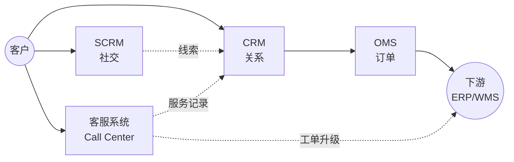

<!--
module:
  parent: application-systems
  slug: application-systems/04-sales-service
  type: index
  category: 主模块子文章
  summary: 销售服务环节（CRM · SCRM · OMS · 客服系统）—— 接触客户、达成交易、订单履约、客户服务中心，CRM 是客户主数据源，OMS 是订单履约协调器，客服系统是客户服务交付中枢。
-->

# 04 销售服务

> 本章关注"接触客户、达成交易、订单履约、服务交付"阶段的系统。CRM 是客户主数据源，OMS 是订单履约协调器，SCRM 是社交化延伸，客服系统是客户服务交付中枢。

## 📌 全景图

## 🔑 核心系统详讲

### CRM（Customer Relationship Management 客户关系管理）

- **核心定位**：以客户全生命周期为主线的管理与运营平台，是企业对外经营的主入口
- **关键能力**：客户主数据 / 销售自动化 SFA（L→O→Q→C→O 漏斗）/ 市场自动化 / 客服工单 / 客户成功
- **典型场景**：B2B 大客户 / B2C 零售 / SaaS 订阅 / 经销商网络 / 金融保险代理人
- **上下游**：上接市场自动化 / SCRM / CDP，下接 ERP / OMS；横向与客服系统闭环
- **关键考量**：销售流程标准化是前提；数据质量决定价值；移动端体验关键
- 📚 详见 [CRM 深读](./crm/) — 上下游 / 选型指南 / 常见陷阱

### 客服系统 / Call Center（Customer Service Center 客户服务中心）

- **核心定位**：以多渠道接入 + 工单流转 + 知识库 + 智能分配 + SLA + 质检为底座，把"电话 / 在线 / 微信 / 邮件 / APP / 短视频"等所有客户触点系统化的客户服务中心，是企业"服务交付 + 客户体验 + 客户挽回"的统一入口
- **关键能力**：多渠道接入（电话 / 在线 / 微信 / 邮件 / APP / 短视频）/ 工单管理 / 知识库 / 智能分配（ACD / Skill-Based Routing）/ SLA 服务等级 / 质检 / 数据分析 / AI 客服 / 大模型客服
- **典型场景**：B2B 大客户支持 / B2C 电商客服 / SaaS 客户成功 / 银行保险客服中心 / 电信运营商客服 / 制造售后 / 政企公共服务
- **上下游**：上接 CRM（客户档案）/ SCRM（社交触点）/ KM（企业知识）/ HR（坐席）/ AI（大模型客服）；横向电话交换（PBX/ACD/IVR）/ IM / 邮件 / 抖音等多渠道；下接 ITSM（技术工单）/ Field Service（现场服务）/ Survey（回访）/ BI（服务分析）
- **关键考量**：多渠道统一是基础；工单是核心数据模型；AI 能力决定未来；SLA 不能过度承诺；知识库必须持续运营；CRM 是客户主数据单一事实源（客服系统只读）；客户数据必须 PIPL 合规
- 📚 详见 [客服系统 深读](./call-center/) — 上下游 / 选型指南 / 常见陷阱

## 📋 其他系统速览

### SCRM（Social Customer Relationship Management 社交化客户关系管理）

CRM 的社交化延伸，集成微信/小红书/抖音等社交触点，把"粉丝"转化为可运营客户。**适用场景**：消费品零售、网红营销、私域运营。

### OMS（Order Management System 订单管理系统）

订单全生命周期管理（创建/拆分/合并/路由/状态），是连接 CRM 与 ERP/WMS/TMS 的中枢。**适用场景**：多渠道订单（电商+门店+经销商）统一管理。

## 💡 本章小结

销售服务的核心是 CRM（客户主数据），OMS 协调订单履约，SCRM 是社交化补充，**客服系统是客户服务交付中枢**——承接多渠道客户互动、做工单流转、做 SLA 服务承诺、做客户体验管理。本章输出"客户+订单+服务"信息给运营管理章节的 ERP。

## 📑 本组系统导航

| 系统 | 一句话定位 | 深读链接 |
|------|-----------|---------|
| CRM | 客户关系管理（客户主数据源） | [CRM 深读](./crm/) |
| SCRM | 社交化客户关系管理 | [SCRM 深读](./scrm/) |
| OMS | 订单管理系统（履约协调器） | [OMS 深读](./oms/) |
| 客服系统 | 客户服务中心（多渠道接入 + 工单 + AI） | [客服系统 深读](./call-center/) |

← [返回: 业务应用系统](../README.md)
