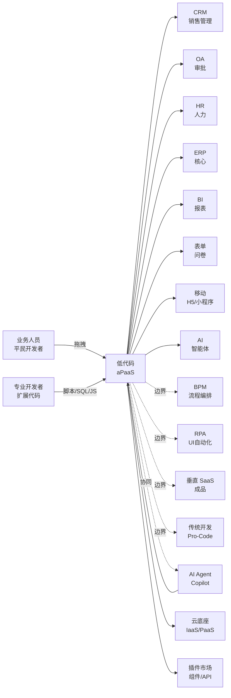
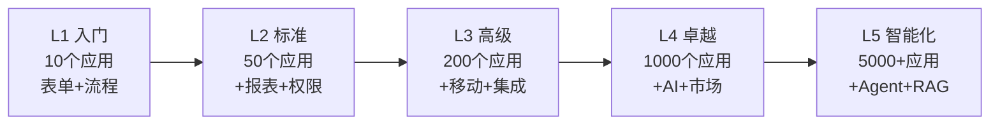
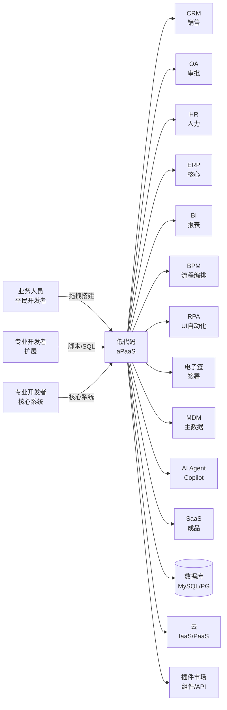

<!--
module:
  parent: application-systems
  slug: application-systems/05-operations/low-code
  type: article
  category: 主模块子文章
  summary: 低代码 / Low-Code（Low-Code Development Platform 低代码开发平台 / aPaaS） 一句话定位：通过可视化拖拽 + 模型驱动 + 表单/流程/报表/AI 引擎，把"应用开发"从专业程序员手中下放到业务人员手中，是企业"应用生产力的下一场革命"，也是 2025-2026 与 BPM/RPA/AI Agent 边界最易混淆的领域。
-->

# 低代码 / Low-Code（Low-Code Development Platform 低代码开发平台 / aPaaS）

> 一句话定位：通过**可视化拖拽 + 模型驱动 + 表单/流程/报表/数据/权限/AI 引擎** + 少量脚本，把"**应用开发**"从专业程序员手中下放到**业务人员（Citizen Developer 平民开发者）**手中；是企业"**应用生产力的下一场革命**"——传统开发 6 个月的应用，低代码 2-6 周交付；Gartner 预测**到 2026 年 70% 的新应用将由低代码构建**（vs 2020 年的 25%）。

## 📌 全景图

**低代码在企业 IT 架构中的位置**：低代码是"**应用生产层**"——底层接 IaaS/PaaS 云底座（计算/存储/网络/容器），上层产出企业级应用（CRM/OA/HR/ERP/BI 等业务系统）；横向与 **BPM（流程编排）/RPA（UI 自动化）/AI Agent（认知决策）/传统 Pro-Code 开发** 有明确的边界分工——低代码"建新应用"，BPM"编排已有系统"，RPA"打通老系统 UI"，AI Agent"做大脑"，四者协同构成 **Hyperautomation（超自动化）** 技术栈。**2025-2026 最热混淆点**：低代码 vs BPM（都"可视化"）、低代码 vs RPA（都"快"）、低代码 vs AI Agent（都"AI 化"）、低代码 vs SaaS（都"免开发"）——本章第四节将系统厘清边界。

## 📖 定义

低代码（Low-Code Development Platform, LCDP / Low-Code Application Platform, LCAP）是通过**可视化拖拽 + 模型驱动 + 表单/流程/报表/数据/权限/AI 引擎** + 少量脚本，让"**业务人员（Citizen Developer 平民开发者）**"也能快速搭建企业级应用的开发平台。低代码的"低"是"**少写代码**"而非"**不写代码**"——业务人员搭建 80% 的标准逻辑，剩余 20% 的复杂逻辑由专业开发者用 JavaScript / Python / SQL / Java 扩展。

**核心范式**：
- **可视化建模（Visual Modeling）**：拖拽组件 + 配置属性 = 搭建 UI、流程、数据模型
- **模型驱动（Model-Driven）**：业务对象（Entity/Form/Workflow/Report）模型化，平台自动生成 CRUD UI + API + 数据库
- **声明式编程（Declarative）**：业务人员"声明"想要什么（拖一个"日期选择器"），平台"推导"如何实现（自动生成 HTML + JS + 校验）
- **平民开发（Citizen Development）**：业务人员（非专业开发者）经过培训即可自主开发

**权威定义参考**：
- **Forrester（2014 首创术语）**：低代码是"**通过可视化建模 + 配置驱动开发**实现快速应用交付的开发平台，目标是让业务人员也能开发应用"（Forrester Research, "The Forrester Wave™: Low-Code Development Platforms For AD&D Professionals"）
- **Gartner（2017 引入 LCAP 魔力象限）**：低代码是"**aPaaS（Application Platform as a Service 应用平台即服务）+ 可视化开发**"的统称；Gartner 在 **2024 年将 LCAP 与 iBPMS（智能业务流程管理套件）合并为统一魔力象限**"Magic Quadrant for Enterprise Low-Code Application Platforms"，强调"流程 + 应用"一体化
- **Gartner 关键预测**：**2026 年 70% 的新应用将由低代码构建**（vs 2020 年的 25%）；**到 2028 年低代码将承担 65% 的应用交付工作**；**全球低代码市场 2024 年达 200 亿美元**，2026 年突破 350 亿美元
- **IDC（中国市场）**：中国低代码市场 2023 年达 **45.5 亿元人民币**，2024 年突破 60 亿元，年增长率 **30%+**；钉钉宜搭 / 简道云 / 明道云 / 飞书多维表格 / 腾讯微搭 / 阿里云宜搭构成国内市场主力

**历史演进**：
- **1980s-2000s 雏形**：4GL（Fourth-Generation Language 第四代语言）/ RAD（Rapid Application Development 快速应用开发）/ PowerBuilder / Visual Basic / Delphi——可视化拖拽 + 代码辅助的早期形态
- **2000s-2010s 中间件 + 表单引擎**：BPM（Camunda/Activiti）+ 表单引擎 + 工作流引擎作为低代码的前身
- **2014-2017 概念诞生**：Forrester 2014 年首次使用"Low-Code"术语；OutSystems（葡萄牙 2001 创立）、Mendix（荷兰 2005 创立）作为"低代码鼻祖"崛起；Salesforce Lightning Platform（2014）开启"SaaS + 低代码"模式
- **2018-2020 中国 SaaS 低代码爆发**：钉钉宜搭（2017 阿里发布）/简道云（2011 创立，2018 转低代码）/明道云（2013 创立）/飞书多维表格（2020）/腾讯微搭（2020）/轻流（2016）等密集涌现
- **2021-2023 平台化 + AI 化**：低代码平台从"工具"走向"aPaaS"（含数据/AI/集成/移动端）；钉钉宜搭、简道云进入"亿级应用"规模；OutSystems / Mendix / Microsoft Power Platform 全球扩张
- **2024-2026 AI Agent + 低代码**：Gartner 预测**70% 新应用由低代码构建**；**AI Copilot 写应用**（自然语言描述 → 生成低代码应用）；**低代码 + 大模型 RAG**（企业内部知识库 + 低代码应用）；**低代码 + AI Agent**（业务人员用低代码搭建 AI Agent 工作流）

**术语边界对比（2025-2026 最热混淆点）**：

| 系统 / 概念 | 关注点 | 与低代码的边界 | 典型工具 |
|------|------|---------------|---------|
| **低代码（Low-Code）** | 通过可视化建模快速构建新应用 | 本主题 | OutSystems / Mendix / 钉钉宜搭 / 简道云 |
| **无代码（No-Code）** | 完全不写代码，业务人员纯配置 | **低代码子集**——无代码是低代码的"零代码"形态；典型无代码：Airtable / Notion / Wix / 飞书多维表格 | 钉钉宜搭 / 简道云 / Airtable / Notion |
| **aPaaS（应用平台即服务）** | 云端的"应用开发 + 部署 + 运维"全套平台 | **底层基础设施**——低代码平台通常构建在 aPaaS 之上；aPaaS 含数据库 / 中间件 / 部署 / 监控 | Salesforce Lightning / OutSystems Cloud / 阿里云宜搭 |
| **BPM（业务流程管理）** | 跨系统业务流程编排 | **横向分工**——低代码"建新应用"，BPM"编排已有系统流程"；低代码内置轻量 BPM，专业 BPM 是深度流程平台 | Camunda / Flowable / Pega |
| **RPA（机器人流程自动化）** | 在已有系统 UI 上模拟人操作 | **横向分工**——低代码"建新应用"，RPA"操作老系统"；低代码 + RPA = Hyperautomation | UiPath / 来也 / 影刀 |
| **Pro-Code（传统开发）** | 专业程序员用代码开发应用 | **下游边界**——低代码产出 80% 标准逻辑，Pro-Code 补 20% 复杂逻辑；二者并存而非替代 | React / Vue / Spring Boot |
| **SaaS（成品应用）** | 厂商开发好的"开箱即用"应用 | **平行选择**——低代码"自定义搭建"，SaaS"标准化成品"；低代码适合差异化需求，SaaS 适合通用场景 | Salesforce / Workday / 用友 / 金蝶 |
| **AI Agent（智能体）** | LLM 驱动的认知决策与执行 | **协同 + 边界**——AI Agent 做"大脑"（决策），低代码做"身体"（应用）；低代码平台集成 AI Agent（Copilot） | AutoGPT / Claude Agent / Coze / Dify |
| **iBPMS（智能业务流程套件）** | BPM + 低代码 + AI 一体化 | **边界模糊**——Gartner 2024 把 LCAP 与 iBPMS 合并；iBPMS 偏流程深度，低代码偏应用广度 | Appian / Pega / ServiceNow |
| **表单引擎** | 单独的表单设计/收集工具 | **低代码子集**——表单引擎是低代码的"表单模块"；金数据 / 问卷星是纯表单工具 | 金数据 / 问卷星 / 简道云表单 |
| **无头 CMS** | 内容管理 + API 输出 | **垂直场景**——内容型应用（如官网/博客）适合无头 CMS，复杂业务应用适合低代码 | Strapi / Contentful |

**与各系统的边界详解**（**2025-2026 高频混淆点，必须厘清**）：

- **vs BPM（业务流程管理）**：**BPM 是"流程编排"**（用 BPMN 2.0 可视化编排流程，专注跨系统流程逻辑），**低代码是"应用搭建"**（用可视化搭建完整应用，含 UI + 数据 + 流程 + 报表）。**简单区分**：BPM 解决"流程怎么走"（多系统审批），低代码解决"应用怎么建"（表单 + 页面 + 报表）。**Gartner 2024 趋势**：BPM 与低代码边界模糊——专业 BPM 平台（Pega / Appian）含低代码能力，低代码平台（钉钉宜搭 / 简道云）含轻量 BPM 引擎。**决策**：纯流程编排（销售合同审批流）→ BPM；含 UI + 数据 + 流程的完整应用（销售订单管理）→ 低代码
- **vs RPA（机器人流程自动化）**：**低代码是"建新应用"**（构建新系统的 UI + 数据 + 逻辑），**RPA 是"操作老系统"**（不改老系统，模拟人在 UI 上点击）。**简单区分**：低代码产出"新 APP"，RPA 产出"自动执行"。**协同模式**：低代码搭新应用 + RPA 连老系统 = "新 + 老"通吃。**2025-2026 趋势**：低代码平台集成 RPA 能力（如钉钉宜搭+钉钉 RPA / Mendix + Mendix RPA），实现"低代码 + RPA"一站式
- **vs 传统开发（Pro-Code）**：**低代码是"80% 标准化 + 20% 代码扩展"**；**传统开发是"100% 代码"**。**简单区分**：低代码追求"业务人员能建应用"，传统开发追求"程序员建高性能复杂应用"。**协同模式**：低代码搭标准应用（90% 场景）+ 传统开发做核心系统（10% 场景）。**2025 现状**：低代码不是"替代程序员"，而是"解放程序员"——程序员专注"复杂核心系统"，业务人员用低代码做"周边应用"
- **vs SaaS（成品应用）**：**低代码是"DIY 搭建"**（按需自定义），**SaaS 是"开箱即用"**（标准化产品）。**简单区分**：低代码像"自己装修房子"，SaaS 像"买精装修房"。**决策**：通用场景（CRM/HR/财务）→ SaaS（成熟便宜）；差异化场景（企业内部特殊流程/特定行业应用）→ 低代码（自定义）。**陷阱**：把低代码当 SaaS 用（搭一个"自家 CRM" vs 用 Salesforce），是"过度自研"
- **vs 无代码（No-Code）**：**无代码是低代码的"零代码"子集**——完全不写代码，配置即应用（典型：飞书多维表格 / Airtable / Notion）；**低代码**允许少量代码扩展（典型：OutSystems / Mendix / 钉钉宜搭）。**简单区分**：无代码像"乐高积木拼装"，低代码像"乐高 + 自定义零件"。**决策**：简单表单/问卷/管理后台 → 无代码（飞书多维表格 / Airtable）；复杂业务系统 → 低代码（OutSystems / 钉钉宜搭）
- **vs aPaaS（应用平台即服务）**：**aPaaS 是底层 PaaS + 应用开发能力**，**低代码是应用开发工具**。**关系**：低代码通常构建在 aPaaS 之上（数据库 / 中间件 / 部署 / 监控一站式）。**典型 aPaaS**：Salesforce Lightning Platform（含 Apex 代码 + Visualforce + 低代码）、钉钉宜搭（基于阿里云 aPaaS）
- **vs AI Agent（智能体）**：**AI Agent 是"认知决策"**（LLM 驱动，理解意图、规划任务、调用工具），**低代码是"应用搭建"**（UI + 数据 + 流程）。**协同**：低代码平台集成 AI Agent（如钉钉宜搭+通义千问/Mendix + Azure OpenAI），AI Agent 做"智能客服/智能填表/智能审核"，低代码做"应用 UI + 数据"。**2025-2026 趋势**：**低代码 + AI Copilot**（自然语言描述 → 自动生成低代码应用）——OutSystems AI Mentor / Mendix Maia / 钉钉宜搭 AI 助手

**低代码不擅长的领域**：超大规模并发（万级 QPS 以上）/ 复杂算法（机器学习/图计算/科学计算）/ 底层系统（操作系统/数据库/编译器）/ 高安全合规（军工/金融核心系统，需自研）/ 强实时（毫秒级响应）/ 跨技术栈深度集成（需 Pro-Code）。

**在企业 IT 架构中的位置**：低代码是"**应用生产层**"——向上产出企业应用（CRM/OA/HR/ERP/BI 等业务系统），向下接 PaaS/IaaS 基础设施（数据库/中间件/容器/云服务），横向与 **BPM（流程编排）/RPA（UI 自动化）/AI Agent（认知决策）/Pro-Code（深度开发）** 协同。Gartner 2024 报告中将"**LCAP（低代码应用平台）**"与"**iBPMS（智能业务流程套件）**"合并为统一魔力象限，强调"应用 + 流程"一体化趋势。Gartner 预测**到 2026 年 70% 的新应用将由低代码构建**（vs 2020 年的 25%），低代码是企业"**应用生产力革命**"。

**典型数据量级**：成熟低代码平台的数据量通常在 **50GB-5TB** 区间（量级参考，取决于应用规模与历史积累）。**钉钉宜搭累计搭建应用 1000 万+**（2024 年公开数据）；**简道云累计搭建应用 800 万+**（2024 年公开数据）；**OutSystems 全球客户 14000+ 家**（2024 年报，涵盖各行业）；**Mendix 全球客户 5000+ 家**（2024 年报）。单企业部署低代码的应用数量从几十个（中小企业）到上千个（大型集团）不等。

## 🔧 核心能力

- **可视化建模（Visual Modeling）**：拖拽式 UI 设计器、表单设计器、流程设计器、报表设计器；"所见即所得"（WYSIWYG）
- **模型驱动开发（MDD Model-Driven Development）**：业务对象（Entity）建模 → 平台自动生成 CRUD UI + REST API + 数据库表（DDL）+ 列表/详情/编辑页
- **表单引擎（Form Engine）**：拖拽字段（文本/数字/日期/下拉/附件/富文本/手写签名/OCR/拍照上传）；字段联动 / 数据校验 / 权限控制 / 公式计算 / 多端适配（PC/移动端/小程序）
- **流程引擎（Workflow Engine / BPMN）**：可视化流程设计（开始/结束/审批/分支/并行/会签/委派/加签/驳回/转办）；支持 BPMN 2.0 标准（专业平台如 Mendix/OutSystems）或类 BPMN（国内平台如钉钉宜搭/简道云）
- **数据建模（Data Modeling）**：可视化建表（Entity/字段/类型/关系/约束）；支持一对一/一对多/多对多关系；支持主子表 / 树形结构 / 关联查询
- **报表/BI 引擎（Report / BI Engine）**：可视化报表设计（柱状图/折线图/饼图/仪表盘/透视表）；数据源配置（业务对象 / SQL / API）；定时调度；移动端展示
- **权限管理（Permission / RBAC）**：角色管理 / 菜单权限 / 数据权限（行级 + 列级 + 字段级）；组织架构同步（与 HR/OA/钉钉/企微集成）
- **API 集成（API Integration）**：REST API（平台自动生成）/ 自定义 API / 连接器（SAP/Oracle/Salesforce/钉钉/企微/微信）；事件触发器（Webhook / 消息队列）
- **移动端（Mobile）**：移动端 H5 / 小程序 / 原生 App（iOS/Android）；移动端与 PC 端共用一份应用定义（"一次设计，多端运行"）
- **插件市场（Marketplace / App Store）**：预制组件 / 预制应用 / 预制连接器 / 行业模板（CRM/HR/OA/ERP/进销存/项目管理/财务）
- **AI 助手 / Copilot**：AI 辅助开发（自然语言描述需求 → 自动生成应用 / 表单 / 流程）；AI 智能填表（OCR + NLP 自动录入）；AI 智能问答（业务数据智能查询）
- **脚本扩展（Script Extension）**：JavaScript / Python / SQL / Java 扩展（处理复杂业务逻辑）；自定义函数 / 自定义组件 / 自定义事件
- **版本管理（Versioning）**：应用版本化（每次发布生成新版本）；灰度发布；回滚；环境隔离（开发/测试/生产）
- **部署运维（DevOps）**：一键发布到云端 / 私有化 / 容器化（Docker/K8s）；自动扩容；监控告警；日志审计
- **数据治理（Data Governance）**：主数据集成 / 数据质量校验 / 数据脱敏 / 操作审计日志（合规要求）

**「可视化建模 + 模型驱动 + 表单 + 流程 + 报表」五大金刚**：低代码平台最核心的五大组件，所有功能都建立在此之上：

**1. 可视化建模（Visual Modeling）**：
- **UI 设计器（UI Designer）**：拖拽组件（按钮/输入框/表格/弹窗/卡片/图表）到画布，配置属性（颜色/大小/事件）；"所见即所得"
- **多端适配**：PC 端 / 移动端 / 小程序共用一份页面定义（响应式布局）
- **主题与样式**：可视化主题编辑器（颜色/字体/间距）；支持企业品牌定制
- **核心难点**：复杂交互（动态表单/异步加载/拖拽排序）需脚本扩展

**2. 模型驱动开发（MDD Model-Driven Development）**：
- **业务对象（Entity / Object）建模**：可视化建表（字段/类型/关系/约束）；平台自动生成 CRUD（增删改查）UI + API + 数据库
- **关系建模**：一对一（员工-工卡）/ 一对多（订单-明细）/ 多对多（学生-课程）；主子表（订单-订单详情）
- **数据源（Data Source）**：内置数据库（MySQL/PostgreSQL/Oracle/SQL Server）+ 外部数据源（API/SQL 视图/Excel 导入）
- **派生数据**：视图（View）/ 聚合（Aggregate）/ 公式字段（Formula）/ 跨表查询
- **关键价值**：建一个"客户"对象，平台自动生成"客户列表页 + 详情页 + 编辑页 + 删除页 + 导入导出 + REST API + 报表"——节省 80% 重复开发工作

**3. 表单引擎（Form Engine）**：
- **字段类型**：文本 / 数字 / 日期 / 下拉 / 单选 / 多选 / 附件 / 图片 / 富文本 / 手写签名 / OCR / 拍照上传 / 地理位置 / 子表单 / 关联数据
- **字段联动**：字段 A 选值决定字段 B 显示/隐藏/必填/可选（如"国家"选"中国"显示"省份"，选"美国"显示"州"）
- **数据校验**：必填 / 长度 / 范围 / 正则 / 唯一性 / 跨字段校验（如"开始日期 < 结束日期"）
- **权限控制**：字段级权限（哪些角色可见/可编辑/必填/隐藏）
- **公式计算**：自动计算（如"金额 = 单价 × 数量"）
- **数据回填**：从业务系统自动回填（HR 工号/客户名称/物料编码）
- **多端适配**：PC / 移动端 / 小程序 / 公众号 H5 共用一份表单
- **核心难点**：复杂表单（动态字段/级联下拉/计算公式）需脚本扩展

**4. 流程引擎（Workflow Engine / BPMN）**：
- **流程节点**：开始 / 结束 / 审批（人工）/ 服务（自动调用 API）/ 抄送 / 子流程 / 并行网关 / 排他网关 / 包容网关 / 定时器 / 邮件 / IM 通知
- **审批模式**：单人审批 / 多人会签（全部通过）/ 多人或签（任一通过）/ 多人比例（按比例通过）/ 顺序审批（按顺序）/ 加签 / 委派 / 驳回 / 转办
- **触发方式**：手动触发 / 表单提交触发 / API 触发 / 定时触发（Cron）/ 事件触发（消息队列）
- **流程版本**：流程定义支持多版本；新实例走新版本，老实例继续走老版本；灰度发布
- **流程监控**：流程实例列表 / 流程图实时追踪 / 超时预警 / 流程分析（瓶颈/耗时/SLA）
- **深度对比**：专业平台（OutSystems/Mendix）支持完整 BPMN 2.0；国内平台（钉钉宜搭/简道云/明道云）支持简化 BPMN（核心节点齐全，但事件/补偿等高级特性缺失）
- **核心难点**：复杂流程（嵌套子流程/补偿事务/长流程实例持续数月）需 Pro-Code 扩展

**5. 报表/BI 引擎（Report / BI Engine）**：
- **可视化报表设计**：拖拽字段到画布 → 生成柱状图/折线图/饼图/仪表盘/透视表/地图/雷达图
- **数据源**：业务对象（Entity） / SQL 查询 / API 接口 / 跨应用数据
- **过滤器 / 钻取**：下钻（点图表某区域 → 看明细）/ 上卷（看汇总）/ 切片（按维度过滤）
- **大屏（Dashboard）**：管理驾驶舱（KPI 看板 / 实时数据 / 多图表组合）
- **定时调度**：报表定时生成（每日/每周/每月）；邮件/IM 推送
- **移动端**：移动端报表（适配手机屏幕）；离线查看
- **核心难点**：大数据量（亿级）实时分析需专业 BI 平台（Power BI / Tableau / FineBI / Quick BI）

**「API 集成 + 移动端 + 权限」三大支撑能力**：低代码要"对接企业 IT 生态"，需三大支撑能力：

**1. API 集成（API Integration）**：
- **REST API 自动生成**：每个业务对象自动生成 CRUD API（GET/POST/PUT/DELETE）；前端 / 外部系统可直接调用
- **自定义 API**：开发者写代码扩展（JavaScript / Python / Java / SQL）；处理复杂业务逻辑
- **连接器（Connector）**：预置业务系统连接器（SAP/Oracle/Salesforce/钉钉/企微/微信/飞书/银行/电商）
- **事件触发器（Webhook）**：业务事件触发外部系统（订单创建 → 通知 ERP）
- **数据同步**：双向同步（低代码 ↔ ERP/CRM/SaaS）/ 实时同步 / 定时同步（CDC / ETL）
- **核心难点**：复杂集成（SAP RFC / Oracle EBS 接口）需 Pro-Code 扩展

**2. 移动端（Mobile）**：
- **移动端 H5**：PC 应用自动生成移动端 H5（响应式）；扫码即用
- **微信/钉钉/企微/飞书小程序**：低代码平台自动编译为小程序（钉钉宜搭/简道云/明道云均支持）
- **原生 App**：部分平台支持生成 iOS/Android 原生 App（如 OutSystems / Mendix）
- **移动端能力**：拍照 / 扫码 / GPS 定位 / 离线缓存 / 推送通知 / 指纹/面容 ID
- **核心难点**：移动端复杂交互（拖拽/手势/动画）需原生开发

**3. 权限管理（Permission / RBAC）**：
- **角色管理**：可视化配置角色（销售/财务/HR/管理员）；角色权限矩阵
- **菜单权限**：哪些角色可见哪些菜单/页面
- **数据权限（行级 + 列级 + 字段级）**：行级（销售 A 只能看自己的客户）/ 列级（普通员工看不到薪资字段）/ 字段级（隐藏手机号中间四位）
- **组织架构同步**：与 HR / OA / 钉钉/企微 实时同步组织/用户/角色
- **审批权限**：审批节点权限（谁能审批/谁能加签/谁能委派）
- **数据脱敏**：敏感字段自动脱敏（手机/身份证/银行卡）；合规要求
- **核心难点**：复杂权限（多组织/多法人/数据隔离）需 Pro-Code 扩展

**「AI 助手 + 插件市场 + 脚本扩展」AI 时代三大新能力**（**2025-2026 趋势**）：

**1. AI 助手 / Copilot（AI-Augmented Development）**：
- **AI 辅助开发**：自然语言描述需求（如"建一个请假审批应用"）→ AI 自动生成应用 / 表单 / 流程 / 报表
- **AI 智能填表**：OCR 识别 + NLP 解析 → 自动填写表单字段（发票/合同/身份证）
- **AI 智能问答**：业务数据智能查询（"上月销售额多少？"）→ 自动生成图表
- **AI 流程优化**：分析流程历史数据 → 识别瓶颈 / 建议优化
- **典型产品**：OutSystems AI Mentor（2024）/ Mendix Maia（2024）/ 钉钉宜搭 AI 助手（2024 通义千问接入）/ 微软 Power Apps Copilot（2023 GPT 接入）/ 简道云 AI（2024）

**2. 插件市场（Marketplace）**：
- **预制应用**：销售/HR/OA/ERP/进销存/项目管理/财务 等行业应用（开箱即用）
- **预制组件**：图表/地图/二维码/电子签/支付/IM 等组件
- **预制连接器**：SAP/Oracle/Salesforce/钉钉/企微/微信/银行/电商 等系统连接器
- **典型平台**：OutSystems Forge（1000+ 组件）/ Mendix Marketplace（500+）/ Salesforce AppExchange（7000+）/ 钉钉宜搭应用市场（10000+ 应用）/ 简道云应用市场（5000+）

**3. 脚本扩展（Scripting Extension）**：
- **前端脚本**：JavaScript（处理 UI 交互 / 数据校验 / 异步加载）
- **后端脚本**：Python / Java / Node.js（处理业务逻辑 / 复杂计算 / 集成调用）
- **SQL 脚本**：自定义查询 / 视图 / 存储过程
- **DSL（领域特定语言）**：部分平台有自定义 DSL（如 OutSystems OutLanguage）
- **关键作用**：弥补低代码"20% 复杂逻辑"——业务人员搭 80% 标准部分，开发者补 20% 复杂部分

**「按低代码成熟度分级的功能深度」**（行业参考框架）：

- **L1 入门（10 个应用）**：可视化表单 + 简单流程 + 数据表（中小部门自建小工具）
- **L2 标准（50 个应用）**：+ 流程引擎 + 报表 + 权限 + API（跨部门应用集成）
- **L3 高级（200 个应用）**：+ 移动端 + 复杂流程 + 主数据集成 + 跨系统连接器（中型企业级平台）
- **L4 卓越（1000 个应用）**：+ AI Copilot + 插件市场 + 灰度发布 + 监控告警 + 多组织（大型企业级）
- **L5 智能化（5000+ 应用）**：+ AI Agent + 大模型 RAG + 数字孪生 + 全民开发治理（行业级平台）

按企业关注度排序，低代码最常被列为「核心采购理由」的前 5 项是：**业务响应速度**（2-6 周 vs 6 个月 Pro-Code）、**平民开发**（业务人员自建，降低 IT 负担）、**降本增效**（开发成本降 50-70%）、**降低技术债务**（标准化应用 + 平台统一维护）、**数字化转型加速**（Gartner 预测 70% 新应用由低代码构建）。

## 📊 关键模块详解

### 可视化应用设计器（App Designer / Studio）

低代码的"工作台"，是"应用开发 IDE"：
- **页面设计器**：拖拽组件（按钮/输入框/表格/图表/弹窗/卡片/选项卡）到画布；配置属性（颜色/大小/事件/数据源）；PC 端 / 移动端切换
- **组件库（Component Library）**：内置 100-500 个预制组件（基础组件 + 业务组件 + 图表组件 + 第三方组件）
- **页面模板**：行业模板（CRM/OA/HR/ERP/进销存/项目管理）开箱即用
- **页面变量 / 数据源**：页面数据（来自业务对象 / API / SQL）；变量类型（基础类型 / 对象 / 列表 / 表达式）
- **事件流（Event Flow）**：可视化编排"页面交互"（按钮点击 → 弹窗 → 保存 → 刷新列表），类似 iOS Shortcuts / Scratch 积木
- **预览与调试**：实时预览（PC/移动端/小程序）；单步调试 / 断点 / 监视变量
- **响应式设计**：PC/移动端/小程序 自适应（断点配置 / 弹性布局 / 媒体查询）
- **核心难点**：复杂交互（动态表单/异步加载/拖拽排序/手势操作）需脚本扩展

### 业务对象建模（Entity / Data Model）

低代码的"数据基石"，决定应用的"数据底座"：
- **字段类型**：文本（短/长/富文本）/ 数字（整数/小数/货币）/ 日期（日期/时间/时间戳）/ 下拉（单选/多选）/ 布尔 / 附件 / 图片 / 关联（指向其他业务对象）
- **关系建模**：一对一（员工-工卡）/ 一对多（订单-明细）/ 多对多（学生-课程）；主子表（订单-订单详情）
- **字段约束**：必填 / 唯一 / 默认值 / 校验规则 / 范围 / 正则
- **派生字段**：公式字段（如"金额 = 单价 × 数量"）/ 聚合字段（统计关联表的数据）
- **数据库自动生成**：平台根据业务对象自动生成 DDL（建表 SQL）；自动迁移；多数据库兼容（MySQL/PostgreSQL/Oracle/SQL Server）
- **数据源（Data Source）**：内置数据库（默认）/ 外部数据库（直连）/ API（外部数据源）/ Excel/CSV 导入
- **视图（View）**：基于业务对象的视图（类似 SQL 视图）；简化前端调用
- **核心难点**：复杂关系（多对多多层级）/ 跨应用关联 / 大数据量优化（分表/索引/SQL 调优）

### 流程设计器（Workflow Designer / BPMN）

低代码的"流程引擎"，决定应用的"流程逻辑"：
- **节点类型**：开始 / 结束 / 审批（人工）/ 服务任务（API 调用）/ 抄送 / 子流程 / 并行网关 / 排他网关 / 包容网关 / 定时器 / 邮件 / IM 通知 / AI 节点（**2025 新趋势**）
- **审批模式**：单人审批 / 多人会签（全部通过）/ 多人或签（任一通过）/ 多人比例（按比例通过）/ 顺序审批（按顺序）/ 加签 / 委派 / 驳回 / 转办 / 退回任意节点
- **触发方式**：手动触发 / 表单提交触发 / API 触发 / 定时触发（Cron）/ 事件触发（消息队列/数据库变更）
- **流程版本**：每次发布生成新版本；新实例走新版本，老实例继续走老版本；灰度发布
- **流程监控**：流程实例列表（运行中/已完成/已终止）；流程图实时追踪；超时预警（SLA）；流程分析（瓶颈/耗时/通过率）
- **流程挖掘（Process Mining）**：**2025 趋势**——部分平台（OutSystems/Mendix）集成 Process Mining，从流程历史日志自动反推流程图，识别瓶颈
- **专业 vs 简化**：专业平台（OutSystems/Mendix）支持完整 BPMN 2.0 + CMMN；国内平台（钉钉宜搭/简道云）支持简化 BPMN（核心节点齐全，事件/补偿等高级特性缺失）
- **核心难点**：复杂流程（嵌套子流程/补偿事务/长流程实例持续数月/动态分支）需 Pro-Code 扩展

### 表单设计器（Form Designer）

低代码的"交互层"，决定用户体验与数据准确性：
- **字段类型**：文本 / 数字 / 日期 / 下拉 / 单选 / 多选 / 附件 / 图片 / 富文本 / 手写签名 / OCR 拍照 / 地理位置 / 子表单 / 关联数据 / 流水号 / 二维码 / 条形码
- **字段联动**：字段 A 选值决定字段 B 显示/隐藏/必填/可选；级联下拉（国家 → 省份 → 城市）
- **数据校验**：必填 / 长度 / 范围 / 正则 / 唯一性 / 跨字段校验（如"开始日期 < 结束日期"）
- **权限控制**：字段级权限（哪些角色可见/可编辑/必填/隐藏）
- **公式计算**：自动计算（如"金额 = 单价 × 数量"、"年龄 = 当前日期 - 出生日期"）
- **数据回填**：从业务系统自动回填（HR 工号/客户名称/物料编码）
- **多端适配**：PC / 移动端 / 小程序 / 公众号 H5 共用一份表单
- **电子签章**：合规电子签名（电子签名法 / eIDAS / FDA 21 CFR Part 11）——**与电子签系统集成**（e签宝/法大大/DocuSign）
- **核心难点**：复杂表单（动态字段/级联下拉/计算公式/异步校验）需脚本扩展

### 报表设计器（Report Designer）

低代码的"决策支持层"，决定数据可视化能力：
- **图表类型**：柱状图 / 折线图 / 饼图 / 仪表盘 / 透视表 / 地图 / 雷达图 / 漏斗图 / 散点图 / 热力图
- **数据源**：业务对象（Entity） / SQL 查询 / API 接口 / 跨应用数据 / Excel/CSV 导入
- **过滤器 / 钻取**：下钻（点图表某区域 → 看明细）/ 上卷（看汇总）/ 切片（按维度过滤）
- **大屏（Dashboard）**：管理驾驶舱（KPI 看板 / 实时数据 / 多图表组合）
- **定时调度**：报表定时生成（每日/每周/每月）；邮件/IM 推送（钉钉/企微/微信）
- **移动端**：移动端报表（适配手机屏幕）；离线查看
- **数据导出**：PDF / Excel / 图片 / 打印
- **核心难点**：大数据量（亿级）实时分析需专业 BI 平台（Power BI / Tableau / FineBI / Quick BI）；低代码报表适合"中小数据量 + 快速开发"

### 权限管理（Permission / RBAC）

低代码的"安全基石"，决定谁能看/谁能改/谁能批：
- **角色管理**：可视化配置角色（销售/财务/HR/管理员/部门经理）；角色权限矩阵
- **菜单权限**：哪些角色可见哪些菜单/页面（前端路由）
- **数据权限（行级 + 列级 + 字段级）**：
  - **行级**：销售 A 只能看自己的客户；部门 B 只能看本部门员工
  - **列级**：普通员工看不到薪资字段
  - **字段级**：隐藏手机号中间四位；身份证号脱敏
- **组织架构同步**：与 HR / OA / 钉钉/企微/飞书 实时同步组织/用户/角色（事件驱动 / 定时批处理）
- **审批权限**：审批节点权限（谁能审批/谁能加签/谁能委派）
- **数据脱敏**：敏感字段自动脱敏（手机/身份证/银行卡）；合规要求（GDPR / PIPL / 数据安全法）
- **多组织支持**：大型集团多组织/多法人/多账套；数据隔离
- **核心难点**：复杂权限（多组织/多法人/数据隔离/合规审计）需 Pro-Code 扩展

### API 与集成（API & Integration）

低代码的"连接器"，决定与企业 IT 生态的"集成深度"：
- **REST API 自动生成**：每个业务对象自动生成 CRUD API（GET/POST/PUT/DELETE）；前端 / 外部系统可直接调用；Swagger 文档自动生成
- **自定义 API**：开发者写代码扩展（JavaScript / Python / Java / SQL）；处理复杂业务逻辑
- **连接器（Connector）**：预置业务系统连接器（SAP/Oracle/Salesforce/钉钉/企微/微信/飞书/银行/电商/金税/电子签）
- **事件触发器（Webhook）**：业务事件触发外部系统（订单创建 → 通知 ERP + 发送邮件）
- **消息队列集成**：Kafka/RabbitMQ 异步事件，支撑高并发与解耦
- **数据同步**：双向同步（低代码 ↔ ERP/CRM/SaaS）/ 实时同步（CDC）/ 定时同步（ETL）
- **单点登录（SSO）**：OAuth2 / SAML / LDAP / 钉钉/企微扫码登录
- **核心难点**：复杂集成（SAP RFC / Oracle EBS 接口 / 大数据 ETL）需 Pro-Code 扩展

### 移动端与多端适配（Mobile / Multi-Device）

低代码的"全端能力"，决定应用覆盖的设备：
- **移动端 H5**：PC 应用自动生成移动端 H5（响应式）；扫码即用
- **微信/钉钉/企微/飞书小程序**：低代码平台自动编译为小程序（钉钉宜搭/简道云/明道云均支持）
- **原生 App**：部分平台支持生成 iOS/Android 原生 App（如 OutSystems / Mendix）
- **移动端能力**：拍照 / 扫码 / GPS 定位 / 离线缓存 / 推送通知 / 指纹/面容 ID / NFC
- **响应式设计**：PC/移动端/小程序 自适应（断点配置 / 弹性布局 / 媒体查询）
- **核心难点**：移动端复杂交互（拖拽/手势/动画/AR）需原生开发

### AI 助手 / Copilot（AI-Augmented Development）

**2025-2026 最热趋势**，AI 加持低代码：
- **AI 辅助开发**：自然语言描述需求（如"建一个请假审批应用，含 3 天以内部门经理审批，3 天以上 HR 审批"）→ AI 自动生成应用 / 表单 / 流程 / 报表
- **AI 智能填表**：OCR 识别 + NLP 解析 → 自动填写表单字段（发票/合同/身份证/营业执照）
- **AI 智能问答**：业务数据智能查询（"上月销售额多少？" "华东区客户数？"）→ 自动生成图表
- **AI 流程优化**：分析流程历史数据 → 识别瓶颈 / 建议优化（如"流程第 3 节点平均耗时 5 天，建议增加自动审批规则"）
- **AI 代码生成**：根据业务需求生成 JavaScript / Python / SQL 扩展代码
- **典型产品**：
  - **OutSystems AI Mentor**（2024）：AI 辅助开发 + AI 应用治理
  - **Mendix Maia**（2024）：AI Copilot + AI 数据建模
  - **钉钉宜搭 AI 助手**（2024）：接入通义千问，AI 搭应用 / AI 智能问答
  - **微软 Power Apps Copilot**（2023）：GPT 接入，自然语言描述生成应用
  - **简道云 AI**（2024）：AI 智能填表 + AI 智能问答
- **核心难点**：AI 生成的应用质量（业务理解 / 数据建模 / 流程设计）仍需人工审核

### 插件市场（Marketplace）

低代码的"生态"，决定平台的扩展能力：
- **预制应用**：销售 / HR / OA / ERP / 进销存 / 项目管理 / 财务 等行业应用（开箱即用）
- **预制组件**：图表 / 地图 / 二维码 / 电子签 / 支付 / IM / OCR / 短信 等组件
- **预制连接器**：SAP / Oracle / Salesforce / 钉钉 / 企微 / 微信 / 飞书 / 银行 / 电商 等系统连接器
- **预制模板**：表单模板 / 流程模板 / 报表模板 / 行业模板
- **典型平台**：
  - **OutSystems Forge**：1000+ 组件
  - **Mendix Marketplace**：500+ 组件
  - **Salesforce AppExchange**：7000+ 应用（最大）
  - **钉钉宜搭应用市场**：10000+ 应用（中国最大）
  - **简道云应用市场**：5000+ 应用
  - **飞书应用市场**：3000+ 应用
- **核心难点**：第三方组件质量参差；版本兼容性问题

## 🏆 选型决策

### 国际三巨头 vs 国内七虎

| 厂商 | 总部 | 定位 | 优势 | 劣势 | 适用规模 |
|------|------|------|------|------|---------|
| **OutSystems** | 葡萄牙（美国总部） | 全球低代码龙头 | **全球第一**（客户 14000+）/ 完整 BPMN 2.0 支持 / 企业级安全 / 移动原生 / AI Mentor（2024）/ Forge 1000+ 组件 | **贵**（人均 5000-15000 元/年）/ 中文文档少 / 中国本地化弱 | 跨国集团 / 大型企业 / 金融 / 政府 |
| **Mendix** | 荷兰（西门子收购） | 协作型低代码 | 协作开发强（业务+IT 联合建模）/ 云原生 / Maia AI（2024）/ 多端体验好 | 较 OutSystems 弱 / 贵 / 中国本地化弱 | 跨国集团 / 大型企业 / 制造业 |
| **Microsoft Power Platform** | 美国 | Microsoft 生态低代码 | **Power Apps（低代码）+ Power Automate（RPA）+ Power BI（BI）+ Power Pages（门户）一体化** / 与 Microsoft 365 / Azure / Dynamics 深度集成 / Copilot AI / 价格友好 | 强依赖 Microsoft 生态 / 独立使用较弱 | 已用 Microsoft 365 / Azure 的企业 |
| **Salesforce Lightning Platform** | 美国 | Salesforce 生态低代码 | **全球最大 aPaaS**（AppExchange 7000+ 应用）/ 与 Salesforce CRM 深度集成 / Apex 代码扩展 / 国际化合规 | 强依赖 Salesforce / 中国本地化弱 / 贵 | Salesforce 客户 / 跨国集团 |
| **钉钉宜搭** | 中国（阿里） | **中国低代码龙头** | **应用数量 1000 万+**（中国第一）/ 钉钉生态深度集成 / 移动端体验好 / 通义千问 AI 助手 / 应用市场 10000+ / 性价比高 | 国际合规弱 / 复杂业务建模弱于 OutSystems/Mendix | 国内中大型企业 / 钉钉深度用户 |
| **简道云** | 中国 | 中国低代码第二 | **应用数量 800 万+** / 表单引擎强 / 流程引擎完善 / 数据分析 / 移动端体验好 / 性价比高 / 帆软 BI 集成 | 国际合规弱 / 复杂流程弱于专业 BPM / 国际化弱 | 国内中小企业 / 制造业 / 服务业 |
| **明道云** | 中国（万思维） | 中国低代码第三 | **企业级架构清晰** / 多组织 / 主数据 / 权限精细 / API 集成强 / 信创合规 | 移动端略弱 / 模板生态弱于钉钉宜搭 | 国内中大型企业 / 制造业 / 服务业 |
| **飞书多维表格** | 中国（字节） | **无代码 + 轻低代码** | **飞书生态深度集成** / 多人协作（类 Airtable）/ 视图丰富（表格/看板/日历/甘特）/ 移动端体验极好 / 字节生态强 | 复杂流程弱 / 数据建模弱 / 不适合大型企业级应用 | 中小团队 / 飞书深度用户 / 协作场景 |
| **腾讯微搭** | 中国（腾讯） | 微信生态低代码 | **微信小程序一键发布** / 公众号 H5 / 企业微信集成 / 模板丰富 | 移动端强 PC 端弱 / 复杂业务弱 | 微信生态企业 / 中小企业 / 营销场景 |
| **阿里云宜搭** | 中国（阿里） | 阿里云生态低代码 | 阿里云基础设施 / 数据库 / 中间件深度集成 / 政企市场强 | 与钉钉宜搭产品重叠 / 移动端略弱 | 阿里云客户 / 政企 / 中大型企业 |
| **华为应用魔方 AppCube** | 中国（华为） | 华为云生态低代码 | **信创合规强**（国产化适配）/ 华为云深度集成 / 政企案例多 / 国密支持 | 生态弱于钉钉宜搭 / 移动端略弱 | 国企 / 政府 / 信创合规企业 |
| **金蝶云·苍穹 / 用友 BIP** | 中国 | ERP 厂商低代码 | **ERP 集成深**（与金蝶/用友 ERP 一体）/ 财务/供应链专业能力 / 政企市场 | 偏向 ERP 配套 / 通用业务弱 | 金蝶/用友 ERP 客户 / 财务/供应链场景 |
| **轻流（ClickPaaS）** | 中国（轻流） | 流程型低代码 | **流程引擎强**（类 BPM）/ 表单 + 流程 + 报表一体化 / 移动端好 | 生态较弱 / 模板较少 | 国内中小企业 / 流程型应用 |

### 自研 vs 商用 vs SaaS vs 开源

| 维度 | 自研低代码 | 商用低代码（私有化） | SaaS 低代码 | 开源低代码 |
|------|----------|------------------|------------|----------|
| 适用规模 | 大型集团（万人以上）有定制深度 | 中大型企业（数据本地化要求） | 中小企业 / 通用场景 | 互联网 / 技术团队强 |
| 优势 | 100% 自主可控 / 深度定制 / 信创合规 | 数据本地化 / 行业方案成熟 / 合规保障 | 快速上线 / 成本低 / 免运维 / 自动更新 | 成本可控 / 代码可见可改 / 生态丰富 |
| 劣势 | 投入大（5000 万+）/ 周期长（3-5 年）/ 生态空白 | 投入中等（500-2000 万）/ 运维成本高 | 数据在 SaaS 厂商 / 定制受限 | 需自建实施 / 二次开发成本不可控 |
| 典型代表 | 阿里钉钉 / 字节飞书 / 华为（部分自研） | OutSystems / Mendix 私有化 / 明道云私有化 | 钉钉宜搭 / 简道云 / 飞书多维表格 | Appsmith / ToolJet / Budibase / NocoDB |
| 决策阈值 | 万人 + 特殊合规 + 长期投入 → 自研；否则 → 商用/SaaS | 数据本地化 + 中等规模 → 私有化 | 通用场景 + 快速上线 → SaaS | 技术团队 + 互联网文化 → 开源 |

### 选型决策树（6 层）

1. **先看场景复杂度**：
   - **简单表单/问卷/管理后台** → 无代码（飞书多维表格 / Airtable / Notion）
   - **中等业务应用**（含流程 + 报表 + 权限）→ 通用低代码（钉钉宜搭 / 简道云 / 微软 Power Apps）
   - **复杂业务系统**（跨系统集成 + 复杂流程 + 高性能）→ 专业低代码（OutSystems / Mendix / 明道云）
   - **核心系统**（万级 QPS / 高安全合规）→ Pro-Code（传统开发）
2. **再看生态要求**：
   - **钉钉生态** → 钉钉宜搭（深度集成 / 移动端好 / 模板多）
   - **飞书生态** → 飞书多维表格（无代码协作）+ 飞书应用引擎（低代码）
   - **企微/微信生态** → 腾讯微搭（小程序 + 企微）/ 明道云
   - **Microsoft 365 / Azure 生态** → 微软 Power Platform（Power Apps + Power Automate + Power BI）
   - **Salesforce 生态** → Salesforce Lightning Platform
   - **SAP / Oracle 生态** → OutSystems / Mendix（SAP/Oracle 连接器强）
3. **再看行业**：
   - **金融/保险** → OutSystems（合规）/ Mendix（案例深）/ 华为 AppCube（信创）
   - **政府/央国企** → 华为 AppCube（信创）/ 明道云（国产化）/ 阿里云宜搭（政企案例）
   - **制造业** → Mendix（制造业案例）/ 明道云（ERP 集成）/ 简道云（进销存模板）
   - **零售/电商** → 钉钉宜搭（移动端）/ 简道云（多门店模板）
   - **互联网** → 微软 Power Apps（敏捷）/ 开源低代码（Appsmith/ToolJet）
4. **再看部署模式**：
   - **数据强敏感**（央国企/金融/军工）→ 私有化部署（OutSystems/Mendix 私有化 / 明道云私有化 / 华为 AppCube）
   - **通用场景** → SaaS（钉钉宜搭 / 简道云 / 飞书多维表格）
   - **互联网/技术团队** → 开源（Appsmith / ToolJet / Budibase / NocoDB）
5. **再看 AI 能力（2025-2026 关键决策）**：
   - **AI 辅助开发** → 微软 Power Apps Copilot / OutSystems AI Mentor / Mendix Maia / 钉钉宜搭 AI 助手
   - **AI 大模型集成** → 钉钉宜搭（通义千问）/ 简道云 AI / 明道云 AI
   - **AI Agent 搭建** → 钉钉宜搭 / Coze / Dify（低代码搭 AI Agent）
6. **最后看集成生态与 TCO**：
   - **集成生态**：与现有系统（SAP/Oracle/Salesforce/钉钉/企微/微信）连接器数
   - **TCO 测算**：5 年 TCO 是否在 ROI 测算范围内？国内 vs 国际差距通常 3-5 倍

### AI + 低代码选型（2025-2026 关键趋势）

- **AI Copilot 能力**：是否支持自然语言生成应用？是否支持 AI 智能填表？是否支持 AI 智能问答？
- **大模型集成**：是否支持接入主流大模型（GPT-4 / Claude / 通义千问 / 文心一言 / 智谱 GLM / DeepSeek）？
- **AI Agent 搭建**：是否支持低代码搭建 AI Agent 工作流？是否有 AI Agent 模板？
- **RAG 知识库**：是否支持低代码 + 大模型 RAG 构建企业知识库？

## 🚨 实施陷阱 / 反模式

### 1. 低代码替代一切陷阱

**现象**：CEO 听了厂商"低代码替代程序员"宣传，宣布"3 年内低代码建 1000 个应用，砍掉一半开发团队"，3 年后应用质量崩塌，业务部门抱怨"系统慢、不好用、bug 多"。
**根因**：把低代码当"万能开发工具"，忽视低代码在**高性能/复杂算法/底层系统/强合规**场景的局限性。
**规避**：明确分工——**80% 标准应用用低代码**（表单/流程/报表/管理后台），**20% 核心系统用 Pro-Code**（核心交易/底层引擎/高安全合规）；不要"低代码替代程序员"，而是"低代码解放程序员"——程序员专注核心系统，业务人员用低代码做周边应用。

### 2. 过度自定义陷阱

**现象**：业务部门用低代码搭了 50 个应用，每个应用 UI/流程/字段都不一样，员工困惑"我到底该用哪个"；维护团队被 50 个应用淹没。
**根因**：低代码"太灵活"——业务人员随心所欲地搭，缺少统一规范（UI 规范 / 字段命名规范 / 流程规范）。
**规避**：建立**低代码开发规范**——UI 设计规范（颜色/字体/组件库统一）/ 字段命名规范（`domain_entity_field`，如 `sales_customer_name`）/ 流程规范（标准审批节点/超时规则）/ 应用命名规范（`domain-app-name`，如 `hr-leave-approval`）/ 模板复用（按业务域沉淀标准模板）。

### 3. 平民开发失控陷阱

**现象**：业务部门"自助开发" 100 个低代码应用，6 个月后 50% 应用"烂尾"（无人维护 / 数据错误 / 性能差 / 权限混乱）。
**根因**：鼓励"业务人员自助开发"但没"治理机制"——没有 CoE（卓越中心）/ 没有代码审查 / 没有安全审计 / 没有性能监控。
**规避**：**低代码 CoE 治理必不可少**——5-10 人（CoE Lead / 架构师 / 培训师 / 治理专员 / 业务分析）；CoE 提供"开发规范 + 模板 + 培训 + 审查 + 监控"；**应用上线前必须 CoE 审查**（数据模型 / 权限设计 / 性能评估 / 安全审计）；**生产部署需 CoE 审批**；**月度应用健康报告**（僵尸应用 / 性能问题 / 安全风险）。

### 4. 性能瓶颈陷阱

**现象**：低代码应用上线后，遇到月底/促销季，应用卡顿、加载慢、超时；用户抱怨"还不如 Excel 快"。
**根因**：低代码"自动生成"的代码冗余 / 数据库未优化（缺索引 / 全表扫描）/ 报表查询慢（大数据量未分页）/ 移动端网络慢（H5 + 大图片）。
**规避**：**性能优化必做项**——大数据量表加索引（平台可视化配置）/ 报表分页（每页 50-100 条）/ 移动端图片压缩（自动 CDN）/ 慢 SQL 监控（平台内置性能分析）；**大促前做容量评估**（并发用户数 / 数据量级 / 数据库连接池）；**不要用低代码做"高并发核心系统"**（万级 QPS）。

### 5. 集成黑洞陷阱

**现象**：低代码与 ERP / CRM / OA / 钉钉集成后，业务流程断裂——数据不同步、状态不一致、用户体验差。
**根因**：低代码与已有系统集成"只做表面"——只做"数据导入导出"，没做"事件驱动 + 双向同步 + 状态机管理"。
**规避**：**深度集成 = 事件驱动 + 双向同步**——①业务事件（ERP 订单创建）→ Kafka/RabbitMQ 推送 → 低代码自动创建单据；②低代码单据状态变更 → 回调 ERP API → ERP 更新状态；③主数据集成（客户/物料/供应商）与 MDM 同步；④API + Webhook 双重集成（API 同步查询 + Webhook 异步通知）。

### 6. 数据治理失控陷阱

**现象**：低代码应用多了之后，主数据（客户/物料/供应商）散落在 50 个应用，每个应用的"客户"字段定义都不一样（"客户名称"/"客户名"/"客户"/"companyName"）；数据分析时数据对不上。
**根因**：低代码"灵活建表"——每个应用独立建"客户"表，缺少主数据统一治理。
**规避**：**低代码不维护主数据**——主数据（客户/物料/供应商/组织）由 **MDM 主数据管理** 统一管理；低代码应用通过 API 引用 MDM 主数据（不独立建主数据表）；**数据标准统一**——字段命名 / 数据类型 / 编码规则统一。

### 7. 厂商锁定陷阱

**现象**：用了钉钉宜搭 3 年，应用数量 200+；想迁移到简道云，发现"无法导出"——数据导出格式不兼容、应用定义无法迁移、用户权限无法迁移。
**根因**：低代码平台"绑定"业务——应用定义 / 数据 / 工作流深度依赖平台；没有"应用可移植性"。
**规避**：**数据可导出**——所有数据可导出为 Excel/CSV/SQL（不依赖平台）；**关键流程简化**——避免使用平台"独有特性"（如钉钉宜搭独有的"智能助手"），优先使用"通用 BPMN 标准"；**评估平台"开放性"**——是否支持 OpenAPI / 标准 BPMN XML 导入导出；**签订数据迁移条款**——合同约定"数据可导出 + 应用定义可导出"。

### 8. AI 神话陷阱

**现象**：CEO 听了"AI Copilot 自动生成应用"宣传，期望"业务人员描述需求，AI 自动生成完整应用"；3 个月后实际发现"AI 生成的应用质量差 / 业务理解错 / 数据建模乱"，仍需大量人工修改。
**根因**：把 AI Copilot 当"万能开发工具"，忽视 AI 当前的"辅助"定位。
**规避**：**AI 是助手不是替代**——AI Copilot 适合"标准应用快速生成"（表单 + 简单流程 + 基础报表），复杂业务仍需"业务人员 + IT 联合设计"；**AI 生成后必须人工审核**（数据模型 / 权限 / 流程）；**不要"AI 全自动"，要"AI + 人工"**（AI 生成草稿，人工优化）。

### 9. 安全合规陷阱

**现象**：低代码应用上线后，发现数据权限混乱——销售 A 能看到全公司客户；敏感数据未脱敏（手机号/身份证）；审计日志缺失，无法追溯"谁改了数据"。
**根因**：低代码"灵活配置权限"——业务人员配置权限时疏忽 / 不懂合规；缺少统一权限审计。
**规避**：**权限设计走 CoE 审查**——生产环境权限配置必须 CoE 审核；**敏感数据自动脱敏**（手机/身份证/银行卡，平台可视化配置）；**审计日志必开**——所有数据变更记录"谁/何时/改了什么"（合规要求，等保 / GDPR / PIPL）；**定期权限 review**（季度审计）。

### 10. 自研低代码烂尾陷阱

**现象**：某大型集团投资 1 亿自研低代码平台，3 年后只完成"表单 + 流程"基础模块，AI/插件市场/移动端全部"烂尾"；应用厂商（钉钉宜搭/Mendix）已成熟，自研平台被弃用。
**根因**：低代码是"行业沉淀 + 长期迭代"的产物——OutSystems 沉淀 20+ 年、Mendix 沉淀 15+ 年、钉钉宜搭沉淀 7+ 年；自研低代码在"国际标准合规 + 生态集成 + AI 能力 + 插件市场"上难以匹敌。
**规避**：**自研慎之又慎**——除非企业有"特殊行业流程"（如军工/金融监管）+ "长期投入承诺"（10 年 + 5 亿+）+ "千人 IT 团队"，否则不推荐自研；**深度应用用"商用低代码二次开发"**（OutSystems/Mendix），轻量化应用用"SaaS 低代码"（钉钉宜搭/简道云）。

### 陷阱共性规律

行业研究统计低代码项目失败/未达预期率约 **25-40%**（低于 BPM/RPA，因低代码技术门槛相对较低 + 见效快），失败原因中：
- 约 **25%** 源自「过度自定义 + 平民开发失控」（治理陷阱）
- 约 **20%** 源自「性能瓶颈 + 数据治理失控」（技术陷阱）
- 约 **15%** 源自「集成黑洞 + 厂商锁定」（集成陷阱）
- 约 **15%** 源自「低代码替代一切 + 自研烂尾」（决策陷阱）
- 约 **15%** 源自「AI 神话 + 安全合规」（期望陷阱）
- 约 **10%** 源自「应用蔓延 + 模板缺失」（运营陷阱）

规避核心：「**业务驱动 + CoE 治理 + 平民开发受控 + 数据可移植 + 集成深度 + 安全合规 + 现实期望 + 不要轻易自研**」是低代码成功的 **8 大前置条件**。

## 🛤️ 学习路线

### 入门（0-3 个月，建立基础认知）

1. **第 1 周**：阅读 Gartner LCAP 魔力象限 2024 + Forrester Wave LCAP 2024 报告，了解 OutSystems / Mendix / Microsoft Power Apps / Salesforce Lightning 在低代码领域的市场地位
2. **第 2-3 周**：阅读《Low-Code Application Development》《企业级低代码开发平台》入门书，建立低代码全局认知
3. **第 4-6 周**：试用 1 个国内低代码平台（钉钉宜搭免费版 / 简道云免费版 / 飞书多维表格）+ 1 个国际低代码平台（微软 Power Apps 免费试用 / OutSystems 免费试用），亲自搭建 1-2 个简单应用（如请假审批 / 报销 / 客户管理）
4. **第 7-9 周**：研究 1-2 个真实企业案例（如某银行用 OutSystems 搭信贷审批、某制造业用钉钉宜搭搭 MES 应用）
5. **第 10-12 周**：了解 AI + 低代码趋势（微软 Power Apps Copilot / OutSystems AI Mentor / 钉钉宜搭 AI 助手）

### 进阶（3-12 个月，深度技能）

1. **3-6 个月**：选择一个细分模块（流程引擎 / 表单引擎 / 数据建模 / API 集成 / 权限管理）做深度研究——产品手册 + 官方认证课程 + 实战项目
2. **6-9 个月**：参与 1 个低代码实施项目，从需求调研 → 选型 → 建模 → 集成 → 培训 → 上线全流程
3. **9-12 个月**：学习 AI Copilot 开发 + 大模型集成 + RAG 应用搭建 + AI Agent 工作流（**2025-2026 关键技能**）

### 精通（12 个月以上，专家级）

1. **12-24 个月**：主导 1 个企业级低代码治理项目（≥ 200 应用 / 10+ 业务系统集成），覆盖 CoE 建设 / 平民开发治理 / 数据治理 / 性能优化 / 安全合规
2. **24-36 个月**：建立低代码选型方法论（决策树 / RFP 模板 / POC 脚本 / CoE 治理手册），成为公司低代码选型的"内部顾问"
3. **36 个月+**：横向扩展到 **Hyperautomation**（低代码 + BPM + RPA + Process Mining + AI Agent + IDP），主导企业"超自动化"战略

### 学习资源

- **报告**：Gartner Magic Quadrant for Enterprise LCAP 2024 / Forrester Wave™ for Low-Code Development Platforms 2024 / IDC 中国低代码市场报告 2024
- **书籍**：《Low-Code Application Development》《企业级低代码开发平台》《数字化转型的低代码实践》
- **平台**：OutSystems Academy / Mendix Academy / Microsoft Learn（Power Apps 课程）/ 钉钉宜搭帮助中心 / 简道云帮助中心
- **会议**：Gartner Application Innovation & Business Solutions Summit / OutSystems NextStep / 钉钉宜搭开发者大会 / 中国低代码大会
- **社区**：OutSystems Community / Mendix Forum / 钉钉宜搭开发者社区 / 简道云社区 / 飞书开发者社区
- **认证**：OutSystems Certified Developer / Mendix Certified Developer / Microsoft Power Platform Fundamentals / 钉钉宜搭认证 / 简道云认证

## 🔗 上下游关系

- **上游（低代码的"使用者"）**：
  - **业务人员（Citizen Developer 平民开发者）**：占 70% 应用搭建量
  - **专业开发者**：占 30% 复杂应用搭建 + 20% 脚本扩展
  - **业务部门**：销售/HR/财务/运营/生产/质量 等
- **下游（低代码的"产出"）**：
  - **企业应用**：CRM（销售管理）/ OA（审批流程）/ HR（人力管理）/ ERP（核心业务）/ BI（数据报表）/ 进销存 / 项目管理等
  - **业务流程**：表单收集 / 流程审批 / 数据录入 / 报表统计
  - **AI 应用**：AI 智能填表 / AI 智能问答 / AI Agent 工作流
- **横向（低代码的"协同伙伴"）**：
  - **BPM**：BPM 编排"已有系统流程"，低代码"建新应用"——协同模式：低代码搭"应用 UI + 数据"，BPM 编排"跨系统流程"
  - **RPA**：RPA 操作"老系统 UI"，低代码"建新应用"——协同模式：低代码搭"新应用"，RPA 连"老系统"= Hyperautomation
  - **AI Agent**：AI Agent 做"认知决策"，低代码做"应用搭建"——协同模式：低代码搭"AI Agent 工作流 UI"，AI Agent 做"决策"
  - **电子签**：低代码应用集成电子签（e签宝/法大大）——低代码表单触发签署
  - **MDM**：MDM 提供主数据（客户/物料/供应商），低代码应用引用 MDM
  - **SaaS**：低代码是"自定义搭建"，SaaS 是"标准化成品"——互补关系
  - **Pro-Code**：低代码搭"标准应用（80%）"，Pro-Code 做"核心系统（20%）"——互补关系
- **底层（低代码的"基础设施"）**：
  - **数据库**：MySQL / PostgreSQL / Oracle / SQL Server
  - **云底座**：阿里云 / 腾讯云 / 华为云 / AWS / Azure
  - **插件市场**：组件 / 应用 / 连接器 / 模板

**集成要点**：

- **低代码 ↔ BPM**：低代码搭"应用 UI + 数据"，BPM 编排"跨系统流程"——通过 API / Webhook 集成（低代码应用事件 → BPM 启动流程 / BPM 流程完成 → 低代码更新状态）
- **低代码 ↔ RPA**：低代码搭"新应用"，RPA 连"老系统"——通过 API 触发（低代码触发 RPA Bot / RPA 完成回调低代码）
- **低代码 ↔ AI Agent**：低代码搭"AI Agent UI"，AI Agent 做"决策"——通过 LLM 接入（低代码应用嵌入 AI 对话框 / AI Agent 调用低代码 API）
- **低代码 ↔ 电子签**：低代码表单触发签署（低代码应用发起签署 → 电子签平台完成签署 → 低代码归档合同 PDF）——通过 REST API 集成
- **低代码 ↔ MDM**：低代码应用引用 MDM 主数据（客户/物料/供应商）——通过 API 集成（不独立建主数据表）
- **低代码 ↔ SaaS**：低代码与 SaaS 双向集成——通过 API / Webhook / 数据同步（低代码应用事件 → SaaS 更新 / SaaS 事件 → 低代码触发）
- **低代码 ↔ Pro-Code**：低代码搭"标准应用（80%）"，Pro-Code 做"核心系统（20%）"——通过 API 集成（Pro-Code 暴露 API 给低代码 / 低代码应用嵌入 Pro-Code 页面）
- **低代码 ↔ 数据库**：低代码自动生成数据库表，平台内置数据库（MySQL/PG）+ 支持外部数据库（Oracle/SQL Server）
- **低代码 ↔ 云**：低代码平台部署在云上（公有云 / 私有云 / 混合云），云提供计算/存储/网络/容器/中间件
- **低代码 ↔ 插件市场**：开发者贡献组件 / 应用 / 连接器 / 模板，低代码用户按需下载使用

**集成模式选择**：

- **API 集成（同步）**：低代码应用调用业务系统 REST API（创建订单/查询客户）；适合实时性要求高的场景
- **消息队列集成（异步）**：低代码应用通过 Kafka/RabbitMQ 推送"业务事件"；适合高并发、解耦场景
- **事件驱动（Webhook）**：业务事件（ERP 订单创建）→ 推送低代码 → 低代码触发流程；适合事件驱动架构 EDA
- **SDK 嵌入**：低代码应用嵌入业务系统（Web/iOS/Android/小程序）；适合"内嵌应用"场景
- **数据库直连**：低代码直连业务系统数据库（只读视图）；适合数据分析场景（注意权限控制）

## ⚖️ 关键考量

- **场景决定工具**：简单表单用无代码（飞书多维表格），中等业务用低代码（钉钉宜搭），复杂业务用专业低代码（OutSystems/Mendix），核心系统用 Pro-Code——选错平台 = 50% 投资浪费
- **生态优先于品牌**：钉钉宜搭+钉钉生态 / 微软 Power Apps+Microsoft 365 / Salesforce Lightning+Salesforce CRM——选低代码先看"生态匹配"
- **平民开发要治理**：业务人员可开发，但 CoE 必须审应用；没有 CoE = 应用质量失控
- **数据治理是底线**：主数据不散落低代码应用；MDM 统一管理；低代码应用只引用不维护
- **性能边界清晰**：低代码不适合"万级 QPS 高并发核心系统"；中等并发（千级 QPS）以下可承受
- **集成深度决定价值**：与现有系统（SAP/Oracle/Salesforce/钉钉/企微）连接器数决定低代码价值——孤立使用 = 仅"应用搭建工具"
- **AI Copilot 是趋势**：AI 加持低代码是 2025-2026 必选项；选型关注"AI 辅助开发 + 大模型集成 + AI Agent 搭建"
- **数据可移植是保险**：所有数据可导出（Excel/CSV/SQL），避免厂商锁定；优先选"开放生态 + 标准 BPMN + OpenAPI"
- **合规与安全**：权限设计走 CoE 审查 / 敏感数据脱敏 / 审计日志必开 / 等保合规
- **不要轻易自研**：低代码是"行业沉淀"，自研投入大周期长（5000 万+ / 3-5 年）；商用/SaaS 是主流选择

## 🎯 选型指南

| 企业类型 | 推荐 | 理由 |
|---------|------|------|
| 跨国集团（万人+） | OutSystems / Mendix / Microsoft Power Platform | 全球合规 / 多语言 / 跨国部署 / 企业级安全 |
| 国内大型集团 | 明道云 / 钉钉宜搭 / OutSystems 私有化 | 本土化 + 企业级架构 / 钉钉生态 / 数据本地化 |
| 国内中型企业 | 钉钉宜搭 / 简道云 / 明道云 | 性价比 / 钉钉飞书生态 / 快速上线 / 移动端好 |
| 国内中小企业 | 钉钉宜搭 / 简道云 / 飞书多维表格 | 快速上线 / 成本低 / 移动端 / 模板丰富 |
| 钉钉深度用户 | 钉钉宜搭 | 钉钉生态原生 / 应用市场 10000+ / 移动端好 |
| 飞书深度用户 | 飞书多维表格 + 飞书应用引擎 | 飞书生态原生 / 协作强 / 移动端好 |
| 企微/微信生态 | 腾讯微搭 / 明道云 | 微信小程序 / 公众号 H5 / 企微集成 |
| Microsoft 365 用户 | Microsoft Power Platform | Microsoft 365 深度集成 / Copilot AI / 性价比 |
| Salesforce 客户 | Salesforce Lightning Platform | Salesforce CRM 深度集成 / AppExchange 7000+ |
| 金融/银行 | OutSystems / Mendix / 华为 AppCube | 合规强 / 安全 / 审计 / 国产化 |
| 政府/央国企 | 华为 AppCube / 明道云 / 阿里云宜搭 | 信创合规 / 国产化 / 政企案例 |
| 制造业 | Mendix / 明道云 / 简道云 | 制造业案例 / ERP 集成 / 工艺模板 |
| 零售/电商 | 钉钉宜搭 / 简道云 | 移动端 / 多门店模板 / 微信生态 |
| 互联网/科技公司 | 微软 Power Apps / 开源低代码 | 敏捷 / 性价比 / 技术团队强 |

**选型自检维度**：

1. **场景匹配**：无代码 vs 低代码 vs 专业低代码 vs Pro-Code？
2. **生态覆盖**：是否覆盖目标系统（SAP/Oracle/Salesforce/钉钉/企微/微信）？
3. **平民开发能力**：业务人员能否自主开发（Citizen Developer）？Studio 设计器体验？
4. **AI 能力**：是否支持 AI Copilot / 大模型集成 / AI Agent 搭建？
5. **企业级治理**：CoE 支持 / 应用审查 / 性能监控 / 权限审计？
6. **数据治理**：主数据集成（MDM）/ 数据脱敏 / 数据可导出？
7. **集成能力**：API 自动生成 / 连接器数 / Webhook / 消息队列？
8. **多端适配**：PC / 移动端 / 小程序 / 原生 App？
9. **厂商长期能力**：本地化团队 / 行业案例 / 持续迭代 / 长期服务承诺？
10. **TCO 测算**：5 年 TCO 是否在 ROI 测算范围内？维护成本是否纳入？

**红线**：
- 平台私有符号 / 不支持 OpenAPI = 慎选（厂商锁定）
- 无 CoE 治理机制 = 慎选（应用质量失控）
- 无数据导出能力 = 必弃（厂商锁定）
- 无权限审计 = 慎选（合规风险）
- 无 AI 能力（2025+）= 落后一代
- 厂商无本地化团队 / 无行业案例 = 慎选
- 期望值过高（"低代码替代程序员"）= 必败
- 自研投入 < 5000 万 / 周期 < 3 年 = 慎选（必烂尾）

**RFP 模板要点**：建议 RFP 覆盖 **7 大类 40+ 评分项**：

- **功能类（25%）**：可视化建模 / 表单引擎 / 流程引擎 / 数据建模 / 报表引擎 / 权限管理 / API 集成 / 移动端 / 插件市场 / 脚本扩展
- **性能类（10%）**：并发用户数 / 单应用启动时间 / 报表响应时间 / 大数据量支持
- **集成类（20%）**：SAP / Oracle / Salesforce / 钉钉 / 企微 / 微信 / 飞书 / 银行 / 电商 / 电子签 标准连接器、REST API、Webhook、消息队列、SDK
- **AI 类（15%）**：AI Copilot / 大模型集成（GPT-4/Claude/通义千问/文心一言）/ AI Agent 搭建 / RAG 知识库 / AI 智能填表 / AI 智能问答
- **安全合规类（10%）**：等保三级 / GDPR / PIPL / 数据脱敏 / 审计日志 / 国密合规 / 信创适配
- **治理类（10%）**：CoE 支持 / 应用审查 / 性能监控 / 平民开发治理 / 模板管理 / 版本管理
- **服务类（10%）**：行业最佳实践 / 客户案例数 / 升级策略 / SLA 承诺 / 实施伙伴能力 / 中文支持

**TCO 估算要点**（1000 人企业 5 年 TCO）：

- **OutSystems**：1500-3000 万（License 60% + 实施 25% + 运维 10% + AI 增强 5%）
- **Mendix**：1200-2500 万
- **Microsoft Power Platform**：300-800 万（含在 Microsoft 365 许可内）
- **Salesforce Lightning**：1500-3500 万
- **钉钉宜搭 SaaS**：100-300 万（钉钉生态内含 / 独立采购）
- **钉钉宜搭私有化**：500-1500 万一次性 + 100-300 万/年运维
- **简道云 SaaS**：100-300 万
- **简道云私有化**：500-1500 万一次性 + 100-300 万/年运维
- **明道云 SaaS**：200-500 万
- **明道云私有化**：800-2000 万一次性 + 150-400 万/年运维
- **飞书多维表格 / 腾讯微搭**：100-300 万（飞书/微信生态内含）
- **华为 AppCube**：800-2000 万一次性 + 150-400 万/年运维
- **开源低代码（Appsmith/ToolJet + 自建）**：100-500 万（实施占 50% + 集成占 40%）
- **自研低代码**：5000 万-1.5 亿 + 1000 万/年级运维

## ⚠️ 常见陷阱

- **「低代码替代程序员」**：低代码不是"替代程序员"，而是"解放程序员"——业务人员用低代码做周边应用，程序员专注核心系统
- **「低代码零代码」**：低代码 = "80% 拖拽 + 20% 代码"，纯零代码是无代码（飞书多维表格 / Airtable）；复杂业务仍需脚本扩展
- **「低代码替代 ERP」**：低代码是"应用搭建工具"，ERP 是"核心业务系统"（含财务/采购/库存/生产）；低代码适合"周边应用"，ERP 仍是核心
- **「低代码替代 SaaS」**：低代码是"DIY 搭建"，SaaS 是"开箱即用"；通用场景（CRM/HR/财务）选 SaaS，差异化场景选低代码
- **「低代码替代 BPM」**：低代码搭"新应用"，BPM 编排"已有系统流程"；二者协同不替代
- **「低代码替代 RPA」**：低代码搭"新应用"，RPA 操作"老系统"；二者协同不替代
- **「AI Copilot 自动生成所有应用」**：AI 是助手不是替代——AI 适合"标准应用快速生成"，复杂业务仍需"业务+IT 联合设计"
- **「低代码万能」**：低代码不适合"万级 QPS 高并发核心系统" / "复杂算法" / "底层系统" / "强安全合规"；选错场景 = 投资浪费
- **「平民开发不需要治理」**：业务人员可开发，但 CoE 必须审应用；没有 CoE = 应用质量失控
- **「低代码一定降本 70%」**：行业均值 12 个月回本（应用搭建效率提升 3-5 倍）；但治理成本 + 维护成本 + 集成成本不可忽视
- **「厂商锁定无影响」**：低代码"绑定"业务——数据/应用/工作流深度依赖平台；选择开放生态（OpenAPI / 标准 BPMN）
- **「自研低代码更可控」**：低代码是"行业沉淀"——OutSystems 沉淀 20+ 年、Mendix 沉淀 15+ 年；自研投入大周期长（5000 万+ / 3-5 年）

## 📚 参考来源

- **Gartner Magic Quadrant for Enterprise Low-Code Application Platforms 2024**：Gartner, "Magic Quadrant for Enterprise Low-Code Application Platforms", 2024。低代码市场格局权威参考，OutSystems / Mendix / Microsoft / Salesforce / ServiceNow 等领导厂商（https://www.gartner.com）
- **Forrester Wave™ for Low-Code Development Platforms 2024**：Forrester, "The Forrester Wave™ for Low-Code Development Platforms, Q3 2024"，从战略 / 当前产品 / 市场表现等维度评估低代码厂商（https://www.forrester.com）
- **Gartner Top 10 Strategic Technology Trends 2024 / 2025 / 2026**：Gartner 战略科技趋势报告，低代码（LCAP）连续多年列入 Top 10 战略科技趋势；2025 强调"AI + 低代码"，2026 强调"Agentic Process Automation"
- **IDC China Low-Code Market Report 2024**：IDC, "中国低代码市场跟踪报告 2024"，国内低代码市场格局（钉钉宜搭 / 简道云 / 明道云 / 飞书多维表格 / 腾讯微搭）权威数据
- **OutSystems 2024 Annual Report**：OutSystems 公司年报，全球客户 14000+ 家、覆盖 100+ 国家、Forge 1000+ 组件、AI Mentor（2024）（https://www.outsystems.com）
- **Mendix 官方文档**：Mendix, "Mendix Documentation"，协作型低代码平台权威参考，Maia AI（2024）（https://www.mendix.com）
- **Microsoft Power Platform Documentation**：Microsoft, "Power Platform Documentation"，Power Apps + Power Automate + Power BI + Power Pages 一体化低代码平台（https://learn.microsoft.com/power-platform）
- **Salesforce AppExchange**：Salesforce 官方应用市场，7000+ 应用 / 组件（https://appexchange.salesforce.com）
- **钉钉宜搭官方文档**：钉钉宜搭开放平台，REST API + SDK + 集成指南；阿里钉钉，宜搭累计应用 1000 万+（2024）（https://yida.alibaba-inc.com）
- **简道云官方文档**：简道云帮助中心，REST API + 应用市场 + 行业模板；累计应用 800 万+（2024）（https://www.jiandaoyun.com）
- **飞书应用引擎 / 多维表格**：字节跳动飞书，多维表格（无代码）+ 飞书应用引擎（低代码），飞书生态原生（https://www.feishu.cn）
- **明道云官方文档**：明道云，明道云企业级低代码平台；多组织 / 主数据 / 权限精细 / API 集成强（https://www.mingdao.com）
- **华为应用魔方 AppCube**：华为云 AppCube 官方文档，信创合规 / 国密支持 / 政企市场（https://www.huaweicloud.com/product/appcube.html）
- **Gartner Predicts 70% of New Applications Will Be Built with Low-Code by 2026**：Gartner 2024 预测报告，低代码将承担 70% 新应用开发（vs 2020 年 25%）
- **Forrester - "The Total Economic Impact of Low-Code Platforms"**：Forrester TEI 研究，低代码 ROI 12 个月回本 / 5 年 ROI 300%+
- **《Low-Code Application Development》**：Klaus Schwab 等著，低代码方法论与实施最佳实践
- **《企业级低代码开发平台》**：国内低代码实施专家合著，讲解低代码在中国企业的落地实践

---

← [返回: 业务应用系统](../../README.md)

## 📊 本节统计

- **核心能力**：15 大模块（可视化建模 / 模型驱动 / 表单引擎 / 流程引擎 / 数据建模 / 报表引擎 / 权限管理 / API 集成 / 移动端 / 插件市场 / AI Copilot / 脚本扩展 / 版本管理 / 部署运维 / 数据治理）
- **五大金刚**：可视化建模 / 模型驱动 / 表单引擎 / 流程引擎 / 报表引擎
- **三大支撑能力**：API 集成 / 移动端 / 权限管理
- **AI 时代三大新能力**：AI 助手 / 插件市场 / 脚本扩展
- **低代码成熟度分级**：5 级（L1 入门 / L2 标准 / L3 高级 / L4 卓越 / L5 智能化）
- **Gartner 关键预测**：2026 年 70% 新应用由低代码构建（vs 2020 年 25%）
- **市场规模**：全球 2024 年 200 亿美元 / 2026 年 350 亿美元；中国 2024 年 60 亿+ 元，年增长 30%+
- **国际三巨头**：OutSystems（客户 14000+）/ Mendix（客户 5000+）/ Microsoft Power Platform
- **国内七虎**：钉钉宜搭（应用 1000 万+）/ 简道云（应用 800 万+）/ 明道云 / 飞书多维表格 / 腾讯微搭 / 阿里云宜搭 / 华为 AppCube
- **关键厂商数据**：钉钉宜搭应用市场 10000+ / Salesforce AppExchange 7000+ / OutSystems Forge 1000+ / Mendix Marketplace 500+
- **典型场景**：8 类（跨国 / 大型 / 中型 / 小型 / 钉钉/飞书/Microsoft/Salesforce 生态 / 金融 / 政府 / 制造 / 互联网）
- **集成架构**：7 上下游（业务人员 / 专业开发者 / Pro-Code 核心系统）+ 横向（BPM / RPA / AI Agent / 电子签 / MDM / SaaS / Pro-Code）+ 底层（数据库 / 云 / 插件市场）
- **集成模式**：5 类（API / 消息队列 / 事件驱动 / SDK 嵌入 / 数据库直连）
- **关键考量**：10 维度（场景决定工具 / 生态优先 / 平民开发治理 / 数据治理 / 性能边界 / 集成深度 / AI Copilot / 数据可移植 / 合规安全 / 不要轻易自研）
- **选型自检维度**：10 项（场景匹配 / 生态覆盖 / 平民开发 / AI 能力 / 治理 / 数据治理 / 集成 / 多端 / 厂商 / TCO）
- **RFP 评分项**：7 大类 40+ 项（功能 25% / 性能 10% / 集成 20% / AI 15% / 安全 10% / 治理 10% / 服务 10%）
- **TCO 估算**（1000 人 5 年）：国际三巨头 1200-3500 万 / 国内 SaaS 100-500 万 / 国内私有化 500-2000 万 / 自研 5000 万-1.5 亿
- **常见陷阱**：12 类（替代程序员 / 零代码 / 替代 ERP / 替代 SaaS / 替代 BPM / 替代 RPA / AI 神话 / 万能 / 平民开发无治理 / 降本 70% / 厂商锁定 / 自研可控）
- **陷阱统计**：低代码项目失败率 25-40%（25% 治理 / 20% 技术 / 15% 集成 / 15% 决策 / 15% 期望 / 10% 运营）
- **所属价值链**：05 运营管理
- 关联系统：[BPM 深读](../bpm/README.md) / [RPA 深读](../rpa/README.md) / [OA 深读](../oa/README.md) / [HR 深读](../hr/README.md) / [ERP 深读](../erp/README.md) / [BI 深读](../bi/README.md) / [MDM 深读](../mdm/README.md) / [电子签 深读](../e-signature/README.md) / [数据中台 深读](../data-mesh/README.md) / [EAM 深读](../eam/README.md) / [CRM 深读](../../04-sales-service/crm/README.md)