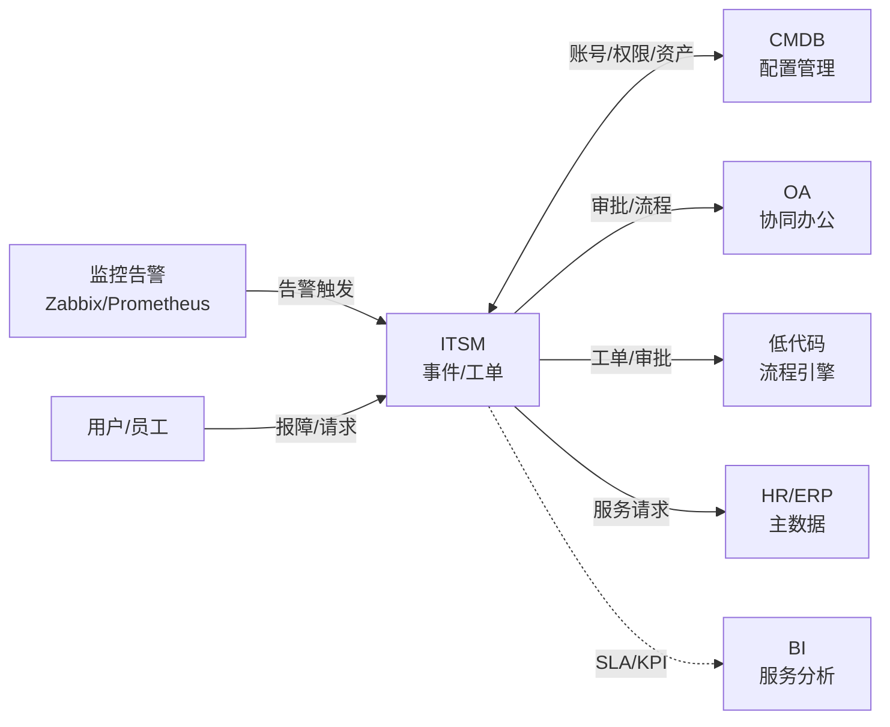
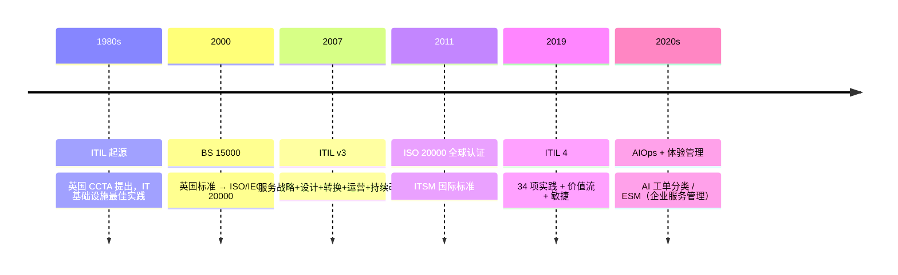
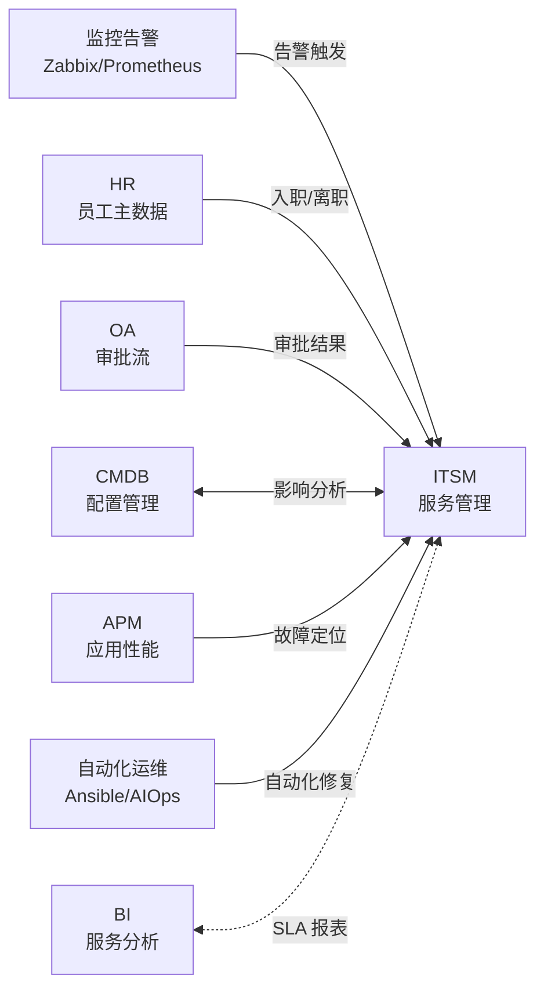

<!--
module:
  parent: application-systems
  slug: application-systems/06-specialized/itsm
  type: article
  category: 主模块子文章
  summary: ITSM（IT Service Management IT 服务管理）一句话定位：把 IT 部门的服务交付、事件管理、变更控制系统化的平台，是 IT 部门的"ERP"，其核心框架是 ITIL 4。
-->

# ITSM（IT Service Management IT 服务管理）

> 一句话定位：把 IT 部门的服务交付、事件管理、变更控制系统化的平台，是 IT 部门的"ERP"，核心框架是 **ITIL 4**（Axelos/PeopleCert 管理的全球最佳实践库），目标是让 IT 从"救火队"变成"服务台"。

## 📌 全景图

## 📖 定义

ITSM（IT Service Management，IT 服务管理）是一套以**服务交付**为核心目标，将 IT 部门的日常运维、事件响应、变更发布、问题解决、知识沉淀、资产配置等服务活动系统化、流程化、可度量化的方法论 + 平台工具集合。其权威框架是 **ITIL 4**（Information Technology Infrastructure Library，IT 基础设施库），由英国政府 CCTA（后并入 Axelos，现由 PeopleCert 管理）于 1980 年代提出，是全球 80%+ Fortune 500 企业采用的 IT 服务管理最佳实践。

**与各系统的边界**：

- **vs 监控告警（Zabbix/Prometheus）**：监控告警管"设备/应用的指标与告警触发"（*问题已发生*），ITSM 管"工单流转、SLA 达成、服务请求处理"（*响应与解决*）。告警 → 自动开 ITSM 工单是最常见的集成模式
- **vs CMDB**：CMDB 是"IT 资产的配置管理数据库"（CI Configuration Item 配置项），是 ITSM 的"事实源"；ITSM 调用 CMDB 查"影响范围"（某交换机故障影响哪些业务系统），CMDB 是 ITSM 的核心依赖
- **vs OA / 工单系统**：OA 是"全员通用审批流"，ITSM 是"IT 专属服务流程"（含 SLA/事件级别/变更评估/CMDB 关联）；轻量工单系统只管"谁处理什么任务"，ITSM 还管"事件/问题/变更/服务级别"
- **vs 低代码/流程引擎**：低代码管"通用流程设计"，ITSM 把 ITIL 4 的"事件/问题/变更/服务请求"流程做成开箱即用的模板（最佳实践沉淀）
- **vs HR/ERP**：ITSM 是 IT 部门内部的"ERP"——HR 管员工全生命周期，ITSM 管 IT 服务全生命周期（账号开通 → 故障响应 → 服务请求 → 资产归还）

**在企业 IT 架构中的位置**：ITSM 与监控告警、CMDB、自动化运维（AIOps）并列为"IT 运维四大支柱"。ITSM 是 IT 部门的"服务交付中枢"——向上承接业务（用户报障、服务请求），向下指挥运维（事件分派、变更实施、问题解决）。Gartner 将 ITSM 归为 IT 运维管理软件（IT Operations Management）核心模块，与 ITAM（IT 资产管理）/ ITFM（IT 财务管理）/ ITOM（IT 运维管理）共同构成"IT 治理四件套"。

**典型数据量级**：成熟 ITSM 系统的数据量通常在 **50GB-5TB** 区间（量级参考，取决于员工规模与服务量）。工单主数据、CMDB 配置项、附件、知识库文章、SLA 履约记录是主要占用项；活跃用户从百人到上万人（典型中小企业 100-500 服务台用户，大型集团 5000-50000 IT 用户）。日均工单量在 100-10000+ 张，年度工单量在数万到百万级。CMDB 配置项数在 5 万-100 万级，是 ITSM 最大的存储占用项。

**ITSM 不擅长**：实时监控告警（监控告警平台）、代码级故障定位（APM）、安全威胁检测（SIEM/SOC）、IT 基础设施自动化（Ansible/IaC）、业务侧工单/审批（OA）、员工管理（HR/HCM）。

## 📜 历史脉络

**关键演进**：

- **1980s 起源**：英国政府 CCTA（Central Computer and Telecommunications Agency）开发 ITIL 第一版，解决"政府 IT 部门服务质量不可控"问题
- **2000 BS 15000**：英国国家标准 → 演化为 ISO/IEC 20000（ITSM 唯一国际标准）
- **2007 ITIL v3**：引入"服务生命周期"（Service Strategy / Design / Transition / Operation / Continual Improvement 五大阶段），全球大规模采用
- **2019 ITIL 4**：Axelos（已被 PeopleCert 收购）发布 ITIL 4，从"流程中心"转向"价值流 + 实践（Practices）"，融合 Agile/DevOps/Lean（34 项实践而非 26 个流程）
- **2020s AIOps + ESM**：AI 自动化工单分类、智能派单、知识推荐；ESM（Enterprise Service Management 企业服务管理）将 ITSM 理念扩展到 HR/财务/行政（员工服务"一处受理"）

**ITIL 4 的"34 项实践"**：ITIL 4 摒弃 ITIL v3 的"流程"思维，转向"实践"（Practice，更轻量、更敏捷），分三大类：
- **通用实践（General Practices））：8 项**（架构、改进、风险管理等）
- **服务管理实践（Service Management Practices）**：17 项（事件/问题/变更/SLA 等核心）
- **技术管理实践（Technical Management Practices））：9 项**（部署/基础设施/可用性等）

## 🔧 核心能力

ITSM 的能力围绕 ITIL 4 的 17 项服务管理实践展开，最核心的 8 项：

- **服务台（Service Desk）**：用户接触点，单点受理报障/请求/咨询，ITIL 4 强调"服务台是 IT 部门的门面"
- **事件管理（Incident Management）**：在最短时间内恢复服务（SLA 内），不找根因（P1 级故障 4 小时内恢复是行业基准）
- **问题管理（Problem Management）**：找根因，预防重复事件（事件是"治标"，问题是"治本"）
- **变更管理（Change Management）**：变更评估（风险/影响）→ CAB 审批 → 实施 → 回退
- **服务级别管理（SLM / SLA）**：服务等级协议（响应时间/解决时间），违约罚款/服务抵扣
- **CMDB（Configuration Management Database）**：配置管理数据库，IT 资产的"事实源"
- **知识库（Knowledge Management）**：FAQ/SOP/Runbook，降低重复工单（80% 工单应通过自助解决）
- **服务请求管理（Service Request）**：标准化服务请求（账号开通/权限申请/设备申领）

**8 项能力详解**：

**1. 服务台（Service Desk）**：用户与 IT 部门的"唯一接触点"（SPOC Single Point of Contact），三种形态（本地/集中/虚拟）+ 三种级别（L1 一线 70-80% 工单 / L2 二线 15-25% / L3 三线 5%）。关键指标：首响时间 / MTTR / 一次解决率 FCR。演进：电话/邮件 → 微信/钉钉 → AI 聊天机器人（80% 工单自动解决）。

**2. 事件管理（Incident Management）**：非计划中断服务质量的事件（服务器宕机/邮箱无法登录/打印机故障）。优先级 P1-P4：P1 业务中断（响应 15 分钟/解决 4 小时）/ P2 业务严重受损（1 小时/1 工作日）/ P3 单用户受损（4 小时/3 工作日）/ P4 咨询（8 小时/5 工作日）。重大事件（影响 ≥ 30% 用户或 ≥ 100 万营收/小时损失）启动 War Room，CEO/CIO 介入。关键指标：MTTR / MTRS / SLA 达成率（≥ 95%）。与问题管理的关系：事件"治标"（恢复服务），问题"治本"（找根因），事件过多自动升级为问题。

**3. 问题管理（Problem Management）**：多个事件的"根因"（如"邮件服务器每周一上午 9 点慢"是问题，单次"邮箱慢"是事件）。流程：问题识别 → RCA 根因分析 → KEDB 已知错误 → 预防措施。两种方式：主动（Proactive，从数据找趋势）+ 被动（Reactive，从事件找根因）。关键指标：问题平均解决时间 / 重复事件率（< 10%）/ KEDB 命中率。

**4. 变更管理（Change Management）**：对 IT 环境的任何增加/修改/删除（部署新系统/调整配置/打补丁）。三类变更：标准变更（Standard，预授权模板，占 70%+）/ 正常变更（Normal，CAB 评审）/ 紧急变更（Emergency，快速通道）。CAB 评审：每周固定会议，IT/业务/安全代表投票。流程：RFC（Request For Change）→ 风险评估 → CAB 评审 → 实施 → 验证 → 关闭。关键指标：变更成功率（≥ 95%）/ 变更引发事件率（< 5%）/ 平均变更周期。红线：未走变更直接修改生产环境 = 事故根因之一（80% 重大事故源于未授权变更）。

**5. SLA（Service Level Agreement）**：三层协议（SLA 与业务/OLA 内部 IT 团队间/UC 外部供应商）。核心指标：可用率（99.9% = 年宕机 8.7 小时）/ 性能（响应时间/吞吐）/ 质量（错误率/缺陷数）。违约处理：服务抵扣（5-20% 月费）/ 服务改进计划 SIP / 罚款。关键指标：SLA 达成率（≥ 95%）/ 违约事件数 / 抵扣金额。

**6. CMDB（Configuration Management Database）**：IT 资产的"配置项（CI）"数据库，含服务器/网络/应用/数据库/中间件/文档。核心属性：CI 标识、名称、类型、状态、责任人、位置、关联关系、变更历史。关系模型：应用 → 服务器 → 机柜 → 机房（物理）/ 应用 → 数据库 → 存储（逻辑）/ A 应用依赖 B 服务（依赖）。关键能力：影响分析（某交换机故障影响哪些业务）/ 关系可视化（拓扑图）/ 变更追溯。实施陷阱："CMDB 黑洞"（填了几十万条但无人用/不准/过期）。关键指标：CI 覆盖率（≥ 90%）/ 数据准确率（≥ 85%）/ 关系完整度。

**7. 知识库（Knowledge Management）**：FAQ（高频问题）/ SOP（标准操作流程）/ Runbook（运维手册）/ KEDB（已知错误库）。价值：80% 工单应通过自助知识库解决（行业基准）。最佳实践：知识库文章与工单关闭挂钩（关单前强制选 KB）/ AI 推荐（基于工单内容自动推荐）。关键指标：命中率（搜索后工单关闭率 ≥ 40%）/ 贡献数 / 评分。

**8. 服务请求管理（Service Request Management）**：标准化服务请求（账号开通/权限申请/设备申领/新装软件/数据查询）。价值：80% 服务请求应走自助门户（员工 7×24 提交）。流程：服务目录展示 → 用户自助下单 → 自动审批（按规则）→ 自动开通。关键指标：自助服务率（≥ 70%）/ 平均交付时间 / 满意度。

按企业关注度排序，ITSM 最常被列为「核心采购理由」的前 5 项是：事件 SLA 达成、CMDB 准确性、自助服务率、知识库命中率、与监控告警集成。

## 📊 关键模块详解

### 服务台（Service Desk）

服务台是 IT 部门与用户的"唯一接触点"，是 ITSM 的"门面"：

- **多渠道接入**：电话、邮件、Web 表单、IM 集成（钉钉/企微/飞书）、AI 聊天机器人
- **工单分类**：事件（故障）/ 服务请求（开账号等）/ 问题（根因调查）/ 变更（部署请求）/ 咨询
- **工单全生命周期**：创建 → 分派 → 处理 → 升级 → 关闭 → 满意度调查
- **SLA 计时**：工单优先级决定 SLA 倒计时，逾期自动升级 + 邮件提醒
- **关键指标**：工单量 / 平均处理时间 / SLA 达成率 / 一次解决率 / 用户满意度（CSAT）

**L1/L2/L3 分级处理**：
- **L1 一线服务台（接单+基础处理）**：70-80% 工单（重置密码/账号解锁/打印机问题）
- **L2 二线支持（专业领域）**：15-25% 工单（应用/数据库/网络专家）
- **L3 三线支持（厂商/外部专家）**：5% 工单（产品 bug/复杂架构问题）
- **升级规则**：L1 处理超 30 分钟未解决 → 升级 L2；L2 超 2 小时 → 升级 L3

### 事件管理（Incident Management）

事件管理的核心 KPI 是 **MTTR**（Mean Time To Restore 平均恢复时间）和 **SLA 达成率**：

- **事件分级标准**：
  - **P1 紧急（Critical）**：核心业务完全中断（年发生 5-20 起），响应 15 分钟 / 解决 4 小时
  - **P2 高（High）**：核心业务严重受损 / 非核心业务完全中断，响应 1 小时 / 解决 1 工作日
  - **P3 中（Medium）**：非核心业务受损 / 单用户完全中断，响应 4 小时 / 解决 3 工作日
  - **P4 低（Low）**：咨询 / 单用户部分受损，响应 8 小时 / 解决 5 工作日
- **重大事件（Major Incident）**：影响 ≥ 30% 用户 或 ≥ 100 万营收/小时损失 → 启动 War Room（战时指挥部），CEO/CIO 介入
- **与监控告警集成**：Zabbix/Prometheus 触发 P1 告警 → 自动开 ITSM 工单 → 短信/电话通知 on-call 工程师
- **关键指标**：MTTR / MTRS（Mean Time To Respond 平均响应时间）/ SLA 达成率（行业基准 ≥ 95%）/ 重大事件数

### 问题管理（Problem Management）

问题管理是"治本"——找根因、预防重复事件：

- **RCA 方法**：5 Whys（连续追问 5 次）/ 鱼骨图（人机料法环测 6 维度）/ 故障树（自顶向下）/ Pareto（80/20）
- **KEDB（Known Error Database 已知错误库）**：已识别根因 + 临时/永久解决方案状态
- **流程**：事件聚集 → 问题识别 → RCA → 已知错误 → 临时方案 → 永久方案 → 关闭
- **价值**：某银行实施问题管理后，重复事件率从 30% 降到 5%

### 变更管理（Change Management）

变更是"IT 运维的高风险动作"，管理好变更就管理好 70% 事故：

- **三类变更（按 ITIL 4 分类）**：
  - **标准变更（Standard Change）**：低风险预定义流程（如重置密码/批量开账号），预授权无需评审，占总变更 70-80%
  - **正常变更（Normal Change）**：需 RFC + CAB 评审（如系统升级/数据库迁移），占总变更 20-30%
  - **紧急变更（Emergency Change）**：应急修复（如安全漏洞紧急补丁），快速通道但事后必须 review
- **CAB 评审**：每周固定会议，IT/业务/安全代表投票；高风险变更需多部门评审
- **变更窗口**：生产环境变更通常限定在周二/周四夜间（避开周一/周五/节假日）
- **回退方案**：每个变更必须有"回退计划"，变更失败立即回退
- **关键指标**：变更成功率（≥ 95%）/ 变更引发事件率（< 5%）/ 平均变更周期
- **红线**：未走变更直接修改生产环境 = 事故根因之一（80% 重大事故源于未授权变更）

### SLA 管理（Service Level Management）

SLA 是 IT 部门与业务/客户的"契约"：

- **三层 SLA 模型**：SLA（与业务/客户）+ OLA（IT 内部团队间）+ UC（与外部供应商）
- **核心指标**：可用率（99.9% = 年宕机 8.7 小时 / 99.95% = 4.4 小时 / 99.99% = 52 分钟）/ 性能（响应时间/吞吐）/ 质量（错误率/缺陷数）
- **违约处理**：服务抵扣（5-20% 月费）+ 服务改进计划 SIP（连续 3 月未达）+ 罚款（核心系统宕机 > 4 小时）
- **报告频率**：月度 SLA 报告（业务/客户）+ 实时 SLA 看板（IT 内部）

### CMDB（Configuration Management Database）

CMDB 是 ITSM 的"事实源"——没有 CMDB，ITSM 就是"信息孤岛"：

- **CI 类型**：硬件 CI（服务器/存储/网络/PC）+ 软件 CI（OS/中间件/数据库/应用）+ 业务 CI（业务服务/部门）+ 文档 CI（合同/SLA/SOP）+ 人员 CI
- **CI 关系模型**：物理关系（应用 → 服务器 → 机柜 → 机房）+ 逻辑关系（应用 → 数据库 → 存储）+ 依赖关系（A 应用依赖 B 服务）
- **三大核心场景**：影响分析（某交换机故障影响哪些业务）/ 变更评估（变更的影响范围）/ 故障定位（关联 CI 自动找上下游）
- **数据来源**：自动发现（Agent/扫描器）+ 手工录入（80% 数据来源）+ 集成同步（监控/云平台/自动化平台）
- **关键指标**：CI 覆盖率（≥ 90%）/ 数据准确率（≥ 85%）/ 关系完整度

### 知识库（Knowledge Management）

知识库是"降低重复工单"的关键武器：

- **知识类型**：FAQ（高频问题）+ SOP（标准操作流程）+ Runbook（运维手册）+ KEDB（已知错误库）
- **贡献机制**：关单时强制选 KB + 全员贡献（每年 ≥ 3 篇）+ 专家审核
- **AI 推荐**：智能搜索（基于工单内容自动推荐 KB）+ 知识图谱（KB 关联关系自动识别）
- **关键指标**：命中率（搜索后工单关闭率 ≥ 40%）/ 贡献数 / 评分

### 服务请求管理（Service Request Management）

服务请求是"标准化高频请求"——账号开通/权限申请/设备申领：

- **服务目录（Service Catalog）**：所有可申请的服务清单（按部门/角色展示）
- **流程自动化**：用户自助下单 → 规则引擎自动审批 → 自动执行
- **集成场景**：账号开通（HR 推送 → ITSM 自动开邮箱/AD/系统权限）/ 设备申领（员工提交 → 审批 → 工程师上门）/ 权限申请（员工申请 → 主管审批 → 系统自动开通）
- **关键指标**：自助服务率（≥ 70%）/ 平均交付时间 / 满意度

## 🏆 选型决策

### 自研 vs 商用

| 维度 | 自研 ITSM | 商用 ITSM |
|------|---------|---------|
| 适用规模 | 大型集团（万人以上）有定制需求 | 中小企业（百-千人），快速上线 |
| 优势 | 100% 定制化、与内部系统深度集成 | ITIL 4 最佳实践沉淀、SLA 保障、迭代快 |
| 劣势 | 投入大（千万级）、周期长（2-3 年）、合规风险 | 定制受限（5-15%）、License 长期成本 |
| 典型代表 | 阿里/字节/腾讯/华为自研 | ServiceNow / Jira Service Management / BMC Remedy / Freshservice |
| 决策阈值 | 万人员工 + 特殊合规 + 长期投入 → 自研；否则 → 商用 | - |

### 主流厂商对比

| 厂商 | 定位 | 优势 | 劣势 | 适用规模 |
|------|------|------|------|---------|
| **ServiceNow** | 全球 ITSM 龙头（NYSE: NOW） | 平台化、生态强、ITIL 4 完整实践、AI 能力领先 | 贵（人均 100-300 美元/年）、中国本地化弱 | 跨国集团/大型企业 |
| **Jira Service Management（Atlassian）** | 敏捷 + ITSM 一体 | 与 Jira 软件研发无缝衔接、Atlassian 生态、价格适中 | ITIL 实践深度弱于 ServiceNow | 互联网/科技公司 |
| **BMC Remedy** | 老牌企业级 ITSM | 功能深度、强合规、行业案例多 | UI 传统、实施贵、迭代慢 | 大型集团/金融/政府 |
| **Freshservice** | SaaS ITSM 新锐 | 价格适中、UI 现代、AI 能力、移动端好 | 国内访问慢、深度合规不足 | 中小企业/跨国分支 |
| **ManageEngine ServiceDesk Plus** | 中端商用 | 性价比高、本地化部署、CMDB 内置 | 高端能力弱于 ServiceNow | 中型企业 |
| **听云 / 优云** | 国内 APM + ITSM | 国内本地化、移动端、APM + ITSM 一体 | 国际化弱、深度 ITIL 实践不足 | 国内企业 |
| **蓝凌 / 泛微** | OA + ITSM 轻集成 | 与 OA 一体、流程引擎强、本土化 | ITIL 实践深度不足 | 已有 OA 的国内企业 |
| **钉钉智能服务 / 企微 ITSM** | 协同 + 轻 ITSM | 钉钉/企微生态、移动端原生、价格低 | 深度 ITIL 实践弱、需配合专业 ITSM | 小型企业 |

### 选型决策树（5 层）

1. **先看规模**：员工 < 500 → 国内 SaaS（听云/优云/ManageEngine）/ 协同工具内嵌；500-5000 → ManageEngine / Freshservice / Jira SM；> 5000 → ServiceNow / BMC Remedy
2. **再看合规需求**：跨国集团 → ServiceNow / BMC Remedy（多语言多合规）；金融/政府 → BMC Remedy / 国产私有化
3. **再看研发生态**：Jira 客户 → Jira Service Management（无缝衔接）；非研发主导 → ServiceNow / ManageEngine
4. **再看预算与 TCO**：5 年 TCO 是否在 ROI 测算范围内？ServiceNow vs 国内 SaaS 差距通常 5-10 倍
5. **最后看实施能力**：是否有 ITIL 认证顾问？行业案例 ≥ 5 个？

## 🚨 实施陷阱 / 反模式

### 1. CMDB 黑洞陷阱

**现象**：CMDB 实施 1 年填了几十万条 CI，但无人用 / 数据不准 / CI 过期；CMDB 沦为"数据垃圾场"。
**根因**：CMDB 是"治理项目"不是"录入项目"——80% CI 靠手工录入、运维成本高、CI 关系不清晰、数据很快过期；IT 部门为应付 KPI 突击录入，录入完没人维护。
**规避**：CMDB 治理投入应占实施总成本 **30-40%**；优先用自动发现工具（Agent/扫描器）覆盖 50%+ CI；建立 CI Owner 机制（每个 CI 有明确责任人）；CMDB 数据纳入月度审计（数据准确率 < 80% 扣绩效）。

### 2. SLA 过度承诺陷阱

**现象**：IT 部门为"拿下合同"承诺 99.99% SLA（年宕机 52 分钟），实际只能 99.5%（年宕机 43 小时）；季度违约罚款 100 万+。
**根因**：SLA 承诺未基于"实际能力评估"，销售/售前拍脑袋承诺；IT 部门未参与 SLA 谈判。
**规避**：SLA 谈判必须有 IT 部门参与；SLA 承诺应基于历史 6 个月 SLA 达成率 + 改进空间；高 SLA 承诺必须有技术保障（冗余架构/灾备/7×24 on-call）。

### 3. 流程形式化陷阱

**现象**：ITSM 实施 1 年，流程跑通了但"两张皮"——员工仍打电话不走工单、变更不走变更流程、问题不 RCA；CMDB 数据 50% 靠补录。
**根因**：流程与现实脱节（流程设计复杂 / 与员工习惯不符 / 无激励）；变更管理阻力大（业务部门嫌麻烦）；IT 部门"重流程轻结果"。
**规避**：流程设计"少即是多"（核心 5-8 个流程而非 30+）；流程上线前做"种子用户试点"；流程执行纳入 KPI（工单系统化率 ≥ 90%）；流程每季度 review 优化。

### 4. 与监控告警边界混乱

**现象**：ITSM 实施后，监控告警触发后没人开工单（on-call 工程师只处理告警不处理工单）；或监控告警被 ITSM "抢"了职责（监控团队没活干）。
**根因**：ITSM 与监控告警的边界不清——监控告警管"发现"，ITSM 管"响应"；告警 → 工单自动化的流程未设计；on-call 工程师对 ITSM 抵触。
**规避**：明确边界——监控告警管"告警检测/通知"，ITSM 管"工单流转/SLA 达成"；建立"告警 → 工单"自动化规则（Zabbix Webhook → ITSM API 自动开工单）；on-call 工程师使用 ITSM 移动 App 直接处理工单。

### 5. 自研 ITSM 烂尾陷阱

**现象**：某大型集团投入 8000 万自研 ITSM，3 年后只完成工单 + 知识库，事件管理 / 变更管理 / CMDB 全部"烂尾"；被迫转向 ServiceNow。
**根因**：ITSM 是"行业知识沉淀 + 长期迭代"的产物——ServiceNow 沉淀了 15 年 ITIL 实践经验；自研 ITSM 在"ITIL 实践深度/全球案例/SLA 合规"上难以匹敌。
**规避**：除非有"特殊合规需求"（如军工/金融）且"10 年 + 5 亿+"长期投入，否则不建议自研 ITSM；自研 ITSM 的真实成本是商用 ITSM 的 5-10 倍。

### 6. 知识库无内容陷阱

**现象**：ITSM 上线 1 年，知识库空空如也（< 100 篇）；用户搜索"重置密码"找不到答案，仍打电话到服务台。
**根因**：知识库贡献机制不健全——工程师不愿写（没 KPI）/ 不会写（缺培训）/ 写了没人用（搜索不到）；知识库与工单关闭未挂钩。
**规避**：知识库与工单关闭强挂钩（关单前必须选 KB）；知识贡献纳入工程师 KPI（每年 ≥ 3 篇）；AI 推荐（基于工单内容自动推荐 KB）；定期清理过期知识（季度 review）。

### 7. 服务台过度外包陷阱

**现象**：某企业 L1 服务台 100% 外包，3 个月后用户满意度从 85% 降到 40%（外包人员不懂业务/响应慢/态度差）。
**根因**：L1 服务台是"用户对 IT 的第一印象"——外包人员流动性高、业务理解浅、沟通能力参差不齐；过度外包 = 服务质量失控。
**规避**：L1 服务台 30-50% 内部员工 + 50-70% 外包；外包人员必须经过 3 个月业务培训 + 季度考核；关键岗位（L1 主管）必须内部员工。

### 陷阱共性规律

行业研究统计 ITSM 项目失败率约 **30-50%**，失败原因中：

- 约 **30%** 源自「CMDB 黑洞」（数据治理陷阱）
- 约 **25%** 源自「流程形式化」（流程落地陷阱）
- 约 **20%** 源自「SLA 过度承诺 + 服务台能力不足」（能力陷阱）
- 约 **15%** 源自「与监控告警 / OA / HR 边界混乱」（集成陷阱）
- 约 **10%** 源自「自研烂尾」（决策陷阱）

规避核心：「CMDB 治理先行 + 流程少而精 + SLA 基于能力 + 与监控告警分工明确 + 商用优先」是 ITSM 成功的 5 大前置条件。

## 🛤️ 学习路线

### 入门（0-3 个月，建立基础认知）

1. **第 1-2 周**：阅读 ITIL 4 Foundation 官方教材（PeopleCert 出版），理解 34 项实践 + 价值流
2. **第 3-4 周**：阅读《ITIL 4 实战》《数字化时代的 IT 服务管理》，了解行业最佳实践
3. **第 5-8 周**：试用一款 SaaS ITSM（Freshservice 免费版），亲自体验工单/事件/SLA
4. **第 9-10 周**：研究 2-3 家头部企业案例（如华为 ITSM、阿里服务台、字节 IT 服务）
5. **第 11-12 周**：参加 ITIL 4 Foundation 认证考试（PeopleCert 官方认证）

### 进阶（3-12 个月，深度技能）

1. **3-6 个月**：选择一个细分模块（事件管理/变更管理/CMDB）做深度研究——ITIL 4 实践 + 行业最佳实践 + 厂商方案对比
2. **6-9 个月**：参与 1 个 ITSM 选型项目，从 RFP 撰写到 POC 验证到商务谈判全流程
3. **9-12 个月**：学习 ITIL 4 中级模块（Managing Professional Stream 的 4 个模块：Create Deliver Support / Drive Stakeholder Value / High Velocity IT / Direct Plan Improve）

### 精通（12 个月以上，专家级）

1. **12-24 个月**：主导 1 个完整 ITSM 实施项目（≥ 1000 人规模），覆盖事件管理/变更管理/CMDB/SLA
2. **24-36 个月**：建立 ITSM 选型方法论（决策树/RFP 模板/POC 脚本），成为公司 ITSM 选型的"内部顾问"
3. **36 个月+**：横向扩展到"IT 运维管理（ITOM）"全栈（监控告警/AIOps/自动化运维/ITFM）

### 学习资源

- **认证**：ITIL 4 Foundation（PeopleCert）/ ITIL 4 Managing Professional（MP）/ ITIL 4 Strategic Leader（SL）/ ISO 20000 主任审核员
- **书籍**：《ITIL 4 实战》《数字化时代的 IT 服务管理》《IT 服务管理标准》（ISO 20000）
- **报告**：Gartner ITSM 魔力象限 / Forrester ITSM Wave / IDC 中国 ITSM 市场报告
- **会议**：Pink Elephant ITSM Conference / itSMF（IT Service Management Forum）年会 / 中国 IT 服务管理大会
- **社区**：itSMF 中国分会 / LinkedIn ITSM 话题 / ServiceNow Community

## 🔗 上下游关系

- **上游**：监控告警（告警 → 工单自动触发）、HR（员工入职/离职 → 账号开通/关停）、OA（变更审批结果回写）
- **下游**：CMDB（影响分析/故障定位）、APM（应用故障深层定位）、自动化运维（自动修复/自动开通）、BI（SLA 达成率/工单分析）
- **横向**：OA（流程引擎/审批）、ERP（IT 资产采购）、HR（员工主数据）

**集成要点**：
- **ITSM ↔ 监控告警**：告警 → 自动开工单（P1 告警自动开 P1 工单 + 短信通知 on-call）
- **ITSM ↔ CMDB**：双向同步 CI 数据；故障时自动关联影响范围
- **ITSM ↔ HR**：员工入职 → HR 推送 → ITSM 自动开账号；员工离职 → HR 推送 → ITSM 自动关停账号
- **ITSM ↔ OA**：变更审批走 OA 流程，审批结果回写 ITSM 触发实施
- **ITSM ↔ APM**：APM 检测应用故障 → 自动开 ITSM 工单 + 推送调用链/日志
- **ITSM ↔ 自动化运维**：服务请求触发 Ansible Playbook 自动开通

**集成模式选择**：
- **紧耦合（实时双向）**：ITSM 与监控告警的告警 → 工单（WebSocket/Webhook）— P1 告警秒级响应
- **松耦合（定时批处理）**：ITSM 与 CMDB 每日同步 — 适合 CMDB 数据量大的场景
- **事件驱动**：HR Kafka 推送员工事件 → ITSM 自动触发 — 适合云原生架构
- **iPaaS 集成平台**：ITSM 与 HR/ERP/OA 异构系统连接 — 适合多系统集成场景

## ⚖️ 关键考量

- **ITIL 4 框架先行**：ITSM 不是"工具"是"方法论 + 工具"——没有 ITIL 4 认知就上 ITSM = 形式主义
- **CMDB 治理是核心**：CMDB 是 ITSM 的"骨架"，CMDB 不准 = 故障定位/变更评估全是错的
- **SLA 基于能力**：SLA 不是"承诺越多越好"而是"能稳定达成才有价值"——过度承诺 = 违约罚款
- **流程少而精**：ITSM 流程设计"少即是多"——5-8 个核心流程覆盖 80% 场景，30+ 流程 = 形式主义
- **服务台是关键门面**：服务台是 IT 部门的"第一印象"，服务质量差 = IT 部门被吐槽
- **变更管理是红线**：80% 重大事故源于未授权变更——变更管理不是"阻碍业务"是"保护业务"
- **与监控告警分工明确**：监控告警管"发现"，ITSM 管"响应"，告警 → 工单自动化是关键

## 🎯 选型指南

| 企业类型 | 推荐 | 理由 |
|---------|------|------|
| 跨国集团（万人+） | ServiceNow / BMC Remedy | 全球合规、ITIL 4 完整实践、生态强 |
| 大型集团（5000+） | ServiceNow / ManageEngine | 平台化、行业方案成熟 |
| 中型企业（500-5000） | ManageEngine / Freshservice / Jira SM | 性价比、行业方案、移动端 |
| 小型企业（< 500） | 国内 SaaS（听云/优云）/ 协同工具内嵌 | 快速上线、成本低、移动端 |
| 互联网/科技公司 | Jira Service Management | 与 Jira 研发无缝衔接 |
| 金融/政府 | BMC Remedy / 国产私有化 | 合规、强 SLA、深度案例 |
| 制造业（大型） | ServiceNow / ManageEngine | 与 ERP/MES 集成、流程成熟 |

**自检维度**：

1. 是否覆盖 ITIL 4 核心实践（事件/问题/变更/SLA/CMDB/知识）？
2. CMDB 自动发现能力（Agent/扫描器）？
3. 与监控告警/APM/HR/OA 的集成能力？
4. 移动端体验（工程师 70% 操作在移动端）？
5. 行业案例与实施商能力？

**红线**：

- 无 ITIL 4 顾问经验 = 慎选
- 无 CMDB 自动发现能力 = 慎选
- 移动端体验差（APP 评分 < 4.0）= 慎选
- 实施商无同行业案例 = 慎选

**RFP 模板要点**：建议 RFP 覆盖 **5 大类 30+ 评分项**：

- **功能类（30%）**：服务台、事件管理、问题管理、变更管理、CMDB、知识库、SLA、服务请求、自助门户
- **性能类（15%）**：并发用户数（500-5000+）、工单创建响应时间（< 1 秒）、报表生成时间、SLA 计时准确度
- **集成类（25%）**：监控告警（Zabbix/Prometheus）/ HR / OA / CMDB / APM 标准接口、REST API、消息队列、iPaaS
- **合规类（15%）**：ITIL 4 / ISO 20000 / 等保三级 / SOC 2 / GDPR、审计日志、权限模型、电子签名
- **服务类（15%）**：行业最佳实践参考、客户案例、升级策略、SLA 承诺（99.9%+ 可用性）、实施伙伴能力

**TCO 估算要点**（1000 人企业 5 年 TCO）：

- **SaaS ITSM（ServiceNow）**：800-2500 万（License 60% + 实施 25% + 集成 10% + 运维 5%）
- **国内 SaaS（听云/优云/ManageEngine）**：100-400 万
- **私有化（BMC Remedy / ServiceNow 私有化）**：500-1500 万一次性 + 100-200 万/年运维
- **自研**：5000 万-1 亿 + 1000 万/年级运维

## ⚠️ 常见陷阱

- **「ITSM 只是个工单系统」**：ITSM 不只是工单，是 IT 服务全生命周期管理（事件/问题/变更/SLA/CMDB/知识）。只用工单 = 浪费 80% 价值
- **「CMDB 填完就行」**：CMDB 是"治理项目"不是"录入项目"——填完不维护 = 数据垃圾场
- **「SLA 越严格越好」**：SLA 必须基于能力评估——99.99% SLA 没技术保障 = 违约罚款
- **「流程越多越规范」**：流程"少即是多"——5-8 个核心流程覆盖 80% 场景，30+ 流程 = 形式主义
- **「服务台全部外包」**：L1 服务台是 IT 门面——过度外包 = 服务质量失控
- **「变更管理阻碍业务」**：80% 重大事故源于未授权变更——变更管理不是阻碍业务，是保护业务
- **「ITSM 与监控告警抢活」**：监控告警管"发现"，ITSM 管"响应"——分工明确 + 自动化是关键

## 📚 参考来源

- **ITIL 4 官方框架**：PeopleCert/Axelos, "ITIL 4 Foundation", 2019。ITIL 4 是 ITSM 全球最佳实践框架，34 项实践 + 价值流，是 ITSM 行业的"圣经"（https://www.axelos.com / https://www.peoplecert.org）
- **ISO/IEC 20000 标准**：ISO, "ISO/IEC 20000-1:2018 Information technology — Service management"。ITSM 唯一国际标准，ITIL 的标准化版本（https://www.iso.org）
- **Gartner ITSM 魔力象限 2024**：Gartner, "Magic Quadrant for IT Service Management Tools", 2024。ServiceNow 领导者，Atlassian/BMC/Freshworks/Micro Focus 等市场格局（https://www.gartner.com）
- **Forrester Wave™ ITSM 2024**：Forrester, "The Forrester Wave™ for IT Service Management, Q4 2024"。从战略/当前产品、市场表现维度评估 ITSM 厂商（https://www.forrester.com）
- **ServiceNow 官方文档**：ServiceNow, "IT Service Management Product Documentation"。全球 ITSM 龙头的产品最佳实践（https://docs.servicenow.com）
- **《ITIL 4 实战》**：Jan Van Bon 主编，ITIL 4 实战指南，国内 ITSM 从业者入门必读
- **《数字化时代的 IT 服务管理》**：刘亿舟 等著，结合 ITIL 4 与中国企业实践的本土化参考

---

← [返回: 06 专项支持](../README.md) | [返回: 业务应用系统](../../README.md)

## 📊 本节统计

- **核心能力**：8 大模块（服务台 / 事件管理 / 问题管理 / 变更管理 / SLA / CMDB / 知识库 / 服务请求）
- **ITIL 4 实践**：34 项（通用实践 8 + 服务管理实践 17 + 技术管理实践 9）
- **核心方法论**：5 Whys / Fishbone / Fault Tree / Pareto
- **典型数据量级**：50GB-5TB / 活跃用户百人-万人 / 日均工单 100-10000+ / CMDB CI 5 万-100 万
- **核心边界**：5 类（vs 监控告警 / vs CMDB / vs OA / vs 低代码 / vs HR/ERP）
- **事件分级**：4 级（P1 紧急 / P2 高 / P3 中 / P4 低）
- **SLA 基准**：可用率 99.9%（年宕机 8.7 小时）/ P1 响应 15 分钟解决 4 小时
- **变更分级**：3 类（标准变更 70-80% / 正常变更 20-30% / 紧急变更）
- **集成架构**：6 类（ITSM-监控告警 / ITSM-CMDB / ITSM-HR / ITSM-OA / ITSM-APM / ITSM-自动化）
- **集成模式**：4 类（紧耦合 / 松耦合 / 事件驱动 / iPaaS）
- **关键考量**：7 维度（ITIL 4 先行 / CMDB 治理 / SLA 基于能力 / 流程少而精 / 服务台门面 / 变更管理红线 / 与监控告警分工）
- **选型自检维度**：5 项（ITIL 4 覆盖 / CMDB 自动发现 / 集成生态 / 移动端 / 行业案例）
- **RFP 评分项**：5 大类 30+ 项（功能 30% / 性能 15% / 集成 25% / 合规 15% / 服务 15%）
- **TCO 估算**（1000 人）：SaaS 国际 800-2500 万 / 国内 SaaS 100-400 万 / 私有化 500-1500 万 / 自研 5000 万-1 亿
- **常见陷阱**：7 类（ITSM ≠ 工单 / CMDB 黑洞 / SLA 过度承诺 / 流程形式化 / 服务台外包 / 变更管理 / 与监控告警抢活）
- **陷阱统计**：ITSM 项目失败率 30-50%（30% CMDB / 25% 流程 / 20% 能力 / 15% 集成 / 10% 决策）
- **所属价值链**：06 专项支持
- 关联系统：ERP（[ERP 深读](../../05-operations/erp/README.md)）/ HR（[HR 深读](../../05-operations/hr/README.md)）/ OA（[OA 深读](../../05-operations/oa/README.md)）/ LIMS（[LIMS 深读](../lims/README.md)）/ PMS（[PMS 深读](../pms/README.md)）