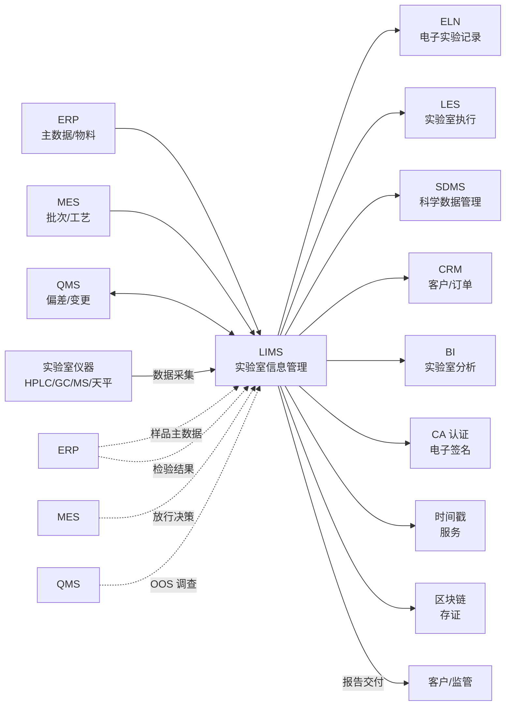
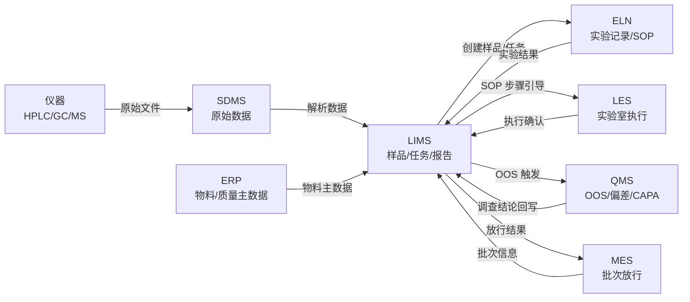

<!--
module:
  parent: application-systems
  slug: application-systems/06-specialized/lims
  type: article
  category: 主模块子文章
  summary: 一份按业务场景梳理的 LIMS 速查手册：从"纸质记录"到"实验全程数字化"。
-->

# LIMS · 实验室信息管理系统

> 一份按业务场景梳理的 LIMS 速查手册：从"纸质记录"到"实验全程数字化"。

---

## 一、一句话定位

**LIMS（Laboratory Information Management System，实验室信息管理系统）**：管理实验室从样品接收到结果报告的完整流程，特别适合有大量检测任务的行业（医药/食品/环保/检测机构）。

---

## 二、核心功能（6 大模块）

| 模块 | 功能 | 价值 |
|------|------|------|
| **样品管理** | 接样、编号、流转、留样 | 全程可追溯 |
| **检测任务** | 任务分配、检测方法、仪器预约 | 提升检测效率 |
| **数据采集** | 仪器数据自动采集、原始记录 | 减少手工录入 |
| **质量管理** | 质控样、平行样、加标回收 | 满足 ISO 17025 |
| **报告生成** | 自动出报告、电子签发 | 减少报告错误 |
| **合规审计** | GLP / GMP / 21 CFR Part 11 | 满足法规 |

---

## 三、典型行业应用

| 行业 | 重点 |
|------|------|
| **医药** | 稳定性研究、临床试验、生物分析 |
| **食品** | 营养成分、农残、微生物 |
| **环境监测** | 水质、土壤、空气 |
| **第三方检测** | 大批量样品、高通量 |
| **材料/化工** | 物理性能、化学分析 |
| **法医/司法** | 证据保管链、鉴定报告 |

---

## 四、典型流程（以药企为例）

```text
样品接收（接样员） ─→ 样品登记（编号）
       ↓
任务分配（实验主管）
       ↓
样品前处理 ─→ 上机检测（仪器自动采集数据）
       ↓
数据审核（QA 审核）─→ 异常复测
       ↓
报告生成（自动模板）─→ 主管复核
       ↓
电子签发（带电子签名）─→ 客户/内部归档
       ↓
样品留样（保存至有效期）
```

---

## 五、核心合规要求

| 法规 | 要求 |
|------|------|
| **GLP（Good Laboratory Practice）** | 实验室质量管理规范 |
| **GMP（药品生产质量管理规范）** | 制药行业 |
| **ISO 17025** | 检测 / 校准实验室能力 |
| **21 CFR Part 11** | 美国 FDA 电子记录电子签名 |
| **GLP / CNAS** | 中国认可实验室 |

---

## 六、主流厂商/产品对比

| 类型 | 代表产品 | 适用场景 |
|------|---------|---------|
| **国际大厂** | LabWare / STARLIMS / Thermo SampleManager | 大型集团 |
| **专业 LIMS** | LabVantage / Promium | 中大型 |
| **国内主流** | 智达 / 明源 / 三丰 | 中大型 |
| **行业垂直** | 药企版（智达 pharma）/ 检测版（明源）| 垂直 |
| **开源** | Bika / OpenSpecimen | 中小实验室 |

---

## 七、选型建议

| 场景 | 推荐 |
|------|------|
| 大型药企 | LabWare / STARLIMS |
| 中型检测机构 | LabVantage / 智达 |
| 食品 / 环保检测 | 明源 / 行业垂直 |
| 科研实验室 | OpenSpecimen / Bika 开源 |
| 预算有限 | Bika 开源 + 二次开发 |

---

## 八、实施关键点

1. **法规优先**：先确定要符合的法规（GLP / GMP / 17025）
2. **样品编码规则**：唯一编码 + 条码 / RFID
3. **仪器集成**：与主流实验仪器（HPLC/GC/MS）自动对接
4. **电子签名**：符合 21 CFR Part 11
5. **审计追踪**：所有操作必须有审计日志（不可删改）

---

## 📌 全景图

LIMS 在企业 IT 架构中处于"实验室数字化"的中枢位置——上游对接 ERP / MES / QMS 中的质量与生产数据，横向对接 ELN（电子实验记录本）/ LES（实验室执行系统）/ SDMS（科学数据管理系统），下游对接仪器（色谱/质谱/光谱/天平/PCR 等）与外部报告接收方（客户/监管）。



LIMS 把"**样品接收 → 任务分配 → 实验执行 → 仪器数据采集 → 结果审核 → 报告生成 → 电子签发 → 留样归档**"全流程数字化，是"从纸质记录到实验全程数字化"的桥梁。LIMS 与 QMS（质量管理系统）共同构成"实验室质量合规"双引擎——LIMS 负责"日常检测"，QMS 负责"偏差/OOS/变更/CAPA"；LIMS 与 MES（制造执行系统）通过"批次放行决策"联动，构成"生产-检验-放行"闭环。

---

## 🔧 核心能力

LIMS 的核心能力围绕"**实验室全流程数字化**"展开，是一个由 8 大子系统组成的有机整体：

| # | 子系统 | 核心功能 | 关键指标 |
|---|--------|---------|---------|
| 1 | **样品管理（Sample Management）** | 接样登记 / 唯一编码（条码/RFID）/ 状态机管理（待检→在检→已检→留样→销毁）/ 分装复检 / 留样 / 稳定性研究 | TAT / 丢失率 / 标识准确率 |
| 2 | **实验流程（Test Workflow）** | 任务分配 + SOP（药典 / 国标 / 内部方法）+ 仪器预约 / 检测员预约 / 实时记录 / 多人协同 / 试剂核销 | TAT / 任务按时完成率 / SOP 符合率 |
| 3 | **仪器集成（Instrument Integration）** | 色谱 / 质谱 / 光谱 / 天平 / pH 计 / 滴定仪 / PCR；接口协议：RS-232 / TCP / 文件落盘 / OPC / 厂商专用；自动采集 + 双向控制 | 仪器直连率 ≥ 70% / 录入错误率 < 0.1% |
| 4 | **数据采集（Data Acquisition）** | 原始数据 + 元数据 / 审计追踪（不可关闭/不可删除）/ 电子签名（PKI/CA 证书）/ 数据完整性 ALCOA+ | 数据完整率 / 审计追踪覆盖率 / 电子签名合规率 |
| 5 | **报告生成（Report Generation）** | 模板化（Word/PDF/HTML）+ 变量填充 + 自动生成 / 多级审核（检测员→复核→QA→主管→授权签字人）/ 电子签发 / CoA / CoC | 报告周转时间 / 报告错误率 / 客户满意度 |
| 6 | **质量控制（Quality Control）** | 质控样（空白/平行/加标回收/标准曲线/质控图）/ Westgard 规则（1₃S/2₂S/R₄S）/ 趋势分析 / OOS / OOT / 测量不确定度 | 质控合格率 / OOS 发生率 / 调查闭环率 |
| 7 | **合规管理（Compliance Management）** | 法规框架（GLP/GMP/ISO 17025/21 CFR Part 11）/ 审计追踪 / RBAC + 数据级权限 / 电子签名（三大条件）/ 数据保留（GMP 5 年 / 临床 10 年 / GLP 10 年） | 合规审计缺陷数 / 监管检查通过率 |
| 8 | **实验室数字化（Lab Digitalization）** | LIMS + ELN（实验记录）/ LIMS + LES（执行引导，制药）/ LIMS + SDMS（原始数据）/ LIMS + AI（异常识别 / 智能派单 / 调度优化）/ 移动化（PAD/手机） | 实验室数字化覆盖率 / 实验记录电子化率 / 报告无纸化率 |

**8 大子系统协同关系**：样品管理（入口）→ 实验流程（骨架）→ 仪器集成（数据源）→ 数据采集（真实性）→ 报告生成（交付物）→ 质量控制（合规底线）→ 合规管理（法务生命线）→ 实验室数字化（演进方向）。

**LIMS + ELN + LES + SDMS 实验室数字化架构**：



**LIMS + ELN + LES + SDMS 四大实验室系统的边界**（**2025 高频混淆点**）：

- **LIMS（Laboratory Information Management System）**：管理"样品 / 任务 / 结果 / 报告"的**结构化业务数据**（结构化字段 + 业务流程）
- **ELN（Electronic Lab Notebook）**：管理"实验记录 / SOP / 思考 / 观察"的**富文本实验数据**（文本 + 表格 + 图片 + 公式）
- **LES（Laboratory Execution System）**：管理"实时实验执行引导"的**强制 SOP 步骤**（制药行业，按 SOP 步骤强制逐步确认）
- **SDMS（Scientific Data Management System）**：管理"仪器原始文件"（色谱图 / 质谱图 / 光谱图）的**不可变原始数据**（满足 21 CFR Part 11 原始数据保留）

按企业关注度排序，LIMS 最常被列为「核心采购理由」的前 5 项是：**数据完整性合规**（21 CFR Part 11 / GMP）/ **检测流程数字化**（减少人工录入）/ **仪器数据自动采集**（降低错误率）/ **质量控制（QC）**（满足 ISO 17025）/ **报告自动化**（缩短 TAT）。

---

## 📊 关键模块详解

### 样品登记（Sample Registration）

样品登记是 LIMS 的"**入口**"——所有后续流程的起点：

- **接样来源**：客户委托（外部）/ 内部抽样（车间 / 仓库 / 现场）/ 稳定性研究（批次跟踪）
- **样品编码**：唯一编码规则（如 `YYYYMMDD-XXXX-PY`）+ 条形码 / 二维码 / RFID 标签
- **样品信息**：名称 / 规格 / 批号 / 生产日期 / 有效期 / 储存条件 / 检测项目 / 客户信息 / 紧急程度
- **分装 / 复检**：原样 → 子样（Aliquot）→ 记录分装关系与重量
- **状态机**：待检 → 在检 → 已检 → 已审 → 留样 → 销毁（每个状态对应不同操作权限）
- **关键功能**：条形码扫描接样 / 客户样品登记门户 / 抽样 SOP 绑定
- **关键指标**：样品编码唯一率 / 样品登记耗时 / 样品信息完整率

### 实验预约（Test Booking）

实验预约是 LIMS 的"**调度中枢**"——平衡资源与任务：

- **仪器预约**：仪器日历视图（按天 / 周 / 月）+ 时段冲突检测 + 预约审批（贵重仪器）
- **检测员预约**：任务分配看板（按检测员 / 部门 / 技能）+ 工作量统计
- **预约规则**：预约提前期（如 HPLC 需提前 24 小时）/ 最大占用时长 / 优先级调度
- **自动调度**：规则引擎 + AI 调度的智能派单（仪器状态 / 检测员能力 / 任务优先级）
- **关键指标**：仪器利用率 / 检测员利用率 / 任务调度及时率

### 仪器接口（Instrument Interface）

仪器接口是 LIMS 的"**自动化核心**"——决定数据真实性和效率：

- **主流接口方式**：①文件落盘（最常用，CSV / AIA / ANDI / NetCDF）②串口 / 网口直连（RS-232 / TCP）③厂商专用协议（Waters Empower / Agilent OpenLab / Thermo Chromeleon / AB Sciex Analyst API）④OPC UA（部分新仪器）
- **典型仪器接口示例**：HPLC（Agilent 1260/1290）CSV/AIA 文件 → LIMS 解析；LC-MS（Waters Xevo / Thermo Q Exactive）MassLynx / Xcalibur 原始文件夹 → LIMS 解析；天平（Mettler Toledo / Sartorius）串口实时采集重量；pH 计 / 滴定仪 串口 / 文件落盘
- **接口难点**：厂商协议不统一（每家仪器独立接口）/ 仪器升级需重新对接 / 老旧仪器无数字接口
- **关键指标**：仪器直连率 / 数据解析准确率 / 仪器故障时切换手工录入的兜底机制

### 结果录入（Result Entry）

结果录入是 LIMS 的"**数据沉淀环节**"——决定后续报告与决策：

- **录入方式**：人工录入（手工）/ 自动采集（仪器直连）/ 混合录入
- **录入校验**：单位校验（mg/mL vs μg/mL）/ 范围校验（合理区间）/ 公式校验（自动计算回收率 / RSD / 含量）
- **平行样 / 复测**：平行样录入 → 自动计算 RSD；RSD 超限 → 自动提示复测
- **OOS 标记**：结果超出规格 → 自动标记 OOS → 触发 QMS 调查流程
- **结果审核**：检测员录入 → 复核员复核（双人复核 / 比例复核）→ 主管审批
- **关键指标**：录入错误率 / 复核覆盖率 / OOS 闭环率

### 报告审批（Report Approval）

报告审批是 LIMS 的"**对外交付门槛**"——决定报告质量与合规：

- **审批流程**：检测员提交 → 复核（实验室主管）→ QA 审核（合规）→ 授权签字人批准 → 电子签发
- **多级审批**：根据报告类型和重要性设置不同审批层级（如普通检测 2 级 / 放行检测 3 级 / 稳定性研究 4 级）
- **电子签名**：21 CFR Part 11 合规——基于 PKI / CA 证书 / 时间戳 + 意愿确认（密码 / 指纹 / 一次性验证码）
- **签发形式**：电子签发（PDF + 证书链）/ 区块链存证（哈希上链）/ 传统纸质签发（少数场景）
- **签发后**：报告归档（电子档案）→ 客户通知（邮件 / 门户）→ 留样核查 → 财务结算
- **关键指标**：报告周转时间 / 审批耗时 / 报告错误率

### 标准品管理（Reference Standard Management）

标准品管理是 LIMS 的"**质量基线**"——决定检测准确性：

- **标准品台账**：标准品名称 / 批号 / 纯度 / 来源 / 有效期 / 储存条件 / 使用记录
- **标准品使用**：领用 → 配制（浓度换算）→ 记录 → 剩余退库 / 销毁
- **标准品标定**：到期前重新标定（滴定法 / 与新批对比）→ 标定记录
- **关键指标**：标准品有效期管理 / 标准品使用率 / 标定合规率


### 试剂耗材管理（Reagent & Consumable Management）

试剂耗材是 LIMS 的"**成本与质量平衡**"——决定检测成本与合规：

- **试剂台账**：试剂名称 / 规格 / 批号 / 有效期 / 储存条件 / 供应商 / MSDS（化学品安全说明书）
- **试剂入库 / 领用 / 库存**：到货验收 → 赋码 → 入库 → 申领 → 审批 → 领用 → 实验核销；低库存预警 / 过期预警 / 批次追溯
- **GHS 合规**：危险化学品分类管理（易制毒 / 易制爆 / 剧毒品双人双锁）
- **关键指标**：试剂库存周转率 / 过期损耗率 / 试剂问题召回率

### 实验室环境监控（Lab Environment Monitoring）

环境监控是 LIMS 的"**质量保障**"——满足 GMP / GLP 对实验室环境的要求：

- **监控参数**：温度 / 湿度 / 压差 / 尘埃粒子（洁净区）/ 微生物（无菌区）
- **数据采集**：环境传感器（温湿度记录仪 / 压差计 / 粒子计数器）→ LIMS 实时采集
- **超限告警**：温度超限 → 短信 / 邮件告警 → 立即响应
- **合规要求**：GMP 仓储区 15-25℃ / 阴凉库 8-20℃ / 冷藏 2-8℃ / 冷冻 -20±5℃ / 洁净区尘埃粒子 10 万级 / 1 万级 / 100 级
- **关键指标**：环境合规率 / 超限告警响应时间 / 环境数据完整率

### ELN 电子实验记录（Electronic Lab Notebook）

ELN 是 LIMS 的"**实验记录数字化**"——把纸质实验记录本（Lab Notebook）电子化：

- **ELN vs LIMS 边界**：LIMS 管"结构化业务数据（样品/报告）"，ELN 管"富文本实验记录（过程/思考）"，LIMS + ELN 协同覆盖实验室 80% 业务
- **ELN 核心能力**：富文本记录（文本 + 表格 + 公式 + 图片 + 手写）+ SOP 嵌入 + 审计追踪 + 电子签名 + 实验模板
- **典型 ELN 厂商**：LabWare ELN / IDBS E-WorkBook / PerkinElmer Signals / Dotmatics / 国内点睛 / 鹰谷
- **关键指标**：实验记录电子化率 / 记录及时性 / 记录规范性

---

## 🏆 选型决策

### 国际 vs 国内厂商对比

| 厂商 | 总部 | 定位 | 优势 | 劣势 | 适用规模 |
|------|------|------|------|------|---------|
| **LabWare** | 美国（威尔明顿） | **全球 LIMS 龙头** | **全球第一**（全球 1500+ 实验室部署 / 客户覆盖 100+ 国家）/ 高度可配置（低代码平台）/ 符合 21 CFR Part 11 / ISO 17025 / GMP | 贵（License + 实施 500-3000 万）/ 实施周期长（1-2 年）/ 中国本地化弱 | 大型药企 / 跨国集团 / GCP 临床实验室 |
| **Thermo Fisher SampleManager** | 美国（沃尔瑟姆） | 大型 LIMS + 仪器一体化 | **与赛默飞仪器深度集成**（Chromeleon / Watson LIMS）/ 全球 1000+ 部署 / 制药行业案例深 | 贵 / 与非赛默飞仪器集成弱 | 制药 / 临床 / 食品检测 |
| **Abbott Informatics STARLIMS** | 美国（奥尔巴尼） | 中大型 LIMS | **灵活性强**（不限行业）/ 制药 / 临床 / 食品 / 环保案例多 | 实施商依赖度高 / 中国本地化弱 | 制药 / 食品 / 临床 / 第三方检测 |
| **LabVantage** | 美国（萨默塞特） | 纯 SaaS LIMS 代表 | **SaaS 模式**（快速上线 / 免运维）/ 100% Web 浏览器访问 / 移动端好 | 数据本地化受限 / 高度定制能力弱 | 中大型 / 希望 SaaS 化部署的企业 |
| **Waters NuGenesis** | 美国（米尔福德） | 制药 + 色谱实验室 | **色谱数据深度集成**（Empower / MassLynx）/ 制药研发专用 | 仅适合色谱 / 质谱为主实验室 | 制药研发 / 色谱实验室 |
| **青之软件** | 中国（上海） | **国内 LIMS 龙头** | **国内市场份额第一**（累计 5000+ 实验室）/ 符合中国法规（GMP / GLP / CNAS）/ 国产化替代首选 / 性价比高 | 国际化弱 / 跨国部署能力弱 | 国内药企 / 第三方检测 / 食品检测 |
| **赛默飞 SampleManager 中国版** | 中国（上海） | 国际化 + 本地化 | **国际厂商 + 中国本地化** / 制药合规深 / 售后网络覆盖 | 贵 / 实施周期长 | 大型药企 / 外资药企中国子公司 |
| **智达 LIMS** | 中国（杭州） | 药企垂直化 | **药企深度方案**（GMP / 信息化合规）/ 行业垂直 / 案例多 | 食品 / 环保行业弱 | 制药 / 医疗器械 |
| **谱研 LIMS** | 中国（苏州） | 第三方检测垂直 | **第三方检测深度方案**（CMA / CNAS）/ 报告模板丰富 | 制药行业弱 | 第三方检测机构 / 食品检测 |
| **明源 LIMS** | 中国（深圳） | 食品检测垂直 | **食品检测案例深** / 农残 / 微生物 / 营养成分 | 制药行业弱 | 食品检测 / 农产品检测 |
| **OpenSpecimen** | 开源（BSD 协议） | 科研 / 临床生物样本 | **开源免费**（BSD 协议）/ 科研生物样本管理领先 | 厂商支持弱 / 需自建团队 | 科研实验室 / 生物样本库 |
| **Bika LIMS** | 开源（GPL 协议） | 中小实验室 | **开源免费** / 通用流程 / Python + Web 框架 | GMP 合规弱 / 性能一般 | 科研 / 中小实验室 |

### 自研 vs 商用 vs SaaS

| 维度 | 自研 LIMS | 商用 LIMS（私有化） | SaaS LIMS |
|------|----------|------------------|----------|
| **适用规模** | 大型药企 / 央国企（合规极严） | 中大型企业（数据本地化） | 中小企业 / 通用场景 |
| **优势** | 100% 自主可控 / 深度定制 / 国产化合规 | 数据本地化 / GMP 方案成熟 / 实施有保障 | 快速上线（1-3 个月）/ 成本低 / 免运维 |
| **劣势** | 投入大（5000 万-2 亿）/ 周期长（3-5 年）/ 维护难 | 投入中等（500-3000 万）/ 运维成本高 | 数据在 SaaS 厂商（GMP 数据不宜）/ 定制受限 |
| **典型代表** | 恒瑞 / 药明康德 / 复星医药自研 | LabWare / STARLIMS / 青之软件私有化 | LabVantage SaaS / Bika SaaS |
| **决策阈值** | 特殊合规 + 长期投入 + 数据强敏感 → 自研；否则 → 商用/SaaS | 数据本地化 + 中等规模 → 私有化 | 通用场景 + 快速上线 + 数据可上云 → SaaS |

### 选型决策树（5 层）

1. **先看法规合规**：21 CFR Part 11（FDA 申报）/ GMP（药企）/ ISO 17025（检测实验室）/ GLP（非临床研究）→ 选合规厂商
2. **再看行业**：制药 → LabWare / SampleManager / 青之 / 智达；食品 → 明源 / 谱研 / STARLIMS；第三方检测 → 谱研 / STARLIMS / 青之；环境监测 → 青之 / STARLIMS；临床 → LabWare / SampleManager
3. **再看规模与预算**：大型药企（亿元级）→ LabWare / STARLIMS；中型 → 青之 / 智达 / LabVantage；中小型 → SaaS（LabVantage）/ 开源（Bika / OpenSpecimen）
4. **再看部署模式**：GMP 数据强敏感 → 私有化（青之 / LabWare）；通用场景 → SaaS（LabVantage）
5. **最后看仪器集成**：实验室以色谱 / 质谱为主 → Waters NuGenesis / Thermo SampleManager；多厂商仪器 → LabWare / STARLIMS（接口丰富）

### LIMS、ELN、LES、SDMS 选型协同

- **LIMS**：管理"样品 / 任务 / 结果 / 报告"（结构化业务数据）
- **ELN**：管理"实验记录 / SOP / 思考"（富文本实验数据）
- **LES**：管理"实时实验执行引导"（制药 SOP 步骤强制引导）
- **SDMS**：管理"仪器原始文件"（色谱图 / 质谱图等不可修改的原始数据）

建议：LIMS 选型时同时评估 ELN / SDMS 厂商，避免"数据孤岛"——LIMS 选 LabWare 时 ELN 优先选 LabWare ELN / IDBS；LIMS 选 STARLIMS 时 SDMS 优先选 STARLIMS SDMS。

---

## 🚨 实施陷阱 / 反模式

### 1. 仪器集成困难陷阱

**现象**：LIMS 上线 2 年，仪器直连率仅 30%（其余 70% 仍靠手工录入检测结果，错误率 3-5%），LIMS 沦为"数据录入系统"。
**根因**：仪器接口复杂——每家仪器厂商协议不同（Waters Empower / Agilent OpenLab / Thermo Chromeleon / AB Sciex Analyst等），接口开发工作量大；老旧仪器无数字接口（仅打印报告）；仪器升级时接口需重新对接。
**规避**：**LIMS 选型时必须做仪器接口 POC**——列出实验室所有仪器型号，逐一对接演示；优先选 LIMS 厂商已对接过的仪器型号（LabWare / STARLIMS 案例库丰富）；预留 20-30% 项目预算用于仪器接口开发；老旧仪器更换或在结果环节增加手工录入 + 双重审核。

### 2. 实验室流程僵化陷阱

**现象**：LIMS 实施时把流程"僵化"——检测员不能跳过任何 SOP 步骤（即使紧急情况），结果录入受表单字段限制（无法录入特殊检测结果），紧急复测流程无法启动。
**根因**：LIMS 流程设计过度追求"标准化"——把所有实验室流程都纳入 LIMS 强制流程；流程设计时未考虑"异常分支"（如紧急放行 / 偏差处理 / OOS 复测）。
**规避**：**LIMS 流程设计"标准化 + 留白"**——核心流程标准化（80% 场景）；预留异常分支（紧急放行 / 偏差 / OOS）；提供"特殊结果录入"通道（备注 + 附件）；流程上线前做"种子用户试点"（选 3-5 个检测员试用 1 个月）。

### 3. 报告合规不足陷阱

**现象**：LIMS 生成的报告原始数据不完整、审计追踪缺失、电子签名不符合 21 CFR Part 11，FDA 检查时被开"数据完整性"缺陷项。
**根因**：LIMS 选型时未充分评估合规性——电子签名实现简单（仅密码，无 CA 证书）；审计追踪可关闭（违反 21 CFR Part 11）；原始数据未保留（仅存结果，不存色谱图）。
**规避**：**LIMS 合规自检**——①电子签名：基于 PKI / CA 证书 + 意愿确认（密码 / 指纹 / OTP）②审计追踪：不可关闭、不可删除、覆盖所有操作 ③原始数据：色谱图 / 质谱图等原始文件必须存档（通常用 SDMS）④权限控制：基于 RBAC + 数据级权限 ⑤数据保留：符合法规要求（药品 GMP 5 年 / 临床 10 年 / GLP 10 年）。

### 4. ELN 推广失败陷阱

**现象**：LIMS + ELN 实施 2 年，ELN 仅 20% 检测员使用（其余 80% 仍用纸质实验记录本），ELN 沦为"摆设"。
**根因**：ELN 推广困难——纸质实验记录本灵活（手写、画图、贴照片），ELN 模板僵化（仅支持模板字段）；检测员不愿改变习惯（嫌麻烦）；ELN 性能差（每次输入卡顿）。
**规避**：**ELN 推广"渐进式 + 价值驱动"**——试点先选"实验流程标准化高"团队（如稳定性研究 / 制剂研究）；ELN 模板由检测员参与设计（不是 IT 部门设计）；提供"模板灵活性"（富文本 + 自由绘图）；建立"ELN 优秀记录"奖励机制；ELN + 纸质过渡期并行（双轨 6 个月）。

### 5. 与 QMS 数据割裂陷阱

**现象**：LIMS 与 QMS（质量管理系统）分离——LIMS 记录 OOS（超规格）结果，QMS 启动 OOS 调查；但 LIMS 调查结论看不到 QMS 调查数据，QMS 看不到 LIMS 原始数据，OOS 调查割裂。
**根因**：LIMS 与 QMS 未做集成——LIMS 触发 OOS 时仅发邮件 / 通知，无法自动在 QMS 开门；QMS 调查结论无法回写 LIMS。
**规避**：**LIMS + QMS 深度集成**——LIMS 触发 OOS → 自动开 QMS 调查单 → QMS 调查过程与 LIMS 数据实时关联 → QMS 调查结论回写 LIMS → LIMS 报告自动展示 OOS 调查结论；参考 LabWare LIMS + QMS 一体化方案 / MasterControl / Veeva Vault QMS 集成方案。

### 6. 实验室流程变更未及时同步陷阱

**现象**：实验室 SOP 升级到 V2.0（新增步骤），但 LIMS 仍按 V1.0 流程执行，检测员按 V1.0 操作不规范，引发质量风险。
**根因**：LIMS 流程与 SOP 文档分离——LIMS 流程由 IT 部门维护，SOP 文档由 QA 部门维护；SOP 变更时 IT 部门未及时同步 LIMS。
**规避**：**SOP 变更 → LIMS 流程同步机制**——SOP 变更必须由 QA + IT 联合评审；SOP 变更生效前必须 LIMS 流程同步上线；LIMS 中 SOP 版本与检测结果绑定（可追溯当时的 SOP 版本）。

### 7. 实验室数据迁移陷阱

**现象**：LIMS 替换（新旧 LIMS 切换）时，实验室历史数据（10 年 / 100 万+ 检测结果）迁移失败或丢失，FDA 检查时被开"数据完整性"缺陷项。
**根因**：新旧 LIMS 数据结构不同（数据迁移复杂）；历史数据迁移测试不充分；迁移过程数据丢失。
**规避**：**LIMS 数据迁移"三阶段"**——①摸底：盘点历史数据（数量 / 类型 / 保留期）②迁移：分批迁移 + 完整性校验（迁移前后数据条数 + 关键字段比对）③并行：旧 LIMS 保留 1-2 年（仅查询不维护）→ 确认无遗漏后下线；历史原始数据（色谱图）必须用 SDMS 长期归档。

### 8. 实验室岗位角色权限失控陷阱

**现象**：LIMS 角色权限混乱——所有检测员都有"审批报告"权限（应只有主管有），检测员可删除已审报告（合规风险）。
**根因**：LIMS 权限设计粗放（角色 5-10 个，每个角色权限过大）；权限变更未审计；权限回收不及时（员工转岗未回收原岗位权限）。
**规避**：**LIMS 权限"最小化 + 审计"**——基于 RBAC + 数据级权限（按样品 / 项目 / 部门隔离）；权限变更走审批 + 审计；定期权限 review（季度）+ 离职 / 转岗权限回收（HR 推送事件触发）。

### 陷阱共性规律

行业研究统计 LIMS 项目失败/未达预期率约 **30-45%**（高于 ITSM，因 LIMS 与仪器 / 实验室流程 / 合规深度耦合），失败原因中：约 25% 来自仪器集成困难 / 20% 流程僵化 / 20% 报告合规不足 / 15% ELN 推广失败 / 10% 与 QMS-MES 数据割裂 / 10% 流程变更-数据迁移-权限失控等运维问题。

规避核心：「**仪器接口 POC 验证 + 流程标准化 + 留白异常分支 + 合规自检 5 项 + ELN 渐进推广 + LIMS-QMS-MES 集成 + SOP 变更同步 + 数据迁移三阶段 + 权限最小化**」是 LIMS 成功的 9 大前置条件。

---

## 📚 参考来源

- **ISO/IEC 17025:2017**："General requirements for the competence of testing and calibration laboratories"，检测和校准实验室能力的通用要求，全球 LIMS 实验室质量管理的核心标准（https://www.iso.org/standard/66912.html）
- **21 CFR Part 11**："Electronic Records; Electronic Signatures"，美国 FDA 电子记录与电子签名法规，制药 LIMS 必须满足的合规要求（https://www.fda.gov/regulatory-information/search-fda-guidance-documents/part-11-electronic-records-electronic-signatures-scope-and-application）
- **EU GMP Annex 11**："Computerised Systems"，欧盟 GMP 计算机化系统附录，制药 LIMS 必须满足的合规要求（https://www.ema.europa.eu）
- **WHO TRS 996 Annex 5**："Guidance on good data and record management practices"，WHO 数据与记录管理指南（https://www.who.int）
- **中国 GMP（2010 年修订）**："药品生产质量管理规范"，第十章 确认与验证 + 第十六章 委托生产与委托检验 + 第十七章 确认与验证 + 计算机化系统附录（NMPA 官网）
- **中国药典（2020 年版）**：国家药典委员会，药品检测方法标准（https://www.chp.org.cn）
- **LabWare**："LabWare LIMS Technical Documentation"，全球 LIMS 龙头产品文档（https://www.labware.com）
- **Thermo Fisher SampleManager**："SampleManager LIMS Product Documentation"，Thermo Fisher LIMS 文档（https://www.thermofisher.com）
- **StarLIMS**："Abbott Informatics STARLIMS Documentation"，STARLIMS 文档（https://www.starlims.com）
- **LabVantage**："LabVantage LIMS Product Documentation"，SaaS LIMS 文档（https://www.labvantage.com）
- **Gartner LIMS MQ 2024**：Gartner, "Magic Quadrant for Laboratory Information Management Systems"，LIMS 市场格局权威参考（https://www.gartner.com）
- **青之软件**："青之 LIMS 产品文档"，国内 LIMS 龙头产品文档（https://www.geneegroup.com）
- **数据完整性 ALCOA+**：MHRA / FDA / WHO 数据完整性指南，LIMS 的核心设计原则

---

← [返回: 06 专项支持](./README.md) | [返回: 业务应用系统](../../README.md)

## 📊 本节统计

- **核心模块**：6 大模块（样品管理 / 检测任务 / 数据采集 / 质量管理 / 报告生成 / 合规审计）
- **典型行业**：6 类（医药 / 食品 / 环境监测 / 第三方检测 / 材料化工 / 法医司法）
- **合规框架**：5 套（GLP / GMP / ISO 17025 / 21 CFR Part 11 / CNAS）
- **厂商分类**：5 类（国际大厂 / 专业 LIMS / 国内主流 / 行业垂直 / 开源）
- **所属价值链**：06 专项支持
- **核心能力**：8 大子系统（样品管理 / 实验流程 / 仪器集成 / 数据采集 / 报告生成 / 质量控制 / 合规管理 / 实验室数字化）
- **关键模块详解**：9 大模块（样品登记 / 实验预约 / 仪器接口 / 结果录入 / 报告审批 / 标准品管理 / 试剂耗材 / 环境监控 / ELN）
- **国际 LIMS 厂商**：5 家（LabWare / Thermo SampleManager / STARLIMS / LabVantage / Waters NuGenesis）
- **国内 LIMS 厂商**：4 家（青之 / 赛默飞 SampleManager 中国版 / 智达 / 谱研 / 明源）
- **开源 LIMS**：2 个（OpenSpecimen / Bika）
- **LIMS 选型模式**：3 类（自研 5000 万-2 亿 / 商用私有化 500-3000 万 / SaaS 100-500 万）
- **实施陷阱**：8 类（仪器集成 / 流程僵化 / 报告合规 / ELN 推广 / QMS 数据割裂 / SOP 不同步 / 数据迁移 / 权限失控）
- **陷阱统计**：LIMS 项目失败率 30-45%（25% 仪器 / 20% 流程 / 20% 合规 / 15% ELN / 10% 集成 / 10% 运维）
- **关键合规标准**：ISO 17025 / 21 CFR Part 11 / EU GMP Annex 11 / WHO TRS 996 / 中国 GMP / 中国药典
- **关联系统**：QMS（[QMS 深读](../../05-operations/qms/README.md)）/ MES（[MES 深读](../../02-production/mes/README.md)）/ ERP（[ERP 深读](../../05-operations/erp/README.md)）/ ITSM（[ITSM 深读](../itsm/README.md)）/ PMS（[PMS 深读](../pms/README.md)）
