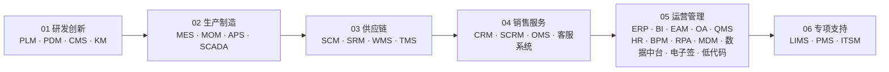
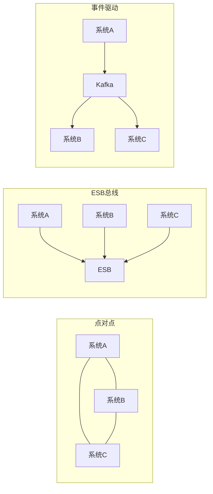
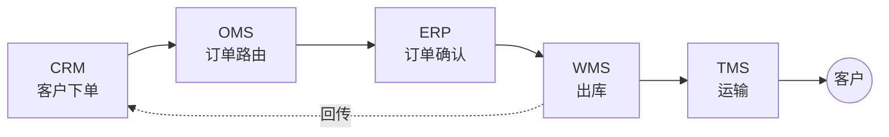
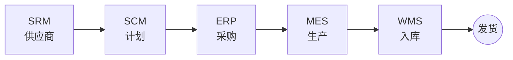
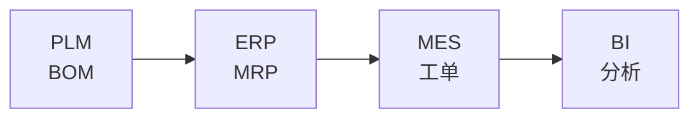

<!--
module:
  parent: null
  number: 10
  slug: business-systems
  topic: 业务系统速查
  audience: 业务 / PM / 需求 / 架构师
  category: 主模块
  type: index
  summary: 一份按业务价值链梳理的业务系统速查手册，覆盖 31 个常见业务系统（研发创新 / 生产制造 / 供应链 / 销售服务 / 运营管理 / 专项支持），帮助业务/产品/需求/架构人员快速建立完整的业务系统认知地图，并具备日常速查能力。
-->

# 10. 业务系统（Business Systems）

> 一份按业务价值链梳理的业务系统速查手册：从研发创新 → 生产制造 → 供应链 → 销售服务 → 运营管理 → 专项支持，覆盖 **31 个常见业务系统**：MES · ERP · SCM · WMS · APS · SCADA · PLM · PDM · QMS · CRM · EAM · SRM · OMS · SCRM · OA · MOM · TMS · LIMS · CMS · BI · PMS · **HR · BPM · RPA · ITSM · MDM · 数据中台 · 电子签 · KM · 客服系统 · 低代码**
>
> **继承规范**：[SPEC.md](./SPEC.md)

---

## 📚 目录导航

| 序号 | 分类 | 系统清单 | 子 README |
|:----:|------|---------|-----------|
| 01 | [研发创新](./01-rd-innovation/README.md) | PLM · PDM · CMS · KM | [子入口](./01-rd-innovation/README.md) |
| 02 | [生产制造](./02-production/README.md) | MES · MOM · APS · SCADA | [子入口](./02-production/README.md) |
| 03 | [供应链](./03-supply-chain/README.md) | SCM · SRM · WMS · TMS | [子入口](./03-supply-chain/README.md) |
| 04 | [销售服务](./04-sales-service/README.md) | CRM · SCRM · OMS · 客服系统 | [子入口](./04-sales-service/README.md) |
| 05 | [运营管理](./05-operations/README.md) | ERP · BI · EAM · OA · QMS · HR · BPM · RPA · MDM · 数据中台 · 电子签 · 低代码 | [子入口](./05-operations/README.md) |
| 06 | [专项支持](./06-specialized/README.md) | LIMS · PMS · ITSM | [子入口](./06-specialized/README.md) |

---

## 🎯 适用人群

- **业务 / PM / 需求人员**：快速建立完整的业务系统认知地图，知道每个系统在价值链的位置与作用
- **架构师**：系统选型决策（ERP / MES / WMS / CRM 选型），跨系统集成方案设计
- **后端 / 全栈工程师**：实施某个业务系统时快速了解上下游、关键模块、典型场景
- **售前 / 解决方案**：客户交流时快速定位业务价值链位置，给出参考实现
- **求职面试者**：业务系统知识是系统设计面试的高频考点（电商履约、供应链协同、ERP 集成）

---

## 🧭 学习路径

- **新人入门**（1-2 天）：业务价值链全景图 → [05 运营管理 ERP](./05-operations/erp/README.md) → [04 销售服务 CRM](./04-sales-service/crm/README.md)
- **后端进阶**（3-5 天）：[02 生产制造 MES](./02-production/mes/README.md) → [01 研发创新 PLM](./01-rd-innovation/plm/README.md) → [03 供应链 WMS](./03-supply-chain/wms/README.md) → [系统集成模式](#-系统集成模式)
- **架构方向**：贯通全价值链 → ERP + MES + WMS + CRM 四大核心系统的深度阅读
- **专项深入**：
  - 智能制造方向：MOM + SCADA
  - 供应链优化方向：SRM + APS
  - 数据驱动决策方向：BI + 数据中台
  - 数字化办公方向：BPM + RPA + 低代码
- **面试冲刺**：[业务价值链全景图](#-业务价值链全景图) + [系统速查表](#-系统速查表) + [系统集成模式](#-系统集成模式)

---

## 🗺️ 业务价值链全景图

业务价值链从"研发创新"出发，经"生产制造 → 供应链 → 销售服务"，收敛到"运营管理"，最后挂载"专项支持"作为跨场景补充。

---

## 📋 系统速查表

| 缩写 | 全称 | 一句话定位 | 价值链分组 | 📚 深读 |
|---|---|---|---|---|
| APS | Advanced Planning and Scheduling | 高级计划与排程 | 02 生产制造 | — |
| BI | Business Intelligence | 商业智能/数据分析 | 05 运营管理 | [深读](./05-operations/bi/) |
| BPM | Business Process Management | 业务流程管理（流程引擎） | 05 运营管理 | [深读](./05-operations/bpm/) |
| Call Center | Customer Service Center | 客服系统 / 多渠道接入 + 工单 + AI | 04 销售服务 | [深读](./04-sales-service/call-center/) |
| CMS | Content Management System | 内容管理 | 01 研发创新 | — |
| CRM | Customer Relationship Management | 客户关系管理 | 04 销售服务 | [深读](./04-sales-service/crm/) |
| Data Mesh | Data Middle Platform | 数据中台（数据要素资产化） | 05 运营管理 | [深读](./05-operations/data-mesh/) |
| EAM | Enterprise Asset Management | 企业资产管理 | 05 运营管理 | [深读](./05-operations/eam/) |
| E-Signature | Electronic Signature | 电子签 / 电子签名（含 CA + 存证） | 05 运营管理 | [深读](./05-operations/e-signature/) |
| ERP | Enterprise Resource Planning | 企业资源计划（核心） | 05 运营管理 | [深读](./05-operations/erp/) |
| HR / HCM | Human Capital Management | 人力资本管理（员工全生命周期） | 05 运营管理 | [深读](./05-operations/hr/) |
| ITSM | IT Service Management | IT 服务管理（IT 部门 ERP / ITIL 4） | 06 专项支持 | [深读](./06-specialized/itsm/) |
| KM | Knowledge Management | 知识管理（Nonaka SECI / 知识图谱） | 01 研发创新 | [深读](./01-rd-innovation/km/) |
| LIMS | Laboratory Information Management System | 实验室信息管理 | 06 专项支持 | [深读](./06-specialized/lims/) |
| Low-Code | Low-Code Development Platform | 低代码 / aPaaS（可视化应用搭建） | 05 运营管理 | [深读](./05-operations/low-code/) |
| MDM | Master Data Management | 主数据管理（客户/物料单一可信源） | 05 运营管理 | [深读](./05-operations/mdm/) |
| MES | Manufacturing Execution System | 制造执行系统 | 02 生产制造 | [深读](./02-production/mes/) |
| MOM | Manufacturing Operation Management | 制造运营管理 | 02 生产制造 | — |
| OA | Office Automation | 办公自动化 | 05 运营管理 | [深读](./05-operations/oa/) |
| OMS | Order Management System | 订单管理 | 04 销售服务 | — |
| PDM | Product Data Management | 产品数据管理 | 01 研发创新 | [深读](./01-rd-innovation/pdm/) |
| PLM | Product Lifecycle Management | 产品生命周期管理 | 01 研发创新 | [深读](./01-rd-innovation/plm/) |
| PMS | Project Management System | 项目管理 | 06 专项支持 | — |
| QMS | Quality Management System | 质量管理 | 05 运营管理 | [深读](./05-operations/qms/) |
| RPA | Robotic Process Automation | 机器人流程自动化（最后一公里） | 05 运营管理 | [深读](./05-operations/rpa/) |
| SCADA | Supervisory Control And Data Acquisition | 设备监控与数据采集 | 02 生产制造 | — |
| SCRM | Social Customer Relationship Management | 社交化客户关系 | 04 销售服务 | — |
| SCM | Supply Chain Management | 供应链管理 | 03 供应链 | [深读](./03-supply-chain/scm/) |
| SRM | Supplier Relationship Management | 供应商关系管理 | 03 供应链 | — |
| TMS | Transportation Management System | 运输管理 | 03 供应链 | — |
| WMS | Warehouse Management System | 仓储管理 | 03 供应链 | [深读](./03-supply-chain/wms/) |

---

## 🔌 系统集成模式

> 业务系统从来不是孤立的——它们需要"对话"。本章讲解系统间如何集成，从最底层的"通信方式"到上层的"组织模式"再到具体的"主链场景"。

### 集成方式（"怎么连"）

- **API/REST**：同步、实时、契约清晰 — 现代云原生系统、跨企业开放接口
- **消息队列**：异步、解耦、削峰 — 高并发场景（Kafka/RabbitMQ）、事件驱动
- **中间件/ESB**：集中路由、协议转换 — 传统企业集成（IBM Integration Bus/MuleSoft/自研）
- **文件交换/EDI**：跨企业、跨行业、批处理 — 供应链上下游（EDI 标准）、银企直联
- **数据库直连**：应急/过渡方案 — 不推荐生产环境（老系统接口缺失时临时用）

### 集成模式（"怎么组织"）

| 模式 | 适用 |
|---|---|
| **点对点** | 系统数量少（≤3），简单直接 |
| **ESB 总线** | 传统大型企业，集中管控/协议转换 |
| **事件驱动** | 现代微服务/云原生，松耦合可扩展 |
| **主数据管理（MDM）** | 数据标准不统一的大型企业，先治理再集成 |

### 关键集成场景

#### 订单主链

#### 供应链主链

#### 数据主链（PLM→BI）

---

## 🏆 最佳实践

| 场景 | 实践要点 |
|------|---------|
| **系统选型** | 先明确业务价值链位置（研发/生产/供应链/销售/运营）；中小企业用一体化 ERP（SAP/用友/金蝶）；制造业核心抓 MES + WMS |
| **系统集成** | 优先 API 网关统一入口；异步场景用消息队列（Kafka/RabbitMQ）；跨系统数据同步用 CDC（Canal/Debezium） |
| **数据流设计** | 主数据管理（MDM）统一编码；ETL/ELT 工具（DataX/Flink CDC）分层处理；数据血缘可追溯 |
| **实施方法论** | 分阶段上线（先核心再扩展）；蓝图设计 → 配置开发 → 集成测试 → 上线切换 → 持续优化 |
| **国产化替代** | ERP → 用友/金蝶/浪潮；MES → 盘古/摩尔元山；数据库 → TiDB/OceanBase；中间件 → RocketMQ/Nacos |

---

## 🎯 前置知识

- 软件工程基础（DDD / UML / 业务流程建模）— 理解业务系统建模的必备基础
- 数据库 / 缓存 / 消息队列 — 业务系统的数据层基础
- 分布式系统（CAP / 事务 / 锁）— 业务系统跨服务协同的理论基础
- HTTP / REST / API 设计 — 业务系统集成的基础协议

---

## 🔗 相关章节

- 技术实现：[`04.spring-backend`](../04.spring-backend/README.md) — 业务系统的 Java/Spring 技术栈
- 数据层：[`03.data-stack`](../03.data-stack/01-database/README.md) — 业务系统的数据存储、事务、缓存设计
- 架构设计：[`06.distributed-systems`](../06.distributed-systems/README.md) — 分布式、高可用、高性能设计模式
- 流程引擎：[`07.devops-and-tools`](../07.devops-and-tools/02-workflow/README.md) — BPMN 工作流（ERP/MES/CRM 中的审批流、业务流）
- 大数据：[`03.data-stack`](../03.data-stack/02-big-data/README.md) — 数据仓库、BI、数据治理（支撑 BI/ERP 数据分析）
- 前端：[`05.frontend`](../../note/09.front-end/README.md) — 业务系统前端工程化
- AI 落地：[`09.ai-applications`](../../note/11.ai/README.md) — AI Agent + RAG 在客服、KM、ERP 中的应用
- 面试题：[`12.interview`](../12.interview/README.md) — 高频面试题（系统设计、数据库等）

---

## 📊 本节统计

| 子目录 | 文件数 | 备注 |
|:-------|------:|:-----|
| `01-rd-innovation/` | 5 | 4 个 leaf + 1 个 README；PLM/PDM/CMS/KM 4 系统 |
| `02-production/` | 5 | 4 个 leaf + 1 个 README；MES/MOM/APS/SCADA 4 系统 |
| `03-supply-chain/` | 5 | 4 个 leaf + 1 个 README；SCM/SRM/WMS/TMS 4 系统 |
| `04-sales-service/` | 5 | 4 个 leaf + 1 个 README；CRM/SCRM/OMS/客服系统 4 系统 |
| `05-operations/` | 13 | 12 个 leaf + 1 个 README；ERP/BI/EAM/HR/OA/QMS/BPM/RPA/MDM/数据中台/电子签/低代码 12 系统 |
| `06-specialized/` | 4 | 3 个 leaf + 1 个 README；LIMS/PMS/ITSM 3 系统 |
| **合计 .md** | **37** | 100% leaf 保留（无覆盖） |
| **SPEC.md** | 1 | 占位（未触动） |

> 数字基线：本节以 .md 文件数 + 顶层分类数双口径统计；本模块无 frontmatter 改动（继承来源文件 frontmatter）

---

## 📚 开源参考（21 业务系统的开源实现）

| 业务系统 | 开源参考 | 说明 |
|---------|---------|------|
| **ERP** | [odoo](https://github.com/odoo/odoo)、[ERPNext](https://github.com/frappe/erpnext) | Python 生态企业资源计划 |
| **MES / MOM** | [Apache OFBiz](https://ofbiz.apache.org) | Java 制造执行 / 制造运营 |
| **SCM** | [Apache Bloodhound](https://bloodhound.apache.org) | 缺陷追踪 / 任务管理 |
| **WMS** | [Openboxes](https://github.com/openboxes/openboxes) | 开源仓库管理 |
| **APS** | [Slickplan](https://slickplan.com) | 高级计划排程 |
| **SCADA** | [OpenSCADA](http://oscada.org) | 数据采集与监控 |
| **PLM / PDM** | [OpenPLM](https://sourceforge.net/projects/openplm) | 产品生命周期管理 |
| **QMS** | [OpenQuality](https://github.com/nicolargo/openquality) | 质量管理系统 |
| **CRM / SCRM** | [SuiteCRM](https://github.com/salesagility/SuiteCRM)、[EspoCRM](https://github.com/espocrm/espocrm) | 客户关系管理 |
| **EAM** | [OpenEAM](https://openeam.org) | 设备资产管理 |
| **OA** | [JeecgBoot](https://github.com/jeecgboot/JeecgBoot)、[RuoYi](https://github.com/yangzongzhuan/RuoYi) | 协同办公（中文主流） |
| **CMS** | [WordPress](https://wordpress.org)、[Halo](https://github.com/halo-dev/halo) | 内容管理 |
| **BI** | [Superset](https://github.com/apache/superset)、[Metabase](https://github.com/metabase/metabase) | 商业智能分析 |
| **PMS** | [OpenProject](https://www.openproject.org)、[Tuleap](https://tuleap.org) | 项目管理 |

---

← [返回 note-temp 总目录](../README.md)