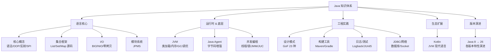

<!--
module:
  number: 01
  slug: java
  topic: Java 知识体系
  audience: 工程师 / 架构师
  category: 主模块
  summary: 从语言基础到 JVM 原理、并发编程、版本演进，系统性构建 Java 知识体系。
-->

# Java

> 从语言基础到 JVM 原理、并发编程、版本演进，系统性构建 Java 知识体系。

---

## 📚 目录导航

| 序号 | 模块 | 说明 |
|------|------|------|
| 1 | [核心概念](concepts/) | 基本语法、面向对象、类型系统、反射、序列化、SPI 等 |
| 2 | [集合框架](collection/) | ArrayList、LinkedList、HashMap、ConcurrentHashMap 等源码剖析 |
| 3 | [I/O](io/) | I/O 流分类、NIO、零拷贝 |
| 4 | [JVM](jvm/) | 类加载、内存模型、GC、JVM 参数与调优 |
| 5 | [并发编程](concurrency/) | 线程基础、synchronized、volatile、JMM、JUC、ThreadLocal、CompletableFuture |
| 6 | [设计模式](design-patterns/) | GoF 23 种设计模式的 Java 实现与选型指南 |
| 7 | [构建工具](build-tools/) | Maven vs Gradle 对比与实战 |
| 8 | [Java Agent](java-agent/) | 字节码增强、Instrumentation API、预加载与 Attach 模式 |
| 9 | [JDBC](jdbc/) | JDBC 架构、核心接口、连接池与最佳实践 |
| 10 | [Kotlin](kotlin/) | Kotlin 语法、与 Java 对比、协程基础 |
| 11 | [日志](logging/) | 日志级别、Logback、Log4j2、SLF4J 门面 |
| 12 | [模块系统](modules/) | JPMS（Java 9+）、模块化迁移指南 |
| 13 | [网络编程](network/) | Socket、TCP/UDP、HTTP 客户端 |
| 14 | [测试](testing/) | JUnit 5、Mockito、JaCoCo、测试最佳实践 |
| 15 | [版本特性](version/) | Java 8 ~ 26 各版本新特性 & 功能演进历史（GC/Lambda/Stream/并发/FFM 等） |

---

## 🗺️ 知识脉络

## 📊 速查表

| 概念 | 核心要点 | 典型场景 |
|------|---------|---------|
| **HashMap** | 数组 + 链表 + 红黑树（JDK8+），容量 2^n，负载因子 0.75 | 键值对查找，O(1) 平均 |
| **ConcurrentHashMap** | JDK8: CAS + synchronized 锁桶头节点 | 高并发读写 |
| **synchronized** | 内置锁，JVM 实现，自动释放 | 简单同步场景 |
| **ReentrantLock** | API 级锁，支持公平/非公平、可中断 | 复杂锁场景 |
| **volatile** | 保证可见性 + 禁止指令重排，不保证原子性 | 状态标志位、双重检查锁 |
| **ThreadLocal** | 线程本地存储，注意内存泄漏（remove） | 用户上下文、数据库连接 |
| **JVM 内存** | 堆（对象）、栈（帧）、方法区（类信息）、本地方法栈、PC 寄存器 | 内存分析、OOM 排查 |
| **GC 算法** | 标记-清除、复制、标记-整理、分代收集 | 调优 GC 参数 |
| **反射** | 运行时获取类信息、动态调用，性能开销较大 | 框架底层（Spring IoC） |
| **SPI** | 接口定义 +  META-INF/services/ 配置 | JDBC 驱动、Dubbo 扩展 |

## 🧭 学习路径

- **新人入门**：核心概念 → 集合框架 → I/O → JDBC → 日志 → 测试
- **进阶深入**：JVM → 并发编程 → 设计模式 → Java Agent
- **生态扩展**：Kotlin → 模块系统 → 版本特性追踪

## 🔗 相关章节

- 下游：[`06.spring`](../06.spring/) — Spring 生态（Java 最主流框架）
- 关联：[`04.system-design`](../04.system-design/) — 系统设计（Java 工程实践的上层方法论）
- 面试：[`13.split-hairs/01.java`](../13.split-hairs/01.java/README.md) — 39 篇 Java 高频面试题

## 📖 开源参考

| 项目 | 说明 | 链接 |
|------|------|------|
| OpenJDK | Java 标准开源实现 | [github.com/openjdk/jdk](https://github.com/openjdk/jdk) |
| JUnit 5 | Java 单元测试框架 | [junit.org](https://junit.org/junit5/) |
| Mockito | Mock 测试框架 | [mockito.org](https://site.mockito.org) |
| JaCoCo | 代码覆盖率工具 | [eclemma.org/jacoco](https://www.eclemma.org/jacoco/) |
| Kotlin | JVM 现代语言 | [kotlinlang.org](https://kotlinlang.org) |

---

## 📊 本节统计

| 统计维度 | 数值 | 口径 |
|----------|------|------|
| 分类主题数 | 15 | 顶层 15 个分类目录 |
| 子 README 总数 | 96 | 含 15 个分类 README + 81 个 leaf README（depth ≥ 2） |
| 含 frontmatter 的 README | 97 / 97 | 100% 覆盖（2026-07-01，含本顶层 README） |
| 配套面试题 | 39 篇 | `13.split-hairs/01.java/` 下 leaf 文章数 |

> **统计时间戳**：2026-07-01（与 `note/README.md` 中"一、[Java]"锚点状态一致）

---

← [返回笔记目录](../README.md)
