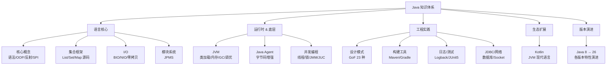

# Java

> 从语言基础到 JVM 原理、并发编程、版本演进，系统性构建 Java 知识体系。

---

## 目录导航

| 序号 | 模块 | 说明 |
|------|------|------|
| 1 | [核心概念](concepts/) | 基本语法、面向对象、类型系统、反射、序列化、SPI 等 |
| 2 | [集合框架](collection/) | ArrayList、LinkedList、HashMap、ConcurrentHashMap 等源码剖析 |
| 3 | [I/O](io/) | I/O 流分类、NIO、零拷贝 |
| 4 | [JVM](jvm/) | 类加载、内存模型、GC、JVM 参数与调优 |
| 5 | [并发编程](concurrency/) | 线程基础、synchronized、volatile、JMM、JUC、ThreadLocal、CompletableFuture |
| 6 | [设计模式](design-patterns/) | GoF 23 种设计模式的 Java 实现与选型指南 |
| 7 | [构建工具](build-tools/) | Maven vs Gradle 对比与实战 |
| 8 | [Java Agent](java-agent/) | 字节码增强、Instrumentation API、预加载与 Attach 模式 |
| 9 | [JDBC](jdbc/) | JDBC 架构、核心接口、连接池与最佳实践 |
| 10 | [Kotlin](kotlin/) | Kotlin 语法、与 Java 对比、协程基础 |
| 11 | [日志](logging/) | 日志级别、Logback、Log4j2、SLF4J 门面 |
| 12 | [模块系统](modules/) | JPMS（Java 9+）、模块化迁移指南 |
| 13 | [网络编程](network/) | Socket、TCP/UDP、HTTP 客户端 |
| 14 | [测试](testing/) | JUnit 5、Mockito、JaCoCo、测试最佳实践 |
| 15 | [版本特性](version/) | Java 8 ~ 26 各版本新特性 & 功能演进历史（GC/Lambda/Stream/并发/FFM 等） |

---

## 知识脉络

## 学习路径

- **新人入门**：核心概念 → 集合框架 → I/O → JDBC → 日志 → 测试
- **进阶深入**：JVM → 并发编程 → 设计模式 → Java Agent
- **生态扩展**：Kotlin → 模块系统 → 版本特性追踪

## 相关章节

- 下游：[`06.spring`](../06.spring/) — Spring 生态（Java 最主流框架）
- 关联：[`04.system-design`](../04.system-design/) — 系统设计（Java 工程实践的上层方法论）
- 面试：[`13.split-hairs/01.java`](../13.split-hairs/01.java/README.md) — 15 篇 Java 高频面试题
