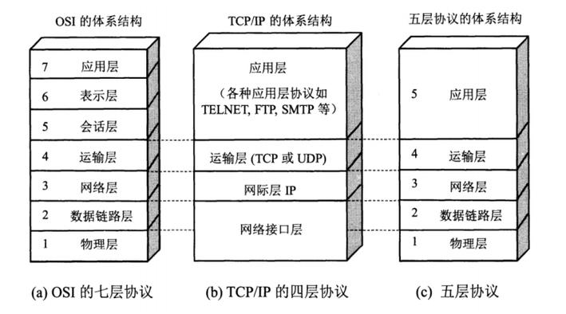

# 基础

## 基本语法

### 注释的3种方式

- **单行注释**：通常用于解释方法内某单行代码的作用
- **多行注释**：通常用于解释一段代码的作用
- **文档注释**：通常用于生成Java开发文档

### Java语言关键字

<table>
  <thead>
    <tr>
      <th>分类</th>
      <th colspan="7">关键字</th>
    </tr>
  </thead>
  <tbody>
    <tr>
      <td>访问控制</td>
      <td>private</td>
      <td>protected</td>
      <td>public</td>
      <td></td>
      <td></td>
      <td></td>
      <td></td>
    </tr>
    <tr>
      <td>类，方法和变量修饰符</td>
      <td>abstract</td>
      <td>class</td>
      <td>extends</td>
      <td>final</td>
      <td>implements</td>
      <td>interface</td>
      <td>native</td>
    </tr>
    <tr>
      <td></td>
      <td>new</td>
      <td>static</td>
      <td>strictfp</td>
      <td>synchronized</td>
      <td>transient</td>
      <td>volatile</td>
      <td>enum</td>
    </tr>
    <tr>
      <td>程序控制</td>
      <td>break</td>
      <td>continue</td>
      <td>return</td>
      <td>do</td>
      <td>while</td>
      <td>if</td>
      <td>else</td>
    </tr>
    <tr>
      <td></td>
      <td>for</td>
      <td>instanceof</td>
      <td>switch</td>
      <td>case</td>
      <td>default</td>
      <td>assert</td>
      <td></td>
    </tr>
    <tr>
      <td>错误处理</td>
      <td>try</td>
      <td>catch</td>
      <td>throw</td>
      <td>throws</td>
      <td>finally</td>
      <td></td>
      <td></td>
    </tr>
    <tr>
      <td>包相关</td>
      <td>import</td>
      <td>package</td>
      <td></td>
      <td></td>
      <td></td>
      <td></td>
      <td></td>
    </tr>
    <tr>
      <td>基本类型</td>
      <td>boolean</td>
      <td>byte</td>
      <td>char</td>
      <td>double</td>
      <td>float</td>
      <td>int</td>
      <td>long</td>
    </tr>
    <tr>
      <td></td>
      <td>short</td>
      <td></td>
      <td></td>
      <td></td>
      <td></td>
      <td></td>
      <td></td>
    </tr>
    <tr>
      <td>变量引用</td>
      <td>super</td>
      <td>this</td>
      <td>void</td>
      <td></td>
      <td></td>
      <td></td>
      <td></td>
    </tr>
    <tr>
      <td>保留字</td>
      <td>goto</td>
      <td>const</td>
      <td></td>
      <td></td>
      <td></td>
      <td></td>
      <td></td>
    </tr>
  </tbody>
</table>

#### 标识符和关键字的区别

标识符就是一个名字,关键字是被赋予特殊含义的标识符

### `continue`、`break`和`return`的区别

- **`continue`**：指跳出当前的这一次循环，继续下一次循环
- **`break`**：指跳出整个循环体，继续执行循环下面的语句
- **`return`**：直接使用`return`结束方法执行，用于没有返回值函数的方法
- **`return value`**：`return`一个特定值，用于有返回值函数的方法

## 基本数据类型

### Java 中的8种基本数据类型

```
8 种基本数据类型
├─6 种数字类型
│  ├─4 种整数型 ： byte、short、int、long
│  └─2 种浮点型 ： float、double
├─1 种字符类型 ： char
└─1 种布尔型 : boolean
```
8 种基本数据类型的默认值以及所占空间的大小：

| 基本类型    | 位数 | 字节 | 默认值     | 取值范围                                                       |
|---------|----|----|---------|------------------------------------------------------------|
| byte    | 8  | 1  | 0       | -128 ~ 127                                                 |
| short   | 16 | 2  | 0       | -32768（-2^15） ~ 32767（2^15 - 1）                            |
| int     | 32 | 4  | 0       | -2147483648 ~ 2147483647                                   |
| long    | 64 | 8  | 0L      | -9223372036854775808（-2^63） ~ 9223372036854775807（2^63 -1） |
| char    | 16 | 2  | 'u0000' | 'u0000'	0 ~ 65535（2^16 - 1）                                |
| float   | 32 | 4  | 0f      | 1.4E-45 ~ 3.4028235E38                                     |
| double  | 64 | 8  | 0d      | 4.9E-324 ~ 1.7976931348623157E308                          |
| boolean | 1  |    | FALSE   | true、false                                                 |

### 基本类型和包装类型的区别

- **用途**：除了定义一些常量和局部变量之外，在其他地方比如方法参数、对象属性中很少会使用基本类型来定义变量。并且，包装类型可用于泛型，而基本类型不可以。
- **存储方式**：基本数据类型的局部变量存放在 Java 虚拟机栈中的局部变量表中，基本数据类型的成员变量（未被`static`修饰 ）存放在 Java 虚拟机的堆中。包装类型属于对象类型，知道几乎所有对象实例都存在于堆中。
- **占用空间**：相比于包装类型（对象类型）， 基本数据类型占用的空间往往非常小。
- **默认值**：成员变量包装类型不赋值就是`null`，而基本类型有默认值且不是`null`。
- **比较方式**：对于基本数据类型来说，`==`比较的是值。对于包装数据类型来说，`==`比较的是对象的内存地址。所有整型包装类对象之间值的比较，全部使用`equals()`方法。

### 包装类型的缓存机制

Java 基本数据类型的包装类型的大部分都用到了缓存机制来提升性能。  
- `Byte`,`Short`,`Integer`,`Long`这 4 种包装类默认创建了数值 [-128，127] 的相应类型的缓存数据  
- `Character`创建了数值在 [0,127] 范围的缓存数据  
- `Boolean`直接返回 True or False。

### 自动装箱与拆箱

- **装箱**：将基本类型用它们对应的引用类型包装起来
- **拆箱**：将包装类型转换为基本数据类型

如果频繁拆装箱的话，也会严重影响系统的性能，应该尽量避免不必要的拆装箱操作。

### 浮点数运算精度丢失

和计算机保存浮点数的机制有很大关系。    
计算机是二进制的并且计算机在表示一个数字时宽度是有限的，无限循环的小数存储在计算机时只能被截断，所以就会导致小数精度发生损失的情况。  
解决浮点数运算的精度丢失，推荐使用`BigDecimal`

### 使用`BigInteger`处理超过`long`整型的数据

`BigInteger`内部使用 int[] 数组来存储任意大小的整形数据  
运算的效率会相对较低

## 变量

### 成员变量与局部变量的区别

- **语法形式**：从语法形式上看，成员变量是属于类的，而局部变量是在代码块或方法中定义的变量或是方法的参数；成员变量可以被`public`,`private`,`static`等修饰符所修饰，而局部变量不能被访问控制修饰符及`static`所修饰；但是，成员变量和局部变量都能被`final`所修饰。
- **存储方式**：从变量在内存中的存储方式来看，如果成员变量是使用`static`修饰的，那么这个成员变量是属于类的，如果没有使用`static`修饰，这个成员变量是属于实例的。而对象存在于堆内存，局部变量则存在于栈内存。
- **生存时间**：从变量在内存中的生存时间上看，成员变量是对象的一部分，它随着对象的创建而存在，而局部变量随着方法的调用而自动生成，随着方法的调用结束而消亡。
- **默认值**：从变量是否有默认值来看，成员变量如果没有被赋初始值，则会自动以类型的默认值而赋值（一种情况例外:被`final`修饰的成员变量也必须显式地赋值），而局部变量则不会自动赋值。

### 静态变量的作用

静态变量也就是被`static`关键字修饰的变量。  
它可以被类的所有实例共享，无论一个类创建了多少个对象，它们都共享同一份静态变量。  
这样做的目的是节省内存。

### 字符型常量和字符串常量的区别

- **形式**：字符常量是单引号引起的一个字符，字符串常量是双引号引起的 0 个或若干个字符。
- **含义**：字符常量相当于一个整型值( ASCII 值),可以参加表达式运算; 字符串常量代表一个地址值(该字符串在内存中存放位置)。
- **占内存大小**：字符常量只占 2 个字节; 字符串常量占若干个字节。

## 方法
### 方法的返回值和方法的4种类型
#### 方法的返回值
- 获取到的某个方法体中的代码执行后产生的结果
- 作用是接收出结果使得它可以用于其他的操作
#### 按照方法的返回值和参数类型将方法分为4种
1. 无参数无返回值的方法
2. 有参数无返回值的方法
3. 有返回值无参数的方法
4. 有返回值有参数的方法
### 静态方法不能调用非静态成员
静态方法是属于类的，在类加载的时候就会分配内存，可以通过类名直接访问。而非静态成员属于实例对象，只有在对象实例化之后才存在，需要通过类的实例对象去访问。  
在类的非静态成员不存在的时候静态方法就已经存在了，此时调用在内存中还不存在的非静态成员，属于非法操作。
### 静态方法和实例方法的区别
- **调用方式**：调用静态方法可以无需创建对象
- **访问类成员是否存在限制**：静态方法在访问本类的成员时，只允许访问静态成员（即静态成员变量和静态方法），不允许访问实例成员（即实例成员变量和实例方法），而实例方法不存在这个限制。
### 重载和重写的区别
重写就是子类对父类方法的重新改造，外部样子不能改变，内部逻辑可以改变

| 区别点   | 重载方法 | 重写方法                            |
|-------|------|---------------------------------|
| 发生范围  | 同一个类 | 子类                              |
| 参数列表  | 必须修改 | 一定不能修改                          |
| 返回类型  | 可修改  | 子类方法返回值类型应比父类方法返回值类型更小或相等       |
| 异常    | 可修改  | 子类方法声明抛出的异常类应比父类方法声明抛出的异常类更小或相等 |
| 访问修饰符 | 可修改  | 一定不能做更严格的限制（可以降低限制）             |
| 发生阶段  | 编译期  | 运行期                             |

### 可变长参数
可变长参数就是允许在调用方法时传入不定长度的参数
```java
public static void method1(String... args) {
   //......
}
```

## 面向对象基础
### 面向对象和面向过程的区别
面向过程把解决问题的过程拆成一个个方法，通过一个个方法的执行解决问题。  
面向对象会先抽象出对象，然后用对象执行方法的方式解决问题。
### 对象实体与对象引用的区别
new 运算符创建对象实例（对象实例在堆内存中），对象引用指向对象实例（对象引用存放在栈内存中）。
### 对象的相等和引用相等的区别
对象的相等一般比较的是内存中存放的内容是否相等,引用相等一般比较的是他们指向的内存地址是否相等。
### 构造方法
- 一个类即使没有声明构造方法也会有默认的不带参数的构造方法。
- 名字与类名相同。
- 没有返回值，但不能用`void`声明构造函数。
- 生成类的对象时自动执行，无需调用。
- 构造方法不能被`override`（重写）,但是可以`overload`（重载）,所以你可以看到一个类中有多个构造函数的情况。
### 面向对象三大特征
- **封装**：封装是指把一个对象的状态信息（也就是属性）隐藏在对象内部，不允许外部对象直接访问对象的内部信息。
- **继承**：不同类型的对象，相互之间经常有一定数量的共同点。
  - 继承的3个特性：
    1. 子类拥有父类对象所有的属性和方法（包括私有属性和私有方法），但是父类中的私有属性和方法子类是只拥有但无法访问的。
    2. 子类可以拥有自己属性和方法，即子类可以对父类进行扩展。
    3. 子类可以用自己的方式实现父类的方法。
- **多态**：表示一个对象具有多种的状态，具体表现为父类的引用指向子类的实例。
  - 多态的4个特性
    1. 对象类型和引用类型之间具有继承（类）/实现（接口）的关系；
    2. 引用类型变量发出的方法调用的到底是哪个类中的方法，必须在程序运行期间才能确定；
    3. 多态不能调用“只在子类存在但在父类不存在”的方法；
    4. 如果子类重写了父类的方法，真正执行的是子类重写的方法，如果子类没有重写父类的方法，执行的是父类的方法。
### 接口和抽象类的异同？
#### 共同
- 都不能被实例化。
- 都可以包含抽象方法。
- 都可以有默认实现的方法（Java 8 可以用`default`关键字在接口中定义默认方法）。
#### 区别
- 接口主要用于对类的行为进行约束，你实现了某个接口就具有了对应的行为。抽象类主要用于代码复用，强调的是所属关系。
- 一个类只能继承一个类，但是可以实现多个接口。
- 接口中的成员变量只能是`public static final`类型的，不能被修改且必须有初始值，而抽象类的成员变量默认`default`，可在子类中被重新定义，也可被重新赋值。
### 深拷贝、浅拷贝、引用拷贝的区别
- **浅拷贝**：浅拷贝会在堆上创建一个新的对象（区别于引用拷贝的一点），不过，如果原对象内部的属性是引用类型的话，浅拷贝会直接复制内部对象的引用地址，也就是说拷贝对象和原对象共用同一个内部对象。
- **深拷贝**：深拷贝会完全复制整个对象，包括这个对象所包含的内部对象。
#### 区别


## Object
### Object 类常见的11个方法
```java
/**
 * native 方法，用于返回当前运行时对象的 Class 对象，使用了 final 关键字修饰，故不允许子类重写。
 */
public final native Class<?> getClass()
/**
 * native 方法，用于返回对象的哈希码，主要使用在哈希表中，比如 JDK 中的HashMap。
 */
public native int hashCode()
/**
 * 用于比较 2 个对象的内存地址是否相等，String 类对该方法进行了重写以用于比较字符串的值是否相等。
 */
public boolean equals(Object obj)
/**
 * native 方法，用于创建并返回当前对象的一份拷贝。
 */
protected native Object clone() throws CloneNotSupportedException
/**
 * 返回类的名字实例的哈希码的 16 进制的字符串。建议 Object 所有的子类都重写这个方法。
 */
public String toString()
/**
 * native 方法，并且不能重写。唤醒一个在此对象监视器上等待的线程(监视器相当于就是锁的概念)。如果有多个线程在等待只会任意唤醒一个。
 */
public final native void notify()
/**
 * native 方法，并且不能重写。跟 notify 一样，唯一的区别就是会唤醒在此对象监视器上等待的所有线程，而不是一个线程。
 */
public final native void notifyAll()
/**
 * native方法，并且不能重写。暂停线程的执行。注意：sleep 方法没有释放锁，而 wait 方法释放了锁 ，timeout 是等待时间。
 */
public final native void wait(long timeout) throws InterruptedException
/**
 * 多了 nanos 参数，这个参数表示额外时间（以纳秒为单位，范围是 0-999999）。 所以超时的时间还需要加上 nanos 纳秒。。
 */
public final void wait(long timeout, int nanos) throws InterruptedException
/**
 * 跟之前的2个wait方法一样，只不过该方法一直等待，没有超时时间这个概念
 */
public final void wait() throws InterruptedException
/**
 * 实例被垃圾回收器回收的时候触发的操作
 */
protected void finalize() throws Throwable { }
```
### `==`和`equals()`的区别
#### 基本数据类型
对于基本数据类型，`==`比较的是值，`equals()`不能用于判断基本数据类型的变量
#### 基引用数据类型
对于引用数据类型，`==`比较的是对象的内存地址,`equals()`用来判断两个对象是否相等。
### `hashCode()`
`hashCode()`的作用是获取哈希码（`int`整数），也称为散列码。这个哈希码的作用是确定该对象在哈希表中的索引位置，能根据“键”快速的检索出对应的“值”，既可以快速找到所需要的对象。


#### 重写`equals()`方法与`hashCode()`方法
重写`equals()`时必须重写`hashCode()`方法  
`equals`方法判断两个对象是相等的，那这两个对象的`hashCode`值也要相等。  
两个对象有相同的`hashCode`值，他们也不一定是相等的（哈希碰撞）。

### 对象复制的六种方法
1. 浅克隆（地址复制）
2. 深克隆（实现Cloneable的方法）
3. 深克隆（使用BeanUtils.copyProperties()）
4. 深克隆（PropertyUtils.copyProperties()）：注意：对象复制完String类型为null，int类型为0
5. 深克隆（序列化）
```java
        T cloneObj = null;
        try {
            //写入字节流
            ByteArrayOutputStream out = new ByteArrayOutputStream();
            ObjectOutputStream obs = new ObjectOutputStream(out);
            obs.writeObject(obj);
            obs.close();
 
            //分配内存，写入原始对象，生成新对象
            ByteArrayInputStream ios = new ByteArrayInputStream(out.toByteArray());
            ObjectInputStream ois = new ObjectInputStream(ios);
            //返回生成的新对象
            cloneObj = (T) ois.readObject();
            ois.close();
        } catch (Exception e) {
            e.printStackTrace();
        }
        return cloneObj;
```
6. 深克隆（反射）
```java
        //1. 获取已有Student对象的Class对象
        Class<?> classType = obj.getClass();
        //2. 通过Class.newinstance方法动态构建一个副本对象
        Object stu1 = classType.newInstance();
        //由于不知道源对象的具体属性和属性值，通过反射机制，先得到属性名称，再拼接字段得到属性对应的get,set方法
        for (Field field : classType.getDeclaredFields()) {
            //3. 获取副本对象的get，set方法
            String getMethodName = "get" + field.getName().substring(0, 1).toUpperCase() + field.getName().substring(1);
            String setMethodName = "set" + field.getName().substring(0, 1).toUpperCase() + field.getName().substring(1);
            //4. 调用源对象的get方法获取属性值
            Method getMethod = classType.getDeclaredMethod(getMethodName, new Class[]{});
            Object value = getMethod.invoke(obj, new Object[]{});
            //5. 调用副本对象的set方法把属性值复制过来
            Method setMethod = classType.getDeclaredMethod(setMethodName, new Class[]{field.getType()});
            setMethod.invoke(stu1, new Object[]{value});
        }
        return stu1;
```

## String
### `String`、`StringBuffer`、`StringBuilder`的区别？
#### 可变性
`String`是不可变的
- 保存字符串的数组被`final`修饰且为私有的，并且`String`类没有提供/暴露修改这个字符串的方法。
- `String`类被`final`修饰导致其不能被继承，进而避免了子类破坏`String`不可变。
#### 线程安全性
`String`中的对象是不可变的，也就可以理解为常量，线程安全
#### 性能
- 每次对`String`类型进行改变的时候，都会生成一个新的`String`对象，然后将指针指向新的`String`对象。
- `StringBuffer`每次都会对`StringBuffer`对象本身进行操作，而不是生成新的对象并改变对象引用。
- 相同情况下使用`StringBuilder`相比使用`StringBuffer`能获得`10%~15%`左右的性能提升，但增加了多线程不安全的风险。
#### 使用的总结
- **操作少量的数据**：适用`String`
- **单线程操作字符串缓冲区下操作大量数据**：适用`StringBuilder`
- **多线程操作字符串缓冲区下操作大量数据**：适用`StringBuffer`
#### Java 9 将`String`的底层实现由`char[]`改成了`byte[]`的原因
新版的`String`其实支持两个编码方案：Latin-1`和`UTF-16。  
如果字符串中包含的汉字没有超过`Latin-1`可表示范围内的字符，那就会使用`Latin-1`作为编码方案。  
Latin-1`编码方案下，byte`占一个字节(8`位)，char`占用`2`个字节（16），byte`相较`char`节省一半的内存空间。
### 字符串常量池的作用
字符串常量池 是 JVM 为了提升性能和减少内存消耗针对字符串（`String`类）专门开辟的一块区域，主要目的是为了避免字符串的重复创建。
### `String s1 = new String("abc")`;这句话创建了几个字符串对象？
会创建 1 或 2 个字符串对象:
1. 如果字符串常量池中不存在字符串对象“abc”的引用，那么它会在堆上创建两个字符串对象，其中一个字符串对象的引用会被保存在字符串常量池中。
2. 如果字符串常量池中已存在字符串对象“abc”的引用，则只会在堆中创建 1 个字符串对象“abc”。

## 异常
Java 异常类层次结构图概览


### `Exception`和`Error`的区别
- **`Exception`**：程序本身可以处理的异常，可以通过`catch`来进行捕获。`Exception`又可以分为 Checked Exception (受检查异常，必须处理) 和 Unchecked Exception (不受检查异常，可以不处理)。
  - Checked Exception 和 Unchecked Exception 的区别
    - **Checked Exception**： 即<font color="red">受检查异常</font>，Java 代码在编译过程中，如果受检查异常没有被`catch`或者`throws`关键字处理的话，就没办法通过编译。
    - 除了`RuntimeException`及其子类以外，其他的Exception类及其子类都属于受检查异常。
    - 常见的受检查异常有：
      - `IO`相关的异常
      - `ClassNotFoundException`
      - `SQLException`
      - ...
    - **Unchecked Exception**： 即<font color="red">不受检查异常</font>，Java 代码在编译过程中，即使不处理不受检查异常也可以正常通过编译。
    - `RuntimeException`及其子类都统称为非受检查异常。
    - 常见的有（建议记下来，日常开发中会经常用到）：
      - `NullPointerException`(空指针错误)
      - `IllegalArgumentException`(参数错误比如方法入参类型错误)
      - `NumberFormatException`(字符串转换为数字格式错误，`IllegalArgumentException`的子类)
      - `ArrayIndexOutOfBoundsException`(数组越界错误)
      - `ClassCastException`(类型转换错误)
      - `ArithmeticException`(算术错误)
      - `SecurityException`(安全错误比如权限不够)
      - `UnsupportedOperationException`(不支持的操作错误比如重复创建同一用户)
- **`Error`**：`Error`属于程序无法处理的错误，不建议通过`catch`捕获。例如 Java 虚拟机运行错误（Virtual MachineError）、虚拟机内存不够错误(OutOfMemoryError)、类定义错误（NoClassDefFoundError）等。这些异常发生时，Java 虚拟机（JVM）一般会选择线程终止。

### `Throwable`类常用方法
1. **`String getMessage()`**：返回异常发生时的简要描述
2. **`String toString()`**：返回异常发生时的详细信息
3. **`String getLocalizedMessage()`**：返回异常对象的本地化信息。使用`Throwable`的子类覆盖这个方法，可以生成本地化信息。如果子类没有覆盖该方法，则该方法返回的信息与`getMessag()`返回的结果相同
4. **`void printStackTrace()`**：在控制台上打印`Throwable`对象封装的异常信息
### `try-catch-finally`如何使用？
- **`try`**：用于捕获异常。其后可接零个或多个`catch`块，如果没有`catch`块，则必须跟一个`finally`块。
- **`catch`**：用于处理`try`捕获到的异常。
- **`finally`**：无论是否捕获或处理异常，`finally`块里的语句都会被执行。当在`try`块或`catch`块中遇到`return`语句时，`finally`语句块将在方法返回之前被执行。 

`finally`中的代码不一定会执：
```java
try {
    System.out.println("Try to do something");
    throw new RuntimeException("RuntimeException");
} catch (Exception e) {
    System.out.println("Catch Exception -> " + e.getMessage());
    // 终止当前正在运行的Java虚拟机
    System.exit(1);
} finally {
    System.out.println("Finally");
}
```

#### 使用`try-with-resources`代替`try-catch-finally`
- **适用范围（资源的定义）**：任何实现`java.lang.AutoCloseable`或者`java.io.Closeable`的对象
- **关闭资源和`finally`块的执行顺序**：在`try-with-resources`语句中，任何`catch`或`finally`块在声明的资源关闭后运行

### 异常使用有哪些需要注意的地方？
- 不要把异常定义为静态变量，因为这样会导致异常栈信息错乱。每次手动抛出异常都需要手动`new`一个异常对象抛出。
- 抛出的异常信息一定要有意义。
- 建议抛出更加具体的异常比如字符串转换为数字格式错误的时候应该抛出`NumberFormatException`而不是其父类`IllegalArgumentException`。
- 避免重复记录日志：如果在捕获异常的地方已经记录了足够的信息（包括异常类型、错误信息和堆栈跟踪等），那么在业务代码中再次抛出这个异常时，就不应该再次记录相同的错误信息。重复记录日志会使得日志文件膨胀，并且可能会掩盖问题的实际原因，使得问题更难以追踪和解决。
- ……

## 泛型
Java 泛型（Generics） 是 JDK 5 中引入的一个新特性。使用泛型参数，可以增强代码的可读性以及稳定性。  
**泛型的使用方式**：泛型类、泛型接口、泛型方法

## 反射
反射 它赋予了在运行时分析类以及执行类中方法的能力。  
通过反射可以获取任意一个类的所有属性和方法，还可以调用这些方法和属性。

### 反射的应用场景
- 动态代理
- 注解

### 优缺点
- **优点**：可以让咱们的代码更加灵活、为各种框架提供开箱即用的功能提供了便利
- **缺点**：让我们在运行时有了分析操作类的能力，这同样也增加了安全问题。比如可以无视泛型参数的安全检查（泛型参数的安全检查发生在编译时）。另外，反射的性能也要稍差点，不过，对于框架来说实际是影响不大的
### 获取`Class`对象的四种方式
- 知道具体类的情况下可以使用  
  `Class alunbarClass = TargetObject.class;`
- 通过`Class.forName()`传入类的全路径获取  
  `Class alunbarClass1 = Class.forName("cn.javaguide.TargetObject");`
- 通过对象实例instance.getClass()获取  
  `TargetObject o = new TargetObject();Class alunbarClass2 = o.getClass();`
- 通过类加载器xxxClassLoader.loadClass()传入类路径获取  
  `ClassLoader.getSystemClassLoader().loadClass("cn.javaguide.TargetObject");`

## 注解
`Annotation`（注解） 是 Java5 开始引入的新特性，可以看作是一种特殊的注释，主要用于修饰类、方法或者变量，提供某些信息供程序在编译或者运行时使用。

### 注解的解析方法有几种
- **编译期直接扫描**：编译器在编译 Java 代码的时候扫描对应的注解并处理，比如某个方法使用 @Override 注解，编译器在编译的时候就会检测当前的方法是否重写了父类对应的方法。
- **运行期通过反射处理**：像框架中自带的注解(比如 Spring 框架的 @Value、@Component)都是通过反射来进行处理的。

## SPI
SPI 即 Service Provider Interface ，字面意思就是：“服务提供者的接口”，既，专门提供给服务提供者或者扩展框架功能的开发者去使用的一个接口。
### 适用场景
### SPI 和 API 的区别


1. **定义方式**
   - **SPI**：SPI是一种Java的扩展机制，它允许应用程序定义接口，并通过配置文件来加载具体的实现类。这种机制主要用于实现模块化开发，特别是在需要支持插件或服务替换的场景下。SPI的定义通常由框架或库提供方完成，供第三方开发者实现。
    - **API**：API是一组预定义的函数、方法或协议，用于在软件系统中进行交互。API定义了如何使用某个软件库或框架提供的功能，它通常由开发者主动编写并公开给其他开发者使用。
2. **调用方式**
   - **SPI**：SPI的调用方式是通过配置文件来指定具体的实现类，然后由框架或库自动加载和调用。这种方式使得服务提供者可以在不修改应用程序代码的情况下更换实现。
   - **API**：API的调用方式是通过直接调用接口的方法来使用功能。开发者在编写应用程序时，会直接调用API提供的方法或函数来实现特定的功能。
3. **灵活性**
   - **SPI**：SPI的实现类可以在运行时根据配置文件的内容进行动态加载和替换，因此具有较高的灵活性和扩展性。
   - **API**：API的实现类必须在编译时就确定，无法动态替换，因此相对于SPI来说，其灵活性较低。
4. **依赖关系**
   - **SPI**：SPI是调用方依赖的，即框架或库需要引入第三方实现类的库才能加载和调用。这种依赖关系使得SPI更适合用于实现插件或服务替换等场景。
   - **API**：API是被调用方依赖的，即应用程序需要引入API所在的库才能使用其功能。API的这种依赖关系使得它成为连接不同软件组件之间的桥梁。
5. **使用目的**
   - **SPI**：SPI的主要目的是提供一种机制，使得系统可以在运行时发现和使用不同的服务实现。它关注于服务的提供者和消费者之间的动态解耦，以及服务的可插拔性和扩展性。
   - **API**：API的主要目的是提供一套易于使用的工具集以便于调用，它关注于暴露功能给外部使用，并简化与系统的交互过程。
### SPI 优缺点
#### 优点
- **插件化扩展**：SPI机制允许应用程序在运行时动态地加载和使用不同的实现类，从而实现了灵活的插件化扩展功能。应用程序可以根据需求动态地切换和扩展功能，而无需修改源代码。
- **松耦合**：SPI机制通过接口和实现类的分离，实现了组件之间的松耦合。应用程序只需要依赖于接口，而不需要依赖于具体的实现类。这样可以提高代码的可维护性和可测试性。
- **可扩展性**：SPI机制允许开发者通过创建新的实现类来扩展应用程序的功能。开发者可以根据自己的需求，实现自定义的实现类，并将其配置到SPI的配置文件中，从而实现功能的扩展。
#### 缺点
- **配置复杂**：SPI机制需要在META-INF/services目录下创建配置文件，并在配置文件中添加实现类的全限定名。这种配置方式相对繁琐，需要开发者手动维护配置文件。
- **无法动态更新**：SPI机制在应用程序启动时会加载配置文件中的实现类，并实例化这些实现类。一旦应用程序启动，就无法动态地更新配置文件中的实现类。如果需要动态更新实现类，需要重新启动应用程序。
- **无法解决冲突**：SPI机制在加载实现类时，如果配置文件中存在多个相同的实现类，会随机选择其中一个实现类。这可能导致实现类的选择不确定性，无法解决冲突。
- **遍历全部获取**：ServiceLoader类在加载实现类时，会将所有的实现类都加载并实例化一遍。如果您只需要使用其中的某个实现类，那么其他实现类的加载和实例化就会造成资源的浪费。
- **获取方式不够灵活**：ServiceLoader类只能通过迭代器（Iterator）的形式获取实现类，无法根据某个参数或条件来获取对应的实现类。这限制了对实现类的选择和使用方式。
- **并发多线程不安全**：ServiceLoader类的实例在多个并发多线程环境下使用是不安全的。如果多个线程同时使用同一个ServiceLoader实例，可能会导致线程安全问题。
### 使用场景
1. **框架扩展与插件化**
   - **日志框架**：如SLF4J、Log4j2等日志框架，允许通过SPI机制加载不同的日志实现，如Logback、Log4j等，从而在不修改代码的情况下切换日志实现。
   - **数据库连接池**：如HikariCP等数据库连接池，可以通过SPI机制加载不同的数据库驱动，实现对不同数据库的支持。
   - **HTTP客户端**：如Apache HttpClient等HTTP客户端库，可以通过SPI机制加载不同的HTTP处理器或编解码器，以满足不同的需求。
2. **服务加载与扩展**
   - **插件化应用程序**：对于需要支持插件式扩展的应用程序，如IDE（集成开发环境）、游戏引擎、CMS（内容管理系统）等，Java SPI可以作为一种轻量级的插件机制，使得程序的功能可以被灵活地扩展和定制。
   - **动态服务加载**：在需要动态加载服务的场景中，如微服务架构中的服务发现与注册，Java SPI可以帮助系统动态地发现和加载新的服务提供者。
3. **组件化和模块化设计**
   - **模块化设计**：通过将核心功能与各个模块解耦合，使用Java SPI可以实现模块化的设计。这种模块化允许开发者定义接口和规范，而不暴露具体的实现细节，从而实现组件之间的松耦合性。
   - **服务提供者动态替换**：在需要替换服务提供者的场景中，如缓存服务、身份验证服务等，Java SPI可以使得系统在不修改代码的情况下，通过配置文件来替换服务实现。
4. **数据转换和格式化**
   - **数据解析与格式化**：在处理数据转换和格式化的场景中，如JSON、XML解析器、数据校验、编码解码等，Java SPI可以实现自定义的数据处理器，以满足特定的数据处理需求。
5. **其他**
   - **Java JDBC API**：Java JDBC API就是一个经典的SPI应用实例，不同的数据库供应商会提供各自的数据库驱动实现，并将这些实现类的全限定名写入META-INF/services/java.sql.Driver文件中。当应用程序通过DriverManager.getConnection()方法连接数据库时，JDBC会根据SPI机制自动查找并加载对应的数据库驱动。

加密服务、序列化/反序列化工具、缓存组件、消息中间件客户端等：这些领域往往存在多种可选实现，SPI可以让用户在不修改代码的情况下选择合适的实现进行替换或升级。

## 序列化和反序列化

- **序列化**：将数据结构或对象转换成二进制字节流的过程
- **反序列化**：将在序列化过程中所生成的二进制字节流转换成数据结构或者对象的过程

### 常见应用场景

- 对象在进行网络传输（比如远程方法调用 RP C的时候）之前需要先被序列化，接收到序列化的对象之后需要再进行反序列化；
- 将对象存储到文件之前需要进行序列化，将对象从文件中读取出来需要进行反序列化；
- 将对象存储到数据库（如 Redis）之前需要用到序列化，将对象从缓存数据库中读取出来需要反序列化；
- 将对象存储到内存之前需要进行序列化，从内存中读取出来之后需要进行反序列化。

### 目的

序列化的主要目的是通过网络传输对象或者说是将对象存储到文件系统、数据库、内存中


### 序列化协议在 TCP/IP 4 层模型的应用



OSI 七层协议模型中，表示层是对应用层的用户数据进行处理转换为二进制流或者将二进制流转换成应用层的用户数据。  
与序列化和反序列化相符。  
OSI 七层协议模型中的应用层、表示层和会话层对应的都是 TCP/IP 四层模型中的应用层  
序列化协议属于 TCP/IP 协议应用层的一部分  

### 序列化协议

- **JDK 自带的序列化方式**：JDK 自带的序列化，只需实现`java.io.Serializable`接口即可。
  - serialVersionUID的作用：  
    序列化号 serialVersionUID 属于版本控制的作用。反序列化时，会检查 serialVersionUID 是否和当前类的 serialVersionUID 一致。如果 serialVersionUID 不一致则会抛出 InvalidClassException 异常。

    > 强烈推荐每个序列化类都手动指定其 serialVersionUID，如果不手动指定，那么编译器会动态生成默认的 serialVersionUID。
  - transient：  
    对于不想进行序列化的变量，可以使用 transient 关键字修饰。
  - JDK 自带的序列化的缺点：  
    - **不支持跨语言调用**：如果调用的是其他语言开发的服务的时候就不支持了。
    - **性能差**：相比于其他序列化框架性能更低，主要原因是序列化之后的字节数组体积较大，导致传输成本加大。
    - **存在安全问题**：序列化和反序列化本身并不存在问题。但当输入的反序列化的数据可被用户控制，那么攻击者即可通过构造恶意输入，让反序列化产生非预期的对象，在此过程中执行构造的任意代码。
- **JSON 序列化**
- **Protobuf**：Protobuf 出自于 Google，性能还比较优秀，也支持多种语言，同时还是跨平台的。就是在使用中过于繁琐，因为你需要自己定义 IDL 文件和生成对应的序列化代码。这样虽然不灵活，但是，另一方面导致 protobuf 没有序列化漏洞的风险。
- **ProtoStuff**：由于 Protobuf 的易用性较差，它的哥哥 Protostuff 诞生了。
- **Hessian**：Hessian 是一个轻量级的，自定义描述的二进制 RPC 协议。Hessian 是一个比较老的序列化实现了，并且同样也是跨语言的。
- **Kryo**：Kryo 是一个高性能的序列化/反序列化工具，由于其变长存储特性并使用了字节码生成机制，拥有较高的运行速度和较小的字节码体积。
- **FST**：[ ] 待完善

### 使用场景

- **JDK 自带的序列化方式**：因为 JDK 自带的序列化的缺点，一般不会直接使用 JDK 自带的序列化方式。
- **JSON 序列化**：由于性能问题一般也不会考虑使用。
- **Protostuff，ProtoBuf、hessian2**：跨语言的序列化方式，如果有跨语言需求的话可以使用。
- **Kryo/FST**：专门针对 Java 语言的，性能非常好。

### 序列化协议的性能对比


## 语法糖

语法糖（Syntactic sugar）代指的是编程语言为了方便程序员开发程序而设计的一种特殊语法，这种语法对编程语言的功能并没有影响。实现相同的功能，基于语法糖写出来的代码往往更简单简洁且更易阅读。

### Java 中常见的语法糖

Java 中最常用的语法糖主要有泛型、自动拆装箱、变长参数、枚举、内部类、增强`for`循环、`try-with-resources`语法、`lambda`表达式等。


