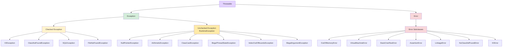

<!--
module:
  parent: java
  slug: java/exception
  type: article
  category: 主模块子文章
  summary: 异常
-->

# 异常

## 引言：基础概念

异常 是入门必学的基础概念。

本篇给出一句话定义 + 最小可运行示例 + 3 个常见误区，**5 分钟读完，10 分钟上手**。

---

## Java 异常类层次结构



```text
Throwable
├── Error（程序无法处理的严重错误）
│   ├── VirtualMachineError
│   │   ├── OutOfMemoryError
│   │   └── StackOverflowError
│   ├── NoClassDefFoundError
│   └── LinkageError
│
└── Exception（程序可以处理的异常）
    ├── IOException（受检查异常）
    │   ├── FileNotFoundException
    │   └── EOFException
    ├── ClassNotFoundException（受检查异常）
    ├── SQLException（受检查异常）
    │
    └── RuntimeException（不受检查异常）
        ├── NullPointerException
        ├── ArrayIndexOutOfBoundsException
        ├── ClassCastException
        ├── ArithmeticException
        ├── IllegalArgumentException
        │   └── NumberFormatException
        └── IllegalStateException
```

## `Exception`和`Error`的区别

| 对比维度 | Exception | Error |
|---------|-----------|-------|
| **可处理性** | 程序可以捕获和处理 | 程序无法处理，不建议捕获 |
| **恢复可能性** | 通常可以恢复 | 通常无法恢复 |
| **常见示例** | `IOException`、`SQLException` | `OutOfMemoryError`、`StackOverflowError` |
| **处理方式** | 必须处理（受检查）或可选处理（不受检查） | JVM 通常会终止线程 |

## Checked Exception 和 Unchecked Exception

### 受检查异常（Checked Exception）

编译时必须处理的异常，否则无法通过编译。除了`RuntimeException`及其子类以外的所有`Exception`子类都是受检查异常。

常见的受检查异常：
- `IOException`及其子类
- `ClassNotFoundException`
- `SQLException`
- `InterruptedException`

### 不受检查异常（Unchecked Exception）

编译时不强制处理的异常。`RuntimeException`及其子类都属于不受检查异常。

常见的不受检查异常：

| 异常 | 说明 |
|------|------|
| `NullPointerException` | 空指针异常 |
| `IllegalArgumentException` | 非法参数异常 |
| `NumberFormatException` | 数字格式异常 |
| `ArrayIndexOutOfBoundsException` | 数组越界 |
| `ClassCastException` | 类型转换异常 |
| `ArithmeticException` | 算术异常（如除以零） |
| `IndexOutOfBoundsException` | 索引越界 |
| `ConcurrentModificationException` | 并发修改异常 |
| `UnsupportedOperationException` | 不支持的操作 |

## `Throwable`类常用方法

| 方法 | 说明 |
|------|------|
| `String getMessage()` | 返回异常的消息字符串（构造时传入的`message`参数） |
| `String toString()` | 返回类名和消息的拼接字符串（格式：`类名: message`） |
| `String getLocalizedMessage()` | 返回本地化的异常信息 |
| `void printStackTrace()` | 在控制台打印异常堆栈跟踪 |
| `Throwable getCause()` | 返回导致此异常的原因异常 |
| `StackTraceElement[] getStackTrace()` | 返回堆栈跟踪元素数组 |

## `throw` 与 `throws`

- **`throw`**：用于方法体内主动抛出一个异常实例
- **`throws`**：用于方法签名上声明该方法可能抛出的受检查异常类型，调用者必须处理

```java
public class ThrowExample {

    // throw：方法体内主动抛出异常实例
    public void validateAge(int age) {
        if (age < 0) {
            throw new IllegalArgumentException("年龄不能为负数: " + age);
        }
    }

    // throws：方法签名声明可能抛出的受检查异常，调用者必须处理
    public void readFile(String path) throws IOException {
        FileInputStream fis = new FileInputStream(path);
        fis.close();
    }

    // 可以同时声明多个受检查异常
    public void processData() throws IOException, SQLException {
        // ...
    }
}
```

> **注意**：`throws`只需声明受检查异常；`RuntimeException`及其子类不需要在`throws`中声明。

## `try-catch-finally`

- **`try`**：用于捕获异常。可接多个`catch`块，如果没有`catch`则必须跟`finally`块
- **`catch`**：用于处理`try`捕获到的异常。多个`catch`块中，子类异常必须放在父类异常前面
- **`finally`**：无论是否捕获到异常，`finally`块都会执行（在`return`之前执行）

> **说明**：以下代码片段省略了`import`语句和类声明，聚焦于核心语法展示。

```java
try {
    int result = 10 / 0;
} catch (ArithmeticException e) {
    System.err.println("算术错误: " + e.getMessage());
} catch (Exception e) {
    System.err.println("其他错误: " + e.getMessage());
} finally {
    System.out.println("清理资源");  // 一定会执行
}
```

### `finally`不一定执行的场景

```java
// 场景1：System.exit() 终止 JVM
try {
    System.exit(1);
} finally {
    System.out.println("不会执行");  // JVM 已终止
}

// 场景2：当前线程被强制杀死（如 kill -9）或 JVM 崩溃
// 场景3：StackOverflowError 导致栈空间完全耗尽，JVM 无法为 finally 块分配栈帧
//         （非必然行为，取决于剩余栈深度；与场景1、2的绝对不执行性质不同）
```

## Multi-Catch 多重捕获（Java 7+）

当多个`catch`块的处理逻辑相同时，可以使用`|`将多个异常类型合并到一个`catch`块中，减少重复代码。

```java
// 传统写法 - 重复的处理逻辑
try {
    // 可能抛出 IOException 或 SQLException 的操作
} catch (IOException e) {
    logger.error("操作失败", e);
    throw new ServiceException("操作失败", e);
} catch (SQLException e) {
    logger.error("操作失败", e);
    throw new ServiceException("操作失败", e);
}

// Multi-Catch 写法 - 合并处理（Java 7+）
try {
    // 可能抛出 IOException 或 SQLException 的操作
} catch (IOException | SQLException e) {
    logger.error("操作失败", e);
    throw new ServiceException("操作失败", e);
}
```

> **注意**：多重捕获中的异常类型不能有继承关系（如不能写`IOException | FileNotFoundException`），否则编译报错。

## `try-with-resources`（Java 7+）

`try-with-resources`自动关闭实现了`AutoCloseable`接口的资源，替代繁琐的`try-catch-finally`。

```java
// 传统写法 - 容易遗漏关闭
FileInputStream fis = null;
try {
    fis = new FileInputStream("file.txt");
    // 使用 fis
} catch (IOException e) {
    e.printStackTrace();
} finally {
    if (fis != null) {
        try { fis.close(); } catch (IOException e) { }
    }
}

// try-with-resources - 自动关闭
try (FileInputStream fis = new FileInputStream("file.txt")) {
    // 使用 fis
} catch (IOException e) {
    e.printStackTrace();
}
// fis 在此处自动关闭，无需 finally 块
```

> **执行顺序**：在`try-with-resources`中，资源关闭发生在`catch`和`finally`块**之前**。

**Java 9+ 改进**：如果资源变量在 `try` 外部已声明为 effectively final（即只赋值一次），可直接在 `try()` 中引用，无需重新声明：

```java
// Java 9+ 改进：可直接引用 effectively final 变量
BufferedReader br = new BufferedReader(new FileReader("test.txt"));
try (br) {  // 无需在 try() 中重新声明
    return br.readLine();
}

// 可同时声明多个资源
try (var in = new FileInputStream("a.txt");
     var out = new FileOutputStream("b.txt")) {
    out.write(in.readAllBytes());
}
```

## 自定义异常

受检查异常（`BusinessException.java`）：

```java
// 受检查异常 - 继承 Exception
public class BusinessException extends Exception {
    private int errorCode;

    public BusinessException(int errorCode, String message) {
        super(message);
        this.errorCode = errorCode;
    }

    public int getErrorCode() { return errorCode; }
}
```

不受检查异常（`ValidationException.java`）：

```java
// 不受检查异常 - 继承 RuntimeException
public class ValidationException extends RuntimeException {
    public ValidationException(String message) {
        super(message);
    }
}
```

## 异常链（Exception Chaining）

异常链是将原始异常作为`cause`保留在新异常中，确保异常传播过程中不丢失根因信息。通过构造函数`Throwable(String, Throwable)`或`initCause()`方法设置。

```java
public class ServiceException extends Exception {

    // 通过 super(message, cause) 将原始异常保留为 cause
    public ServiceException(String message, Throwable cause) {
        super(message, cause);
    }
}
```

使用示例：

```java
public void processOrder(Order order) throws ServiceException {
    try {
        // 数据库操作
        orderDao.save(order);
    } catch (SQLException e) {
        // 捕获底层异常，包装为业务异常，同时保留原始异常信息
        throw new ServiceException("订单保存失败, orderId=" + order.getId(), e);
    }
}

// 调用方可以通过 getCause() 获取原始异常
try {
    processOrder(order);
} catch (ServiceException e) {
    System.out.println(e.getMessage());        // "订单保存失败, orderId=123"
    System.out.println(e.getCause());          // java.sql.SQLException: ...
    e.getCause().printStackTrace();            // 打印原始异常的完整堆栈
}
```

> **最佳实践**：在自定义异常中始终提供接受`Throwable cause`参数的构造函数，并在包装异常时调用`super(message, cause)`而非`super(message)`，避免丢失根因堆栈。

## 异常使用的最佳实践

1. **不要将异常定义为静态变量**：每次抛出异常都应该`new`一个新对象，否则异常栈信息会错乱
2. **异常信息要有意义**：包含关键上下文（参数值、状态信息等）
3. **抛出更具体的异常子类**：例如抛出`NumberFormatException`而非笼统的`IllegalArgumentException`
4. **避免重复记录日志**：如果已经记录了异常信息，不要在上层再次记录相同的日志
5. **不要用异常做流程控制**：异常处理有性能开销，应该用于真正的异常情况
6. **尽早抛出，延迟捕获**：在问题发现的地方尽早抛出，在有足够上下文处理的地方捕获
7. **捕获后不要吞掉异常**：至少要记录日志，或者重新抛出
