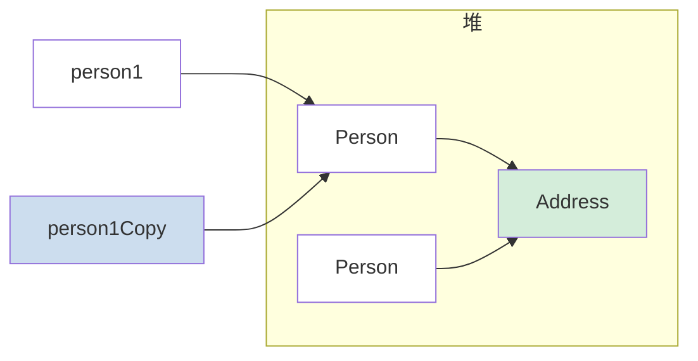

<!--
module:
  parent: java
  slug: java/concepts/oop
  type: article
  category: 主模块子文章
  summary: Java 面向对象三大特性：封装、继承、多态 + 抽象类/接口。
-->

# 面向对象基础

## 引言：基础概念

面向对象基础 是入门必学的基础概念。

本篇给出一句话定义 + 最小可运行示例 + 3 个常见误区，**5 分钟读完，10 分钟上手**。

---

## 面向对象和面向过程的区别

- **面向过程**：把解决问题的过程拆成一个个方法，通过一个个方法的执行解决问题
- **面向对象**：先抽象出对象，然后用对象执行方法的方式解决问题

面向对象的核心思想是将现实世界的事物映射为程序中的对象，通过对象之间的交互来解决问题。

## 对象实体与对象引用

- **对象实体**（对象实例）：通过`new`运算符创建，存储在**堆内存**中
- **对象引用**：指向对象实体的变量，存储在**栈内存**中

```java
Person p = new Person("张三", 20);  // p 是引用（栈中），new Person() 是实体（堆中）
```

## 对象的相等和引用相等

- **引用相等**（`==`）：比较两个引用是否指向同一个对象（内存地址是否相同）
- **对象相等**（`equals()`）：比较两个对象的内容是否相等（需要重写`equals()`方法）

```java
String s1 = new String("abc");
String s2 = new String("abc");

System.out.println(s1 == s2);      // false（不同对象实例）
System.out.println(s1.equals(s2)); // true（String 重写了 equals，比较内容）
```

## 构造方法

构造方法是创建对象时自动调用的特殊方法：

- 名字与**类名相同**
- **没有返回值**，也不能用`void`声明
- 只有在类中没有声明任何构造方法时，编译器才会自动生成一个**默认的无参构造方法**；一旦声明了任何构造方法，默认构造方法将不再自动生成
- 生成类的对象时**自动执行**，无需手动调用
- 构造方法**不能被重写**（Override），但可以**被重载**（Overload）

```java
public class Person {
    private String name;
    private int age;

    // 无参构造方法
    public Person() { }

    // 有参构造方法（重载）
    public Person(String name, int age) {
        this.name = name;
        this.age = age;
    }
}
```

## 面向对象三大特征

### 封装

封装是指将对象的状态信息（属性）隐藏在对象内部，不允许外部直接访问，而是通过公共方法（getter/setter）来控制对内部数据的访问和修改。

```java
public class BankAccount {
    private double balance;  // 私有字段，外部无法直接访问

    public double getBalance() { return balance; }

    public void deposit(double amount) {
        if (amount > 0) balance += amount;  // 内部逻辑控制
    }
}
```

### 访问修饰符

封装的实现依赖于访问修饰符的合理使用。Java 提供了四种访问级别：

| 修饰符 | 同类 | 同包 | 子类（不同包） | 不同包非子类 |
|--------|------|------|--------------|------------|
| `private` | ✅ | ❌ | ❌ | ❌ |
| `default`（不写） | ✅ | ✅ | ❌ | ❌ |
| `protected` | ✅ | ✅ | ✅ | ❌ |
| `public` | ✅ | ✅ | ✅ | ✅ |

- **`private`**：仅类内部可见，用于隐藏实现细节（如字段、内部辅助方法）
- **`default`**（包私有）：同包内可见，常用于包级别的工具类或协作类
- **`protected`**：同包 + 子类可见，常用于模板方法模式中供子类重写的方法
- **`public`**：所有地方可见，用于定义对外暴露的 API

> **最佳实践**：遵循**最小权限原则** — 尽可能使用最严格的访问级别。字段通常声明为 `private`，通过 `public` 的 getter/setter 访问；仅用于子类扩展的成员使用 `protected`。

### 继承

继承允许一个类（子类）获取另一个类（父类）的属性和方法，实现代码复用。

**继承的3个特性**：
1. 子类拥有父类所有的属性和方法（包括私有成员），但**私有成员只拥有但无法直接访问**
2. 子类可以拥有自己的属性和方法，对父类进行扩展
3. 子类可以重写父类的方法

```java
// Animal.java
public class Animal {
    public void eat() { System.out.println("eating..."); }
}
```

```java
// Dog.java
public class Dog extends Animal {
    public void bark() { System.out.println("barking..."); }  // 扩展

    @Override
    public void eat() { System.out.println("dog eating..."); } // 重写
}
```

### 多态

多态表示一个对象具有多种的状态，具体表现为**父类的引用指向子类的实例**。

**多态的前提条件**：
1. 对象类型和引用类型之间具有**继承**（类）/**实现**（接口）关系
2. 引用类型变量调用的方法在**运行时**才能确定具体执行哪个实现
3. 多态**不能调用**"只在子类存在但在父类不存在"的方法

> **运行时行为：动态绑定机制** — 如果子类重写了父类方法，执行子类方法；否则执行父类方法。这是多态在运行时的实际表现，而非多态成立的前提条件。

```java
Animal animal = new Dog();  // 父类引用指向子类实例
animal.eat();               // 运行时调用 Dog 的 eat()
// animal.bark();           // 编译错误 - Animal 没有 bark() 方法
```

## 接口和抽象类的异同

### 共同点

- 都不能被实例化
- 都可以包含抽象方法
- 都可以有默认实现的方法（Java 8+接口可用`default`关键字）

### 区别

| 对比维度 | 接口（Interface） | 抽象类（Abstract Class） |
|---------|-----------------|----------------------|
| **设计目的** | 行为规范约束，"能做什么" | 代码复用，"是什么" |
| **继承数量** | 一个类可以实现**多个**接口 | 一个类只能继承**一个**抽象类 |
| **成员变量** | 只能是`public static final` | 可以有各种类型的成员变量 |
| **构造方法** | 没有 | 可以有（供子类调用） |
| **默认方法** | Java 8+ 支持`default`方法 | 天然支持具体方法 |
| **静态方法** | Java 8+ 支持`static`方法（通过`接口名.方法名()`调用） | 支持`static`方法 |
| **私有方法** | Java 9+ 支持`private`方法（用于复用 `default` 方法中的公共逻辑） | 支持`private`方法 |

### Record 类型（Java 14 预览，Java 16 正式发布）

`record`是不可变数据载体类型，编译器会自动生成全参构造方法、访问方法（无`get`前缀）、`equals()`、`hashCode()`和`toString()`。所有字段隐式`private final`，天然支持不可变性和线程安全，适合用作 DTO、值对象、配置项等纯数据场景。

> 详细内容（紧凑构造方法、Record 约束、与 Lombok 对比、模式匹配等）参见 Record 类型专题文档。

## 深拷贝、浅拷贝、引用拷贝

- **引用拷贝**：只复制引用地址，两个引用指向同一个对象
- **浅拷贝**：在堆上创建新对象，但如果内部属性是引用类型，则直接复制引用地址（共用内部对象）
- **深拷贝**：完全复制整个对象，包括所有内部嵌套的对象



**引用拷贝**（两个引用指向同一个对象）：
```text
栈              堆
┌─────────┐
│ person1 │ ──────→ ┌──────────┐
│ person1Copy│ ────→ │  Person   │
└─────────┘         │  Address  │
                    └──────────┘
```

**浅拷贝**（创建新对象，但引用字段共享同一实例）：
```text
栈                       堆
─────────┐             ┌──────────┐      ┌──────────┐
│ person1 │ ──────────→ │  Person   │ ─→  │  Address │
└─────────┘             └──────────┘      └──────────
┌───────────────┐             ┌──────────┐
│ person1Copy   │ ──────────→ │  Person   │ ─→ (同上 Address)
└───────────────┘             └──────────┘
```

**深拷贝**（完全独立，所有嵌套对象都被复制）：
```text
栈                       堆
┌─────────┐             ┌──────────┐      ┌──────────┐
│ person1 │ ──────────→ │  Person   │ ─→  │  Address │
└─────────┘             └──────────      └──────────┘
┌───────────────┐             ┌──────────┐      ┌──────────┐
│ person1Copy   │ ──────────→ │  Person   │ ─→  │  Address │
└───────────────┘             └──────────┘      └──────────┘
```

首先定义引用类型字段 `Address`，它也需要实现 `Cloneable` 接口：

```java
public class Address implements Cloneable {
    private String city;

    public Address(String city) {
        this.city = city;
    }

    public String getCity() { return city; }
    public void setCity(String city) { this.city = city; }

    @Override
    public Address clone() {
        try {
            return (Address) super.clone();
        } catch (CloneNotSupportedException e) {
            throw new AssertionError(e);
        }
    }
}
```

### 浅拷贝实现

`Person` 类实现 `Cloneable` 接口，`clone()` 中调用 `super.clone()`。这只是浅拷贝 — `address` 字段复制的是引用地址，原对象和克隆对象共享同一个 `Address` 实例：

```java
public class Person implements Cloneable {
    private String name;
    private int age;
    private Address address;  // 引用类型属性

    public Person() { }

    public Person(String name, int age, Address address) {
        this.name = name;
        this.age = age;
        this.address = address;
    }

    public String getName() { return name; }
    public int getAge() { return age; }
    public Address getAddress() { return address; }

    // 浅拷贝：只复制基本类型字段，引用类型字段共享同一实例
    @Override
    public Person clone() {
        try {
            return (Person) super.clone();  // Object.clone() 执行逐字段浅拷贝
        } catch (CloneNotSupportedException e) {
            throw new AssertionError(e);  // 实现了 Cloneable 不会走到这里
        }
    }
}
```

### 深拷贝实现

深拷贝需要对引用类型字段也调用 `clone()`，使嵌套对象也被复制：

```java
// 深拷贝版本：重写 clone() 同时对引用类型字段进行克隆
@Override
public Person clone() {
    try {
        Person cloned = (Person) super.clone();  // 先浅拷贝基本类型字段
        cloned.address = this.address.clone();    // 再深拷贝引用类型字段
        return cloned;
    } catch (CloneNotSupportedException e) {
        throw new AssertionError(e);
    }
}
```

> **替代方案**：深拷贝也可以通过序列化/反序列化实现（如使用 `ByteArrayOutputStream` + `ObjectOutputStream`），适用于对象图较深且不便逐字段 clone 的场景。前提是对象及其所有嵌套对象都实现 `Serializable` 接口。

### 拷贝方式对比

```java
// 创建对象，address 字段已初始化
Person p1 = new Person("张三", 20, new Address("北京"));

// 引用拷贝 - 两个引用指向同一对象
Person p2 = p1;
System.out.println(p1 == p2);                          // true
System.out.println(p1.getAddress() == p2.getAddress()); // true

// 浅拷贝 - 新对象，但引用类型字段共享（使用浅拷贝版本的 clone()）
Person p3 = p1.clone();
System.out.println(p1 == p3);                          // false（不同对象）
System.out.println(p1.getAddress() == p3.getAddress()); // true（共享 Address）
p3.getAddress().setCity("上海");
System.out.println(p1.getAddress().getCity());          // "上海"（p1 也被修改！）

// 深拷贝 - 完全独立（使用深拷贝版本的 clone()）
Person p4 = p1.clone();
System.out.println(p1 == p4);                          // false（不同对象）
System.out.println(p1.getAddress() == p4.getAddress()); // false（Address 也独立）
p4.getAddress().setCity("广州");
System.out.println(p1.getAddress().getCity());          // "北京"（p1 不受影响）
```

## `hashCode()` 与哈希表

> `Object.hashCode()` 的默认行为（JVM 决定的哈希码，通常与内存地址相关）参见 [object/README.md](../../../README.md#2-hashcode)。本节聚焦于重写契约与最佳实践。

`hashCode()`的作用是获取哈希码（`int`整数），用于确定该对象在哈希表中的索引位置，从而快速检索对象。

```text
───────────┐   hashCode()   ┌──────────┐
│  "Hello"   │ ────────────→ │ 69609650 │
└───────────┘                └──────────┘
  字符串对象                      哈希码（int）
```

### 重写`equals()`必须重写`hashCode()`

- 如果两个对象`equals()`相等，它们的`hashCode()`**必须**相等
- 如果两个对象`hashCode()`相等，它们**不一定**`equals()`相等（哈希碰撞）
- 违反此规则会导致`HashMap`、`HashSet`等集合行为异常

以下是 `Person` 类中 `equals()` 和 `hashCode()` 的重写实现（这些方法位于 `Person` 类内部，引用了类中的 `name` 和 `age` 字段）：

```java
// ---- 文件顶部 import（类声明之前） ----
import java.util.Objects;

// ---- 以下方法位于 Person 类内部 ----

@Override
public boolean equals(Object o) {
    if (this == o) return true;
    if (o == null || getClass() != o.getClass()) return false;
    Person person = (Person) o;
    return age == person.age && Objects.equals(name, person.name);
}

@Override
public int hashCode() {
    return Objects.hash(name, age);
}
```
