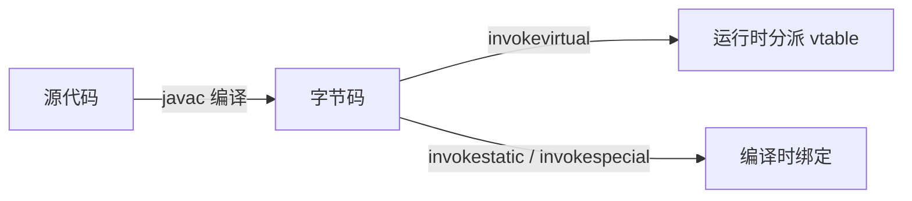

<!--
module:
  parent: java
  slug: java/concepts/polymorphism
  type: article
  category: 主模块子文章
  summary: Java 多态专题：重载 vs 重写 + 编译时 vs 运行时分派 + vtable 实现 + 默认方法 + super 调用 + 协变返回
-->

# Java 多态（polymorphism）专题

> **一句话定位**：**多态 = 父类引用指向子类实例 + 运行时才确定方法实现**。Java 多态分 4 维度：重载（静态）/ 重写（动态）+ 编译时（方法表查静态引用）/ 运行时（vtable 动态分派）+ 默认方法（接口 8+）+ 协变返回（override 兼容性）。

## 一、为什么 Java 要多态？

多态处理的是软件中最常见的矛盾：调用流程相对稳定，具体实现持续变化。
调用方依赖父类或接口，只约定“能做什么”，实现类负责“具体怎么做”。

它带来三个直接价值：

1. **解耦**：业务代码依赖 `Animal`，不依赖 `Dog`、`Cat` 等具体类。
2. **扩展**：新增实现时，已有调用流程通常不必修改，符合开闭原则。
3. **统一编排**：同一个父类引用可以接收不同子类对象，并表现出不同的行为。

```java
abstract class Animal {
    abstract void makeSound();
}
class Dog extends Animal {
    @Override void makeSound() { System.out.println("汪汪"); }
}
class Cat extends Animal {
    @Override void makeSound() { System.out.println("喵喵"); }
}

Animal animal = new Dog();
animal.makeSound();            // Dog.makeSound()
animal = new Cat();
animal.makeSound();            // Cat.makeSound()
```

这里变量的**静态类型**始终是 `Animal`，对象的**实际类型**却可以是 `Dog` 或 `Cat`。
所以多态可以概括为：**同一个引用契约，不同的运行时行为**。

---

## 二、重载（Overload）vs 重写（Override）

二者都可能表现为“方法名相同”，但所处阶段与判定规则完全不同。

| 维度 | 重载 Overload | 重写 Override |
|------|---------------|---------------|
| 发生位置 | 同一类中，也可涉及继承而来的同名方法 | 有继承或接口实现关系的类型之间 |
| 方法名 | 必须相同 | 必须相同 |
| 参数列表 | 必须不同（数量、类型或顺序） | 必须相同，准确说是 override-equivalent |
| 返回类型 | 可不同，但不能只靠返回类型区分重载 | 相同，或使用更具体的引用类型（协变返回） |
| 异常 | 各重载方法独立声明 | 不能新增或扩大受检异常；非受检异常不受此限制 |
| 访问修饰符 | 各重载方法独立决定 | 不能比被重写方法更严格 |
| 多态性 | 方法选择发生在编译期，常称静态多态 | 目标实现通常在运行期动态分派 |
| 辅助标记 | 没有专用注解 | 推荐使用 `@Override` 让编译器校验 |

### 2.1 重载：参数决定候选方法

```java
class Calculator {
    int add(int a, int b)          { return a + b; }
    long add(long a, long b)       { return a + b; }
    int add(int a, int b, int c)   { return a + b + c; }
    // 编译失败：返回类型不是方法签名的一部分，不能单独构成重载。
    // double add(int a, int b) { return a + b; }
}
```

编译器会结合实参数量、静态类型、基本类型提升、装箱和可变参数等规则选择“最具体”的可适用方法。
因此，重载看的是**调用点在编译期可见的信息**，不是对象运行时的实际类型。

```java
class Printer {
    void print(Animal value) { System.out.println("Animal"); }
    void print(Dog value)    { System.out.println("Dog"); }
}

Animal value = new Dog();
new Printer().print(value);   // Animal：value 的静态类型决定重载选择
```

### 2.2 重写：实际对象决定实现

```java
class Animal {
    public void eat() { System.out.println("animal eating"); }
}
class Dog extends Animal {
    @Override public void eat() { System.out.println("dog eating"); }
}

Animal value = new Dog();
value.eat();                  // dog eating
```

重写还有四条边界：

- `private` 方法对子类不可见，不会被重写。
- `static` 方法按声明类型解析，同名声明属于隐藏（hiding）。
- `final` 实例方法禁止子类重写。
- 构造方法不被继承，因此也不存在重写。

> 注意：重载选择与重写分派可以连续发生。编译器先选中某个参数描述符；如果它是可动态分派的实例方法，JVM 再按实际接收者选择该描述符对应的重写实现。

---

## 三、编译时多态 vs 运行时多态

“编译时”和“运行时”回答的是两个不同问题：**调用哪个方法签名**，以及**执行该签名的哪个实现**。



### 3.1 编译期：方法解析与重载选择

编译器先根据接收者的静态类型收集候选方法，再结合实参的静态类型完成重载解析。
这一步会确定方法名和描述符，例如 `print:(LAnimal;)V`。

```java
class DispatchDemo {
    void accept(Animal animal) { System.out.println("animal"); }
    void accept(Dog dog)       { System.out.println("dog"); }

    public static void main(String[] args) {
        Animal dog = new Dog();
        new DispatchDemo().accept(dog); // 编译期选 accept(Animal)
    }
}
```

静态方法由 `invokestatic` 调用；构造方法、显式 `super` 调用及部分特殊实例调用由 `invokespecial` 调用。
它们不执行普通虚方法的“按实际接收者选重写版本”流程。

### 3.2 运行期：按实际类型动态分派

普通类实例方法通常使用 `invokevirtual`；通过接口类型调用实例方法通常使用 `invokeinterface`。
方法引用在解析后，JVM 根据接收者对象的实际类型找到最终实现。

```java
Animal dog = new Dog();
dog.makeSound();               // 签名编译期已知，实现运行期选为 Dog.makeSound
```

| 对比项 | 编译时选择 | 运行时分派 |
|--------|------------|------------|
| 主要问题 | 哪个方法签名适用 | 该签名执行哪个重写实现 |
| 依据 | 引用与实参的静态类型 | 接收者对象的实际类型 |
| 典型语法 | 重载、静态方法、构造调用 | 被重写的实例方法 |
| 典型字节码 | `invokestatic`、`invokespecial`；重载后也可能生成虚调用 | `invokevirtual`、`invokeinterface` |
| 常见机制 | 符号解析与重载决议 | vtable / itable、内联缓存等 |

> 不要把“重载”简单等同于 `invokestatic`：实例方法也能重载，编译器选定描述符后仍可能生成 `invokevirtual`。

---

## 四、JVM vtable 实现

JVM 规范规定调用指令的语义，但没有强制虚方法表的具体内存布局。
**vtable / itable 是 HotSpot 的实现策略**，不是 Java 语言层可观察的 API。

### 4.1 HotSpot 的 Klass、vtable 与 itable

HotSpot 把类元数据保存在 `InstanceKlass` 等 VM 结构中，并为分派维护相关表：

| 结构 | 作用 |
|------|------|
| `InstanceKlass` | 保存类级元数据；有些二手资料笼统称其为 Klass table / ktable |
| vtable | 为普通类虚方法提供稳定槽位，服务 `invokevirtual` |
| itable | 将接口及其方法映射到实现，服务 `invokeinterface` |

`ktable` 不是 JVMS 规定的正式数据结构名称；阅读 HotSpot 源码时应以 `Klass`、vtable、itable 的实际定义为准。
itable 并非 Java 8 才出现：接口抽象方法早已需要动态分派，Java 8 默认方法只是增加了接口方法解析规则。

### 4.2 建表的概念模型

类在加载、验证和链接过程中准备方法元数据，可用下面的简化模型理解：

1. 子类沿用父类虚方法的槽位布局。
2. 子类重写方法时，用子类实现替换同一槽位的目标。
3. 子类新增的可虚调用方法获得新的槽位。
4. `static`、构造方法和显式 `super` 调用不走普通 vtable 动态分派。

```text
Animal vtable                 Dog vtable
┌────────────────────┐        ┌────────────────────┐
│ slot 0: toString   │        │ slot 0: toString   │  继承
│ slot 1: makeSound  │  --->  │ slot 1: makeSound  │  指向 Dog 实现
│ slot 2: eat        │        │ slot 2: eat        │  继承
└────────────────────┘        │ slot 3: bark       │  新增
                              └────────────────────┘
```

### 4.3 `invokevirtual` 的简化执行路径

```java
Animal animal = new Dog();
animal.makeSound();
```

1. 字节码中的 `invokevirtual` 操作数引用常量池 `Methodref`。
2. JVM 解析方法引用，并完成访问检查等步骤。
3. 执行时读取栈顶接收者，确认其实际类型是 `Dog`。
4. 借助已解析的方法信息和虚方法槽位定位 `Dog.makeSound()`。
5. 解释执行或进入 JIT 编译后的机器码。

常量池索引**不是 vtable 槽位号**。HotSpot 还会使用解析缓存、内联缓存和去虚化减少重复查找；当 JIT 能证明接收者只有一种类型时，甚至可以直接内联目标方法，并在假设失效时反优化。

---

## 五、super 调用 + 协变返回

### 5.1 `super.method()` 跳过普通虚分派

```java
class Dog extends Animal {
    @Override
    public void eat() {
        super.eat();
        System.out.println("dog eating");
    }
}
```

显式 `super.eat()` 编译为 `invokespecial`，目标是指定父类实现，而不是从 `Dog` 的 vtable 再选择 `Dog.eat()`。
构造器中的 `super(...)` 同样使用特殊调用语义。

### 5.2 协变返回（Java 5+）

重写方法可以把引用返回类型收窄为父方法返回类型的子类型：

```java
class Animal {
    public Animal reproduce() { return new Animal(); }
}

class Dog extends Animal {
    @Override
    public Dog reproduce() { return new Dog(); }
}

Dog puppy = new Dog().reproduce(); // 无需强制类型转换
```

协变只适用于引用类型；基本类型不能从 `long`“收窄”为 `int` 来构成合法重写。

### 5.3 桥接方法（Bridge Method）

由于 JVM 方法描述符包含返回类型，编译器可能为协变返回生成 `ACC_BRIDGE | ACC_SYNTHETIC` 方法，以保持父类描述符的调用兼容性。
概念上，`Dog.class` 同时包含：

```text
Dog reproduce();       // 源代码声明的方法
Animal reproduce();    // 编译器生成的 bridge，内部委托给前者后 areturn
```

泛型擦除也会触发类似桥接逻辑。反射扫描方法时可用 `Method.isBridge()` 和 `isSynthetic()` 识别它们。

---

## 六、接口默认方法（Java 8+）+ 静态方法

### 6.1 default：让接口可兼容演进

```java
interface Greeting {
    String hello(String name);

    default String goodbye(String name) {
        return "Goodbye, " + name;
    }
}
```

给已发布接口新增抽象方法会迫使所有实现类修改；默认方法提供可继承实现，使接口能够在兼容既有实现的前提下演进。
实现类仍可像重写普通实例方法一样重写 default 方法。

### 6.2 钻石冲突与三条选择规则

```java
interface A {
    default void hello() { System.out.println("A"); }
}

interface B {
    default void hello() { System.out.println("B"); }
}

class C implements A, B {
    @Override
    public void hello() {
        A.super.hello();          // 明确选择 A，也可完全自定义
    }
}
```

1. **类优先**：父类中的具体实例方法优先于接口默认方法。
2. **最具体接口优先**：子接口的默认方法优先于父接口版本。
3. **无关接口冲突必须解决**：同时继承两个无继承关系的同签名 default 时，实现类必须重写。

`A.super.hello()` 是显式接口父调用，采用特殊调用语义，不进行普通动态分派。

### 6.3 Java 9+ 接口 private 方法

```java
interface Logger {
    default void info(String message) { log("INFO", message); }
    default void warn(String message) { log("WARN", message); }
    private void log(String level, String message) {
        System.out.println("[" + level + "] " + message);
    }
}
```

private 接口方法用于复用 default / private 方法的内部逻辑，不会被实现类继承或重写。
接口还可以声明 `private static` 辅助方法。

### 6.4 接口 static 方法

```java
interface MathUtil {
    static int add(int left, int right) { return left + right; }
}

int result = MathUtil.add(1, 2); // 必须用接口名调用
```

接口 static 方法属于接口本身，**不会被实现类继承，也不参与多态**。
实现类声明同名 static 方法，也只是独立声明，不构成重写。

---

## 七、5 大反直觉 + 实战陷阱

| ❌ 常见误解 | ✅ 正确理解 | 实战建议 |
|-------------|-------------|----------|
| 重写必须有 `@Override` | 注解不是重写成立的必要条件，编译器不强制书写 | 始终标注，让编译器发现拼写或参数错误 |
| `private` 方法可以重写 | 父类 private 方法对子类不可见，子类同名方法是新声明 | 不要依赖 private 方法产生动态行为 |
| 静态方法可以重写 | static 同名属于隐藏，调用目标取决于限定类型 | 使用类名调用 static，避免用实例调用造成错觉 |
| `final` 方法可以重写 | final 明确禁止 override | 只在确实要冻结行为契约时使用 final |
| 构造函数可以重写 | 构造器不被继承，只能在本类内重载 | 用工厂方法表达“多态创建” |

再记住两个常见组合陷阱：

```java
Animal value = new Dog();
Printer.print(value);          // 重载先看 value 的静态类型
value.makeSound();             // 重写再看对象的实际类型
```

- **字段没有动态分派**：父子类同名字段按引用的静态类型访问，不要把字段隐藏误认为多态。
- **构造阶段调用可重写方法要谨慎**：父类构造器可能分派到尚未初始化完成的子类方法，读到默认值。

---

## 📚 参考来源

1. [JLS §8.4.8 Inheritance, Overriding, and Hiding](https://docs.oracle.com/javase/specs/jls/se25/html/jls-8.html#jls-8.4.8) — 重写、隐藏与返回类型替代规则。
2. [JLS §9.4.1 Interface Method Inheritance](https://docs.oracle.com/javase/specs/jls/se25/html/jls-9.html#jls-9.4.1) — 默认方法继承与冲突规则。
3. [JLS §15.12 Method Invocation Expressions](https://docs.oracle.com/javase/specs/jls/se25/html/jls-15.html#jls-15.12) — 编译期方法选择与运行期调用规则。
4. [JVMS §6.5 `invoke*` 指令](https://docs.oracle.com/javase/specs/jvms/se25/html/jvms-6.html) — `invokevirtual`、`invokeinterface`、`invokespecial`、`invokestatic` 的规范语义。
5. [OpenJDK Wiki: Virtual Calls](https://wiki.openjdk.org/display/HotSpot/VirtualCalls) — HotSpot vtable / itable 的二手实现说明；具体版本以 OpenJDK 源码为准。
## 🔗 相关章节

- **兄弟概念**（同 4 章）：
  - [oop 三大特征](../oop/README.md) — 基础多态介绍（line 137-150，本章节是其深度展开）
  - [object 类](../object/README.md) — 多态的最终基类
  - [method 方法](../method/README.md) — 方法签名 / 重载规则
  - [inner-class 内部类](../inner-class/README.md) — 匿名内部类即一种多态
- **咬文嚼字**：[polymorphism 面试](../../../13.split-hairs/01.java/polymorphism/README.md)（commit 2 创建）
- **JVM 原理**：[JVM — 讲明白 Java 虚拟机](../../jvm/README.md) — 字节码、类加载与执行引擎
- **故事联动**：[阿明餐厅](../../../12.story/README.md) — 用餐厅角色协作理解面向对象的扩展与替换

← [返回 concepts](../README.md)
