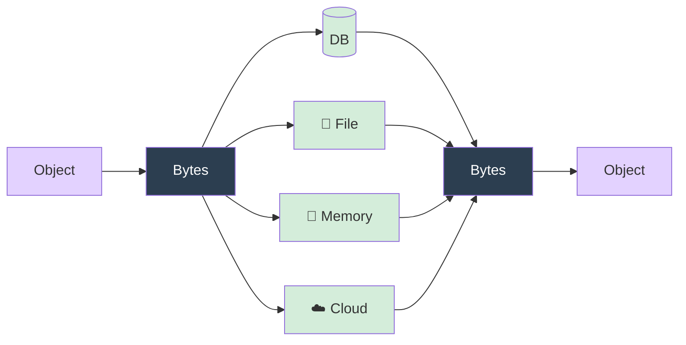

<!--
module:
  parent: java
  slug: java/concepts/serialization
  type: article
  category: 主模块子文章
  summary: Java 序列化：Serializable、Externalizable、serialVersionUID。
-->

# 序列化和反序列化

## 引言：基础概念

序列化和反序列化 是入门必学的基础概念。

本篇给出一句话定义 + 最小可运行示例 + 3 个常见误区，**5 分钟读完，10 分钟上手**。

---

- **序列化**：将数据结构或对象转换成二进制字节流的过程
- **反序列化**：将序列化过程中生成的二进制字节流还原成数据结构或对象的过程

## 为什么需要序列化和反序列化


```mermaid
graph LR
    Obj[Object] --> Bytes[Bytes]
    Bytes --> DB[(DB)]
    Bytes --> File[📄 File]
    Bytes --> Mem[💾 Memory]
    Bytes --> Cloud[☁️ Cloud]

    DB --> Bytes2[Bytes]
    File --> Bytes2
    Mem --> Bytes2
    Cloud --> Bytes2
    Bytes2 --> Obj2[Object]

    classDef obj fill:#e3d2ff
    classDef bytes fill:#2c3e50,color:#fff
    classDef storage fill:#d4edda

    class Obj,Obj2 obj
    class Bytes,Bytes2 bytes
    class DB,File,Mem,Cloud storage
```

1. **数据持久化**：将内存中的对象状态保存到文件、数据库等存储介质
2. **远程通信**：在分布式系统中通过网络传输对象（如 RPC 调用）
3. **对象状态保存与恢复**：实现撤销/重做功能、会话恢复等
4. **数据交换**：不同系统之间交换数据（如 JSON、XML 格式）
5. **内存管理优化**：将不常用数据序列化到磁盘，释放内存空间

## 序列化的基本概念

Java 提供了内置的序列化机制，核心要素：

- **`Serializable`接口**：标记接口，标识一个类可以被序列化
- **`Externalizable`接口**：继承自 `Serializable`，提供 `writeExternal()` 和 `readExternal()` 方法，允许完全自定义序列化逻辑，性能通常优于默认序列化机制
- **`serialVersionUID`**：用于版本兼容性校验，防止序列化/反序列化版本不一致
- **`transient`关键字**：标记不需要序列化的字段

## 序列化的实现

```java
// User.java
import java.io.Serializable;

public class User implements Serializable {
    private static final long serialVersionUID = 1L;
    private String name;
    private int age;
    private transient String password;  // 不参与序列化

    public User(String name, int age, String password) {
        this.name = name;
        this.age = age;
        this.password = password;
    }

    public String getName() { return name; }
    public void setName(String name) { this.name = name; }
    public int getAge() { return age; }
    public void setAge(int age) { this.age = age; }
    public String getPassword() { return password; }
    public void setPassword(String password) { this.password = password; }

    @Override
    public String toString() {
        return "User{name='" + name + "', age=" + age + ", password='" + password + "'}";
    }
}
```

```java
// SerializationDemo.java
import java.io.ObjectOutputStream;
import java.io.ObjectInputStream;
import java.io.FileOutputStream;
import java.io.FileInputStream;

public class SerializationDemo {
    public static void main(String[] args) {
        // 序列化
        User user = new User("Tom", 18, "secret123");
        try (ObjectOutputStream oos = new ObjectOutputStream(new FileOutputStream("user.ser"))) {
            oos.writeObject(user);
        } catch (Exception e) {
            e.printStackTrace();
        }

        // 反序列化
        try (ObjectInputStream ois = new ObjectInputStream(new FileInputStream("user.ser"))) {
            User deserializedUser = (User) ois.readObject();
            System.out.println(deserializedUser);
            // 验证 transient 字段：输出 "secret123" 说明序列化前有值，输出 "null" 说明 transient 生效
            System.out.println("password (transient): " + deserializedUser.getPassword()); // 输出 null
        } catch (Exception e) {
            e.printStackTrace();
        }
    }
}
```

## 应用场景

- **对象持久化**：文件存储、Redis 缓存、数据库存储
- **网络传输**：RPC 调用、消息队列、HTTP API
- **分布式计算**：不同节点之间传递对象

### 序列化协议在 TCP/IP 模型中的位置

```text
┌─────────────────────────────────────────────────────────┐
│                OSI 七层协议          TCP/IP 四层协议      │
├─────────────────────────────────────────────────────────┤
│   7 应用层         ┐              应用层  ┌──────────────
│   6 表示层（序列化）│ ◄── 对应 ─│（Telnet/FTP/SMTP/HTTP）│
│   5 会话层         ┘                     └──────────────┘
│   4 运输层                       运输层（TCP/UDP）        │
│   3 网络层                       网际层（IP）             │
│   2 数据链路层                    网络接口层              │
│   1 物理层                       网络接口层              │
└─────────────────────────────────────────────────────────┘
```

序列化协议属于 TCP/IP 协议**应用层**的一部分，对应 OSI 七层模型中的**表示层**（负责数据的编码/解码）。

## 注意事项

1. **版本兼容性**：类结构变更后，旧的序列化数据可能无法正确反序列化。务必维护好`serialVersionUID`
2. **性能影响**：序列化和反序列化可能消耗大量资源，大数据场景需谨慎
3. **安全风险**：反序列化可能执行恶意代码，需验证数据来源和完整性。Java 9 引入了 **ObjectInputFilter**（JEP 290）作为防御反序列化攻击的核心机制，可设置白名单/黑名单限制可反序列化的类：
   ```java
   // 方式一：代码中设置 ObjectInputFilter
   ObjectInputFilter filter = ObjectInputFilter.Config.createFilter(
       "com.example.*;java.base/*;!*"); // 白名单 + 黑名单
   try (ObjectInputStream ois = new ObjectInputStream(new FileInputStream("data.ser"))) {
       ois.setObjectInputFilter(filter);
       Object obj = ois.readObject(); // 只允许指定包下的类被反序列化
   }

   // 方式二：JVM 启动参数全局配置
   // java -Djdk.serialFilter="com.example.*;java.base/*;!*" MyApp
   ```
4. **字段过滤**：使用`transient`标记敏感或无需持久化的字段
5. **循环引用**：对象之间的循环引用可能导致序列化失败或数据膨胀
6. **readResolve() 与 writeReplace()**：
   - `readResolve()`：在反序列化完成后被调用，可替换反序列化得到的对象。常用于**单例模式**，确保反序列化后仍返回同一实例：
     ```java
     public class Singleton implements Serializable {
         private static final Singleton INSTANCE = new Singleton();
         private Singleton() {}
         // 保证反序列化后仍为同一实例
         private Object readResolve() { return INSTANCE; }
     }
     ```
   - `writeReplace()`：在序列化前被调用，可替换待序列化的对象。常用于**序列化代理模式**（Effective Java 推荐），通过一个内部代理类来安全地完成序列化，避免真实对象直接暴露序列化细节

### 现代 Java 与序列化

Java 16 正式引入的 **Record 类型**（Java 14/15 为预览特性，JEP 359/384/395）天然支持序列化，但其行为与普通类有所不同：

- Record 和普通类一样**必须实现 `Serializable` 接口**才能被序列化。实现 `Serializable` 后，所有组件（components）会被自动序列化，无需手动编写序列化逻辑
- Record 的序列化/反序列化由 **JVM 运行时**自动处理。如果在 Record 中定义 `writeObject`/`readObject` 等方法会被**忽略**，序列化行为仅基于组件和规范构造方法（canonical constructor）
- 反序列化时通过**规范构造方法**重建对象，确保不可变性得到保持
- 这一设计避免了传统 Java 序列化中常见的安全风险和自定义逻辑带来的复杂性

## 序列化框架对比

### 主流框架速查表

| 框架 | 格式 | 跨语言 | 性能 | 数据大小 | Schema | 主要场景 |
|------|------|--------|------|---------|--------|---------|
| **Jackson** | JSON | ✅ | 中 | 大 | 不需要 | Web API、RESTful 服务 |
| **Fastjson2** | JSON | ❌ | 高 | 大 | 不需要 | 国内 Web 开发 |
| **Gson** | JSON | ✅ | 中 | 大 | 不需要 | 简单 JSON 处理 |
| **Protobuf** | 二进制 | ✅ | 极高 | 极小 | 需要 | 微服务、gRPC |
| **Kryo** | 二进制 | ❌ | 极高 | 小 | 不需要 | 高性能 Java 内部通信 |
| **Hessian** | 二进制 | ✅ | 高 | 小 | 不需要 | Dubbo RPC、跨语言 |
| **Thrift** | 二进制 | ✅ | 极高 | 小 | 需要 | 跨语言 RPC |
| **Avro** | 二进制 | ✅ | 高 | 小 | 可选 | 大数据（Kafka/Hadoop） |
| **Java 原生** | 二进制 | ❌ | 低 | 大 | 不需要 | 简单 Java 内部使用 |

### 主流 JSON 框架详解

#### Jackson

最流行的 Java JSON 库，Spring Boot 默认使用：

```java
import com.fasterxml.jackson.databind.ObjectMapper;
import com.fasterxml.jackson.databind.SerializationFeature;
import java.text.SimpleDateFormat;

// User user = new User("Tom", 18, "secret123"); // 从上下文获取

ObjectMapper mapper = new ObjectMapper();
try {
    // 序列化
    String json = mapper.writeValueAsString(user);

    // 反序列化
    User deserializedUser = mapper.readValue(json, User.class);

    // 高级用法
    mapper.enable(SerializationFeature.INDENT_OUTPUT);  // 格式化输出
    mapper.setDateFormat(new SimpleDateFormat("yyyy-MM-dd"));  // 日期格式
} catch (Exception e) {
    e.printStackTrace();
}
```

#### Fastjson2

阿里巴巴开源，国内使用广泛，性能优秀：

```java
import com.alibaba.fastjson2.JSON;

// User user = new User("Tom", 18, "secret123"); // 从上下文获取

// 序列化
String json = JSON.toJSONString(user);

// 反序列化
User deserializedUser = JSON.parseObject(json, User.class);
```

#### Gson

Google 开发，API 简洁：

```java
import com.google.gson.Gson;

// User user = new User("Tom", 18, "secret123"); // 从上下文获取

Gson gson = new Gson();

// 序列化
String json = gson.toJson(user);

// 反序列化
User deserializedUser = gson.fromJson(json, User.class);
```

### 主流二进制框架详解

#### Protobuf（Protocol Buffers）

Google 开发，跨语言跨平台，gRPC 底层协议：

```protobuf
// user.proto
message User {
    string name = 1;
    int32 age = 2;
    string email = 3;
}
```

```java
// 使用生成的代码
User user = User.newBuilder()
    .setName("Tom")
    .setAge(18)
    .setEmail("tom@example.com")
    .build();

byte[] bytes = user.toByteArray();  // 序列化
User parsed = User.parseFrom(bytes); // 反序列化
```

#### Kryo

高性能 Java 专用序列化框架，Spark/Flink 等大数据框架内部使用：

```java
import com.esotericsoftware.kryo.Kryo;
import com.esotericsoftware.kryo.io.Input;
import com.esotericsoftware.kryo.io.Output;

// User user = new User("Tom", 18, "secret123"); // 从上下文获取

Kryo kryo = new Kryo();
kryo.register(User.class);

// 序列化
byte[] bytes;
try (Output output = new Output(1024)) {
    kryo.writeObject(output, user);
    bytes = output.toBytes();
}

// 反序列化
try (Input input = new Input(bytes)) {
    User deserialized = kryo.readObject(input, User.class);
}
```

#### Hessian

轻量级跨语言二进制协议，Dubbo 2.x 默认序列化协议。Dubbo 3.x 的 Triple 协议默认使用 **Protobuf** 序列化（兼容 gRPC），Hessian 仍可作为可选配置使用：

```java
import com.caucho.hessian.io.Hessian2Output;
import com.caucho.hessian.io.Hessian2Input;
import java.io.ByteArrayOutputStream;
import java.io.ByteArrayInputStream;

// User user = new User("Tom", 18, "secret123"); // 从上下文获取

try {
    // 序列化
    ByteArrayOutputStream bos = new ByteArrayOutputStream();
    Hessian2Output out = new Hessian2Output(bos);
    out.writeObject(user);
    out.close();
    byte[] bytes = bos.toByteArray();

    // 反序列化
    ByteArrayInputStream bis = new ByteArrayInputStream(bytes);
    Hessian2Input in = new Hessian2Input(bis);
    User deserialized = (User) in.readObject();
    in.close();
} catch (Exception e) {
    e.printStackTrace();
}
```

### 如何选择序列化框架

```text
需要跨语言通信？
├── 是 → 需要 Schema 定义？
│   ├── 是 → Protobuf / Thrift
│   └── 否 → Hessian / Jackson(JSON)
└── 否 → 纯 Java 高性能？
    ├── 是 → Kryo
    └── 否 → 与 Web/API 交互？
        ├── 是 → Jackson / Fastjson2
        └── 否 → Java 原生（简单场景）
```

## 性能对比

```text
平均响应时间（ms，越低越好）        平均 TPS（越高越好）
┌──────────────────────────┐       ┌──────────────────────────┐
│ Dubbo: FastJson    ██    │       │ Dubbo: FastJson   ███████ │
│ Dubbo: Hessian2   ██     │       │ Dubbo: Hessian2   ███████ │
│ Dubbo: DubboSer   ██     │       │ Dubbo: DubboSer   ███████ │
│ Dubbo: Kryo      █       │       │ Dubbo: Kryo       ████████│
│ Dubbo: FST       █       │       │ Dubbo: FST        ████████│
│ REST: Netty+JSON ███     │       │ REST: Netty+JSON  ████    │
│ REST: Tomcat+J   ███     │       │ REST: Tomcat+J    █████   │
│ REST: Jetty+J    ████████│       │ REST: Jetty+J     █       │
└────0────2────4────6─8─10 ┘       └──0───2k───4k───6k──8k──9k ┘
```

**一般规律**：二进制格式 > JSON 格式 > XML 格式（在序列化速度和数据大小方面）

---

← [返回 Java 核心概念](../README.md)
