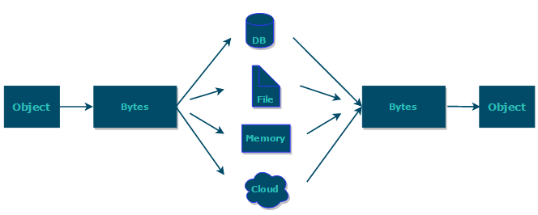

# 序列化和反序列化

- **序列化**：将数据结构或对象转换成二进制字节流的过程
- **反序列化**：将在序列化过程中所生成的二进制字节流转换成数据结构或者对象的过程

## 序列化的基本概念

序列化是指将一个对象转换为二进制数据流，以便进行网络传输、磁盘存储等操作。Java提供了内置的序列化机制，通过实现Serializable接口来标记一个类可以被序列化。在序列化过程中，Java会将对象的状态（包括对象的字段值）以及对象的类信息写入到输出流中。
- **Serializable接口**：Java提供的标记接口，用于标识一个类可以被序列化。
- **serialVersionUID**：用于识别版本之间的兼容性，防止序列化和反序列化的版本不一致导致出错。
- **transient关键字**：标记一个字段不需要进行序列化。

## 为什么需要序列化和反序列化



序列化和反序列化在软件开发中扮演着至关重要的角色，它们主要解决以下几个核心问题：
1. **数据持久化**：序列化能够将内存中的对象状态转换为可存储或可传输的格式（如文件、数据库记录或网络数据包）。这样，即使程序终止运行或计算机关闭，对象的状态也能被保存下来，并在需要时通过反序列化恢复。这对于实现数据的持久化存储至关重要。
2. **远程通信**：在分布式系统中，不同进程或机器之间需要交换数据。序列化能够将对象转换为字节流，从而可以通过网络进行传输。接收方则通过反序列化将这些字节流还原为对象，实现数据的远程通信。
3. **对象状态保存与恢复**：在某些情况下，我们可能需要保存对象的当前状态以便稍后恢复。例如，在实现撤销（undo）或重做（redo）功能时，可以通过序列化保存操作前的对象状态，并在需要时通过反序列化恢复这些状态。
4. **数据交换**：不同的软件系统和应用程序可能需要交换数据。通过序列化，我们可以将数据转换为一种通用的、与平台无关的格式（如JSON、XML等），从而实现不同系统之间的数据交换。
5. **内存管理优化**：在某些情况下，通过序列化将对象写入磁盘或其他存储介质，并在需要时再通过反序列化加载到内存中，可以有效地管理内存使用。例如，在处理大量数据时，可以将不常用的数据序列化后存储起来，以释放内存空间供其他任务使用。
6. **安全性与隐私保护**：序列化还可以用于数据加密和隐私保护。通过将敏感数据序列化为加密格式，并在传输或存储过程中保持加密状态，可以确保数据的安全性。接收方在解密数据后再进行反序列化，从而恢复原始对象状态。

## 序列化的实现方法

要实现序列化，首先需要定义一个需要序列化的类，并实现Serializable接口。然后，创建一个ObjectOutputStream对象，并将需要序列化的对象写入到输出流中（这里使用的是Java内置的序列化机制）。
```java
public class User implements Serializable {
    private static final long serialVersionUID = 1L;
    private String name;
    private int age;
    // getters and setters
}

// 序列化对象
User user = new User("Tom", 18);
try (ObjectOutputStream oos = new ObjectOutputStream(new FileOutputStream("user.ser"))) {
    oos.writeObject(user);
} catch (IOException e) {
    e.printStackTrace();
}
```

### serialVersionUID

在Java的序列化机制中，serialVersionUID 是一个关键字段，用于验证序列化对象和反序列化对象的版本兼容性。它的核心作用是确保反序列化过程中类的结构未发生不兼容的变更，从而避免数据损坏或运行时错误。

*默认行为*：如果没有显式定义 serialVersionUID，Java 会根据类的结构（如字段、方法、访问修饰符等）自动生成一个版本号（基于哈希算法）。
*问题*：当类结构发生变化（例如新增/删除字段、修改方法签名）时，自动生成的 serialVersionUID 也会改变。此时反序列化会失败，抛出 InvalidClassException。
*显式定义的优势*：通过手动指定 serialVersionUID，可以控制版本兼容性，允许在类结构微调时仍能反序列化旧数据。

## 反序列化的基本概念

反序列化是指将序列化后的二进制数据流还原成原来的对象，重新获取对象的引用。在反序列化过程中，Java会根据字节流中的对象状态及描述信息，通过反序列化重建对象。要实现反序列化，需要创建一个ObjectInputStream对象，并从输入流中读取序列化后的对象。（这里使用的是Java内置的反序列化机制）。
```java
// 反序列化对象
try (ObjectInputStream ois = new ObjectInputStream(new FileInputStream("user.ser"))) {
    User deserializedUser = (User) ois.readObject();
    System.out.println(deserializedUser);
} catch (IOException | ClassNotFoundException e) {
    e.printStackTrace();
}
```

## 序列化和反序列化的应用场景

- **对象持久化**：将对象序列化后保存到磁盘文件中，以便在需要时重新加载。
  - 将对象存储到文件之前需要进行序列化，将对象从文件中读取出来需要进行反序列化；
  - 将对象存储到数据库(如 Redis)之前需要用到序列化，将对象从缓存数据库中读取出来需要反序列化；
  - 将对象存储到内存之前需要进行序列化，从内存中读取出来之后需要进行反序列化。
- **网络传输**：将对象序列化后通过网络传输，接收端再反序列化恢复为对象。
  - 对象在进行网络传输(比如远程方法调用 RPC 的时候)之前需要先被序列化，接收到序列化的对象之后需要再进行反序列化；
  - 将对象存储到内存之前需要进行序列化，从内存中读取出来之后需要进行反序列化。
- **分布式计算**：在分布式系统中，通过序列化和反序列化实现对象在不同节点之间的传递。

### 列化协议在 TCP/IP 4 层模型的应用


OSI 七层协议模型中，表示层是对应用层的用户数据进行处理转换为二进制流或者将二进制流转换成应用层的用户数据。  
与序列化和反序列化相符。  
OSI 七层协议模型中的应用层、表示层和会话层对应的都是 TCP/IP 四层模型中的应用层  
序列化协议属于 TCP/IP 协议应用层的一部分

## 序列化和反序列化的注意事项

- **版本兼容性**：如果类结构发生改变，旧的序列化数据可能无法正确反序列化。因此，建议使用serialVersionUID来确保版本的一致性。
- **性能影响**：序列化和反序列化可能消耗大量资源，特别是在处理大数据时。因此，在性能敏感的场景中需要谨慎使用。
- **安全问题**：反序列化时可能会执行恶意代码，导致安全漏洞。因此，在反序列化之前需要验证序列化数据的来源和完整性。
- **字段过滤**：对于不想序列化的字段，可以使用transient关键字进行标记。

## 序列化和反序列化框架

在Java中，有许多优秀的序列化和反序列化框架可供选择。以下是一些主要的Java序列化和反序列化框架：
1. Hessian
   - 优点：Hessian是一个轻量级的二进制序列化协议，它允许对象在网络中传输时保持其Java类型信息。Hessian序列化后的数据相对较小，且序列化速度较快。
   - 使用场景：适用于需要高效传输和存储Java对象的场景。
2. Kryo
   - 优点：Kryo是一个快速的序列化框架，它提供了高效的读写操作，并且支持自定义序列化器和反序列化器。Kryo序列化后的数据通常比Java内置的序列化机制小得多。
   - 使用场景：适用于需要高性能序列化的场景，如实时通信、分布式系统等。
3. Protostuff
   - 优点：Protostuff是一个基于Schema的序列化框架，它使用了一种高效的二进制格式来存储和传输Java对象。Protostuff提供了比Java内置序列化机制更高的性能和更小的序列化数据。
   - 使用场景：适用于需要高性能和低存储开销的场景，如大数据处理、云计算等。
4. Protobuf（Protocol Buffers）
   - 优点：Protobuf是Google开发的一种语言中立、平台中立、可扩展的序列化结构数据的方法。它类似于XML，但更小、更快、更简单。Protobuf定义了一种紧凑的二进制格式来存储和传输数据，同时提供了高效的读写操作。
   - 使用场景：适用于需要跨语言、跨平台传输和存储结构化数据的场景，如分布式系统、微服务架构等。
5. Thrift
   - 优点：Thrift是Apache开发的一个跨语言的服务开发框架，它提供了定义和创建高效、可扩展的服务的机制。Thrift支持多种编程语言，并提供了高效的二进制序列化机制。
   - 使用场景：适用于需要跨语言、跨平台构建分布式服务的场景。
6. Avro
   - 优点：Avro是Apache开发的一个数据序列化系统，它提供了紧凑、快速的二进制数据格式以及用于序列化和反序列化的代码生成工具。Avro还支持数据模式的演变，使得在不影响向后兼容性的情况下可以更新数据模式。
   - 使用场景：适用于需要处理大量数据并进行高效序列化和反序列化的场景，如大数据处理、数据管道等。
7. FST (Fast Serialization/Deserialization for Java)
   - 优点：FST是一个高性能的Java序列化框架，它提供了比Java内置序列化机制更快的序列化和反序列化速度。FST还支持对象的深拷贝和浅拷贝。
   - 使用场景：适用于需要高性能序列化和反序列化的场景，如实时通信、游戏开发等。
8. MsgPack
   - MsgPack是一种高效的二进制序列化格式，它支持多种编程语言，并提供了高效的读写操作。MsgPack序列化后的数据较小，且支持流处理和部分解析。
   - 使用场景：适用于需要跨语言、跨平台传输和存储高效二进制数据的场景。
9. Java原生序列化
   - 这是Java自带的序列化机制，通过实现Serializable接口来标记一个类可以被序列化。虽然其性能可能不是最优的，但它在Java生态系统中得到了广泛的支持和应用。
10. Jackson
    - Jackson是一个流行的Java库，用于将Java对象转换为JSON格式的数据，以及将JSON数据反序列化为Java对象。它提供了丰富的配置选项和扩展点，使得它非常适合用于Web服务和RESTful API的数据交换。
11. Gson
    - Gson是Google开发的一个Java库，用于将Java对象序列化为JSON格式的数据，以及将JSON数据反序列化为Java对象。Gson的使用非常简单，只需几行代码就可以完成序列化和反序列化操作。
12. Smile
    - Smile是一种紧凑的二进制序列化格式，它基于JSON的语法结构，但使用了更高效的编码方式。Smile提供了与JSON相似的可读性，同时提供了更高的性能和更小的序列化数据。它非常适合用于需要高性能和低存储开销的场景。
13. XStream
    - XStream是一个Java库，它允许将Java对象序列化为XML格式的数据，以及将XML数据反序列化为Java对象。XStream的使用非常简单，只需几行代码就可以完成序列化和反序列化操作。然而，需要注意的是，XStream在安全性方面存在一些已知的问题，因此在使用时需要谨慎。
14. Bson（用于MongoDB）
    - Bson是MongoDB使用的一种二进制序列化格式，它类似于JSON，但提供了更高效的存储和传输方式。Bson支持复杂的对象结构，包括嵌套的对象和数组。当使用MongoDB作为数据库时，Bson是一个很好的选择。
15. zfoo
    - zfoo是一个高性能的Java序列化框架，它在速度和序列化后的大小方面都比一些传统的序列化框架有明显的优势。zfoo支持多种数据类型和结构，包括基本数据类型、数组、集合、映射等。它非常适合用于需要高性能和低存储开销的场景。FastjsonFastjson是一个基于Java开发的、高性能的JSON解析器和生成器，由Alibaba开源。支持JSON序列化和反序列化、支持复杂数据类型，包括Map、List、数组、嵌套对象等。

需要注意的是，每个框架都有其独特的优点和适用场景。在选择序列化框架时，需要根据具体的应用场景和需求进行权衡。例如，如果需要与Web服务或RESTful API进行交互，可以选择Jackson、FastJson或Gson；如果需要与MongoDB数据库进行交互，可以选择Bson；如果需要高性能和低存储开销，可以选择Kryo、Protostuff、zfoo等框架；如果需要高性能和低存储开销，可以选择Kryo或Protostuff；如果需要跨语言、跨平台传输和存储结构化数据，可以选择Protobuf或Thrift；如果需要处理大量数据并进行高效序列化和反序列化，可以选择Avro或FST。

## 性能对比

