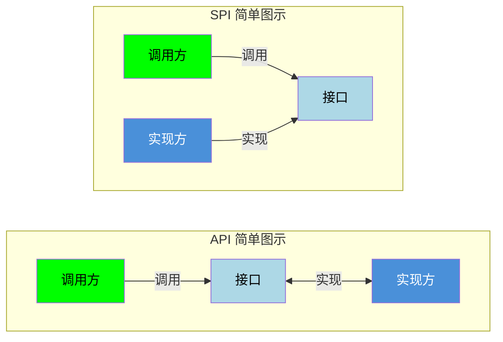

# SPI（Service Provider Interface）

## 引言：反直觉代码（[AUTO] 自动生成，待人工 review）

SPI（Service Provider Interface） 本应该很简单，SPI 即 Service Provider Interface（服务提供者接口），是一种 Java 的扩展机制，允许应用程序在运行时动态发现和加载接口的实现类

**但实际**：面试/生产中常被问起或踩坑的是——
代码看着对、跑起来对，但仔细一问深一层就漏馅。本篇就从'反直觉'这个角度切入，把踩坑点和根因摆出来。

> 📌 本段由 `note/scripts/add-intro.py` 自动生成（场景模板 + README 摘录）。**下次 review 时请改为真实场景 + 数字 + 反思**，目前仅满足'有引言'的最低要求。

---


SPI 即 Service Provider Interface（服务提供者接口），是一种 Java 的扩展机制，允许应用程序在运行时动态发现和加载接口的实现类。

## 核心概念

- **接口定义方**（框架/库提供方）：定义接口规范
- **服务提供者**（第三方/扩展开发者）：实现接口
- **服务加载器**（`ServiceLoader`）：在运行时自动发现和加载实现类

## SPI 和 API 的区别



| 对比维度 | SPI | API |
|---------|-----|-----|
| **定义方式** | 框架定义接口，第三方实现 | 开发者主动编写并公开 |
| **调用方式** | 通过配置文件动态加载 | 直接调用接口方法 |
| **灵活性** | 运行时动态替换实现 | 编译时确定实现 |
| **依赖关系** | 调用方依赖接口+加载器 | 调用方依赖实现库 |
| **使用目的** | 插件化、可扩展 | 功能暴露、系统交互 |

## SPI 的使用步骤

### 0. 定义业务类

```java
// 订单类（后续示例中使用的业务对象）
public class Order {
    private final double amount;

    public Order(double amount) {
        this.amount = amount;
    }

    public double getAmount() {
        return amount;
    }
}
```

### 1. 定义接口

```java
// 框架方定义接口
public interface PaymentProvider {
    void pay(Order order);
    String getName();
}
```

### 2. 实现接口

```java
// 第三方实现 - 支付宝
public class AlipayProvider implements PaymentProvider {
    @Override
    public void pay(Order order) {
        System.out.println("使用支付宝支付: " + order.getAmount());
    }

    @Override
    public String getName() { return "alipay"; }
}

// 第三方实现 - 微信支付
public class WechatProvider implements PaymentProvider {
    @Override
    public void pay(Order order) {
        System.out.println("使用微信支付: " + order.getAmount());
    }

    @Override
    public String getName() { return "wechat"; }
}
```

### 3. 配置 SPI 文件

在实现类的 jar 包中创建配置文件：

```
META-INF/services/com.example.PaymentProvider
```

文件内容为实现类的全限定名，每行一个：

```
com.example.impl.AlipayProvider
com.example.impl.WechatProvider
```

### 4. 使用 ServiceLoader 加载

```java
import java.util.ServiceLoader;

// 加载所有实现
ServiceLoader<PaymentProvider> loader = ServiceLoader.load(PaymentProvider.class);

for (PaymentProvider provider : loader) {
    System.out.println("发现支付服务: " + provider.getName());
}

// 查找特定实现（注意：stream() 和 ServiceLoader.Provider 需要 Java 9+）
// 最佳实践：先过滤再实例化，避免全量加载所有 Provider
PaymentProvider alipay = loader.stream()
    .filter(p -> "alipay".equals(p.type().getSimpleName()))
    .findFirst()
    .map(ServiceLoader.Provider::get)
    .orElseThrow(() -> new RuntimeException("未找到支付宝支付"));

alipay.pay(new Order(100.0));
```

## SPI 优缺点

### 优点

- **插件化扩展**：运行时动态加载实现类，无需修改代码即可扩展功能
- **松耦合**：接口与实现分离，提高可维护性和可测试性
- **可扩展性**：第三方开发者可以自行实现接口并注册

### 缺点

| 缺点 | 说明 |
|------|------|
| **配置繁琐** | 需要手动维护 `META-INF/services/` 下的配置文件 |
| **无法动态更新** | 应用启动后实现类的变更不会自动生效，需调用 reload() 方法手动刷新缓存 |
| **无法解决冲突** | 存在多个实现类时，加载顺序不确定，缺乏优先级选择机制 |
| **全量扫描** | `ServiceLoader` 启动时会扫描所有配置文件（eagerly），虽然类的实例化是延迟的（lazily），但仍需遍历所有 Provider 才能定位目标实现 |
| **获取方式不灵活** | 只能通过迭代器遍历，无法按名称直接获取 |
| **线程不安全** | `ServiceLoader` 实例在多线程环境下不安全 |

## 经典应用场景

### JDBC 驱动加载

**历史演进**：JDBC 4.0（Java 6）之前，需要手动加载驱动：

```java
// JDBC 3.0 及之前：必须手动注册驱动
Class.forName("com.mysql.jdbc.Driver");
Connection conn = DriverManager.getConnection(
    "jdbc:mysql://localhost:3306/db", "user", "password"
);
```

JDBC 4.0 之后，通过 SPI 自动发现驱动，消除了 `Class.forName()` 调用：

```java
// JDBC 4.0+（Java 6+）：SPI 自动加载，无需 Class.forName()
// SPI 配置文件: META-INF/services/java.sql.Driver
// 内容: com.mysql.cj.jdbc.Driver

// DriverManager 内部通过 ServiceLoader 自动发现并加载驱动
Connection conn = DriverManager.getConnection(
    "jdbc:mysql://localhost:3306/db", "user", "password"
);
```

这是 SPI 最经典的应用场景之一，体现了"约定优于配置"的设计思想。

### 日志框架

```java
// SLF4J 通过 SPI 加载日志实现
// META-INF/services/org.slf4j.spi.SLF4JServiceProvider
// 内容: ch.qos.logback.classic.spi.LogbackServiceProvider
```

### 其他常见场景

- **数据库驱动加载**：通过 SPI 自动发现和加载不同厂商的数据库驱动
- **RPC 框架**（Dubbo）：服务发现和序列化协议
- **微服务**：服务注册与发现
- **IDE 插件系统**：扩展 IDE 功能
- **序列化框架**：选择合适的序列化实现

## Java 9+ 的改进

Java 9 引入了模块系统（JPMS），SPI 也做了相应改进。推荐将 API、提供者、消费者分离到不同模块：

```java
// 1. API 模块（定义接口）
module payment.api {
    exports com.example.payment;  // 导出 PaymentProvider 接口
}

// 2. 提供者模块（实现接口）
module payment.alipay {
    requires payment.api;
    provides com.example.payment.PaymentProvider 
        with com.example.impl.AlipayProvider;  // 声明提供者
}

// 3. 消费者模块（使用接口）
module my.app {
    requires payment.api;
    uses com.example.payment.PaymentProvider;  // 声明使用者
}
```

这种分离方式符合 SPI 解耦的设计初衷：消费者只依赖 API 接口，无需知道具体实现。

Java 9+ 的 `ServiceLoader` 还支持 `stream()` 方法，可以延迟加载和过滤：

```java
ServiceLoader<PaymentProvider> loader = ServiceLoader.load(PaymentProvider.class);

// 只获取名称，不实例化
loader.stream()
    .map(ServiceLoader.Provider::type)
    .forEach(type -> System.out.println("Available: " + type.getName()));

// 按需实例化
PaymentProvider provider = loader.stream()
    .filter(p -> p.type().getSimpleName().contains("Alipay"))
    .findFirst()
    .map(ServiceLoader.Provider::get)
    .orElseThrow();
```

## 最佳实践：自动生成 SPI 配置文件

手动维护 `META-INF/services/` 配置文件容易出错且繁琐。实践中推荐使用 **Google AutoService** 在编译期自动生成：

### 1. 添加依赖

```xml
<dependency>
    <groupId>com.google.auto.service</groupId>
    <artifactId>auto-service</artifactId>
    <version>1.1.1</version>
    <scope>provided</scope>
</dependency>
```

### 2. 使用 @AutoService 注解

```java
import com.google.auto.service.AutoService;

@AutoService(PaymentProvider.class)
public class AlipayProvider implements PaymentProvider {
    @Override
    public void pay(Order order) {
        System.out.println("使用支付宝支付: " + order.getAmount());
    }

    @Override
    public String getName() { return "alipay"; }
}
```

### 3. 编译期自动生成

编译时 AutoService 会自动生成 `META-INF/services/com.example.PaymentProvider` 文件，内容为：

```
com.example.impl.AlipayProvider
```

**优势**：
- 消除手动维护配置文件的负担
- 编译期检查，避免配置错误
- 多个 `@AutoService` 注解会自动合并到同一配置文件
- 与 Gradle、Maven 等构建工具无缝集成

这是目前 Java 生态中使用 SPI 的推荐实践，被 Google、Netflix 等公司广泛采用。
