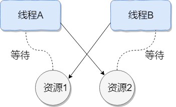

# 并发

## 线程
### 进程
进程是程序的一次执行过程，是系统运行程序的基本单位，因此进程是动态的。  
系统运行一个程序即是一个进程从创建，运行到消亡的过程。
### 线程
线程与进程相似，但线程是一个比进程更小的执行单位。  
一个进程在其执行的过程中可以产生多个线程。  
与进程不同的是同类的多个线程共享进程的`堆`和`方法区`资源，但每个线程有自己的`程序计数器`、`虚拟机栈`和`本地方法栈`，所以系统在产生一个线程，或是在各个线程之间做切换工作时，负担要比进程小得多，也正因为如此，线程也被称为轻量级进程。

## 多线程
### 什么是单线程？——顺序执行任务

### 什么是多线程？——多个并行执行的线程来完成各自的任务

### 线程生命周期和状态

- **NEW**：初始状态，线程被创建出来但没有被调用 start() 。
- **RUNNABLE**：运行状态，线程被调用了 start()等待运行的状态。
- **BLOCKED**：阻塞状态，需要等待锁释放。
- **WAITING**：等待状态，表示该线程需要等待其他线程做出一些特定动作(通知或中断)。
- **TIME_WAITING**：超时等待状态，可以在指定的时间后自行返回而不是像 WAITING 那样一直等待。
- **TERMINATED**：终止状态，表示该线程已经运行完毕。
#### ❓对于单核的CPU来说，真的可以做到真正的多线程并发吗？
对于**多核**的CPU电脑来说，真正的多线程并发是没问题的。4核CPU表示同一个时间点上，可以真正的有4个进程并发执行。  
**单核**的CPU表示只有一个大脑，不能够做到真正的多线程并发，但是可以做到给人一种“多线程并发”的感觉。  
由于CPU的处理速度极快，多个线程之间**反复横跳**，给别人的感觉是：多个事情同时在做。  

##### 线程调度方式
- **抢占式调度(Preemptive Scheduling)**：操作系统决定何时暂停当前正在运行的线程，并切换到另一个线程执行。这种切换通常是由系统时钟中断(时间片轮转)或其他高优先级事件(如 I/O 操作完成)触发的。这种方式存在上下文切换开销，但公平性和 CPU 资源利用率较好，不易阻塞。
- **协同式调度(Cooperative Scheduling)**：线程执行完毕后，主动通知系统切换到另一个线程。这种方式可以减少上下文切换带来的性能开销，但公平性较差，容易阻塞。
### 并发与并行的区别
- **并发**：两个及两个以上的作业在同一时间段内执行。
- **并行**：两个及两个以上的作业在同一时刻执行。
### 同步和异步的区别
- **同步**：发出一个调用之后，在没有得到结果之前，该调用就不可以返回，一直等待。
- **异步**：调用在发出之后，不用等待返回结果，该调用直接返回。
### 使用多线程的原因
- **计算机底层**：线程可以比作是轻量级的进程，是程序执行的最小单位,线程间的切换和调度的成本远远小于进程。另外，多核CPU时代意味着多个线程可以同时运行，这减少了线程上下文切换的开销。
  - **单核时代**：在单核时代多线程主要是为了提高单进程利用CPU和IO系统的效率。假设只运行了一个Java进程的情况，当我们请求IO的时候，如果Java进程中只有一个线程，此线程被IO阻塞则整个进程被阻塞。CPU和IO设备只有一个在运行，那么可以简单地说系统整体效率只有50%。当使用多线程的时候，一个线程被IO阻塞，其他线程还可以继续使用CPU。从而提高了Java进程利用系统资源的整体效率。
  - **多核时代**：多核时代多线程主要是为了提高进程利用多核CPU的能力。举个例子：假如我们要计算一个复杂的任务，我们只用一个线程的话，不论系统有几个CPU核心，都只会有一个CPU核心被利用到。而创建多个线程，这些线程可以被映射到底层多个CPU上执行，在任务中的多个线程没有资源竞争的情况下，任务执行的效率会有显著性的提高，约等于(单核时执行时间/CPU核心数)。
- **当代互联网发展趋势**：现在的系统动不动就要求百万级甚至千万级的并发量，而多线程并发编程正是开发高并发系统的基础，利用好多线程机制可以大大提高系统整体的并发能力以及性能。
### 使用多线程引发的问题
并发编程的目的就是为了能提高程序的执行效率进而提高程序的运行速度，但是并发编程并不总是能提高程序运行速度的，而且并发编程可能会遇到很多问题，比如：`内存泄漏`、`死锁`、`线程不安全`等等。
#### 线程安全和不安全
- **线程安全**：在多线程环境下，对于同一份数据，不管有多少个线程同时访问，都能保证这份数据的正确性和一致性。
- **线程不安全**：在多线程环境下，对于同一份数据，多个线程同时访问时可能会导致数据混乱、错误或者丢失。
#### 单核CPU上运行多个线程效率一定会高吗？对于单核CPU来说，如果任务是CPU密集型的，那么开很多线程会影响效率；如果任务是IO密集型的，那么开很多线程会提高效率。
#### 死锁和超卖
❓如果线程都在抢一个资源会发生什么？  

##### 死锁
多个线程都在抢夺一个`不可剥夺资源`
  - **不可剥夺资源**：当系统把这类资源分配给某进程后，再不能强行收回，只能在进程用完后自行释放。  
    
  线程A持有资源2，线程B持有资源1，它们同时都想申请对方的资源，所以这两个线程就会互相等待而进入死锁状态。
##### ❓多个线程都在抢夺一个`可剥夺资源`呢？
超卖
- **可剥夺资源**：是指某进程在获得这类资源后，该资源可以再被其他进程或系统剥夺，CPU和主存均属于可剥夺性资源。
##### 死锁的检测
使用jmap、jstack等命令查看JVM线程栈和堆内存的情况。如果有死锁，jstack的输出中通常会有FoundoneJava-leveldeadlock:的字样，后面会跟着死锁相关的线程信息。另外，实际项目中还可以搭配使用top、df、free等命令查看操作系统的基本情况，出现死锁可能会导致CPU、内存等资源消耗过高。  
采用VisualVM、JConsole等工具进行排查。
##### 预防和避免死锁
###### 预防死锁
破坏死锁的产生的必要条件即可
  - **破坏请求与保持条件**：一次性申请所有的资源。
  - **破坏不剥夺条件**：占用部分资源的线程进一步申请其他资源时，如果申请不到，可以主动释放它占有的资源。
  - **破坏循环等待条件**：靠按序申请资源来预防。按某一顺序申请资源，释放资源则反序释放。破坏循环等待条件。
###### 避免死锁
避免死锁就是在资源分配时，借助于算法(比如银行家算法)对资源分配进行计算评估，使其进入`安全状态`。
  - **安全状态**：指的是系统能够按照某种线程推进顺序(P1、P2、P3……Pn)来为每个线程分配所需资源，直到满足每个线程对资源的最大需求，使每个线程都可顺利完成。称<P1、P2、P3.....Pn>序列为安全序列。
#### ❓如果每个请求到达就创建一个新线程，开销是相当大的，怎么办？
在实际使用中，服务器在创建和销毁线程上花费的时间和消耗的系统资源都相当大，甚至可能要比在处理实际的用户请求的时间和资源要多的多。除了创建和销毁线程的开销之外，活动的线程也需要消耗系统资源。如果在一个jvm里创建太多的线程，可能会使系统由于过度消耗内存或“切换过度”而导致系统资源不足。为了防止资源不足，服务器应用程序需要采取一些办法来限制任何给定时刻处理的请求数目，尽可能减少创建和销毁线程的次数，特别是一些资源耗费比较大的线程的创建和销毁，尽量利用已有对象来进行服务，这就是“`池化资源`”技术产生的原因。  
`线程池`主要用来解决线程生命周期开销问题和资源不足问题。通过对多个任务重复使用线程，线程创建的开销就被分摊到了多个任务上了，而且由于在请求到达时线程已经存在，所以消除了线程创建所带来的延迟。这样，就可以立即为请求服务，使用应用程序响应更快。另外，通过适当的调整线程中的线程数目可以防止出现资源不足的情况。    
`提高响应速度、降低资源消耗、便于线程管理`

## 乐观锁和悲观锁

### 乐观锁
乐观锁（Optimistic Lock）是一种假设冲突不会频繁发生的锁机制。每次数据访问时，不会加锁，而是在更新数据时检查是否有其他线程修改过数据。如果检测到冲突（数据被其他线程修改过），则重试操作或报错。

乐观锁通常实现方式有以下两种：
- **版本号机制**：每次读取数据时，读取一个版本号，更新数据时，检查版本号是否变化，如果没有变化，则更新成功，否则重试。
- **时间戳机制**：类似版本号机制，通过时间戳来检测数据是否被修改。

#### 应用场景
适用于读多写少的场景，例如用户评论系统、社交媒体点赞等，这些场景下并发冲突概率较低。

#### 优缺点
- **优点**：避免了频繁的锁操作，性能较好，适合读多写少的场景。
- **缺点**：在高并发写操作的场景下，重试可能会频繁发生，导致性能下降。

### 悲观锁
悲观锁（Pessimistic Lock）是一种假设冲突会频繁发生的锁机制。每次数据访问时，都会先加锁，直到操作完成后才释放锁，这样可以确保在锁持有期间，其他线程无法访问这段数据，从而避免了并发冲突。

悲观锁的实现通常有以下两种方式：
- **数据库**：在数据库中，悲观锁通常通过SQL语句实现，例如SELECT ... FOR UPDATE。
- **编程语言**：在编程语言中，悲观锁可以使用互斥锁（Mutex）或同步块（Synchronized Block）来实现。

#### 应用场景
适用于对数据并发冲突非常敏感的场景，例如银行转账操作、库存扣减等需要严格数据一致性的操作。

#### 优缺点
- **优点**：可以完全避免并发冲突，保证数据的一致性和完整性。
- **缺点**：由于每次访问数据都需要加锁和解锁，会导致性能开销较大，特别是在并发量高的情况下，容易造成锁竞争和死锁问题。

## [代码示例](multi-thread-demo)
| 类名                    |                              描述                               |
|:----------------------|:-------------------------------------------------------------:|
| Demo0101              |                           Runnable                            |
| Demo0102              |                            Thread                             |
| Demo0103              |                           TimerTask                           |
| Demo0104              |                           Callable                            |
| Demo0105              |                              线程池                              |
| Demo0106              |                              死锁                               |
| Demo0107              |                 jdk1.8 多线程 CompletableFuture                  |
| Demo0201              |                        同步 synchronized                        |
| Demo0202              |                            锁 Lock                             |
| Demo0203              |                        信号量加锁 Semaphore                        |
| Demo0301              |                        异步 Spring Async                        |
| Demo0302              |                  定时任务，动态调度 Spring Scheduled                   |
| Demo0303              |            多线程事务回滚 PlatformTransactionManage事务管理器             |
| Demo0304              |               多线程事务回滚 TransactionTemplate编程式事务                |
| Demo0401              |                            阻塞队列的实现                            |
| Demo0402              |                             实现定时器                             |
| Demo0403              |                             实现线程池                             |
| 分布式锁(redis,zookeeper) | [锁适配器](https://gitee.com/wb04307201/lock-spring-boot-starter) |