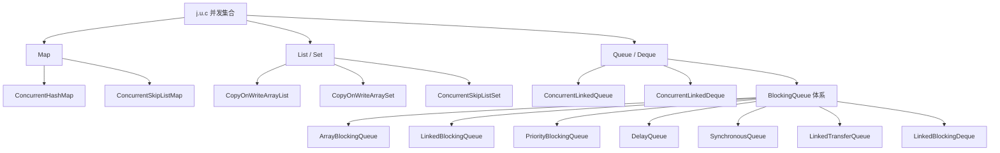

<!--
module:
  parent: java
  slug: java/concurrent-collections
  type: article
  category: 主模块子文章
  summary: 系统梳理 `java.util.concurrent` 包下的所有并发集合，理解各自底层原理、适用场景及选型策略。
-->

# 并发集合

> 目标：系统梳理 `java.util.concurrent` 包下的所有并发集合，理解各自底层原理、适用场景及选型策略。

---
---

## 知识地图



## 导航

| 子目录 | 涵盖内容 | 核心原理 |
|--------|---------|---------|
| [ConcurrentHashMap](../../../README.md) | ConcurrentHashMap | CAS + synchronized 桶级锁 |
| [copy-on-write](copy-on-write/README.md) | CopyOnWriteArrayList, CopyOnWriteArraySet | 写时复制 + volatile 数组引用 |
| [queue](queue/README.md) | ConcurrentLinkedQueue, ConcurrentLinkedDeque, BlockingQueue 体系 | CAS 无锁算法 / ReentrantLock 阻塞 |
| [skip-list](skip-list/README.md) | ConcurrentSkipListMap, ConcurrentSkipListSet | 多层跳表 + CAS 无锁 |

## 学习路径

```
1. ConcurrentHashMap     → 并发集合基础（已有专题）
         ↓
2. 写时复制集合          → 理解读多写少场景的快照语义
         ↓
3. 并发队列              → 无锁队列 vs 阻塞队列，生产者-消费者模式
         ↓
4. 跳表集合              → 有序并发集合，替代红黑树的概率性数据结构
         ↓
5. 选型指南              → 根据场景选择最合适的集合
```

---

## 并发集合选型指南

### 7.1 按数据结构维度选型

```
需要 Map 时：
  ┌─────────────────────────────────────────────────┐
  │ 需要有序？                                       │
  │   ├─ 是 → ConcurrentSkipListMap                 │
  │   └─ 否 → 需要 key 可以为 null？                 │
  │             ├─ 是 → Collections.synchronizedMap  │
  │             └─ 否 → ConcurrentHashMap（首选）    │
  └─────────────────────────────────────────────────┘

需要 List 时：
  ┌─────────────────────────────────────────────────┐
  │ 写操作频繁吗？                                    │
  │   ├─ 是 → 不用并发 List（改用 Queue/Deque）      │
  │   └─ 否 → 读远多于写？                           │
  │             ├─ 是 → CopyOnWriteArrayList         │
  │             └─ 否 → Collections.synchronizedList │
  └─────────────────────────────────────────────────┘

需要 Queue 时：
  ┌─────────────────────────────────────────────────┐
  │ 需要阻塞等待？                                    │
  │   ├─ 是 → 需要容量限制？                          │
  │   │         ├─ 固定容量 → ArrayBlockingQueue      │
  │   │         ├─ 可选容量 → LinkedBlockingQueue     │
  │   │         ├─ 优先级   → PriorityBlockingQueue   │
  │   │         ├─ 延迟执行 → DelayQueue              │
  │   │         ├─ 零容量   → SynchronousQueue        │
  │   │         └─ 直接传递 → LinkedTransferQueue     │
  │   └─ 否 → 需要双端操作？                           │
  │             ├─ 是 → ConcurrentLinkedDeque          │
  │             └─ 否 → ConcurrentLinkedQueue          │
  └─────────────────────────────────────────────────┘

需要 Set 时：
  ┌─────────────────────────────────────────────────┐
  │ 需要有序？                                       │
  │   ├─ 是 → ConcurrentSkipListSet                  │
  │   └─ 否 → ConcurrentHashMap.newKeySet()（首选）  │
  │             读极多写极少 → CopyOnWriteArraySet     │
  └─────────────────────────────────────────────────┘
```

### 7.2 按场景维度选型

| 场景 | 推荐集合 | 原因 |
|------|----------|------|
| 高并发缓存 | ConcurrentHashMap | O(1) 查找，桶级锁 |
| 监听器集合 | CopyOnWriteArrayList | 遍历无锁，修改极少 |
| 生产者-消费者（有界） | ArrayBlockingQueue | 固定容量，防止内存溢出 |
| 生产者-消费者（高吞吐） | LinkedBlockingQueue | 双锁并行，高吞吐 |
| 任务调度（优先级） | PriorityBlockingQueue | 按优先级出队 |
| 订单超时取消 | DelayQueue | 按到期时间出队 |
| CachedThreadPool | SynchronousQueue | 零延迟传递 |
| 有序并发 Map | ConcurrentSkipListMap | O(log n) + 有序 |
| 并发 Set | ConcurrentHashMap.newKeySet() | 底层 CHM，高性能 |
| 无锁高吞吐队列 | ConcurrentLinkedQueue | CAS 无锁，不阻塞 |
| 线程安全计数器 | LongAdder / AtomicLong | 不是集合，但常配合使用 |

### 7.3 性能对比速查

```
  ┌──────────────────────┬──────┬──────┬──────┬────────┬──────────┐
  │ 集合                  │ 查找  │ 插入  │ 删除  │ 遍历    │ 内存开销  │
  ├──────────────────────┼──────┼──────┼──────┼────────┼──────────┤
  │ ConcurrentHashMap    │ O(1) │ O(1) │ O(1) │ 弱一致  │ 中等      │
  │ CopyOnWriteArrayList │ O(n) │ O(n)*│ O(n)*│ 快照    │ 高（复制）│
  │ ConcurrentLinkedQ    │ N/A  │ O(1) │ O(1) │ 弱一致  │ 低        │
  │ ArrayBlockingQueue   │ N/A  │ O(1)†│ O(1)†│ N/A     │ 低        │
  │ LinkedBlockingQueue  │ N/A  │ O(1)†│ O(1)†│ N/A     │ 中        │
  │ PriorityBlockingQ    │ N/A  │ O(logn)│O(logn)│ N/A    │ 低        │
  │ ConcurrentSkipListMap│O(logn)│O(logn)│O(logn)│ 弱一致  │ 较高      │
  └──────────────────────┴──────┴──────┴──────┴────────┴──────────┘

  * = 写时复制，实际开销 = O(N) 复制 + O(1) 追加
  † = 阻塞操作，O(1) 指不考虑等待时间
  N/A = 队列不支持随机查找
```

### 7.4 常见陷阱

```
陷阱 1：用 CopyOnWriteArrayList 存储频繁修改的数据
  → 每次修改都全量复制，大列表会 OOM

陷阱 2：用 ConcurrentLinkedQueue.size() 做业务判断
  → size() 是 O(n) 遍历计数，高并发下结果不准确

陷阱 3：认为 ConcurrentHashMap 的复合操作是原子的
  → if (!map.containsKey(k)) map.put(k, v) 不是原子操作
  → 应该用 putIfAbsent 或 computeIfAbsent

陷阱 4：用 SynchronousQueue 做缓冲
  → 容量为零，生产者和消费者必须同时在场

陷阱 5：忽略 BlockingQueue 的容量限制
  → LinkedBlockingQueue 默认无界（Integer.MAX_VALUE）
  → 生产者快于消费者时会 OOM

陷阱 6：用 Collections.synchronizedList 做遍历时修改
  → 遍历时修改会抛 ConcurrentModificationException
  → 应该用迭代器的 remove 方法或 CopyOnWriteArrayList

陷阱 7：认为 ConcurrentSkipListMap 的 size() 精确
  → 高并发时 size() 返回近似值
  → 需要精确计数时自行维护 AtomicLong
```

### 7.5 最佳实践总结

```
1. 优先选择无锁/细粒度锁的集合（ConcurrentHashMap, ConcurrentLinkedQueue）
2. 写时复制集合只适用于写极少的场景（配置列表、监听器集合）
3. 生产者-消费者场景用 BlockingQueue，不要用手动 wait/notify
4. 需要有序时用 ConcurrentSkipListMap，不要用 ConcurrentHashMap + 外部排序
5. 原子操作优先用集合自带的方法（putIfAbsent, compute, merge）
6. 遍历时不要假设集合状态不变（弱一致性语义）
7. 容量限制很重要：无界队列在背压场景下会导致 OOM
8. 注意 null 处理：大多数并发集合不允许 null 元素
```

---

## 相关章节

- [ConcurrentHashMap 专题](../../../README.md)
- [写时复制集合](copy-on-write/README.md) — CopyOnWriteArrayList / CopyOnWriteArraySet
- [并发队列](queue/README.md) — ConcurrentLinkedQueue / BlockingQueue 体系
- [跳表集合](skip-list/README.md) — ConcurrentSkipListMap / ConcurrentSkipListSet
- [并发编程总目录](../../README.md)
