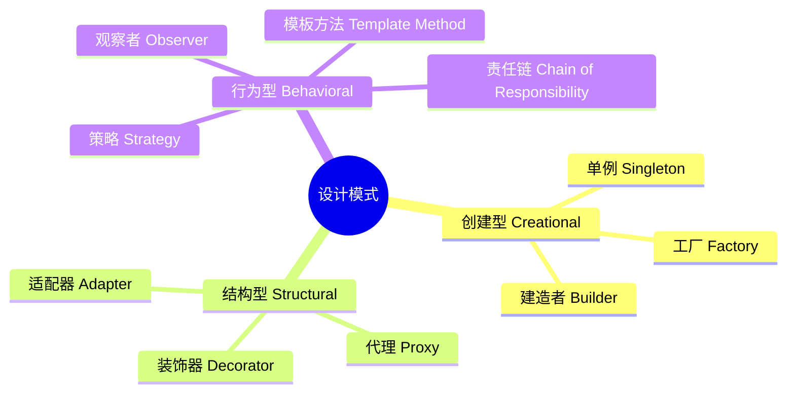

<!--
module:
  parent: java
  slug: java/design-patterns
  type: article
  category: 主模块子文章
  summary: GoF 23 种设计模式的 Java 实现与选型指南 —— 笔记已按 GoF 分类拆分为 3 个子文件。
-->

# 设计模式

> GoF 23 种设计模式的 Java 实现与选型指南 —— 笔记已按 GoF 分类拆分为 3 个子文件。

---
## 引言：架构困境

设计模式 的关键不是'选型'——是**选完之后怎么在 5 个 trade-off 里活下来**。

本篇用'决策困境'切入，比较几种主流路径并讲清取舍。

---

## 知识地图

---

## 导航

| 分类 | 包含模式 | 链接 |
|------|---------|------|
| **创建型** | 单例、工厂、建造者 | [creation/README.md](creation/README.md) |
| **结构型** | 代理、装饰器、适配器 | [structural/README.md](structural/README.md) |
| **行为型** | 观察者、策略、模板方法、责任链 | [behavioral/README.md](behavioral/README.md) |

---

## 学习路径

1. **先学创建型** -- 理解对象如何被创建（单例 -> 工厂 -> 建造者）
2. **再学结构型** -- 理解对象如何组合（代理 -> 装饰器 -> 适配器）
3. **最后学行为型** -- 理解对象如何协作（观察者 -> 策略 -> 模板方法 -> 责任链）
4. **回头看选型指南** -- 根据实际场景匹配模式（见下方）

---

## 十一、模式选型指南

### 11.1 创建型模式选型

| 需求 | 推荐模式 | 理由 |
|------|---------|------|
| 全局唯一实例 | 单例 | 限制实例个数 |
| 创建过程复杂，参数多 | 建造者 | 链式调用，可读性好 |
| 需要统一创建入口 | 简单工厂 | 集中管理 |
| 产品种类会不断扩展 | 工厂方法 | 符合开闭原则 |
| 创建一组相关产品 | 抽象工厂 | 产品族一致性 |
| 对象构造分步骤，不同顺序产生不同结果 | 建造者 | 步骤灵活 |

### 11.2 结构型模式选型

| 需求 | 推荐模式 | 理由 |
|------|---------|------|
| 动态添加职责 | 装饰器 | 灵活组合，替代继承 |
| 控制对象访问 | 代理 | 远程、延迟、安全等场景 |
| 接口不兼容 | 适配器 | 桥接新旧系统 |
| 简化复杂子系统接口 | 外观（Facade） | 对外提供统一入口 |
| 请求需要多个对象依次处理 | 责任链 | 解耦发送者与接收者 |
| 需要将抽象与实现分离 | 桥接 | 多维度独立变化 |

### 11.3 行为型模式选型

| 需求 | 推荐模式 | 理由 |
|------|---------|------|
| 算法需要动态切换 | 策略 | 消除 if-else/switch |
| 流程固定，部分步骤可变 | 模板方法 | 骨架复用 |
| 一对多依赖通知 | 观察者 | 事件驱动 |
| 对象状态改变时行为改变 | 状态 | 消除状态条件分支 |
| 解耦请求发送者与接收者 | 命令 | 支持撤销/重做 |
| 遍历聚合对象而不暴露内部结构 | 迭代器 | 统一遍历方式 |
| 多个对象协作完成请求，但职责不明确 | 中介者 | 集中管理交互逻辑 |

### 11.4 Spring 框架中的设计模式速查

| 模式 | Spring 中的应用 |
|------|----------------|
| 单例 | Bean 默认 scope=singleton |
| 工厂方法 | `BeanFactory`, `FactoryBean` |
| 代理 | AOP（JDK / CGLIB） |
| 观察者 | `ApplicationEvent` / `@EventListener` |
| 策略 | `Resource` 接口、`HandlerMapping` |
| 模板方法 | `JdbcTemplate`, `RestTemplate` |
| 装饰器 | `HttpSession` 包装、`ServletRequest` 包装 |
| 责任链 | `FilterChain`, `HandlerInterceptor` 链 |
| 适配器 | `HandlerAdapter` |
| 建造者 | `UriComponentsBuilder`, `ResponseEntity.BodyBuilder` |
| 代理 | Spring AOP 动态代理 |
| 观察者 | `ApplicationEventPublisher` |
| 策略 | `TaskScheduler` 不同实现 |

### 11.5 设计原则总结

| 原则 | 英文 | 说明 |
|------|------|------|
| 单一职责 | SRP | 一个类只做一件事 |
| 开闭原则 | OCP | 对扩展开放，对修改封闭 |
| 里氏替换 | LSP | 子类可替换父类而不影响程序 |
| 依赖倒置 | DIP | 依赖抽象，不依赖具体 |
| 接口隔离 | ISP | 接口尽量小而专 |
| 迪米特法则 | LoD | 只与直接朋友通信 |
| 组合优于继承 | Favor Composition | 降低耦合，增强灵活 |

> 设计模式是解决特定问题的经验总结，不是银弹。
> 在实际开发中，应先识别问题，再选择模式，而非生搬硬套。

---

## 相关章节

- [Java 笔记主模块](../README.md)
- [创建型模式 -- 单例、工厂、建造者](creation/README.md)
- [结构型模式 -- 代理、装饰器、适配器](structural/README.md)
- [行为型模式 -- 观察者、策略、模板方法、责任链](behavioral/README.md)

---

## 📊 本节统计

| 统计维度 | 数值 | 口径 |
|----------|------|------|
| 分类主题数 | 3 | 创建型 / 结构型 / 行为型（GoF 23 种模式按此 3 大类拆分） |
| 子 README 数 | 3 | creation / structural / behavioral（每个聚合对应 GoF 子集） |
| 含 frontmatter 的 README | 4 / 4 | 100% 覆盖（2026-07-01） |

> **统计时间戳**：2026-07-01

---

← [返回 01.java 主模块](../README.md)
