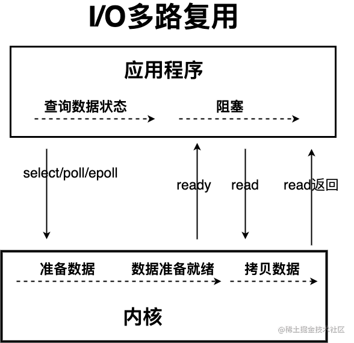

# I/O
`I/O`即`Input/Output`，输入和输出。数据输入到计算机内存的过程即输入，反之输出到外部存储（比如数据库，文件，远程主机）的过程即输出。  
数据传输过程类似于水流，因此称为`I/O`流。`I/O`流在 Java 中分为输入流和输出流，而根据数据的处理方式又分为字节流和字符流。  

Java I/O 流的 40 多个类都是从如下 4 个抽象类基类中派生出来的：
- **InputStream/Reader**：所有的输入流的基类，前者是字节输入流，后者是字符输入流。
- **OutputStream/Writer**：所有输出流的基类，前者是字节输出流，后者是字符输出流。

## 字节流
### `InputStream`（字节输入流）
`InputStream`用于从源头（通常是文件）读取数据（字节信息）到内存中，`java.io.InputStream`抽象类是所有字节输入流的父类。
#### `InputStream`常用方法
- **`read()`**：返回输入流中下一个字节的数据。返回的值介于0到255之间。如果未读取任何字节，则代码返回-1，表示文件结束。
- **`read(byte b[])`**：从输入流中读取一些字节存储到数组b中。如果数组b的长度为零，则不读取。如果没有可用字节读取，返回-1。如果有可用字节读取，则最多读取的字节数最多等于`b.length`，返回读取的字节数。这个方法等价于`read(b,0,b.length)`。
- **`read(byte b[],int off,int len)`**：在`read(byte b[])`方法的基础上增加了`off`参数（偏移量）和`len`参数（要读取的最大字节数）。
- **`skip(long n)`**：忽略输入流中的`n`个字节,返回实际忽略的字节数。
- **`available()`**：返回输入流中可以读取的字节数。
- **`close()`**：关闭输入流释放相关的系统资源。
#### Java 9 `InputStream`新增加方法
- **`readAllBytes()`**： 读取输入流中的所有字节，返回字节数组。
- **`readNBytes(byte[] b,int off,int len)`**：阻塞直到读取len个字节。
- **`transferTo(OutputStream out)`**：将所有字节从一个输入流传递到一个输出流。
#### `FileInputStream`
一个比较常用的字节输入流对象，可直接指定文件路径，可以直接读取单字节数据，也可以读取至字节数组中。
### `OutputStream`（字节输出流）
`OutputStream`用于将数据（字节信息）写入到目的地（通常是文件），`java.io.OutputStream`抽象类是所有字节输出流的父类。
#### `OutputStream`常用方法
- **`write(int b)`**：将特定字节写入输出流。
- **`write(byte b[])`**:将数组b写入到输出流，等价于`write(b,0,b.length)`。
- **`write(byte[] b,int off,int len)`**:在w`rite(byte b[])`方法的基础上增加了`off`参数（偏移量）和`len`参数（要读取的最大字节数）。
- **`flush()`**：刷新此输出流并强制写出所有缓冲的输出字节。
- **`close()`**：关闭输出流释放相关的系统资源。
#### `FileOutputStream`
最常用的字节输出流对象，可直接指定文件路径，可以直接输出单字节数据，也可以输出指定的字节数组。

## 字符流
### `Reader`（字符输入流）
`Reader`用于从源头（通常是文件）读取数据（字符信息）到内存中，`java.io.Reader`抽象类是所有字符输入流的父类。
#### 与`InputStream`的区别
`Reader`用于读取文本，`InputStream`用于读取原始字节。
#### `Reader`常用方法
- **`read()`**:从输入流读取一个字符。
- **`read(char[] cbuf)`**:从输入流中读取一些字符，并将它们存储到字符数组cbuf中，等价于`read(cbuf,0,cbuf.length)`。
- **`read(char[] cbuf,int off,int len)`**：在`read(char[] cbuf)`方法的基础上增加了`off`参数（偏移量）和`len`参数（要读取的最大字符数）。
- **`skip(long n)`**：忽略输入流中的n个字符,返回实际忽略的字符数。
- **`close()`**:关闭输入流并释放相关的系统资源。
#### `InputStreamReader`
字节流转换为字符流的桥梁，其子类`FileReader`是基于该基础上的封装，可以直接操作字符文件。
### `Writer`（字符输出流）
`Writer`用于将数据（字符信息）写入到目的地（通常是文件），`java.io.Writer`抽象类是所有字符输出流的父类。
#### `Writer`常用方法
- **`write(int c)`**:写入单个字符。
- **`write(char[] cbuf)`**：写入字符数组cbuf，等价于`write(cbuf,0,cbuf.length)`。
- **`write(char[] cbuf,int off,int len)`**：在`write(char[] cbuf)`方法的基础上增加了`off`参数（偏移量）和`len`参数（要读取的最大字符数）。
- **`write(String str)`**：写入字符串，等价于`write(str,0,str.length())`。
- **`write(String str,int off,int len)`**：在`write(String str)`方法的基础上增加了`off`参数（偏移量）和`len`参数（要读取的最大字符数）。
- **`append(CharSequencec sq)`**：将指定的字符序列附加到指定的`Writer`对象并返回该`Writer`对象。
- **`append(char c)`**：将指定的字符附加到指定的`Writer`对象并返回该`Writer`对象。
- **`flush()`**：刷新此输出流并强制写出所有缓冲的输出字符。
- **`close()`**:关闭输出流释放相关的系统资源。
#### OutputStreamWriter
字符流转换为字节流的桥梁，其子类`FileWriter`是基于该基础上的封装，可以直接将字符写入到文件。

## 字节缓冲流
### `BufferedInputStream`（字节缓冲输入流）
`BufferedInputStream`从源头（通常是文件）读取数据（字节信息）到内存的过程中不会一个字节一个字节的读取，而是会先将读取到的字节存放在缓存区，并从内部缓冲区中单独读取字节。这样大幅减少了IO次数，提高了读取效率。
### `BufferedOutputStream`（字节缓冲输出流）
`BufferedOutputStream`将数据（字节信息）写入到目的地（通常是文件）的过程中不会一个字节一个字节的写入，而是会先将要写入的字节存放在缓存区，并从内部缓冲区中单独写入字节。这样大幅减少了IO次数，提高了读取效率

## 字符缓冲流
`BufferedReader`（字符缓冲输入流）和`BufferedWriter`（字符缓冲输出流）类似于`BufferedInputStream`（字节缓冲输入流）和`BufferedOutputStream`（字节缓冲输入流），内部都维护了一个字节数组作为缓冲区。不过，前者主要是用来操作字符信息。

## 打印流
`System.out`实际是用于获取一个`PrintStream`对象，`print`方法实际调用的是`PrintStream`对象的`write`方法。

## 随机访问流
随机访问流指的是支持随意跳转到文件的任意位置进行读写的`RandomAccessFile`。
### 读写模式主要有下面四种
- **`r`**:只读模式。
- **`rw`**:读写模式。
- **`rws`**:相对于`rw`，`rws`同步更新对“文件的内容”或“元数据”的修改到外部存储设备。
- **`rwd`**:相对于`rw`，`rwd`同步更新对“文件的内容”的修改到外部存储设备。

## Java中3种常见IO模型
### BIO(BlockingI/O)
BIO属于同步阻塞IO模型  

### NIO(Non-blocking/NewI/O)
#### 同步非阻塞IO模型
  
- **存在问题**：应用程序不断进行I/O系统调用轮询数据是否已经准备好的过程是十分消耗CPU资源的。
#### IO多路复用模型
  
- 通过减少无效的系统调用，减少了对CPU资源的消耗。
- **select调用**：内核提供的系统调用，它支持一次查询多个系统调用的可用状态。几乎所有的操作系统都支持。
- **epoll调用**：linux2.6内核，属于select调用的增强版本，优化了IO的执行效率。
- Java中的NIO，有一个非常重要的选择器(Selector)的概念，也可以被称为多路复用器。通过它，只需要一个线程便可以管理多个客户端连接。当客户端数据到了之后，才会为其服务。  

### AIO(AsynchronousI/O)
AIO也就是NIO2。Java7中引入了NIO的改进版NIO2,它是异步IO模型。  

Netty使用了AIO之后，在Linux系统上的性能并没有多少提升。
### 总结

