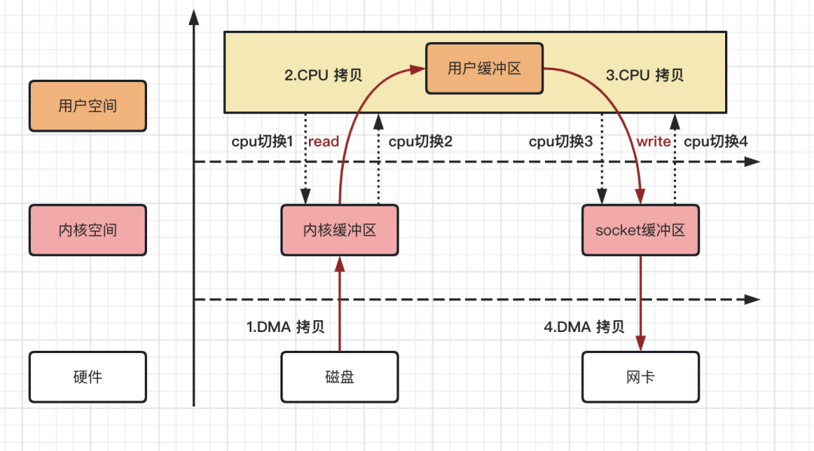
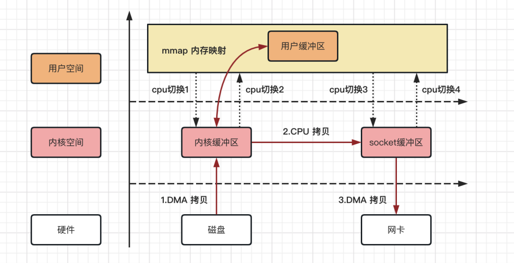
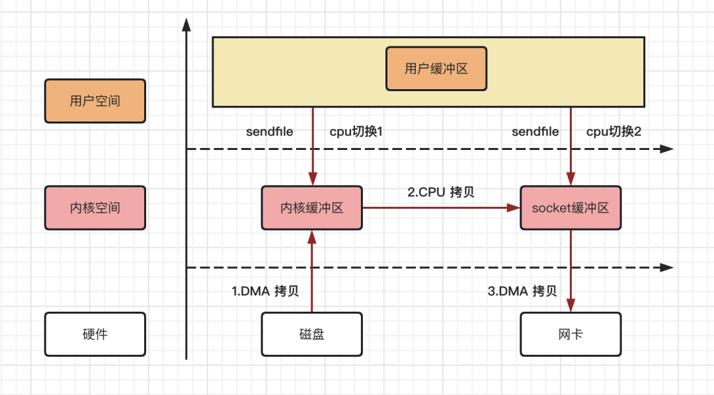
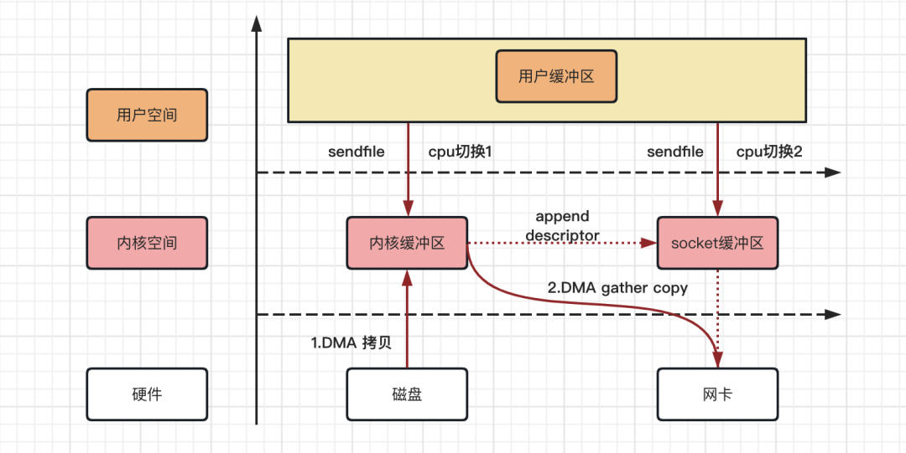
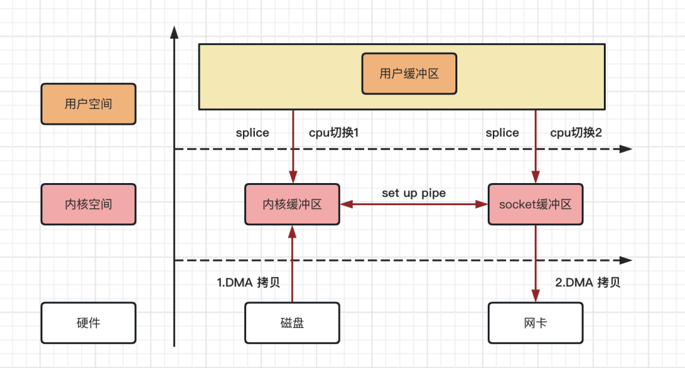

# 零拷贝

零拷贝就是不需要将数据从一个存储区域复制到另一个存储区域。

## IO 拷贝机制介绍

### 传统数据拷贝流程
以客户端从服务器下载文件为例，熟悉服务端开发的同学可能知道，服务端需要做两件事：
- 第一步：从磁盘中读取文件内容
- 第二步：将文件内容通过网络传输给客户端

事实上看似简单的操作，里面的流程却没那么简单，例如应用程序从磁盘中读取文件内容的操作，大体会经过以下几个流程：
- 第一步：用户应用程序调用 read 方法，向操作系统发起 IO 请求，CPU 上下文从用户态转为内核态，完成第一次 CPU 切换
- 第二步：操作系统通过 DMA 控制器从磁盘中读数据，并把数据存储到内核缓冲区
- 第三步：CPU 把内核缓冲区的数据，拷贝到用户缓冲区，同时上下文从内核态转为用户态，完成第二次 CPU 切换

整个读取数据的过程，完成了 1 次 DMA 拷贝，1 次 CPU 拷贝，2 次 CPU 切换；反之写入数据的过程，也是一样的。



从上图，我们可以得出如下结论，4 次拷贝次数、4 次上下文切换次数。
- 数据拷贝次数：2 次 DMA 拷贝，2 次 CPU 拷贝
- CPU 切换次数：4 次用户态和内核态的切换

而实际 IO 读写，有时候需要进行 IO 中断，同时也需要 CPU 响应中断，拷贝次数和切换次数比预期的还要多，以至于当客户端进行资源文件下载的时候，传输速度总是不尽人意。

### mmap 内存映射拷贝流程

mmap 内存映射的拷贝，指的是将用户应用程序的缓冲区和操作系统的内核缓冲区进行映射处理，数据在内核缓冲区和用户缓冲区之间的 CPU 拷贝将其省略，进而加快资源拷贝效率。



mmap 内存映射拷贝流程，从上图可以得出如下结论：
- 数据拷贝次数：2 次 DMA 拷贝，1 次 CPU 拷贝
- CPU 切换次数：4 次用户态和内核态的切换

整个过程省掉了数据在内核缓冲区和用户缓冲区之间的 CPU 拷贝环节，在实际的应用中，对资源的拷贝能提升不少。

### Linux 系统 sendfile 拷贝流程

在 Linux 2.1 内核版本中，引入了一个系统调用方法：`sendfile`。

当调用 sendfile() 时，DMA 将磁盘数据复制到内核缓冲区 kernel buffer；然后将内核中的 kernel buffer 直接拷贝到 socket buffer；最后利用 DMA 将 socket buffer 通过网卡传输给客户端。



Linux 系统 sendfile 拷贝流程，从上图可以得出如下结论：
- 数据拷贝次数：2 次 DMA 拷贝，1 次 CPU 拷贝
- CPU 切换次数：2 次用户态和内核态的切换

相比 mmap 内存映射方式，Linux 2.1 内核版本中 sendfile 拷贝流程省掉了 2 次用户态和内核态的切换，同时内核缓冲区和用户缓冲区也无需建立内存映射，对资源的拷贝能提升不少。

#### DMA
DMA，英文全称是 Direct Memory Access，即直接内存访问。DMA 本质上是一块主板上独立的芯片，允许外设设备和内存存储器之间直接进行 IO 数据传输，其过程不需要 CPU 的参与。

### sendfile With DMA scatter/gather 拷贝流程

在 Linux 2.4 内核版本中，对 sendfile 系统方法做了优化升级，引入 SG-DMA 技术，需要 DMA 控制器支持。

其实就是对 DMA 拷贝加入了 scatter/gather 操作，它可以直接从内核空间缓冲区中将数据读取到网卡。使用这个特点来实现数据拷贝，可以多省去一次 CPU 拷贝。



Linux 系统 sendfile With DMA scatter/gather 拷贝流程，从上图可以得出如下结论：
- 数据拷贝次数：2 次 DMA 拷贝，0 次 CPU 拷贝CPU 
- 切换次数：2 次用户态和内核态的切换

可以发现，sendfile With DMA scatter/gather 实现的拷贝，其中 2 次数据拷贝都是 DMA 拷贝，全程都没有通过 CPU 来拷贝数据，所有的数据都是通过 DMA 来进行传输的，这就是操作系统真正意义上的零拷贝（Zero-copy) 技术，相比其他拷贝方式，传输效率最佳。

#### 内核空间和用户空间

操作系统的核心是内核，与普通的应用程序不同，它可以访问受保护的内存空间，也有访问底层硬件设备的权限。

为了避免用户进程直接操作内核，保证内核安全，操作系统将虚拟内存划分为两部分，一部分是内核空间（Kernel-space），一部分是用户空间（User-space）。在 Linux 系统中，内核模块运行在内核空间，对应的进程处于内核态；而用户程序运行在用户空间，对应的进程处于用户态。

内核空间总是驻留在内存中，它是为操作系统的内核保留的。应用程序是不允许直接在该区域进行读写或直接调用内核代码定义的函数。

当启动某个应用程序时，操作系统会给应用程序分配一个单独的用户空间，其实就是一个用户独享的虚拟内存，每个普通的用户进程之间的用户空间是完全隔离的、不共享的，当用户进程结束的时候，用户空间的虚拟内存也会随之释放。

同时处于用户态的进程不能访问内核空间中的数据，也不能直接调用内核函数的，如果要调用系统资源，就要将进程切换到内核态，由内核程序来进行操作。

### Linux 系统 splice 零拷贝流程

在 Linux 2.6.17 内核版本中，引入了 splice 系统调用方法，和 sendfile 方法不同的是，splice 不需要硬件支持。

它将数据从磁盘读取到 OS 内核缓冲区后，内核缓冲区和 socket 缓冲区之间建立管道来传输数据，避免了两者之间的 CPU 拷贝操作。



Linux 系统 splice 拷贝流程，从上图可以得出如下结论：
- 数据拷贝次数：2 次 DMA 拷贝，0 次 CPU 拷贝CPU 
- 切换次数：2 次用户态和内核态的切换

Linux 系统 splice 方法逻辑拷贝，也是操作系统真正意义上的零拷贝。

## IO 拷贝机制对比

| 拷贝机制                              | 系统说明       | CPU拷贝次数 | DMA拷贝次数 | 上下文切换次数 | 特点                                |
|-----------------------------------|------------|---------|---------|---------|-----------------------------------|
| 传统拷贝方式                            | read/write | 2       | 2       | 4       | 消耗系统资源比较多，拷贝数据效率慢                 |
| mmap                              | mmap/write | 1       | 2       | 4       | 相比传统方法，少了用户缓冲区与内核缓冲区的数据拷贝，效率更高    |
| sendfile                          | sendfile   | 1       | 2       | 2       | 相比 mmap 方式，少了内存文件映射步骤，效率更高        |
| sendfile Width DMA scatter/gather | sendfile   | 0       | 2       | 2       | 需要 DMA 控制器支持，没有 cpu 拷贝数据环节，真正的零拷贝 |
| splice                            | splice     | 0       | 2       | 2       | 没有 cpu 拷贝数据环节，真正的零拷贝，编程逻辑复杂       |

## Java 零拷贝实现介绍

Linux 提供的零拷贝技术，Java 并不是全部支持，目前只支持以下 2 种。
- mmap（内存映射）
- sendfile

### Java NIO 对 mmap 的支持

Java NIO 有一个`MappedByteBuffer`的类，可以用来实现内存映射。它的底层是调用了 Linux 内核的`mmap`的 API。实例代码如下：

实例代码如下：
```java
public static void main(String[] args) {
    try {
        FileChannel readChannel = FileChannel.open(Paths.get("a.txt"), StandardOpenOption.READ);
        // 建立内存文件映射
        MappedByteBuffer data = readChannel.map(FileChannel.MapMode.READ_ONLY, 0, 1024 * 1024 * 40);
        FileChannel writeChannel = FileChannel.open(Paths.get("b.txt"), StandardOpenOption.WRITE, StandardOpenOption.CREATE);
        // 拷贝数据
        writeChannel.write(data);

        // 关闭通道
        readChannel.close();
        writeChannel.close();
    }catch (Exception e){
        System.out.println(e.getMessage());
    }
}
```
其中`MappedByteBuffer`的作用，就是将内核缓冲区的内存和用户缓冲区的内存做了一个地址映射，读取小文件，效率并不高；但是读取大文件，效率很高。

### Java NIO 对 sendfile 的支持

Java NIO 中的`FileChannel.transferTo`方法，底层调用的就是 Linux 内核的`sendfile`系统调用方法。Kafka 这个开源项目就用到它，平时面试的时候，如果面试官问起你为什么这么快，就可以提到`sendfile`零拷贝系统调用方法来回答。

实例代码如下：
```java
public static void main(String[] args) {
    try {
        // 原始文件
        FileChannel srcChannel = FileChannel.open(Paths.get("a.txt"), StandardOpenOption.READ);
        // 目标文件
        FileChannel destChannel = FileChannel.open(Paths.get("b.txt"), StandardOpenOption.WRITE, StandardOpenOption.CREATE);
        // 拷贝数据
        srcChannel.transferTo(0, srcChannel.size(), destChannel);

        // 关闭通道
        srcChannel.close();
        destChannel.close();
    } catch (Exception e) {
        System.out.println(e.getMessage());
    }
}
```

Java NIO 提供的`FileChannel.transferTo`并不保证一定能使用零拷贝。实际上是否能使用零拷贝与操作系统相关，如果操作系统提供`sendfile`这样的零拷贝系统调用方法，那么会充分利用`sendfile`零拷贝的优势，否则并不能实现零拷贝。