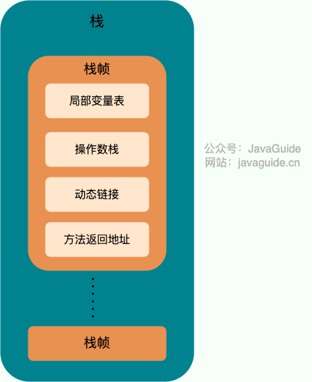
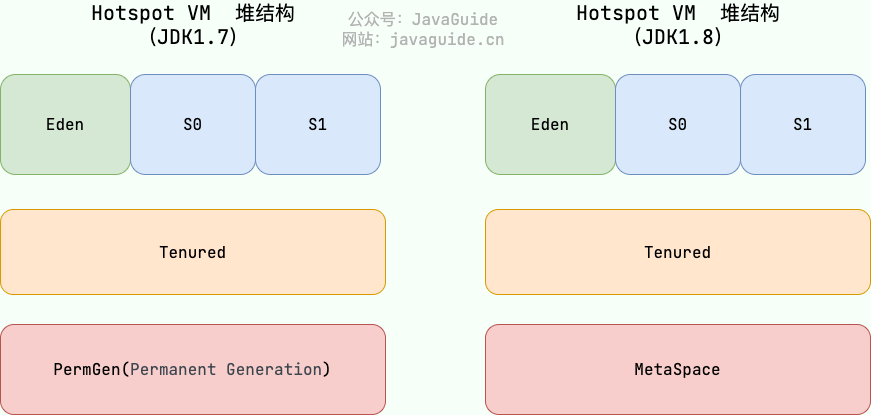
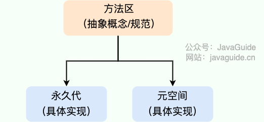
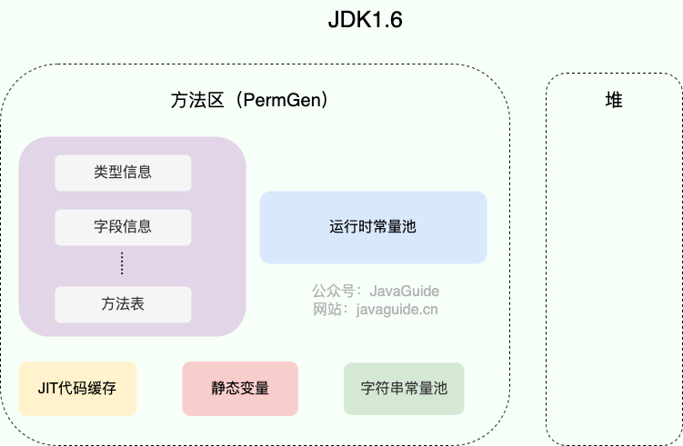

# 内存区域

## 运行时数据区域
### JDK 1.8 和之前的版本略有不同

| JDK 1.7             | JDK 1.8                 |
|---------------------|-------------------------|
|  |  |

#### 程序计数器
##### 功能
> - 字节码解释器通过改变程序计数器来依次读取指令，从而实现代码的流程控制，如：顺序执行、选择、循环、异常处理。
> - 在多线程的情况下，程序计数器用于记录当前线程执行的位置，从而当线程被切换回来的时候能够知道该线程上次运行到哪儿了。
##### 注意
> 程序计数器是唯一一个不会出现`OutOfMemoryError`的内存区域，它的生命周期随着线程的创建而创建，随着线程的结束而死亡。

#### Java 虚拟机栈
> 栈帧随着方法调用而创建，随着方法结束而销毁。无论方法正常完成还是异常完成都算作方法结束。  
> 
##### 局部变量表
> 主要存放了编译期可知的各种数据类型（`boolean`、`byte`、`char`、`short`、`int`、`float`、`long`、`doubl`e）、对象引用（`reference`类型，它不同于对象本身，可能是一个指向对象起始地址的引用指针，也可能是指向一个代表对象的句柄或其他与此对象相关的位置）。
##### 操作数栈
> 主要作为方法调用的中转站使用，用于存放方法执行过程中产生的中间计算结果。另外，计算过程中产生的临时变量也会放在操作数栈中。
##### 动态链接
> 主要服务一个方法需要调用其他方法的场景。`Class`文件的常量池里保存有大量的符号引用比如方法引用的符号引用。当一个方法要调用其他方法，需要将常量池中指向方法的符号引用转化为其在内存地址中的直接引用。动态链接的作用就是为了将符号引用转换为调用方法的直接引用，这个过程也被称为 动态连接 。  
> 

#### 本地方法栈
> 与虚拟机栈所发挥的作用相似，在 HotSpot 虚拟机中和 Java 虚拟机栈合二为一。
> - **区别**：虚拟机栈为虚拟机执行 Java 方法 （也就是字节码）服务，而本地方法栈则为虚拟机使用到的 Native 方法服务。
> - **用途**：本地方法被执行的时候，在本地方法栈也会创建一个栈帧，用于存放该本地方法的局部变量表、操作数栈、动态链接、出口信息。  

#### Java 虚拟机栈和本地方法栈的常见异常
> - **`StackOverFlowError`**：若栈的内存大小不允许动态扩展，那么当线程请求栈的深度超过当前 Java 虚拟机栈/本地方法栈的最大深度的时候，就抛出`StackOverFlowError`错误。
> - **`OutOfMemoryError`**：如果栈的内存大小可以动态扩展， 如果 Java 虚拟机栈/本地方法栈在动态扩展栈时无法申请到足够的内存空间，则抛出`OutOfMemoryErro`r异常。

#### 堆
> 堆目的是存放对象实例，几乎所有的对象实例以及数组都在这里分配内存。  
> Java 堆是垃圾收集器管理的主要区域，因此也被称作`GC`堆（Garbage Collected Heap）。
##### 堆结构
> 从垃圾回收的角度，由于现在收集器基本都采用分代垃圾收集算法，所以 Java 堆还可以细分为：新生代和老年代；再细致一点有：Eden、Survivor、Old 等空间。进一步划分的目的是更好地回收内存，或者更快地分配内存。  
>   
> Eden 区、两个 Survivor 区 S0 和 S1 都属于新生代，中间一层属于老年代，最下面一层属于永久代。  
> 
> JDK 1.7 与之前堆内存被通常分为三部分  
> - 新生代内存(Young Generation)
> - 老生代(Old Generation)
> - 永久代(Permanent Generation)
> JDK 1.8 之后 PermGen(永久代) 已被 Metaspace(元空间) 取代，元空间使用的是本地内存  
> - 为什么?
>   - 整个永久代有一个 JVM 本身设置的固定大小上限，无法进行调整（也就是受到 JVM 内存的限制），而元空间使用的是本地内存，受本机可用内存的限制，虽然元空间仍旧可能溢出，但是比原来出现的几率会更小。
>   - 元空间里面存放的是类的元数据，这样加载多少类的元数据就不由 MaxPermSize 控制了, 而由系统的实际可用空间来控制，这样能加载的类就更多了。
>   - 在 JDK 1.8，合并 HotSpot 和 JRockit 的代码时, JRockit 没有永久代合并之后就没有必要额外的设置一个永久代。
>   - 永久代会为 GC 带来不必要的复杂度，并且回收效率偏低。
> 一般内存分配比例eden:s1:s0=8:1:1
##### 堆常见异常
> 堆常见异常是`OutOfMemoryError`错误
> - **`java.lang.OutOfMemoryError: GC Overhead Limit Exceeded`**：当 JVM 花太多时间执行垃圾回收并且只能回收很少的堆空间时，就会发生此错误。
> - **`java.lang.OutOfMemoryError: Java heap space`**：假如在创建新的对象时, 堆内存中的空间不足以存放新创建的对象, 就会引发此错误。

#### 方法区
> 是 JVM 运行时数据区域的一块逻辑区域，是各个线程共享的内存区域。  
> - **用途**：当虚拟机要使用一个类时，它需要读取并解析 Class 文件获取相关信息，再将信息存入到方法区。方法区会存储已被虚拟机加载的 类信息、字段信息、方法信息、常量、静态变量、即时编译器编译后的代码缓存等数据。
##### 方法区和永久代以及元空间的关系
> 方法区和永久代以及元空间的关系很像 Java 中接口和类的关系，类实现了接口，这里的类就可以看作是永久代和元空间，接口可以看作是方法区，也就是说永久代以及元空间是 HotSpot 虚拟机对虚拟机规范中方法区的两种实现方式。并且，永久代是 JDK 1.8 之前的方法区实现，JDK 1.8 及以后方法区的实现变成了元空间。  
> 
##### 方法区常用参数
> - JDK 1.7 与之前 永久代存在时：
>   - **`-XX:PermSize=N`**：方法区(永久代)初始大小
>   - **`-XX:MaxPermSize=N`**：方法区(永久代)最大大小，超过这个值将会抛出`OutOfMemoryError`,异常:`java.lang.OutOfMemoryError: PermGen`
>   相对而言，垃圾收集行为在这个区域是比较少出现的，但并非数据进入方法区后就“永久存在”了。  
> - JDK 1.8 的时候，永久代底移除换成元空间后：
>   - **`-XX:MetaspaceSize=N`**：设置 Metaspace 的初始（和最小大小）
>   - **`XX:MaxMetaspaceSize=N`**：设置 Metaspace 的最大大小
>   与永久代很大的不同就是，如果不指定大小的话，随着更多类的创建，虚拟机会耗尽所有可用的系统内存。  

#### 运行时常量池
> Class 文件中除了有类的版本、字段、方法、接口等描述信息外，还有用于存放编译期生成的各种字面量（Literal）和符号引用（Symbolic Reference）的 常量池表(Constant Pool Table)

#### 字符串常量池
> 是 JVM 为了提升性能和减少内存消耗针对字符串（String 类）专门开辟的一块区域，主要目的是为了避免字符串的重复创建。  
>   
> JDK1.7 之前，字符串常量池存放在永久代。JDK1.7 字符串常量池和静态变量从永久代移动了 Java 堆中
> - 为什么?
>   - 因为永久代（方法区实现）的 GC 回收效率太低，只有在整堆收集 (Full GC)的时候才会被执行 GC。Java 程序中通常会有大量的被创建的字符串等待回收，将字符串常量池放到堆中，能够更高效及时地回收字符串内存。

#### 直接内存
> 直接内存是一种特殊的内存缓冲区，并不是虚拟机运行时数据区的一部分，也不是虚拟机规范中定义的内存区域，并不在 Java 堆或方法区中分配的，而是通过 JNI 的方式在本地内存上分配的。  
> 但是这部分内存也被频繁地使用，而且也可能导致`OutOfMemoryError`错误出现。 
> 
> - JDK1.4 中新加入的 NIO（Non-Blocking I/O，也被称为 New I/O），引入了一种基于通道（Channel）与缓存区（Buffer）的 I/O 方式，它可以直接使用 Native 函数库直接分配堆外内存，然后通过一个存储在 Java 堆中的 DirectByteBuffer 对象作为这块内存的引用进行操作。这样就能在一些场景中显著提高性能，因为避免了在 Java 堆和 Native 堆之间来回复制数据。
> - 直接内存的分配不会受到 Java 堆的限制，但是会受到本机总内存大小以及处理器寻址空间的限制。