# JVM运行时数据区域

JVM（Java虚拟机）在运行时将内存划分为多个不同的数据区域，这些区域各自承担特定的职责，共同支撑程序的运行。

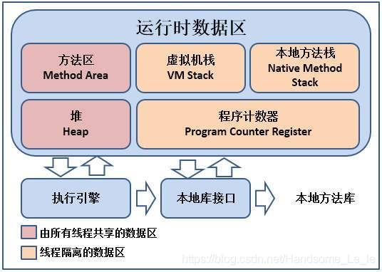
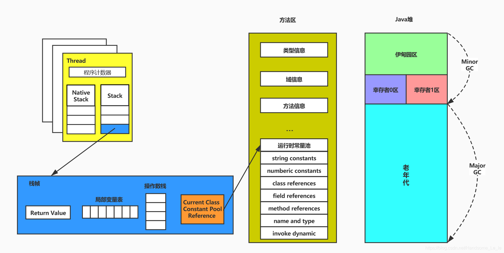

## 1. 程序计数器（Program Counter Register）
- **作用**：记录当前线程正在执行的字节码指令地址（行号），用于线程切换后恢复执行位置。
- **特点**：
    - 线程私有，每个线程独立拥有一份。
    - 唯一不会发生`OutOfMemoryError`的区域。
    - 若执行Native方法，则值为空（Undefined）。
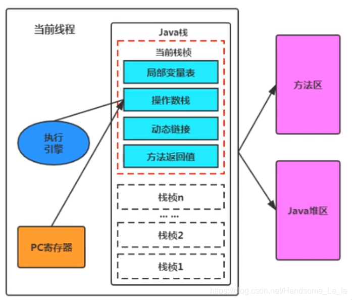

## 2. Java虚拟机栈（JVM Stack）
- **作用**：存储方法调用时的局部变量表、操作数栈、动态链接、方法出口等信息，即方法的执行过程。
- **结构**：
    - 每个方法调用对应一个**栈帧（Stack Frame）**。
    - 栈帧包含：
        - **局部变量表**：存储方法参数和局部变量（基本类型（`boolean`、`byte`、`char`、`short`、`int`、`float`、`long`、`doubl`e）、对象引用（`reference`类型，它不同于对象本身，可能是一个指向对象起始地址的引用指针，也可能是指向一个代表对象的句柄或其他与此对象相关的位置））。
          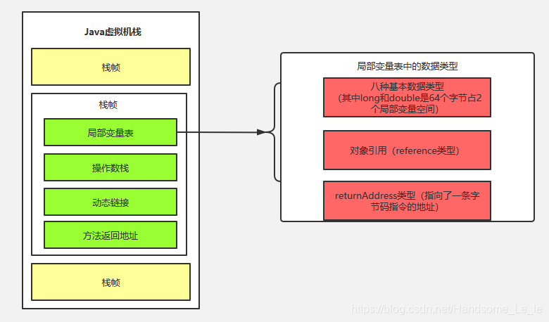
        - **操作数栈**：用于算术运算、参数传递等临时数据操作。
          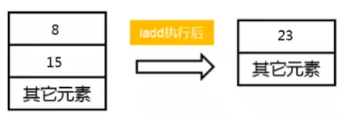
        - **动态链接**：指向运行时常量池中方法的引用。
          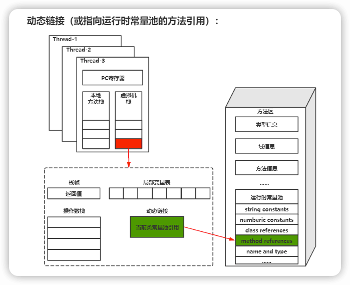
        - **方法返回地址**：方法正常或异常退出的地址。
      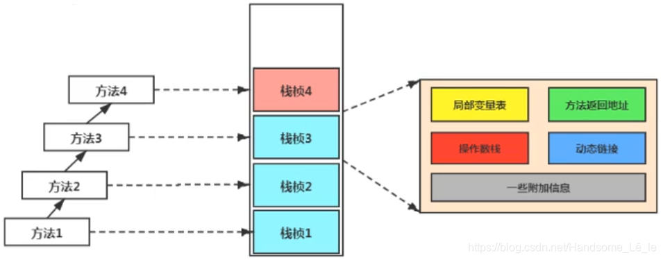
- **特点**：
    - 线程私有，生命周期与线程相同。
    - 可能抛出`StackOverflowError`（栈深度过大）或`OutOfMemoryError`（栈扩展失败）。

## 3. 本地方法栈（Native Method Stack）
- **作用**：支持Native方法（非Java代码，如C/C++）的执行，存储本地方法的栈帧。
- **特点**：
    - 线程私有。
    - 可能抛出`StackOverflowError`或`OutOfMemoryError`。
    - 部分JVM（如HotSpot）将本地方法栈与JVM栈合并。
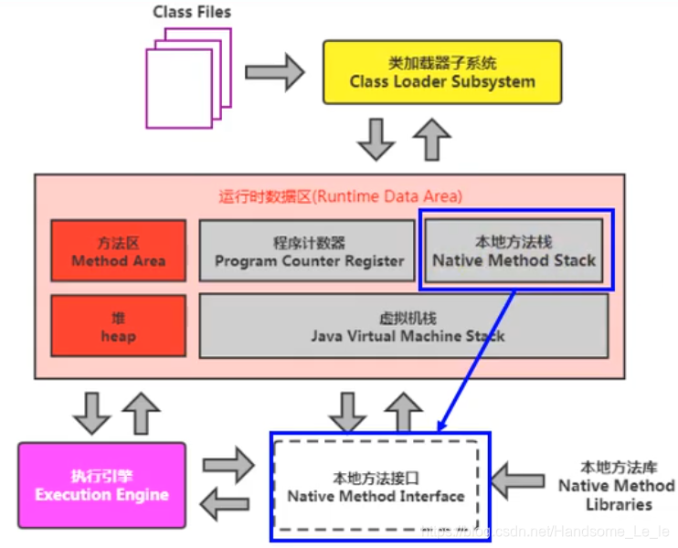

## 4. 堆（Heap）
- **作用**：存储所有**对象实例**和**数组**，是垃圾回收（GC）的主要区域。
- **特点**：
    - 线程共享，所有线程均可访问。
    - 逻辑上连续，物理上可不连续（通过分代收集优化）。
    - 可能抛出`OutOfMemoryError`（堆内存不足）。
- **分代结构**：
    - **新生代（Young Generation）**：
        - **Eden区**：新对象分配区域。
        - **Survivor区**：分为S0（From）和S1（To），用于对象晋升前的复制。
        - eden:s1:s0 = 8:1:1 是JVM新生代内存的常见划分方式，平衡了分配效率和GC开销。
        - 如果应用频繁创建大量短生命周期对象，可增大Eden区（如 -XX:SurvivorRatio=6）。 
        - 如果存活对象较多，需调整 MaxTenuringThreshold 或扩大Survivor区。
    - **老年代（Old Generation）**：存放长期存活的对象。
    - **永久代/元空间（PermGen/Metaspace）**：
        - **Java 8之前**：永久代存储类元数据、常量池等，属于堆的一部分。
          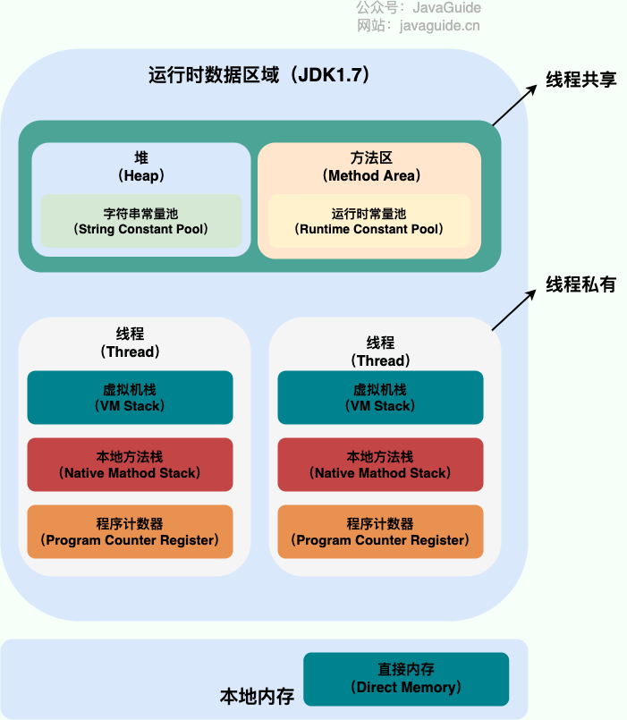
          - **`-XX:PermSize=N`**：方法区(永久代)初始大小
          - **`-XX:MaxPermSize=N`**：方法区(永久代)最大大小，超过这个值将会抛出`OutOfMemoryError`,异常:`java.lang.OutOfMemoryError: PermGen`
        - **Java 8及之后**：元空间移至直接内存（Native Memory），避免永久代OOM问题。
          
          - **`-XX:MetaspaceSize=N`**：设置 Metaspace 的初始（和最小大小）
          - **`XX:MaxMetaspaceSize=N`**：设置 Metaspace 的最大大小
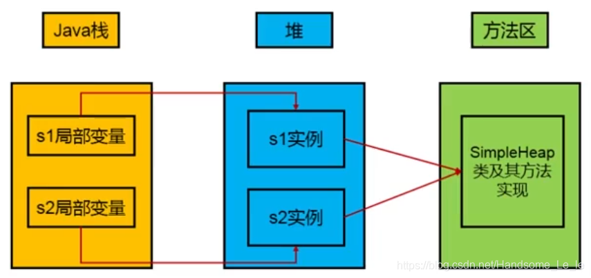

## 5. 方法区（Method Area）
- **作用**：存储被虚拟机加载的**类信息**、**常量**、**静态变量**、**即时编译器编译后的代码**等。
- **特点**：
    - 线程共享。
    - 可能抛出`OutOfMemoryError`（方法区大小不足）。
    - Java 8后由**元空间**实现，使用本地内存。
- **运行时常量池（Runtime Constant Pool）**：
    - 方法区的一部分，存储编译期生成的字面量（如字符串）和符号引用（如类名、方法名）。
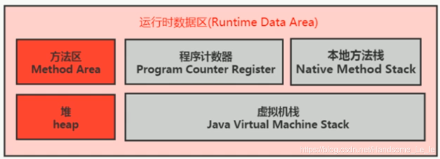

## 6. 直接内存（Direct Memory）
- **作用**：通过`Native`方法（如`ByteBuffer.allocateDirect()`）分配的堆外内存，不受JVM堆大小限制。
- **特点**：
    - 线程共享。
    - 可能抛出`OutOfMemoryError`（直接内存超过物理内存或`-XX:MaxDirectMemorySize`限制）。
    - 适用于高I/O场景（如NIO），减少数据在JVM堆与Native堆间的拷贝。

## 总结对比
| 区域    | 线程私有/共享 | 存储内容            | 异常类型                       |
|-------|---------|-----------------|----------------------------|
| 程序计数器 | 私有      | 字节码指令地址         | 无                          |
| JVM栈  | 私有      | 栈帧（局部变量表、操作数栈等） | `StackOverflowError`、`OOM` |
| 本地方法栈 | 私有      | Native方法栈帧      | `StackOverflowError`、`OOM` |
| 堆     | 共享      | 对象实例、数组         | `OOM`                      |
| 方法区   | 共享      | 类信息、常量、静态变量     | `OOM`                      |
| 直接内存  | 共享      | 堆外内存（如NIO缓冲区）   | `OOM`                      |