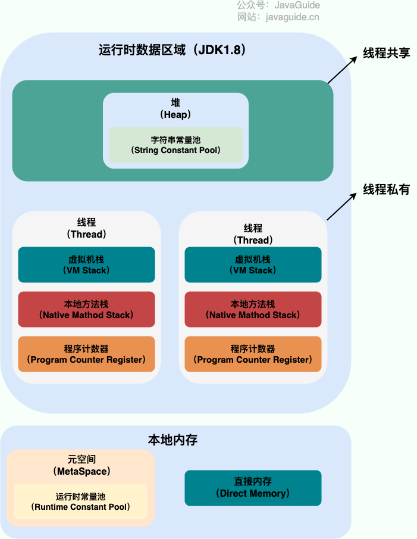

# 内存区域

## 运行时数据区域
### JDK 1.8 和之前的版本略有不同

| JDK 1.7             | JDK 1.8                 |
|---------------------|-------------------------|
|  |  |

#### 程序计数器
##### 功能
> - 字节码解释器通过改变程序计数器来依次读取指令，从而实现代码的流程控制，如：顺序执行、选择、循环、异常处理。
> - 在多线程的情况下，程序计数器用于记录当前线程执行的位置，从而当线程被切换回来的时候能够知道该线程上次运行到哪儿了。
##### 注意
> 程序计数器是唯一一个不会出现`OutOfMemoryError`的内存区域，它的生命周期随着线程的创建而创建，随着线程的结束而死亡。

#### Java 虚拟机栈
> 栈帧随着方法调用而创建，随着方法结束而销毁。无论方法正常完成还是异常完成都算作方法结束。  
> 
##### 局部变量表
> 主要存放了编译期可知的各种数据类型（`boolean`、`byte`、`char`、`short`、`int`、`float`、`long`、`doubl`e）、对象引用（`reference`类型，它不同于对象本身，可能是一个指向对象起始地址的引用指针，也可能是指向一个代表对象的句柄或其他与此对象相关的位置）。
##### 操作数栈
> 主要作为方法调用的中转站使用，用于存放方法执行过程中产生的中间计算结果。另外，计算过程中产生的临时变量也会放在操作数栈中。
##### 动态链接
> 主要服务一个方法需要调用其他方法的场景。`Class`文件的常量池里保存有大量的符号引用比如方法引用的符号引用。当一个方法要调用其他方法，需要将常量池中指向方法的符号引用转化为其在内存地址中的直接引用。动态链接的作用就是为了将符号引用转换为调用方法的直接引用，这个过程也被称为 动态连接 。  
> 

#### 本地方法栈
> 与虚拟机栈所发挥的作用相似，在 HotSpot 虚拟机中和 Java 虚拟机栈合二为一。
> - **区别**：虚拟机栈为虚拟机执行 Java 方法 （也就是字节码）服务，而本地方法栈则为虚拟机使用到的 Native 方法服务。
> - **用途**：本地方法被执行的时候，在本地方法栈也会创建一个栈帧，用于存放该本地方法的局部变量表、操作数栈、动态链接、出口信息。  

#### Java 虚拟机栈和本地方法栈的常见异常
> - **`StackOverFlowError`**：若栈的内存大小不允许动态扩展，那么当线程请求栈的深度超过当前 Java 虚拟机栈/本地方法栈的最大深度的时候，就抛出`StackOverFlowError`错误。
> - **`OutOfMemoryError`**：如果栈的内存大小可以动态扩展， 如果 Java 虚拟机栈/本地方法栈在动态扩展栈时无法申请到足够的内存空间，则抛出`OutOfMemoryErro`r异常。

#### 堆
> 堆目的是存放对象实例，几乎所有的对象实例以及数组都在这里分配内存。  
> Java 堆是垃圾收集器管理的主要区域，因此也被称作`GC`堆（Garbage Collected Heap）。
##### 堆结构
> 从垃圾回收的角度，由于现在收集器基本都采用分代垃圾收集算法，所以 Java 堆还可以细分为：新生代和老年代；再细致一点有：Eden、Survivor、Old 等空间。进一步划分的目的是更好地回收内存，或者更快地分配内存。  
>   
> Eden 区、两个 Survivor 区 S0 和 S1 都属于新生代，中间一层属于老年代，最下面一层属于永久代。  
> 
> JDK 1.7 与之前堆内存被通常分为三部分  
> - 新生代内存(Young Generation)
> - 老生代(Old Generation)
> - 永久代(Permanent Generation)
> JDK 1.8 之后 PermGen(永久代) 已被 Metaspace(元空间) 取代，元空间使用的是本地内存  
> - 为什么?
>   - 整个永久代有一个 JVM 本身设置的固定大小上限，无法进行调整（也就是受到 JVM 内存的限制），而元空间使用的是本地内存，受本机可用内存的限制，虽然元空间仍旧可能溢出，但是比原来出现的几率会更小。
>   - 元空间里面存放的是类的元数据，这样加载多少类的元数据就不由 MaxPermSize 控制了, 而由系统的实际可用空间来控制，这样能加载的类就更多了。
>   - 在 JDK 1.8，合并 HotSpot 和 JRockit 的代码时, JRockit 没有永久代合并之后就没有必要额外的设置一个永久代。
>   - 永久代会为 GC 带来不必要的复杂度，并且回收效率偏低。
> 一般内存分配比例eden:s1:s0=8:1:1
##### 堆常见异常
> 堆常见异常是`OutOfMemoryError`错误
> - **`java.lang.OutOfMemoryError: GC Overhead Limit Exceeded`**：当 JVM 花太多时间执行垃圾回收并且只能回收很少的堆空间时，就会发生此错误。
> - **`java.lang.OutOfMemoryError: Java heap space`**：假如在创建新的对象时, 堆内存中的空间不足以存放新创建的对象, 就会引发此错误。

#### 方法区
> 是 JVM 运行时数据区域的一块逻辑区域，是各个线程共享的内存区域。  
> - **用途**：当虚拟机要使用一个类时，它需要读取并解析 Class 文件获取相关信息，再将信息存入到方法区。方法区会存储已被虚拟机加载的 类信息、字段信息、方法信息、常量、静态变量、即时编译器编译后的代码缓存等数据。
##### 方法区和永久代以及元空间的关系
> 方法区和永久代以及元空间的关系很像 Java 中接口和类的关系，类实现了接口，这里的类就可以看作是永久代和元空间，接口可以看作是方法区，也就是说永久代以及元空间是 HotSpot 虚拟机对虚拟机规范中方法区的两种实现方式。并且，永久代是 JDK 1.8 之前的方法区实现，JDK 1.8 及以后方法区的实现变成了元空间。  
> 
##### 方法区常用参数
> - JDK 1.7 与之前 永久代存在时：
>   - **`-XX:PermSize=N`**：方法区(永久代)初始大小
>   - **`-XX:MaxPermSize=N`**：方法区(永久代)最大大小，超过这个值将会抛出`OutOfMemoryError`,异常:`java.lang.OutOfMemoryError: PermGen`
>   相对而言，垃圾收集行为在这个区域是比较少出现的，但并非数据进入方法区后就“永久存在”了。  
> - JDK 1.8 的时候，永久代底移除换成元空间后：
>   - **`-XX:MetaspaceSize=N`**：设置 Metaspace 的初始（和最小大小）
>   - **`XX:MaxMetaspaceSize=N`**：设置 Metaspace 的最大大小
>   与永久代很大的不同就是，如果不指定大小的话，随着更多类的创建，虚拟机会耗尽所有可用的系统内存。  

#### 运行时常量池
> Class 文件中除了有类的版本、字段、方法、接口等描述信息外，还有用于存放编译期生成的各种字面量（Literal）和符号引用（Symbolic Reference）的 常量池表(Constant Pool Table)

#### 字符串常量池
> 是 JVM 为了提升性能和减少内存消耗针对字符串（String 类）专门开辟的一块区域，主要目的是为了避免字符串的重复创建。  
>   
> JDK1.7 之前，字符串常量池存放在永久代。JDK1.7 字符串常量池和静态变量从永久代移动了 Java 堆中
> - 为什么?
>   - 因为永久代（方法区实现）的 GC 回收效率太低，只有在整堆收集 (Full GC)的时候才会被执行 GC。Java 程序中通常会有大量的被创建的字符串等待回收，将字符串常量池放到堆中，能够更高效及时地回收字符串内存。

#### 直接内存
> 直接内存是一种特殊的内存缓冲区，并不是虚拟机运行时数据区的一部分，也不是虚拟机规范中定义的内存区域，并不在 Java 堆或方法区中分配的，而是通过 JNI 的方式在本地内存上分配的。  
> 但是这部分内存也被频繁地使用，而且也可能导致`OutOfMemoryError`错误出现。 
> 
> - JDK1.4 中新加入的 NIO（Non-Blocking I/O，也被称为 New I/O），引入了一种基于通道（Channel）与缓存区（Buffer）的 I/O 方式，它可以直接使用 Native 函数库直接分配堆外内存，然后通过一个存储在 Java 堆中的 DirectByteBuffer 对象作为这块内存的引用进行操作。这样就能在一些场景中显著提高性能，因为避免了在 Java 堆和 Native 堆之间来回复制数据。
> - 直接内存的分配不会受到 Java 堆的限制，但是会受到本机总内存大小以及处理器寻址空间的限制。

## HotSpot 虚拟机

### 对象分配

#### 对象创建的六种方式
> 1. **new关键字**：最常见的形式、Xxx的静态方法、XxxBuilder、XxxFactory的静态方法。
> 2. **Class类的newInstance()方法****：通过反射的方式创建对象，调用类的无参构造器进行对象的创建，且其访问权限为public。
> 3. **Constructor的newInstance()方法**：通过反射的方式创建对象，调用类的无参、有参构造器进行对象的创建，对构造器访问权限没有要求。
> 4. **使用clone()方法**：不调用任何构造器，但是要求当前类实现Cloneable接口，重写clone()方法。
> 5. **使用序列化**：从文件、网络中获取一个对象的二进制流。
> 6. **使用第三方库**：Objenesis、BeanUtils、PropertyUtils。

#### 对象创建的具体过程

##### 1. 类加载检查
> 当Java虚拟机遇到一条字节码new指令时，首先将去检查这个指令的参数是否能在Metaspace的常量池中定位到一个类的符号引用，并且检查这个符号引用代表的类是否已经被加载、解析、和初始化，即判断该类型的元信息是否存在。  
> 如果没有定位到该类的符号引用，JVM会使用双亲委派模式使用当前类的类加载器以**ClassLoader+包名+类名**作为key进行查找对应的.class文件。如果找到了.class文件则进行类加载，并生成对应的Class对象。如果没有找到则抛出ClassNotFoundException异常。

##### 2. 分配内存
> 在类加载检查通过后，接下来JVM虚拟机将为新生对象分配堆内存。对象所需的内存大小在类加载完成后便可完全确定。为对象分配内存空间的任务实际上便等同于将一块确定大小的内存区域从JVM堆中划分出来，这里的对内划分分为两种情况：
> 
> - **指针碰撞(Bump The Pointer)**：
>   - **适用场合**：堆内存规整（即没有内存碎片）的情况下。
>   - **原理**：用过的内存全部整合到一边，没有用过的内存放在另一边，中间有一个分界指针，只需要向着没用过的内存方向将该指针移动对象内存大小位置即可。
>   - **使用该分配方式的 GC 收集器**：Serial, ParNew
>
> - **空闲列表(Free List)**：
>   - **适用场合**：堆内存不规整的情况下。
>   - **原理**：虚拟机会维护一个列表，该列表中会记录哪些内存块是可用的，在分配的时候，找一块儿足够大的内存块儿来划分给对象实例，最后更新列表记录。
>   - **使用该分配方式的 GC 收集器**：CMS
> 
> 择哪种分配方式是由JVM堆内存是否规整决定的，而JVM堆内存是否规则是由JVM所采用的垃圾收集器是否带有空间压缩整理(Compact)能力决定的。所以当使用Serial、ParNew等带压缩整理过程的垃圾收集器时，系统采用的对象内存分配算法是指针碰撞，既简单又高效。而当使用CMS这种基于清除(Sweep)算法收集垃圾时，理论上就只能采用较为复杂的空闲列表算法来分配内存。  

##### 3. 内存分配并发问题
> 对象的创建在JVM中是非常频繁的行为，即使仅仅是修改一个指针所指向的位置，在并发场景下也是非线程安全的。解决这个问题有两种可选方案：
> - **CAS以及失败重试**：CAS 是乐观锁的一种实现方式。所谓乐观锁就是，每次不加锁而是假设没有冲突而去完成某项操作，如果因为冲突失败就重试，直到成功为止。虚拟机采用 CAS 配上失败重试的方式保证更新操作的原子性。
> - **本地线程分配缓冲区(Thread Local Allocation Buffer TLAB)**：为每一个线程预先在 Eden 区分配一块儿内存，JVM 在给线程中的对象分配内存时，首先在 TLAB 分配，当对象大于 TLAB 中的剩余内存或 TLAB 的内存已用尽时，再采用上述的 CAS 进行内存分配。  
> 虚拟机是否使用TLAB可以通过-XX:+UseTLAB选项进行配置。

##### 4. 初始化分配到的内存
> 在内存分配完成之后，虚拟机必须将分配到的内存空间进行初始化，初始化过程不包括对象头。内存初始化的作用是对类中的所有属性设置默认值，如果使用了TLAB这一项工作也可以提前至TLAB分配内存成功后一同进行。这步操作保证了对象的实例字段在Java代码中可以不赋初始值就直接使用，使程序都能访问到这些实例字段的数据类型所对应的零值。

##### 5. 设置对象头
> 初始化内存之后，JVM还会将一些信息设置到对象头中。JVM会将对象所属的类(即类的元信息数据)、如何才能寻找到类的元数据信息、对象的哈希码(对象的哈希码会延迟到正真调用Object#hashCode()方法时才进行计算)、对象的GC分代年龄等信息存放在对象的对象头(Object Header)中。

##### 6. 执行<init>()
> 当上述所有步骤执行完成之后，从JVM的角度看一个新生对象已经创建完成了，但是从Java程序的角度看，对象创建才刚刚开始–构造函数。即Class文件中的<init>()方法还未执行，此时对象中的所有实例字段都还为默认的零值，对象需要的其它资源和状态信息也还未按照预定的意图构建好。  
> 一般来说执行初始化动作由字节码流中new指令后面是否跟随invokespecial指令所决定，Java编译器会在遇到new关键字地方同生成这两条字节码指令，但是通过其它方式并不一定会如此。new指令之后会直接执行<inti>()方法，按照开发者的意愿对对象进行初始化动作，至此一个真正可用的Java对象才算完全被创建出来。

##### 总结
> - 为对象属性赋值的操作：
>   1. 属性的默认初始化
>   2. 显示初始化
>   3. 代码块中初始化
>   4. 构造器中初始化
>
> - 对象实例化的过程：
>   1. 加载类元信息
>   2. 为对象分配内存，同时处理并发问题
>   3. 属性的默认初始化
>   4. 设置对象头信息
>   5. 属性的显示初始化、代码块中初始化、构造器中初始化

### 对象布局
> 在 Hotspot 虚拟机中，对象在内存中的布局可以分为 3 块区域：对象头、实例数据和对齐填充。

#### 对象头(Object Header)

> Hotsopt VM中对象的对象头中包含两类信息：
> - 第一类是用于村粗对象自身的运行时数据，如哈希码(hashCode)、GC分代年龄、锁状态标志、线程持有的锁、偏向线程ID、偏向时间戳等，这部分数据的长度在32位和64位的虚拟机(未开启压缩指针)中分别为32个比特和64个比特，这类数据官方称为Mark Word。
> - 对象头中另外一部分是类型指针，即实例对象指向它的类型元数据的指针，Java虚拟机通过这个指针来确定该对象是哪个类的实例。 
> 
> 此外如果对象是一个Java数组，对象头中必须有一块用于记录数组长度的数据，因为JVM可以通过普通Java对象的元数据信息确定Java对象的大小，如果数组长度是不确定的，JVM将无法通过元数据中的信息推断出数组的大小。

#### 实例数据(Instance Data)
> 实例数据部分是对象真正存储的有效信息，即在Java代码中定义的各种类型的字段内容，无论是父类中继承下来的还是在子类中定义的字段都必须在此进行记录。

#### 对齐填充(Padding)
> 对齐填充并不是比如存在的，也没有特殊的含义，它仅仅是起着占位符的作用。由于Hotspot虚拟机的自动内存管理系统要求对象地址的起始地址必须是8字节的整数倍，换而言之就是所有Java对象的大小都必须是8字节的整数倍。其中对象头部分已被精心设计成正好是8字节的整数倍，因此如果在实例数据部分没有对齐的话，就需要对齐填充部分进行补全。

**创建一个Account类**：  
```java
public class Account {

    public Account() {        System.out.println("Account‘s No Arg Construt");    }
}
```

**创建一个Customer类**：  
```java
public class Customer {
    private Integer id = 100001;
    private String name;
    private Account account;

    {
        name = "kapcd";
    }

    public Customer() {
        System.out.println("Customer's No Arg Construct");
        account = new Account();
    }

    public static void main(String[] args) {
        Customer customer = new Customer();
    }
}
```

**其对象内存布局如下图所示**：  


### 对象的访问定位
> 建立对象就是为了使用对象， Java 程序通过栈上的 reference 数据来操作堆上的具体对象。对象的访问方式由虚拟机实现而定，目前主流的访问方式有：使用句柄、直接指针。
> 

#### 句柄
> 如果使用句柄的话，那么 Java 堆中将会划分出一块内存来作为句柄池，reference 中存储的就是对象的句柄地址，而句柄中包含了对象实例数据与对象类型数据各自的具体地址信息。  
> 

#### 直接指针
> 如果使用直接指针访问，reference 中存储的直接就是对象的地址。  
> 