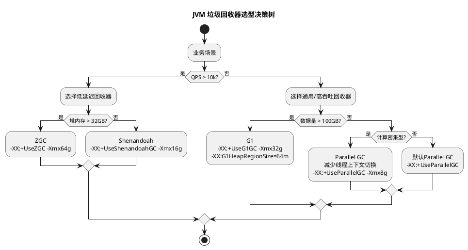

# JVM资源规划

## 一、基于业务场景的容量规划方法论

### 1. **建模核心公式**
- **QPS/TPS驱动模型**：
    - 峰值QPS = (日PV × 80%) / (3600 × 峰值小时数)
    - 示例：秒杀系统日PV 1亿，峰值4小时 → 峰值QPS = (1e8 × 0.8) / (3600 × 4) ≈ **5,555 QPS**
    - JVM堆内存需求 = (峰值QPS × 单请求内存占用 × 响应时间窗口) / 目标GC频率
        - 示例：短请求单对象1KB，P99响应100ms → 堆内存 = (5,555 × 1KB × 0.1s) / 0.01（每秒1% GC） ≈ **55MB**（需考虑对象晋升和冗余）

- **数据规模驱动模型**：
    - ETL任务总数据量10TB，单批次处理1GB → 并发批次数 = 10TB/1GB = **10,240批次**
    - 堆内存需求 = (总数据量 × 对象膨胀系数) / 并发批次数
        - 示例：对象膨胀20倍 → 堆内存 = (10TB × 20) / 10,240 ≈ **19.5GB**（需分批加载）

### 2. **业务场景-指标映射表**
| 业务场景       | 关键指标组合                          | JVM优化目标                     |
|----------------|---------------------------------------|----------------------------------|
| 高并发短请求   | QPS、P99响应时间、连接数              | 低延迟（<100ms）、高频Minor GC   |
| 大数据处理     | 总数据量、批次大小、吞吐量            | 高吞吐、避免Full GC、大堆优化    |
| 长连接服务     | 并发连接数、会话时长、心跳间隔        | 内存稳定、避免OOM、线程池调优    |
| 计算密集型     | CPU利用率、任务并行度、计算耗时       | 减少锁竞争、JIT优化、CPU缓存友好 |
| IO密集型       | IO吞吐量、磁盘延迟、缓存命中率        | 减少直接内存分配、异步IO优化     |

## 二、系统运行模型推断

### 1. **高并发短请求（秒杀系统）**
- **模型假设**：
    - 请求处理时间 = 网络传输（1ms） + JVM处理（2ms） + 数据库（7ms）
    - 对象生命周期：请求开始时创建，响应后立即垃圾回收
- **JVM行为预测**：
    - Young GC频率：每秒5,555请求 × 1KB/对象 ≈ 5.3MB/s → Eden区100MB时，每19秒触发Minor GC
    - 优化方向：增大新生代（-Xmn512m），降低晋升阈值（-XX:MaxTenuringThreshold=5）

### 2. **大数据处理（ETL）**
- **模型假设**：
    - 单批次处理1GB数据，生成20GB中间对象
    - 内存分配模式：批量加载 → 批量释放
- **JVM行为预测**：
    - Full GC风险：中间对象直接进入老年代，20批次后老年代占满
    - 优化方向：启用G1（-XX:+UseG1GC），设置区域大小（-XX:G1HeapRegionSize=32m）

## 三、JVM性能评估与GC调优

### 1. **性能评估指标体系**
| 指标类别       | 计算公式                              | 健康阈值                     |
|----------------|---------------------------------------|------------------------------|
| 吞吐量         | 有效工作时间 / (有效时间 + GC时间)    | >95%（后台任务）             |
| P99延迟        | 99%请求的响应时间                     | <100ms（Web应用）           |
| GC频率         | Full GC次数 / 运行小时数              | <1次/小时                    |
| 内存占用率     | 堆使用量 / 最大堆内存                 | <70%（避免动态扩容）          |

### 2. **GC日志分析方法**
```log
# 示例GC日志片段（G1收集器）
2025-08-10T19:50:00.123+0800: 12345.678: [GC pause (G1 Evacuation Pause) (young) 12345M->6789M(32768M), 0.0456789 secs]
```
- **关键指标提取**：
    - 停顿时间：0.045s（符合P99<100ms要求）
    - 回收量：12345M-6789M=5556MB（新生代回收效率高）
    - 优化建议：若停顿时间接近阈值，可调整`-XX:MaxGCPauseMillis=30`

## 四、JVM参数配置方案

### 1. **场景化参数模板**
```bash
# 高并发短请求（秒杀系统）
java -XX:+UseZGC -Xms8g -Xmx8g -XX:MaxGCPauseMillis=10 \
     -XX:ConcGCThreads=4 -XX:ParallelGCThreads=8 \
     -XX:+AlwaysPreTouch -XX:+UseLargePages \
     -jar seckill.jar

# 大数据处理（ETL）
java -XX:+UseG1GC -Xms32g -Xmx32g -XX:G1HeapRegionSize=64m \
     -XX:InitiatingHeapOccupancyPercent=35 \
     -XX:MaxTenuringThreshold=10 \
     -jar etl.jar
```

### 2. **参数调优决策树**


## 五、垃圾回收器选型指南

| 回收器            | 适用场景                 | 优势            | 配置示例                           |
|----------------|----------------------|---------------|--------------------------------|
| **ZGC**        | 低延迟（<10ms）、大堆（>32GB） | 并发标记、无停顿转移    | `-XX:+UseZGC -Xmx64g`          |
| **G1**         | 通用场景、平衡型             | 可预测停顿、区域化内存管理 | `-XX:+UseG1GC -Xmx16g`         |
| **Parallel**   | 高吞吐、后台计算             | 多核并行回收        | `-XX:+UseParallelGC -Xmx8g`    |
| **Shenandoah** | 低延迟、跨代引用优化           | 并发压缩、减少碎片     | `-XX:+UseShenandoahGC -Xmx32g` |

## 六、验证与迭代方法

1. **压测验证**：
    - 使用JMeter模拟峰值QPS，监控GC日志和内存曲线
    - 示例：秒杀系统压测时，若P99延迟超过100ms，逐步增大新生代比例（-Xmn从512m调整到1g）

2. **生产环境监控**：
    - 关键指标：`jstat -gcutil <pid> 1s`实时查看各区域使用率
    - 告警规则：老年代占用>70%且Full GC频率>1次/小时时触发扩容

3. **迭代优化周期**：
    - 预发布环境：每日压测+参数调优
    - 生产环境：每周分析GC日志，每月评估架构升级需求