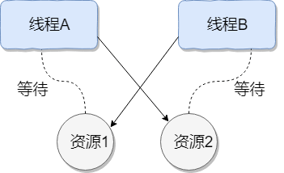

# 并发

并发（Concurrency）是计算机科学中的一个核心概念，指**在单个时间段内同时处理多个任务或操作的能力**。它通过让多个任务交替执行或重叠执行，使得系统在宏观上看起来像是在“同时”运行这些任务，从而提高资源利用率和系统响应速度。以下是关于并发的详细解释：

## 1. 核心思想
- **时间复用**：通过快速切换任务（时间片轮转），让CPU在多个任务间交替执行，每个任务只占用一小段时间，从而“模拟”同时运行。
- **资源优化**：在单核CPU上，并发通过分时复用实现；在多核CPU上，并发可以结合并行（Parallelism）真正同时执行多个任务。

### 时间复用的比喻
由于CPU的处理速度极快，多个线程之间**反复横跳**，给别人的感觉是：多个事情同时在做。  

## 2. 与并行的区别
| **特性**   | **并发（Concurrency）** | **并行（Parallelism）** |
|----------|---------------------|---------------------|
| **定义**   | 任务交替执行，宏观上同时进行      | 任务真正同时执行（多核CPU）     |
| **核心目标** | 提高资源利用率和响应速度        | 加速任务完成时间            |
| **依赖硬件** | 单核或多核均可             | 依赖多核CPU             |
| **示例**   | 单核CPU上同时运行浏览器和音乐播放器 | 四核CPU上同时渲染视频的四个片段   |

## 3. 为什么需要并发？
- **提高效率**：避免CPU空闲等待（如I/O操作时切换任务）。
  1. 顺序执行任务
  
  2. 并发执行任务
  
- **提升响应性**：例如，Web服务器可以同时处理多个用户请求，避免阻塞。
- **模拟现实场景**：如游戏中的角色移动、物理计算和UI渲染需要同时进行。

## 4. 并发引发的问题
- **竞态条件（Race Condition）**：多个任务同时修改共享数据导致结果不可预测。
    - 解决方案：锁（Mutex）、信号量（Semaphore）、原子操作等。
- **死锁（Deadlock）**：两个或多个任务互相等待对方释放资源。
  
    - 解决方案：避免循环等待、使用超时机制。
- **活锁（Livelock）**：任务因过度谦让而无法继续执行。
- **性能开销**：线程/进程创建、上下文切换等会消耗资源。