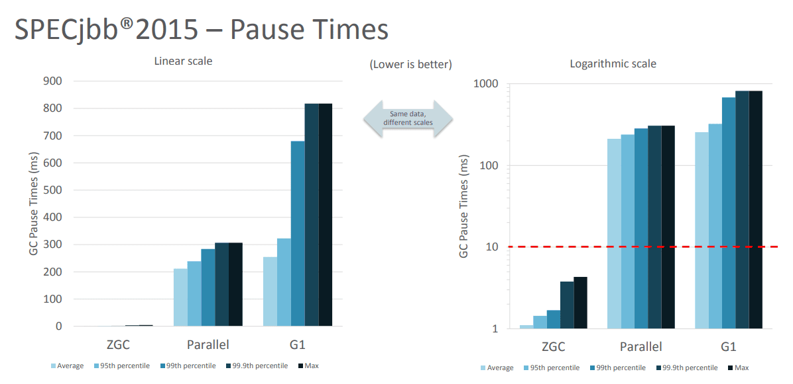

# Java 11

- JEP 181: 基于嵌套的访问控制
- 新增 String API：Java 11 新特性—新增 String API
- JEP 321：全新的 HTTP 客户端 API：Java 11 新特性—全新的 HTTP 客户端 API
- JEP 323：局部变量类型推断的升级：Java 11 新特性—局部变量类型推断的增强
- JEP 318：Epsilon—低开销垃圾回收器
- ZGC：可伸缩低延迟垃圾收集器
- JEP 335：废弃 Nashorn JavaScript 引擎
- 增加 Files API：Java 11 新特性—新增 Files API
- Optional API 增强：Java 11 新特性—Optional API 的增强
- JEP 328：飞行记录器（Flight Recorder）
- JEP 330：运行单文件源码程序
- JEP 320：删除 Java EE 和 corba 模块

## JEP 181: 基于嵌套的访问控制
Java 一直以来都支持嵌套类，包括静态嵌套类（static nested classes）和非静态嵌套类（inner classes）。这些嵌套类允许我们在逻辑上更紧密地组织相关的类，提高代码的可读性和可维护性。

但是在 Java 11 之前，为了让嵌套类能够访问彼此的私有成员，编译器需要生成桥接方法（bridge methods）或合成字段（synthetic fields）。这些是一些额外的、通常是不必要的公共方法和字段。这种方式违反了封装原则也有一定的性能和安全问题。

所以，需要有一种机制来优化嵌套类之间的访问控制，同时保持代码的封装性和清晰性。于是，Java 11 引入嵌套类访问控制，该特性解决了内部类与外部类之间访问控制的问题。

主要内容有两点：
1. **引入Nest 的概念**：  
    - nest 是一个新引入的概念。一个 nest 由一个顶层类（nest host）和它的所有内部类（nest members）组成。它允许一个 nest 中的所有类相互看到对方的私有成员（private fields, methods, and constructors）。
2. **引入两个属性**：
   - NestHost 属性标识了一个类的 nest host。
   - NestMembers 属性列出了属于同一个 nest 的所有成员。
   - 这些属性被添加到 class 文件格式中，允许 JVM 在类加载时确定哪些类是同一个 nest 的一部分。

## 新增 String API
Java 11 为了更好地处理字符串引入了几个新的 API。
- **isBlank()**：检查字符串是否为空或仅包含空白字符
- **lines()**：分割获取字符串流（Stream）
- **strip()**：去除字符串首尾的空白字符
- **repeat(n)**：复制字符串

## JEP 321：全新的 HTTP 客户端 API
在 Java 11 之前，Java 提供了`HttpURLConnection`类，但这个类的功能比较基础，但是随着时间的流逝，要求变得越来越复杂，对应用程序的要求也越来越高，导致该类越来越不方便了。在Java 9的时候，引入了一个新的HTTP客户端API（`HttpClient`）作为作为实验特性，到了 Java 11，则被标准化并正式成为Java标准库的一部分。

全新的 HTTP 客户端 API 具有如下几个优势：
- **HTTP/2支持**：全新的`HttpClient`支持 HTTP/2 协议的所有特性，包括同步和异步编程模型。
- **WebSocket支持**：支持`WebSocket`，允许建立持久的连接，并进行全双工通信。
- **同步和异步**：提供了同步和异步的两种模式。这意味着我们既可以等待HTTP响应，也可以使用回调机制处理HTTP响应。
- **链式调用**：新的`HttpClient`允许链式调用，使得构建和发送请求变得更简单。
- **更好的错误处理机制**：新的`HttpClient`提供了更好的错误处理机制，当HTTP请求失败时，可以通过异常机制更清晰地了解到发生了什么。

```java
HttpClient client = HttpClient.newHttpClient();

// 同步请求
HttpRequest request = HttpRequest.newBuilder()
        .uri(URI.create("https://???"))
        .build();

HttpResponse<String> response = client.send(request, HttpResponse.BodyHandlers.ofString());

System.out.println(response.statusCode());
System.out.println(response.body());

// 异步请求
client.sendAsync(request, HttpResponse.BodyHandlers.ofString())
        .thenApply(HttpResponse::body)
        .thenAccept(System.out::println)
        .join();
```

## JEP 323：局部变量类型推断的升级
Java 10 引入局部变量类型推断，通过var关键字允许编译器推断变量的类型，这大大简化了Java代码的编写。但是在 Java 10 中我们是不能在 Lambda参数使用var，这在Java 11中得到了改进。

在Java 11中，我们可以使用`var`关键字来声明`Lambda`表达式输入参数的类型，允许在`Lambda`参数上使用注解或者省略类型。

```java
// Java 11之前的Lambda表达式
BinaryOperator<Integer> adder = (a, b) -> a + b;

// Java 11使用var的Lambda表达式
BinaryOperator<Integer> adder = (var a, var b) -> a + b;

// 注解方式
BinaryOperator<Integer> adder = (@NotNull var a, @NotNull var b) -> a + b;
```

## JEP 318：Epsilon—低开销垃圾回收器
Epsilon 垃圾回收器的目标是开发一个控制内存分配，但是不执行任何实际的垃圾回收工作。它提供一个完全消极的 GC 实现，分配有限的内存资源，最大限度的降低内存占用和内存吞吐延迟时间。

Java 版本中已经包含了一系列的高度可配置化的 GC 实现。各种不同的垃圾回收器可以面对各种情况。但是有些时候使用一种独特的实现，而不是将其堆积在其他 GC 实现上将会是事情变得更加简单。

下面是 no-op GC 的几个使用场景：
- **性能测试**：什么都不执行的 GC 非常适合用于 GC 的差异性分析。no-op （无操作）GC 可以用于过滤掉 GC 诱发的性能损耗，比如 GC 线程的调度，GC 屏障的消耗，GC 周期的不合适触发，内存位置变化等。此外有些延迟者不是由于 GC 引起的，比如 scheduling hiccups, compiler transition hiccups，所以去除 GC 引发的延迟有助于统计这些延迟。
- **内存压力测试**：在测试 Java 代码时，确定分配内存的阈值有助于设置内存压力常量值。这时 no-op 就很有用，它可以简单地接受一个分配的内存分配上限，当内存超限时就失败。例如：测试需要分配小于 1G 的内存，就使用-Xmx1g 参数来配置 no-op GC，然后当内存耗尽的时候就直接 crash。
- **VM 接口测试**：以 VM 开发视角，有一个简单的 GC 实现，有助于理解 VM-GC 的最小接口实现。它也用于证明 VM-GC 接口的健全性。
- **极度短暂 job 任务**：一个短声明周期的 job 任务可能会依赖快速退出来释放资源，这个时候接收 GC 周期来清理 heap 其实是在浪费时间，因为 heap 会在退出时清理。并且 GC 周期可能会占用一会时间，因为它依赖 heap 上的数据量。 延迟改进：对那些极端延迟敏感的应用，开发者十分清楚内存占用，或者是几乎没有垃圾回收的应用，此时耗时较长的 GC 周期将会是一件坏事。
- **吞吐改进**：即便对那些无需内存分配的工作，选择一个 GC 意味着选择了一系列的 GC 屏障，所有的 OpenJDK GC 都是分代的，所以他们至少会有一个写屏障。避免这些屏障可以带来一点点的吞吐量提升。

Epsilon 垃圾回收器和其他 OpenJDK 的垃圾回收器一样，可以通过参数`-XX:+UseEpsilonGC`开启。

Epsilon 线性分配单个连续内存块。可复用现存 VM 代码中的 TLAB 部分的分配功能。非 TLAB 分配也是同一段代码，因为在此方案中，分配 TLAB 和分配大对象只有一点点的不同。Epsilon 用到的 barrier 是空的(或者说是无操作的)。因为该 GC

执行任何的 GC 周期，不用关系对象图，对象标记，对象复制等。引进一种新的 barrier-set 实现可能是该 GC 对 JVM 最大的变化。

## ZGC：可伸缩低延迟垃圾收集器
ZGC 即 Z Garbage Collector（垃圾收集器或垃圾回收器），这应该是 Java 11 中最为瞩目的特性，没有之一。ZGC 是一个可伸缩的、低延迟的垃圾收集器，主要为了满足如下目标进行设计：
- GC 停顿时间不超过 10ms
- 即能处理几百 MB 的小堆，也能处理几个 TB 的大堆
- 应用吞吐能力不会下降超过 15%（与 G1 回收算法相比）
- 方便在此基础上引入新的 GC 特性和利用 colord
- 针以及 Load barriers 优化奠定基础

当前只支持 Linux/x64 位平台 停顿时间在 10ms 以下，10ms 其实是一个很保守的数据，即便是 10ms 这个数据，也是 GC 调优几乎达不到的极值。根据 SPECjbb 2015 的基准测试，128G 的大堆下最大停顿时间才 1.68ms，远低于 10ms，和 G1 算法相比，改进非常明显。



不过目前 ZGC 还处于实验阶段，目前只在 Linux/x64 上可用，如果有足够的需求，将来可能会增加对其他平台的支持。同时作为实验性功能的 ZGC 将不会出现在 JDK 构建中，除非在编译时使用 configure 参数： --with-jvm-features=zgc 显式启用。

在实验阶段，编译完成之后，已经迫不及待的想试试 ZGC，需要配置以下 JVM 参数，才能使用 ZGC，具体启动 ZGC 参数如下：

`-XX：+ UnlockExperimentalVMOptions -XX：+ UseZGC -Xmx10g`

其中参数：`-Xmx`是 ZGC 收集器中最重要的调优选项，大大解决了程序员在 JVM 参数调优上的困扰。ZGC 是一个并发收集器，必须要设置一个最大堆的大小，应用需要多大的堆，主要有下面几个考量：
- 对象的分配速率，要保证在 GC 的时候，堆中有足够的内存分配新对象。
- 一般来说，给 ZGC 的内存越多越好，但是也不能浪费内存，所以要找到一个平衡。

## JEP 335：废弃 Nashorn JavaScript 引擎
Nashorn JavaScript 引擎最初是在**JDK 8 **中引入的，用于取代 Rhino 脚本引擎，它允许在JVM上执行和调用JavaScript代码。但是随着 Java 11 的到来标志着 Nashorn JavaScript 引擎的废弃。

Java 11 废弃 Nashorn JavaScript 引擎的主要原因是因为它难以跟上现代 JavaScript 发展的步伐，同时Oracle决定将资源集中在Java核心功能上，而不是维护与Java生态系统关联不大的组件，鼓励开发者转而使用更专注的JavaScript运行时环境，如Node.js。

## 增加 Files API
Java 11 为 Files 类增加了两个非常有用的实用方法，进一步简化了文件读写的操作：readString() 和 writeString()。
- **Files.readString(Path path)**：读取一个文件的所有内容并将其返回为一个字符串。该方法非常适用于一次性读取整个文件。
- **Files.writeString(Path path)**, CharSequence csq, OpenOption... options)：将一个字符串写入到文件中。

## Optional API 增强
Optional 是 Java 8 引入的，用来方便我们以一种更加优雅的方式来处理NullPointerException。Java 11 为了能够进一步方法我们使用它，新增了一个方法：
- **isEmpty()**：判断容器是否为空，如果包含的值不存在，则返回 true。

## JEP 328：飞行记录器（Flight Recorder）
飞行记录器（Java Flight Recorder）是一种监控工具，它收集运行中的Java虚拟机（JVM）的详细运行时信息，这些信息可以用于诊断问题，以及分析和改进性能。飞行记录器之前是商业版 JDK 的一项分析工具，但从Java 11开始，它被贡献给了OpenJDK，成为了所有Java开发者可用的标准功能。

飞行记录器记录的主要数据源于应用程序、JVM 和 OS，这些事件信息保存在单独的事件记录文件中，故障发生后，能够从事件记录文件中提取出有用信息对故障进行分析。启用参数：

`java -XX:StartFlightRecording=filename=myrecording.jfr,duration=60s MyApplication`

这条命令会启动一个60秒的飞行记录，并将结果保存在myrecording.jfr文件中。

还可以使用 jcmd 工具在运行中的Java应用程序上启动和控制JFR，例如：
```shell
jcmd <PID> JFR.start
jcmd <PID> JFR.dump filename=myrecording.jfr
jcmd <PID> JFR.stop
```
其中 <PID> 是Java进程的进程ID。

收集到的JFR记录文件可以使用多种工具进行分析，最常用的是JDK Mission Control（JMC）。JMC提供了一个图形界面，用于查看和分析JFR产生的数据文件。

## JEP 330：运行单文件源码程序
这项特性允许开发者直接运行一个包含源代码的单个Java文件，而无需事先将其编译成字节码。这个特性简化了运行简单Java程序的过程，使得快速测试和运行小段代码更加便捷。

我们可以使用 Java 命令直接运行一个单文件的Java源代码，比如我们有一个名为 HelloWorld.java 的文件，内容如下：
```java
public class HelloWorld {
    public static void main(String[] args) {
        System.out.println("Hello, World!");
    }
}
```
我们可以使用下面命令来执行这个 Java 文件

`java HelloWorld.java`

输出内容为：

`Hello, World!`

## JEP 320：删除 Java EE 和 corba 模块
在 Java 9 和 Java 10 中 Java EE（现Jakarta EE）和CORBA模块就已经被标记为弃用了，并且在默认情况下是不可用的，在 Java 11 中，被彻底移除了。删除的模块包括：
- Java EE模块：
  - java.xml.ws (JAX-WS, SOAP Web服务)
  - java.xml.bind (JAXB, XML到Java对象的绑定)
  - java.activation (JAF, JavaBeans Activation Framework)
  - java.xml.ws.annotation (Web服务注解)
  - javax.jws, javax.jws.soap, javax.xml.soap, 等等。
- CORBA模块：
  - java.corba (包含了CORBA、IDL和IIOP相关的类和接口)