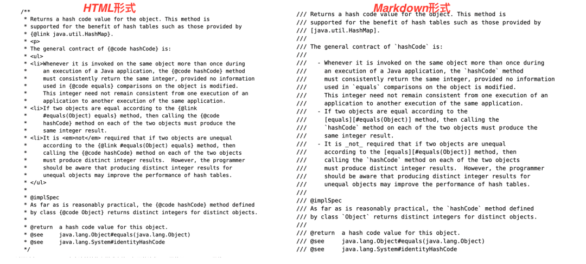

# Java 23

- **JEP 455**: 模式、instanceof 和 switch 中的基本类型（预览）
- **JEP 466**: 类文件 API（第二次预览）
- **JEP 467**: Markdown 文档注释
- **JEP 469**: 向量 API（第八次孵化）
- **JEP 473**: Stream 收集器（第二次预览）
- **JEP 471**: 弃用 sun.misc.Unsafe 中的内存访问方法以待移除
- **JEP 474**: ZGC：默认采用分代模式
- **JEP 476**: 模块导入声明（预览）
- **JEP 477**: 隐式声明类和实例主方法（第三次预览）
- **JEP 480**: 结构化并发（第三次预览）
- **JEP 481**: 作用域值（第三次预览）
- **JEP 482**: 灵活的构造函数体（第二次预览）

## JEP 455: 模式、instanceof 和 switch 中的基本类型（预览）

该特性扩展了模式匹配的功能，允许在 `instanceof` 操作符和 `switch` 表达式中使用基本类型。这能让代码更简洁易读，减少不必要的类型转换。例如，使用 `instanceof` 时，可直接对基本类型判断：
```java
Object obj = 42;
if (obj instanceof int i) {
    System.out.println("It's an int: " + i);
}
```
在 `switch` 表达式中，也可用基本类型匹配：
```java
int value = 2;
String result = switch (value) {
    case 1 -> "One";
    case 2 -> "Two";
    case 3 -> "Three";
    default -> "Unknown";
};
System.out.println(result);
```

## JEP 466: 类文件 API（第二次预览）

类文件 API 为开发者提供了直接操作 Java 类文件的编程接口。通过该 API，开发者能以编程方式读取、分析和修改类文件，无需依赖外部工具或库。这对于构建类文件分析工具、代码转换工具和动态代码生成器等非常有用。例如，开发者可利用该 API 读取类文件中的方法信息、字段信息等，并根据需求进行修改或生成新的类文件。

## JEP 467: Markdown 文档注释

此特性引入对 Markdown 格式文档注释的支持。Markdown 是一种轻量级标记语言，易于编写和阅读。在 Java 代码中使用 Markdown 格式的文档注释，可生成更美观、结构更清晰的文档。例如，开发者可使用 Markdown 语法编写类、方法、字段等的说明文档，IDE 或文档生成工具能将其渲染为格式良好的 HTML 或其他格式的文档，提高代码文档的可读性和可维护性。


## JEP 469: 向量 API（第八次孵化）

向量 API 提供高效向量计算方式，适用于科学计算、机器学习等领域。通过引入新类和接口，允许开发者用硬件加速的向量指令执行计算，提高性能。例如：
```java
// 创建两个向量
IntVector vector1 = IntVector.fromArray(VectorSpecies.ofDefault(int.class), new int[]{1, 2, 3, 4}, 0);
IntVector vector2 = IntVector.fromArray(VectorSpecies.ofDefault(int.class), new int[]{5, 6, 7, 8}, 0);

// 执行向量加法
IntVector result = vector1.add(vector2);

// 将结果存储到数组中
int[] output = new int[4];
result.intoArray(output, 0);

// 输出结果
System.out.println(Arrays.toString(output)); // [6, 8, 10, 12]
```

## JEP 473: Stream 收集器（第二次预览）

Stream 收集器特性为 Java Stream API 提供了更强大和灵活的收集操作。它允许开发者自定义收集器，将 Stream 中的元素按照特定规则收集到结果容器中。这为数据处理和聚合操作提供了更多可能性，例如实现复杂的分组、排序、转换等操作。通过使用 Stream 收集器，开发者能以更简洁和声明式的方式处理数据集合，提高代码的可读性和可维护性。

## JEP 471: 弃用 sun.misc.Unsafe 中的内存访问方法以待移除

`sun.misc.Unsafe` 类提供了对底层内存操作的直接访问，但这些方法存在安全风险且不便于维护。该特性旨在弃用其中的内存访问方法，为后续移除做准备。这有助于提高 Java 平台的安全性和稳定性，鼓励开发者使用更安全和标准的内存操作方式，如 `java.nio` 包中的类和方法。

## JEP 474: ZGC：默认采用分代模式

ZGC 是一种高性能垃圾回收器，该特性使其默认采用分代模式。分代模式根据对象的生命周期将堆内存分为不同代，如年轻代和老年代，并针对不同代采用不同的垃圾回收策略。这能提高垃圾回收的效率和性能，减少垃圾回收的停顿时间，提升应用程序的响应速度，尤其适用于对性能要求较高的大规模应用程序。

## JEP 476: 模块导入声明（预览）

模块导入声明提供更简洁的导入模块中包的方式。允许开发者在一个地方声明要导入的模块和包，减少代码冗余。例如：
```java
// 使用模块导入声明
import com.example.module.*;
import static com.example.module.ClassName.*;

public class MyClass {
    // 类体
}
```

## JEP 477: 隐式声明类和实例主方法（第三次预览）

该特性进一步简化 Java 源代码结构，支持隐式声明类和实例主方法。未命名的类可省略类名，且提供更简单的实例主方法声明方式。例如：
```java
// 紧凑源文件示例
void main() {
    System.out.println("Hello, World!");
}
```

## JEP 480: 结构化并发（第三次预览）

结构化并发是多线程编程方法，旨在简化多线程代码管理和错误处理。它将不同线程中的多个任务视为单个工作单元，提高代码可读性、可维护性和可靠性。引入 `StructuredTaskScope` 类，允许开发者将任务拆分为多个并发子任务，在各自线程执行，子任务须在主任务继续前完成，使错误处理更简单，异常可在一处捕获处理。例如：
```java
try (var scope = new StructuredTaskScope<Object>()) {
    Future<Integer> future1 = scope.fork(() -> doTask1());
    Future<String> future2 = scope.fork(() -> doTask2());
    scope.join();
    scope.throwIfFailed();

    Integer result1 = future1.resultNow();
    String result2 = future2.resultNow();
    // 处理结果
} catch (Exception e) {
    // 处理异常
}
```

## JEP 481: 作用域值（第三次预览）

作用域值是在特定作用域内共享不可变数据的机制。类似线程局部变量，但更适用于虚拟线程和结构化并发等新编程模型。允许在大型程序组件间安全有效共享数据，无需借助方法参数，减少代码冗余，提高可维护性。例如：
```java
final static ScopedValue<String> USER_NAME = new ScopedValue<>();

// 设置作用域值
ScopedValue.where(USER_NAME, "Alice")
           .run(() -> {
               // 在这个作用域内可以访问 USER_NAME
               System.out.println("Hello, " + USER_NAME.get());
           });
```

## JEP 482: 灵活的构造函数体（第二次预览）

灵活的构造函数体允许在构造函数中使用更灵活的代码结构。支持在构造函数中使用 `yield` 语句返回值，使构造函数编写更简洁易读。例如：
```java
class MyClass {
    private final int value;

    MyClass(int initialValue) {
        value = switch (initialValue) {
            case 0 -> 0;
            case 1 -> 1;
            default -> yield initialValue * 2;
        };
    }
}
```