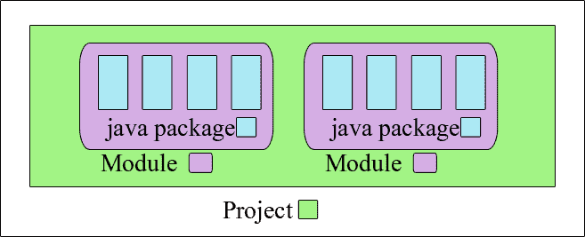
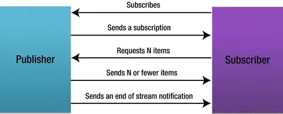

# Java 9

- JEP 261: 模块系统：Java 9 新特性—模块化
- JEP 269: 集合工厂方法：Java 9 新特性—新增只读集合和工厂方法
- JEP 222：Jshell：Java 9 新特性—REPL 工具：JSheel 命令
- JEP 213：接口支持私有方法：Java 9 新特性—接口支持私有方法
- Stream API 增强：Java 9 新特性—Stream API的增强
- Optional 的增强：Java 9 新特性—Optional 的增强
- 改进 try-with-resources：Java 9 新特性—try-with-resources的升级
- JEP 102：Process API
- JEP 264：平台日志 API 和 服务
- JEP 266: 反应式流（Reactive Streams）
- JEP 224: HTML5 Javadoc
- JEP 238: 多版本兼容 JAR 文件
- JEP 277：改进的弃用注解 @Deprecated
- JEP 213：改进钻石操作符(Diamond Operator)
- 增强 CompletableFuture：Java 9 新特性—改进CompletableFuture

## JEP 261: 模块系统

JPMS（Java Platform Module System）是Java 9发行版的核心亮点。它也被称为Jigshaw项目。模块是新的结构，就像我们已经有包一样。使用新的模块化编程开发的应用程序可以看作是交互模块的集合，这些模块之间具有明确定义的边界和依赖关系。

JPMS包括为编写模块化应用程序提供支持，以及将JDK源代码模块化。JDK 9 附带了大约 92 个模块（在 GA 版本中可以进行更改）。Java 9 Module System有一个`java.base`模块。它被称为基本模块。它是一个独立的模块，不依赖于任何其他模块。默认情况下，所有其他模块都依赖于`java.base`。

在java模块化编程中：
- 一个模块通常只是一个 jar 文件，在根目录下有一个文件module-info.class。
- 要使用模块，请将 jar 文件包含到modulepath而不是classpath. 添加到类路径的模块化 jar 文件是普通的 jar 文件，module-info.class文件将被忽略。



典型的module-info.java类如下所示：
```java
module my.module {
    // exports 公开指定包的所有公共成员
    exports cn.my.package.name;
}
```
```java
module my.module {
    // exports…to 限制访问的成员范围
    export cn.my.package.name to cn.target.package;
}
```
```java
module my.module2 {
    // 声明my.module2对my.module的依赖
    requires my.module;
}
```

## JEP 269: 集合工厂方法

从 Java 9 开始，您可以使用新的工厂方法创建不可变集合，例如List.of()、Set.of()、Map.of() 和 Map.ofEntries()等工厂方法来创建不可变集合：
```java
List.of("Java", "C++");
Set.of("Java", "C++");
Map.of("Java", 1, "C++", 2);
```
- **注意**：使用 of() 创建的集合为不可变集合，不能进行添加、删除、替换、 排序等操作，不然会报 java.lang.UnsupportedOperationException 异常。

## JEP 222：Jshell

JShell是JDK 9发行版 [ JEP 222 ]附带的新命令行交互式工具，用于评估用 Java 编写的声明、语句和表达式。JShell 允许我们执行 Java 代码片段并立即获得结果，而无需创建解决项目。

Jshell 很像我们在 linux 操作系统中的命令窗口。不同之处在于 JShell 是特定于 Java 的。除了执行简单的代码片段之外，它还有许多其他功能，例如：
- 在单独的窗口中启动内置代码编辑器
- 在单独的窗口中启动你选择的代码编辑器
- 在这些外部编辑器中发生保存操作时执行代码
- 从文件系统加载预先编写的类

## JEP 213：接口支持私有方法
Java 8 允许在接口中编写默认方法，这是一个广受欢迎的功能。从 Java 9 开始，您可以在接口中包含私有方法。

这些私有方法将提高接口内部的代码可重用性。例如，如果两个默认方法需要共享代码，私有接口方法将允许它们这样做，但不会将该私有方法暴露给它的实现类。

在接口中使用私有方法有四个规则：
- 私有接口方法不能是抽象的。
- 私有方法只能在接口内部使用。
- 私有静态方法可以在其他静态和非静态接口方法中使用。
- 私有非静态方法不能在私有静态方法中使用。

```java
public interface MyInterface {
    private void methodPrivate(){
    }
}
```
## Stream API 增强
Java 9 引入了两种与`Stream`交互的新方法，即`takeWhile()`、`dropWhile()`方法。此外，它还添加了两个重载方法，即`ofNullable()`、`iterate()`方法。

`takeWhile()`方法可以从`Stream`中依次获取满足条件的元素，直到不满足条件为止结束获取。
```java
List<Integer> integerList = List.of(11, 33, 66, 8, 9, 13);
integerList.stream().takeWhile(x -> x < 50).forEach(System.out::println);// 11 33
```

`dropWhile()`方法的效果和`takeWhile()`相反。
```java
List<Integer> integerList2 = List.of(11, 33, 66, 8, 9, 13);
integerList2.stream().dropWhile(x -> x < 50).forEach(System.out::println);// 66 8 9 13
```

`ofNullable()`方法允许我们创建一个单元素的`Stream`，可以包含一个非空元素，也可以创建一个空 `Stream`。 而在 Java 8 中则不可以创建空的`Stream`。
```java
Stream<String> stringStream = Stream.ofNullable("Java");
System.out.println(stringStream.count());// 1
Stream<String> nullStream = Stream.ofNullable(null);
System.out.println(nullStream.count());//0
```

`iterate()`方法的新重载方法提供了一个`Predicate`参数 (判断条件)来决定什么时候结束迭代
```java
public static<T> Stream<T> iterate(final T seed, final UnaryOperator<T> f) {
}
// 新增加的重载方法
public static<T> Stream<T> iterate(T seed, Predicate<? super T> hasNext, UnaryOperator<T> next) {

}
```
使得新的 iterate() 重载方法更加灵活一些。
```java
// 使用原始 iterate() 方法输出数字 1~10
Stream.iterate(1, i -> i + 1).limit(10).forEach(System.out::println);
// 使用新的 iterate() 重载方法输出数字 1~10
Stream.iterate(1, i -> i <= 10, i -> i + 1).forEach(System.out::println);
```

## Optional 的增强
`Optional`类中新增了`ifPresentOrElse()`、`or()`和`stream()`等方法

`ifPresentOrElse()`方法接受两个参数`Consumer`和`Runnable`，如果`Optional`不为空调用 `Consumer`参数，为空则调用`Runnable`参数。
```java
public void ifPresentOrElse(Consumer<? super T> action, Runnable emptyAction)

Optional<Object> objectOptional = Optional.empty();
objectOptional.ifPresentOrElse(System.out::println, () -> System.out.println("Empty!!!"));// Empty!!!
```

`or()`方法接受一个`Supplier`参数 ，如果`Optional`为空则返回`Supplier`参数指定的 `Optional`值。
```java
public Optional<T> or(Supplier<? extends Optional<? extends T>> supplier)

Optional<Object> objectOptional = Optional.empty();
objectOptional.or(() -> Optional.of("java")).ifPresent(System.out::println);//java
```

## 改进 try-with-resources

在 Java 9 之前，我们只能在 try-with-resources 块中声明变量：
```java
try (Scanner scanner = new Scanner(new File("testRead.txt"));
    PrintWriter writer = new PrintWriter(new File("testWrite.txt"))) {
    // omitted
}
```

在 Java 9 之后，在 try-with-resources 语句中可以使用 effectively-final 变量。
```java
final Scanner scanner = new Scanner(new File("testRead.txt"));
PrintWriter writer = new PrintWriter(new File("testWrite.txt"))
try (scanner;writer) {
    // omitted
}
```

- **effectively-final 变量**： 没有被 final 修饰但是值在初始化后从未更改的变量。

## JEP 102：Process API
在 Java 5 之前，生成新进程的唯一方法是使用该`Runtime.getRuntime().exec()`方法。然后在 Java 5 中，ProcessBuilder引入了 API，它支持一种更简洁的方式来生成新进程。现在，Java 9 添加了一种获取有关当前进程和任何衍生进程的信息的新方法。

要获取任何进程的信息，现在您应该使用`java.lang.ProcessHandle.Info`接口。此界面可用于获取大量信息，例如：
- 用于启动进程的命令
- 命令的参数
- 进程开始的时刻
- 它和创建它的用户花费的总时间

```java
ProcessHandle processHandle = ProcessHandle.current();
ProcessHandle.Info processInfo = processHandle.info();

System.out.println(processHandle.getPid());
System.out.println(processInfo.arguments().isPresent());
System.out.println(pprocessInfo.command().isPresent());
System.out.println(processInfo.command().get().contains("java"));
System.out.println(processInfo.startInstant().isPresent());
```

要获取新衍生进程的信息，请使用`process.toHandle()`方法获取ProcessHandle实例。其余一切如上。
```java
String javaPrompt = ProcessUtils.getJavaCmd().getAbsolutePath();
ProcessBuilder processBuilder = new ProcessBuilder(javaPrompt, "-version");
Process process = processBuilder.inheritIO().start();
ProcessHandle processHandle = process.toHandle();
```

也用于`ProcessHandle.allProcesses()`获取系统中所有可用进程的ProcessHandle流。

要获取所有子进程的列表（直接以及 n 级深度）可以使用`children()`和`descendants()`方法。
```java
Stream<ProcessHandle> children    = ProcessHandle.current().children();
Stream<ProcessHandle> descendants = ProcessHandle.current().descendants();
```

## JEP 264：平台日志 API 和 服务
JDK 9 通过新的日志记录 API 改进了平台类（JDK 类）和 JVM 组件中的日志记录。它允许开发者指定自己选择的日志记录框架（例如Log4J2）作为日志记录工具，用于记录来自 JDK 类的消息。

关于这个 API，你应该知道几件事：
- API 旨在供 JDK 中的类使用，而不是由应用程序类使用。
- 对于应用程序代码，开发者将像以前一样继续使用其他日志记录 API。
- API 不允许开发者以编程方式配置记录器。

API 由以下部分组成：
- 服务接口，`java.lang.System.LoggerFinder`是一个抽象静态类
- `java.lang.System.Logger`提供日志记录 API 的接口
- `getLogger()`类中的一个重载方法`java.lang.System`，它返回一个记录器实例。

JDK 9 还添加了一个新的命令行选项，`-Xlog`它使开发者可以单点访问从 JVM 的所有类记录的所有消息。以下是使用该`-Xlog`选项的语法：

`-Xlog[:][:[][:[][:]]]`

所有选项都是可选的。如果缺少前面的部分，-Xlog则必须为该部分使用冒号。例如，-Xlog::stderr表示所有部分都是默认的，输出设置为stderr.

## JEP 266: 反应式流（Reactive Streams）
在 Java 9 中的`java.util.concurrent.Flow`类中新增了反应式流规范的核心接口，是一套基于发布/订阅模式的数据处理规范。目的是“找到最小的一组接口，方法和协议，用来描述必要的操作和实体以实现这样的目标：以非阻塞背压方式实现数据的异步流”。

`Flow`中包含了`Flow.Publisher`、`Flow.Subscriber`、`Flow.Subscription`和`Flow.Processor`等 4 个核心接口。Java 9 还提供了`SubmissionPublisher`作为`Flow.Publisher`的一个实现。

下图显示了发布者和订阅者之间的典型交互顺序。 订阅令牌未显示在图表中。 该图没有显示错误和取消事件。



处理者（processor）充当订阅者和发布者的处理阶段。 Processor接口继承了Publisher和Subscriber接口。 它用于转换发布者——订阅者管道中的元素。 Processor<T,R>订阅类型T的数据元素，接收并转换为类型R的数据，并发布变换后的数据。 下图显示了处理者在发布者——订阅和管道中作为转换器的作用。 可以拥有多个处理者。


下面显示了响应式流倡导所提供的Java API。所有方法的返回类型为void。 这是因为这些方法表示异步请求或异步事件通知。

```java
public interface Publisher<T> {
    public void subscribe(Subscriber<? super T> s);
}
public interface Subscriber<T> {
    public void onSubscribe(Subscription s);
    public void onNext(T t);
    public void onError(Throwable t);
    public void onComplete();
}
public interface Subscription {
    public void request(long n);
    public void cancel();
}
public interface Processor<T,R> extends Subscriber<T>, Publisher<R> {
}
```

### 背压（back pressure）
如果生产者发出的信息比消费者能够处理消息最大量还要多，消费者可能会被迫一直在抓消息，耗费越来越多的资源，埋下潜在的崩溃风险。为了防止这一点，需要有一种机制使消费者可以通知生产者，降低消息的生成速度。生产者可以采用多种策略来实现这一要求，这种机制称为背压。

## JEP 224: HTML5 Javadoc
Java 9 增强了javadoc生成 HTML5 标记的工具。它目前以 HTML 4.01 生成页面。

为了生成 HTML5 Javadoc，参数`-html5`需要放在命令行参数中。要在命令行上生成文档，你将运行：
```shell
javadoc [选项] [包名] [源文件] [@files]
```
使用 HTML5 可以带来更简单的 HTML5 结构的好处。它还实现了可访问性的WAI-ARIA 标准。这旨在使身体或视觉障碍的人更容易使用屏幕阅读器等工具访问 javadocs 页面。

JEP 225提供了在 javadoc 中搜索程序元素和标记的单词和短语的能力。

以下内容将被索引和搜索：
- 模块的声明名称
- 套餐
- 类型和成员
- 方法参数类型的简单名称

这是在客户端实现的，带有一个新的`search.js`Javascript 文件，以及生成 javadoc 时生成的索引。生成的 HTML5 API 页面上有一个搜索框。

请注意，默认情况下会添加搜索选项，但可以使用参数关闭：`-noindex`。

## JEP 238: 多版本兼容 JAR 文件
此增强与如何将应用程序类打包到 jar 文件中有关。以前，开发者必须将所有类打包到一个 jar 文件中，然后放入希望使用它的另一个应用程序的类路径中。

使用多版本特性，现在一个 jar 可以包含一个类的不同版本——兼容不同的 JDK 版本。关于一个类的不同版本，以及加载的类应该选择哪个类的JDK版本的信息存储在MANIFEST.MF文件中。在这种情况下，文件在其主要部分中MANIFEST.MF包含该条目Multi-Release: true

此外，META-INF 包含一个版本子目录，其以整数命名的子目录——从 9 开始（对于 Java 9）——存储特定于版本的类和资源文件。例如
```text
JAR content root
  A.class
  B.class
  C.class
  D.class
  META-INF
     MANIFEST.MF
     versions
        9
           A.class
           B.class
```

假设在 JDK 10 A.class中更新为利用一些 Java 10 新特性，那么这个 Jar 文件可以像这样更新：
```shell
JAR content root
  A.class
  B.class
  C.class
  D.class
  META-INF
     MANIFEST.MF
     versions
        9
           A.class
           B.class
        10
           A.class
```

它看起来非常有希望解决在大型应用程序中经常看到的依赖地狱，其中不同版本的 jar 彼此不兼容。此功能可以为解决这些情况提供很大帮助。

## JEP 277：改进的弃用注解 @Deprecated
从 Java 9 开始，`@Deprecated`注解将具有两个属性，即`forRemoval`和`since`.

1. since元素
   - **功能**：指定被注解的程序元素从哪个版本开始被弃用。
   - **示例**：如果一个方法在Java 9中被标记为过时，并且since元素被设置为"9"，则表示该方法从Java 9版本开始被弃用。
2. forRemoval元素
   - **功能**：表示被注解的程序元素是否在未来的版本中会被移除。如果forRemoval元素被设置为true，则表示该元素在未来的某个版本中可能会被移除，开发者应该尽快迁移代码以避免兼容性问题。
   - **示例**：如果一个方法在Java 9中被标记为过时，并且forRemoval元素被设置为true，则表示该方法在未来的某个版本中可能会被移除，开发者应该寻找替代方案并更新代码。

在Java 9的文档中，可以看到使用@Deprecated注解并带有since和forRemoval元素的示例。例如，在Boolean类的文档中，可能会看到类似以下的注解：
```java
@Deprecated(since = "9", forRemoval = true)  
public static Boolean valueOf(String s) {  
    // 方法实现  
}
```
这个注解表示valueOf方法从Java 9版本开始被弃用，并且在未来的某个版本中可能会被移除。开发者应该避免使用这个方法，并寻找替代方案。

## JEP 213：改进钻石操作符(Diamond Operator)
JEP 213在Java 9中对钻石操作符进行了改进，特别是在匿名内部类的创建中。在Java 8及之前的版本中，尝试在匿名类中使用钻石操作符会导致编译错误。但在Java 9中，这一限制被解除，允许在匿名内部类的创建中使用钻石操作符。

在Java 9中，可以像下面这样使用钻石操作符创建匿名内部类的实例：
```java
Handler<Integer> numberHandler = new Handler<>(1) {  
    @Override  
    public void handle() {  
        System.out.println(content);  
    }  
};  
  
Handler<?> objectHandler = new Handler<>("test") {  
    @Override  
    public void handle() {  
        System.out.println(content);  
    }  
};
```

这里的Handler是一个泛型抽象类，具有一个泛型类型参数T和一个抽象方法`handle()`。在创建`numberHandler`和`objectHandler`时，使用了钻石操作符，编译器会根据目标类型（即`Handler<Integer>和Handler<?>`）来推断类型参数。

注意：
- **类型推断**：虽然钻石操作符可以简化代码，但编译器在推断类型参数时可能会受到上下文的影响。因此，在某些复杂的情况下，编译器可能无法准确推断类型参数，此时需要显式指定类型参数以避免编译错误。
- **兼容性**：由于钻石操作符是Java 7及以后版本中的特性，因此在使用时需要确保目标环境支持该特性。同时，对于需要在多个Java版本中运行的代码，可能需要考虑兼容性问题。

## 增强 CompletableFuture
在Java 9中，CompletableFuture类得到了显著的增强和改进，旨在进一步简化异步编程和提高性能。

### 新增工厂方法
Java 9为CompletableFuture引入了三个新的工厂方法，这些方法提供了更简洁的方式来创建CompletableFuture实例。

1. completedFuture(U value)
   - **方法签名**：public static <U> CompletableFuture<U> completedFuture(U value)
   - **功能**：创建一个已经完成的CompletableFuture实例，并带有指定的结果值。
   - **应用场景**：适用于单元测试或需要立即返回结果的场景。
2. failedFuture(Throwable ex)
   - **方法签名**：public static <U> CompletableFuture<U> failedFuture(Throwable ex)
   - **功能**：创建一个已经异常完成的CompletableFuture实例。
   - **应用场景**：适用于错误处理和异常测试场景，提供了一种简洁的方式来表示已知的失败情况。
3. completedStage(U value) 和 failedStage(Throwable ex)
   - **方法签名**：public static <U> CompletionStage<U> completedStage(U value)、public static <U> CompletionStage<U> failedStage(Throwable ex)
   - **功能**：分别创建一个已经完成的或已经异常完成的CompletionStage实例。
   - **应用场景**：这些方法返回的是CompletionStage接口的实现，它们只支持CompletionStage接口中的方法。

### 支持超时和延迟执行
Java 9为CompletableFuture引入了支持超时和延迟执行的功能，这两个功能对于控制异步操作的时间行为至关重要。

1. orTimeout(long timeout, TimeUnit unit)
   - **方法签名**：public CompletableFuture<T> orTimeout(long timeout, TimeUnit unit)
   - **功能**：为CompletableFuture设置一个超时时间。如果在指定的超时时间内未完成，则CompletableFuture将以TimeoutException异常完成。
   - **应用场景**：适用于需要避免永久挂起的异步操作和保证响应性的场景。
2. completeOnTimeout(T value, long timeout, TimeUnit unit)
   - **方法签名**：public CompletableFuture<T> completeOnTimeout(T value, long timeout, TimeUnit unit)
   - **功能**：为CompletableFuture设置一个超时时间。如果在指定的超时时间内未完成，则使用指定的默认值来完成CompletableFuture。
   - **应用场景**：提供了一种优雅的回退机制，确保即使在超时的情况下也能保持异步流的连续性和完整性。
3. delayedExecutor(long delay, TimeUnit unit, Executor executor)
   - **方法签名**：public static Executor delayedExecutor(long delay, TimeUnit unit, Executor executor)
   - **功能**：创建一个延迟执行的Executor，可以将任务的执行推迟到未来某个时间点。
   - **应用场景**：适用于需要根据时间安排任务执行的场景，能够更精确地控制异步任务的执行时机。


### 改进了对子类的支持
Java 9还改进了对CompletableFuture子类的支持，使得子类可以更容易地定制和扩展CompletableFuture的行为。

1. defaultExecutor()
   - **方法签名**：public Executor defaultExecutor()
   - **功能**：返回用于未指定Executor异步方法的默认Executor。
   - **应用场景**：子类可以重写此方法以返回自定义的Executor，从而定制任务执行策略。
2. newIncompleteFuture()
   - **方法签名**：public <U> CompletableFuture<U> newIncompleteFuture()
   - **功能**：返回一个新的不完整的CompletableFuture实例。
   - **应用场景**：子类可以重写此方法以返回CompletableFuture的子类实例，从而在整个CompletableFuture API中自定义实例的行为。