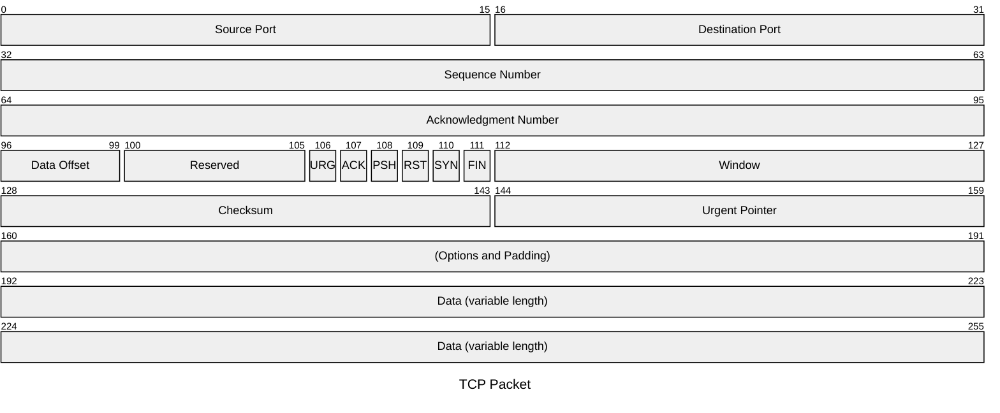

<!--
module:
  parent: computer-basics
  slug: computer-basics/tcp-packet
  type: article
  category: 主模块子文章
  summary: TCP 数据包（报文段） 本应该很简单，TCP（Transmission Control Protocol，传输控制协议）是面向连接的、可靠的、基于字节流的传输...
-->

# TCP 数据包（报文段）

---

> TCP（Transmission Control Protocol，传输控制协议）是面向连接的、可靠的、基于字节流的传输层协议。理解 TCP 报文段的头部结构，是掌握三次握手、四次挥手、流量控制与拥塞控制的基础。

## 报文结构



## 头部字段详解

| 字段 | 长度（bit） | 说明 |
|------|:-----------:|------|
| **Source Port** | 16 | 源端口号（0–65535），标识发送方进程 |
| **Destination Port** | 16 | 目的端口号，标识接收方进程 |
| **Sequence Number** | 32 | 序号。在 SYN 报文中为初始序列号（ISN）；在数据报文中为该段第一个数据字节的序号 |
| **Acknowledgment Number** | 32 | 确认号。期望收到对方下一个报文段的序号 = 已收到数据的末尾序号 + 1。仅在 ACK 标志位为 1 时有效 |
| **Data Offset** | 4 | 数据偏移（首部长度），以 4 字节为单位。最小值 5（20 字节），最大值 15（60 字节） |
| **Reserved** | 6 | 保留字段，置 0 |
| **控制标志（6 位）** | 6 | 见下方详解 |
| **Window** | 16 | 窗口大小。用于流量控制，告知对方自己还能接收多少字节的数据 |
| **Checksum** | 16 | 校验和，覆盖首部和数据，由发送方计算、接收方验证 |
| **Urgent Pointer** | 16 | 紧急指针。与 URG 标志配合使用，标识紧急数据的末尾位置（现代应用极少使用） |
| **Options** | 可变 | 可选字段，如 MSS（最大报文段长度）、Window Scale（窗口扩大因子）、SACK（选择性确认）、Timestamps 等 |
| **Padding** | 可变 | 填充至 4 字节对齐 |
| **Data** | 可变 | 载荷数据，最大长度 = IP 数据报总长度 - IP 首部 - TCP 首部 |

## 6 个控制标志位

```
URG  ACK  PSH  RST  SYN  FIN
 |    |    |    |    |    |
 |    |    |    |    |    └─ FIN：释放连接
 |    |    |    |    └────── SYN：建立连接（三次握手）
 |    |    |    └─────────── RST：重置连接（异常断开）
 |    |    └──────────────── PSH：请求接收方尽快交付上层应用
 |    └───────────────────── ACK：确认号有效
 └────────────────────────── URG：紧急指针有效
```

### 标志位典型组合

| 场景 | 标志位 | 说明 |
|------|--------|------|
| 三次握手第 1 步 | **SYN** | 客户端发起连接，Seq = ISN |
| 三次握手第 2 步 | **SYN + ACK** | 服务端同意连接，Seq = 服务端 ISN，Ack = 客户端 ISN + 1 |
| 三次握手第 3 步 | **ACK** | 客户端确认，Ack = 服务端 ISN + 1 |
| 数据传输 | **ACK** | 每个数据段都带 ACK |
| 主动关闭 | **FIN** | 一方请求关闭（半关闭） |
| 异常终止 | **RST** | 连接出错或拒绝连接时直接重置 |

## TCP 首部最小 / 最大长度

- **最小 20 字节**：Data Offset = 5，无 Options
- **最大 60 字节**：Data Offset = 15，Options 占 40 字节

## 与 UDP 的对比

| 特性 | TCP | UDP |
|------|-----|-----|
| 首部开销 | 20–60 字节 | 8 字节 |
| 连接方式 | 面向连接 | 无连接 |
| 可靠性 | 可靠传输（确认、重传、排序） | 尽力交付 |
| 传输方式 | 字节流 | 数据报 |
| 适用场景 | HTTP、文件传输、数据库连接 | DNS、视频流、游戏 |

## 相关章节

- [OSI 模型](../../osi-model/README.md)
- [TCP/IP 模型](../../tcp-ip-model/README.md)
- [常见协议](../README.md)
- 面试深挖版：[`TCP 三次握手四次挥手`](../../../../13.split-hairs/02.computer-basics/tcp-handshake-teardown/README.md) — 状态机 + TIME_WAIT/CLOSE_WAIT + 面试话术

← [返回: 计算机基础 · tcp-packet](README.md)
