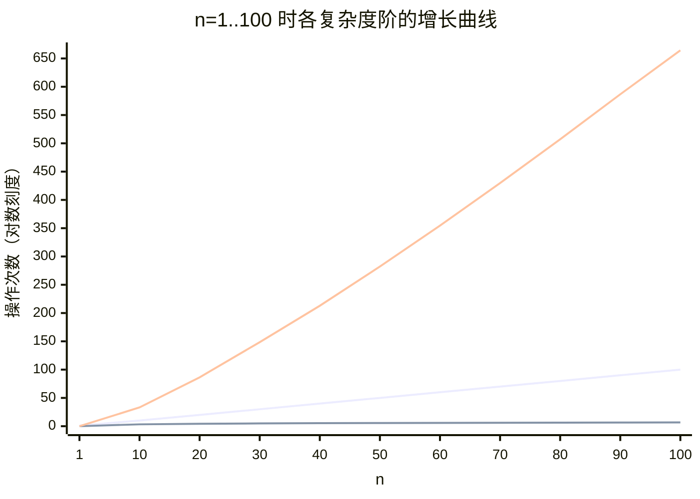

<!--
module:
  parent: computer-basics
  slug: computer-basics/complexity
  type: article
  category: 主模块子文章
  summary: 算法设计中，时间复杂度与空间复杂度的取舍是核心决策，需根据**场景、资源约束和性能需求**综合权衡。
-->

# 复杂度取舍策略

> 算法设计中，时间复杂度与空间复杂度的取舍是核心决策，需根据**场景、资源约束和性能需求**综合权衡。

---
---

## 〇、复杂度阶的基础推导

在讨论取舍之前，先约定**几类常见复杂度阶**的来源——它们是后续所有策略的衡量坐标。

### O(1) — 常数时间
- **特征**：操作次数与输入规模无关。
- **典型**：哈希表查询（理想无冲突时）、数组按下标访问、按位运算。

### O(log n) — 对数时间
- **来源**：每一步把候选规模折半。
- **推导**：`n → n/2 → n/4 → … → 1`，步数 `k` 满足 `n / 2^k = 1`，即 `k = log₂ n`。
- **典型**：二分查找、平衡 BST 查找（B 树 / AVL / 红黑树）。

### O(n) — 线性时间
- **来源**：必须**至少遍历一遍**输入（少于此无法处理每个元素）。
- **典型**：数组求和、链表遍历、一次扫描找最大值。

### O(n log n) — 线性对数
- **来源**：分治类排序每次"分"产生 `log n` 层递归，每层合计仍是 `O(n)` 合并 → `O(n · log n)`。
- **典型**：归并排序、快速排序（平均）、堆排序、FFT。

### O(n²) — 平方
- **来源**：嵌套循环，每一对元素都要配对一次。
- **典型**：冒泡排序、选择排序、插入排序；朴素字符串匹配。

```text
复杂度阶速查（n=10⁶ 时大致耗时，假设每次操作 ~1ns）：

  O(1)        ≈          1 次操作       （纳秒级）
  O(log n)    ≈         20 次操作       （纳秒级）
  O(n)        ≈    1,000,000 次        （毫秒级）
  O(n log n)  ≈  20,000,000 次        （十毫秒级）
  O(n²)       ≈ 10¹² 次操作            （小时级，几乎不可用）
  O(2ⁿ)       ≈ 不可计算               （n=40 已 10¹²）
```

---

## 一、取舍原则

| 场景 | 优先策略 | 典型做法 |
|------|---------|---------|
| **内存紧张**（嵌入式/移动端） | 降低空间复杂度 | 迭代替代递归，空间 O(n)→O(1) |
| **计算紧张**（实时系统/高频交易） | 降低时间复杂度 | 预计算+缓存，查询 O(n)→O(1) |
| **小规模数据** | 优先空间效率 | 插入排序 O(n²) 时间、O(1) 空间 |
| **大规模数据** | 优先时间效率 | 索引查询 O(log n) 替代全表扫描 O(n) |
| **快速响应**（UI/API） | 降低时间复杂度 | 哈希表存储，O(1) 查询 |
| **长期运行**（批处理） | 可接受高时间换空间 | 外部排序/流式处理 |

## 二、空间换时间

| 方法 | 说明 | 示例 |
|------|------|------|
| **缓存** | 存储中间结果避免重复计算 | 动态规划备忘录，O(2ⁿ)→O(n) |
| **预处理** | 提前构建索引/数据结构 | 搜索引擎倒排索引 |
| **哈希表** | 以空间换查找速度 | 词频统计 O(n log n)→O(n) |

### 例：斐波那契从 O(2ⁿ) → O(n)

```python
# 反例 ❌：朴素递归（指数级，每次重复计算子树）
def fib_bad(n: int) -> int:
    if n < 2: return n
    return fib_bad(n - 1) + fib_bad(n - 2)   # T(n) = T(n-1) + T(n-2) ≈ O(2ⁿ)

# 正例 ✅：备忘录 / DP 迭代（线性时间 + O(n) 空间）
def fib_dp(n: int) -> int:
    if n < 2: return n
    dp = [0, 1]
    for i in range(2, n + 1):
        dp.append(dp[i - 1] + dp[i - 2])
    return dp[n]

# 正例 ✅✅：滚动变量（线性时间 + O(1) 空间，最优取舍）
def fib_roll(n: int) -> int:
    a, b = 0, 1
    for _ in range(n):
        a, b = b, a + b
    return a
```

> **取舍结论**：能上备忘录就上；内存真紧张时再退化为滚动变量，**不要**为了"省 8 字节"丢回指数级。

## 三、时间换空间

| 方法 | 说明 | 示例 |
|------|------|------|
| **迭代替代递归** | 消除递归栈开销 | 阶乘计算空间 O(n)→O(1) |
| **流式处理** | 分块处理，减少内存 | 大文件排序：分块→归并 |
| **压缩数据结构** | 牺牲访问速度换空间 | 位图存储布尔值，空间 O(n)→O(n/8) |

### 例：阶乘递归 → 迭代

```text
# 反例 ❌：递归，n=100000 时栈溢出
def fact_bad(n):
    return 1 if n <= 1 else n * fact_bad(n - 1)

# 正例 ✅：迭代，O(1) 空间
def fact(n):
    r = 1
    for i in range(2, n + 1):
        r *= i
    return r
```

## 四、折中方案

1. **混合策略** — B+树索引：O(log n) 时间 + O(n) 空间，平衡查询与存储
2. **参数化调整** — 快速排序在小数据时切换为插入排序
3. **近似算法** — 布隆过滤器：O(1) 时间 + O(n) 空间，允许一定误判

## 五、时间-空间权衡决策要点

决策本质是 **"在给定硬件/延迟预算下，哪个资源先撞天花板"**。判断顺序：

1. **先看输入规模 `n`**：`n ≤ 1000` 时 `O(n²)` 也很快，重点是代码可读性；`n ≥ 10⁶` 时 `O(n²)` 不可接受，必须降到 `O(n log n)` 或更低。
2. **再看出结果频率**：
    - **单次查询** → 临时变量优先，能省则省。
    - **高频读**（每秒上千次）→ 多花几 MB 缓存，能换 100× 速度差。
3. **看是否可近似**：是否接受少量误差？布隆过滤器 / HyperLogLog / 计数型 Sketch 都是"用一点误差换数量级空间/时间"。
4. **看是否可离线**：能离线预计算就别在线算（搜索引擎索引、报表聚合）。
5. **看是否可降级**：能先返回近似值再异步校正（如 Redis 缓存读、最终一致）。

### 反例 ❌ / 正例 ✅

- ❌ 大文件 Top K 用 `Arrays.sort` 全排序（`O(n log n)`，内存炸）。
  ✅ 改用**小顶堆** `O(n log k)`，内存只跟 K 线性相关。
- ❌ 在 GB 级数据上反复跑 `contains()` 查询（`O(n)` 每次）。
  ✅ 先构建一次哈希索引（`O(n)` 时间、`O(n)` 空间），后续查询 `O(1)`。
- ❌ 把 10 GB 全量数据加载进内存做"是否出现"判断。
  ✅ 用布隆过滤器，几 MB 内存即可（允许极小误判率）。

---

## 六、复杂度阶可视化（Mermaid）



> 三条曲线自上而下大致是 `O(n²)` → `O(n log n)` → `O(n)` → `O(log n)` → `O(1)`。`O(log n)` 与 `O(1)` 在该坐标下几乎贴着 X 轴。**阶越高，曲线斜率越陡，n 稍大就分出胜负**。

---

## 七、决策流程

```text
明确需求（时间敏感 or 空间敏感）
  → 分析输入规模（小 → 空间优先；大 → 时间优先）
  → 评估候选算法（比较时间/空间复杂度）
  → 基准测试验证（实际环境测内存+耗时）
  → 动态调整（根据反馈优化策略）
```

---

**深入学习：** [时间复杂度详解](time-complexity/) · [空间复杂度详解](space-complexity/)

---

← [返回 算法与数据结构](../README.md)
