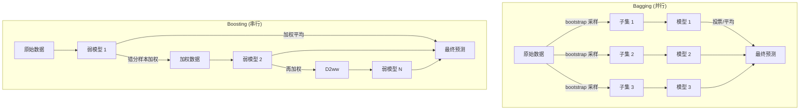

<!--
module:
  parent: computer-basics
  slug: algorithms/ensemble
  type: article
  category: 主模块子文章
  summary: 集成学习 Random Forest / XGBoost / LightGBM / CatBoost
-->

# 集成学习（Random Forest / XGBoost / LightGBM）

> ⬅️ [返回 02 算法](../README.md) | [返回 02.computer-basics](../../README.md)

> **一句话定位**：集成学习 = **多个弱学习器组合成强学习器**，**决策树的杀手锏应用**。Random Forest / XGBoost / LightGBM / CatBoost 是 2024 表格数据 SOTA。

---

## 📐 3 大集成策略

| 策略 | 原理 | 代表 |
|------|------|------|
| **Bagging** | 并行训练 + 投票 | Random Forest |
| **Boosting** | 串行训练 + 纠错 | XGBoost / LightGBM |
| **Stacking** | 多层组合 | 工业复杂场景 |

---

## 📊 4 大模型对比

| 模型 | 速度 | 准确性 | 类别 | 适用 |
|------|------|--------|------|------|
| **Random Forest** | ⚡⚡⚡ | ⭐⭐⭐ | Bagging | 快速基线 |
| **XGBoost** | ⚡⚡ | ⭐⭐⭐⭐⭐ | Boosting | SOTA 默认 |
| **LightGBM** | ⚡⚡⚡⚡⚡ | ⭐⭐⭐⭐⭐ | Boosting | 大数据 |
| **CatBoost** | ⚡⚡⚡ | ⭐⭐⭐⭐⭐ | Boosting | 类别特征多 |

---

## 🛠️ 1. Random Forest

**核心**：Bagging + 特征随机。

```python
from sklearn.ensemble import RandomForestClassifier

rf = RandomForestClassifier(
    n_estimators=100,
    max_depth=10,
    max_features='sqrt',  # 每棵树随机选 sqrt(特征数)
    random_state=42,
)
rf.fit(X_train, y_train)
```

---

## 🛠️ 2. XGBoost

**核心**：Boosting + 二阶导数 + 正则化。

```python
import xgboost as xgb

dtrain = xgb.DMatrix(X_train, label=y_train)
dtest = xgb.DMatrix(X_test, label=y_test)

params = {
    'objective': 'binary:logistic',
    'max_depth': 6,
    'eta': 0.1,         # learning rate
    'subsample': 0.8,
    'colsample_bytree': 0.8,
    'min_child_weight': 1,
    'gamma': 0,
    'lambda': 1,        # L2 正则
    'alpha': 0,         # L1 正则
}

model = xgb.train(params, dtrain, num_boost_round=1000)
pred = model.predict(dtest)
```

---

## 🛠️ 3. LightGBM

**核心**：XGBoost 加速版（直方图 + leaf-wise 生长）。

```python
import lightgbm as lgb

train_data = lgb.Dataset(X_train, label=y_train)
params = {
    'objective': 'binary',
    'num_leaves': 31,        # 比 max_depth 灵活
    'learning_rate': 0.05,
    'feature_fraction': 0.8,  # 列采样
    'bagging_fraction': 0.8,
    'bagging_freq': 5,
    'verbose': -1,
}

model = lgb.train(params, train_data, num_boost_round=1000)
```

**优势**：比 XGBoost 快 5-10x，大数据集首选。

---

## 🛠️ 4. CatBoost

**核心**：原生支持类别特征，无需手动编码。

```python
from catboost import CatBoostClassifier

model = CatBoostClassifier(
    iterations=1000,
    learning_rate=0.05,
    depth=6,
    cat_features=[0, 1, 2],  # 类别特征列索引
    verbose=200,
)
model.fit(X_train, y_train)
```

---

## 📊 4 大模型选型

```text
Q1: 数据规模？
├── 小（< 10K）→ Random Forest（基线）
├── 中（10K-1M）→ XGBoost / LightGBM
└── 大（> 1M）→ LightGBM

Q2: 类别特征多？
├── 是 → CatBoost
└── 否 → XGBoost / LightGBM

Q3: 调参时间？
├── 紧 → Random Forest（默认参数即可）
└── 充足 → XGBoost + 调参
```

---

## 🔗 兄弟章节

- **本目录**：[决策树](../decision-tree/README.md) / [SVM](../) / [AdaBoost](../)
- **02 同级**：[K-means](../clustering/k-means/README.md) / [PCA](../dimensionality-reduction/pca/README.md)
- **13.split-hairs**：[机器学习面试](../../../13.split-hairs/02.computer-basics/machine-learning/README.md)

---

## ⚠️ 反直觉

| 误区 | 真相 |
|------|------|
| ❌ 集成一定比单模型好 | ✅ 数据噪声大时集成可能过拟合 |
| ❌ LightGBM 永远比 XGBoost 快 | ✅ 小数据集差异不大 |
| ❌ CatBoost 一定要用类别特征 | ✅ 数值特征也能用 |
| ❌ 树模型不需要特征工程 | ✅ 树模型对特征工程不敏感，但好特征仍重要 |

← [返回 02 算法](../README.md)
## 4 大模型时间复杂度对比（新增列）

| 算法 | 训练复杂度 | 预测复杂度 | 可解释性 |
|------|----------|----------|----------|
| Random Forest | O(n·√d·log n) | O(√d·log n) | 中（特征重要性可读） |
| GBDT (XGBoost) | O(n·d·T·log n) | O(d·T) | 中（特征重要性可读） |
| LightGBM | O(n·d·T·log n) | O(d·T) | 中（特征重要性可读） |
| Stacking | O(n·d·K·log n) | O(d·K) | 低（多层模型） |

其中 n=样本数, d=特征数, T=树数, K=基学习器数。

## Bagging vs Boosting 流程对比（新增 Mermaid 图）



**关键差异**：
- **Bagging**：模型独立训练，**可并行**，主要减少方差
- **Boosting**：模型串行训练，**必须串行**，主要减少偏差
- **Bagging + Boosting 组合**：随机森林（Bagging）+ GBDT（Boosting）是工业界主流
