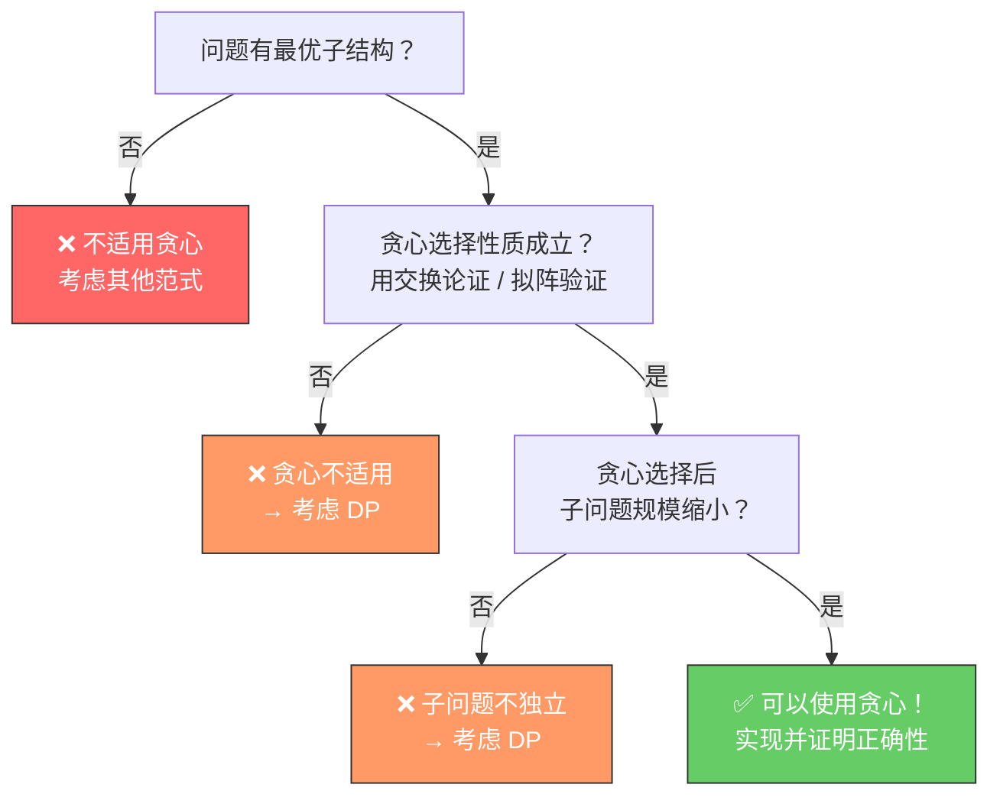

<!--
module:
  parent: algorithms
  slug: algorithms/greedy-algorithms
  type: deep-dive
  category: 贪心算法
  summary: 贪心算法——每步选局部最优解的算法设计策略，核心在于证明贪心选择性质与最优子结构，本文覆盖原理、证明、6 大经典问题、5 大反模式与工业应用。
-->

# 贪心算法 · 深度原理（局部最优 → 全局最优）

> **一句话答案**：贪心算法在每一步都选择**局部最优解**，期望最终得到**全局最优解**——关键在于证明**贪心选择性质**和**最优子结构**。

← [返回: algorithms 总目录](../README.md) · 面试题：[13.split-hairs 贪心算法](../../../13.split-hairs/02.computer-basics/greedy-algorithms/README.md) · 相关：[字符串算法](../string-algorithms/README.md)

---

## 0. 核心速查

| 维度 | 贪心（Greedy） | 动态规划（DP） | 回溯（Backtracking） | 分治（Divide & Conquer） |
|------|---------------|---------------|---------------------|------------------------|
| 适用条件 | 贪心选择性质 + 最优子结构 | 最优子结构 + 重叠子问题 | 约束满足问题 | 可分解为独立子问题 |
| 时间复杂度 | 通常 O(n log n) | 通常 O(n²) 或更高 | 指数级（可剪枝优化） | O(n log n) |
| 是否回溯 | ❌ 不回头 | ❌ 不回头（记忆化） | ✅ 回溯试探 | ❌ 不回头 |
| 正确性保证 | 需证明贪心性质 | 自动（子问题递推） | 自动（完全枚举） | 自动（合并正确性） |
| 典型问题 | 区间调度 / Huffman / Dijkstra | 背包 / LCS / 编辑距离 | N 皇后 / 全排列 / 数独 | 快排 / 归并 / FFT |

---

## 一、核心思想

### 1.1 贪心选择性质（Greedy Choice Property）

**定义**：全局最优解可以通过一系列**局部最优选择**构造——每一步做出的选择看起来最优，且这个选择**不需要依赖子问题的解**。

与 DP 的关键区别：

- **贪心**：做选择时**不回头**，选择后问题规模缩小，继续贪心。
- **DP**：枚举所有可能的子问题组合，通过状态转移方程选出全局最优。

> 💡 **直觉**：如果一个问题"每步都做当前最好的选择，最终结果也是最好的"，那它就适合贪心。

### 1.2 最优子结构（Optimal Substructure）

**定义**：问题的最优解**包含**其子问题的最优解。

贪心和 DP 都需要最优子结构，但贪心的要求更严格——不仅要子问题最优，还要**第一步贪心选择一定在某个最优解中**。

### 1.3 拟阵理论（Matroid Theory）简介

拟阵是贪心算法正确性的**数学保证**：

- **拟阵** = (有限集 E, 独立集族 I)，满足：
  1. 空集是独立集
  2. 独立集的子集也是独立集（遗传性）
  3. 若 |A| < |B| 且 A、B 都是独立集，则存在 e ∈ B - A 使得 A ∪ {e} 也是独立集（交换性）

- **核心定理**：如果问题构成拟阵，贪心算法**一定**得到最优解。
- **经典例子**：最小生成树问题构成图拟阵（Graphic Matroid）→ Kruskal / Prim 算法一定正确。

---

## 二、正确性证明方法

### 2.1 交换论证（Exchange Argument）

最常用的贪心正确性证明方法：

1. 假设存在最优解 O
2. 构造贪心解 G
3. 逐步将 O 中的元素替换为 G 中的元素，证明**代价不增加**
4. 最终 O 变成了 G，而代价没有增加 → G 也是最优解

**例子**：区间调度问题——假设最优解 O 没有选最早结束的活动 a，用 a 替换 O 中第一个与 a 冲突的活动，结束时间更早，不会引入新冲突。

### 2.2 归纳法

对问题规模做数学归纳：

- **基础步**：规模 n=1 时贪心选择显然最优
- **归纳步**：假设规模 < n 时贪心正确。对于规模 n，证明贪心第一步选择包含在某个最优解中，剩余子问题规模 < n，由归纳假设贪心正确

### 2.3 反证法

假设贪心解 G 不是最优 → 存在更优解 O → 比较 G 和 O 的第一个不同选择 → 推出矛盾（G 的选择应该不差于 O 的选择）。

---

## 三、6 大经典问题

| # | 问题 | 贪心策略 | 时间复杂度 |
|---|------|---------|-----------|
| 1 | 区间调度（Activity Selection） | 按结束时间排序，每次选最早结束且不冲突的 | O(n log n) |
| 2 | Huffman 编码 | 每次合并频率最小的两个节点 | O(n log n) |
| 3 | Dijkstra 最短路径 | 每次选距离源点最近的未访问节点 | O((V+E) log V) |
| 4 | Kruskal 最小生成树 | 按边权排序，不形成环就加边 | O(E log E) |
| 5 | Prim 最小生成树 | 每次选连接已访问/未访问集合的最小边 | O((V+E) log V) |
| 6 | 分数背包（Fractional Knapsack） | 按单位价值排序，贪心装入 | O(n log n) |

### 3.1 区间调度（Activity Selection）

**问题**：给定 n 个活动（每个有开始和结束时间），选最多互不冲突的活动。

**贪心策略**：按结束时间升序排列，从第一个开始，每次选结束最早且与已选不冲突的。

**为什么正确**：最早结束的活动给后续留下最多空间——交换论证可证。

```java
// 按结束时间排序后
List<Activity> selected = new ArrayList<>();
selected.add(activities[0]);
int lastEnd = activities[0].end;
for (int i = 1; i < n; i++) {
    if (activities[i].start >= lastEnd) {
        selected.add(activities[i]);
        lastEnd = activities[i].end;
    }
}
```

### 3.2 Huffman 编码

**问题**：给定字符频率，构造前缀编码使总编码长度最短。

**贪心策略**：用最小堆，每次取出频率最小的两个节点合并为新节点，放回堆中，重复直到只剩一个节点。

**为什么正确**：频率最低的字符应该在编码树的最深层，且互为兄弟——交换论证可证。

### 3.3 Dijkstra 最短路径

**问题**：单源最短路径（非负权图）。

**贪心策略**：维护"已知最短距离"集合 S，每次从未访问节点中选距离最小的加入 S，松弛其邻居。

**为什么正确**：非负权保证已确定的最短距离不会被后续路径更新——反证法可证。

### 3.4 Kruskal 最小生成树

**问题**：找连接所有顶点的边权之和最小的树。

**贪心策略**：边按权值排序，从小到大加边，用并查集检测环，形成环则跳过。

**为什么正确**：图拟阵保证——Cut Property：横跨任意割的最小边一定在 MST 中。

### 3.5 Prim 最小生成树

**贪心策略**：从任意顶点开始，每次选连接已访问集和未访问集的最小权边。

**为什么正确**：与 Kruskal 共享 Cut Property 证明。

### 3.6 分数背包（Fractional Knapsack）

**问题**：物品可分割，背包容量有限，最大化总价值。

**贪心策略**：按单位价值（价值/重量）降序排列，依次装满，最后一个物品可能只取一部分。

**为什么正确**：单位价值最高的物品优先装不会更差——交换论证直接可证。

---

## 四、贪心失效的 5 大反模式

| # | 反模式 | 看似贪心 | 为什么失败 | 正确方法 |
|---|--------|---------|-----------|---------|
| 1 | 0-1 背包 | 按单位价值装 | 物品不可分割 → 局部最优 ≠ 全局最优 | DP |
| 2 | 找零问题（特定面值） | 每次选最大面值 | 特定面值组合贪心不最优 | DP |
| 3 | TSP 最近邻 | 每次去最近城市 | 最后可能被迫走很远 | DP / 近似算法 |
| 4 | 图着色 | 每次选最小可用颜色 | 不能保证用最少颜色 | 回溯 / 启发式 |
| 5 | 最长路径 | 每次选最长相邻 | NP-hard，贪心无法保证 | DP（DAG）/ 回溯 |

**1. 0-1 背包**：容量 W=10，物品 A(v=6,w=5)、B(v=5,w=4)、C(v=5,w=4)。按单位价值 A 最高先装 A，剩余容量 5 只能再装 B 或 C，总价值 11。但最优是 B+C=10，恰好装满，价值 10。若改为 A(v=6,w=6) 则贪心装 A 得 6，而 B+C=10。

**2. 找零问题**：面值 {1, 3, 4}，找 6 元。贪心选 4+1+1=3 枚，最优是 3+3=2 枚。

**3. TSP 最近邻**：4 城市正方形布局，从左上角开始最近邻可能走 Z 字形，最后被迫走对角线长路。

**4. 图着色**：完全二部图 K_{n,n}，按特定顶点顺序贪心可能用 n 种颜色，实际只需 2 种。

**5. 最长路径**：图中从 A 出发，贪心走最长相邻边可能进入死胡同，错过真正的最长路径。

---

## 五、工业应用 5 大场景

| 场景 | 贪心策略 | 工业案例 |
|------|---------|---------|
| 任务调度 | EDF（最早截止优先） | OS 实时调度（Linux SCHED_FIFO） |
| 网络路由 | 最短路径（Dijkstra） | OSPF / IS-IS 协议 |
| 数据压缩 | Huffman 编码 | gzip / DEFLATE / JPEG |
| CDN 缓存 | LRU / LFU 替换 | Redis / Nginx / Varnish |
| 负载均衡 | 最少连接 / 加权轮询 | Nginx / HAProxy / AWS ALB |

**任务调度**：实时系统中，EDF（Earliest Deadline First）在单处理器上可以证明是最优的——如果有可行调度，EDF 一定能找到。

**网络路由**：OSPF 协议内部运行 Dijkstra 算法计算最短路径树，每个路由器以自己为根计算到所有目的地的最短路径。

**数据压缩**：gzip 使用 DEFLATE 算法 = LZ77 + Huffman 编码。Huffman 部分就是贪心构造最优前缀码。

---

## 六、与 DP / 回溯 / 分治的对比

| 维度 | 贪心 | DP | 回溯 | 分治 |
|------|------|----|----|------|
| 选择策略 | 局部最优 | 枚举子问题 | 枚举 + 剪枝 | 分割 + 合并 |
| 是否回溯 | 否 | 否（记忆化） | 是 | 否 |
| 时间复杂度 | 通常 O(n log n) | 通常 O(n²) 或更高 | 指数级 | O(n log n) |
| 正确性保证 | 需证明贪心性质 | 自动（子问题递推） | 自动（完全枚举） | 自动（合并正确性） |
| 空间复杂度 | 通常 O(1) ~ O(n) | O(n) ~ O(n²) | O(递归深度) | O(递归深度) |
| 实现难度 | 简单（证明难） | 中等（状态设计） | 中等（剪枝设计） | 中等（合并逻辑） |
| 典型问题 | 区间调度 / Huffman / Dijkstra | 背包 / LCS / 编辑距离 | N 皇后 / 全排列 | 快排 / 归并 / FFT |

---

## 七、判断贪心是否适用的决策树



**快速判断口诀**：
1. 先试贪心 → 找反例
2. 找不到反例 → 尝试交换论证证明
3. 证明通过 → 贪心可行
4. 证明失败 → 考虑 DP

---

## 八、相关章节

- 上游：[`02-algorithms`](../README.md) — 算法总览（分类 / 排序 / 查找）
- 同级：[`string-algorithms`](../string-algorithms/README.md) — 字符串算法 3 大深度
- 关联：[`complexity`](../complexity/) — 时间 / 空间复杂度分析
- 面试深挖：[`13.split-hairs 贪心算法`](../../../13.split-hairs/02.computer-basics/greedy-algorithms/README.md)
- 关联：[`04.system-design`](../../../04.system-design/README.md) — 算法在系统设计中的应用

---

## 📊 本节统计

| 统计维度 | 数值 | 口径 |
|----------|------|------|
| 经典问题 | 6 | 区间调度 / Huffman / Dijkstra / Kruskal / Prim / 分数背包 |
| 反模式 | 5 | 0-1 背包 / 特定面值找零 / TSP 最近邻 / 图着色 / 最长路径 |
| 工业应用 | 5 | 任务调度 / 网络路由 / 数据压缩 / CDN 缓存 / 负载均衡 |

> **统计时间戳**：2026-07-14

---

← [返回 algorithms 总目录](../README.md)
