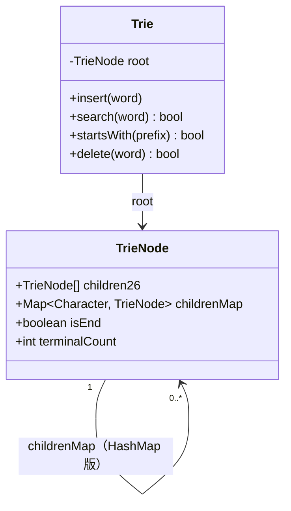
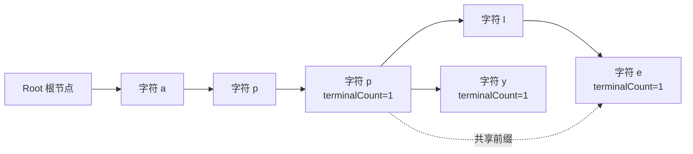

<!--
module:
  parent: algorithms/string-algorithms
  slug: algorithms/string-algorithms/01-trie
  type: topic
  category: Trie 字典树
  summary: Trie 数据结构 —— Java 数组实现 + HashMap 实现 + 自动补全实战
-->

# Trie（字典树）· 完整实现

> **一句话**：Trie 是**为前缀查询优化的树**——插入 / 查 O(len)，与字典大小无关。Java 实现 50 行（数组版）或 80 行（HashMap 版）。

← [返回: string-algorithms 总目录](../README.md)

---

## 1. Trie 节点设计

### 1.1 数组实现（紧凑 + 快速）

```java
class TrieNode {
    // 子节点（26 个英文字母 / 数组下标表示字符）
    TrieNode[] children = new TrieNode[26];
    // 是否单词结尾
    boolean isEnd = false;
}
```

**优点**：访问 O(1) 数组下标，速度最快
**缺点**：固定字符集（修改字符集需重写）

### 1.2 HashMap 实现（灵活）

```java
class TrieNode {
    Map<Character, TrieNode> children = new HashMap<>();
    boolean isEnd = false;
}
```

**优点**：支持任意字符集（中文 / Unicode）
**缺点**：HashMap 访问稍慢

### 1.3 紧凑版（生产推荐）

```java
class TrieNode {
    Map<Character, TrieNode> children = new HashMap<>();
    boolean isEnd;
    // 计数（统计频次 / 自动补全排序用）
    int count;
}
```

### 1.4 节点结构图：共享前缀如何落到节点

Trie 的根节点不代表任何字符，只负责保存第一层入口；真正的单词从根向下的一条路径表示。`isEnd` 必须放在节点上，而不是边上，因为 `app` 既可能是完整单词，也可能只是 `apple` 的前缀。



> `children26` 与 `childrenMap` 是两种互斥的子节点表示，不应在同一个生产节点里同时分配。`terminalCount` 比单独的 `isEnd` 多表达一层语义：重复插入同一个词时可以按次数删除；`terminalCount > 0` 等价于 `isEnd = true`。



上图插入 `app`、`apple`、`apply` 后，`app` 节点同时是一个终点和两个更长单词的分叉点。查询 `app` 不能因为它还有子节点就返回 false；删除 `app` 也不能把 `a-p-p` 节点直接剪掉，否则会误删 `apple` 和 `apply`。

| 选择 | 子节点表达 | 单次转移 | 空间特征 | 适合场景 |
|------|-----------|---------|---------|----------|
| 数组版 | `children[26]`，字符映射到 `0..25` | O(1) | 每个节点预留 26 个引用，稀疏节点浪费明显 | 仅小写英文、极致吞吐、AC 自动机 |
| HashMap 版 | `Map<Character, Node>` | 平均 O(1) | 只为实际存在的边分配，节点对象和哈希表有额外开销 | 中文、Unicode、字符集动态变化 |
| 压缩版 | radix edge / Double-Array Trie | 近似 O(1) | 合并单分支路径，构建复杂但内存更低 | 只读大词典、服务启动后不频繁修改 |

一个容易忽略的空间公式是：数组版空间约为 `节点数 × 26 × 引用大小`，并不是 `词条总长度`；HashMap 版空间约为“实际边数 + 每个节点的对象/桶开销”。因此“数组访问快”不等于“数组版总是更省内存”。

---

## 2. Trie 完整实现（HashMap 版 / Java）

```java
public class Trie {
    private TrieNode root = new TrieNode();
    
    /** 插入 */
    public void insert(String word) {
        TrieNode node = root;
        for (char c : word.toCharArray()) {
            node.children.putIfAbsent(c, new TrieNode());
            node = node.children.get(c);
        }
        node.isEnd = true;
        node.count++;
    }
    
    /** 查询精确词是否存在 */
    public boolean search(String word) {
        TrieNode node = root;
        for (char c : word.toCharArray()) {
            node = node.children.get(c);
            if (node == null) return false;
        }
        return node.isEnd;
    }
    
    /** 前缀匹配（是否存在以 prefix 开头的词）*/
    public boolean startsWith(String prefix) {
        TrieNode node = root;
        for (char c : prefix.toCharArray()) {
            node = node.children.get(c);
            if (node == null) return false;
        }
        return true;
    }
    
    /** 前缀查询所有词（自动补全用）*/
    public List<String> getWordsWithPrefix(String prefix) {
        List<String> result = new ArrayList<>();
        TrieNode node = root;
        for (char c : prefix.toCharArray()) {
            node = node.children.get(c);
            if (node == null) return result;
        }
        // DFS 收集所有以 prefix 开头的词
        dfs(node, prefix, result);
        return result;
    }
    
    private void dfs(TrieNode node, String path, List<String> result) {
        if (node.isEnd) {
            result.add(path);
        }
        for (Map.Entry<Character, TrieNode> e : node.children.entrySet()) {
            dfs(e.getValue(), path + e.getKey(), result);
        }
    }
}
```

---

## 3. Trie 应用场景

### 3.1 自动补全（搜索框 / IDE）

```java
// 搜索 "app" 时，建议 ["app", "apple", "apply", "applet"]
List<String> suggestions = trie.getWordsWithPrefix("app");
```

### 3.2 词频统计（搜索热词）

```java
// 插入时累加 count
trie.insert("搜索");
trie.insert("搜索");
trie.insert("搜索");  // count=3
```

### 3.3 IP 路由最长前缀匹配

```java
// IP 路由表存储在 Trie 中，查询时沿 Trie 走到最深
// 这是 Linux 内核 FIB 的核心
```

### 3.4 敏感词过滤（AC 自动机前置）

```java
// 先用 Trie 存所有敏感词
// 然后构建 fail 指针 → AC 自动机
```

---

## 4. 复杂度分析

| 操作 | 时间复杂度 | 空间复杂度 |
|------|-----------|-----------|
| 插入 | O(len(word)) | O(len) |
| 查询精确词 | O(len(word)) | - |
| 前缀查询 | O(len(prefix)) | - |
| 自动补全（前缀 + 所有词）| O(len + 匹配的词数) | - |
| 总空间 | - | O(Σ × N) |

**关键**：查找时间**与字典大小无关**，仅与 word 长度相关。

---

## 5. 反模式 · 5 个常见错

### ⚠️ 反模式 1：用 HashMap 嵌套 HashMap 而不是 Trie

```java
// 错：N 层 HashMap 嵌套，可读性差 + 内存浪费
Map<Character, Map<Character, Map<Character, Boolean>>> bad;
```

### ⚠️ 反模式 2：用 List 存子节点而非数组/HashMap

```java
// 错：List<TrieNode> 查找 O(n) 每个字符
List<TrieNode> children;  // ❌
```

### ⚠️ 反模式 3：忘记删除逻辑（生产环境必然需要）

```java
// 错：只能 insert 不能 delete
trie.delete(word);  // 抛 UnsupportedOperationException
```

### ⚠️ 反模式 4：忽略 Unicode / 中文

```java
// 错：用 charAt(index) 假设字符
char c = word.charAt(i);  // 中文可能 surrogate pair 出错

// 对：用 codePoint
int cp = word.codePointAt(i);
```

### ⚠️ 反模式 5：存储太多无意义节点

```java
// 错：每个字符一个 Node，10 万词典 60-80 MB 内存
// 对：双数组 Trie（DoubleArrayTrie）：压缩到几 MB
```

---

## 6. 一句话总结

> **Trie 是前缀树——查找 O(len(word)) 与字典大小无关，Java 50 行实现；自动补全 / 词频统计 / IP 路由 / AC 自动机基础都用它。**

---

← [返回: string-algorithms 总目录](../README.md) · 下一章：[02-kmp-algorithm](02-kmp-algorithm.md)
