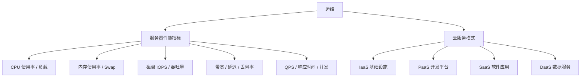

# 运维

> 服务器性能监控与云计算服务模型，保障系统稳定运行与架构选型。

---
## 引言：反直觉代码（[AUTO] 自动生成，待人工 review）

运维 本应该很简单，服务器性能监控与云计算服务模型，保障系统稳定运行与架构选型

**但实际**：面试/生产中常被问起或踩坑的是——
代码看着对、跑起来对，但仔细一问深一层就漏馅。本篇就从'反直觉'这个角度切入，把踩坑点和根因摆出来。

> 📌 本段由 `note/scripts/add-intro.py` 自动生成（场景模板 + README 摘录）。**下次 review 时请改为真实场景 + 数字 + 反思**，目前仅满足'有引言'的最低要求。

---

## 1. 模块导航

| 序号 | 主题 | 核心内容 | 子 README |
|------|------|---------|-----------|
| 01 | [服务器性能指标](server-metrics/) | CPU / 内存 / 磁盘 I/O / 网络 / QPS 响应时间 | [README](server-metrics/README.md) |
| 02 | [云服务模式](cloud-services/) | IaaS / PaaS / SaaS / DaaS 四大服务模型 | [README](cloud-services/README.md) |

### 1.1 学习路径
- **入门**：云服务模式 → 了解 IaaS/PaaS/SaaS 分层
- **进阶**：服务器性能指标 → 掌握监控维度与优化手段

---

## 2. 知识脉络

---

## 3. 速查表

| 概念 | 解释 | 典型场景 |
|------|------|---------|
| **IOPS** | 每秒磁盘读写次数 | 数据库/日志等高 I/O 场景 |
| **Load Average** | 系统平均负载，等待 CPU 的进程数 | 判断服务器是否过载 |
| **Swap 使用率** | 虚拟内存占比，理想值为 0 | 物理内存不足的预警信号 |
| **丢包率** | 传输中丢失数据包比例 | 网络质量诊断，关键业务需 <0.1% |
| **QPS/TPS** | 每秒查询/事务数 | 系统吞吐量基准测试 |
| **IaaS** | 基础设施即服务，提供虚拟机/存储/网络 | 需要完全控制底层环境 |
| **PaaS** | 平台即服务，提供开发/部署平台 | 快速开发应用，专注业务逻辑 |
| **SaaS** | 软件即服务，直接可用的软件应用 | 企业办公/CRM/协作工具 |
| **DaaS** | 数据即服务，通过 API 提供数据能力 | 数据分析/风控/推荐系统 |

---

## 4. 核心内容

### 4.1 服务器性能指标

系统监控覆盖六个维度：CPU（使用率/负载）、内存（使用率/Swap）、磁盘 I/O（IOPS/吞吐量/利用率）、网络（带宽/延迟/丢包率）、综合指标（QPS/TPS/响应时间/并发连接），以及基准测试与监控工具选型（Prometheus/Grafana/Zabbix）。

### 4.2 云服务模式

云计算四大服务模型按用户责任从下到上递增：IaaS（用户管理 OS 及以上）→ PaaS（用户只管应用）→ SaaS（用户只管使用）→ DaaS（聚焦数据价值）。企业可根据控制需求、开发效率和成本预算组合选择。

---

## 5. 最佳实践

- **监控先行**：先设定合理阈值（CPU 80%、内存 80%、带宽 80%），再谈优化
- **分层选型**：需要完全控制选 IaaS，追求开发效率选 PaaS，开箱即用选 SaaS
- **工具组合**：开源 Prometheus + Grafana 适合中小团队，Datadog/New Relic 适合企业级

---

## 6. 常见面试题

- CPU 使用率和 Load Average 有什么区别？
- Swap 使用率高说明什么问题？如何排查？
- IaaS、PaaS、SaaS 的核心区别是什么？各举一例
- 如何判断服务器性能瓶颈在哪个维度？

---

## 7. 相关章节

- 上游：[`计算机基础`](../README.md)
- 关联：[`03-linux`](../03-linux/) — Linux 命令是运维操作的基础
- 关联：[`01-network`](../01-network/) — 网络指标（延迟/丢包）依赖协议知识

---
