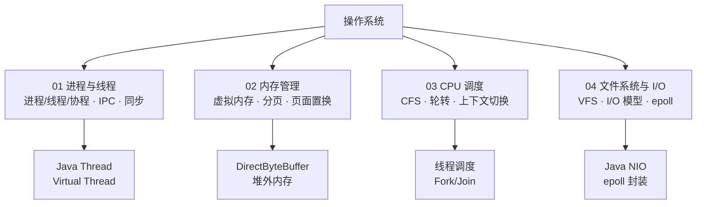

<!--
module:
  parent: computer-basics
  slug: computer-basics/06-operating-system
  type: index
  category: 主模块子文章
  summary: 操作系统核心原理：进程管理、内存管理、CPU 调度、文件系统与 I/O 模型。
-->

# 操作系统基础

> 操作系统是计算机系统的核心软件，负责管理硬件资源、提供系统调用接口，并为上层应用提供运行环境。

---

## 一、操作系统核心职责

操作系统承担三大核心职责：

| 职责 | 说明 | 核心机制 |
|------|------|---------|
| **资源管理** | 管理 CPU、内存、磁盘、网络等硬件资源 | 调度算法、内存分配、I/O 调度 |
| **抽象硬件** | 将复杂的硬件操作封装为简洁的抽象接口 | 进程/文件/虚拟内存等抽象 |
| **提供系统调用** | 为用户态程序提供访问内核功能的接口 | POSIX API、Linux syscall |

```
┌─────────────────────────────────────┐
│           用户应用程序                │
│    (Java / Python / C / ...)       │
├─────────────────────────────────────┤
│           Shell / 工具链            │
├─────────────────────────────────────┤
│          系统调用接口 (API)          │
│   fork() / exec() / read() / mmap()│
├─────────────────────────────────────┤
│            操作系统内核              │
│  ┌─────────┬──────────┬──────────┐ │
│  │ 进程管理 │ 内存管理  │ 文件系统 │ │
│  ├─────────┼──────────┼──────────┤ │
│  │ 调度器  │ 页表/TLB  │ VFS/inode│ │
│  └─────────┴──────────┴──────────┘ │
├─────────────────────────────────────┤
│           硬件抽象层 (HAL)          │
├─────────────────────────────────────┤
│     CPU / 内存 / 磁盘 / 网卡       │
└─────────────────────────────────────┘
```

### 1.1 用户态 vs 内核态

CPU 运行在两个特权级别（Ring），操作系统通过特权级隔离保护硬件资源：

| 维度 | 用户态 (User Mode, Ring 3) | 内核态 (Kernel Mode, Ring 0) |
|------|--------------------------|----------------------------|
| **权限** | 受限（不能访问硬件、不能执行特权指令） | 完全（可访问所有硬件和指令） |
| **地址空间** | 只能访问用户空间（低 128 TB） | 可访问全部地址空间 |
| **崩溃影响** | 仅当前进程崩溃 | 内核崩溃 → 系统宕机（Kernel Panic） |
| **运行代码** | 应用程序代码 | 内核代码 + 系统调用处理 + 中断处理 |

```
用户态 ────────────────────────────── 内核态
(Ring 3)                            (Ring 0)

应用程序 ──系统调用──► trap ──► 内核处理 ──► iret ──► 返回用户态
           (syscall)        (执行特权操作)         (回到用户代码)

触发内核态的 3 种方式:
  1. 系统调用 (syscall)     ← 主动、预期内
  2. 中断 (interrupt)       ← 硬件触发（时钟中断、I/O 完成）
  3. 异常 (exception)       ← 执行异常（缺页、除零、非法指令）
```

> **系统调用的开销**：每次 syscall 涉及用户态→内核态切换（保存/恢复寄存器 + TLB 不刷新但有流水线开销），约 100~500 个时钟周期。高频 syscall（如 `gettimeofday()`）已被 **vDSO**（virtual dynamic shared object）优化为用户态直接读取。

---

### 1.2 系统调用分类速查

| 类别 | 常用系统调用 | 说明 |
|------|------------|------|
| **进程** | `fork()`, `exec()`, `wait()`, `exit()` | 进程创建/执行/等待/退出 |
| **文件** | `open()`, `read()`, `write()`, `close()`, `lseek()` | 文件基本操作 |
| **内存** | `mmap()`, `munmap()`, `brk()`, `mprotect()` | 内存映射/保护 |
| **网络** | `socket()`, `bind()`, `listen()`, `accept()`, `connect()` | 网络通信 |
| **信号** | `kill()`, `signal()`, `sigaction()` | 进程间信号通信 |
| **I/O 复用** | `select()`, `poll()`, `epoll_create()`, `epoll_wait()` | 多路复用 |

---

## 二、子文章导航

| 序号 | 主题 | 核心内容 | 子 README |
|:----:|------|---------|-----------|
| 01 | [进程与线程](processes/) | 进程/线程/协程 · 进程状态 · IPC · 线程同步 | [processes/README](processes/README.md) |
| 02 | [内存管理](memory/) | 虚拟内存 · 分页/分段 · 页表/TLB · 页面置换 | [memory/README](memory/README.md) |
| 03 | [CPU 调度](scheduling/) | 调度算法 · Linux CFS · 上下文切换 · CPU 亲和性 | [scheduling/README](scheduling/README.md) |
| 04 | [文件系统与 I/O](filesystem/) | VFS/inode · 文件描述符 · I/O 模型 · epoll | [filesystem/README](filesystem/README.md) |

---

## 三、知识脉络



---

## 四、核心概念速查表

| 概念 | 核心要点 | 典型场景 |
|------|---------|---------|
| **进程** | 资源分配的最小单位，拥有独立地址空间 | 每个 Java 应用是一个 JVM 进程 |
| **线程** | CPU 调度的最小单位，共享进程地址空间 | Java Thread / Virtual Thread |
| **虚拟内存** | 每个进程拥有独立的虚拟地址空间（32 位: 4GB / 64 位: 256TB） | 内存隔离 + 超量使用 |
| **分页** | 将虚拟内存和物理内存都划分为固定大小的页（通常 4KB） | 按需加载 + 页面置换 |
| **系统调用** | 用户态 → 内核态的受控入口（int 0x80 / syscall） | read() / write() / fork() |
| **I/O 多路复用** | 单线程监控多个 I/O 事件 | epoll / select / poll |
| **上下文切换** | CPU 从一个进程/线程切换到另一个的开销 | 线程过多 → 性能下降 |

---

## 五、学习路径

- **新人入门**：进程与线程 → 内存管理 → CPU 调度 → 文件系统（建立 OS 全景认知）
- **Java 开发者**：进程与线程（Thread 映射）→ 内存管理（堆外内存）→ 文件系统（NIO 关系）
- **面试冲刺**：进程与线程（状态机 + IPC）→ I/O 模型（BIO/NIO/AIO）→ 页面置换（LRU）
- **运维/SRE**：CPU 调度（CFS + 亲和性）→ 文件系统（inode + page cache）→ 内存管理（mmap）

---

## 六、与 Java 的关联

操作系统原理直接影响 Java 应用的运行行为：

| OS 概念 | Java 映射 | 影响 |
|---------|----------|------|
| 进程 | JVM 进程（一个 `java` 命令） | 内存上限、GC 行为 |
| 线程 | `java.lang.Thread` / Virtual Thread (Loom) | 并发模型选择 |
| 虚拟内存 | JVM 堆 + 堆外内存（DirectByteBuffer） | OOM 排查 |
| 文件描述符 | `FileInputStream` / `SocketChannel` | FD 泄漏问题 |
| I/O 多路复用 | `Selector`（Java NIO） | Netty/高性能网络编程 |
| CPU 调度 | Fork/Join Pool、线程池参数调优 | 吞吐量优化 |

---

## 七、高频面试题导航

> 以下汇总操作系统方向最常见的面试题，详细解答见各子文章。

| 问题 | 答案要点 | 详见 |
|------|---------|------|
| 进程和线程的区别？ | 资源分配 vs CPU 调度；独立地址空间 vs 共享 | [进程与线程](processes/) §一 |
| 什么是虚拟内存？ | 每个进程独立虚拟地址空间，通过页表映射物理内存 | [内存管理](memory/) §一 |
| BIO/NIO/AIO 的区别？ | 阻塞同步 / 非阻塞同步（多路复用）/ 非阻塞异步 | [文件系统与 I/O](filesystem/) §四 |
| 什么是上下文切换？ | CPU 切换进程/线程的开销（寄存器/页表/TLB/缓存） | [CPU 调度](scheduling/) §四 |
| 进程有哪些状态？ | 新建→就绪→运行→阻塞→终止（五状态模型） | [进程与线程](processes/) §二 |
| LRU 页面置换算法？ | 淘汰最久未访问的页；Clock 是其近似实现 | [内存管理](memory/) §四 |
| epoll 比 select 好在哪？ | O(1) 通知（只返回就绪 FD）、无 1024 限制、支持 ET | [文件系统与 I/O](filesystem/) §五 |
| 用户态和内核态的区别？ | Ring 3 vs Ring 0；通过 syscall 切换 | 本文 §一.1 |

---

## 八、相关章节

- 上游：[`02.computer-basics`](../README.md) — 计算机基础主模块
- 关联：[`01.java/concurrency`](../../01.java/concurrency/) — Java 并发编程（线程/锁/线程池）
- 关联：[`01.java/jvm`](../../01.java/jvm/) — JVM 内存模型与 GC
- 关联：[`04.system-design/04-high-performance`](../../04.system-design/04-high-performance/) — 系统设计高性能（I/O 模型选型）
- 关联：[`03.database`](../../03.database/) — 数据库（存储引擎依赖文件系统）

---

## 九、开源参考

| 项目 | 说明 | 链接 |
|------|------|------|
| **Linux Kernel** | Linux 内核源码（调度/内存/VFS 实现） | [kernel.org](https://kernel.org) |
| **xv6** | MIT 教学操作系统（精简版 Unix V6） | [github.com/mit-pdos/xv6-public](https://github.com/mit-pdos/xv6-public) |
| **OSTEP** | Operating Systems: Three Easy Pieces（经典教材） | [pages.cs.wisc.edu/~remzi/OSTEP](https://pages.cs.wisc.edu/~remzi/OSTEP/) |
| **The Linux Programming Interface** | Linux 系统编程权威参考 | [man7.org/tlpi](https://man7.org/tlpi/) |

---

## 📊 本节统计

| 统计维度 | 数值 | 口径 |
|----------|------|------|
| 子文章数 | 4 | processes / memory / scheduling / filesystem |
| 子 README 数 | 5 | 含本 index + 4 个子文章 README |
| 含 frontmatter 的 README | 5 / 5 | 100% 覆盖（2026-07-16） |

> **统计时间戳**：2026-07-16

---

← [返回 02.computer-basics 主模块](../README.md)
