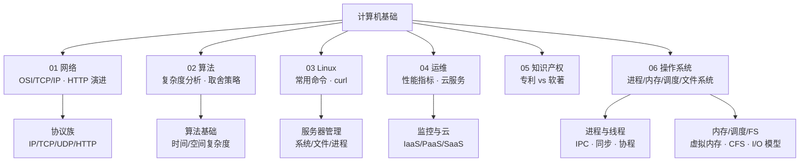

<!--
module:
  number: 02
  slug: computer-basics
  topic: 计算机基础
  audience: 工程师 / SRE / 学生
  category: 主模块
  summary: 系统性整理计算机科学基础知识，涵盖网络、算法、系统运维、知识产权等核心领域。
-->

# 计算机基础

> 系统性整理计算机科学基础知识，涵盖网络、算法、系统运维、知识产权等核心领域。

---

## 📚 目录导航

| 序号 | 分类 | 核心内容 | 子 README |
|:----:|------|---------|-----------|
| 01 | [网络](01-network/) | OSI/TCP/IP 模型 · 协议族 · HTTP 演进 · WCAG | [01-network/README](01-network/README.md) |
| 02 | [算法](02-algorithms/) | 算法概述 · 时间/空间复杂度 · 取舍策略 | [02-algorithms/README](02-algorithms/README.md) |
| 03 | [Linux](03-linux/) | 常用命令 · curl 详解 | [03-linux/README](03-linux/README.md) |
| 04 | [运维](04-operations/) | 服务器性能指标 · 云服务模式 | [04-operations/README](04-operations/README.md) |
| 05 | [知识产权](05-ipr/) | 专利 vs 软件著作权 | [05-ipr/README](05-ipr/README.md) |
| 06 | [操作系统](06-operating-system/) | 进程/线程 · 内存管理 · CPU 调度 · 文件系统/I/O | [06-operating-system/README](06-operating-system/README.md) |

---

## 🎯 适用人群

- **后端 / 全栈工程师**：网络协议、Linux 命令、性能监控是日常基础
- **运维 / SRE**：服务器指标、云服务选型、生产故障排查
- **求职 / 在校生**：算法复杂度、TCP/IP 模型、HTTP 演进是高频面试题
- **创业者 / 独立开发者**：知识产权保护（专利与软著的差异与申请策略）

---

## 🧭 学习路径

- **新人入门**：网络 → 算法 → Linux → 操作系统（搭建"日常开发 + 面试"基础底盘）
- **运维方向**：Linux → 运维 → 操作系统（文件系统/I/O） → 网络（深入协议栈与监控指标）
- **求职冲刺**：算法（复杂度 + 经典案例）→ 网络（TCP/HTTP/DNS）→ 操作系统（进程/内存/I/O 模型）→ 知识产权（开放题）
- **速查定位**：按需查阅各分类 README 速查表

---

## 🗺️ 知识脉络

---

## 📊 速查表

| 概念 | 核心要点 | 典型场景 |
|------|---------|---------|
| **OSI 七层** | 物理→数据链路→网络→传输→会话→表示→应用 | 网络故障分层排查 |
| **TCP/IP 四层** | 网络接口→网际→传输→应用 | 实际互联网通信 |
| **TCP 三次握手** | SYN → SYN+ACK → ACK，建立可靠连接 | HTTP 连接建立 |
| **TCP 四次挥手** | FIN → ACK → FIN → ACK，TIME_WAIT 2MSL | 连接释放 |
| **HTTP vs HTTPS** | HTTPS = HTTP + TLS，端口 443 vs 80 | 安全传输 |
| **HTTP/2 特性** | 多路复用、头部压缩、服务器推送 | 高性能 Web |
| **HTTP/3 (QUIC)** | 基于 UDP，0-RTT，解决队头阻塞 | 移动端弱网 |
| **时间复杂度** | O(1) < O(log n) < O(n) < O(n log n) < O(n²) | 算法效率评估 |
| **Linux 权限** | rwx (4+2+1)，chmod/chown/ugo | 文件安全 |
| **IaaS/PaaS/SaaS** | 基础设施/平台/软件即服务 | 云服务选型 |
| **进程 vs 线程** | 资源分配单位 vs CPU 调度单位；地址空间独立 vs 共享 | 并发编程 |
| **虚拟内存** | 每个进程独立虚拟地址空间，通过页表映射物理内存 | 内存隔离 + 按需加载 |
| **I/O 多路复用** | epoll 单线程监控数万 FD（优于 select/poll） | 高并发网络服务 |

---

## 🔗 相关章节

- 上游：本模块是所有技术模块的基础
- 关联：[`04.system-design`](../04.system-design/) — 系统设计（网络/运维知识的上层应用）
- 关联：[`05.tools`](../05.tools/) — 工具链（Git/Docker/Nginx 等实操工具）

---

## 📖 开源参考

| 项目 | 说明 | 链接 |
|------|------|------|
| **curl** | 命令行 HTTP 客户端（03-linux 详解） | [curl.se](https://curl.se) |
| **Wireshark** | 网络协议分析器（01-network 配套） | [wireshark.org](https://www.wireshark.org) |
| **TheAlgorithms/C** | 算法实现参考集（02-algorithms） | [github.com/TheAlgorithms/C](https://github.com/TheAlgorithms/C) |
| **Linux Kernel** | Linux 内核源码（03-linux 深入） | [kernel.org](https://kernel.org) |
| **systemd** | 现代 Linux init 系统（03-linux 系统管理） | [systemd.io](https://systemd.io) |
| **Prometheus** | 开源监控系统（04-operations） | [prometheus.io](https://prometheus.io) |
| **Borg** | Google 内部集群管理（04-operations / 论文） | [research.google/pubs/large-scale-cluster-management](https://research.google/pubs/large-scale-cluster-management-at-google-with-borg/) |

---

## 📊 本节统计

| 统计维度 | 数值 | 口径 |
|----------|------|------|
| 分类主题数 | 6 | 顶层 6 个分类目录（网络/算法/Linux/运维/知识产权/操作系统） |
| 子 README 总数 | 26 | 含 6 个分类 README + 20 个 leaf README（depth ≥ 2），含新增 06-operating-system 5 篇 |
| 含 frontmatter 的 README | 22 / 22 | 100% 覆盖（2026-07-01，含本顶层 README） |
| 配套面试题 | 0 篇 | 本模块暂未配套 split-hairs 文章（按需扩展） |

> **统计时间戳**：2026-07-16（与 `note/README.md` 中"二、[计算机基础]"锚点状态一致）

---

← [返回笔记目录](../README.md)