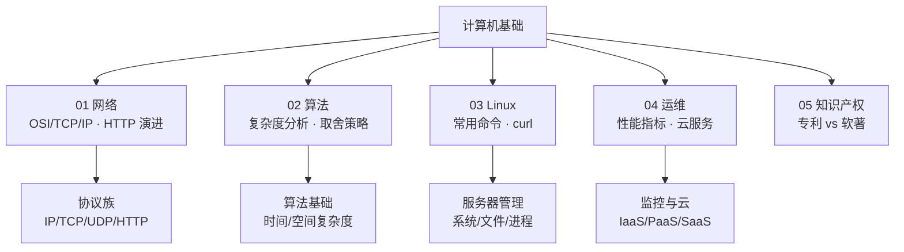

# 计算机基础

> 系统性整理计算机科学基础知识，涵盖网络、算法、系统运维、知识产权等核心领域。

---

## 目录导航

| 模块 | 内容 | 说明 |
|------|------|------|
| [01-网络](01-network/) | OSI/TCP/IP 模型 · 协议族 · HTTP 演进 · WCAG | 计算机网络体系结构与核心协议 |
| [02-算法](02-algorithms/) | 算法概述 · 时间/空间复杂度 · 取舍策略 | 算法基础理论与分析方法 |
| [03-Linux](03-linux/) | 常用命令 · curl 详解 | Linux 服务器管理与网络工具 |
| [04-运维](04-operations/) | 服务器性能指标 · 云服务模式 | 系统监控与云计算架构 |
| [05-知识产权](05-ipr/) | 专利 vs 软件著作权 | 技术成果保护策略 |

---

## 知识脉络

## 学习路径

- **基础必修**：网络 → 算法 → Linux
- **运维方向**：Linux → 运维 → 网络（深入协议）
- **速查定位**：按需查阅各模块

## 相关章节

- 上游：本模块是所有技术模块的基础
- 关联：[`04.system-design`](../04.system-design/) — 系统设计（网络/运维知识的上层应用）
- 关联：[`05.tools`](../05.tools/) — 工具链（Git/Docker/Nginx 等实操工具）
