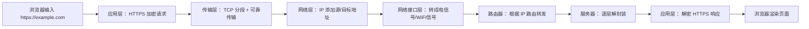

# TCP/IP（IP、TCP、UDP、ICMP）与 HTTP/HTTPS

互联网看似复杂，实则由一套精密的“数字交通规则”支撑——**TCP/IP 协议族**。它如同城市的道路系统（IP 负责定位，TCP/UDP 负责运输），而 **HTTP/HTTPS** 则是跑在道路上的“快递服务”。本文用一张图+核心逻辑，带你彻底理清它们的关系。

---

## 一、先看全景：TCP/IP 四层模型（简化版）
| **层级**    | **核心协议**         | **作用**          | **生活类比**          |
|-----------|------------------|-----------------|-------------------|
| **应用层**   | HTTP, HTTPS, DNS | 处理具体业务（如网页、邮件）  | **快递公司**（顺丰/京东）   |
| **传输层**   | TCP, UDP         | 端到端数据传输控制       | **货车类型**（冷链车/普通车） |
| **网络层**   | IP, ICMP         | 寻址与路由（找到目标设备）   | **GPS导航+道路系统**    |
| **网络接口层** | 以太网、WiFi         | 物理连接（光纤/网线/无线电） | **公路/桥梁/隧道**      |

> 💡 **关键逻辑**：数据从应用层向下封装（加协议头），到达目标后从下向上解封装（拆协议头）。  
> **示例**：当你访问 `https://example.com`：
> 1. 应用层（HTTPS）生成加密请求 →
> 2. 传输层（TCP）分段+编号 →
> 3. 网络层（IP）添加源/目标IP →
> 4. 网络接口层转换成电信号发送。

---

## 二、核心协议详解：各司其职的“交通管理者”
### 1. **IP 协议（Internet Protocol）**
- **作用**：为每台联网设备分配 **IP 地址**（如 `192.168.1.1` 或 `240e::1`），负责将数据包从源地址路由到目标地址。
- **关键特性**：
    - **无连接**：不保证送达（类似寄挂号信，邮局不保证你一定收到）。
    - **IPv4 vs IPv6**：IPv4 地址枯竭（约 43 亿个），IPv6 地址近乎无限（340 万亿亿亿亿个）。
- **依赖协议**：**ICMP**（Internet Control Message Protocol）
    - 用途：网络诊断工具（如 `ping` 命令就是发送 ICMP 回显请求）。
    - 重要性：当路由失败时，ICMP 会返回“目标不可达”等错误信息。

### 2. **TCP（Transmission Control Protocol）**
- **作用**：提供**可靠、有序**的数据传输，适用于文件下载、邮件等场景。
- **三大保障机制**：
    - **三次握手**：建立连接（“你好→收到你好→正式开始传数据”）。
    - **滑动窗口**：动态调整传输速度，避免网络拥堵。
    - **超时重传**：丢包时自动重发，确保数据完整。
- **代价**：延迟较高（需握手/确认），头部开销大（20字节+）。

### 3. **UDP（User Datagram Protocol）**
- **作用**：**无连接、低延迟**传输，适用于视频会议、游戏、DNS 查询。
- **核心特点**：
    - 不建立连接，直接发数据（“发完即走”）。
    - 无重传机制，可能丢包（但实时场景宁可丢包也不能卡顿）。
    - 头部仅 8 字节，效率极高。
- **典型场景**：腾讯会议语音包、王者荣耀操作指令。

> ✅ **TCP vs UDP 选择指南**：
> - 要**完整准确**？选 TCP（银行转账、网页加载）。
> - 要**速度/实时**？选 UDP（直播、IoT 传感器）。

---

## 三、HTTP 与 HTTPS：应用层的“快递服务”
### 1. **HTTP（Hypertext Transfer Protocol）**
- **作用**：规定客户端（浏览器）与服务器如何交换**超文本**（网页、图片、JSON）。
- **工作流程**：
  ```http
  GET /index.html HTTP/1.1   ← 请求行（方法+路径+协议版本）
  Host: example.com          ← 请求头（元数据）
  [空行]
  [请求体，如POST提交的表单]   ← 请求体
  ```
  服务器返回：
  ```http
  HTTP/1.1 200 OK            ← 状态行（协议+状态码+描述）
  Content-Type: text/html    ← 响应头
  [空行]
  <html>...</html>           ← 响应体
  ```
- **缺陷**：**明文传输**！黑客可窃听（如咖啡厅抓包获取密码）。

### 2. **HTTPS（HTTP Secure）**
- **本质**：HTTP + **SSL/TLS 加密层**（工作在传输层和应用层之间）。
- **三大安全能力**：
    1. **加密**：用非对称加密（RSA）交换密钥，再用对称加密（AES）传数据。
    2. **身份认证**：通过 **CA 证书** 验证服务器真伪（防止钓鱼网站）。
    3. **完整性**：用 MAC 算法校验数据是否被篡改。
- **如何识别**：浏览器地址栏显示 **🔒 + https://**。

> 🔐 **HTTPS 握手简化流程**：
> 1. 客户端说：“我想安全连接，请给我公钥。”
> 2. 服务器回复：“这是我的CA证书（含公钥）。”
> 3. 客户端验证证书 → 生成随机密钥 → 用公钥加密后发给服务器。
> 4. 服务器用私钥解密 → 双方用该密钥加密后续通信。

---

## 四、协议关系图：数据如何穿越互联网？


---

## 五、常见问题快答
❓ **Q：为什么先有 TCP 再有 HTTP？**  
→ TCP 解决“可靠传输”这一基础问题，HTTP 在其之上定义“如何传网页”。

❓ **Q：DNS 用 TCP 还是 UDP？**  
→ 主要用 **UDP**（53 端口，快！），但当响应数据 >512 字节时切到 TCP。

❓ **Q：QUIC 协议会取代 TCP 吗？**  
→ QUIC（基于 UDP）是 HTTP/3 的底层协议，解决 TCP 队头阻塞问题，已在 YouTube/Cloudflare 大规模应用。

❓ **Q：IPv6 普及了吗？**  
→ 中国 IPv6 活跃用户超 7.5 亿（2025 年数据），但双栈过渡期仍将持续 5-10 年。

---

## 六、总结：一张表掌握核心差异
| **协议**    | **层级** | **连接类型** | **可靠性** | **速度** | **典型场景**        |
|-----------|--------|----------|---------|--------|-----------------|
| **IP**    | 网络层    | 无连接      | 不可靠     | -      | 所有网络通信基础        |
| **ICMP**  | 网络层    | 无连接      | 不可靠     | -      | Ping/Traceroute |
| **TCP**   | 传输层    | 面向连接     | 可靠      | 慢      | 网页/邮件/文件下载      |
| **UDP**   | 传输层    | 无连接      | 不可靠     | 快      | 视频/游戏/DNS       |
| **HTTP**  | 应用层    | 依赖 TCP   | 依赖 TCP  | -      | 非加密网页           |
| **HTTPS** | 应用层+安全 | 依赖 TCP   | 依赖 TCP  | 略慢     | 网银/登录/支付        |

> 💎 **终极心法**：
> - **IP 是地图**，**TCP/UDP 是车辆**，**HTTP/HTTPS 是货物包装标准**。
> - 安全无小事！2026 年起，所有主流浏览器已**默认阻止非 HTTPS 页面**，开发者必须全面拥抱 HTTPS。